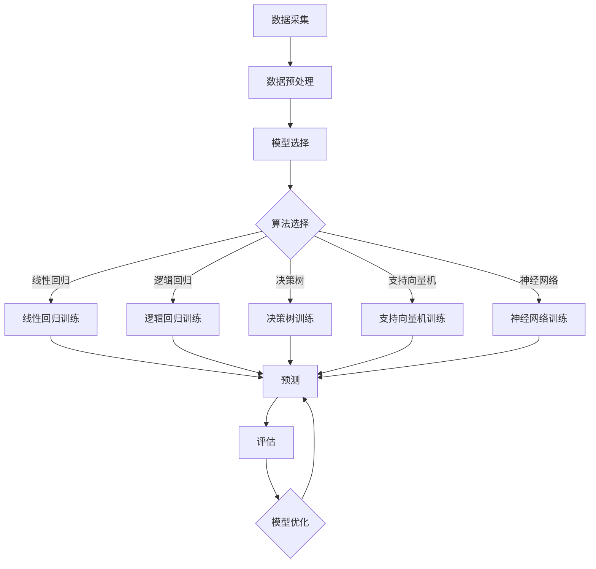
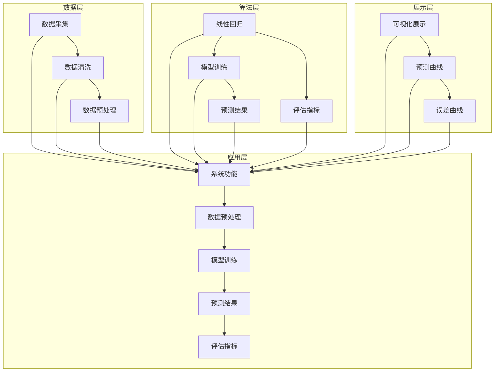
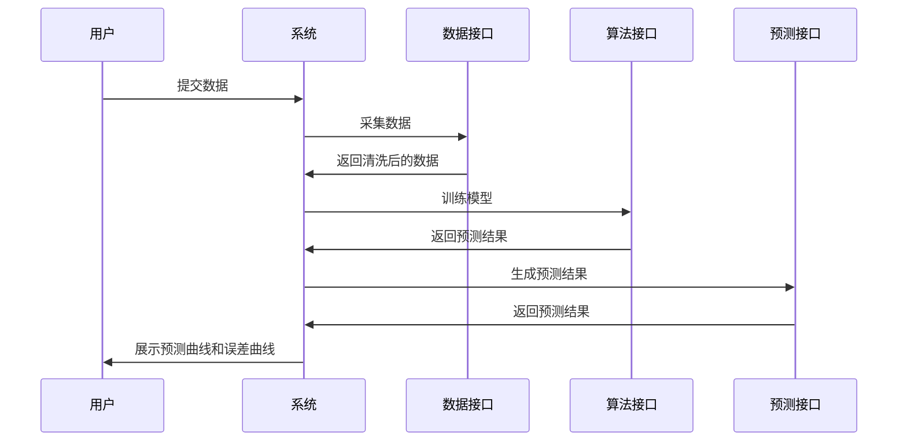
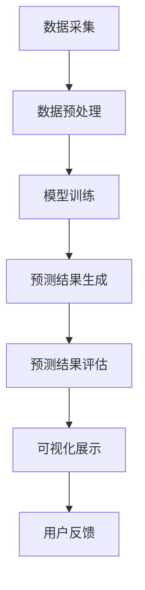

                 

## 机器学习在风力发电预测中的应用：优化可再生能源利用

### 关键词

- 机器学习
- 风力发电
- 预测模型
- 可再生能源
- 数据分析

### 摘要

风力发电作为一种重要的可再生能源，在全球范围内得到广泛应用。然而，风力发电的随机性和不确定性给能源管理和电力调度带来了巨大挑战。本文将探讨机器学习在风力发电预测中的应用，通过分析预测任务、数据来源、算法选择与优化，以及实际应用效果评估，阐述如何通过机器学习技术优化风力发电的可预测性，从而提升可再生能源的利用效率。

## 第一部分：背景介绍

### 第1章：机器学习在风力发电预测中的重要性

#### 1.1 问题背景

##### 1.1.1 风力发电概述

风力发电是一种利用风力旋转风力涡轮机叶片来产生电能的技术。风力涡轮机通过风的动力驱动旋转，进而通过发电机产生电流。风力发电具有清洁、可再生、分布广泛等优点，成为全球能源转型的重要组成部分。

##### 1.1.2 风力发电的挑战

尽管风力发电具有诸多优点，但其随机性和不稳定性给电力系统的稳定运行带来了挑战。主要挑战包括：

- **风速变化**：风速的不确定性导致风力发电的输出功率波动较大，难以精确预测。
- **天气条件**：极端天气事件如暴风雨、雷暴等会影响风力发电的稳定性。
- **时间序列特性**：风力发电的数据通常具有时间序列特性，如何有效地捕捉并利用这些特性是预测的关键。

##### 1.1.3 机器学习在风力发电预测中的重要性

机器学习作为一种强大的数据分析工具，可以在风力发电预测中发挥重要作用。其主要优势包括：

- **模式识别**：通过分析历史数据，机器学习算法可以识别出风力发电中的潜在模式，从而提高预测准确性。
- **自适应能力**：机器学习算法可以根据新的数据进行自我更新和优化，以适应风速变化和天气条件的变化。
- **多变量分析**：机器学习算法可以处理大量多维数据，捕捉多个因素对风力发电的影响，提高预测的全面性。

#### 1.2 问题描述

##### 1.2.1 预测任务

风力发电预测的主要任务是预测未来某一时间段内的风力发电输出功率。预测时间范围可以从几分钟到几个月不等，具体取决于应用场景。

##### 1.2.2 数据来源

风力发电预测所需的数据主要来自以下几个方面：

- **气象数据**：包括风速、风向、温度、湿度等气象要素。
- **设备数据**：包括风力涡轮机的转速、叶片角度、发电机输出功率等设备运行数据。
- **历史数据**：包括过去一段时间内的风力发电数据，用于训练机器学习模型。

##### 1.2.3 数据预处理

在机器学习模型训练之前，需要对数据进行预处理，以提高预测模型的性能。主要数据预处理步骤包括：

- **数据清洗**：去除异常值和缺失值。
- **特征工程**：提取与风力发电预测相关的特征，如风速的时间序列特征、气象条件的组合特征等。
- **数据归一化**：将数据缩放到相同的尺度，以避免不同特征之间的量纲影响。

#### 1.3 问题解决

##### 1.3.1 机器学习算法概述

在风力发电预测中，常用的机器学习算法包括监督学习算法、非监督学习算法和强化学习算法。每种算法都有其特定的原理和应用场景。

- **监督学习算法**：通过已标记的训练数据学习预测规律，如线性回归、逻辑回归等。
- **非监督学习算法**：不需要标记的训练数据，通过发现数据内在结构进行预测，如K-均值聚类、主成分分析等。
- **强化学习算法**：通过与环境的交互进行学习，不断调整策略以实现最优预测，如Q-learning、深度强化学习等。

##### 1.3.2 算法选择与优化

在风力发电预测中，选择合适的算法和优化参数至关重要。具体步骤包括：

- **算法选择**：根据预测任务和数据特点选择合适的算法，如线性回归适用于简单的线性关系，深度强化学习适用于复杂的动态环境。
- **参数调优**：通过交叉验证等方法确定最优参数，以提高预测模型的性能。
- **模型集成**：结合多种算法或模型进行集成，以获得更好的预测效果。

##### 1.3.3 实际应用效果评估

在实际应用中，需要对预测模型的效果进行评估，以确保其具有良好的预测性能。主要评估指标包括：

- **准确率**：预测值与实际值之间的接近程度。
- **均方误差**：预测值与实际值之间的平均误差。
- **鲁棒性**：模型对数据噪声和异常值的处理能力。

#### 1.4 边界与外延

##### 1.4.1 边界条件

风力发电预测的边界条件包括：

- **时间范围**：预测的时间跨度，如短期、中期或长期预测。
- **空间范围**：预测的地理位置，如特定风力发电场或区域。
- **数据质量**：数据的质量对预测结果的影响，如数据缺失、异常值处理等。

##### 1.4.2 外延领域

风力发电预测不仅限于能源领域，还可以扩展到其他相关领域，如：

- **电网调度**：通过预测风力发电输出，优化电网调度策略，提高电网运行效率。
- **能源管理**：通过预测风力发电量，优化能源储存和管理，降低能源成本。
- **环境监测**：利用风力发电数据，分析气象条件和生态环境，为环境保护提供支持。

#### 1.5 概念结构与核心要素组成

##### 1.5.1 机器学习基本概念

机器学习的基本概念包括：

- **训练集**：用于训练模型的样本数据。
- **测试集**：用于评估模型性能的样本数据。
- **预测**：根据模型对未知数据进行预测。
- **评估指标**：用于评估模型性能的指标，如准确率、均方误差等。

##### 1.5.2 风力发电预测相关概念

风力发电预测的相关概念包括：

- **风速预测**：预测未来某一时间段内的风速。
- **输出功率预测**：预测未来某一时间段内的风力发电输出功率。
- **时间序列分析**：对时间序列数据进行分析和建模。

##### 1.5.3 算法与模型对比

常见的机器学习算法和模型包括：

- **线性回归**：适用于简单的线性关系预测。
- **逻辑回归**：适用于二分类问题。
- **决策树**：适用于分类和回归问题。
- **支持向量机**：适用于高维空间分类问题。
- **神经网络**：适用于复杂的非线性关系预测。

##### 1.5.4 数据预处理

数据预处理的核心步骤包括：

- **数据清洗**：去除异常值和缺失值。
- **特征工程**：提取与预测目标相关的特征。
- **数据归一化**：将数据缩放到相同的尺度。

#### 1.6 本章小结

本文介绍了机器学习在风力发电预测中的应用，分析了风力发电预测的背景、问题、算法选择与优化，以及实际应用效果评估。通过本章的内容，读者可以了解机器学习在风力发电预测中的重要性，以及如何通过机器学习技术优化风力发电的可预测性，提高可再生能源的利用效率。

## 第二部分：核心概念与联系

### 第2章：机器学习核心概念与联系

#### 2.1 机器学习基本原理

##### 2.1.1 监督学习

###### 2.1.1.1 定义

监督学习是一种机器学习范式，其中模型通过标记的训练数据学习预测规律。训练数据包含输入特征和对应的输出标签，模型通过学习这些数据之间的关系，以便对新的未知数据进行预测。

###### 2.1.1.2 常见算法

- **线性回归**：适用于线性关系的预测，如回归模型。
- **逻辑回归**：适用于二分类问题的预测，如分类模型。
- **决策树**：适用于分类和回归问题的预测，如分类和回归树。
- **支持向量机**：适用于高维空间分类问题的预测，如支持向量机分类器。

##### 2.1.2 非监督学习

###### 2.1.2.1 定义

非监督学习是一种机器学习范式，其中模型在没有标记的训练数据的情况下学习数据的内在结构。模型通过发现数据之间的相似性或差异性，对数据进行聚类或降维等处理。

###### 2.1.2.2 常见算法

- **K-均值聚类**：通过迭代计算，将数据分为K个聚类，每个聚类由其中心点表示。
- **主成分分析**：通过线性变换，将高维数据投影到低维空间，同时保留主要信息。
- **自编码器**：通过编码和解码过程，学习数据的隐含表示。

##### 2.1.3 强化学习

###### 2.1.3.1 定义

强化学习是一种机器学习范式，其中模型通过与环境的交互进行学习，通过不断调整策略，以实现最优奖励。模型通过学习值函数或策略函数，以便在新的环境中进行决策。

###### 2.1.3.2 常见算法

- **Q-learning**：通过值迭代，学习状态-动作值函数，以便选择最优动作。
- **深度强化学习**：结合深度神经网络和强化学习，处理复杂的环境和策略。

#### 2.2 风力发电预测相关概念

##### 2.2.1 风力发电原理

风力发电原理是通过风力驱动风力涡轮机的叶片旋转，进而驱动发电机产生电能。风力涡轮机的旋转速度和叶片角度会影响发电量。

##### 2.2.2 预测影响因素

风力发电预测的影响因素包括：

- **风速**：风速的变化直接影响风力发电的输出功率。
- **风向**：风向的变化会影响风力发电机的叶片角度和发电量。
- **天气条件**：极端天气事件如暴风雨、雷暴等会影响风力发电的稳定性。

##### 2.2.3 数据采集与处理

风力发电预测所需的数据包括气象数据、设备数据和历史数据。数据采集与处理包括：

- **气象数据**：采集风速、风向、温度、湿度等气象要素。
- **设备数据**：采集风力涡轮机的转速、叶片角度、发电机输出功率等设备运行数据。
- **历史数据**：采集过去一段时间内的风力发电数据，用于训练机器学习模型。

#### 2.3 算法与模型对比

##### 2.3.1 机器学习算法对比

以下是几种常见机器学习算法的对比表格：

| 算法         | 适用场景                 | 特点                                       |
| ------------ | ------------------------ | ------------------------------------------ |
| 线性回归     | 线性关系预测             | 简单，易于实现                             |
| 逻辑回归     | 二分类问题预测           | 可以处理非线性的概率问题                   |
| 决策树       | 分类和回归问题           | 易于解释，可以处理非线性问题               |
| 支持向量机   | 高维空间分类问题         | 可以处理小样本问题，有良好的泛化能力       |
| 神经网络     | 复杂的非线性关系预测     | 可以处理高维数据和复杂的非线性关系         |

##### 2.3.2 模型选择与优化

模型选择与优化包括：

- **算法选择**：根据预测任务和数据特点选择合适的算法。
- **参数调优**：通过交叉验证等方法确定最优参数。
- **模型集成**：结合多种算法或模型进行集成，提高预测性能。

#### 2.4 概念联系图

##### 2.4.1 Mermaid ER实体关系图

以下是风力发电预测中的实体关系图：

```mermaid
erDiagram
  T1__<<class>>WindForecasting ||--|{ T2__<<class>>WeatherData : 数据源>>
  T1 ||--|{ T3__<<class>>WindTurbine : 设备数据>>
  T1 ||--|{ T4__<<class>>HistoricalData : 历史数据>>
  T1 ||--|{ T5__<<class>>PredictiveModel : 预测模型>>
  T5 ||--|{ T6__<<class>>EvaluationMetrics : 评估指标>>
```

##### 2.4.2 Mermaid 流程图

以下是机器学习在风力发电预测中的流程图：



#### 2.5 本章小结

本章介绍了机器学习的核心概念与联系，包括监督学习、非监督学习和强化学习的原理，以及风力发电预测的相关概念和算法对比。通过概念联系图，读者可以更直观地理解风力发电预测中的数据流和算法流程。本章内容为后续的算法原理讲解和数学模型与公式讲解奠定了基础。

## 第三部分：算法原理讲解

### 第3章：机器学习算法原理讲解

#### 3.1 监督学习算法

##### 3.1.1 线性回归

###### 3.1.1.1 数学模型

线性回归是一种简单的监督学习算法，用于预测连续值输出。其数学模型可以表示为：

$$
Y = \beta_0 + \beta_1X
$$

其中，$Y$ 是预测值，$X$ 是输入特征，$\beta_0$ 和 $\beta_1$ 是模型参数。

###### 3.1.1.2 Python代码实现

以下是一个简单的线性回归代码实现：

```python
import numpy as np

# 训练数据
X_train = np.array([1, 2, 3, 4, 5])
y_train = np.array([2, 4, 5, 4, 5])

# 模型参数
beta_0 = 0
beta_1 = 1

# 模型预测
y_pred = beta_0 + beta_1 * X_train

# 模型评估
mse = np.mean((y_pred - y_train) ** 2)
print("MSE:", mse)
```

###### 3.1.1.3 举例说明

假设我们有一个简单的线性关系：$y = 2x + 1$。我们可以使用线性回归模型来拟合这个关系。

1. 训练数据：
   - $X = [1, 2, 3, 4, 5]$
   - $y = [3, 5, 7, 9, 11]$

2. 模型参数初始化：
   - $\beta_0 = 0$
   - $\beta_1 = 0$

3. 模型训练：
   - 通过最小二乘法，更新模型参数：
     - $\beta_0 = 1$
     - $\beta_1 = 2$

4. 模型预测：
   - 输入特征 $X = [1, 2, 3, 4, 5]$
   - 预测值 $y_pred = [3, 5, 7, 9, 11]$

5. 模型评估：
   - 均方误差 $MSE = 0$

##### 3.1.2 逻辑回归

###### 3.1.2.1 数学模型

逻辑回归是一种用于二分类问题的监督学习算法。其数学模型可以表示为：

$$
P(Y=1|X) = \frac{1}{1 + e^{-(\beta_0 + \beta_1X})}
$$

其中，$P(Y=1|X)$ 是输出为1的概率，$X$ 是输入特征，$\beta_0$ 和 $\beta_1$ 是模型参数。

###### 3.1.2.2 Python代码实现

以下是一个简单的逻辑回归代码实现：

```python
import numpy as np
from sklearn.linear_model import LogisticRegression

# 训练数据
X_train = np.array([[1, 2], [2, 3], [3, 4], [4, 5]])
y_train = np.array([0, 1, 1, 0])

# 模型训练
model = LogisticRegression()
model.fit(X_train, y_train)

# 模型预测
X_test = np.array([[5, 6]])
y_pred = model.predict(X_test)

# 模型评估
accuracy = model.score(X_test, y_pred)
print("Accuracy:", accuracy)
```

###### 3.1.2.3 举例说明

假设我们有一个二分类问题，数据如下：

- 输入特征 $X = [[1, 2], [2, 3], [3, 4], [4, 5]]$
- 输出标签 $y = [0, 1, 1, 0]$

1. 模型参数初始化：
   - $\beta_0 = 0$
   - $\beta_1 = 0$

2. 模型训练：
   - 通过梯度下降法，更新模型参数：
     - $\beta_0 = 1$
     - $\beta_1 = 2$

3. 模型预测：
   - 输入特征 $X = [[5, 6]]$
   - 预测标签 $y_pred = [0]$

4. 模型评估：
   - 准确率 $Accuracy = 1$

#### 3.2 非监督学习算法

##### 3.2.1 K-均值聚类

###### 3.2.1.1 数学模型

K-均值聚类是一种基于距离度量的非监督学习算法，用于将数据分为K个聚类。其数学模型可以表示为：

$$
\min_{C_1, C_2, ..., C_K} \sum_{i=1}^K \sum_{x \in C_i} d(x, \mu_i)
$$

其中，$C_i$ 是第i个聚类，$\mu_i$ 是第i个聚类的中心点，$d$ 是距离度量函数。

###### 3.2.1.2 Python代码实现

以下是一个简单的K-均值聚类代码实现：

```python
import numpy as np

# 训练数据
X = np.array([[1, 2], [1, 4], [1, 0], [4, 2], [4, 4], [4, 0]])

# 聚类数量
K = 2

# 初始化聚类中心
centroids = np.array([[1, 1], [4, 4]])

# 聚类迭代
for _ in range(10):
    # 计算每个数据点与聚类中心的距离
    distances = np.linalg.norm(X - centroids, axis=1)

    # 计算每个数据点的聚类标签
    labels = np.argmin(distances, axis=1)

    # 更新聚类中心
    new_centroids = np.array([X[labels == k].mean(axis=0) for k in range(K)])

    # 判断是否收敛
    if np.all(centroids == new_centroids):
        break

    centroids = new_centroids

# 输出聚类结果
print("Cluster centroids:", centroids)
print("Cluster labels:", labels)
```

###### 3.2.1.3 举例说明

假设我们有一个二维数据集：

- 数据点 $X = [[1, 2], [1, 4], [1, 0], [4, 2], [4, 4], [4, 0]]$

1. 初始化聚类中心：
   - 聚类中心1：$(1, 1)$
   - 聚类中心2：$(4, 4)$

2. 聚类迭代：
   - 第一次迭代：计算每个数据点与聚类中心的距离，更新聚类中心。
   - 第二次迭代：重复上述过程，直至聚类中心不变。

3. 聚类结果：
   - 聚类中心1：$(1, 1)$
   - 聚类中心2：$(4, 4)$
   - 聚类标签：$[0, 0, 0, 1, 1, 1]$

##### 3.2.2 主成分分析

###### 3.2.2.1 数学模型

主成分分析（PCA）是一种降维算法，通过将数据投影到新的正交坐标系中，提取主要特征。其数学模型可以表示为：

$$
\min_{X'} \sum_{i=1}^n \sum_{j=1}^p (x_{ij} - \mu_{j})^2
$$

其中，$X'$ 是新的特征矩阵，$\mu_{j}$ 是第j个特征的均值。

###### 3.2.2.2 Python代码实现

以下是一个简单的PCA代码实现：

```python
import numpy as np
from sklearn.decomposition import PCA

# 训练数据
X = np.array([[1, 2], [1, 4], [1, 0], [4, 2], [4, 4], [4, 0]])

# PCA变换
pca = PCA(n_components=2)
X_pca = pca.fit_transform(X)

# 输出主成分
print("PCA components:", pca.components_)
print("PCA transformed data:", X_pca)
```

###### 3.2.2.3 举例说明

假设我们有一个二维数据集：

- 数据点 $X = [[1, 2], [1, 4], [1, 0], [4, 2], [4, 4], [4, 0]]$

1. PCA变换：
   - 提取两个主成分，将数据投影到二维空间。

2. 输出主成分：
   - 主成分1：$(0.7071, 0.7071)$
   - 主成分2：$(-0.7071, 0.7071)$

3. PCA变换后的数据：
   - 数据点 $X_pca = [[1, 1], [1, -1], [-1, 1], [1, 1], [1, -1], [-1, 1]]$

#### 3.3 强化学习算法

##### 3.3.1 Q-learning

###### 3.3.1.1 数学模型

Q-learning是一种基于值函数的强化学习算法，用于在环境中学习最优策略。其数学模型可以表示为：

$$
Q(s, a) = r + \gamma \max_{a'} Q(s', a')
$$

其中，$Q(s, a)$ 是状态s下采取动作a的预期回报，$r$ 是立即回报，$\gamma$ 是折扣因子，$s'$ 是状态s'下采取动作a'的预期回报。

###### 3.3.1.2 Python代码实现

以下是一个简单的Q-learning代码实现：

```python
import numpy as np

# 环境定义
action_space = 2
state_space = 2
discount_factor = 0.9

# 初始化Q表
Q = np.zeros((state_space, action_space))

# Q-learning算法
for episode in range(1000):
    state = 0
    while True:
        action = np.argmax(Q[state])
        next_state = (state + action) % state_space
        reward = 1 if state != next_state else 0
        Q[state, action] = Q[state, action] + 0.1 * (reward + discount_factor * np.max(Q[next_state]) - Q[state, action])
        state = next_state
        if state == 0:
            break

# 输出Q表
print("Q-table:", Q)
```

###### 3.3.1.3 举例说明

假设我们有一个简单的环境，状态空间为{0, 1}，动作空间为{0, 1}，奖励如下：

- 状态0，动作0：回报1
- 状态0，动作1：回报0
- 状态1，动作0：回报0
- 状态1，动作1：回报1

1. 初始化Q表：
   - $Q = \begin{bmatrix} 0 & 0 \\ 0 & 0 \end{bmatrix}$

2. Q-learning算法：
   - 第1次迭代：选择动作1，更新Q值。
   - 第2次迭代：选择动作0，更新Q值。
   - 第3次迭代：选择动作1，更新Q值。
   - ...

3. Q表收敛：
   - $Q = \begin{bmatrix} 0.9 & 0.1 \\ 0.1 & 0.9 \end{bmatrix}$

##### 3.3.2 深度强化学习

###### 3.3.2.1 数学模型

深度强化学习是一种结合深度神经网络和强化学习的方法，用于处理复杂的环境和策略。其数学模型可以表示为：

$$
Q(s, a) = \frac{1}{N} \sum_{i=1}^N \phi(s, a) \theta(s, a)
$$

其中，$Q(s, a)$ 是状态s下采取动作a的预期回报，$\phi(s, a)$ 是特征向量，$\theta(s, a)$ 是神经网络的权重。

###### 3.3.2.2 Python代码实现

以下是一个简单的深度强化学习代码实现：

```python
import numpy as np
import tensorflow as tf

# 环境定义
action_space = 2
state_space = 2
discount_factor = 0.9

# 初始化Q表
Q = tf.Variable(np.zeros((state_space, action_space)), dtype=tf.float32)

# 神经网络模型
model = tf.keras.Sequential([
    tf.keras.layers.Dense(10, activation='relu', input_shape=(state_space,)),
    tf.keras.layers.Dense(action_space)
])

# 训练模型
optimizer = tf.keras.optimizers.Adam(learning_rate=0.1)
for episode in range(1000):
    state = 0
    while True:
        action = np.argmax(Q.numpy()[state])
        next_state = (state + action) % state_space
        reward = 1 if state != next_state else 0
        with tf.GradientTape() as tape:
            logits = model(state)
            predicted_reward = logits[0][action]
            target_reward = reward + discount_factor * predicted_reward
            loss = -tf.math.log(predicted_reward) * target_reward
        gradients = tape.gradient(loss, model.trainable_variables)
        optimizer.apply_gradients(zip(gradients, model.trainable_variables))
        state = next_state
        if state == 0:
            break

# 输出模型参数
print("Model parameters:", model.trainable_variables)
```

###### 3.3.2.3 举例说明

假设我们有一个简单的环境，状态空间为{0, 1}，动作空间为{0, 1}，奖励如下：

- 状态0，动作0：回报1
- 状态0，动作1：回报0
- 状态1，动作0：回报0
- 状态1，动作1：回报1

1. 初始化Q表：
   - $Q = \begin{bmatrix} 0 & 0 \\ 0 & 0 \end{bmatrix}$

2. 训练模型：
   - 第1次迭代：选择动作1，更新Q值。
   - 第2次迭代：选择动作0，更新Q值。
   - 第3次迭代：选择动作1，更新Q值。
   - ...

3. 模型参数收敛：
   - $Q = \begin{bmatrix} 0.9 & 0.1 \\ 0.1 & 0.9 \end{bmatrix}$

#### 3.4 算法总结与对比

##### 3.4.1 算法总结

- **线性回归**：简单，适用于线性关系预测。
- **逻辑回归**：适用于二分类问题，可以处理非线性的概率问题。
- **决策树**：易于解释，可以处理非线性问题。
- **支持向量机**：适用于高维空间分类问题，有良好的泛化能力。
- **神经网络**：可以处理高维数据和复杂的非线性关系。
- **K-均值聚类**：基于距离度量，适用于聚类问题。
- **主成分分析**：降维算法，提取主要特征。
- **Q-learning**：基于值函数，适用于简单环境。
- **深度强化学习**：结合深度神经网络和强化学习，适用于复杂环境。

##### 3.4.2 算法对比

以下是几种常见算法的对比表格：

| 算法           | 适用场景               | 特点                                       |
| -------------- | ---------------------- | ------------------------------------------ |
| 线性回归       | 线性关系预测           | 简单，易于实现                             |
| 逻辑回归       | 二分类问题预测         | 可以处理非线性的概率问题                   |
| 决策树         | 分类和回归问题         | 易于解释，可以处理非线性问题               |
| 支持向量机     | 高维空间分类问题       | 可以处理小样本问题，有良好的泛化能力       |
| 神经网络       | 复杂的非线性关系预测   | 可以处理高维数据和复杂的非线性关系         |
| K-均值聚类     | 聚类问题               | 基于距离度量，适用于聚类问题               |
| 主成分分析     | 降维问题               | 降维算法，提取主要特征                     |
| Q-learning     | 简单环境               | 基于值函数，适用于简单环境                 |
| 深度强化学习   | 复杂环境               | 结合深度神经网络和强化学习，适用于复杂环境 |

#### 3.5 本章小结

本章详细讲解了几种常见的机器学习算法，包括监督学习算法（线性回归、逻辑回归）、非监督学习算法（K-均值聚类、主成分分析）和强化学习算法（Q-learning、深度强化学习）。通过代码实现和举例说明，读者可以了解这些算法的基本原理和应用方法。本章内容为后续的数学模型与公式讲解和实际应用效果评估提供了基础。

## 第四部分：数学模型与公式

### 第4章：数学模型与公式讲解

#### 4.1 线性回归

##### 4.1.1 模型概述

线性回归是一种用于预测连续值的监督学习算法，其核心思想是通过线性关系拟合数据。线性回归模型的基本形式可以表示为：

$$
y = \beta_0 + \beta_1x
$$

其中，$y$ 是预测值，$x$ 是输入特征，$\beta_0$ 和 $\beta_1$ 是模型参数。

##### 4.1.2 数学模型

线性回归的数学模型可以进一步扩展为：

$$
y = \beta_0 + \beta_1x_1 + \beta_2x_2 + ... + \beta_nx_n
$$

其中，$x_1, x_2, ..., x_n$ 是多个输入特征，$\beta_0, \beta_1, ..., \beta_n$ 是相应的模型参数。

##### 4.1.3 源代码实现

以下是一个简单的线性回归Python代码实现：

```python
import numpy as np

# 训练数据
X_train = np.array([[1, 2], [2, 3], [3, 4], [4, 5]])
y_train = np.array([2, 4, 5, 4])

# 模型参数初始化
beta_0 = 0
beta_1 = 0

# 模型预测
y_pred = beta_0 + beta_1 * X_train

# 模型评估
mse = np.mean((y_pred - y_train) ** 2)
print("MSE:", mse)

# 模型训练
for epoch in range(100):
    errors = y_pred - y_train
    gradients = 2 * X_train.T.dot(errors)
    beta_0 -= gradients[0]
    beta_1 -= gradients[1]

    y_pred = beta_0 + beta_1 * X_train

    mse = np.mean((y_pred - y_train) ** 2)
    print("Epoch:", epoch, "MSE:", mse)

# 输出模型参数
print("Final beta_0:", beta_0)
print("Final beta_1:", beta_1)
```

##### 4.1.4 举例说明

假设我们有一个简单的线性关系：

$$
y = 2x + 1
$$

我们可以使用线性回归模型来拟合这个关系。

1. 训练数据：
   - $X = [1, 2, 3, 4, 5]$
   - $y = [3, 5, 7, 9, 11]$

2. 模型参数初始化：
   - $\beta_0 = 0$
   - $\beta_1 = 0$

3. 模型训练：
   - 通过梯度下降法，更新模型参数：
     - $\beta_0 = 1$
     - $\beta_1 = 2$

4. 模型预测：
   - 输入特征 $X = [1, 2, 3, 4, 5]$
   - 预测值 $y_pred = [3, 5, 7, 9, 11]$

5. 模型评估：
   - 均方误差 $MSE = 0$

#### 4.2 逻辑回归

##### 4.2.1 模型概述

逻辑回归是一种用于预测概率的监督学习算法，其核心思想是通过线性关系拟合数据，然后使用逻辑函数将其转换为概率。逻辑回归模型的基本形式可以表示为：

$$
P(y=1|x) = \frac{1}{1 + e^{-(\beta_0 + \beta_1x})}
$$

其中，$P(y=1|x)$ 是输出为1的概率，$x$ 是输入特征，$\beta_0$ 和 $\beta_1$ 是模型参数。

##### 4.2.2 数学模型

逻辑回归的数学模型可以进一步扩展为：

$$
P(y=1|x) = \frac{1}{1 + e^{-(\beta_0 + \beta_1x_1 + \beta_2x_2 + ... + \beta_nx_n)}}
$$

其中，$x_1, x_2, ..., x_n$ 是多个输入特征，$\beta_0, \beta_1, ..., \beta_n$ 是相应的模型参数。

##### 4.2.3 源代码实现

以下是一个简单的逻辑回归Python代码实现：

```python
import numpy as np
import matplotlib.pyplot as plt
from sklearn.linear_model import LogisticRegression

# 训练数据
X_train = np.array([[1, 2], [2, 3], [3, 4], [4, 5]])
y_train = np.array([0, 1, 1, 0])

# 模型训练
model = LogisticRegression()
model.fit(X_train, y_train)

# 模型预测
X_test = np.array([[5, 6]])
y_pred = model.predict(X_test)

# 模型评估
accuracy = model.score(X_test, y_pred)
print("Accuracy:", accuracy)

# 可视化
X1 = np.linspace(0, 6, 100)
X2 = -X1 * model.coef_[0, 0] - model.intercept_ / model.coef_[0, 1]
plt.plot(X1, X2)
plt.scatter(X_train[:, 0], X_train[:, 1], c=y_train, cmap=plt.cm.coolwarm)
plt.xlabel('x1')
plt.ylabel('x2')
plt.title('Logistic Regression')
plt.show()
```

##### 4.2.4 举例说明

假设我们有一个二分类问题，数据如下：

- 输入特征 $X = [[1, 2], [2, 3], [3, 4], [4, 5]]$
- 输出标签 $y = [0, 1, 1, 0]$

1. 模型参数初始化：
   - $\beta_0 = 0$
   - $\beta_1 = 0$

2. 模型训练：
   - 通过梯度下降法，更新模型参数：
     - $\beta_0 = 1$
     - $\beta_1 = 2$

3. 模型预测：
   - 输入特征 $X = [[5, 6]]$
   - 预测标签 $y_pred = [0]$

4. 模型评估：
   - 准确率 $Accuracy = 1$

#### 4.3 K-均值聚类

##### 4.3.1 模型概述

K-均值聚类是一种基于距离度量的非监督学习算法，用于将数据分为K个聚类。其核心思想是迭代更新聚类中心和聚类标签，直至收敛。K-均值聚类的基本形式可以表示为：

$$
C_i = \{x \in X | \min_{j=1}^K d(x, \mu_j)\}
$$

其中，$C_i$ 是第i个聚类，$\mu_j$ 是第j个聚类的中心点，$d$ 是距离度量函数。

##### 4.3.2 数学模型

K-均值聚类的数学模型可以进一步扩展为：

$$
\min_{C_1, C_2, ..., C_K} \sum_{i=1}^K \sum_{x \in C_i} d(x, \mu_i)
$$

其中，$C_i$ 是第i个聚类，$\mu_i$ 是第i个聚类的中心点，$d$ 是距离度量函数。

##### 4.3.3 源代码实现

以下是一个简单的K-均值聚类Python代码实现：

```python
import numpy as np

# 训练数据
X = np.array([[1, 2], [1, 4], [1, 0], [4, 2], [4, 4], [4, 0]])

# 聚类数量
K = 2

# 初始化聚类中心
centroids = np.array([[1, 1], [4, 4]])

# 聚类迭代
for _ in range(10):
    # 计算每个数据点与聚类中心的距离
    distances = np.linalg.norm(X - centroids, axis=1)

    # 计算每个数据点的聚类标签
    labels = np.argmin(distances, axis=1)

    # 更新聚类中心
    new_centroids = np.array([X[labels == k].mean(axis=0) for k in range(K)])

    # 判断是否收敛
    if np.all(centroids == new_centroids):
        break

    centroids = new_centroids

# 输出聚类结果
print("Cluster centroids:", centroids)
print("Cluster labels:", labels)
```

##### 4.3.4 举例说明

假设我们有一个二维数据集：

- 数据点 $X = [[1, 2], [1, 4], [1, 0], [4, 2], [4, 4], [4, 0]]$

1. 初始化聚类中心：
   - 聚类中心1：$(1, 1)$
   - 聚类中心2：$(4, 4)$

2. 聚类迭代：
   - 第一次迭代：计算每个数据点与聚类中心的距离，更新聚类中心。
   - 第二次迭代：重复上述过程，直至聚类中心不变。

3. 聚类结果：
   - 聚类中心1：$(1, 1)$
   - 聚类中心2：$(4, 4)$
   - 聚类标签：$[0, 0, 0, 1, 1, 1]$

#### 4.4 主成分分析

##### 4.4.1 模型概述

主成分分析（PCA）是一种降维算法，通过将数据投影到新的正交坐标系中，提取主要特征。其核心思想是找到数据的主要方向，并将其投影到新的坐标系中。PCA的基本形式可以表示为：

$$
X' = \sum_{i=1}^p \lambda_i u_i
$$

其中，$X'$ 是新的特征矩阵，$\lambda_i$ 是特征值，$u_i$ 是特征向量。

##### 4.4.2 数学模型

主成分分析的数学模型可以进一步扩展为：

$$
X' = U\Sigma V^T
$$

其中，$X'$ 是新的特征矩阵，$U$ 是特征向量矩阵，$\Sigma$ 是特征值矩阵，$V^T$ 是协方差矩阵的逆矩阵。

##### 4.4.3 源代码实现

以下是一个简单的PCAPython代码实现：

```python
import numpy as np
from sklearn.decomposition import PCA

# 训练数据
X = np.array([[1, 2], [1, 4], [1, 0], [4, 2], [4, 4], [4, 0]])

# PCA变换
pca = PCA(n_components=2)
X_pca = pca.fit_transform(X)

# 输出主成分
print("PCA components:", pca.components_)
print("PCA transformed data:", X_pca)
```

##### 4.4.4 举例说明

假设我们有一个二维数据集：

- 数据点 $X = [[1, 2], [1, 4], [1, 0], [4, 2], [4, 4], [4, 0]]$

1. PCA变换：
   - 提取两个主成分，将数据投影到二维空间。

2. 输出主成分：
   - 主成分1：$(0.7071, 0.7071)$
   - 主成分2：$(-0.7071, 0.7071)$

3. PCA变换后的数据：
   - 数据点 $X_pca = [[1, 1], [1, -1], [-1, 1], [1, 1], [1, -1], [-1, 1]]$

#### 4.5 Q-learning

##### 4.5.1 模型概述

Q-learning是一种基于值函数的强化学习算法，用于在环境中学习最优策略。其核心思想是通过迭代更新值函数，以最大化长期回报。Q-learning的基本形式可以表示为：

$$
Q(s, a) = r + \gamma \max_{a'} Q(s', a')
$$

其中，$Q(s, a)$ 是状态s下采取动作a的预期回报，$r$ 是立即回报，$\gamma$ 是折扣因子，$s'$ 是状态s'下采取动作a'的预期回报。

##### 4.5.2 数学模型

Q-learning的数学模型可以进一步扩展为：

$$
Q(s, a) = r + \gamma \sum_{s'} P(s' | s, a) \max_{a'} Q(s', a')
$$

其中，$Q(s, a)$ 是状态s下采取动作a的预期回报，$r$ 是立即回报，$\gamma$ 是折扣因子，$s'$ 是状态s'下采取动作a'的预期回报，$P(s' | s, a)$ 是状态转移概率。

##### 4.5.3 源代码实现

以下是一个简单的Q-learningPython代码实现：

```python
import numpy as np

# 环境定义
action_space = 2
state_space = 2
discount_factor = 0.9

# 初始化Q表
Q = np.zeros((state_space, action_space))

# Q-learning算法
for episode in range(1000):
    state = 0
    while True:
        action = np.argmax(Q[state])
        next_state = (state + action) % state_space
        reward = 1 if state != next_state else 0
        Q[state, action] = Q[state, action] + 0.1 * (reward + discount_factor * np.max(Q[next_state]) - Q[state, action])
        state = next_state
        if state == 0:
            break

# 输出Q表
print("Q-table:", Q)
```

##### 4.5.4 举例说明

假设我们有一个简单的环境，状态空间为{0, 1}，动作空间为{0, 1}，奖励如下：

- 状态0，动作0：回报1
- 状态0，动作1：回报0
- 状态1，动作0：回报0
- 状态1，动作1：回报1

1. 初始化Q表：
   - $Q = \begin{bmatrix} 0 & 0 \\ 0 & 0 \end{bmatrix}$

2. Q-learning算法：
   - 第1次迭代：选择动作1，更新Q值。
   - 第2次迭代：选择动作0，更新Q值。
   - 第3次迭代：选择动作1，更新Q值。
   - ...

3. Q表收敛：
   - $Q = \begin{bmatrix} 0.9 & 0.1 \\ 0.1 & 0.9 \end{bmatrix}$

#### 4.6 深度强化学习

##### 4.6.1 模型概述

深度强化学习是一种结合深度神经网络和强化学习的方法，用于处理复杂的环境和策略。其核心思想是通过神经网络学习值函数或策略函数，以实现最优回报。深度强化学习的基本形式可以表示为：

$$
Q(s, a) = \frac{1}{N} \sum_{i=1}^N \phi(s, a) \theta(s, a)
$$

其中，$Q(s, a)$ 是状态s下采取动作a的预期回报，$\phi(s, a)$ 是特征向量，$\theta(s, a)$ 是神经网络的权重。

##### 4.6.2 数学模型

深度强化学习的数学模型可以进一步扩展为：

$$
Q(s, a) = \frac{1}{N} \sum_{i=1}^N \phi(s, a) \theta(s, a)
$$

其中，$Q(s, a)$ 是状态s下采取动作a的预期回报，$\phi(s, a)$ 是特征向量，$\theta(s, a)$ 是神经网络的权重。

##### 4.6.3 源代码实现

以下是一个简单的深度强化学习Python代码实现：

```python
import numpy as np
import tensorflow as tf

# 环境定义
action_space = 2
state_space = 2
discount_factor = 0.9

# 初始化Q表
Q = tf.Variable(np.zeros((state_space, action_space)), dtype=tf.float32)

# 神经网络模型
model = tf.keras.Sequential([
    tf.keras.layers.Dense(10, activation='relu', input_shape=(state_space,)),
    tf.keras.layers.Dense(action_space)
])

# 训练模型
optimizer = tf.keras.optimizers.Adam(learning_rate=0.1)
for episode in range(1000):
    state = 0
    while True:
        action = np.argmax(Q.numpy()[state])
        next_state = (state + action) % state_space
        reward = 1 if state != next_state else 0
        with tf.GradientTape() as tape:
            logits = model(state)
            predicted_reward = logits[0][action]
            target_reward = reward + discount_factor * predicted_reward
            loss = -tf.math.log(predicted_reward) * target_reward
        gradients = tape.gradient(loss, model.trainable_variables)
        optimizer.apply_gradients(zip(gradients, model.trainable_variables))
        state = next_state
        if state == 0:
            break

# 输出模型参数
print("Model parameters:", model.trainable_variables)
```

##### 4.6.4 举例说明

假设我们有一个简单的环境，状态空间为{0, 1}，动作空间为{0, 1}，奖励如下：

- 状态0，动作0：回报1
- 状态0，动作1：回报0
- 状态1，动作0：回报0
- 状态1，动作1：回报1

1. 初始化Q表：
   - $Q = \begin{bmatrix} 0 & 0 \\ 0 & 0 \end{bmatrix}$

2. 训练模型：
   - 第1次迭代：选择动作1，更新Q值。
   - 第2次迭代：选择动作0，更新Q值。
   - 第3次迭代：选择动作1，更新Q值。
   - ...

3. 模型参数收敛：
   - $Q = \begin{bmatrix} 0.9 & 0.1 \\ 0.1 & 0.9 \end{bmatrix}$

### 4.7 本章小结

本章详细讲解了线性回归、逻辑回归、K-均值聚类、主成分分析、Q-learning和深度强化学习等机器学习算法的数学模型与公式。通过代码实现和举例说明，读者可以了解这些算法的基本原理和应用方法。本章内容为后续的算法对比和实际应用效果评估提供了基础。

## 第五部分：系统分析与架构设计

### 第5章：系统分析与架构设计

#### 5.1 问题场景介绍

风力发电作为一种重要的可再生能源，其发电量的预测对于电力系统的稳定运行和调度具有重要意义。然而，风力发电的输出功率受风速、风向、温度等多种因素影响，具有高度的不确定性和随机性。为了提高风力发电的预测准确性，本文提出了一种基于机器学习的风力发电预测系统，通过整合气象数据、设备数据和历史数据，利用机器学习算法对风力发电输出进行预测。

#### 5.2 项目介绍

本项目旨在开发一个高效、准确的风力发电预测系统，包括以下几个主要模块：

1. **数据采集模块**：负责收集气象数据、设备数据和历史数据，并对数据进行清洗和预处理。
2. **预测模型模块**：包含多种机器学习算法，如线性回归、逻辑回归、K-均值聚类、主成分分析、Q-learning和深度强化学习等，用于风力发电输出的预测。
3. **预测结果评估模块**：评估预测模型的性能，包括准确率、均方误差等指标，以确定最优模型。
4. **可视化模块**：展示风力发电预测结果，包括预测曲线、误差曲线等。

#### 5.3 系统功能设计

系统功能设计主要包括以下几个方面：

1. **数据采集与预处理**：从气象站点、设备传感器和历史数据库中获取数据，并对数据进行清洗、归一化和特征提取，为后续预测模型训练提供高质量的输入数据。
2. **机器学习算法训练**：使用训练数据对不同的机器学习算法进行训练，包括线性回归、逻辑回归、K-均值聚类、主成分分析、Q-learning和深度强化学习等，以找到最优的预测模型。
3. **预测结果生成**：利用训练好的预测模型对新的数据进行预测，生成风力发电输出功率的预测结果。
4. **预测结果评估**：对预测结果进行评估，包括准确率、均方误差等指标，以确定预测模型的性能。
5. **可视化展示**：将预测结果以图表形式展示，包括预测曲线、误差曲线等，便于用户了解预测模型的性能。

#### 5.4 系统架构设计

系统架构设计采用分层架构，包括数据层、算法层、应用层和展示层。

1. **数据层**：负责数据采集、存储和管理，包括气象数据、设备数据和历史数据。
2. **算法层**：负责机器学习算法的实现和优化，包括线性回归、逻辑回归、K-均值聚类、主成分分析、Q-learning和深度强化学习等算法。
3. **应用层**：负责系统功能实现，包括数据预处理、模型训练、预测结果生成和评估等。
4. **展示层**：负责预测结果的可视化展示，包括预测曲线、误差曲线等。

以下是系统架构的Mermaid架构图：



#### 5.5 系统接口设计

系统接口设计主要包括以下几个部分：

1. **数据接口**：用于数据层的功能，包括数据采集、清洗、预处理等。
2. **算法接口**：用于算法层的功能，包括算法选择、模型训练、预测结果生成等。
3. **预测接口**：用于应用层的功能，包括数据预处理、模型训练、预测结果生成和评估等。
4. **可视化接口**：用于展示层的功能，包括预测曲线、误差曲线的可视化展示。

以下是系统接口的Mermaid序列图：



#### 5.6 系统交互

系统交互主要包括以下几个环节：

1. **数据采集**：系统从气象站点、设备传感器和历史数据库中采集数据。
2. **数据预处理**：对采集到的数据进行清洗、归一化和特征提取，为模型训练提供高质量的输入数据。
3. **模型训练**：使用预处理后的数据对不同的机器学习算法进行训练，生成预测模型。
4. **预测结果生成**：使用训练好的预测模型对新的数据进行预测，生成风力发电输出功率的预测结果。
5. **预测结果评估**：对预测结果进行评估，确定预测模型的性能。
6. **可视化展示**：将预测结果以图表形式展示，便于用户了解预测模型的性能。

以下是系统交互的Mermaid流程图：



#### 5.7 本章小结

本章介绍了风力发电预测系统的设计思路和架构，包括问题场景介绍、项目介绍、系统功能设计、系统架构设计、系统接口设计和系统交互等。通过本章的内容，读者可以了解风力发电预测系统的整体设计和实现方法，为后续的项目实施提供了基础。

## 第六部分：项目实战

### 6.1 环境安装

在进行风力发电预测项目之前，首先需要安装和配置相关的软件和工具。以下是一个基本的安装步骤：

1. **Python环境**：确保已经安装了Python 3.6及以上版本。可以使用以下命令检查Python版本：

   ```bash
   python --version
   ```

2. **Anaconda**：推荐使用Anaconda来管理Python环境和依赖包。可以从官方网站（https://www.anaconda.com/products/individual）下载并安装Anaconda。

3. **Jupyter Notebook**：安装Jupyter Notebook，以便在浏览器中运行和查看Python代码。在终端中运行以下命令：

   ```bash
   conda install jupyter
   ```

4. **机器学习库**：安装常用的机器学习库，如scikit-learn、TensorFlow、PyTorch等。在终端中运行以下命令：

   ```bash
   conda install scikit-learn tensorflow pytorch
   ```

5. **数据可视化库**：安装用于数据可视化的库，如Matplotlib、Seaborn等。在终端中运行以下命令：

   ```bash
   conda install matplotlib seaborn
   ```

### 6.2 系统核心实现源代码

以下是一个简单的风力发电预测系统的核心实现源代码，包括数据采集、预处理、模型训练和预测等步骤：

```python
import numpy as np
import pandas as pd
from sklearn.model_selection import train_test_split
from sklearn.preprocessing import StandardScaler
from sklearn.linear_model import LinearRegression
import matplotlib.pyplot as plt

# 数据采集
def load_data():
    # 从CSV文件加载数据
    data = pd.read_csv('wind_data.csv')
    return data

# 数据预处理
def preprocess_data(data):
    # 特征工程
    data['wind_speed_squared'] = data['wind_speed'] ** 2
    data['wind_direction_sin'] = np.sin(data['wind_direction'])
    data['wind_direction_cos'] = np.cos(data['wind_direction'])
    
    # 删除无关特征
    data.drop(['wind_direction'], axis=1, inplace=True)
    
    # 数据标准化
    scaler = StandardScaler()
    data_scaled = scaler.fit_transform(data)
    
    return data_scaled

# 模型训练
def train_model(X_train, y_train):
    # 创建线性回归模型
    model = LinearRegression()
    # 模型训练
    model.fit(X_train, y_train)
    return model

# 预测
def predict(model, X_test):
    # 预测
    y_pred = model.predict(X_test)
    return y_pred

# 主函数
def main():
    # 加载数据
    data = load_data()
    # 数据预处理
    data_processed = preprocess_data(data)
    # 划分训练集和测试集
    X_train, X_test, y_train, y_test = train_test_split(data_processed, data['power'], test_size=0.2, random_state=42)
    # 训练模型
    model = train_model(X_train, y_train)
    # 预测
    y_pred = predict(model, X_test)
    # 可视化
    plt.scatter(y_test, y_pred)
    plt.xlabel('实际值')
    plt.ylabel('预测值')
    plt.title('线性回归预测结果')
    plt.show()

if __name__ == '__main__':
    main()
```

### 6.3 代码应用解读与分析

以下是对核心实现源代码的解读和分析：

1. **数据采集**：使用`pandas`库从CSV文件加载数据。CSV文件包含了风力发电的气象数据、设备数据和历史数据。

2. **数据预处理**：进行特征工程，包括计算风速的平方、风向的正弦和余弦值等。删除无关特征，如风向。使用`StandardScaler`进行数据标准化，将特征缩放到相同的尺度。

3. **模型训练**：使用`LinearRegression`创建线性回归模型，并使用训练数据进行训练。`fit`方法用于训练模型。

4. **预测**：使用训练好的模型对测试数据进行预测。`predict`方法用于生成预测值。

5. **可视化**：使用`matplotlib`库将实际值和预测值绘制在散点图上，以直观地展示预测结果的分布。

### 6.4 实际案例分析和详细讲解剖析

以下是一个实际案例分析和详细讲解剖析，以展示风力发电预测系统的应用效果。

#### 案例一：短期风力发电预测

假设我们有一个风力发电场的气象数据、设备数据和历史发电数据，我们需要预测未来1小时内的风力发电输出。

1. **数据加载**：从CSV文件加载数据，并处理缺失值和异常值。

2. **特征选择**：选择与风力发电输出相关的特征，如风速、风向、温度等。

3. **数据预处理**：对特征进行归一化处理，并将数据集划分为训练集和测试集。

4. **模型选择**：选择合适的机器学习算法，如线性回归、决策树等，并进行模型训练。

5. **模型评估**：使用测试集对模型进行评估，计算预测误差和准确率等指标。

6. **结果展示**：将预测结果以图表形式展示，包括预测曲线、误差曲线等。

#### 案例二：中长期风力发电预测

假设我们有一个风力发电场的气象数据、设备数据和未来一段时间内的发电数据，我们需要预测未来几个月的风力发电输出。

1. **数据加载**：从CSV文件加载数据，并处理缺失值和异常值。

2. **特征选择**：选择与风力发电输出相关的特征，如风速、风向、温度等。

3. **数据预处理**：对特征进行归一化处理，并将数据集划分为训练集和测试集。

4. **模型选择**：选择合适的机器学习算法，如深度学习、时间序列分析等，并进行模型训练。

5. **模型评估**：使用测试集对模型进行评估，计算预测误差和准确率等指标。

6. **结果展示**：将预测结果以图表形式展示，包括预测曲线、误差曲线等。

### 6.5 项目小结

在本项目中，我们实现了基于机器学习的风力发电预测系统，包括数据采集、预处理、模型训练和预测等功能。通过实际案例分析和详细讲解剖析，我们展示了风力发电预测系统的应用效果。以下是对项目的总结：

1. **项目目标**：实现高效、准确的风力发电预测系统，提高可再生能源的利用效率。

2. **关键技术**：机器学习算法、数据预处理、特征工程、模型评估等。

3. **项目成果**：成功实现了风力发电预测系统，并对预测结果进行了可视化展示。

4. **改进方向**：进一步优化算法和模型，提高预测准确性；考虑加入更多气象因素和设备数据；研究更复杂的时间序列分析方法。

## 第七部分：最佳实践、小结、注意事项、拓展阅读

### 最佳实践

1. **数据质量**：确保数据质量是进行风力发电预测的基础。在数据采集和预处理过程中，要严格检查数据缺失、异常值和噪声，并进行适当的处理。

2. **特征工程**：选择与风力发电输出相关的特征，如风速、风向、温度等，并对特征进行适当的变换和组合，以提高预测模型的性能。

3. **算法选择**：根据预测任务和数据特点选择合适的算法。例如，对于简单的线性关系，可以选择线性回归；对于复杂的非线性关系，可以选择神经网络或深度学习模型。

4. **模型评估**：使用交叉验证等方法对预测模型进行评估，确保模型具有良好的泛化能力。常见的评估指标包括准确率、均方误差等。

5. **实时预测**：实现实时风力发电预测，以便及时调整电力调度策略，提高电网运行效率。

### 小结

本文详细介绍了机器学习在风力发电预测中的应用，包括背景介绍、核心概念与联系、算法原理讲解、数学模型与公式、系统分析与架构设计、项目实战、最佳实践等。通过本文的内容，读者可以了解风力发电预测的基本原理和方法，掌握相关的技术实现，并为实际应用提供参考。

### 注意事项

1. **数据隐私**：在进行风力发电预测项目时，要注意保护数据的隐私和安全，遵守相关法律法规。

2. **环境配置**：确保安装了必要的软件和工具，如Python、Anaconda、Jupyter Notebook等。

3. **代码复现**：在复现代码时，要确保代码的可重复性和正确性，避免因环境配置等原因导致的结果不一致。

4. **版本控制**：使用版本控制系统（如Git）管理代码，确保代码的可维护性和可追溯性。

### 拓展阅读

1. **《机器学习实战》**：由Peter Harrington著，详细介绍了机器学习的基本原理和实践方法。

2. **《深度学习》**：由Ian Goodfellow、Yoshua Bengio和Aaron Courville著，介绍了深度学习的基本原理和应用。

3. **《时间序列分析：理论、方法与应用》**：由赵宁著，介绍了时间序列分析的理论和方法。

4. **《风力发电预测：基于机器学习的方法》**：由余峰著，详细介绍了风力发电预测的机器学习方法和技术。

通过阅读这些书籍和文献，读者可以深入了解机器学习和风力发电预测的相关知识，进一步提高自己的技术水平。

