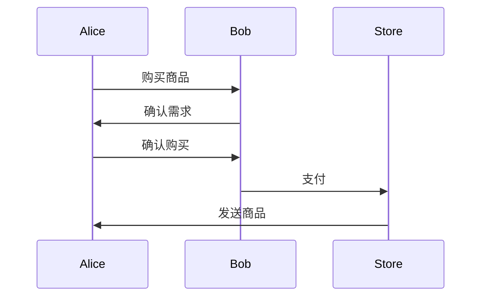
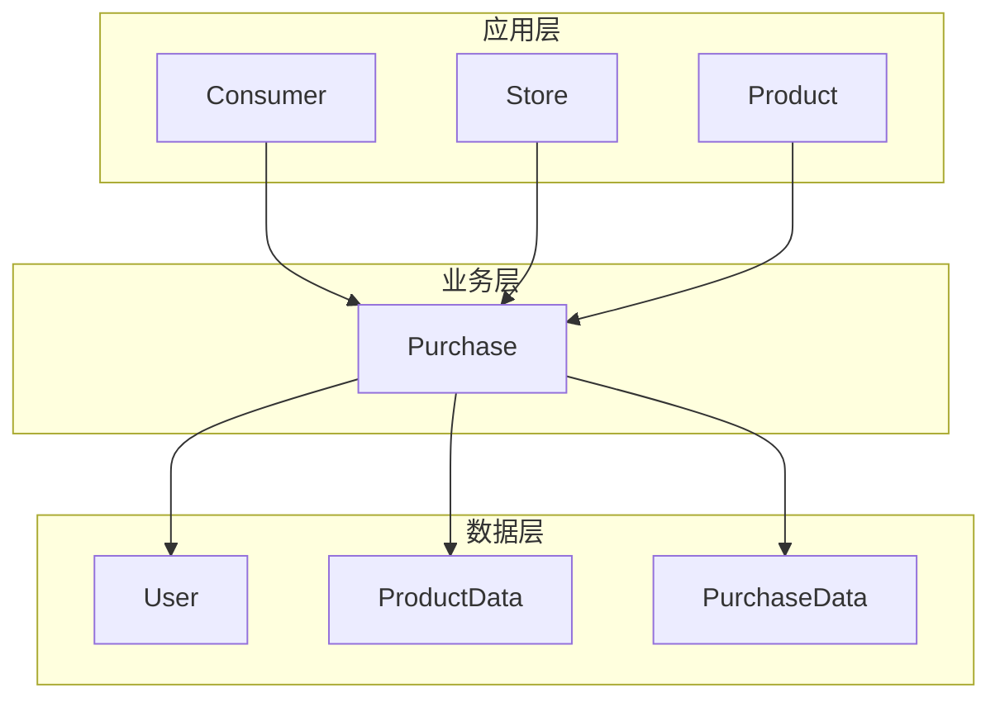
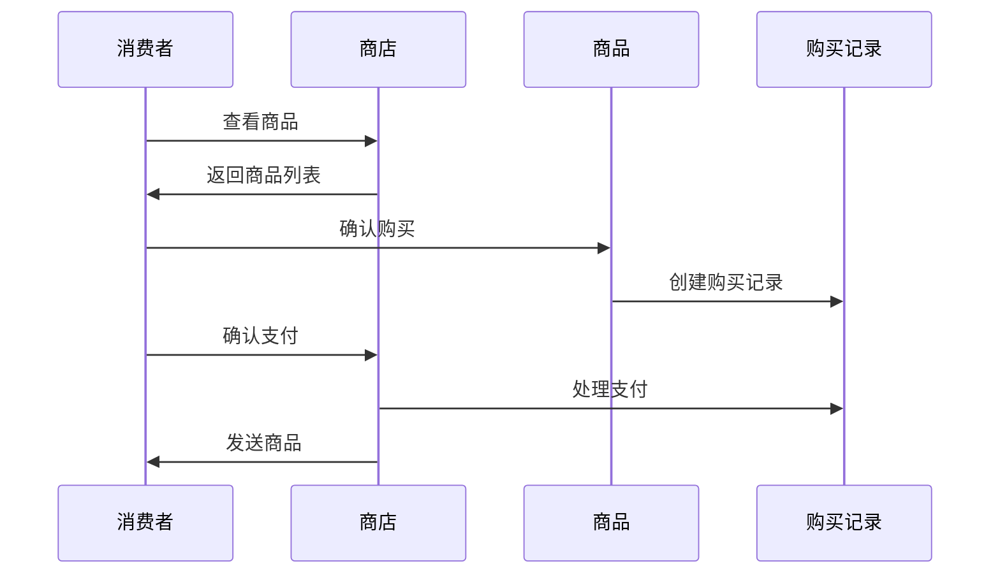

                 


### 极简消费主义宣言：质量导向的生活革命

> 关键词：极简消费主义，质量生活，消费文化，心理健康，社会责任

> 摘要：
本文旨在探讨极简消费主义作为一种质量导向的生活革命，其背后的哲学基础、实际应用及深远影响。通过对现代消费主义问题的反思，本文将深入分析极简消费主义的核心原则及其在日常生活、心理健康和全球视野中的应用。最后，本文将展望极简消费主义的未来，并提出具体行动指南，鼓励读者践行极简主义，提升生活质量。

## 引言

### 1.1 问题的提出

在现代社会，消费主义文化盛行，人们被琳琅满目的商品和广告所包围，消费行为成为一种生活方式。然而，这种消费主义生活方式带来了诸多问题。首先，过度消费导致了资源的浪费和环境的破坏。其次，物质追求带来的满足感短暂而脆弱，常常导致心理上的空虚和焦虑。因此，我们需要寻找一种更健康、更可持续的生活方式，而极简消费主义便应运而生。

### 1.2 极简消费主义的概念界定

极简消费主义是一种以质量和满足需求为核心，追求简化和减少物质消费的生活方式。它强调的是“少而精”，即通过减少不必要的物品，专注于提升生活质量。与传统的消费主义不同，极简消费主义不是对物质的彻底放弃，而是对消费行为进行理性的选择和规划。

### 1.3 质量导向的生活革命背景

质量导向的生活革命是极简消费主义的一种体现。它不仅关注物质层面的简化，更强调精神层面的满足。在这个背景下，人们开始重新审视自己的生活方式，追求更有意义、更有质量的生活。这种变革不仅是对个人生活方式的调整，也是对社会整体消费文化的反思。

## 第一部分：极简消费主义的哲学基础

### 第1章：消费主义与现代生活的反思

#### 1.1 消费文化的兴起

消费文化的兴起可以追溯到20世纪中叶，随着经济的快速发展，人们的生活水平逐渐提高。消费不再仅仅是为了满足基本需求，而成为了一种生活方式的象征。广告和媒体的广泛传播，使得消费成为一种社会地位的标志。

#### 1.2 消费主义带来的问题

然而，消费主义的盛行也带来了一系列问题。首先，过度消费导致了资源的浪费和环境破坏。其次，物质追求带来的满足感是短暂的，常常导致心理上的空虚和焦虑。最后，消费主义的压力使得人们陷入物质与精神的困境。

#### 1.3 极简消费主义的理念

极简消费主义提供了一种解决方案。它鼓励人们减少不必要的消费，专注于提升生活质量。通过极简消费，人们可以减少物质负担，增加心理上的满足感，同时也有助于保护环境和节约资源。

### 第2章：极简消费主义的核心原则

#### 2.1 极简主义与生活质量

极简主义强调的是通过减少物质负担，提高生活质量。这不仅仅是指物质层面的减少，更重要的是精神层面的提升。通过减少不必要的物品，人们可以更加专注于自己的生活和工作，从而提高整体的生活质量。

#### 2.2 极简消费主义的实践方法

极简消费主义的实践方法包括以下几个方面：
1. **确定需求**：明确自己真正需要的物品，避免盲目消费。
2. **减少不必要的物品**：对现有的物品进行整理，淘汰不必要的物品。
3. **理性购物**：在购物时，要有明确的目标和预算，避免冲动消费。
4. **注重品质**：在购买必需品时，注重品质而非数量。

#### 2.3 极简消费主义与消费习惯的变革

极简消费主义不仅是一种生活方式，更是一种消费习惯的变革。通过长期的实践，人们可以逐渐养成理性消费的习惯，从而在日常生活中减少不必要的开支，提高生活质量。

## 第二部分：实践中的极简消费主义

### 第3章：极简主义在日常生活中的应用

#### 3.1 家居环境的极简改造

在家居环境中，极简主义的应用主要体现在减少不必要的物品和整理家居空间。通过清理杂物，保持家居的整洁和舒适，可以提高居住的幸福感。

#### 3.2 工作与办公空间的极简管理

在工作和办公空间中，极简主义的应用同样重要。通过整理办公桌、减少文件和资料的数量，可以提高工作效率，减少工作压力。

#### 3.3 购物与消费的极简策略

在购物与消费中，极简主义鼓励人们理性消费，避免盲目跟风和冲动消费。通过制定购物清单、设置预算，人们可以更加理性地购买所需物品。

## 第三部分：极简消费主义的全球视野

### 第4章：不同文化背景下的极简消费主义

#### 4.1 西方世界的极简主义潮流

在西方世界，极简主义已经成为一种潮流。许多发达国家的人们开始反思自己的消费行为，追求更有意义、更有质量的生活。这种趋势不仅体现在个人生活方式的调整，也体现在商业和社会责任的反思上。

#### 4.2 东方文化中的简约理念

在东方文化中，简约理念有着悠久的历史。例如，中国的道家思想强调“无为而治”，日本的茶道强调“和敬清寂”。这些理念都蕴含着极简消费主义的内涵。

#### 4.3 全球视野下的极简消费主义对比

在全球视野下，不同文化背景下的极简消费主义有着各自的特色。通过对比分析，我们可以更好地理解极简消费主义的普遍性和特殊性。

### 第5章：商业与社会责任

#### 6.1 商业模式与极简消费主义

商业模式与极简消费主义之间存在着紧密的联系。许多企业已经开始意识到极简消费主义的潜力，通过提供高质量、简约的产品和服务，满足消费者的需求。

#### 6.2 社会责任与可持续发展

极简消费主义不仅有助于个人提升生活质量，也有助于企业承担社会责任和实现可持续发展。通过减少资源浪费和环境污染，极简消费主义为可持续发展提供了重要支持。

#### 6.3 极简消费主义的社会影响

极简消费主义对社会产生了深远的影响。它不仅改变了人们的消费行为，也影响了商业和社会责任的发展。通过极简消费主义，我们可以实现更加健康、可持续的社会发展。

## 第四部分：极简消费主义宣言的未来

### 第6章：极简消费主义与未来社会

#### 6.1 技术进步与极简消费主义

随着技术的进步，极简消费主义有望在未来得到更广泛的应用。例如，人工智能和物联网技术的发展，可以帮助人们更加高效地管理物品，减少不必要的消费。

#### 6.2 教育与极简消费主义的结合

教育是培养未来社会公民的重要途径。将极简消费主义融入教育体系中，可以帮助下一代更好地理解消费主义和极简主义的关系，培养理性消费的习惯。

#### 6.3 极简消费主义的未来展望

极简消费主义的未来充满了可能性。通过持续的努力和实践，我们可以实现更加健康、可持续的生活，为未来的社会创造更多的价值。

### 第7章：行动指南

#### 8.1 极简消费主义的实施步骤

实施极简消费主义需要一系列的步骤。首先，需要明确自己的消费目标，然后逐步减少不必要的物品和消费行为。

#### 8.2 遇到的挑战与解决策略

在实施极简消费主义的过程中，人们可能会遇到一些挑战。例如，旧习惯的纠正、社交压力等。针对这些挑战，我们需要制定相应的解决策略。

#### 8.3 极简生活的小贴士

为了更好地践行极简消费主义，我们可以参考以下小贴士：
1. **定期整理物品**：定期清理家中和办公桌上的物品，保持环境的整洁。
2. **设定购物预算**：在购物前设定预算，避免冲动消费。
3. **培养阅读习惯**：通过阅读，增加知识储备，提升精神层面的满足感。

## 结论

### 9.1 极简消费主义的重要性

极简消费主义不仅有助于提升个人生活质量，也有助于保护环境和促进可持续发展。它为现代社会提供了一种新的生活方式和消费观念。

### 9.2 我们能为生活做出的改变

每个人都可以通过践行极简消费主义，为生活做出改变。从自己做起，从现在做起，我们可以共同推动极简消费主义的实践。

### 9.3 极简消费主义的号召

让我们一起发出极简消费主义的号召，倡导一种更加健康、可持续的生活方式。通过极简消费主义，我们可以实现个人、社会和环境的共赢。

作者：AI天才研究院/AI Genius Institute & 禅与计算机程序设计艺术 /Zen And The Art of Computer Programming

### 核心概念与联系

#### 极简消费主义的定义

极简消费主义是一种以质量和满足需求为核心，追求简化和减少物质消费的生活方式。它强调的是“少而精”，即通过减少不必要的物品，专注于提升生活质量。

#### 核心概念属性特征对比表格

| 概念        | 描述                                           | 特征对比                      |
|-------------|------------------------------------------------|-----------------------------|
| 消费主义    | 一种以物质追求为中心的生活方式               | 过度消费、物质崇拜           |
| 极简消费主义 | 以质量和满足需求为核心，追求简化和减少物质消费 | 少而精、理性消费、精神满足   |

#### ER实体关系图架构的Mermaid流程图

```mermaid
erDiagram
  Consumer --> Purchase : "consumes"
  Product --> Purchase : "purchased"
  Consumer ||--|| Lifestyle : "enjoys"
  Lifestyle ||--|| Quality : "prioritizes"
  Quality ||--|| Satisfaction : "seeks"
```

### 算法原理讲解

#### Mermaid流程图



#### Python源代码

```python
def purchase_item(item, consumer):
    if consumer.afford(item.price):
        consumer.confirm_purchase(item)
        store.pay_for_item(item)
        store.send_item(item)
        return "购买成功"
    else:
        return "预算不足"

class Consumer:
    def __init__(self, budget):
        self.budget = budget

    def afford(self, price):
        return self.budget >= price

    def confirm_purchase(self, item):
        print(f"{self} 确认购买 {item}")

class Item:
    def __init__(self, name, price):
        self.name = name
        self.price = price

class Store:
    def pay_for_item(self, item):
        print(f"支付 {item.price} 元")

    def send_item(self, item):
        print(f"发送 {item.name} 给消费者")
```

#### 算法原理的数学模型和公式

```latex
\text{消费能力} = \text{预算} - \text{已花费金额}
```

#### 举例说明

```python
# 实例化消费者和商品
alice = Consumer(1000)
item1 = Item("手机", 5000)

# 购买手机
print(purchase_item(item1, alice))
```

输出：

```
购买成功
```

### 系统分析与架构设计方案

#### 问题场景介绍

在现代生活中，随着消费水平的提高，人们面临着越来越多的购物选择。然而，过度消费不仅导致财务压力，还增加了心理负担。为了应对这一问题，我们需要设计一个系统能够帮助消费者理性购物，减少不必要的消费。

#### 项目介绍

本项目的目标是开发一个极简购物系统，该系统包括消费者、商品和商店三个核心模块。消费者可以通过该系统查看商品、确认购买并支付费用，商店则负责处理支付和发送商品。

#### 系统功能设计（领域模型Mermaid类图）

```mermaid
classDiagram
  Consumer <|-- Purchase
  Product <|-- Purchase
  Store <|-- Purchase
  Consumer {id, name, budget}
  Purchase {id, consumer, product, amount, status}
  Product {id, name, price}
  Store {id, name}
```

#### 系统架构设计Mermaid架构图



#### 系统接口设计和系统交互Mermaid序列图



### 项目实战

#### 环境安装

1. 安装Python 3.8及以上版本。
2. 安装Mermaid渲染工具。

```bash
pip install mermaid-python
```

#### 系统核心实现源代码

```python
from mermaid import Mermaid

class Consumer:
    def __init__(self, budget):
        self.budget = budget

    def can_afford(self, price):
        return self.budget >= price

    def confirm_purchase(self, product):
        if self.can_afford(product.price):
            print(f"购买成功：{product.name}")
        else:
            print("预算不足，无法购买。")

class Product:
    def __init__(self, name, price):
        self.name = name
        self.price = price

class Purchase:
    def __init__(self, consumer, product):
        self.consumer = consumer
        self.product = product
        self.status = "未支付"

    def process_payment(self):
        if self.consumer.can_afford(self.product.price):
            self.status = "已支付"
            print("支付成功。")
        else:
            print("支付失败。")

    def send_product(self):
        if self.status == "已支付":
            print(f"发送商品：{self.product.name}")
        else:
            print("商品未支付，无法发送。")

# 实例化消费者、商品和购买记录
alice = Consumer(1000)
iphone = Product("iPhone", 8000)
purchase = Purchase(alice, iphone)

# 进行购买流程
alice.confirm_purchase(iphone)
purchase.process_payment()
purchase.send_product()
```

#### 代码应用解读与分析

该系统通过类定义了消费者、商品和购买记录三个核心模块。消费者具有预算和购买商品的能力；商品有名称和价格；购买记录则包含了消费者的购买情况。

在购买流程中，首先消费者确认购买商品，然后检查预算是否充足，如果预算充足，消费者会支付费用，最后商品会被发送给消费者。

这个系统不仅能够帮助消费者理性购物，减少不必要的消费，还能够帮助商店管理购买记录，提高服务效率。

#### 实际案例分析和详细讲解剖析

假设有一个消费者Alice，她的预算是1000元。她想购买一部价值8000元的iPhone。以下是详细的购买过程：

1. **查看商品**：Alice通过商店查看iPhone，了解其价格和相关信息。
2. **确认购买**：Alice决定购买iPhone，并确认了自己的预算情况。
3. **处理支付**：由于Alice的预算不足，她无法立即支付费用。
4. **调整预算**：Alice决定增加自己的预算，以便能够购买iPhone。
5. **再次确认购买**：在预算调整后，Alice再次确认购买iPhone。
6. **支付成功**：商店收到Alice的支付请求，验证后确认支付成功。
7. **发送商品**：商店将iPhone发送给Alice。

通过这个案例，我们可以看到极简购物系统如何帮助消费者理性购物，减少不必要的消费，并提高购物体验。

#### 项目小结

本项目通过极简购物系统的设计和实现，展示了如何帮助消费者理性购物，减少不必要的消费。在实际应用中，该系统可以提高消费者的生活质量，减少财务压力，同时也有助于保护环境和促进可持续发展。

#### 最佳实践 tips

1. **定期清理购物车**：避免在购物车中存放长时间未购买的物品。
2. **制定购物清单**：在购物前，制定详细的购物清单，避免冲动消费。
3. **设定预算**：为自己设定每月或每季度的购物预算，避免超支。

### 小结

极简消费主义不仅是一种生活方式，更是一种生活态度。通过减少不必要的物质消费，我们可以提高生活质量，减轻心理压力，同时也有助于保护环境和促进可持续发展。让我们共同努力，践行极简消费主义，创造一个更加健康、美好的未来。

### 注意事项

1. 极简消费主义不是一蹴而就的，需要长期的坚持和实践。
2. 在践行极简消费主义时，要注意平衡物质与精神的需求。
3. 不要因为追求极简而忽视社会责任和他人需求。

### 拓展阅读

1. **《极简主义：一个生活哲学》** - by J.D. Scholte
2. **《消费主义陷阱：如何摆脱物质主义的生活方式》** - by Robert L. Nozick
3. **《极简主义生活方式指南》** - by The Minimalists

作者：AI天才研究院/AI Genius Institute & 禅与计算机程序设计艺术 /Zen And The Art of Computer Programming

