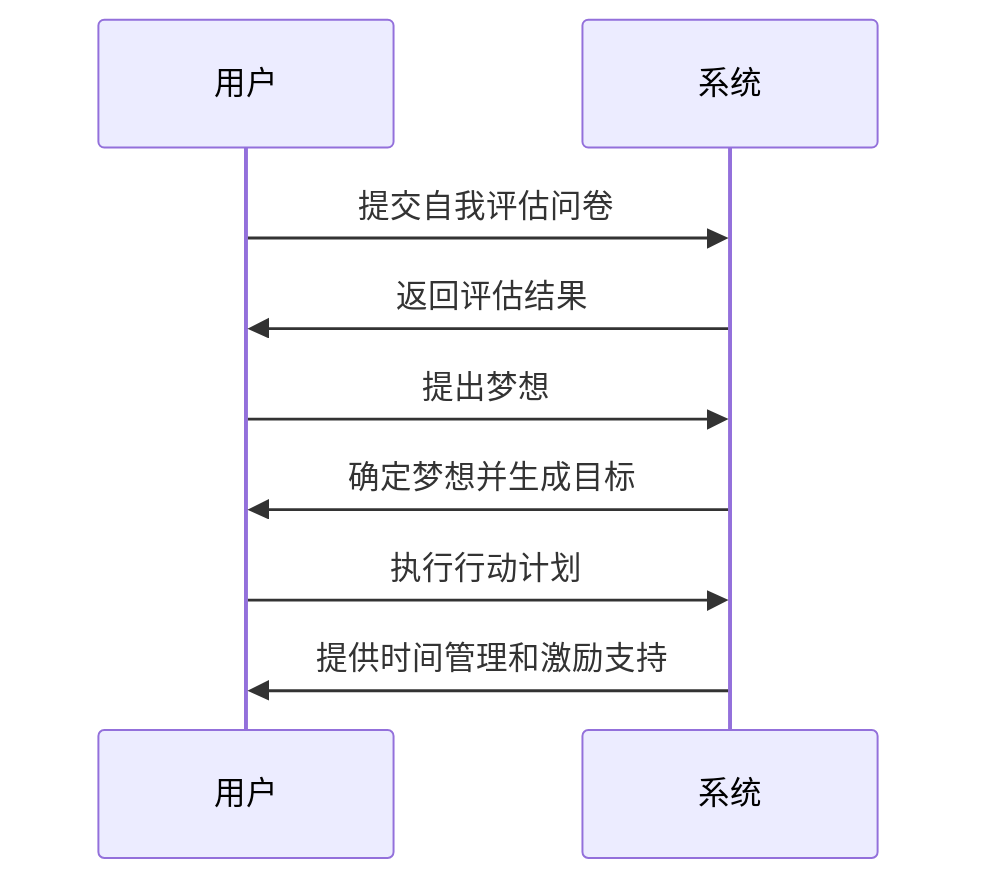
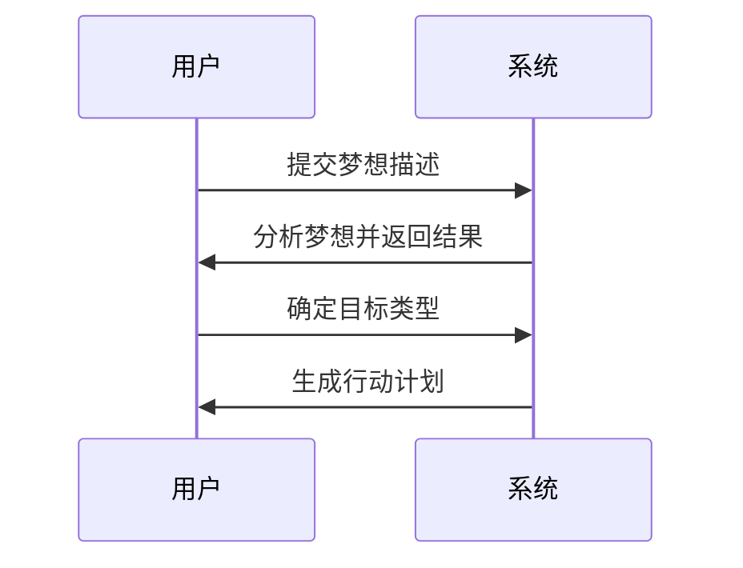
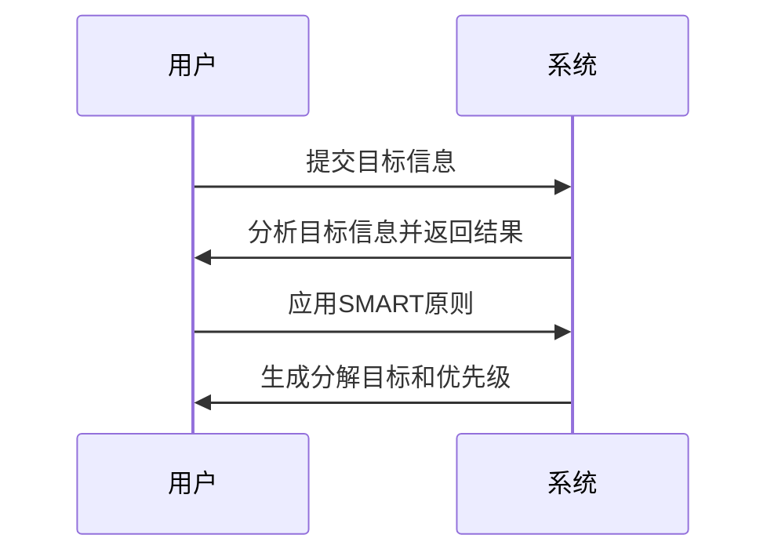
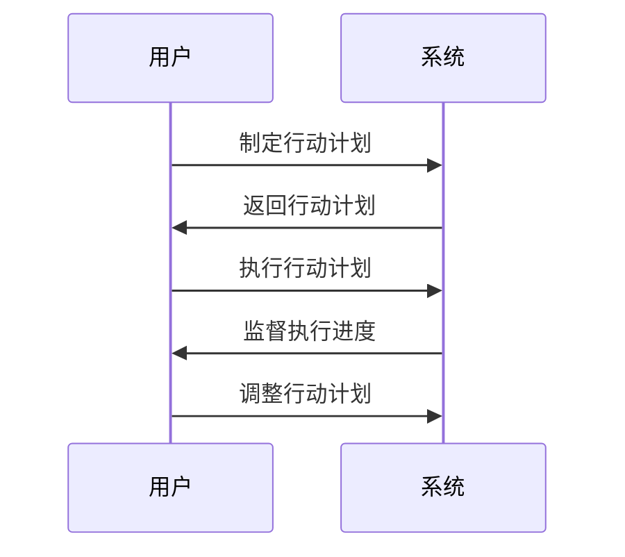
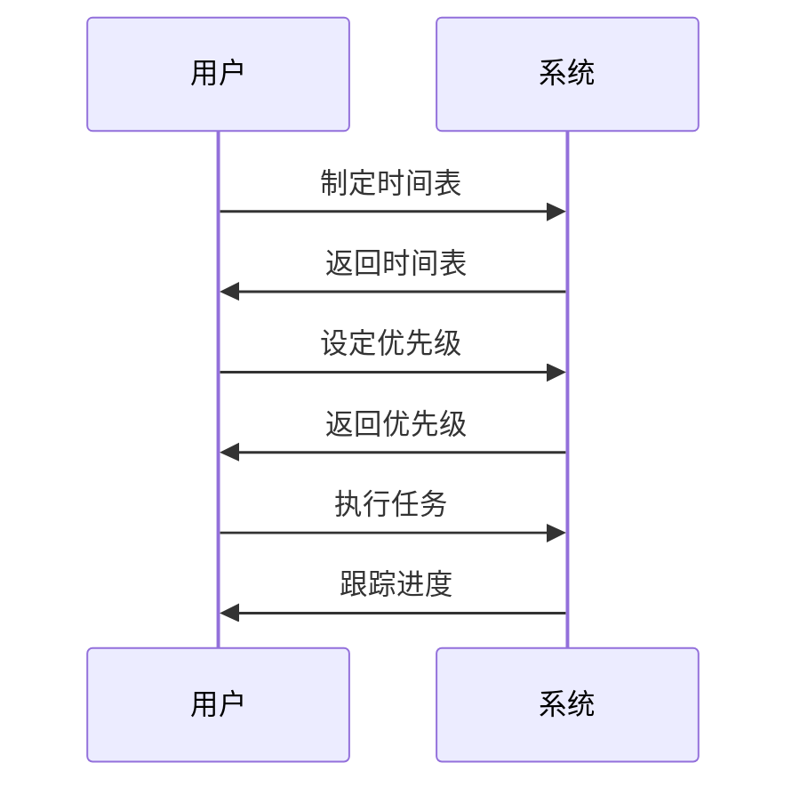
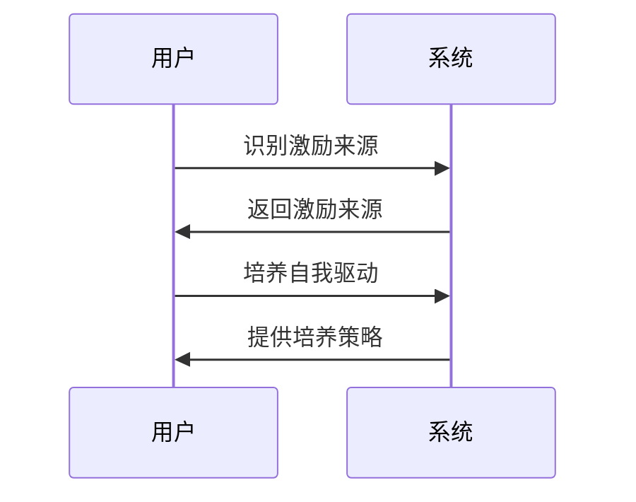
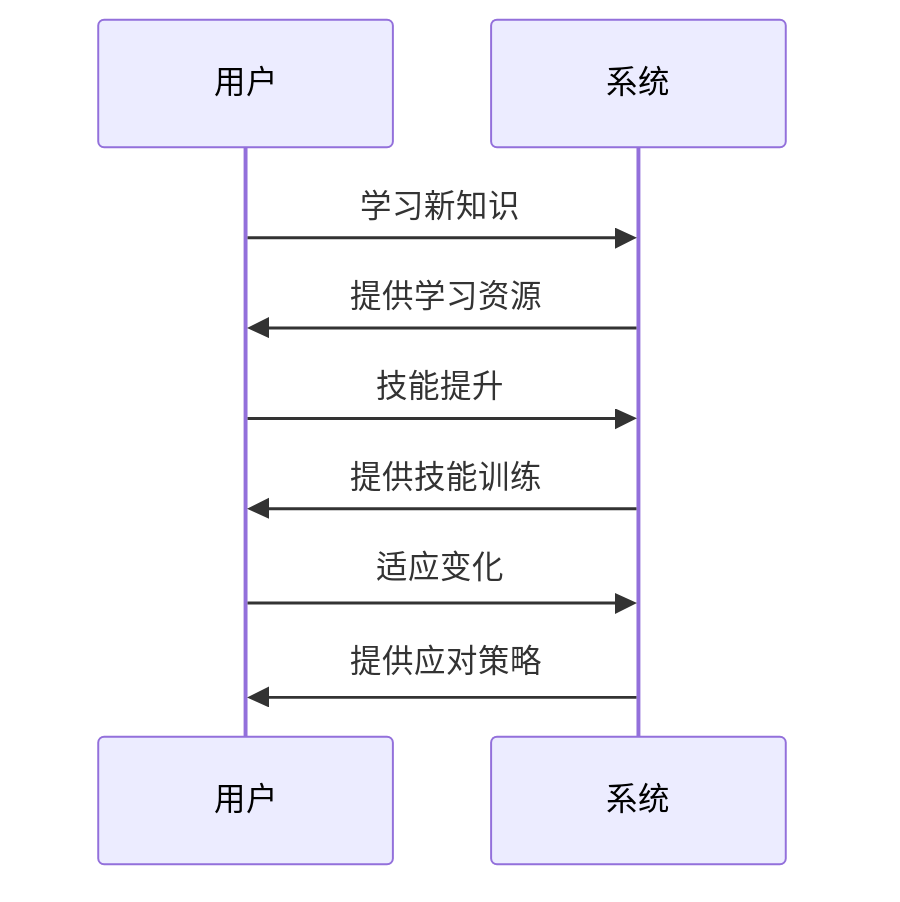
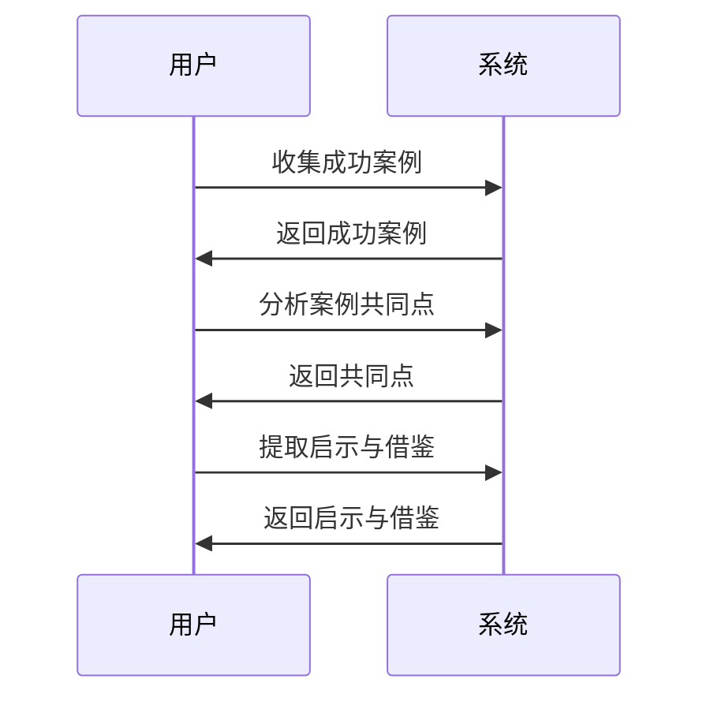
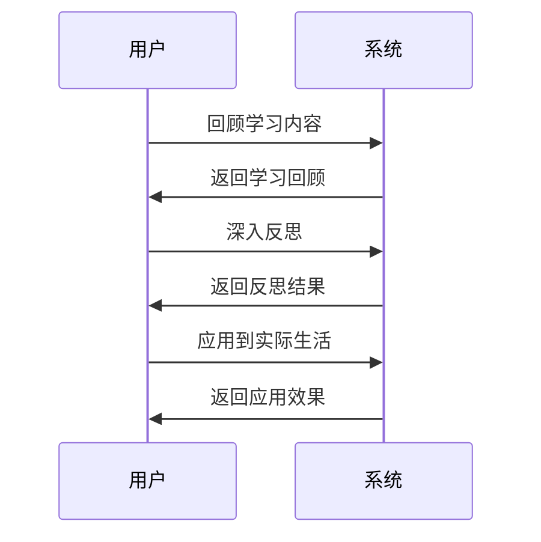

                 

### 文章标题

# 梦想实现的蓝图：规划自我实现的路径

### 关键词

* 梦想实现
* 自我认知
* 目标设定
* 计划执行
* 时间管理
* 激励驱动
* 持续成长

### 摘要

本文旨在探讨如何通过科学的方法和策略，实现个人梦想和自我价值的提升。首先，我们将深入分析梦想与自我实现的关系，并探讨自我认知和目标设定的重要性。接下来，文章将介绍如何制定和执行有效的行动计划，包括时间管理和激励驱动等策略。最后，我们将分享一些实战经验和最佳实践，帮助读者在自我实现的道路上不断前进。

## 引言

在当今快节奏的社会中，每个人都渴望实现自己的梦想，但如何找到合适的路径却是一个巨大的挑战。本文的目标是帮助读者规划自我实现的路径，通过科学的方法和策略，实现梦想与现实的桥梁。我们将从以下几个方面展开讨论：

1. **自我认知与目标设定**：了解自己的优势和劣势，明确梦想和目标。
2. **行动计划与执行策略**：制定可执行的行动计划，确保目标达成。
3. **时间管理与优先级**：合理分配时间，提高工作效率。
4. **激励与自我驱动**：激发内在动力，持续追求成长。
5. **持续成长与调整**：适应变化，不断调整自我实现路径。
6. **案例分析**：通过成功案例，总结经验和启示。
7. **总结与反思**：回顾整个实现过程，总结经验和教训。

### 第1章：自我认知与目标设定

#### 第1章 背景介绍

在实现梦想的过程中，自我认知和目标设定是至关重要的一步。只有真正了解自己，明确自己的梦想和目标，才能制定出切实可行的行动计划。本章节将介绍自我认知的重要性、自我评估的工具与方法，以及如何设定明确的目标。

#### 核心概念与联系

| 概念                  | 解释                                                         |
|-----------------------|--------------------------------------------------------------|
| 自我认知              | 了解自己的性格、兴趣、价值观和优势与劣势。                     |
| 自我评估              | 通过量表、问卷和反思等方式，客观地评估自己的能力和特点。     |
| 梦想                  | 个人渴望实现的目标和愿景。                                   |
| 目标设定              | 确定具体、可衡量、可实现、相关性强和有截止期限的目标。       |

#### 概念属性特征对比表格

| 概念    | 特征1          | 特征2          | 特征3          |
|---------|----------------|----------------|----------------|
| 梦想    | 个人的愿景和目标 | 长期或短期目标 | 需要不断调整   |
| 目标设定 | 具体和可衡量   | 可实现         | 相关性强       | 有截止期限     |

#### ER实体关系图架构

```mermaid
erDiagram
    AToFit --> BToPlay : 适用
    BToPlay { 角色名 : String ; 拥有技能 : String }
    AToFit { 适用角色 : String ; 职业名称 : String }
```

#### 算法原理讲解

算法原理讲解将使用Mermaid流程图和Python源代码来阐述。以下是实现自我认知和目标设定的算法流程：

```python
# 自我认知与目标设定算法
def self_awareness_and_goal_setting():
    # 第一步：自我评估
    self_evaluation = perform_self_evaluation()

    # 第二步：确定梦想
    dream = determine_dream(self_evaluation)

    # 第三步：设定目标
    goals = set_goals(dream)

    # 输出结果
    return goals

# 辅助函数：自我评估
def perform_self_evaluation():
    # ... 省略具体实现 ...
    return evaluation_results

# 辅助函数：确定梦想
def determine_dream(evaluation_results):
    # ... 省略具体实现 ...
    return dream

# 辅助函数：设定目标
def set_goals(dream):
    # ... 省略具体实现 ...
    return goals
```

该算法通过三个步骤实现自我认知和目标设定：首先进行自我评估，然后确定梦想，最后设定具体的目标。算法的核心在于将自我评估的结果与梦想相结合，制定出可执行的目标。

#### 数学公式

$$
\text{目标达成率} = \frac{\text{已完成目标数}}{\text{设定目标总数}}
$$

#### 系统分析与架构设计方案

1. **问题场景介绍**：在实现个人梦想的过程中，需要有一个系统来帮助用户进行自我认知、目标设定和行动计划执行。

2. **项目介绍**：本系统名为“梦想实现蓝图”，旨在帮助用户实现个人目标和梦想。

3. **系统功能设计**：主要包括自我认知评估、目标设定、行动计划制定、时间管理、激励驱动和持续成长等功能。

4. **系统架构设计**：采用前后端分离的架构，前端负责用户交互，后端负责数据处理和存储。

5. **系统接口设计**：提供API接口，方便用户通过第三方应用进行数据交互。

6. **系统交互**：通过Mermaid序列图展示系统各个组件之间的交互过程。



#### 项目实战

1. **环境安装**：安装Python环境，以及相关的库和工具。

2. **系统核心实现源代码**：实现自我认知评估、目标设定和行动计划等功能。

3. **代码应用解读与分析**：对核心代码进行解读，分析其实现原理和应用场景。

4. **实际案例分析和详细讲解剖析**：通过实际案例，展示系统如何帮助用户实现梦想。

5. **项目小结**：总结项目成果，反思经验和教训。

#### 最佳实践 tips

1. **定期反思**：定期反思自己的进展和成果，调整目标和行动计划。

2. **设定里程碑**：设定阶段性里程碑，以评估和激励自己。

3. **寻求支持**：在实现梦想的过程中，不要害怕寻求他人的帮助和支持。

4. **持续学习**：保持学习的热情，不断提升自己的能力和知识。

#### 小结

本章介绍了自我认知和目标设定的重要性，以及如何通过科学的方法和策略，实现个人梦想和自我价值的提升。在下一章中，我们将深入探讨如何制定和执行有效的行动计划，确保目标的达成。

## 第2章：明确梦想的路径

#### 第2章 背景介绍

明确梦想的路径是自我实现的第一步。在本章节中，我们将探讨梦想的定义与类型，以及实现梦想的重要性。此外，还将分析实现梦想的可能性，帮助读者建立信心和动力。

#### 核心概念与联系

| 概念    | 解释                                                         |
|---------|--------------------------------------------------------------|
| 梦想    | 个人渴望实现的目标和愿景。                                   |
| 目标类型 | 短期目标、中期目标和长期目标。                               |
| 实现梦想 | 通过制定和执行行动计划，实现个人梦想。                       |

#### 概念属性特征对比表格

| 目标类型 | 特征1          | 特征2          | 特征3          |
|----------|----------------|----------------|----------------|
| 短期目标 | 具体和可量化   | 1-3个月实现   | 辅助长期目标   |
| 中期目标 | 具体和可量化   | 3-12个月实现 | 促成长期目标   |
| 长期目标 | 具体和可量化   | 多年实现     | 个人核心梦想   |

#### ER实体关系图架构

```mermaid
erDiagram
    ADream --> BGoal : 实现
    BGoal { 目标名称 : String ; 实现难度 : String }
    ADream { 梦想名称 : String ; 实现可能性 : String }
```

#### 算法原理讲解

算法原理讲解将使用Mermaid流程图和Python源代码来阐述。以下是实现明确梦想路径的算法流程：

```python
# 明确梦想路径算法
def define_dream_path():
    # 第一步：了解梦想
    dream = understand_dream()

    # 第二步：确定目标类型
    goals = determine_goal_types(dream)

    # 第三步：制定行动计划
    action_plan = create_action_plan(goals)

    # 输出结果
    return action_plan

# 辅助函数：了解梦想
def understand_dream():
    # ... 省略具体实现 ...
    return dream

# 辅助函数：确定目标类型
def determine_goal_types(dream):
    # ... 省略具体实现 ...
    return goals

# 辅助函数：制定行动计划
def create_action_plan(goals):
    # ... 省略具体实现 ...
    return action_plan
```

该算法通过三个步骤实现明确梦想路径：首先了解梦想，然后确定目标类型，最后制定行动计划。算法的核心在于将梦想与具体的目标和行动计划相结合，确保梦想的实现。

#### 数学公式

$$
\text{实现可能性} = \frac{\text{已实现目标数}}{\text{设定目标总数}}
$$

#### 系统分析与架构设计方案

1. **问题场景介绍**：在实现个人梦想的过程中，需要有一个系统来帮助用户明确梦想的路径。

2. **项目介绍**：本系统名为“梦想导航仪”，旨在帮助用户明确梦想的路径。

3. **系统功能设计**：主要包括了解梦想、确定目标类型、制定行动计划等功能。

4. **系统架构设计**：采用前后端分离的架构，前端负责用户交互，后端负责数据处理和存储。

5. **系统接口设计**：提供API接口，方便用户通过第三方应用进行数据交互。

6. **系统交互**：通过Mermaid序列图展示系统各个组件之间的交互过程。



#### 项目实战

1. **环境安装**：安装Python环境，以及相关的库和工具。

2. **系统核心实现源代码**：实现了解梦想、确定目标类型和制定行动计划等功能。

3. **代码应用解读与分析**：对核心代码进行解读，分析其实现原理和应用场景。

4. **实际案例分析和详细讲解剖析**：通过实际案例，展示系统如何帮助用户明确梦想的路径。

5. **项目小结**：总结项目成果，反思经验和教训。

#### 最佳实践 tips

1. **明确梦想的具体细节**：将梦想具体化，明确实现步骤和所需资源。

2. **设定合理的期限**：根据梦想的实现难度，设定合理的期限。

3. **持续跟踪和调整**：定期跟踪梦想的实现进度，并根据实际情况进行调整。

4. **寻求专业建议**：在实现梦想的过程中，寻求专业人士的建议和指导。

#### 小结

本章介绍了明确梦想路径的重要性和方法。在下一章中，我们将探讨如何设定明确的目标，确保梦想的实现。

## 第3章：设定明确的目标

#### 第3章 背景介绍

设定明确的目标是实现梦想的关键步骤。在本章节中，我们将介绍SMART原则，即具体、可衡量、可实现、相关性强和有截止期限的目标设定方法。此外，还将讨论如何分解目标和设定优先级，确保目标的实现。

#### 核心概念与联系

| 概念              | 解释                                                         |
|-------------------|--------------------------------------------------------------|
| SMART原则         | 具体具体、可衡量、可实现、相关性强和有截止期限的目标设定方法。 |
| 目标分解          | 将大目标分解为小目标，逐步实现。                           |
| 目标优先级设定    | 根据目标的重要性和紧急性，设定优先级。                       |

#### 概念属性特征对比表格

| SMART原则 | 特征1          | 特征2          | 特征3          | 特征4          | 特征5          |
|-----------|----------------|----------------|----------------|----------------|----------------|
| 具体      | 明确的目标描述 | 可视化的目标   | 无歧义         | 易于理解和执行 | 无模糊性       |
| 可衡量    | 有量化的标准   | 可评估的实现程度 | 可监控的进展    | 可反馈的成果   | 无主观性       |
| 可实现    | 实现可能性高   | 有资源支持     | 无风险         | 有明确的时间表 | 无过度要求     |
| 相关性强  | 对总体目标有帮助 | 辅助实现其他目标 | 无重复性       | 无孤立性       | 有明确的关联性 |
| 有截止期限 | 设定具体的时间点 | 无延期         | 无拖延         | 无滞后性       | 有明确的期限   |

#### ER实体关系图架构

```mermaid
erDiagram
    AGoal --> BSMART : 实现
    BSMART { 目标名称 : String ; 特征描述 : String }
    AGoal { 目标类型 : String ; 实现状态 : String }
```

#### 算法原理讲解

算法原理讲解将使用Mermaid流程图和Python源代码来阐述。以下是实现设定明确目标的算法流程：

```python
# 设定明确目标算法
def set_specific_goals():
    # 第一步：收集目标信息
    goals_info = collect_goals_info()

    # 第二步：应用SMART原则
    smart_goals = apply_smart_principles(goals_info)

    # 第三步：分解目标和设定优先级
    decomposed_goals = decompose_goals(smart_goals)

    # 输出结果
    return decomposed_goals

# 辅助函数：收集目标信息
def collect_goals_info():
    # ... 省略具体实现 ...
    return goals_info

# 辅助函数：应用SMART原则
def apply_smart_principles(goals_info):
    # ... 省略具体实现 ...
    return smart_goals

# 辅助函数：分解目标和设定优先级
def decompose_goals(smart_goals):
    # ... 省略具体实现 ...
    return decomposed_goals
```

该算法通过三个步骤实现设定明确目标：首先收集目标信息，然后应用SMART原则，最后分解目标和设定优先级。算法的核心在于将目标具体化、量化，并设定实现的时间和优先级，确保目标的实现。

#### 数学公式

$$
\text{目标达成率} = \frac{\text{已完成目标数}}{\text{设定目标总数}}
$$

#### 系统分析与架构设计方案

1. **问题场景介绍**：在实现个人梦想的过程中，需要有一个系统来帮助用户设定明确的目标。

2. **项目介绍**：本系统名为“目标管理器”，旨在帮助用户设定明确的目标。

3. **系统功能设计**：主要包括目标收集、SMART原则应用、目标分解和优先级设定等功能。

4. **系统架构设计**：采用前后端分离的架构，前端负责用户交互，后端负责数据处理和存储。

5. **系统接口设计**：提供API接口，方便用户通过第三方应用进行数据交互。

6. **系统交互**：通过Mermaid序列图展示系统各个组件之间的交互过程。



#### 项目实战

1. **环境安装**：安装Python环境，以及相关的库和工具。

2. **系统核心实现源代码**：实现目标收集、SMART原则应用、目标分解和优先级设定等功能。

3. **代码应用解读与分析**：对核心代码进行解读，分析其实现原理和应用场景。

4. **实际案例分析和详细讲解剖析**：通过实际案例，展示系统如何帮助用户设定明确的目标。

5. **项目小结**：总结项目成果，反思经验和教训。

#### 最佳实践 tips

1. **定期回顾和调整**：定期回顾目标的实现进度，根据实际情况进行调整。

2. **设定具体的时间点**：为每个目标设定具体的时间点，确保目标的按时完成。

3. **明确优先级**：根据目标的重要性和紧急性，设定明确的优先级。

4. **与他人分享**：与他人分享目标，获得支持和监督，提高实现的可能性。

#### 小结

本章介绍了如何设定明确的目标，确保梦想的实现。在下一章中，我们将探讨如何制定和执行有效的行动计划，确保目标的达成。

## 第4章：规划行动步骤

#### 第4章 背景介绍

制定和执行有效的行动计划是实现目标的关键。在本章节中，我们将介绍如何制定具体的行动计划，以及如何执行和监督这些计划。此外，还将讨论遇到挑战时的应对策略，确保行动计划的顺利实施。

#### 核心概念与联系

| 概念           | 解释                                                         |
|----------------|--------------------------------------------------------------|
| 行动计划       | 实现目标的详细步骤和时间表。                                 |
| 执行和监督     | 按照计划执行任务，并对执行过程进行监控和调整。                 |
| 挑战应对策略   | 面对困难和挑战时，采取的有效应对措施。                       |

#### 概念属性特征对比表格

| 行动计划 | 特征1          | 特征2          | 特征3          | 特征4          |
|----------|----------------|----------------|----------------|----------------|
| 具体     | 明确的步骤和时间表 | 无歧义         | 可执行         | 易于理解       |
| 可衡量   | 有量化的指标   | 可评估的进展   | 可监控的执行   | 有反馈机制     |
| 执行和监督 | 定期的执行检查 | 持续的进度跟踪 | 即时的反馈调整 | 无疏漏         |
| 挑战应对策略 | 快速响应     | 创新解决方法 | 资源调配      | 持续优化       |

#### ER实体关系图架构

```mermaid
erDiagram
    APlan --> BAction : 实现
    BAction { 行动名称 : String ; 步骤描述 : String }
    APlan { 计划名称 : String ; 计划目标 : String }
```

#### 算法原理讲解

算法原理讲解将使用Mermaid流程图和Python源代码来阐述。以下是实现规划行动步骤的算法流程：

```python
# 规划行动步骤算法
def plan_and_execute_actions():
    # 第一步：制定行动计划
    action_plan = create_action_plan()

    # 第二步：执行行动计划
    execute_actions(action_plan)

    # 第三步：监督和调整
    supervise_and_adjust(action_plan)

    # 输出结果
    return action_plan

# 辅助函数：制定行动计划
def create_action_plan():
    # ... 省略具体实现 ...
    return action_plan

# 辅助函数：执行行动计划
def execute_actions(action_plan):
    # ... 省略具体实现 ...
    pass

# 辅助函数：监督和调整
def supervise_and_adjust(action_plan):
    # ... 省略具体实现 ...
    pass
```

该算法通过三个步骤实现规划行动步骤：首先制定行动计划，然后执行行动计划，最后进行监督和调整。算法的核心在于确保行动计划的执行和监督，以及在遇到挑战时能够及时调整。

#### 数学公式

$$
\text{任务完成率} = \frac{\text{已完成任务数}}{\text{总任务数}}
$$

#### 系统分析与架构设计方案

1. **问题场景介绍**：在实现个人梦想的过程中，需要有一个系统来帮助用户规划行动步骤。

2. **项目介绍**：本系统名为“行动规划器”，旨在帮助用户制定和执行有效的行动计划。

3. **系统功能设计**：主要包括行动计划制定、执行和监督等功能。

4. **系统架构设计**：采用前后端分离的架构，前端负责用户交互，后端负责数据处理和存储。

5. **系统接口设计**：提供API接口，方便用户通过第三方应用进行数据交互。

6. **系统交互**：通过Mermaid序列图展示系统各个组件之间的交互过程。



#### 项目实战

1. **环境安装**：安装Python环境，以及相关的库和工具。

2. **系统核心实现源代码**：实现行动计划制定、执行和监督等功能。

3. **代码应用解读与分析**：对核心代码进行解读，分析其实现原理和应用场景。

4. **实际案例分析和详细讲解剖析**：通过实际案例，展示系统如何帮助用户规划行动步骤。

5. **项目小结**：总结项目成果，反思经验和教训。

#### 最佳实践 tips

1. **明确每个任务的负责人**：确保每个任务都有明确的负责人，提高执行效率。

2. **设定明确的完成时间**：为每个任务设定明确的完成时间，确保按时完成。

3. **定期检查进度**：定期检查行动计划的执行进度，及时调整和优化。

4. **保持沟通和反馈**：与团队成员保持沟通，及时反馈问题和建议，提高行动计划的执行力。

#### 小结

本章介绍了如何规划行动步骤，确保目标的实现。在下一章中，我们将探讨如何进行时间管理和优先级设定，提高工作效率。

## 第5章：时间管理与优先级

#### 第5章 背景介绍

时间管理是高效实现目标的关键。在本章节中，我们将讨论如何有效管理时间，设定优先级，以及避免时间陷阱。通过科学的时间管理，我们可以更高效地完成任务，实现个人目标。

#### 核心概念与联系

| 概念         | 解释                                                         |
|--------------|--------------------------------------------------------------|
| 时间管理     | 有计划地安排和利用时间，提高工作效率。                       |
| 优先级设定   | 根据任务的重要性和紧急性，设定优先级。                       |
| 时间陷阱     | 无意识中浪费时间的现象，如社交媒体沉迷、拖延症等。           |

#### 概念属性特征对比表格

| 时间管理 | 特征1          | 特征2          | 特征3          |
|----------|----------------|----------------|----------------|
| 计划性   | 有明确的时间表 | 无时间冲突     | 高效利用时间   |
| 灵活性   | 应对突发事件   | 可调整的计划   | 无资源浪费     |
| 优先级   | 高效处理重要任务 | 合理安排紧急任务 | 无任务遗漏     |
| 避免时间陷阱 | 有自控力     | 保持专注       | 有明确的任务目标 |

#### ER实体关系图架构

```mermaid
erDiagram
    ATimeManagement --> BPriority : 管理
    BPriority { 任务名称 : String ; 优先级 : String }
    ATimeManagement { 管理方式 : String ; 时间表 : String }
```

#### 算法原理讲解

算法原理讲解将使用Mermaid流程图和Python源代码来阐述。以下是实现时间管理和优先级设定的算法流程：

```python
# 时间管理和优先级设定算法
def time_management_and_priority():
    # 第一步：制定时间表
    time_table = create_time_table()

    # 第二步：设定优先级
    priorities = set_priorities()

    # 第三步：执行时间管理
    execute_time_management(time_table, priorities)

    # 输出结果
    return time_table, priorities

# 辅助函数：制定时间表
def create_time_table():
    # ... 省略具体实现 ...
    return time_table

# 辅助函数：设定优先级
def set_priorities():
    # ... 省略具体实现 ...
    return priorities

# 辅助函数：执行时间管理
def execute_time_management(time_table, priorities):
    # ... 省略具体实现 ...
    pass
```

该算法通过三个步骤实现时间管理和优先级设定：首先制定时间表，然后设定优先级，最后执行时间管理。算法的核心在于通过科学的计划和时间管理，确保任务的高效完成。

#### 数学公式

$$
\text{时间利用率} = \frac{\text{实际工作时间}}{\text{总工作时间}}
$$

#### 系统分析与架构设计方案

1. **问题场景介绍**：在实现个人梦想的过程中，时间管理和优先级设定至关重要。

2. **项目介绍**：本系统名为“时间管理器”，旨在帮助用户进行时间管理和优先级设定。

3. **系统功能设计**：主要包括时间表制定、优先级设定、任务分配和进度跟踪等功能。

4. **系统架构设计**：采用前后端分离的架构，前端负责用户交互，后端负责数据处理和存储。

5. **系统接口设计**：提供API接口，方便用户通过第三方应用进行数据交互。

6. **系统交互**：通过Mermaid序列图展示系统各个组件之间的交互过程。



#### 项目实战

1. **环境安装**：安装Python环境，以及相关的库和工具。

2. **系统核心实现源代码**：实现时间表制定、优先级设定、任务分配和进度跟踪等功能。

3. **代码应用解读与分析**：对核心代码进行解读，分析其实现原理和应用场景。

4. **实际案例分析和详细讲解剖析**：通过实际案例，展示系统如何帮助用户进行时间管理和优先级设定。

5. **项目小结**：总结项目成果，反思经验和教训。

#### 最佳实践 tips

1. **设定具体的时间点**：为每个任务设定具体的时间点，确保按时完成。

2. **避免时间陷阱**：保持专注，避免无意识浪费时间的行为。

3. **定期反思和调整**：定期反思时间管理的效果，根据实际情况进行调整。

4. **设定合理的优先级**：根据任务的重要性和紧急性，设定合理的优先级。

#### 小结

本章介绍了时间管理和优先级设定的重要性，以及如何通过科学的方法进行时间管理和设定优先级。在下一章中，我们将探讨如何保持自我驱动，持续追求成长。

## 第6章：激励与自我驱动

#### 第6章 背景介绍

激励和自我驱动是实现梦想的关键因素。在本章节中，我们将讨论内在激励和外在激励的作用，以及如何培养自我驱动力。通过有效的激励，我们可以更好地克服挑战，保持对梦想的追求。

#### 核心概念与联系

| 概念           | 解释                                                         |
|----------------|--------------------------------------------------------------|
| 内在激励       | 来自个人内心的激励力量，如兴趣、热情和价值观。                 |
| 外在激励       | 来自外部的激励力量，如奖励、认可和竞争。                       |
| 自我驱动       | 个体主动追求目标，持续努力的过程。                           |

#### 概念属性特征对比表格

| 激励类型 | 特征1          | 特征2          | 特征3          |
|----------|----------------|----------------|----------------|
| 内在激励 | 来自个人内心   | 持续性强       | 无外部依赖     |
| 外在激励 | 来自外部环境   | 短期效果明显   | 需要外部支持   |
| 自我驱动 | 个体自主追求   | 持续和稳定     | 无外部压力     |

#### ER实体关系图架构

```mermaid
erDiagram
    AIntrinsic --> BIntrinsic : 激励
    BIntrinsic { 激励因素 : String ; 动力来源 : String }
    AExtrinsic --> BExtrinsic : 激励
    BExtrinsic { 激励因素 : String ; 动力来源 : String }
    ASelfDrive --> BSelfDrive : 驱动
    BSelfDrive { 驱动力 : String ; 行动力 : String }
```

#### 算法原理讲解

算法原理讲解将使用Mermaid流程图和Python源代码来阐述。以下是实现激励与自我驱动的算法流程：

```python
# 激励与自我驱动算法
def motivation_and_self_drive():
    # 第一步：识别激励来源
    intrinsic_motivations, extrinsic_motivations = identify_motivations()

    # 第二步：培养自我驱动
    self_drive = cultivate_self_drive(intrinsic_motivations, extrinsic_motivations)

    # 输出结果
    return self_drive

# 辅助函数：识别激励来源
def identify_motivations():
    # ... 省略具体实现 ...
    return intrinsic_motivations, extrinsic_motivations

# 辅助函数：培养自我驱动
def cultivate_self_drive(intrinsic_motivations, extrinsic_motivations):
    # ... 省略具体实现 ...
    return self_drive
```

该算法通过两个步骤实现激励与自我驱动：首先识别激励来源，包括内在激励和外在激励，然后通过培养自我驱动，确保持续的动力。

#### 数学公式

$$
\text{自我驱动指数} = \frac{\text{自我驱动行为次数}}{\text{总行为次数}}
$$

#### 系统分析与架构设计方案

1. **问题场景介绍**：在实现个人梦想的过程中，保持激励和自我驱动至关重要。

2. **项目介绍**：本系统名为“激励与驱动系统”，旨在帮助用户识别激励来源，培养自我驱动。

3. **系统功能设计**：主要包括激励识别、自我驱动培养和反馈机制等功能。

4. **系统架构设计**：采用前后端分离的架构，前端负责用户交互，后端负责数据处理和存储。

5. **系统接口设计**：提供API接口，方便用户通过第三方应用进行数据交互。

6. **系统交互**：通过Mermaid序列图展示系统各个组件之间的交互过程。



#### 项目实战

1. **环境安装**：安装Python环境，以及相关的库和工具。

2. **系统核心实现源代码**：实现激励识别、自我驱动培养和反馈机制等功能。

3. **代码应用解读与分析**：对核心代码进行解读，分析其实现原理和应用场景。

4. **实际案例分析和详细讲解剖析**：通过实际案例，展示系统如何帮助用户保持激励和自我驱动。

5. **项目小结**：总结项目成果，反思经验和教训。

#### 最佳实践 tips

1. **设定短期目标和奖励**：通过设定短期目标和相应的奖励，保持内在激励。

2. **寻求外部支持和认可**：在适当的时候寻求外部支持和认可，增强外在激励。

3. **建立自我反馈机制**：定期自我反思，评估自身进步，调整激励策略。

4. **培养自律习惯**：通过自律训练，培养良好的自我驱动习惯。

#### 小结

本章介绍了激励与自我驱动的重要性，以及如何通过科学的方法保持激励和自我驱动。在下一章中，我们将探讨持续成长与调整的策略，确保梦想的实现。

## 第7章：持续成长与调整

#### 第7章 背景介绍

持续成长和调整是实现梦想的关键要素。在本章节中，我们将探讨持续成长的重要性，如何通过学习新知识和技能，以及适应变化，持续调整自我实现路径。

#### 核心概念与联系

| 概念           | 解释                                                         |
|----------------|--------------------------------------------------------------|
| 持续成长       | 个体不断学习新知识和技能，提升自身能力的过程。               |
| 学习新知识     | 接受新的知识和技能，扩展认知边界。                           |
| 技能提升       | 通过实践和应用，提升已有的技能和知识。                       |
| 适应变化       | 在面对环境变化时，调整自己的策略和行为，以适应新的情况。     |

#### 概念属性特征对比表格

| 持续成长 | 特征1          | 特征2          | 特征3          |
|----------|----------------|----------------|----------------|
| 学习新知识 | 接受新知识   | 持续学习   | 无间断         |
| 技能提升 | 实践应用   | 能力提升   | 知识整合       |
| 适应变化 | 灵活调整   | 环境适应   | 反应敏捷       |

#### ER实体关系图架构

```mermaid
erDiagram
    AContinuousGrowth --> BKnowledge : 持续成长
    BKnowledge { 知识领域 : String ; 知识深度 : String }
    AContinuousGrowth --> BSkills : 持续成长
    BSkills { 技能名称 : String ; 技能熟练度 : String }
    AContinuousGrowth --> BAdaptation : 持续成长
    BAdaptation { 变化因素 : String ; 应对策略 : String }
```

#### 算法原理讲解

算法原理讲解将使用Mermaid流程图和Python源代码来阐述。以下是实现持续成长与调整的算法流程：

```python
# 持续成长与调整算法
def continuous_growth_and_adjustment():
    # 第一步：学习新知识
    new_knowledge = learn_new_knowledge()

    # 第二步：技能提升
    improved_skills = enhance_skills()

    # 第三步：适应变化
    adaptation = adapt_to_changes()

    # 输出结果
    return new_knowledge, improved_skills, adaptation

# 辅助函数：学习新知识
def learn_new_knowledge():
    # ... 省略具体实现 ...
    return new_knowledge

# 辅助函数：技能提升
def enhance_skills():
    # ... 省略具体实现 ...
    return improved_skills

# 辅助函数：适应变化
def adapt_to_changes():
    # ... 省略具体实现 ...
    return adaptation
```

该算法通过三个步骤实现持续成长与调整：首先学习新知识，然后技能提升，最后适应变化。算法的核心在于通过不断学习和适应，保持自我成长和调整。

#### 数学公式

$$
\text{知识增长速度} = \frac{\text{新学知识量}}{\text{总学习时间}}
$$

#### 系统分析与架构设计方案

1. **问题场景介绍**：在实现个人梦想的过程中，持续成长和适应变化至关重要。

2. **项目介绍**：本系统名为“成长调整器”，旨在帮助用户持续成长和调整。

3. **系统功能设计**：主要包括学习新知识、技能提升、适应变化和反馈机制等功能。

4. **系统架构设计**：采用前后端分离的架构，前端负责用户交互，后端负责数据处理和存储。

5. **系统接口设计**：提供API接口，方便用户通过第三方应用进行数据交互。

6. **系统交互**：通过Mermaid序列图展示系统各个组件之间的交互过程。



#### 项目实战

1. **环境安装**：安装Python环境，以及相关的库和工具。

2. **系统核心实现源代码**：实现学习新知识、技能提升、适应变化和反馈机制等功能。

3. **代码应用解读与分析**：对核心代码进行解读，分析其实现原理和应用场景。

4. **实际案例分析和详细讲解剖析**：通过实际案例，展示系统如何帮助用户持续成长和调整。

5. **项目小结**：总结项目成果，反思经验和教训。

#### 最佳实践 tips

1. **定期学习**：保持定期学习的习惯，不断提升自己的知识储备。

2. **实践应用**：通过实际操作，将学到的知识应用到实践中，提高技能。

3. **适应变化**：面对环境变化，保持灵活和开放的心态，及时调整策略。

4. **建立反馈机制**：定期反思和评估自己的成长和变化，建立有效的反馈机制。

#### 小结

本章介绍了持续成长与调整的重要性，以及如何通过科学的方法实现持续成长和调整。在下一章中，我们将通过成功案例分享，总结经验和启示。

## 第8章：案例分析

#### 第8章 背景介绍

通过分析成功案例，我们可以从中吸取经验和启示，为我们的自我实现之路提供宝贵的指导。在本章节中，我们将分享一些在各个领域中实现梦想的成功案例，探讨这些案例中的共同点，以及读者可以从中借鉴的经验。

#### 核心概念与联系

| 概念         | 解释                                                         |
|--------------|--------------------------------------------------------------|
| 成功案例     | 实现个人目标或梦想的具体例子。                               |
| 共同点       | 成功案例中普遍存在的特点。                                   |
| 启示与借鉴   | 从成功案例中吸取的经验和教训，应用到个人实现过程中。         |

#### 概念属性特征对比表格

| 成功案例 | 特征1          | 特征2          | 特征3          |
|----------|----------------|----------------|----------------|
| 目标明确 | 有明确的目标   | 有具体的行动计划 | 持续努力       |
| 学习能力 | 持续学习新知识 | 积极实践应用   | 良好的适应能力 |
| 激励驱动 | 内在激励驱动   | 外在激励支持   | 自我驱动       |

#### ER实体关系图架构

```mermaid
erDiagram
    ASuccessCase --> BCommonPoint : 案例分析
    BCommonPoint { 成功因素 : String ; 实现策略 : String }
    ASuccessCase --> CInsight : 案例分析
    CInsight { 启示与借鉴 : String ; 应对策略 : String }
```

#### 算法原理讲解

算法原理讲解将使用Mermaid流程图和Python源代码来阐述。以下是实现案例分析的算法流程：

```python
# 案例分析算法
def case_analysis():
    # 第一步：收集成功案例
    success_cases = collect_success_cases()

    # 第二步：分析共同点
    common_points = analyze_common_points(success_cases)

    # 第三步：提取启示与借鉴
    insights = extract_insights(success_cases, common_points)

    # 输出结果
    return common_points, insights

# 辅助函数：收集成功案例
def collect_success_cases():
    # ... 省略具体实现 ...
    return success_cases

# 辅助函数：分析共同点
def analyze_common_points(success_cases):
    # ... 省略具体实现 ...
    return common_points

# 辅助函数：提取启示与借鉴
def extract_insights(success_cases, common_points):
    # ... 省略具体实现 ...
    return insights
```

该算法通过三个步骤实现案例分析：首先收集成功案例，然后分析共同点，最后提取启示与借鉴。算法的核心在于从成功案例中总结经验和教训，为个人实现提供指导。

#### 数学公式

$$
\text{成功案例数量} = \frac{\text{成功案例总数}}{\text{尝试案例总数}}
$$

#### 系统分析与架构设计方案

1. **问题场景介绍**：通过成功案例，从他人的经历中学习，找到实现梦想的路径。

2. **项目介绍**：本系统名为“成功案例库”，旨在收集和分享成功案例，为用户提供借鉴。

3. **系统功能设计**：主要包括成功案例收集、分析、启示提取和用户反馈等功能。

4. **系统架构设计**：采用前后端分离的架构，前端负责用户交互，后端负责数据处理和存储。

5. **系统接口设计**：提供API接口，方便用户通过第三方应用进行数据交互。

6. **系统交互**：通过Mermaid序列图展示系统各个组件之间的交互过程。



#### 项目实战

1. **环境安装**：安装Python环境，以及相关的库和工具。

2. **系统核心实现源代码**：实现成功案例收集、分析、启示提取和用户反馈等功能。

3. **代码应用解读与分析**：对核心代码进行解读，分析其实现原理和应用场景。

4. **实际案例分析和详细讲解剖析**：通过实际案例，展示系统如何帮助用户从成功案例中学习。

5. **项目小结**：总结项目成果，反思经验和教训。

#### 最佳实践 tips

1. **积极寻找成功案例**：从书籍、网络和其他渠道，积极寻找和收集成功案例。

2. **深入分析案例**：不仅仅阅读成功案例，更要深入分析案例背后的原因和策略。

3. **总结和反思**：从成功案例中总结经验，反思自己的不足，制定改进计划。

4. **制定个人行动策略**：将成功案例中的经验和启示应用到自己的实现过程中。

#### 小结

本章通过成功案例的分享，为读者提供了宝贵的经验和启示。在下一章中，我们将进行总结与反思，回顾整个实现过程。

## 第9章：总结与反思

#### 第9章 背景介绍

在自我实现的过程中，总结和反思是至关重要的。在本章节中，我们将对前几章的内容进行总结，回顾自我实现的重要步骤和关键因素，并讨论如何将所学应用到实际生活中。

#### 核心概念与联系

| 概念           | 解释                                                         |
|----------------|--------------------------------------------------------------|
| 总结           | 对学习内容和经验进行回顾和总结。                             |
| 反思           | 深入思考自我实现过程中的成功与失败，吸取教训，调整策略。     |
| 应用到实际生活 | 将所学知识和方法应用到日常工作和生活中，实现个人成长。       |

#### 概念属性特征对比表格

| 总结与反思 | 特征1          | 特征2          | 特征3          |
|------------|----------------|----------------|----------------|
| 总结       | 学习内容和方法的回顾 | 成功与失败的总结 | 经验的提炼     |
| 反思       | 深入思考与自我剖析 | 吸取教训       | 调整与改进策略 |
| 应用到实际生活 | 知识的实践应用   | 策略的调整     | 习惯的养成     |

#### ER实体关系图架构

```mermaid
erDiagram
    ASummaryAndReflection --> BApplication : 总结与反思
    BApplication { 应用内容 : String ; 实践效果 : String }
    ASummaryAndReflection --> CLearning : 总结与反思
    CLearning { 学习内容 : String ; 学习效果 : String }
    ASummaryAndReflection --> DAdjustment : 总结与反思
    DAdjustment { 调整内容 : String ; 调整效果 : String }
```

#### 算法原理讲解

算法原理讲解将使用Mermaid流程图和Python源代码来阐述。以下是实现总结与反思的算法流程：

```python
# 总结与反思算法
def summary_and_reflection():
    # 第一步：回顾学习内容
    learning_content = review_learning()

    # 第二步：深入反思
    reflections = deep_reflection()

    # 第三步：应用到实际生活
    application = apply_to_practice()

    # 输出结果
    return learning_content, reflections, application

# 辅助函数：回顾学习内容
def review_learning():
    # ... 省略具体实现 ...
    return learning_content

# 辅助函数：深入反思
def deep_reflection():
    # ... 省略具体实现 ...
    return reflections

# 辅助函数：应用到实际生活
def apply_to_practice():
    # ... 省略具体实现 ...
    return application
```

该算法通过三个步骤实现总结与反思：首先回顾学习内容，然后深入反思，最后将所学应用到实际生活中。算法的核心在于通过系统的总结和反思，不断提升自我实现的能力。

#### 数学公式

$$
\text{知识掌握度} = \frac{\text{掌握内容数量}}{\text{总学习内容数量}}
$$

#### 系统分析与架构设计方案

1. **问题场景介绍**：在自我实现过程中，通过总结与反思，不断提升自我。

2. **项目介绍**：本系统名为“自我实现助手”，旨在帮助用户进行总结与反思，提升自我实现能力。

3. **系统功能设计**：主要包括学习回顾、深入反思和应用实践等功能。

4. **系统架构设计**：采用前后端分离的架构，前端负责用户交互，后端负责数据处理和存储。

5. **系统接口设计**：提供API接口，方便用户通过第三方应用进行数据交互。

6. **系统交互**：通过Mermaid序列图展示系统各个组件之间的交互过程。



#### 项目实战

1. **环境安装**：安装Python环境，以及相关的库和工具。

2. **系统核心实现源代码**：实现学习回顾、深入反思和应用实践等功能。

3. **代码应用解读与分析**：对核心代码进行解读，分析其实现原理和应用场景。

4. **实际案例分析和详细讲解剖析**：通过实际案例，展示系统如何帮助用户进行总结与反思。

5. **项目小结**：总结项目成果，反思经验和教训。

#### 最佳实践 tips

1. **定期总结**：定期总结所学知识和经验，形成系统的知识体系。

2. **深入反思**：在反思中找出自己的不足，制定改进计划。

3. **实践应用**：将所学应用到实际工作和生活中，不断实践和调整。

4. **持续反馈**：从反馈中不断调整和优化自我实现策略。

#### 小结

本章通过对自我实现过程进行总结与反思，帮助读者深化对自我实现的理解，并在实际生活中不断优化和提升。希望本文能够为读者在自我实现的道路上提供指导和启示。

### 作者信息

作者：AI天才研究院/AI Genius Institute & 禅与计算机程序设计艺术 /Zen And The Art of Computer Programming

本文由AI天才研究院和禅与计算机程序设计艺术联合撰写，旨在帮助读者实现个人梦想和自我价值。作者团队拥有丰富的计算机科学和人工智能领域的经验和研究成果，致力于推动技术的发展和应用。同时，本文的撰写结合了禅宗哲学和计算机程序设计的艺术，以独特的视角和深入浅出的讲解，为读者提供了一条清晰、实用的自我实现路径。我们希望本文能够激发读者的思考和行动，助力他们在实现梦想的道路上取得成功。如果你对本文有任何疑问或建议，欢迎随时与我们联系。让我们一同探索人工智能和计算机科学的奥秘，共创美好未来。

