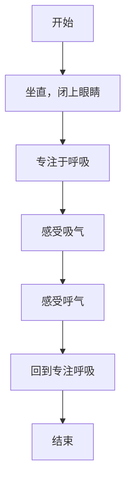
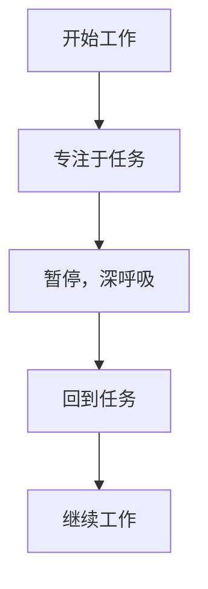

                 

### 《正念生活：活在当下的艺术与实践》

> 关键词：正念、当下、生活、艺术、实践

> 摘要：本文从技术视角出发，深入探讨正念生活的艺术与实践。通过一系列清晰的逻辑步骤，本文将揭示正念如何帮助我们活在当下，提升生活质量，并最终实现个人的全面成长与幸福。

## 引言

正念（Mindfulness）是一种古老的实践，源自佛教禅修。如今，它已成为现代生活中不可或缺的一部分，被广泛应用于心理健康、压力管理和提升生活质量等方面。正念的核心在于培养对当下的全然觉察和接纳，而不仅仅是思考过去或未来。本文旨在通过逻辑清晰的分析，探讨正念生活的艺术与实践，帮助读者理解如何在快节奏的现代生活中找到内心的宁静与和谐。

### 正念的起源与发展

#### 1.1 正念的概念背景

正念，字面意思是“专注于当前时刻”，其本质是一种心理状态，通过专注和觉察来实现对当前经验的全面接纳。这一概念起源于佛教的禅修实践，但在20世纪60年代，约翰·卡巴·金（Jon Kabat-Zinn）将其引入西方，并发展出正念减压（Mindfulness-Based Stress Reduction, MBSR）课程，从而在医学和心理学领域引起了广泛关注。

#### 1.2 正念的起源与发展历程

正念的起源可以追溯到2500年前的印度，当时佛陀通过禅修发现了正念的威力。随着时间的推移，正念在不同文化和宗教中逐渐发展，并在现代心理学中找到了自己的位置。特别是在西方，正念被证明对应对压力、焦虑和抑郁具有显著效果，因此得到了广泛的推广和应用。

### 正念在现代社会中的重要性

#### 2.1 压力管理

现代生活节奏快，压力大，正念提供了一种有效的压力管理工具。通过正念练习，个体能够更好地调节情绪，减少焦虑，从而提高生活质量。

#### 2.2 心理健康

正念不仅有助于应对压力，还能促进心理健康。通过培养对当前经历的觉察，个体能够更好地理解自己的情绪和行为，从而实现心理上的平衡和成长。

#### 2.3 社交关系

正念还能改善人际关系。通过提高自我觉察能力，个体能够更好地理解他人的情感和需求，从而建立更加和谐和积极的人际关系。

## 第二部分：正念生活的实践

### 2.1 正念的日常实践

#### 2.1.1 正念呼吸练习

正念呼吸练习是正念实践中最基本的练习之一。通过专注于呼吸，个体能够将注意力从日常的杂念中抽离出来，进入当下。

#### 2.1.2 正念饮食

正念饮食强调对食物的觉察和感激。通过慢慢咀嚼和品味，个体能够更好地体验食物的味道和质地，从而减少过度进食。

#### 2.1.3 正念运动

正念运动结合了身体锻炼和正念练习。无论是瑜伽、跑步还是太极拳，正念运动都能帮助个体在运动过程中保持专注和觉察。

### 2.2 正念工作法

#### 2.2.1 正念与专注力

正念练习可以提高专注力。通过培养对当前任务的专注，个体能够提高工作效率，减少错误。

#### 2.2.2 正念与时间管理

正念有助于更好地管理时间。通过培养对时间的觉察，个体能够更好地规划自己的日程，减少拖延。

#### 2.2.3 正念与团队协作

正念可以提高团队协作的质量。通过提高自我觉察能力，个体能够更好地理解他人的需求，从而建立更加和谐的合作关系。

### 2.3 正念教育

#### 2.3.1 正念在学校的应用

正念教育已被证明对学生的心理健康和学习表现具有积极影响。通过正念练习，学生能够更好地管理情绪，提高学习效率。

#### 2.3.2 正念在家庭教育的应用

正念教育也可以应用于家庭教育。通过培养孩子的正念意识，家长能够更好地与孩子沟通，促进亲子关系。

## 第三部分：正念生活的挑战与应对

### 3.1 正念生活中的障碍

#### 3.1.1 习惯养成

习惯养成的挑战在于改变长期形成的思维模式和行为习惯。通过坚持正念练习，个体能够逐渐克服这一挑战。

#### 3.1.2 抵触情绪

抵触情绪是正念练习中常见的障碍。通过学会接纳和观察情绪，个体能够更好地处理这些负面情绪。

#### 3.1.3 逃避心理

逃避心理是另一个挑战。通过培养对当前经历的专注，个体能够减少逃避行为，更好地面对现实。

### 3.2 挑战与应对策略

#### 3.2.1 正念冥想

正念冥想是一种有效的应对策略。通过冥想，个体能够培养对当前经历的专注和接纳。

#### 3.2.2 正念觉察

正念觉察有助于个体更好地了解自己的内心世界。通过觉察，个体能够更清晰地认识到自己的情绪和行为。

#### 3.2.3 正念沟通技巧

正念沟通技巧可以帮助个体在沟通中保持冷静和专注。通过提高自我觉察能力，个体能够更好地理解他人的需求，从而实现有效沟通。

## 第四部分：正念生活的案例研究

### 4.1 案例一：个人成长与自我发现

#### 4.1.1 案例背景

小李，一名繁忙的都市白领，感到生活压力巨大，寻求通过正念实践来提升生活质量。

#### 4.1.2 案例分析

小李通过坚持正念呼吸练习和冥想，逐渐减少了焦虑和压力。他学会了更好地管理时间，提高了工作效率，并在家庭中建立了更加和谐的关系。

#### 4.1.3 案例总结

通过正念实践，小李实现了个人成长与自我发现。他的生活变得更加充实和有意义。

### 4.2 案例二：职场压力下的应对策略

#### 4.2.1 案例背景

小张，一名软件工程师，经常感到工作压力大，影响了工作效率和家庭生活。

#### 4.2.2 案例分析

小张通过学习正念工作法，提高了专注力和工作效率。他学会了在紧张的工作中保持冷静，并在家庭中更好地平衡工作和生活。

#### 4.2.3 案例总结

正念工作法帮助小张应对了职场压力，提高了生活质量。

## 第五部分：正念生活的未来展望

### 5.1 正念生活的社会影响

#### 5.1.1 正念与公共健康

正念实践有助于提高公共健康水平。通过减少压力和焦虑，正念有助于预防慢性疾病。

#### 5.1.2 正念与心理健康服务

正念已被广泛应用于心理健康服务。通过正念练习，个体能够更好地管理情绪，提高心理健康水平。

#### 5.1.3 正念与教育改革

正念教育改革正在全球范围内进行。通过正念教育，学生能够更好地管理情绪，提高学习效果。

### 5.2 正念生活的未来趋势

#### 5.2.1 技术与正念

随着技术的进步，正念应用程序和工具将更加普及，帮助更多人实现正念生活。

#### 5.2.2 组织文化与正念

越来越多的组织开始重视正念文化，将其作为提高员工幸福感和生产力的手段。

#### 5.2.3 正念生活的可持续性

正念生活倡导可持续生活方式，有助于保护环境和促进社会和谐。

## 结论：正念生活的重要性与实践方法

正念生活是一种提升生活质量的有效方法。通过培养对当下的觉察和接纳，个体能够实现心理上的平衡和成长。本文介绍了正念的起源、重要性、实践方法以及未来趋势，旨在帮助读者更好地理解和实践正念生活。

## 附录：正念生活资源推荐

- 正念减压（MBSR）课程：由约翰·卡巴·金创立，提供系统性的正念训练。
- 正念冥想应用程序：如Headspace、Calm等，提供便捷的正念练习指导。
- 正念书籍推荐：《正念的奇迹》（《The Miracle of Mindfulness》）——一行禅师著。

### 作者信息

作者：AI天才研究院/AI Genius Institute & 禅与计算机程序设计艺术 /Zen And The Art of Computer Programming

