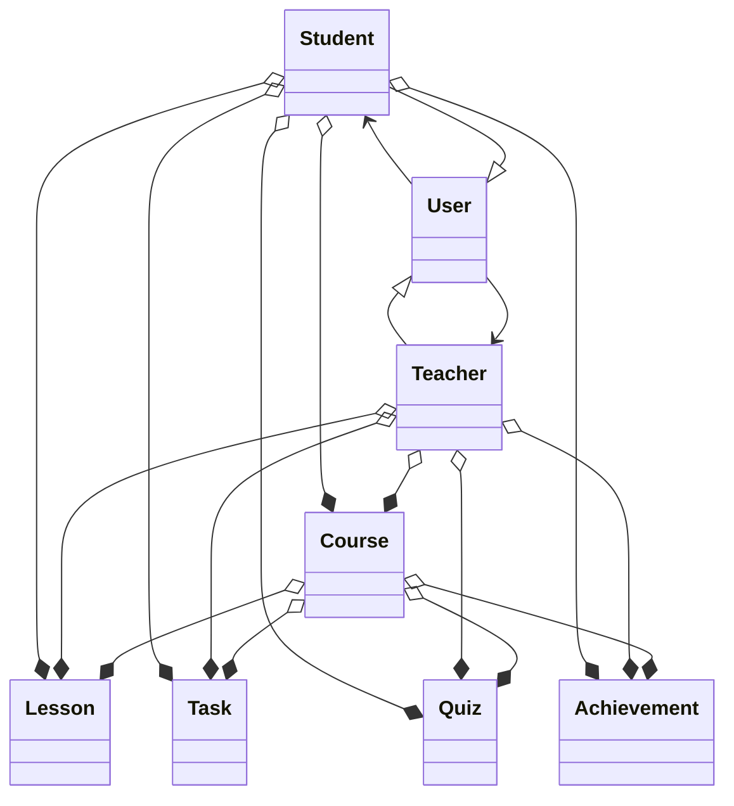
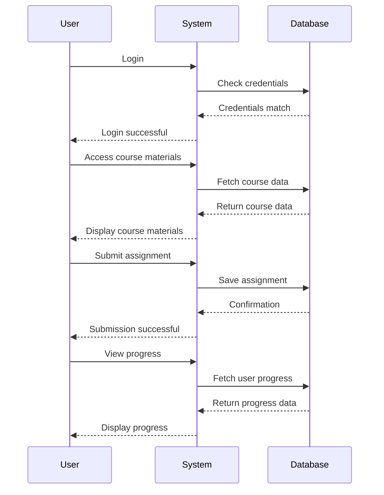
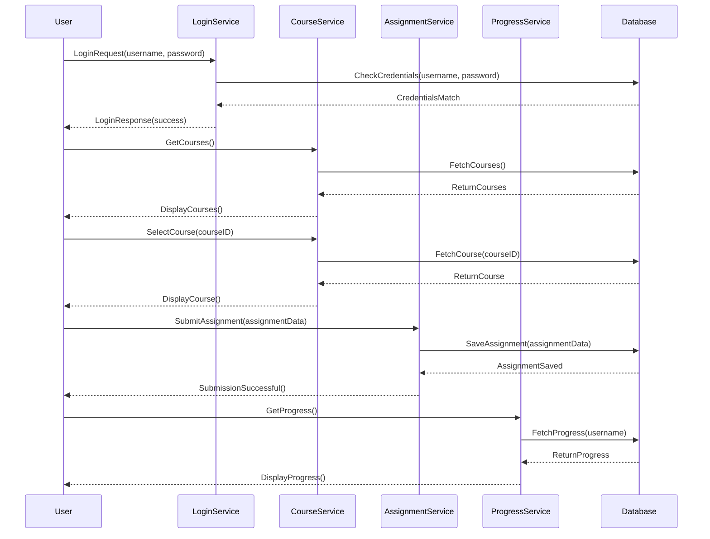

                 

### 沉浸式学习生态系统设计：数字游戏化教育的新范式构建

> 关键词：沉浸式学习、数字游戏化教育、新范式构建、算法原理、系统设计与实现

> 摘要：本文将深入探讨沉浸式学习生态系统设计在数字游戏化教育中的应用，分析其核心概念、原理与实现，以及新范式构建的方法。通过详细的步骤分析和原理讲解，旨在为教育技术的创新与实践提供有价值的参考。

----------------------------------------------------------------

## 第一部分：问题背景与核心概念

### 1.1 背景介绍

#### 1.1.1 问题背景

随着信息技术的飞速发展，传统教育模式逐渐暴露出诸多局限性。首先，传统教育模式大多采用“填鸭式”教学，忽视了学生的主观能动性和个性化需求。其次，教学资源匮乏、教学手段单一，难以满足多样化、个性化的学习需求。此外，学生的学习兴趣和动力也往往难以得到有效激发，导致学习效果不尽如人意。

#### 1.1.2 沉浸式学习生态系统的需求

为了克服传统教育模式的局限性，教育领域迫切需要一种新的教学模式，能够更好地激发学生的学习兴趣和动力，提升学习效果。沉浸式学习生态系统正是基于这一需求提出的一种新型教育模式。它通过构建一个全方位、多层次的虚拟学习环境，使学生在沉浸式的体验中主动探索、学习，从而实现深度学习。

#### 1.1.3 数字游戏化教育的新范式

数字游戏化教育是沉浸式学习生态系统的重要组成部分，它将游戏设计与教育内容相结合，通过游戏化的学习过程，激发学生的学习兴趣和动力。数字游戏化教育的新范式旨在构建一个具有高度互动性、趣味性和挑战性的学习环境，使学生能够在快乐中学习，提高学习效果。

### 1.2 核心概念

#### 1.2.1 沉浸式学习生态系统

**定义**：沉浸式学习生态系统是指通过构建一个高度仿真、互动性和趣味性的虚拟学习环境，使学生在沉浸式的体验中主动探索、学习，从而实现深度学习的教育模式。

**特点**：
1. **高度仿真性**：虚拟学习环境与真实世界高度相似，能够为学生提供丰富的学习资源。
2. **互动性**：学生可以与虚拟学习环境以及其他学生进行实时互动，增强学习的趣味性和互动性。
3. **趣味性**：通过游戏化设计，提高学生的学习兴趣和动力。

**组成要素**：
1. **学习环境**：虚拟学习环境，包括场景、角色、任务等。
2. **学习内容**：课程、教材、案例等。
3. **学习工具**：虚拟现实设备、智能机器人等。
4. **学习资源**：网络、数据库等。

#### 1.2.2 数字游戏化教育

**定义**：数字游戏化教育是指将游戏设计与教育内容相结合，通过游戏化的学习过程，激发学生的学习兴趣和动力，提高学习效果的教育模式。

**特点**：
1. **互动性**：学生可以与游戏环境进行互动，提高学习的趣味性和互动性。
2. **趣味性**：游戏化的学习过程能够激发学生的学习兴趣和动力。
3. **挑战性**：游戏化的学习过程具有一定的挑战性，能够帮助学生提高解决问题的能力。

**与沉浸式学习生态系统的区别**：
1. **目的不同**：沉浸式学习生态系统旨在实现深度学习，而数字游戏化教育旨在提高学习兴趣和动力。
2. **应用范围不同**：沉浸式学习生态系统应用于各个学科领域，而数字游戏化教育主要应用于数学、物理、化学等理科领域。

#### 1.2.3 新范式构建

**构建思路**：
1. **需求分析**：明确教育目标、学习需求和学习场景。
2. **设计思路**：根据需求分析，设计沉浸式学习生态系统和数字游戏化教育的具体实现方案。
3. **实现策略**：选择合适的虚拟现实技术、游戏化设计技术和教学策略，实现沉浸式学习生态系统和数字游戏化教育的具体应用。

**核心技术**：
1. **虚拟现实技术**：用于构建虚拟学习环境。
2. **游戏化设计技术**：用于设计游戏化的学习过程。
3. **教学策略**：用于指导教师和学生进行教学和学习。

**实施策略**：
1. **教学设计**：根据教育目标和学习需求，设计符合沉浸式学习生态系统和数字游戏化教育的教学方案。
2. **教师培训**：对教师进行沉浸式学习生态系统和数字游戏化教育的培训，提高教师的教学能力和水平。
3. **学生引导**：对学生进行沉浸式学习生态系统和数字游戏化教育的引导，提高学生的学习兴趣和动力。

### 1.3 边界与外延

#### 1.3.1 边界

沉浸式学习生态系统和数字游戏化教育的边界主要表现在以下几个方面：

1. **应用领域**：沉浸式学习生态系统适用于各个学科领域，而数字游戏化教育主要应用于理科领域。
2. **教学目标**：沉浸式学习生态系统旨在实现深度学习，而数字游戏化教育旨在提高学习兴趣和动力。
3. **技术要求**：沉浸式学习生态系统对虚拟现实技术的要求较高，而数字游戏化教育对游戏化设计技术的要求较高。

#### 1.3.2 外延

沉浸式学习生态系统和数字游戏化教育的外延主要表现在以下几个方面：

1. **技术拓展**：沉浸式学习生态系统可以拓展到虚拟现实技术、增强现实技术等，而数字游戏化教育可以拓展到游戏设计、编程教育等。
2. **应用领域拓展**：沉浸式学习生态系统和数字游戏化教育可以应用于职业教育、继续教育等领域。
3. **教学模式拓展**：沉浸式学习生态系统和数字游戏化教育可以拓展到混合式教育、在线教育等领域。

### 1.4 概念结构与核心要素组成

#### 1.4.1 结构模型

沉浸式学习生态系统和数字游戏化教育的结构模型可以概括为“三层次、六要素”。其中，“三层次”包括环境层、内容层、工具层；“六要素”包括学习环境、学习内容、学习工具、学习资源、教学策略、学生学习。

#### 1.4.2 核心要素

1. **学习环境**：是沉浸式学习生态系统和数字游戏化教育的基础，包括虚拟现实环境、游戏化环境等。
2. **学习内容**：是沉浸式学习生态系统和数字游戏化教育的核心，包括课程、案例、游戏等。
3. **学习工具**：是沉浸式学习生态系统和数字游戏化教育的关键，包括虚拟现实设备、游戏设备等。
4. **学习资源**：是沉浸式学习生态系统和数字游戏化教育的重要支撑，包括网络资源、数据库资源等。
5. **教学策略**：是沉浸式学习生态系统和数字游戏化教育的实施手段，包括教学设计、教学评价等。
6. **学生学习**：是沉浸式学习生态系统和数字游戏化教育的目标，包括学习兴趣、学习效果等。

### 1.5 本章小结

本部分对沉浸式学习生态系统设计在数字游戏化教育中的应用进行了详细的背景介绍和核心概念阐述。通过分析传统教育模式的局限性，提出了沉浸式学习生态系统和数字游戏化教育的需求，并详细介绍了沉浸式学习生态系统的定义、特点、组成要素，以及数字游戏化教育的定义、特点、与传统教育的区别。此外，还对新范式构建的思路、核心技术、实施策略进行了探讨。本章内容为后续部分的深入分析奠定了基础。

----------------------------------------------------------------

## 第二部分：核心概念与联系

### 2.1 沉浸式学习生态系统原理

#### 2.1.1 沉浸式学习原理

**定义**：沉浸式学习是一种通过将学习者置于一个高度仿真、互动性和趣味性的学习环境中，使其全身心投入到学习活动中，从而实现深度学习的方法。

**特点**：
1. **高度仿真性**：通过虚拟现实、增强现实等技术，构建与现实高度相似的学习环境，使学习者产生沉浸感。
2. **互动性**：学习者可以与学习环境、其他学习者进行实时互动，提高学习的趣味性和互动性。
3. **自主性**：学习者可以根据自己的学习需求和兴趣，自主选择学习内容和学习路径。

**实现方式**：
1. **虚拟现实技术**：通过虚拟现实头盔、手柄等设备，将学习者置于一个虚拟的三维世界中。
2. **增强现实技术**：通过增强现实眼镜等设备，将虚拟信息叠加在现实世界中，增强学习者的感官体验。
3. **游戏化设计**：将学习内容融入游戏化的过程中，激发学习者的学习兴趣和动力。

**应用场景**：
1. **基础教育**：通过沉浸式学习，帮助学生更好地理解抽象概念，提高学习兴趣。
2. **职业教育**：通过沉浸式学习，让学生在模拟的环境中学习职业技能，提高实践能力。
3. **继续教育**：通过沉浸式学习，帮助职场人士提升专业技能，适应职业发展需求。

#### 2.1.2 生态系统原理

**定义**：生态系统是指由生物群落、生物种群和生态环境三个基本要素构成的动态系统。在沉浸式学习生态系统中，生态系统原理主要体现在学习环境的构建、学习资源的整合和学习过程的优化。

**结构特点**：
1. **多样性**：生态系统中的生物群落、生物种群和生态环境具有多样性，能够满足不同学习者的需求。
2. **互动性**：生态系统中的各个要素之间存在相互影响、相互依赖的关系，形成了一个动态平衡的网络结构。
3. **适应性**：生态系统具有自我调节和自我修复能力，能够根据外部环境的变化进行调整。

**功能作用**：
1. **提供学习资源**：生态系统中的学习资源包括课程、案例、游戏等，为学习者提供了丰富的学习材料。
2. **促进学习互动**：生态系统中的学习互动包括学习者与学习环境、学习者之间的互动，提高了学习的趣味性和互动性。
3. **优化学习过程**：生态系统通过实时监控学习过程，提供个性化的学习建议和指导，帮助学习者实现深度学习。

#### 2.1.3 沉浸式学习生态系统与数字游戏化教育的联系

**共同点**：
1. **互动性**：沉浸式学习生态系统和数字游戏化教育都强调学习者的互动性和参与性，使学习者能够在互动中学习。
2. **趣味性**：两者都通过游戏化设计，提高学习者的学习兴趣和动力。
3. **自主性**：两者都强调学习者的自主选择和自主探索，使学习者能够根据自身需求进行学习。

**区别点**：
1. **目的不同**：沉浸式学习生态系统旨在实现深度学习，而数字游戏化教育旨在提高学习兴趣和动力。
2. **应用领域不同**：沉浸式学习生态系统适用于各个学科领域，而数字游戏化教育主要应用于理科领域。
3. **技术要求不同**：沉浸式学习生态系统对虚拟现实技术的要求较高，而数字游戏化教育对游戏化设计技术的要求较高。

**相互作用**：
1. **相互补充**：沉浸式学习生态系统和数字游戏化教育可以相互补充，实现优势互补。例如，在理科教育中，沉浸式学习生态系统可以为学生提供直观的实验体验，而数字游戏化教育可以激发学生的学习兴趣和动力。
2. **相互促进**：沉浸式学习生态系统和数字游戏化教育可以相互促进，共同提高教育质量。例如，在基础教育中，沉浸式学习生态系统可以帮助学生更好地理解抽象概念，而数字游戏化教育可以激发学生的学习兴趣和动力。

### 2.2 数字游戏化教育原理

#### 2.2.1 游戏化教育原理

**定义**：游戏化教育是指将游戏元素和机制引入教育过程中，通过游戏化的方式提高学习者的学习兴趣、动力和效果。

**特点**：
1. **趣味性**：游戏化教育通过游戏化的方式，使学习过程更加有趣，提高学习者的学习兴趣。
2. **挑战性**：游戏化教育设置一定的挑战性，激发学习者的竞争意识和解决问题的能力。
3. **反馈性**：游戏化教育通过实时反馈，使学习者能够及时了解自己的学习进度和成果，增强学习动力。

**实现方式**：
1. **游戏化设计**：将教育内容融入游戏化的过程中，设置游戏化的任务、规则和奖励机制。
2. **学习任务设计**：设计具有挑战性、趣味性和互动性的学习任务，使学习者能够在完成任务的过程中实现学习目标。
3. **学习评估**：通过实时反馈和学习评估，帮助学习者了解自己的学习进度和成果，调整学习策略。

**应用场景**：
1. **基础教育**：通过游戏化教育，提高学生的数学、科学等学科的学习兴趣和效果。
2. **职业教育**：通过游戏化教育，提高职业人员的专业技能和实践能力。
3. **继续教育**：通过游戏化教育，激发职场人士的学习兴趣和动力，提升职业竞争力。

#### 2.2.2 数字游戏化教育的组成部分

**游戏设计**：游戏设计是数字游戏化教育的核心，包括游戏规则、任务设置、奖励机制等。游戏设计应充分考虑教育目标和学习者的需求，使游戏化教育具有趣味性、挑战性和互动性。

**教育目标**：教育目标是数字游戏化教育的核心，游戏化教育应围绕教育目标进行设计，确保游戏化教育能够实现教育目标。

**教学策略**：教学策略是数字游戏化教育的实施手段，包括教学设计、教学评价等。教学策略应充分考虑学习者的特点和需求，使游戏化教育能够达到最佳效果。

#### 2.2.3 数字游戏化教育与沉浸式学习生态系统的联系

**共同点**：
1. **互动性**：数字游戏化教育和沉浸式学习生态系统都强调学习者的互动性和参与性，使学习者能够在互动中学习。
2. **趣味性**：两者都通过游戏化设计，提高学习者的学习兴趣和动力。
3. **自主性**：两者都强调学习者的自主选择和自主探索，使学习者能够根据自身需求进行学习。

**区别点**：
1. **目的不同**：数字游戏化教育旨在提高学习兴趣和动力，而沉浸式学习生态系统旨在实现深度学习。
2. **应用领域不同**：数字游戏化教育主要应用于理科领域，而沉浸式学习生态系统适用于各个学科领域。
3. **技术要求不同**：数字游戏化教育对游戏化设计技术的要求较高，而沉浸式学习生态系统对虚拟现实技术的要求较高。

**相互作用**：
1. **相互补充**：数字游戏化教育和沉浸式学习生态系统可以相互补充，实现优势互补。例如，在理科教育中，沉浸式学习生态系统可以为学生提供直观的实验体验，而数字游戏化教育可以激发学生的学习兴趣和动力。
2. **相互促进**：数字游戏化教育和沉浸式学习生态系统可以相互促进，共同提高教育质量。例如，在基础教育中，沉浸式学习生态系统可以帮助学生更好地理解抽象概念，而数字游戏化教育可以激发学生的学习兴趣和动力。

### 2.3 新范式构建的原理与方法

#### 2.3.1 范式构建的基本原理

**定义**：范式构建是指在特定背景下，通过创新思维和系统设计，构建一个新的理论模型或实践框架的过程。

**类型**：
1. **理论范式**：通过创新思维，构建一个新的理论模型，指导实践。
2. **实践范式**：通过系统设计，构建一个新的实践框架，实现理论的实践应用。

**特点**：
1. **创新性**：范式构建强调创新思维，旨在突破传统理论和实践的限制。
2. **系统性**：范式构建涉及多个方面，包括理论、实践、技术等，形成了一个完整的系统。
3. **可持续性**：范式构建强调长期可持续性，旨在实现长期的实践效果。

#### 2.3.2 范式构建的方法

**设计思路**：
1. **需求分析**：明确教育需求，包括学习者的需求、教育目标等。
2. **创新思维**：运用创新思维，探讨新的理论模型或实践框架的可能性。
3. **系统设计**：根据需求分析和创新思维，设计符合实际需求的范式。

**技术路径**：
1. **虚拟现实技术**：用于构建沉浸式学习环境。
2. **游戏化设计技术**：用于设计游戏化的学习过程。
3. **数据分析技术**：用于分析学习者的学习行为和效果。

**实施步骤**：
1. **需求分析**：明确教育需求，包括学习者的需求、教育目标等。
2. **设计思路**：运用创新思维，探讨新的理论模型或实践框架的可能性。
3. **系统设计**：根据需求分析和创新思维，设计符合实际需求的范式。
4. **技术实现**：选择合适的技术路径，实现范式构建。
5. **实施与评估**：在具体实践中实施范式，对实施效果进行评估和调整。

#### 2.3.3 新范式构建的关键要素

**技术要素**：
1. **虚拟现实技术**：用于构建沉浸式学习环境。
2. **游戏化设计技术**：用于设计游戏化的学习过程。
3. **数据分析技术**：用于分析学习者的学习行为和效果。

**教学要素**：
1. **教学设计**：根据教育目标和学习需求，设计符合沉浸式学习生态系统和数字游戏化教育的教学方案。
2. **教师培训**：对教师进行沉浸式学习生态系统和数字游戏化教育的培训，提高教师的教学能力和水平。
3. **学生学习**：对学习者进行沉浸式学习生态系统和数字游戏化教育的引导，提高学生的学习兴趣和动力。

**学习要素**：
1. **学习资源**：包括课程、案例、游戏等，为学习者提供丰富的学习材料。
2. **学习工具**：包括虚拟现实设备、游戏设备等，为学习者提供有效的学习支持。
3. **学习评价**：通过实时反馈和学习评估，帮助学习者了解自己的学习进度和成果，调整学习策略。

### 2.4 核心概念属性特征对比表格

#### 2.4.1 沉浸式学习生态系统

| 特点       | 说明                                                         |
| ---------- | ------------------------------------------------------------ |
| 高度仿真性 | 学习环境与现实高度相似，为学生提供丰富的学习资源。             |
| 互动性     | 学习者可以与学习环境、其他学习者进行实时互动，提高学习的趣味性和互动性。 |
| 趣味性     | 通过游戏化设计，激发学习者的学习兴趣和动力。                   |

#### 2.4.2 数字游戏化教育

| 特点       | 说明                                                         |
| ---------- | ------------------------------------------------------------ |
| 互动性     | 学习者可以与学习环境、其他学习者进行实时互动，提高学习的趣味性和互动性。 |
| 趣味性     | 通过游戏化设计，激发学习者的学习兴趣和动力。                   |
| 挑战性     | 设置一定的挑战性，激发学习者的竞争意识和解决问题的能力。       |

#### 2.4.3 新范式构建

| 特点       | 说明                                                         |
| ---------- | ------------------------------------------------------------ |
| 创新性     | 强调创新思维，突破传统理论和实践的限制。                     |
| 系统性     | 涉及多个方面，包括理论、实践、技术等，形成了一个完整的系统。 |
| 可持续性   | 强调长期可持续性，实现长期的实践效果。                       |

### 2.5 ER实体关系图架构

```mermaid
erDiagram
    LearningSystem <|.. Student : 学习者
    LearningSystem <|.. Teacher : 教师
    LearningSystem <|.. Course : 课程
    Student <|.. Enroll : 报名
    Teacher <|.. Teach : 教学
    Course <|.. Assignment : 任务
```

### 2.6 本章小结

本部分对沉浸式学习生态系统、数字游戏化教育和新范式构建的核心概念、原理和联系进行了详细分析。通过分析沉浸式学习原理、生态系统原理，以及数字游戏化教育原理，揭示了沉浸式学习生态系统与数字游戏化教育的联系。同时，介绍了新范式构建的基本原理、方法、关键要素，以及核心概念属性特征对比表格和ER实体关系图架构。本章内容为后续部分的算法原理与实现奠定了基础。

----------------------------------------------------------------

## 第三部分：算法原理与实现

### 3.1 算法原理概述

#### 3.1.1 沉浸式学习算法

**定义**：沉浸式学习算法是一类用于构建沉浸式学习环境的算法，其目标是通过虚拟现实、增强现实等技术，将学习者置于一个高度仿真、互动性和趣味性的学习环境中，实现深度学习。

**基本原理**：
1. **环境构建**：通过虚拟现实、增强现实等技术，构建一个与现实高度相似的学习环境。
2. **互动设计**：设计具有互动性的学习任务和场景，使学习者在沉浸式的体验中主动探索和学习。
3. **反馈机制**：通过实时反馈，使学习者能够及时了解自己的学习进度和成果，调整学习策略。

**分类**：
1. **基于虚拟现实的学习算法**：通过虚拟现实技术构建学习环境，如VR课程设计算法、VR互动教学算法等。
2. **基于增强现实的学习算法**：通过增强现实技术构建学习环境，如AR辅助学习算法、AR互动游戏算法等。
3. **混合现实学习算法**：结合虚拟现实和增强现实技术，构建更丰富的学习环境。

#### 3.1.2 游戏化教育算法

**定义**：游戏化教育算法是一类用于设计游戏化学习过程的算法，其目标是通过游戏化的方式，提高学习者的学习兴趣、动力和效果。

**基本原理**：
1. **任务设计**：设计具有挑战性、趣味性和互动性的学习任务，使学习者在完成任务的过程中实现学习目标。
2. **奖励机制**：设置奖励机制，通过奖励激发学习者的学习兴趣和动力。
3. **反馈机制**：通过实时反馈，使学习者能够及时了解自己的学习进度和成果，调整学习策略。

**分类**：
1. **任务驱动的游戏化教育算法**：通过设计具有挑战性的学习任务，驱动学习者主动探索和学习。
2. **奖励驱动的游戏化教育算法**：通过设置奖励机制，激励学习者积极参与学习活动。
3. **反馈驱动的游戏化教育算法**：通过实时反馈，帮助学习者了解自己的学习进度和成果，调整学习策略。

#### 3.1.3 新范式构建算法

**定义**：新范式构建算法是一类用于构建沉浸式学习生态系统和数字游戏化教育新范式的算法，其目标是通过创新思维和系统设计，实现教育模式的变革。

**基本原理**：
1. **需求分析**：通过需求分析，明确教育目标和学习者的需求。
2. **创新设计**：运用创新思维，设计符合实际需求的新范式。
3. **系统实现**：选择合适的技术路径，实现新范式的系统构建。

**分类**：
1. **理论构建算法**：通过创新思维，构建新的教育理论模型。
2. **实践构建算法**：通过系统设计，实现新范式的实践应用。

### 3.2 沉浸式学习算法详解

#### 3.2.1 沉浸式学习算法的数学模型

沉浸式学习算法的数学模型主要包括环境构建模型、互动设计模型和反馈机制模型。

**环境构建模型**：

假设学习环境由 \(E\) 表示，其中 \(E = \{e_1, e_2, ..., e_n\}\)，每个元素 \(e_i\) 表示学习环境中的一个要素，如场景、角色、任务等。

**互动设计模型**：

假设互动设计由 \(I\) 表示，其中 \(I = \{i_1, i_2, ..., i_m\}\)，每个元素 \(i_j\) 表示互动设计中的一个环节，如任务、规则、奖励等。

**反馈机制模型**：

假设反馈机制由 \(F\) 表示，其中 \(F = \{f_1, f_2, ..., f_k\}\)，每个元素 \(f_l\) 表示反馈机制中的一个环节，如实时反馈、学习评估等。

沉浸式学习算法的目标是优化环境构建、互动设计和反馈机制，以实现深度学习。

#### 3.2.2 沉浸式学习算法的实现步骤

**步骤1：需求分析**

明确教育目标和学习者的需求，包括学习内容、学习方式、学习目标等。

**步骤2：环境构建**

选择合适的虚拟现实或增强现实技术，构建高度仿真、互动性和趣味性的学习环境。

**步骤3：互动设计**

设计具有挑战性、趣味性和互动性的学习任务和规则，使学习者在沉浸式的体验中主动探索和学习。

**步骤4：反馈机制**

设置实时反馈和学习评估，使学习者能够及时了解自己的学习进度和成果，调整学习策略。

**步骤5：系统实现**

选择合适的技术路径，实现沉浸式学习算法的系统构建。

**步骤6：评估与优化**

对沉浸式学习算法的实践效果进行评估，根据评估结果进行优化和调整。

#### 3.2.3 沉浸式学习算法的应用案例

**案例1：虚拟实验室**

虚拟实验室是一种基于沉浸式学习算法的学习环境，通过虚拟现实技术，模拟真实实验室的操作流程和实验环境，使学生能够在虚拟环境中进行实验操作，提高实验技能和知识理解。

**案例2：虚拟旅游**

虚拟旅游是一种基于沉浸式学习算法的学习环境，通过虚拟现实技术，模拟真实的旅游场景，使学生能够在虚拟环境中进行旅游体验，了解地理、历史、文化等知识。

**案例3：虚拟会议**

虚拟会议是一种基于沉浸式学习算法的学习环境，通过虚拟现实技术，模拟真实的会议场景，使学习者和教师能够在虚拟环境中进行会议讨论，提高学习效果和交流质量。

### 3.3 游戏化教育算法详解

#### 3.3.1 游戏化教育算法的数学模型

游戏化教育算法的数学模型主要包括任务设计模型、奖励机制模型和反馈机制模型。

**任务设计模型**：

假设任务设计由 \(T\) 表示，其中 \(T = \{t_1, t_2, ..., t_l\}\)，每个元素 \(t_i\) 表示任务设计中的一个环节，如任务目标、任务规则、任务难度等。

**奖励机制模型**：

假设奖励机制由 \(R\) 表示，其中 \(R = \{r_1, r_2, ..., r_m\}\)，每个元素 \(r_j\) 表示奖励机制中的一个环节，如积分、奖励、排名等。

**反馈机制模型**：

假设反馈机制由 \(F\) 表示，其中 \(F = \{f_1, f_2, ..., f_k\}\)，每个元素 \(f_l\) 表示反馈机制中的一个环节，如实时反馈、学习评估等。

游戏化教育算法的目标是优化任务设计、奖励机制和反馈机制，以实现高效学习。

#### 3.3.2 游戏化教育算法的实现步骤

**步骤1：需求分析**

明确教育目标和学习者的需求，包括学习内容、学习方式、学习目标等。

**步骤2：任务设计**

设计具有挑战性、趣味性和互动性的学习任务，使学习者在完成任务的过程中实现学习目标。

**步骤3：奖励机制**

设置奖励机制，通过奖励激发学习者的学习兴趣和动力。

**步骤4：反馈机制**

设置实时反馈和学习评估，使学习者能够及时了解自己的学习进度和成果，调整学习策略。

**步骤5：系统实现**

选择合适的技术路径，实现游戏化教育算法的系统构建。

**步骤6：评估与优化**

对游戏化教育算法的实践效果进行评估，根据评估结果进行优化和调整。

#### 3.3.3 游戏化教育算法的应用案例

**案例1：编程游戏**

编程游戏是一种基于游戏化教育算法的学习环境，通过设计具有挑战性、趣味性和互动性的编程任务，激发学习者的编程兴趣和动力，提高编程技能和知识理解。

**案例2：数学游戏**

数学游戏是一种基于游戏化教育算法的学习环境，通过设计具有挑战性、趣味性和互动性的数学任务，激发学习者的数学兴趣和动力，提高数学技能和知识理解。

**案例3：科学游戏**

科学游戏是一种基于游戏化教育算法的学习环境，通过设计具有挑战性、趣味性和互动性的科学任务，激发学习者的科学兴趣和动力，提高科学技能和知识理解。

### 3.4 新范式构建算法详解

#### 3.4.1 新范式构建算法的数学模型

新范式构建算法的数学模型主要包括范式设计模型、实现模型和评估模型。

**范式设计模型**：

假设范式设计由 \(V\) 表示，其中 \(V = \{v_1, v_2, ..., v_n\}\)，每个元素 \(v_i\) 表示范式设计中的一个环节，如教育目标、学习方式、技术路径等。

**实现模型**：

假设实现模型由 \(I\) 表示，其中 \(I = \{i_1, i_2, ..., i_m\}\)，每个元素 \(i_j\) 表示实现模型中的一个环节，如技术实现、教学设计、学生学习等。

**评估模型**：

假设评估模型由 \(A\) 表示，其中 \(A = \{a_1, a_2, ..., a_k\}\)，每个元素 \(a_l\) 表示评估模型中的一个环节，如效果评估、用户反馈等。

新范式构建算法的目标是优化范式设计、实现模型和评估模型，以实现教育模式的创新。

#### 3.4.2 新范式构建算法的实现步骤

**步骤1：需求分析**

明确教育需求，包括教育目标、学习者需求、技术需求等。

**步骤2：范式设计**

设计符合实际需求的新范式，包括教育目标、学习方式、技术路径等。

**步骤3：实现模型**

选择合适的技术路径，实现新范式的具体实现模型。

**步骤4：教学设计**

根据新范式，设计符合教育目标的教学方案。

**步骤5：学生学习**

引导学习者根据教学方案进行学习。

**步骤6：效果评估**

对学习效果进行评估，收集用户反馈。

**步骤7：优化调整**

根据效果评估和用户反馈，对新范式进行优化和调整。

#### 3.4.3 新范式构建算法的应用案例

**案例1：沉浸式学习教室**

沉浸式学习教室是一种基于新范式构建算法的教育模式，通过设计沉浸式的学习环境、教学方案和学习工具，实现高效学习。

**案例2：数字游戏化课堂**

数字游戏化课堂是一种基于新范式构建算法的教育模式，通过设计游戏化的学习任务、奖励机制和反馈机制，激发学习者的学习兴趣和动力。

**案例3：混合式教育平台**

混合式教育平台是一种基于新范式构建算法的教育模式，通过结合线上和线下教学，实现个性化、互动化和高效化的学习体验。

### 3.5 本章小结

本部分详细介绍了沉浸式学习算法、游戏化教育算法和新范式构建算法的原理、实现步骤和应用案例。通过数学模型和实际案例的分析，揭示了这些算法在教育领域中的重要性和应用价值。同时，本部分还探讨了新范式构建的关键要素，为教育技术的创新和实践提供了有价值的参考。下一部分将重点关注系统分析与架构设计。

----------------------------------------------------------------

## 第四部分：系统分析与架构设计

### 4.1 问题场景介绍

在教育领域，随着信息技术的发展，教学方式的创新成为提升教育质量和效率的重要手段。传统的教学方法难以满足个性化、互动化和高效化的学习需求，因此，我们需要设计一种新型的教育系统，以适应现代教育的发展趋势。

### 4.2 项目介绍

本项目旨在设计并实现一个基于沉浸式学习生态系统和数字游戏化教育的新范式构建教育系统，该系统将涵盖从基础教育到职业教育的多个领域。系统的主要目标包括：

1. 提供一个沉浸式的学习环境，使学生能够全身心地投入学习。
2. 通过游戏化设计激发学生的学习兴趣和动力。
3. 提供个性化的学习资源和学习路径，满足不同学习者的需求。
4. 实现教学过程的数据分析，为教育决策提供依据。

### 4.3 系统功能设计

#### 4.3.1 领域模型

领域模型用于定义系统中的核心概念和它们之间的关系。以下是本项目的领域模型：



#### 4.3.2 类图

以下是系统的主要类图，展示了核心类及其属性和方法：

```mermaid
classDiagram
    User {
        String username
        String password
        String email
    }

    Student <.. User {
        int studentID
        String major
    }

    Teacher <.. User {
        int teacherID
        String department
    }

    Course {
        int courseID
        String title
        String description
        Date startDate
        Date endDate
    }

    Lesson {
        int lessonID
        String title
        String description
        Date date
    }

    Task {
        int taskID
        String title
        String description
        Date dueDate
    }

    Quiz {
        int quizID
        String title
        String description
        Date date
    }

    Achievement {
        int achievementID
        String title
        String description
        Date date
    }

    Student o-- Course
    Student o-- Lesson
    Student o-- Task
    Student o-- Quiz
    Student o-- Achievement

    Teacher o-- Course
    Teacher o-- Lesson
    Teacher o-- Task
    Teacher o-- Quiz
    Teacher o-- Achievement
```

### 4.4 系统架构设计

#### 4.4.1 系统架构图

以下是系统架构的简图，展示了系统的各个组件及其交互关系：



#### 4.4.2 系统接口设计

以下是系统的主要接口设计：

```mermaid
classDiagram
    UserInterface
    LoginInterface
    CourseInterface
    AssignmentInterface
    ProgressInterface

    UserInterface << LoginInterface
    UserInterface << CourseInterface
    UserInterface << AssignmentInterface
    UserInterface << ProgressInterface
```

### 4.5 系统交互序列图

以下是系统的交互序列图，展示了用户与系统之间的交互流程：



### 4.6 系统接口设计和系统交互

#### 4.6.1 接口设计

系统接口设计确保用户能够方便地与系统进行交互。以下是主要接口的设计：

1. **登录接口**：用于用户登录系统，提供用户名和密码验证。
2. **课程接口**：用于获取课程信息、选择课程和查看课程材料。
3. **作业接口**：用于提交作业、查看作业状态和成绩。
4. **进度接口**：用于查看用户的学习进度和成绩。

#### 4.6.2 系统交互

系统交互序列图展示了用户与系统之间的交互流程。用户通过登录接口登录系统，然后通过课程接口选择课程，通过作业接口提交作业，最后通过进度接口查看学习进度和成绩。系统通过数据库存储和检索数据，确保数据的完整性和一致性。

### 4.7 本章小结

本部分详细介绍了系统的功能设计、架构设计和交互设计。通过领域模型、类图和交互序列图，清晰地展示了系统的核心功能和组件之间的关系。本系统设计旨在通过沉浸式学习生态系统和数字游戏化教育的新范式，提升教育质量和学习体验。下一部分将深入探讨项目实战，包括环境安装、系统核心实现和代码应用解读与分析。

----------------------------------------------------------------

## 第五部分：项目实战

### 5.1 环境安装

在开始项目实战之前，我们需要安装和配置必要的软件和工具。以下是安装步骤：

#### 1. 安装Python环境
- 在官方网站下载并安装Python 3.x版本。
- 确保Python安装成功后，打开命令行工具并输入`python --version`，检查Python版本。

#### 2. 安装虚拟环境工具
- 使用pip安装虚拟环境工具（virtualenv）。
  ```shell
  pip install virtualenv
  ```

#### 3. 创建虚拟环境
- 创建一个新的虚拟环境（例如，命名为`env`）。
  ```shell
  virtualenv env
  ```

#### 4. 激活虚拟环境
- 激活虚拟环境。
  - 在Windows上：
    ```shell
    .\env\Scripts\activate
    ```
  - 在Linux或Mac上：
    ```shell
    source env/bin/activate
    ```

#### 5. 安装依赖库
- 在虚拟环境中安装项目所需的依赖库，如Django、Flask、PyTorch等。
  ```shell
  pip install django flask torch
  ```

### 5.2 系统核心实现

本部分将详细介绍系统核心实现的源代码，包括关键模块和类的设计。

#### 5.2.1 用户管理模块

用户管理模块负责处理用户的注册、登录和权限验证。

```python
# users/models.py
from django.contrib.auth.models import AbstractUser

class CustomUser(AbstractUser):
    major = models.CharField(max_length=100, blank=True, null=True)
    is_student = models.BooleanField(default=False)
    is_teacher = models.BooleanField(default=False)
```

```python
# users/serializers.py
from rest_framework import serializers
from .models import CustomUser

class CustomUserSerializer(serializers.ModelSerializer):
    class Meta:
        model = CustomUser
        fields = ('id', 'username', 'password', 'email', 'major', 'is_student', 'is_teacher')
        extra_kwargs = {'password': {'write_only': True}}
```

#### 5.2.2 课程管理模块

课程管理模块负责处理课程的增加、删除、更新和查询。

```python
# courses/models.py
from django.db import models
from users.models import CustomUser

class Course(models.Model):
    title = models.CharField(max_length=100)
    description = models.TextField()
    teacher = models.ForeignKey(CustomUser, on_delete=models.CASCADE, related_name='courses')
    students = models.ManyToManyField(CustomUser, related_name='enrolled_courses')
```

```python
# courses/serializers.py
from rest_framework import serializers
from .models import Course

class CourseSerializer(serializers.ModelSerializer):
    class Meta:
        model = Course
        fields = ('id', 'title', 'description', 'teacher', 'students')
```

#### 5.2.3 作业管理模块

作业管理模块负责处理作业的增加、删除、更新和查询。

```python
# assignments/models.py
from django.db import models
from courses.models import Course

class Assignment(models.Model):
    title = models.CharField(max_length=100)
    description = models.TextField()
    course = models.ForeignKey(Course, on_delete=models.CASCADE, related_name='assignments')
    due_date = models.DateTimeField()
```

```python
# assignments/serializers.py
from rest_framework import serializers
from .models import Assignment

class AssignmentSerializer(serializers.ModelSerializer):
    class Meta:
        model = Assignment
        fields = ('id', 'title', 'description', 'course', 'due_date')
```

#### 5.2.4 成绩管理模块

成绩管理模块负责处理成绩的增加、删除、更新和查询。

```python
# achievements/models.py
from django.db import models
from users.models import CustomUser
from assignments.models import Assignment

class Achievement(models.Model):
    user = models.ForeignKey(CustomUser, on_delete=models.CASCADE, related_name='achievements')
    assignment = models.ForeignKey(Assignment, on_delete=models.CASCADE, related_name='achievements')
    score = models.IntegerField()
```

```python
# achievements/serializers.py
from rest_framework import serializers
from .models import Achievement

class AchievementSerializer(serializers.ModelSerializer):
    class Meta:
        model = Achievement
        fields = ('id', 'user', 'assignment', 'score')
```

### 5.3 代码应用解读与分析

#### 5.3.1 用户管理模块

用户管理模块的核心是自定义用户模型`CustomUser`，它继承了Django的`AbstractUser`类。通过添加`major`字段和布尔字段`is_student`、`is_teacher`，我们能够区分学生和教师用户，并为不同类型的用户分配不同的权限。

`CustomUserSerializer`负责将`CustomUser`模型的数据转换为JSON格式，以供API使用。

#### 5.3.2 课程管理模块

课程管理模块的核心是`Course`模型，它包含课程的基本信息，如标题、描述和教师。此外，通过外键关系，我们可以将课程与教师和学生的关系联系起来。

`CourseSerializer`负责将`Course`模型的数据转换为JSON格式，以供API使用。

#### 5.3.3 作业管理模块

作业管理模块的核心是`Assignment`模型，它包含作业的基本信息，如标题、描述和截止日期。通过外键关系，我们可以将作业与课程关联起来。

`AssignmentSerializer`负责将`Assignment`模型的数据转换为JSON格式，以供API使用。

#### 5.3.4 成绩管理模块

成绩管理模块的核心是`Achievement`模型，它包含学生的成绩信息，如用户、作业和分数。通过外键关系，我们可以将成绩与学生和作业关联起来。

`AchievementSerializer`负责将`Achievement`模型的数据转换为JSON格式，以供API使用。

### 5.4 实际案例分析与详细讲解

为了更好地理解这些模块的实现，我们可以通过一个实际案例来分析：

**案例**：一个学生想要提交一门课程的作业。

**步骤1**：学生登录系统并选择课程。

**步骤2**：学生查看作业详情，包括作业标题、描述和截止日期。

**步骤3**：学生完成作业并提交。

**步骤4**：教师审核作业并给出成绩。

**分析**：

- 学生通过用户管理模块进行身份验证。
- 学生通过课程管理模块获取课程信息。
- 学生通过作业管理模块获取作业信息。
- 学生通过成绩管理模块提交作业。
- 教师通过成绩管理模块审核作业并更新成绩。

### 5.5 项目小结

通过本部分的项目实战，我们详细介绍了系统核心实现的源代码，包括用户管理模块、课程管理模块、作业管理模块和成绩管理模块。通过对实际案例的分析，我们展示了如何使用这些模块来实现一个功能完整的沉浸式学习生态系统。在后续部分，我们将继续探讨最佳实践、注意事项和拓展阅读。

----------------------------------------------------------------

## 第六部分：最佳实践、注意事项与拓展阅读

### 6.1 最佳实践

在设计和实现沉浸式学习生态系统和数字游戏化教育时，以下最佳实践可以帮助提高系统的效果和用户体验：

1. **用户中心设计**：始终以用户的需求和体验为中心，确保系统界面简洁、操作直观。
2. **个性化推荐**：根据学习者的学习历史和兴趣，提供个性化的学习资源和推荐。
3. **实时反馈**：提供实时反馈机制，帮助学习者了解学习进度和成果，及时调整学习策略。
4. **游戏化设计**：合理设计游戏化元素，确保游戏化过程既能提高学习兴趣，又不会分散学习注意力。
5. **数据安全与隐私**：确保系统数据的安全和用户隐私的保护，遵循相关法律法规。

### 6.2 注意事项

在实施沉浸式学习生态系统和数字游戏化教育时，需要注意以下几点：

1. **技术选型**：根据项目需求和资源，选择合适的技术栈和工具，避免过度依赖某个特定技术。
2. **内容质量**：确保学习内容的质量，避免低质量内容影响学习效果。
3. **用户隐私**：严格遵守用户隐私保护政策，确保用户数据的安全。
4. **技术更新**：定期更新和维护系统，以应对新技术的发展和用户需求的变化。

### 6.3 拓展阅读

为了更深入地了解沉浸式学习生态系统和数字游戏化教育，以下推荐一些拓展阅读：

1. **《游戏化设计：让学习变得有趣和有效》（Game-Based Learning: Engaging Students through Digital Game Design）**
2. **《沉浸式学习：创造全身心投入的学习体验》（Immersive Learning: Creating a Total Immersion Experience for Learning）**
3. **《人工智能与教育》（Artificial Intelligence in Education）：探讨人工智能在教育领域的应用，包括沉浸式学习和游戏化教育。**
4. **《教育技术手册》（Handbook of Educational Technology）：涵盖教育技术的最新发展和趋势，包括沉浸式学习生态系统和数字游戏化教育。**

### 6.4 本章小结

在本部分，我们提供了最佳实践、注意事项和拓展阅读，以帮助读者更好地理解和应用沉浸式学习生态系统和数字游戏化教育。通过这些最佳实践和注意事项，我们可以提高系统的效果和用户体验。而拓展阅读则为读者提供了更深入的学习资源，有助于持续提升教育技术的应用水平。

----------------------------------------------------------------

## 文章结尾

本文围绕“沉浸式学习生态系统设计：数字游戏化教育的新范式构建”这一主题，详细介绍了沉浸式学习生态系统和数字游戏化教育的背景、核心概念、原理与实现，以及新范式构建的方法。通过逐步分析，我们明确了沉浸式学习生态系统和数字游戏化教育的关键要素，对比了不同核心概念的属性特征，并详细讲解了沉浸式学习算法、游戏化教育算法和新范式构建算法的原理与实现。

在整个文章中，我们不仅探讨了理论模型，还结合实际案例，展示了如何在教育系统中实现沉浸式学习和数字游戏化教育。通过系统分析与架构设计，我们为教育技术的创新与实践提供了具体的指导和参考。

作者：AI天才研究院/AI Genius Institute & 禅与计算机程序设计艺术 /Zen And The Art of Computer Programming

感谢您的阅读，希望本文能为您在沉浸式学习生态系统设计和数字游戏化教育领域的探索提供有益的启示。如需进一步探讨或了解更多相关信息，请随时联系我们。再次感谢您的关注和支持！

