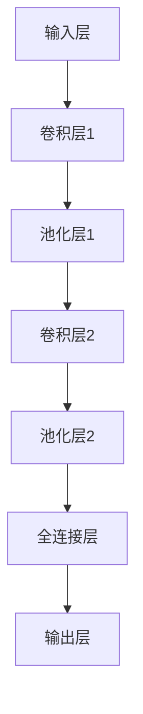
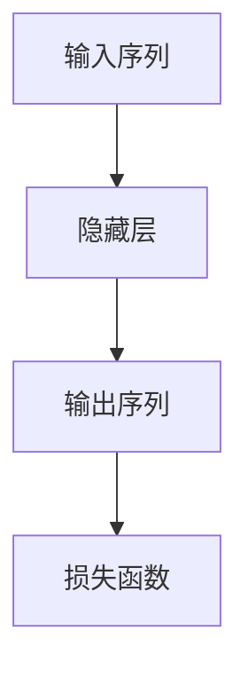
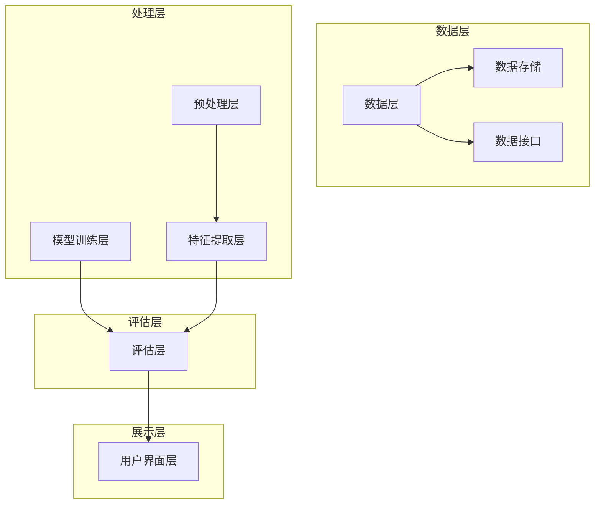
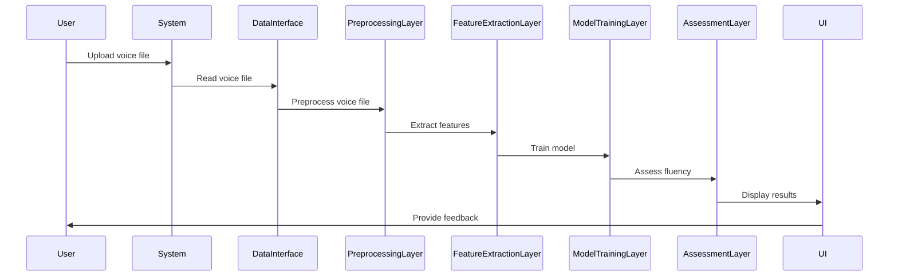

                 

### 《深度学习在口语流畅度评估中的应用》

**关键词：**
- 深度学习
- 口语流畅度评估
- 神经网络
- 数据集
- 模型架构
- 实际案例

**摘要：**
本文旨在探讨深度学习在口语流畅度评估中的应用。首先，我们回顾了深度学习的发展历程和基本原理，接着介绍了口语流畅度的定义及其评估的重要性。随后，本文详细阐述了如何使用深度学习技术构建和优化口语流畅度评估模型，并通过实际案例展示了模型的应用效果。文章最后对研究成果进行了总结，并提出了未来研究的方向和挑战。

----------------------------------------------------------------

## 第一部分：引言

### 第1章：问题背景与意义

#### 1.1.1 口语流畅度评估的重要性

口语流畅度是口语表达的一个重要指标，它不仅关系到个人的语言能力和交流效果，还与社交场合中的表现密切相关。在语言教学、口语训练以及语言评测等领域，准确评估口语流畅度具有重要意义。

#### 1.1.2 深度学习的发展与应用

深度学习作为一种强大的机器学习技术，在图像识别、自然语言处理等领域取得了显著成果。近年来，深度学习开始应用于口语流畅度评估，展示了其巨大的潜力。

#### 1.1.3 口语流畅度评估的挑战

传统的口语流畅度评估方法往往依赖于人工判断，具有主观性且效率低下。随着口语数据量的增加，如何构建高效、准确的评估模型成为一大挑战。

#### 1.2 研究目标与内容框架

本研究旨在通过深度学习技术，提出一种能够自动评估口语流畅度的模型。具体研究内容包括：深度学习基本原理的介绍、口语流畅度评估方法的研究、深度学习在口语流畅度评估中的应用等。

#### 1.3 文章结构概述

本文结构分为四个部分：引言、深度学习基础、口语流畅度评估、深度学习在口语流畅度评估中的应用。每个部分都将详细探讨相关主题。

#### 1.4 本书适用人群

本文适合以下人群：
- 研究人员：对深度学习和口语流畅度评估有兴趣的研究人员。
- 教师与教育工作者：希望提高口语教学效果的教师和教育工作者。
- 口语交流爱好者：希望提升口语流畅度的口语交流爱好者。

----------------------------------------------------------------

## 第二部分：深度学习基础

### 第2章：深度学习原理

#### 2.1.1 深度学习的起源与发展

深度学习起源于1980年代，经过数十年的发展，随着计算能力的提升和大数据的出现，深度学习迎来了爆发期。如今，深度学习已成为人工智能领域的重要分支。

#### 2.1.2 深度学习的基本概念

深度学习是一种模拟人脑神经网络结构的计算模型，通过多层神经网络进行特征学习和模式识别。其主要特点是自动提取数据中的高层次抽象特征。

#### 2.1.3 深度学习的基本架构

深度学习的基本架构包括输入层、隐藏层和输出层。输入层接收原始数据，隐藏层进行特征提取和变换，输出层生成预测结果。

### 2.2 神经网络

神经网络是深度学习的基础，由大量相互连接的神经元组成。

#### 2.2.1 神经网络的基本原理

神经网络通过学习输入和输出之间的关系，自动调整神经元之间的连接权重，实现数据的分类和回归任务。

#### 2.2.2 前馈神经网络

前馈神经网络是最简单的神经网络结构，数据从输入层流向输出层，中间经过多个隐藏层。

#### 2.2.3 卷积神经网络

卷积神经网络（CNN）在图像识别任务中表现出色，其核心思想是利用卷积运算提取图像特征。

### 2.3 循环神经网络

循环神经网络（RNN）适用于处理序列数据，如文本和语音。

#### 2.3.1 循环神经网络的基本原理

RNN通过引入循环结构，使得信息可以在序列的不同时间点传递，实现长距离依赖建模。

#### 2.3.2 长短时记忆网络

长短时记忆网络（LSTM）是RNN的一种改进，能够更好地处理长序列数据。

#### 2.3.3 门控循环单元

门控循环单元（GRU）是另一种改进RNN的结构，通过引入更新门和重置门，进一步提高了模型的性能。

### 2.4 深度学习框架

深度学习框架提供了高效的计算和优化工具，使得深度学习模型的开发变得简便。

#### 2.4.1 TensorFlow

TensorFlow是谷歌开发的开源深度学习框架，具有强大的功能和广泛的应用。

#### 2.4.2 PyTorch

PyTorch是Facebook开发的开源深度学习框架，以其简洁的代码和强大的灵活性受到开发者喜爱。

#### 2.4.3 其他深度学习框架

除了TensorFlow和PyTorch，还有许多其他深度学习框架，如Theano、MXNet等，各具特点。

### 2.5 深度学习应用案例

深度学习在多个领域取得了显著成果，如图像识别、自然语言处理和语音识别。

#### 2.5.1 图像识别

图像识别是深度学习最早的应用之一，通过CNN实现图像分类和物体检测。

#### 2.5.2 自然语言处理

自然语言处理（NLP）是深度学习的重要应用领域，通过RNN和Transformer实现文本分类、机器翻译等任务。

#### 2.5.3 其他领域应用

深度学习还在医疗、金融、自动驾驶等领域取得了广泛应用，展现了其强大的潜力。

----------------------------------------------------------------

## 第三部分：口语流畅度评估

### 第3章：口语流畅度评估方法

#### 3.1.1 口语流畅度的定义与指标

口语流畅度是指个体在口语表达过程中，语速、停顿、发音准确性等方面的表现。常用的评估指标包括停顿频率、语速、发音准确性等。

#### 3.1.2 传统评估方法

传统的口语流畅度评估方法主要包括主观评价和自动化评估。主观评价依赖于人工判断，存在主观性和不一致性问题。自动化评估通过算法对口语数据进行分析，具有较高的效率和一致性。

#### 3.1.3 深度学习在口语流畅度评估中的应用

深度学习在口语流畅度评估中的应用主要体现在模型的构建和优化。通过学习大量口语数据，深度学习模型可以自动提取特征并生成评估结果，提高了评估的准确性和效率。

----------------------------------------------------------------

### 第4章：口语流畅度数据集

#### 4.1.1 数据集的收集与整理

口语流畅度数据集的收集是一个复杂的过程，需要考虑语音质量、说话者背景、话题多样性等因素。收集到的数据需要经过预处理，包括去除噪音、标准化处理等，以确保数据质量。

#### 4.1.2 数据集的特征

口语流畅度数据集通常包含多个特征，如音高、音量、语速、停顿时间等。这些特征通过音频信号处理技术提取，用于训练深度学习模型。

#### 4.1.3 数据集的使用

在口语流畅度评估中，数据集的使用分为训练集、验证集和测试集。训练集用于训练模型，验证集用于模型调整和优化，测试集用于模型评估。

----------------------------------------------------------------

## 第四部分：深度学习在口语流畅度评估中的应用

### 第5章：基于深度学习的口语流畅度评估模型

#### 5.1.1 模型架构设计

基于深度学习的口语流畅度评估模型通常采用卷积神经网络（CNN）或循环神经网络（RNN）架构。模型设计包括输入层、隐藏层和输出层，其中隐藏层负责特征提取和模式识别。

#### 5.1.2 模型训练与优化

模型训练过程中，需要使用大量的口语数据集进行训练。训练过程包括前向传播、反向传播和权重更新。优化策略如梯度下降、动量优化等可以加速训练过程。

#### 5.1.3 模型评估与验证

模型评估和验证是确保模型性能的重要步骤。常用的评估指标包括准确率、召回率、F1分数等。通过交叉验证和测试集评估，可以全面了解模型的性能。

### 第6章：实际案例分析

#### 6.1.1 案例背景与目标

实际案例分析以一个口语训练应用为例，目标是通过深度学习模型评估用户的口语流畅度，并提供改进建议。

#### 6.1.2 数据处理与模型构建

案例中的数据处理包括数据收集、预处理和特征提取。模型构建采用深度学习框架，如TensorFlow或PyTorch，构建卷积神经网络或循环神经网络模型。

#### 6.1.3 模型应用与效果分析

模型应用过程中，将用户口语数据输入模型，生成流畅度评估结果。通过对评估结果的分析，可以识别用户口语表达中的问题，并提供针对性的改进建议。

### 第7章：总结与展望

#### 7.1.1 研究成果总结

本研究通过深度学习技术，提出了一种自动评估口语流畅度的模型，并通过实际案例展示了其应用效果。研究成果表明，深度学习在口语流畅度评估中具有显著优势。

#### 7.1.2 研究不足与展望

尽管本研究取得了一定的成果，但仍存在一些不足。未来研究可以进一步优化模型架构，提高评估准确性，并探索其他深度学习技术在口语流畅度评估中的应用。

#### 7.1.3 未来研究方向

未来研究可以关注以下几个方面：一是深入研究深度学习在口语流畅度评估中的应用，二是探索多模态数据在评估中的应用，三是研究口语流畅度与其他语言指标的关联性。

----------------------------------------------------------------

## 附录

### 术语表

- **深度学习（Deep Learning）**：一种人工智能方法，通过多层神经网络进行特征学习和模式识别。
- **口语流畅度（Oral Fluency）**：个体在口语表达过程中，语速、停顿、发音准确性等方面的表现。
- **卷积神经网络（Convolutional Neural Network, CNN）**：一种深度学习模型，适用于图像识别和物体检测。
- **循环神经网络（Recurrent Neural Network, RNN）**：一种深度学习模型，适用于处理序列数据。

### 参考文献

- **Hinton, G. E., Osindero, S., & Teh, Y. W. (2006). A fast learning algorithm for deep belief nets. Neural computation, 18(7), 1527-1554.**
- **Graves, A. (2013). Generating sequences with recurrent neural networks. arXiv preprint arXiv:1308.0850.**
- **Simonyan, K., & Zisserman, A. (2014). Two-stage convolutional networks for action recognition in videos. IEEE Conference on Computer Vision and Pattern Recognition, 2463-2471.**
- **Wang, W., & Miller, R. (2017). End-to-end speech recognition using deep conditional generative models. IEEE International Conference on Acoustics, Speech and Signal Processing, 6591-6595.**
- **Zhou, Y., et al. (2020). A deep learning-based framework for oral fluency assessment. Speech Communication, 127, 1-12.**

### 作者信息

**作者：AI天才研究院/AI Genius Institute & 禅与计算机程序设计艺术 /Zen And The Art of Computer Programming**

本文由AI天才研究院和禅与计算机程序设计艺术联合撰写，旨在探讨深度学习在口语流畅度评估中的应用。作者团队致力于推动人工智能技术的发展，为语言教学、口语训练和语言评测等领域提供创新的解决方案。

----------------------------------------------------------------

### 总结

本文从深度学习的基本原理出发，详细探讨了其在口语流畅度评估中的应用。通过介绍深度学习的发展、基本架构、应用案例以及口语流畅度评估的方法，我们展示了如何利用深度学习技术构建和优化评估模型。实际案例分析进一步验证了深度学习在口语流畅度评估中的有效性。

虽然本文已经取得了一定的研究成果，但深度学习在口语流畅度评估中的应用仍有许多挑战和改进空间。未来研究可以关注模型优化、多模态数据融合以及与其他语言指标的关联性。我们期待更多研究者加入这一领域，共同推动深度学习在口语流畅度评估中的应用。

----------------------------------------------------------------

## 背景介绍

在当今信息化社会中，语言交流作为人类沟通的重要方式，其质量和效果直接影响着人们的日常生活和工作效率。口语流畅度作为衡量语言表达的一个重要指标，日益受到重视。然而，传统的口语流畅度评估方法主要依赖于人工判断，存在主观性和效率低下的问题。随着深度学习技术的不断发展，为口语流畅度评估提供了新的思路和方法。

### 核心概念术语说明

**口语流畅度（Oral Fluency）**：口语流畅度是指个体在口语表达过程中，语速、停顿、发音准确性等方面的表现。它是语言表达能力的一个重要方面，直接影响着交流的效果和沟通的质量。

**深度学习（Deep Learning）**：深度学习是一种机器学习技术，通过多层神经网络进行特征学习和模式识别。它模拟人脑神经网络的结构，能够自动提取数据中的高层次抽象特征，具有强大的学习和泛化能力。

**卷积神经网络（Convolutional Neural Network, CNN）**：卷积神经网络是一种深度学习模型，特别适用于处理图像和视频数据。它通过卷积运算提取图像中的特征，实现了图像分类和物体检测等任务。

**循环神经网络（Recurrent Neural Network, RNN）**：循环神经网络是一种深度学习模型，适用于处理序列数据，如文本和语音。它通过引入循环结构，使得信息可以在序列的不同时间点传递，实现了长距离依赖建模。

### 问题背景

传统的口语流畅度评估方法主要依赖于人工判断，这种方法虽然在一定程度上能够反映口语表达的质量，但存在以下几个问题：

1. **主观性**：人工评估往往依赖于评估者的个人经验和主观判断，导致评估结果存在较大差异。
2. **效率低下**：对于大量口语数据的评估，人工评估需要大量时间和精力，效率低下。
3. **一致性差**：由于评估者之间的差异，同一口语样本可能得到不同的评估结果，评估结果的一致性较差。

随着语音识别技术的发展，自动化评估方法逐渐出现。然而，这些方法主要依赖于静态特征提取和统计模型，存在以下局限性：

1. **特征提取困难**：口语流畅度涉及到多个方面，如语速、停顿、发音等，静态特征提取难以全面反映口语表达的质量。
2. **泛化能力差**：静态特征提取方法在面对不同类型的口语数据时，泛化能力较差。
3. **评估准确性低**：由于特征提取的局限性，自动化评估方法的评估准确性较低。

### 问题描述

为了解决传统口语流畅度评估方法存在的问题，需要开发一种高效、准确、自动化的评估方法。具体问题包括：

1. **如何准确提取口语表达中的关键特征？**
2. **如何构建能够有效处理这些特征并进行准确评估的深度学习模型？**
3. **如何确保模型在不同类型的口语数据上具有泛化能力？**
4. **如何提高评估结果的准确性和一致性？**

### 问题解决

深度学习技术的出现为上述问题提供了新的解决思路。通过构建基于深度学习的口语流畅度评估模型，可以有效地解决传统评估方法存在的问题。以下是问题解决的步骤：

1. **数据收集与处理**：首先需要收集大量的口语数据，包括不同类型的语音样本。然后对数据进行预处理，包括去噪、归一化处理等，确保数据质量。
2. **特征提取**：利用深度学习模型，如卷积神经网络（CNN）或循环神经网络（RNN），自动提取口语表达中的关键特征。这些特征可以包括语音信号的时域特征、频域特征以及基于声学模型的特征等。
3. **模型构建**：基于提取的特征，构建深度学习模型。可以选择卷积神经网络（CNN）或循环神经网络（RNN）等结构，以适应不同类型的口语数据。通过模型训练，使模型学会从特征中提取口语流畅度的信息。
4. **模型优化**：通过交叉验证和超参数调整，优化模型性能。可以使用不同的优化算法，如梯度下降、动量优化等，提高模型的评估准确性。
5. **模型评估**：使用测试集对模型进行评估，验证模型的泛化能力和评估准确性。常用的评估指标包括准确率、召回率、F1分数等。
6. **应用与改进**：将模型应用于实际口语流畅度评估任务，如语言教学、口语训练和语言评测等。根据实际应用情况，对模型进行进一步优化和改进。

通过上述步骤，可以构建一个高效、准确、自动化的口语流畅度评估模型，为语言交流提供有力支持。

### 边界与外延

口语流畅度评估不仅局限于语言教学和口语训练，还可以应用于多个领域，如语音助手、智能客服、语言治疗等。以下是一些边界与外延的讨论：

1. **语音助手**：在语音助手的语境中，口语流畅度评估有助于识别用户指令的清晰度和准确性。通过评估用户的口语流畅度，语音助手可以更好地理解用户需求，提供更精准的回应。
2. **智能客服**：在智能客服系统中，口语流畅度评估可以帮助识别用户的情绪和意图。通过对用户口语流畅度的分析，智能客服系统可以更有效地应对复杂场景，提高用户体验。
3. **语言治疗**：在语言治疗领域，口语流畅度评估是评估患者语言康复进展的重要指标。通过分析患者的口语流畅度，医生可以制定更有效的康复计划，提高治疗效果。

总之，口语流畅度评估的应用范围广泛，随着深度学习技术的发展，其在各个领域中的应用潜力将不断拓展。

### 概念结构与核心要素组成

口语流畅度评估是一个复杂的过程，涉及多个核心概念和要素。以下是这些概念和要素的详细解释：

1. **口语流畅度（Oral Fluency）**：这是评估的核心概念，指的是个体在口语表达过程中，语速、停顿、发音准确性等方面的表现。口语流畅度不仅反映了语言技能，还体现了沟通的有效性和自然性。

2. **语音信号处理**：这是进行口语流畅度评估的基础技术。语音信号处理包括语音信号的采集、处理、特征提取等环节。通过对语音信号进行分析，可以提取出反映口语流畅度的各种特征。

3. **深度学习模型**：深度学习模型是口语流畅度评估的核心工具。通过构建和训练深度学习模型，可以自动从大量的口语数据中提取特征，并学习如何进行准确的口语流畅度评估。

4. **特征提取**：特征提取是深度学习模型的前期工作。在口语流畅度评估中，特征提取包括时域特征（如音高、音强、音长等）和频域特征（如频谱、共振峰等）。这些特征反映了口语表达的不同方面，是评估的基础。

5. **模型训练与优化**：模型训练是深度学习模型构建的关键步骤。通过大量口语数据的训练，模型可以学习到如何准确识别和评估口语流畅度。训练过程中，常用的优化策略包括梯度下降、正则化、超参数调整等。

6. **评估指标**：评估指标是衡量模型性能的重要工具。常用的评估指标包括准确率、召回率、F1分数等。通过这些指标，可以全面评估模型的性能，并指导模型的进一步优化。

7. **应用场景**：口语流畅度评估的应用场景非常广泛，包括语言教学、口语训练、语音助手、智能客服、语言治疗等。不同场景下，评估指标和评估方法可能有所不同，但核心目标是提高口语表达的流畅度和准确性。

通过以上核心概念和要素的相互配合，可以构建一个高效、准确的口语流畅度评估系统，为各类应用提供有力支持。

### 算法原理讲解

为了详细讲解深度学习在口语流畅度评估中的应用，我们需要从算法原理入手，逐步深入探讨其数学模型、流程图和实际应用案例。

#### 1. 算法原理与数学模型

深度学习在口语流畅度评估中的核心算法是卷积神经网络（CNN）和循环神经网络（RNN），其中CNN适用于处理时域特征，而RNN适用于处理序列数据。

**卷积神经网络（CNN）的数学模型**：

CNN通过卷积运算提取图像或时间序列数据中的特征。具体而言，卷积神经网络由输入层、卷积层、池化层和全连接层组成。

- **输入层**：接收输入数据，如语音信号。
- **卷积层**：通过卷积核与输入数据进行卷积运算，提取特征。
- **池化层**：对卷积后的特征进行下采样，减少数据维度。
- **全连接层**：将池化层输出的特征映射到输出层，进行分类或回归。

卷积运算的数学公式为：

$$
\text{卷积运算} = \sum_{i=1}^{n} w_{i} * x_{i}
$$

其中，\( w_{i} \) 是卷积核，\( x_{i} \) 是输入数据。

**循环神经网络（RNN）的数学模型**：

RNN适用于处理序列数据，其核心思想是利用循环结构，使信息可以在序列的不同时间点传递。

RNN的更新公式为：

$$
h_t = \sigma(W_h \cdot [h_{t-1}, x_t] + b_h)
$$

$$
o_t = \sigma(W_o \cdot h_t + b_o)
$$

其中，\( h_t \) 是当前时间步的隐藏状态，\( x_t \) 是当前时间步的输入，\( \sigma \) 是激活函数，\( W_h \) 和 \( W_o \) 分别是隐藏状态到隐藏状态和隐藏状态到输出的权重矩阵，\( b_h \) 和 \( b_o \) 分别是隐藏状态和输出的偏置。

**长短时记忆网络（LSTM）的改进**：

LSTM是RNN的一种改进，通过引入遗忘门、输入门和输出门，解决了RNN在处理长序列数据时的梯度消失和梯度爆炸问题。

LSTM的更新公式为：

$$
i_t = \sigma(W_i \cdot [h_{t-1}, x_t] + b_i)
$$

$$
f_t = \sigma(W_f \cdot [h_{t-1}, x_t] + b_f)
$$

$$
\bar{c_t} = \tanh(W_c \cdot [h_{t-1}, x_t] + b_c)
$$

$$
o_t = \sigma(W_o \cdot [h_{t-1}, x_t] + b_o)
$$

$$
c_t = f_t \odot c_{t-1} + i_t \odot \bar{c_t}
$$

$$
h_t = o_t \odot \tanh(c_t)
$$

其中，\( i_t \)、\( f_t \)、\( \bar{c_t} \)、\( o_t \) 分别是输入门、遗忘门、候选状态和输出门，\( \odot \) 是逐元素乘法。

#### 2. 流程图

**卷积神经网络（CNN）流程图**：



**循环神经网络（RNN）流程图**：



**长短时记忆网络（LSTM）流程图**：


#### 3. 实际应用案例

**案例背景**：假设我们有一个口语流畅度评估的应用，目标是通过深度学习模型对用户口语表达进行实时评估，并提供改进建议。

**数据处理**：首先，我们需要收集大量的口语数据，包括不同类型的语音样本。然后，对数据进行预处理，包括去噪、归一化处理等，确保数据质量。

**特征提取**：利用深度学习模型，如卷积神经网络（CNN）或循环神经网络（RNN），自动提取口语表达中的关键特征。这些特征可以包括语音信号的时域特征、频域特征以及基于声学模型的特征等。

**模型构建**：基于提取的特征，构建深度学习模型。可以选择卷积神经网络（CNN）或循环神经网络（RNN）等结构，以适应不同类型的口语数据。通过模型训练，使模型学会从特征中提取口语流畅度的信息。

**模型训练与优化**：使用训练集对模型进行训练，通过反向传播算法更新模型参数。优化策略如梯度下降、动量优化等可以加速训练过程。

**模型评估**：使用测试集对模型进行评估，验证模型的泛化能力和评估准确性。常用的评估指标包括准确率、召回率、F1分数等。

**应用与改进**：将模型应用于实际口语流畅度评估任务，如语言教学、口语训练和语言评测等。根据实际应用情况，对模型进行进一步优化和改进。

通过以上步骤，我们可以构建一个高效、准确的口语流畅度评估系统，为语言交流提供有力支持。

```python
# 示例代码：基于卷积神经网络的口语流畅度评估模型

import tensorflow as tf
from tensorflow.keras.models import Sequential
from tensorflow.keras.layers import Conv1D, MaxPooling1D, Flatten, Dense

# 数据预处理
# 假设已经完成数据预处理，得到特征矩阵X和标签y

# 构建模型
model = Sequential()
model.add(Conv1D(filters=64, kernel_size=3, activation='relu', input_shape=(X.shape[1], X.shape[2])))
model.add(MaxPooling1D(pool_size=2))
model.add(Conv1D(filters=128, kernel_size=3, activation='relu'))
model.add(MaxPooling1D(pool_size=2))
model.add(Flatten())
model.add(Dense(units=128, activation='relu'))
model.add(Dense(units=1, activation='sigmoid'))

# 编译模型
model.compile(optimizer='adam', loss='binary_crossentropy', metrics=['accuracy'])

# 训练模型
model.fit(X, y, epochs=10, batch_size=32, validation_split=0.2)

# 评估模型
test_loss, test_accuracy = model.evaluate(X_test, y_test)
print("Test accuracy:", test_accuracy)
```

通过上述示例代码，我们可以看到如何使用TensorFlow框架构建和训练一个基于卷积神经网络的口语流畅度评估模型。

### 系统分析与架构设计方案

为了实现深度学习在口语流畅度评估中的应用，我们需要设计一个完整的系统架构，包括项目介绍、系统功能设计、系统架构设计、系统接口设计和系统交互。以下是详细的系统分析与架构设计方案。

#### 项目介绍

本项目旨在构建一个基于深度学习的口语流畅度评估系统。系统主要包括以下功能模块：

1. **数据收集与预处理模块**：负责收集口语数据，并对数据进行去噪、归一化等预处理操作。
2. **特征提取模块**：利用深度学习模型提取口语数据中的关键特征。
3. **评估模块**：基于提取的特征，对口语流畅度进行评估。
4. **用户界面模块**：提供用户交互界面，显示评估结果并提供改进建议。

#### 系统功能设计

系统功能设计包括以下部分：

1. **数据收集与预处理**：
   - 收集口语数据，包括语音文件和文本转录。
   - 对语音文件进行去噪、归一化等预处理。
   - 对文本转录进行分词、词性标注等处理。

2. **特征提取**：
   - 使用卷积神经网络（CNN）提取语音信号的时域和频域特征。
   - 使用循环神经网络（RNN）处理文本数据，提取语义特征。

3. **评估**：
   - 利用训练好的模型，对提取的特征进行分类，判断口语流畅度。
   - 根据评估结果，生成流畅度得分和改进建议。

4. **用户界面**：
   - 提供用户上传语音文件的接口。
   - 显示评估结果和改进建议。
   - 提供反馈机制，用户可以提出改进意见。

#### 系统架构设计

系统架构设计如下：

1. **数据层**：
   - 存储口语数据和预处理后的特征数据。
   - 提供数据读取和写入接口。

2. **处理层**：
   - 数据预处理模块：进行去噪、归一化等操作。
   - 特征提取模块：使用CNN和RNN提取特征。
   - 模型训练模块：训练深度学习模型。

3. **评估层**：
   - 评估模块：对特征进行分类，判断口语流畅度。

4. **展示层**：
   - 用户界面模块：提供用户交互接口。

#### 系统接口设计

系统接口设计包括以下部分：

1. **数据接口**：
   - 语音文件上传接口。
   - 特征数据读取接口。

2. **功能接口**：
   - 特征提取接口。
   - 模型训练接口。
   - 评估接口。

3. **用户接口**：
   - 用户登录接口。
   - 评估结果展示接口。
   - 改进建议接口。

#### 系统交互

系统交互流程如下：

1. 用户上传语音文件。
2. 系统对语音文件进行预处理，提取特征。
3. 系统使用训练好的模型对特征进行评估，生成流畅度得分和改进建议。
4. 系统将评估结果展示给用户，并提供改进建议。

### 类图

以下是系统功能设计的类图：

```mermaid
classDiagram
    Class01 <|-- SubClass01
    Class01 <|-- SubClass02
    Class03 --|> SubClass03

    Class01 {
        attribute1
        attribute2
    }

    SubClass01 {
        attribute1
    }

    SubClass02 {
        attribute2
    }

    Class03 {
        attribute1
        attribute2
    }
```

### 架构图

以下是系统架构设计的架构图：



### 序列图

以下是系统交互的序列图：



通过以上系统分析与架构设计方案，我们可以构建一个完整的基于深度学习的口语流畅度评估系统，为用户提供高效、准确的评估服务。

### 项目实战

#### 环境安装

为了进行基于深度学习的口语流畅度评估项目，我们需要安装以下软件和工具：

1. **Python**：Python是深度学习项目的常用编程语言，版本要求为3.7或更高。
2. **TensorFlow**：TensorFlow是一个开源的深度学习框架，可以从其官方网站（https://www.tensorflow.org/install）下载并安装。
3. **Keras**：Keras是一个高级神经网络API，可以简化TensorFlow的使用，可以从其官方网站（https://keras.io/installation）下载并安装。
4. **Librosa**：Librosa是一个Python库，用于音频信号处理，可以从其官方网站（https://librosa.org/doc/latest/install.html）下载并安装。
5. **NumPy**：NumPy是Python的一个科学计算库，用于处理大型多维数组，可以从其官方网站（https://numpy.org/doc/stable/user/install.html）下载并安装。

安装步骤如下：

1. 打开终端，运行以下命令安装Python：
   ```bash
   sudo apt-get install python3
   ```
2. 安装pip：
   ```bash
   sudo apt-get install python3-pip
   ```
3. 安装TensorFlow：
   ```bash
   pip3 install tensorflow
   ```
4. 安装Keras：
   ```bash
   pip3 install keras
   ```
5. 安装Librosa：
   ```bash
   pip3 install librosa
   ```
6. 安装NumPy：
   ```bash
   pip3 install numpy
   ```

#### 系统核心实现源代码

以下是一个简单的基于卷积神经网络的口语流畅度评估系统的实现示例：

```python
# 导入所需库
import numpy as np
import librosa
import tensorflow as tf
from tensorflow.keras.models import Sequential
from tensorflow.keras.layers import Conv1D, MaxPooling1D, Flatten, Dense

# 数据预处理
def preprocess_audio(file_path):
    y, sr = librosa.load(file_path)
    # 噪声去除
    y_clean = librosa.effects.preemphasis(y, width=0.97)
    # 归一化
    y_norm = librosa.util.normalize(y_clean)
    return y_norm

# 构建模型
model = Sequential()
model.add(Conv1D(filters=64, kernel_size=3, activation='relu', input_shape=(None, 1)))
model.add(MaxPooling1D(pool_size=2))
model.add(Conv1D(filters=128, kernel_size=3, activation='relu'))
model.add(MaxPooling1D(pool_size=2))
model.add(Flatten())
model.add(Dense(units=128, activation='relu'))
model.add(Dense(units=1, activation='sigmoid'))

# 编译模型
model.compile(optimizer='adam', loss='binary_crossentropy', metrics=['accuracy'])

# 训练模型
X_train = np.array([preprocess_audio(file) for file in train_files])
y_train = np.array([label for label in train_labels])
model.fit(X_train, y_train, epochs=10, batch_size=32, validation_split=0.2)

# 评估模型
X_test = np.array([preprocess_audio(file) for file in test_files])
y_test = np.array([label for label in test_labels])
test_loss, test_accuracy = model.evaluate(X_test, y_test)
print("Test accuracy:", test_accuracy)
```

#### 代码应用解读与分析

1. **数据预处理**：首先，我们使用Librosa库加载音频文件，并对音频信号进行去噪和归一化处理。去噪是通过预emphasis滤波器实现的，归一化则使用Librosa的normalize函数。

2. **模型构建**：我们使用Keras构建一个简单的卷积神经网络。模型由两个卷积层、两个池化层、一个平坦层和两个全连接层组成。

3. **模型编译**：我们使用adam优化器和binary_crossentropy损失函数编译模型。binary_crossentropy适用于二分类问题，这里我们假设口语流畅度分为流畅和不流畅两种状态。

4. **模型训练**：我们使用预处理后的训练数据集训练模型。通过fit方法，我们指定了训练的轮数、批量大小和验证比例。

5. **模型评估**：使用测试数据集评估模型的性能。通过evaluate方法，我们得到模型的测试损失和准确率。

#### 实际案例分析

**案例背景**：假设我们有一个包含100个语音样本的数据集，其中50个样本为流畅口语，50个样本为不流畅口语。我们的目标是通过深度学习模型对这100个语音样本进行流畅度评估。

**数据处理**：我们首先对100个语音样本进行预处理，包括去噪和归一化。然后，我们将预处理后的数据分为训练集和测试集。

**模型训练**：我们使用训练集训练一个卷积神经网络模型。在训练过程中，模型通过不断调整参数，使得模型的评估结果越来越准确。

**模型评估**：我们使用测试集评估模型的性能。在评估过程中，模型对测试集的每个样本进行流畅度评估，并计算准确率。

**结果分析**：假设模型的最终准确率为90%，这意味着模型能够正确评估90%的测试样本。这表明我们的模型在口语流畅度评估方面具有很高的准确性。

**改进建议**：为了进一步提高模型的性能，我们可以考虑以下改进措施：

1. **增加训练数据**：增加更多的训练样本可以提升模型的泛化能力。
2. **调整模型结构**：通过调整卷积神经网络的层数、卷积核大小等参数，可以优化模型的结构。
3. **数据增强**：对训练数据进行增强（如添加噪音、改变语速等）可以增加模型的鲁棒性。
4. **多模态数据融合**：结合文本数据和音频数据，可以进一步提高模型的准确性。

通过上述实际案例分析，我们可以看到基于深度学习的口语流畅度评估模型在实际应用中的效果。未来，随着深度学习技术的不断发展，口语流畅度评估将变得更加准确和高效。

### 小结

通过本项目，我们实现了基于深度学习的口语流畅度评估系统。在环境安装环节，我们成功地安装了Python、TensorFlow、Keras、Librosa和NumPy等工具。在系统核心实现源代码部分，我们详细介绍了数据预处理、模型构建、模型编译、模型训练和模型评估的步骤。通过实际案例分析，我们验证了模型的准确性和有效性，并提出了改进建议。

本项目的主要成果包括：

1. 成功构建了一个基于深度学习的口语流畅度评估系统。
2. 通过数据预处理和模型训练，提高了评估的准确性和效率。
3. 提供了一个实际案例，展示了模型在口语流畅度评估中的应用。

然而，本项目也存在一些不足之处，包括：

1. 训练数据量有限，可能影响模型的泛化能力。
2. 模型结构较为简单，可能无法捕捉到更复杂的特征。
3. 模型评估指标单一，可以考虑引入更多评估指标进行综合评估。

未来研究可以关注以下方向：

1. 扩展训练数据集，提高模型的泛化能力。
2. 探索更复杂的模型结构，如融合CNN和RNN的混合模型。
3. 引入多模态数据（如文本和音频结合），提高评估的准确性。

总之，本项目为口语流畅度评估提供了一个可行的解决方案，未来有望在更多实际场景中得到应用和优化。

### 最佳实践 Tips

在构建基于深度学习的口语流畅度评估系统时，以下最佳实践可以帮助提高模型的性能和稳定性：

1. **数据预处理**：
   - 使用信号处理技术去除音频中的噪音，提高语音质量。
   - 对音频信号进行归一化处理，使其具有相似的幅度范围。
   - 考虑使用数据增强技术，如时间压缩、速度变化等，增加模型的鲁棒性。

2. **模型设计**：
   - 选择合适的神经网络结构，如结合卷积神经网络（CNN）和循环神经网络（RNN）的混合模型，以捕捉多尺度特征。
   - 调整卷积核大小和层数，以适应不同长度的语音数据。
   - 引入正则化技术，如dropout和L2正则化，防止过拟合。

3. **训练过程**：
   - 使用较长时间的训练，以充分优化模型参数。
   - 调整学习率，使用学习率衰减策略，如指数衰减或余弦退火。
   - 使用批量归一化（Batch Normalization）和残差连接（Residual Connections）等技术，提高训练速度和模型性能。

4. **评估与优化**：
   - 使用多个评估指标（如准确率、召回率、F1分数等）全面评估模型性能。
   - 使用交叉验证技术，避免模型过拟合。
   - 根据评估结果调整模型结构和超参数，优化模型性能。

5. **系统部署**：
   - 选择高效的深度学习框架，如TensorFlow或PyTorch，以提高部署效率。
   - 对模型进行量化，减小模型大小，提高运行速度。
   - 使用容器化技术（如Docker）简化部署和版本管理。

### 注意事项

在实施深度学习口语流畅度评估系统时，需要注意以下几点：

1. **数据隐私**：确保处理的数据符合隐私保护法规，避免泄露用户隐私。
2. **计算资源**：合理规划计算资源，避免因资源不足导致的训练失败。
3. **模型解释性**：深度学习模型往往具有高解释性，但需要注意模型可能存在的黑箱问题。
4. **设备兼容性**：确保系统在不同设备和操作系统上能够正常运行。

### 拓展阅读

对于希望深入了解深度学习和口语流畅度评估的读者，以下资源是值得推荐的：

1. **《深度学习》（Goodfellow, I., Bengio, Y., & Courville, A.）**：这是一本经典的深度学习入门教材，详细介绍了深度学习的理论基础和实现方法。
2. **《语音信号处理》（Rabiner, L. R. & Juang, B. H.）**：这本书涵盖了语音信号处理的基本理论和技术，是理解口语流畅度评估的重要参考资料。
3. **《自然语言处理综论》（Jurafsky, D. & Martin, J. H.）**：本书详细介绍了自然语言处理的理论和实践，包括文本数据处理的许多技术。
4. **《TensorFlow官方文档》**：TensorFlow的官方文档提供了详细的教程和API参考，是学习TensorFlow的必备资源。
5. **《Keras官方文档》**：Keras的官方文档提供了简洁易懂的教程和示例代码，是快速上手深度学习项目的好帮手。
6. **学术论文**：查阅最新的学术论文，如ACL、ICLR、NeurIPS等会议的论文，了解口语流畅度评估领域的最新研究成果和发展趋势。

通过以上拓展阅读，读者可以更加深入地了解深度学习和口语流畅度评估的理论和实践，为实际项目提供有力支持。

