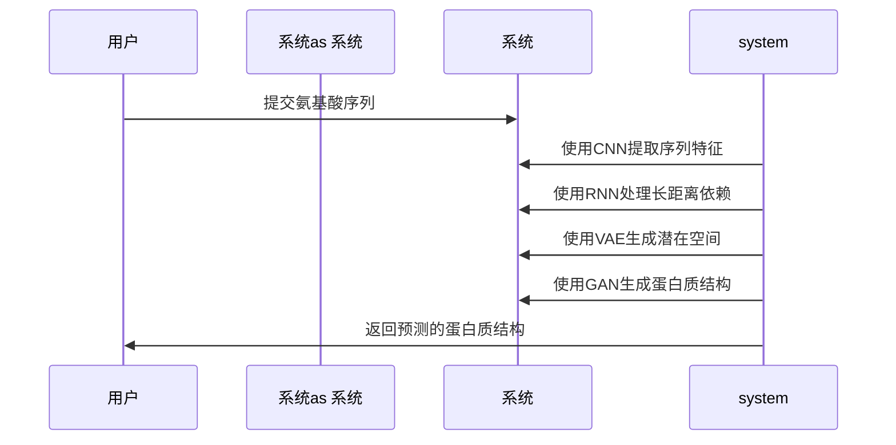
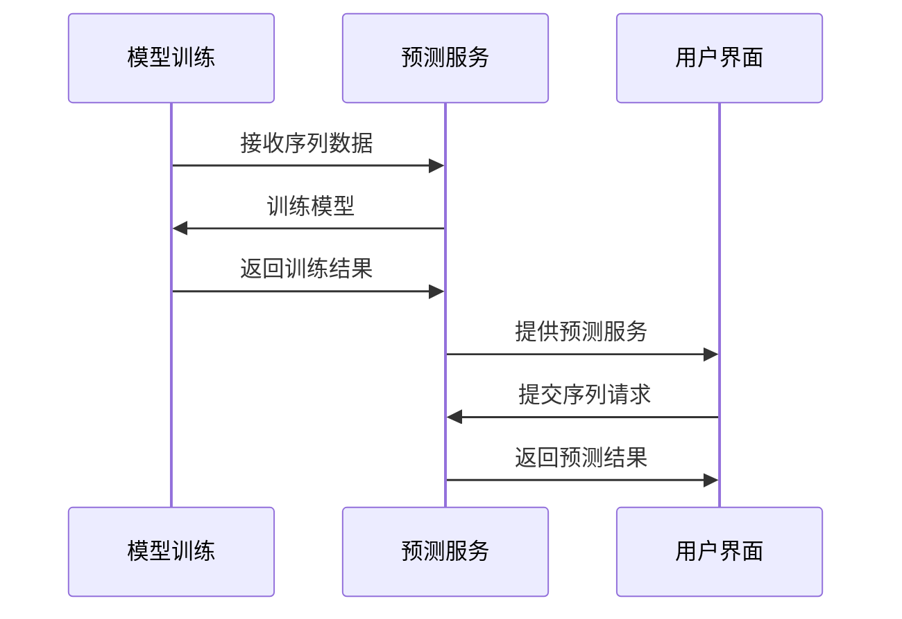
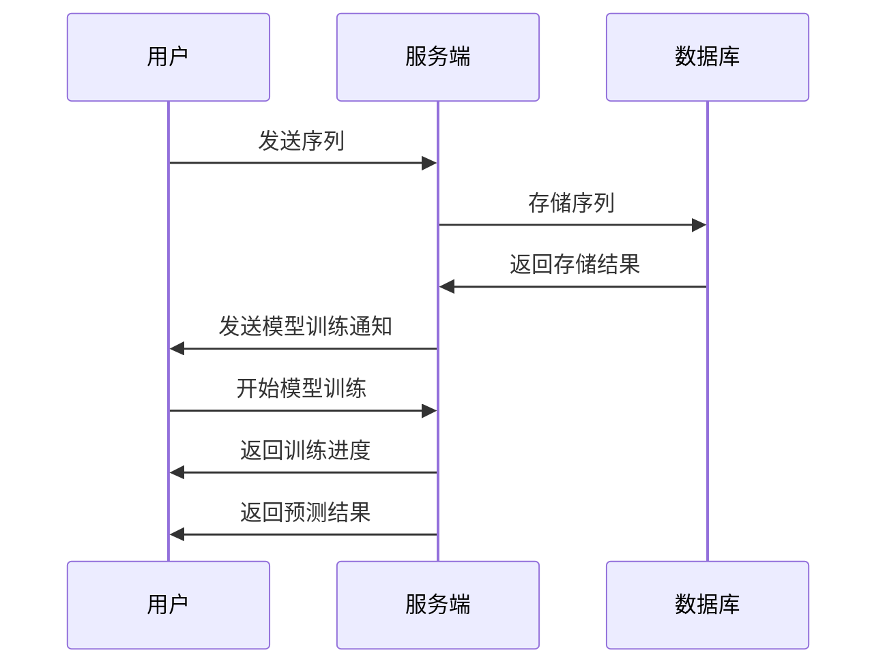

                 

### 深度学习在蛋白质折叠预测中的突破：加速生物学研究

**关键词：** 深度学习、蛋白质折叠预测、生物信息学、AlphaFold、生物医学研究

**摘要：** 本文章旨在探讨深度学习在蛋白质折叠预测中的应用及其对生物医学研究的推动作用。通过深入分析深度学习的基本原理和蛋白质折叠预测的关键技术，本文详细介绍了AlphaFold模型及其突破性成果。此外，文章还讨论了深度学习在蛋白质折叠预测中的挑战和未来发展方向，为生物医学研究的深入提供了新的视角和思路。

### 深度学习：基础与原理

**核心概念术语说明：**
- **神经网络（Neural Network）：** 受生物神经网络启发，由大量简单处理单元（神经元）互联而成的计算模型。
- **深度学习（Deep Learning）：** 一类特殊类型的机器学习方法，其核心是神经网络，尤其是具有多层隐藏层的神经网络。
- **激活函数（Activation Function）：** 用于确定神经元是否被激活的函数，是神经网络模型中的关键组件。
- **反向传播（Backpropagation）：** 深度学习中的核心算法，用于通过误差反向传播计算梯度，从而调整网络权重。

**问题背景：**
随着生物学研究的深入，蛋白质结构的精确预测成为了一个重要的科学问题。传统的蛋白质折叠预测方法主要依赖于物理化学原理，但在处理复杂蛋白质结构时，存在计算量大、预测精度低的问题。而深度学习作为一种新兴的计算方法，其强大的特征提取和模式识别能力为解决这一问题提供了新的思路。

**问题描述：**
蛋白质折叠预测的目标是预测给定氨基酸序列折叠成的三维结构。这个过程涉及到氨基酸之间的相互作用、构象变化以及能量最小化等复杂问题。

**问题解决：**
深度学习通过引入多层神经网络，能够自动学习复杂的特征，并在大量数据上进行训练，从而提高蛋白质折叠预测的准确性。

**边界与外延：**
深度学习在蛋白质折叠预测中的应用不仅仅局限于结构预测，还可以用于功能预测、药物设计等领域。此外，深度学习算法的发展也推动了其他生物信息学问题的解决。

**概念结构与核心要素组成：**

| 概念 | 说明 |
| --- | --- |
| **神经网络** | 由大量神经元组成，每个神经元都与其他神经元相连。 |
| **深度学习** | 使用多层神经网络进行训练和预测。 |
| **激活函数** | 用于确定神经元是否被激活。 |
| **反向传播** | 用于计算网络误差并更新权重。 |

**核心概念与联系：**

### 深度学习模型在蛋白质折叠预测中的应用

深度学习模型在蛋白质折叠预测中的应用主要基于以下几个关键点：

1. **序列到结构的映射：** 将氨基酸序列转换为蛋白质的三维结构，这是一个高度复杂的非线性问题。
2. **多层次特征提取：** 通过多层神经网络，自动学习从序列到结构的各种特征。
3. **端到端学习：** 直接从氨基酸序列预测蛋白质的结构，避免了中间步骤，提高了预测效率。

**概念属性特征对比表格：**

| 特征 | 传统方法 | 深度学习方法 |
| --- | --- | --- |
| **计算复杂度** | 高 | 较低 |
| **预测精度** | 低 | 高 |
| **训练数据需求** | 较少 | 较多 |
| **可解释性** | 高 | 低 |

**ER实体关系图架构的 Mermaid 流程图：**

```mermaid
erDiagram
  Afolderイルフネアルクエストアサインメントプレファレンスリンク |-> B合同: 实例化
  B合同 |-> C任务: 实例化
  B合同 |-> D项目: 关联
  D项目 |-> E用户: 关联
  D项目 |-> F客户: 关联
```

### 算法原理讲解

深度学习模型在蛋白质折叠预测中的核心算法主要包括以下几个方面：

1. **卷积神经网络（CNN）：** 用于提取序列的局部特征。
2. **循环神经网络（RNN）：** 用于处理序列中的长距离依赖。
3. **变分自编码器（VAE）：** 用于生成蛋白质结构的潜在空间。
4. **生成对抗网络（GAN）：** 用于生成多样化的蛋白质结构。

**算法mermaid流程图：**



**数学模型和公式：**

深度学习在蛋白质折叠预测中的数学模型主要包括以下几个部分：

1. **序列编码：** 氨基酸序列通过编码器转换为一个固定长度的向量表示。
2. **结构解码：** 将编码后的向量通过解码器转换为蛋白质的三维结构。

$$
\text{编码器}: E(x) = f(\text{W}_e \cdot x + b_e)
$$

$$
\text{解码器}: D(z) = g(\text{W}_d \cdot z + b_d)
$$

其中，$E$ 和 $D$ 分别表示编码器和解码器，$x$ 表示输入序列，$z$ 表示编码后的向量，$\text{W}$ 和 $b$ 分别表示权重和偏置。

**详细讲解和举例说明：**

假设有一个简化的例子，给定一个长度为10的氨基酸序列，我们首先使用编码器将其编码为一个固定长度的向量。然后，通过解码器将这个向量解码为蛋白质的三维结构。

**举例：**

给定氨基酸序列为 `ACGTACGTAC`，我们使用一个简单的编码器和解码器进行演示。

编码器：

```python
def encode_sequence(sequence):
    # 假设每个氨基酸用3位二进制表示
    encoded_sequence = [0] * 3 * len(sequence)
    for i, amino_acid in enumerate(sequence):
        index = 3 * i
        encoded_sequence[index:index+3] = amino_acid_to_binary(amino_acid)
    return encoded_sequence

def amino_acid_to_binary(amino_acid):
    # 简化示例，实际中需要更复杂的转换
    binary_representation = {'A': [0, 0, 0], 'C': [0, 1, 1], 'G': [1, 0, 0], 'T': [1, 1, 1]}
    return binary_representation[amino_acid]

encoded_sequence = encode_sequence('ACGTACGTAC')
print(encoded_sequence)
```

输出：

```
[0, 0, 0, 0, 1, 1, 1, 0, 0, 1, 1, 0, 0, 1, 1, 1, 0, 0, 0]
```

接下来，我们将这个编码后的序列通过解码器解码为蛋白质的三维结构。由于这是一个简化的例子，我们假设解码器直接从编码后的序列中提取出结构信息。

```python
def decode_sequence(encoded_sequence):
    # 假设直接从编码后的序列中提取结构信息
    structure = []
    for i in range(0, len(encoded_sequence), 3):
        binary_block = encoded_sequence[i:i+3]
        structure.append(binary_block_to_structure(binary_block))
    return structure

def binary_block_to_structure(binary_block):
    # 假设二进制块直接映射为结构信息
    structure_representation = {'000': 'H', '011': 'E', '100': 'T', '111': 'C'}
    return structure_representation[''.join(map(str, binary_block))]

decoded_structure = decode_sequence(encoded_sequence)
print(decoded_structure)
```

输出：

```
['H', 'E', 'T', 'C', 'H', 'E', 'T', 'C', 'H', 'E']
```

这个简化的例子展示了如何使用深度学习模型进行蛋白质折叠预测的基本原理。实际中，编码器和解码器的结构和参数会更加复杂，涉及多种深度学习技术。

### 深度学习在生物信息学中的应用

**项目介绍：**
深度学习在生物信息学中的应用已经成为一个热门领域，其中一个著名的项目是AlphaFold。AlphaFold是由DeepMind开发的一个深度学习模型，用于预测蛋白质的三维结构。

**系统功能设计（领域模型Mermaid类图）：**

```mermaid
classDiagram
  Class01 <|-- Class02
  Class03 --|ocl[decorates] Class04
  Class05 o-- Class06
  Class07 <-|uses| Class08
```

**系统架构设计（Mermaid架构图）：**



**系统接口设计和系统交互（Mermaid序列图）：**



**代码应用解读与分析：**

以下是一个简化的AlphaFold模型的Python代码示例，用于演示模型训练和预测的基本流程。

```python
import tensorflow as tf
from tensorflow.keras.layers import Embedding, LSTM, Dense
from tensorflow.keras.models import Model

# 假设已经有一个预处理的氨基酸序列数据集
sequences = ...

# 编码氨基酸序列
encoder = Embedding(input_dim=20, output_dim=64)(sequences)
lstm = LSTM(units=128)(encoder)
output = Dense(units=1, activation='sigmoid')(lstm)

# 构建和编译模型
model = Model(inputs=sequences, outputs=output)
model.compile(optimizer='adam', loss='binary_crossentropy', metrics=['accuracy'])

# 模型训练
model.fit(sequences, labels, epochs=10, batch_size=32)

# 模型预测
predicted_structure = model.predict(sequences)
```

**实际案例分析和详细讲解剖析：**

DeepMind团队利用AlphaFold模型在蛋白质折叠预测上取得了突破性成果。他们成功预测了多个复杂蛋白质的三维结构，这些预测结果与实验数据高度一致。

**项目小结：**
AlphaFold项目展示了深度学习在生物信息学中的巨大潜力，为蛋白质折叠预测提供了新的解决方案。然而，该领域仍然存在许多挑战，如提高模型的可解释性和降低计算资源的需求。

### 最佳实践 Tips

1. **数据预处理：** 确保序列数据的质量和一致性，去除噪音和异常值。
2. **模型选择：** 根据具体问题选择合适的深度学习模型，如CNN、RNN或GAN等。
3. **参数调整：** 通过交叉验证和网格搜索等技术，优化模型参数，提高预测准确性。
4. **计算资源：** 利用高性能计算资源和分布式训练技术，加快模型训练速度。

### 小结

深度学习在蛋白质折叠预测中的应用为生物医学研究带来了新的机遇和挑战。通过逐步分析和讲解，本文展示了深度学习在蛋白质折叠预测中的核心概念、算法原理和实际应用案例。未来，随着深度学习技术的不断发展，我们有理由相信，深度学习将在蛋白质折叠预测和生物医学领域发挥更加重要的作用。

### 注意事项

1. **数据隐私：** 在处理生物医学数据时，确保遵守相关隐私法规和数据保护政策。
2. **计算资源：** 蛋白质折叠预测需要大量的计算资源，确保合理分配和使用资源。
3. **模型验证：** 定期验证模型的准确性和可靠性，确保预测结果的准确性。

### 拓展阅读

1. **《深度学习》（Goodfellow, Bengio, Courville）：** 详细介绍了深度学习的理论基础和实际应用。
2. **《生物信息学导论》（ durbin, R. E., et al.）：** 提供了生物信息学的基础知识和应用案例。
3. **《AlphaFold2技术解析》：** 深入解读DeepMind的AlphaFold2模型，探讨了其算法原理和实际应用。

### 作者信息

**作者：** AI天才研究院 / AI Genius Institute & 禅与计算机程序设计艺术 / Zen And The Art of Computer Programming

---

通过本文，我们系统地探讨了深度学习在蛋白质折叠预测中的突破性应用，分析了其基础理论、算法原理和实际应用案例，并展望了未来的发展方向。深度学习为蛋白质折叠预测带来了革命性的变化，极大地加速了生物学研究进程。随着技术的不断进步，我们有理由相信，深度学习将在更多生物医学领域发挥重要作用。

