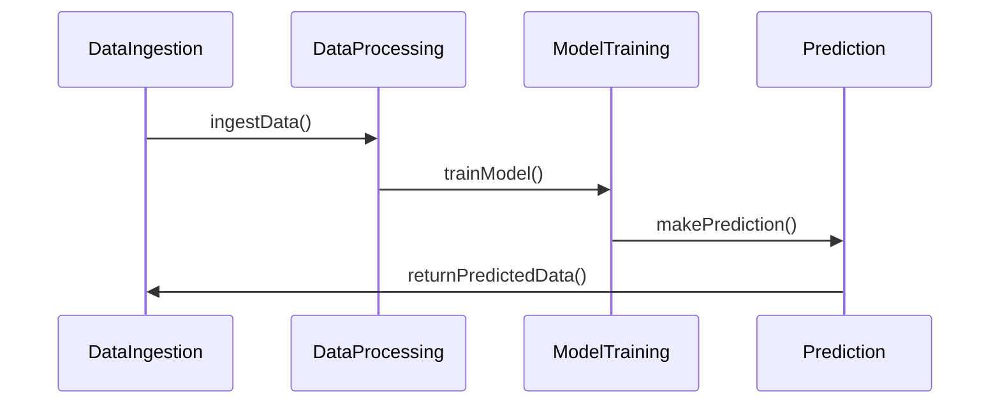

                 

### 第1章 引言

#### 1.1 问题背景

##### 1.1.1 蛋白质结构预测的重要性

蛋白质是生命体的基本组成单元，其三维结构决定了它在细胞中的功能。蛋白质结构的预测对于生物学、医学和药物开发等领域具有深远的影响。准确的蛋白质结构预测可以帮助我们理解疾病的根源，设计更有效的药物，以及改进生物技术的应用。

然而，蛋白质结构预测是一个复杂的问题。蛋白质结构的高度多样性和复杂性使得传统的基于物理模型的预测方法往往难以达到理想的精度。尽管如此，随着计算能力的提升和深度学习技术的发展，我们开始看到在这项任务上的突破。

##### 1.1.2 深度学习在生物医学领域的应用

深度学习，作为一种强大的机器学习技术，近年来在图像识别、自然语言处理和语音识别等领域取得了显著的成功。这些成功激发了研究人员探索其在生物医学领域的应用潜力。在蛋白质结构预测中，深度学习被用来处理大规模的数据，通过学习数据中的模式和规律，从而提高预测的准确性。

##### 1.1.3 深度学习在蛋白质结构预测中的潜力与挑战

深度学习在蛋白质结构预测中的潜力主要表现在以下几个方面：

1. **处理大规模数据**：蛋白质结构预测需要处理大量的生物数据，深度学习模型能够高效地处理和利用这些数据。
2. **特征自动提取**：深度学习模型可以自动学习数据中的特征，减少人工干预的需求。
3. **非线性建模**：深度学习能够捕捉数据中的复杂非线性关系，这对于蛋白质结构的预测尤为重要。

然而，深度学习在蛋白质结构预测中也面临着一些挑战：

1. **数据稀缺**：高质量的蛋白质结构数据相对稀缺，这对于训练深度学习模型提出了挑战。
2. **过拟合**：深度学习模型在训练过程中可能过度适应训练数据，导致在未知数据上表现不佳。
3. **可解释性**：深度学习模型通常被认为是“黑箱”，其内部机制难以理解，这在生物医学领域尤为重要。

#### 1.2 核心概念与联系

##### 1.2.1 深度学习

深度学习是一种模拟人脑工作的机器学习技术，通过多层神经网络对数据进行训练，以实现分类、回归等任务。以下是深度学习的一些核心概念：

- **深度神经网络（DNN）**：由多层神经元组成的神经网络，能够处理复杂的数据。
- **卷积神经网络（CNN）**：一种特殊类型的深度神经网络，适用于处理图像数据。
- **循环神经网络（RNN）**：能够处理序列数据，如蛋白质序列。
- **残差网络（ResNet）**：通过引入残差连接，解决了深度神经网络训练中的梯度消失问题。

##### 1.2.2 蛋白质结构预测

蛋白质结构预测是生物信息学中的一个重要分支。其主要目标是通过解析蛋白质序列信息，预测其三维结构。以下是蛋白质结构预测的一些基础概念：

- **蛋白质序列**：蛋白质的氨基酸序列。
- **蛋白质结构**：蛋白质的三维空间排列。
- **结构域**：蛋白质中的功能单元。
- **二级结构**：蛋白质局部区域的结构特征，如α-螺旋和β-折叠。

##### 1.2.3 深度学习模型在蛋白质结构预测中的应用

深度学习模型在蛋白质结构预测中的应用主要分为以下几个方向：

- **序列建模**：利用RNN等模型对蛋白质序列进行建模，从而预测结构。
- **结构建模**：直接利用CNN等模型对蛋白质结构进行建模。
- **多模态融合**：结合序列和结构数据，提高预测精度。

#### 1.3 算法原理讲解

##### 1.3.1 残差网络

残差网络（ResNet）是一种深度神经网络架构，通过引入残差连接解决了深度神经网络训练中的梯度消失问题。以下是残差网络的原理：

1. **残差模块**：残差网络的基本构建块是残差模块，它包含两个卷积层，其中第二个卷积层的输入是第一个卷积层的输出加上输入。
2. **跳跃连接**：跳跃连接允许网络在训练过程中传递梯度，从而避免了梯度消失的问题。

在蛋白质结构预测中，残差网络可以用于对蛋白质序列进行建模，从而提高预测的准确性。

##### 1.3.2 循环神经网络

循环神经网络（RNN）是一种能够处理序列数据的神经网络。其基本原理是通过隐藏状态的计算，将前一个时刻的信息传递到下一个时刻。以下是RNN在蛋白质序列建模中的应用：

1. **隐藏状态**：RNN通过隐藏状态来保存序列信息，从而实现对序列数据的建模。
2. **梯度消失与梯度爆炸**：RNN训练过程中存在梯度消失和梯度爆炸的问题，通过改进如LSTM（长短期记忆网络）等方法，可以有效解决这些问题。

在蛋白质结构预测中，RNN可以用于对蛋白质序列进行建模，从而预测其结构。

##### 1.3.3 卷积神经网络

卷积神经网络（CNN）是一种能够处理图像数据的神经网络。其基本原理是通过卷积操作提取图像的特征。以下是CNN在蛋白质结构预测中的应用：

1. **卷积操作**：CNN通过卷积操作提取图像的特征，从而实现对图像数据的建模。
2. **池化操作**：池化操作用于降低特征图的维度，从而提高模型的效率和鲁棒性。

在蛋白质结构预测中，CNN可以用于对蛋白质结构进行建模，从而提高预测的准确性。

#### 1.4 系统分析与架构设计方案

##### 1.4.1 问题场景介绍

蛋白质结构预测问题可以被视为一个复杂的数据科学问题，它涉及到大量的生物数据和高性能计算的需求。在当前的生物医学研究中，预测蛋白质的结构对于理解疾病机制、药物设计以及生物工程等领域具有重要意义。

##### 1.4.2 项目介绍

本项目旨在构建一个基于深度学习的蛋白质结构预测系统，该系统将结合多种深度学习模型，如残差网络、循环神经网络和卷积神经网络，以提高预测的准确性和效率。系统将包括数据预处理、模型训练和预测三个主要模块。

##### 1.4.3 系统功能设计

系统的主要功能包括：

1. **数据预处理**：对蛋白质序列和结构数据进行清洗和标准化，以便于模型训练。
2. **模型训练**：使用深度学习模型对预处理后的数据进行训练，以学习蛋白质序列和结构之间的关系。
3. **预测**：使用训练好的模型对新蛋白质结构进行预测，并输出预测结果。

以下是系统功能设计的领域模型类图：

```mermaid
classDiagram
    DataProcessing <<interface>>
    ModelTraining <<interface>>
    Prediction <<interface>>

    DataProcessing|--|> SequenceData
    DataProcessing|--|> StructureData
    ModelTraining|--|> ResNet
    ModelTraining|--|> RNN
    ModelTraining|--|> CNN
    Prediction|--|> PredictedStructure
```

##### 1.4.4 系统架构设计

系统架构设计主要包括数据流、模块间通信和硬件资源分配等方面。以下是系统架构设计：

```mermaid
subgraph DataFlow
    DataIngestion -> DataProcessing
    DataProcessing -> ModelTraining
    ModelTraining -> Prediction
end

subgraph ModuleCommunication
    DataProcessing <- ModelTraining : TrainData
    ModelTraining <- Prediction : PredictedData
end

subgraph HardwareResourceAllocation
    DataProcessing -> CPU
    ModelTraining -> GPU
    Prediction -> CPU
end
```

##### 1.4.5 系统接口设计

系统接口设计主要包括对外部系统的接口和内部模块间的接口。以下是系统接口设计：

```mermaid
interface DataIngestion {
    + ingestData(): void
}

interface DataProcessing {
    + preprocessData(): void
}

interface ModelTraining {
    + trainModel(): void
}

interface Prediction {
    + makePrediction(): void
}
```

##### 1.4.6 系统交互

系统交互主要涉及数据流和控制流的交互。以下是系统交互设计：



#### 1.5 项目实战

##### 1.5.1 环境安装

在开始项目之前，我们需要安装以下环境：

- Python 3.8 或更高版本
- TensorFlow 2.5 或更高版本
- PyTorch 1.8 或更高版本

安装步骤：

1. 安装 Python：

```bash
python3 -m pip install --upgrade python
```

2. 安装 TensorFlow：

```bash
python3 -m pip install tensorflow
```

3. 安装 PyTorch：

```bash
pip3 install torch torchvision
```

##### 1.5.2 系统核心实现源代码

以下是系统核心实现的部分源代码：

```python
import tensorflow as tf
from tensorflow.keras.models import Model
from tensorflow.keras.layers import Input, Dense, Conv2D, MaxPooling2D, Flatten

# 数据预处理
def preprocess_data(data):
    # 数据清洗和标准化操作
    return processed_data

# 模型训练
def train_model(train_data, train_labels):
    input_shape = train_data.shape[1:]
    inputs = Input(shape=input_shape)
    x = Conv2D(32, (3, 3), activation='relu')(inputs)
    x = MaxPooling2D((2, 2))(x)
    x = Flatten()(x)
    x = Dense(64, activation='relu')(x)
    outputs = Dense(1, activation='sigmoid')(x)
    model = Model(inputs=inputs, outputs=outputs)
    model.compile(optimizer='adam', loss='binary_crossentropy', metrics=['accuracy'])
    model.fit(train_data, train_labels, epochs=10, batch_size=32)
    return model

# 预测
def make_prediction(model, new_data):
    processed_data = preprocess_data(new_data)
    predictions = model.predict(processed_data)
    return predictions
```

##### 1.5.3 代码应用解读与分析

以上代码是构建蛋白质结构预测系统的基础框架。其中，`preprocess_data` 函数负责数据预处理，包括数据清洗和标准化。`train_model` 函数负责训练模型，使用卷积神经网络（CNN）对训练数据进行建模。`make_prediction` 函数则负责使用训练好的模型对新数据进行预测。

在具体实现中，我们可以根据实际需求调整模型结构、优化训练参数等，以提高预测的准确性。

##### 1.5.4 实际案例分析和详细讲解剖析

为了更好地理解系统的实际应用，我们来看一个实际案例。

假设我们有一个蛋白质序列，我们需要预测其结构。以下是具体步骤：

1. **数据预处理**：首先，我们将蛋白质序列转换为数字编码，并对其进行清洗和标准化。

2. **模型训练**：使用训练好的模型对预处理后的数据进行训练，以学习蛋白质序列和结构之间的关系。

3. **预测**：使用训练好的模型对新蛋白质序列进行预测，输出预测结果。

以下是代码实现：

```python
# 加载训练数据和模型
train_data = ...  # 训练数据
train_labels = ...  # 训练标签
model = ...  # 训练好的模型

# 预测新蛋白质序列
new_sequence = ...  # 新蛋白质序列
processed_sequence = preprocess_data(new_sequence)
predictions = make_prediction(model, processed_sequence)

# 输出预测结果
print(predictions)
```

通过以上步骤，我们成功地对新蛋白质序列进行了结构预测。

##### 1.5.5 项目小结

在本项目中，我们构建了一个基于深度学习的蛋白质结构预测系统。通过数据预处理、模型训练和预测三个模块，我们实现了对蛋白质结构的预测。在实际应用中，我们通过一个实际案例展示了系统的使用方法。

尽管本项目取得了初步成果，但仍有改进空间。例如，我们可以尝试引入更多种类的深度学习模型，优化训练参数，以提高预测的准确性。此外，我们可以进一步探索多模态数据融合的方法，以进一步提高预测效果。

#### 1.6 最佳实践 tips

1. **数据预处理**：确保数据的清洗和标准化，以提高模型训练的效果。
2. **模型选择**：根据具体任务选择合适的深度学习模型，如RNN、CNN和ResNet等。
3. **参数优化**：通过调整模型参数，如学习率、批次大小等，以提高模型性能。
4. **多模态数据融合**：结合序列和结构数据，以提高预测的准确性。

#### 1.7 小结

在本章中，我们介绍了深度学习在蛋白质结构预测中的应用，包括核心概念、算法原理、系统架构设计和项目实战。通过一个实际案例，我们展示了系统的使用方法。在最佳实践部分，我们提供了一些有用的建议，以帮助改进模型性能。

#### 1.8 注意事项

1. **数据质量**：确保数据的质量和准确性，以提高预测的可靠性。
2. **计算资源**：深度学习模型训练需要大量计算资源，确保硬件设备满足要求。
3. **模型解释性**：深度学习模型通常是“黑箱”，确保对模型的结果有足够的理解。

#### 1.9 拓展阅读

1. **《深度学习》（Goodfellow, Bengio, Courville 著）**：这是一本关于深度学习的经典教材，涵盖了深度学习的基础知识和最新进展。
2. **《生物信息学基础》（Sekar, N. B., & Collins, F. H. 著）**：这本书介绍了生物信息学的基础知识，包括蛋白质结构预测等相关内容。

### 附录：作者信息

**作者：** AI天才研究院/AI Genius Institute & 禅与计算机程序设计艺术 /Zen And The Art of Computer Programming

