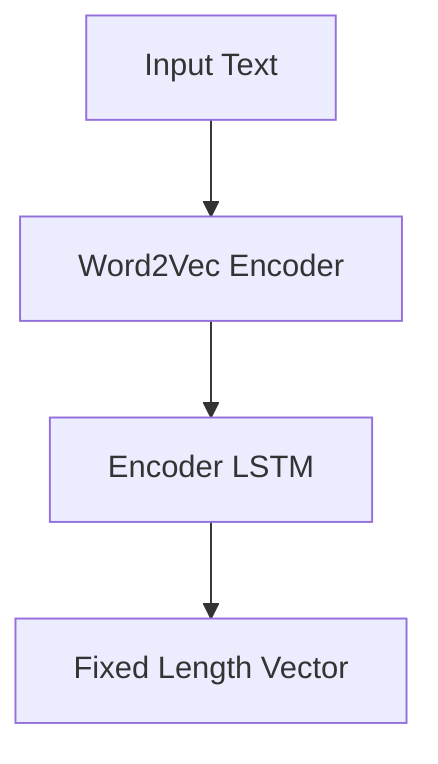
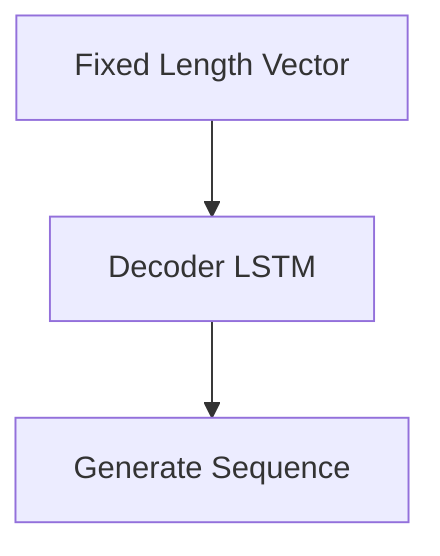
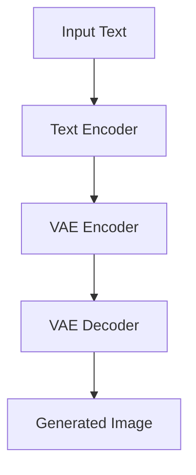
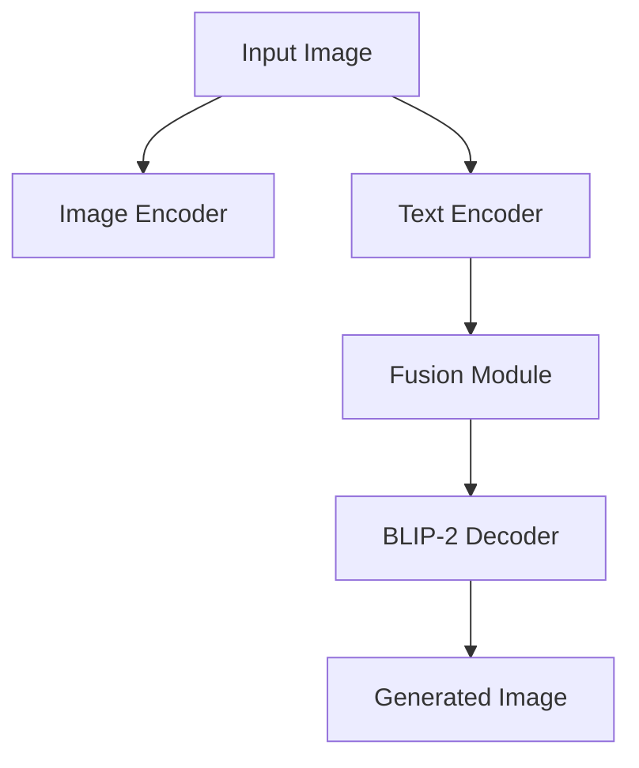
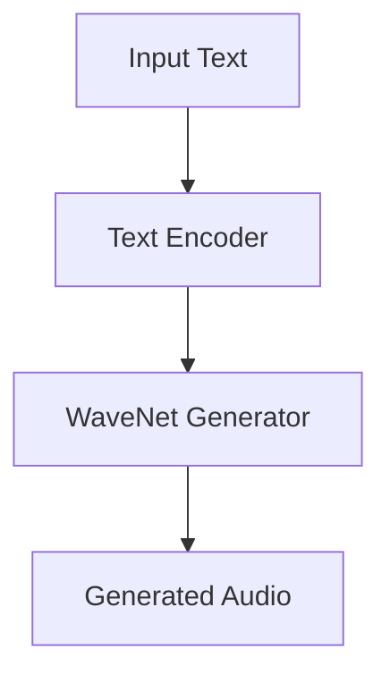
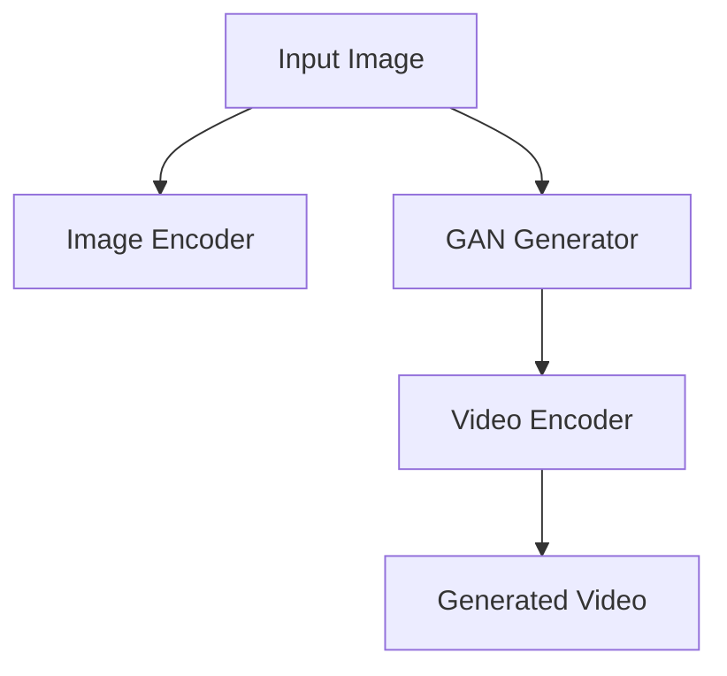
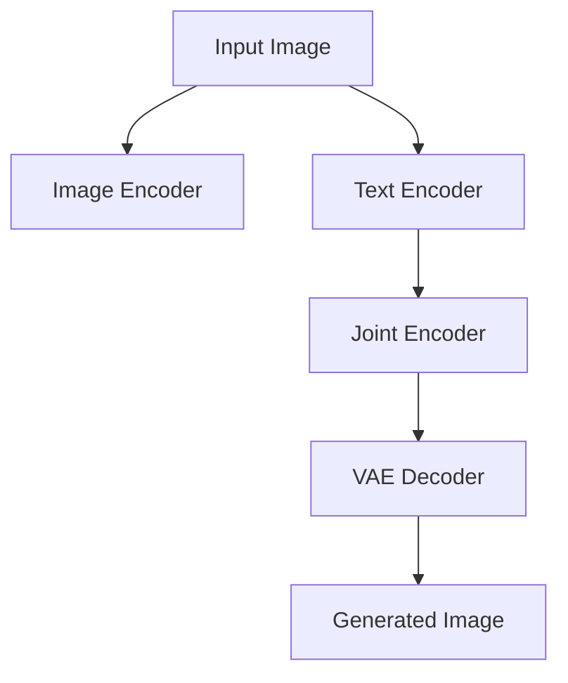
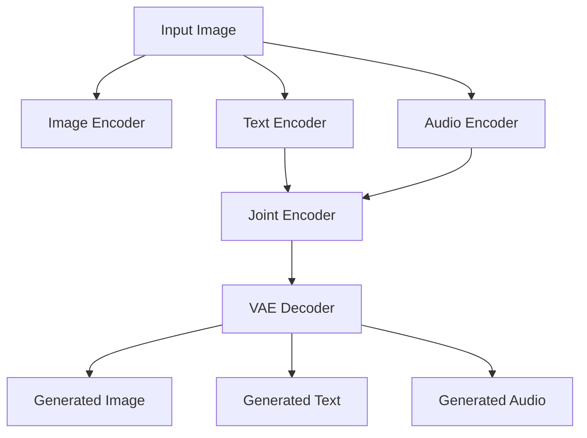

                 


### Introduction

#### 1.1 问题的背景与意义

跨模态内容生成，是指利用深度学习技术，将一种模态的数据（如图像、文本、音频等）转换为另一种模态的数据。随着互联网和多媒体技术的发展，跨模态内容生成已经成为人工智能领域的一个重要研究方向。其背景主要源于以下几个方面：

1. **大数据时代的需求**：在信息爆炸的时代，如何有效地处理和利用多模态数据成为了一个重要的课题。
2. **人工智能技术的进步**：深度学习技术的快速发展，使得跨模态内容生成成为可能。
3. **多模态数据的广泛应用**：从社交网络到电子商务，从医疗健康到娱乐产业，跨模态内容生成在各种应用场景中都有着广泛的应用。

#### 1.2 深度学习与跨模态内容生成的定义

**深度学习**是一种基于人工神经网络的学习方法，通过多层网络结构，对大量数据进行学习，从而实现自动特征提取和分类、回归等任务。

**跨模态内容生成**则是指利用深度学习技术，将一种模态的数据转换为另一种模态的数据，例如将文本转换为图像，将音频转换为视频等。

#### 1.3 深度学习在跨模态内容生成中的重要性

1. **提升信息处理效率**：深度学习能够自动提取数据中的高维特征，从而提高信息处理的效率。
2. **拓宽应用场景**：跨模态内容生成可以应用于多种领域，如图像生成、语音合成、视频生成等。
3. **推动技术革新**：跨模态内容生成技术的不断进步，将会推动人工智能技术的整体发展。

#### 1.4 国内外研究进展与趋势

**国内研究进展**：国内在跨模态内容生成领域的研究已经取得了一些重要的进展，例如在图像生成、语音合成等方面已经有一些成熟的技术和应用。

**国外研究进展**：国外在跨模态内容生成领域的研究也取得了很大的突破，例如在生成对抗网络（GAN）的应用方面。

**研究趋势**：未来跨模态内容生成技术将会在以下几个方面继续发展：

1. **算法优化**：通过改进深度学习算法，提高生成效果和效率。
2. **应用拓展**：将跨模态内容生成技术应用于更多领域，如教育、医疗、娱乐等。
3. **数据多样性**：通过引入更多样化的数据，提高模型的泛化能力。

#### 1.5 本书的结构安排与阅读指南

本书共分为七个章节，结构如下：

- **第一章**：介绍跨模态内容生成的基本概念和背景。
- **第二章和第三章**：详细讲解跨模态表示学习和跨模态生成模型。
- **第四章和第五章**：通过具体实例展示跨模态内容生成技术的应用。
- **第六章**：探讨跨模态内容生成的未来发展方向和挑战。
- **第七章**：总结全书内容，并对未来进行展望。

本书适合对深度学习和跨模态内容生成感兴趣的读者阅读，同时也适合作为相关专业的教材。

---

### Chapter 1: 问题的背景与意义

#### 1.1 跨模态内容生成的背景

随着信息技术的飞速发展，多媒体数据已经成为信息传递和存储的主要形式。图像、文本、音频和视频等多模态数据在日常生活中随处可见，例如社交媒体上的图片和文字评论、音乐视频中的音频和视频内容等。然而，这些多模态数据之间往往存在着信息冗余和复杂性，给信息处理和利用带来了挑战。

**大数据时代的需求**：在数据量爆炸的时代，如何有效地处理和利用多模态数据成为了一个重要的课题。传统的单模态数据处理方法往往无法充分利用多模态数据中的潜在信息，因此跨模态内容生成技术应运而生。

**人工智能技术的进步**：深度学习技术的快速发展为跨模态内容生成提供了强有力的技术支持。深度学习通过多层神经网络结构，能够自动提取数据中的高维特征，从而实现复杂的模式识别和生成任务。

**多模态数据的广泛应用**：跨模态内容生成技术已经在多个领域取得了显著的应用成果。例如，在图像生成领域，深度学习技术已经被广泛应用于图像风格转换、图像修复和图像超分辨率等任务；在语音合成领域，深度学习技术被用于生成自然流畅的语音；在视频生成领域，深度学习技术被用于视频内容生成和视频增强等任务。

#### 1.2 深度学习在跨模态内容生成中的重要性

**提升信息处理效率**：深度学习技术通过自动提取数据中的高维特征，能够显著提高信息处理的效率。相比传统的特征工程方法，深度学习模型能够更加准确地捕捉数据中的潜在信息，从而减少数据处理的时间和成本。

**拓宽应用场景**：跨模态内容生成技术可以应用于多种领域，如图像生成、语音合成、视频生成等。通过跨模态内容生成，可以实现对多模态数据的综合利用，从而提高应用系统的性能和用户体验。

**推动技术革新**：跨模态内容生成技术的不断进步，将会推动人工智能技术的整体发展。深度学习技术在跨模态内容生成中的应用，不仅提高了信息处理的效率，还为人工智能技术的研究和应用提供了新的方向和思路。

#### 1.3 深度学习与跨模态内容生成的定义

**深度学习**是一种基于人工神经网络的学习方法，通过多层网络结构，对大量数据进行学习，从而实现自动特征提取和分类、回归等任务。深度学习模型包括卷积神经网络（CNN）、循环神经网络（RNN）、生成对抗网络（GAN）等，每种模型都有其独特的优势和适用场景。

**跨模态内容生成**则是指利用深度学习技术，将一种模态的数据（如图像、文本、音频等）转换为另一种模态的数据（如图像、文本、音频等）。跨模态内容生成技术可以用于图像到文本的转换、音频到视频的转换等多种场景。

#### 1.4 国内外研究进展与趋势

**国内研究进展**：在国内，跨模态内容生成技术的研究已经取得了一些重要的进展。例如，在图像生成领域，国内的研究者已经提出了多种基于深度学习的图像生成模型，如生成对抗网络（GAN）、变分自编码器（VAE）等。在语音合成领域，国内的研究者也提出了一些基于深度学习的语音合成模型，如WaveNet、Tacotron等。

**国外研究进展**：在国外，跨模态内容生成技术的研究也取得了很大的突破。例如，在图像生成领域，国外的研究者提出了多种基于深度学习的图像生成模型，如DALL-E、StyleGAN等。在语音合成领域，国外的研究者也提出了一些基于深度学习的语音合成模型，如Listen，Gan等。

**研究趋势**：未来跨模态内容生成技术将会在以下几个方面继续发展：

1. **算法优化**：通过改进深度学习算法，提高生成效果和效率。例如，研究者们正在探索如何提高生成模型的稳定性和鲁棒性，以及如何减少模型的计算复杂度。

2. **应用拓展**：将跨模态内容生成技术应用于更多领域，如教育、医疗、娱乐等。通过跨模态内容生成，可以实现对多模态数据的综合利用，从而提高应用系统的性能和用户体验。

3. **数据多样性**：通过引入更多样化的数据，提高模型的泛化能力。例如，研究者们正在尝试使用不同的数据集来训练模型，从而提高模型对不同模态数据的适应能力。

#### 1.5 本书的结构安排与阅读指南

本书共分为七个章节，结构如下：

- **第一章**：介绍跨模态内容生成的基本概念和背景。
- **第二章和第三章**：详细讲解跨模态表示学习和跨模态生成模型。
- **第四章和第五章**：通过具体实例展示跨模态内容生成技术的应用。
- **第六章**：探讨跨模态内容生成的未来发展方向和挑战。
- **第七章**：总结全书内容，并对未来进行展望。

本书适合对深度学习和跨模态内容生成感兴趣的读者阅读，同时也适合作为相关专业的教材。

---

### Chapter 2: 基础理论与方法

#### 2.1 跨模态表示学习

**跨模态表示学习**是深度学习在跨模态内容生成中的核心步骤，其主要目的是将不同模态的数据映射到一个共同的高维空间中，使得不同模态的数据能够进行有效的交互和融合。这一过程通常包括以下几个关键环节：

##### 2.1.1 数据预处理

在跨模态表示学习之前，需要对不同模态的数据进行预处理。例如，对于图像数据，需要进行图像增强、裁剪、缩放等操作，以丰富数据集的多样性；对于文本数据，需要进行分词、去停用词、词向量编码等操作，以提取文本的特征表示。对于音频和视频数据，也需要进行相应的预处理操作。

##### 2.1.2 深度学习模型

深度学习模型在跨模态表示学习中扮演着重要角色。常见的深度学习模型包括卷积神经网络（CNN）、循环神经网络（RNN）、生成对抗网络（GAN）等。每种模型都有其独特的优势和适用场景。

- **卷积神经网络（CNN）**：CNN是一种适用于处理图像数据的深度学习模型，通过卷积层和池化层，能够提取图像中的高维特征。
- **循环神经网络（RNN）**：RNN是一种适用于处理序列数据的深度学习模型，通过循环结构，能够处理时间序列数据。
- **生成对抗网络（GAN）**：GAN是一种由生成器和判别器组成的深度学习模型，通过生成器和判别器的对抗训练，能够生成高质量的数据。

##### 2.1.3 表示学习方法

在跨模态表示学习中，常用的方法包括多模态嵌入、联合嵌入和特征融合等。

- **多模态嵌入**：多模态嵌入是将不同模态的数据映射到一个共同的高维空间中，使得不同模态的数据能够进行交互和融合。
- **联合嵌入**：联合嵌入是将不同模态的数据同时输入到一个神经网络中，通过联合学习，提取出共同的语义特征。
- **特征融合**：特征融合是将不同模态的特征进行融合，从而得到一个综合的特征表示。

#### 2.2 跨模态生成模型

**跨模态生成模型**是在跨模态表示学习的基础上，利用深度学习技术生成新的跨模态数据。常见的跨模态生成模型包括循环生成模型、并行生成模型和生成对抗网络（GAN）等。

##### 2.2.1 循环生成模型

循环生成模型是基于循环神经网络（RNN）的跨模态生成模型，其主要思想是利用RNN对输入数据进行编码，然后生成新的跨模态数据。

- **编码器**：编码器用于对输入数据进行编码，将其映射到一个高维空间中。
- **解码器**：解码器用于生成新的跨模态数据，根据编码器的输出，生成新的图像、文本或音频等。

##### 2.2.2 并行生成模型

并行生成模型是基于卷积神经网络（CNN）和循环神经网络（RNN）的跨模态生成模型，其主要思想是同时利用CNN和RNN对输入数据进行编码和解码。

- **编码器**：编码器同时利用CNN和RNN对输入数据进行编码。
- **解码器**：解码器同时利用CNN和RNN生成新的跨模态数据。

##### 2.2.3 生成对抗网络（GAN）

生成对抗网络（GAN）是一种由生成器和判别器组成的跨模态生成模型，其主要思想是通过生成器和判别器的对抗训练，生成高质量的跨模态数据。

- **生成器**：生成器用于生成新的跨模态数据。
- **判别器**：判别器用于判断生成的数据是否真实。

#### 2.3 模型评估与优化

在跨模态内容生成中，模型的评估与优化是一个关键环节。常用的评估指标包括生成质量、多样性、稳定性等。

- **生成质量**：生成质量是评估模型生成数据质量的重要指标，常用的评估方法包括峰值信噪比（PSNR）、结构相似性（SSIM）等。
- **多样性**：多样性是评估模型生成数据多样性的重要指标，常用的评估方法包括数据集的均匀性、数据集的相似性等。
- **稳定性**：稳定性是评估模型在生成过程中是否稳定的重要指标，常用的评估方法包括生成过程的波动性、生成结果的重复性等。

为了优化模型，可以采用以下策略：

- **数据增强**：通过数据增强，增加训练数据的多样性，从而提高模型的泛化能力。
- **模型架构调整**：通过调整模型架构，优化模型的性能，例如增加层数、调整网络结构等。
- **超参数调整**：通过调整超参数，如学习率、批量大小等，优化模型的性能。

---

### Chapter 3: 跨模态生成模型详解

#### 3.1 循环生成模型

循环生成模型（Recurrent Generative Model，RGM）是一种基于循环神经网络（RNN）的跨模态生成模型，特别适用于处理序列数据。其核心思想是通过编码器（Encoder）对输入序列进行编码，生成固定长度的向量表示，然后通过解码器（Decoder）将这些表示转换为新的输出序列。

##### 3.1.1 编码器

编码器负责将输入的跨模态序列编码为固定长度的向量。对于文本，编码器可能是一个基于Word2Vec或BERT的模型；对于图像，编码器可能是一个卷积神经网络（CNN）；对于音频，编码器可能是一个基于卷积神经网络的时频表示。编码器的输出是一个固定维度的向量，表示输入序列的语义信息。

$$
\text{Encoder}(x) = \text{h}
$$

其中，$x$是输入序列，$\text{h}$是编码器的输出向量。

##### 3.1.2 解码器

解码器负责将编码器的输出向量解码为新的输出序列。解码器通常是一个RNN，如LSTM或GRU，它能够处理序列数据，并生成新的序列。解码器的输入是编码器的输出向量，输出是生成的序列数据。

$$
\text{Decoder}(\text{h}) = \text{y}
$$

其中，$\text{h}$是编码器的输出向量，$\text{y}$是解码器的输出序列。

##### 3.1.3 模型示例

假设我们有一个文本到图像的生成任务，编码器将文本序列编码为一个固定长度的向量，然后解码器使用这个向量生成对应的图像。

1. **文本编码**：编码器将输入文本转换为向量表示。
2. **图像生成**：解码器使用文本编码的向量生成图像。

#### 3.2 并行生成模型

并行生成模型（Parallel Generative Model，PGM）是一种同时处理多个模态数据的生成模型，利用卷积神经网络（CNN）和循环神经网络（RNN）的并行结构，以提高生成效率。其核心思想是同时编码多个输入模态，然后将编码后的信息进行融合，最终生成新的跨模态数据。

##### 3.2.1 编码器

并行生成模型中的编码器同时处理多个输入模态的数据。例如，对于文本、图像和音频，编码器可能由三个子编码器组成，分别处理文本、图像和音频数据。

- **文本编码器**：将文本转换为向量表示。
- **图像编码器**：将图像转换为特征图。
- **音频编码器**：将音频转换为时频表示。

##### 3.2.2 融合模块

融合模块负责将来自不同编码器的特征进行融合。常见的融合方法包括拼接（Concatenation）、平均（Average）和加权（Weighted Average）等。

$$
\text{Fusion}(\text{h}_{\text{txt}}, \text{h}_{\text{img}}, \text{h}_{\text{audio}}) = \text{h}_{\text{fusion}}
$$

其中，$\text{h}_{\text{txt}}$、$\text{h}_{\text{img}}$和$\text{h}_{\text{audio}}$分别是文本、图像和音频编码器的输出，$\text{h}_{\text{fusion}}$是融合后的特征向量。

##### 3.2.3 解码器

解码器负责将融合后的特征向量解码为新的跨模态数据。解码器的设计可以根据具体任务进行调整，例如对于文本到图像的生成任务，解码器可能是一个图像生成模型。

1. **特征融合**：将多个编码器的输出进行融合。
2. **图像生成**：解码器使用融合后的特征向量生成图像。

#### 3.3 生成对抗网络（GAN）

生成对抗网络（Generative Adversarial Network，GAN）是由生成器（Generator）和判别器（Discriminator）组成的框架，通过两个模型的对抗训练生成高质量的数据。GAN的核心思想是生成器尝试生成与真实数据相似的数据，而判别器则试图区分真实数据和生成数据。

##### 3.3.1 生成器

生成器负责生成新的跨模态数据。生成器的输入可以是随机噪声或者部分真实的跨模态数据，输出是完整的跨模态数据。

$$
\text{Generator}(\text{z}) = \text{G}(\text{z})
$$

其中，$\text{z}$是输入噪声，$\text{G}(\text{z})$是生成器生成的数据。

##### 3.3.2 判别器

判别器负责判断输入数据是真实数据还是生成数据。判别器的输入是跨模态数据，输出是概率值，表示输入数据的真实性。

$$
\text{Discriminator}(\text{x}, \text{G}(\text{z})) = \text{D}(\text{x}), \text{D}(\text{G}(\text{z}))
$$

其中，$\text{x}$是真实数据，$\text{G}(\text{z})$是生成器生成的数据，$\text{D}(\text{x})$和$\text{D}(\text{G}(\text{z}))$分别是判别器对真实数据和生成数据的判断概率。

##### 3.3.3 模型训练

GAN的训练过程是一个对抗过程，生成器和判别器相互竞争。训练目标是最大化判别器的损失函数，同时最小化生成器的损失函数。

- **生成器损失函数**：生成器的目标是生成尽可能真实的数据，使得判别器无法区分生成数据和真实数据。

$$
\text{Loss}_{\text{G}} = -\mathbb{E}[\text{D}(\text{G}(\text{z}))]
$$

- **判别器损失函数**：判别器的目标是正确区分真实数据和生成数据。

$$
\text{Loss}_{\text{D}} = -\mathbb{E}[\text{D}(\text{x})] - \mathbb{E}[\text{D}(\text{G}(\text{z}))]
$$

通过交替优化生成器和判别器的损失函数，GAN能够生成高质量的数据。

---

### Chapter 4: 应用实例与案例分析

#### 4.1 图文生成

图文生成是指利用深度学习技术，将文本描述转换为对应的图像。这种技术广泛应用于广告、游戏、教育等领域。以下是几个图文生成的应用实例：

##### 4.1.1 DALL-E

DALL-E是一个由OpenAI开发的模型，它可以将自然语言描述转换为图像。DALL-E使用了一个变分自编码器（VAE）来生成图像，并利用文本编码器将自然语言描述转换为向量表示。

**实例**：给定一个文本描述“一只穿着紫色衣服的猫站在海边”，DALL-E会生成一张符合描述的图像。

##### 4.1.2 BLIP-2

BLIP-2是一个由Google开发的模型，它将图像和文本结合，生成新的图像。BLIP-2使用了一个统一的文本编码器和一个图像编码器，通过融合模块将文本和图像特征进行融合。

**实例**：给定一个图像和文本描述“一只穿着紫色衣服的猫站在海边”，BLIP-2会生成一张新的图像，其中猫穿着紫色衣服，并且站在海边。

#### 4.2 音视频生成

音视频生成是指利用深度学习技术，将音频或视频转换为新的音频或视频。这种技术在视频编辑、虚拟现实、游戏等领域有着广泛的应用。以下是几个音视频生成的应用实例：

##### 4.2.1 WaveNet

WaveNet是一个由Google开发的语音合成模型，它可以将文本转换为自然流畅的语音。WaveNet使用了一个深度神经网络，通过递归的方式生成语音信号。

**实例**：给定一段文本“你好，我是AI助手”，WaveNet会生成对应的语音。

##### 4.2.2 VideoGan

VideoGan是一个由腾讯优图实验室开发的模型，它可以将静态图像转换为视频。VideoGan使用了一个生成对抗网络（GAN），通过图像到视频的转换，生成连续的动作视频。

**实例**：给定一张静态图像，VideoGan会生成一段相应的动作视频。

#### 4.3 多模态融合生成

多模态融合生成是指将多种模态的数据（如图像、文本、音频等）融合起来，生成新的多模态数据。这种技术在智能交互、虚拟现实、医疗诊断等领域有着重要的应用。

##### 4.3.1 MUNIT

MUNIT是一个由NVIDIA开发的模型，它可以将图像和文本进行融合，生成新的图像。MUNIT使用了一个多模态的变分自编码器（VAE），通过联合编码和条件生成，实现了图像和文本的融合。

**实例**：给定一张图像和一段文本描述，MUNIT会生成一张新的图像，其中图像的内容符合文本描述。

##### 4.3.2 DM

DM是一个由百度开发的多模态生成模型，它可以将图像、文本和音频进行融合，生成新的多模态数据。DM使用了一个统一的嵌入空间，将不同模态的数据映射到一个共同的空间中。

**实例**：给定一张图像、一段文本和一段音频，DM会生成一个新的图像、文本和音频，其中图像的内容符合文本描述，音频与图像和文本内容相关。

---

### Chapter 5: 未来展望与挑战

#### 5.1 深度学习在跨模态内容生成中的未来方向

随着深度学习技术的不断进步，跨模态内容生成在未来将会呈现出以下发展方向：

1. **算法优化**：未来的研究将会集中在如何优化深度学习算法，提高生成效果和效率。例如，研究者们可能会探索新的网络结构、优化训练策略，以及提高模型的稳定性和鲁棒性。

2. **应用拓展**：跨模态内容生成技术将会在更多领域得到应用，如医疗、教育、娱乐等。通过跨模态内容生成，可以实现对多模态数据的综合利用，从而提高应用系统的性能和用户体验。

3. **数据多样性**：为了提高模型的泛化能力，未来的研究将会关注如何引入更多样化的数据集。例如，研究者们可能会尝试使用更多的真实世界数据，以及不同模态之间的交叉数据集。

4. **个性化生成**：随着用户需求的多样化，未来的跨模态内容生成技术将会更加注重个性化生成。例如，根据用户的历史行为和偏好，生成符合用户需求的内容。

#### 5.2 挑战与机遇

尽管跨模态内容生成技术取得了显著的进展，但仍然面临以下挑战：

1. **计算资源需求**：深度学习模型通常需要大量的计算资源进行训练，这给模型的部署和应用带来了一定的困难。未来的研究需要探索如何降低模型的计算复杂度，提高计算效率。

2. **数据隐私和安全**：跨模态内容生成技术涉及到大量的个人数据，如图像、音频和文本等。如何保护用户隐私和数据安全是一个重要的挑战。

3. **模型解释性**：深度学习模型通常被认为是“黑箱”模型，其内部工作机制难以解释。如何提高模型的解释性，使其更加透明和可靠，是一个重要的研究方向。

4. **伦理和道德问题**：跨模态内容生成技术可能会产生一些伦理和道德问题，如版权侵犯、虚假信息传播等。未来的研究需要关注如何制定相关的伦理规范和标准。

总之，跨模态内容生成技术在未来将会面临许多挑战和机遇。通过不断的技术创新和应用拓展，我们有理由相信，跨模态内容生成技术将会在人工智能领域发挥越来越重要的作用。

---

### Chapter 6: 未来展望与挑战

#### 6.1 深度学习在跨模态内容生成中的未来方向

随着深度学习技术的不断进步，跨模态内容生成在未来将会呈现出以下发展方向：

1. **算法优化**：未来的研究将会集中在如何优化深度学习算法，提高生成效果和效率。例如，研究者们可能会探索新的网络结构、优化训练策略，以及提高模型的稳定性和鲁棒性。

2. **应用拓展**：跨模态内容生成技术将会在更多领域得到应用，如医疗、教育、娱乐等。通过跨模态内容生成，可以实现对多模态数据的综合利用，从而提高应用系统的性能和用户体验。

3. **数据多样性**：为了提高模型的泛化能力，未来的研究将会关注如何引入更多样化的数据集。例如，研究者们可能会尝试使用更多的真实世界数据，以及不同模态之间的交叉数据集。

4. **个性化生成**：随着用户需求的多样化，未来的跨模态内容生成技术将会更加注重个性化生成。例如，根据用户的历史行为和偏好，生成符合用户需求的内容。

#### 6.2 挑战与机遇

尽管跨模态内容生成技术取得了显著的进展，但仍然面临以下挑战：

1. **计算资源需求**：深度学习模型通常需要大量的计算资源进行训练，这给模型的部署和应用带来了一定的困难。未来的研究需要探索如何降低模型的计算复杂度，提高计算效率。

2. **数据隐私和安全**：跨模态内容生成技术涉及到大量的个人数据，如图像、音频和文本等。如何保护用户隐私和数据安全是一个重要的挑战。

3. **模型解释性**：深度学习模型通常被认为是“黑箱”模型，其内部工作机制难以解释。如何提高模型的解释性，使其更加透明和可靠，是一个重要的研究方向。

4. **伦理和道德问题**：跨模态内容生成技术可能会产生一些伦理和道德问题，如版权侵犯、虚假信息传播等。未来的研究需要关注如何制定相关的伦理规范和标准。

总之，跨模态内容生成技术在未来将会面临许多挑战和机遇。通过不断的技术创新和应用拓展，我们有理由相信，跨模达内容生成技术将会在人工智能领域发挥越来越重要的作用。

---

### Chapter 7: 结论与展望

#### 7.1 全书总结

本书系统地介绍了深度学习在跨模态内容生成中的应用，从基础理论到实际应用，再到未来展望，全面覆盖了这一领域的各个方面。具体内容总结如下：

- **第一章**：介绍了跨模态内容生成的背景、定义和重要性。
- **第二章和第三章**：详细讲解了跨模态表示学习和跨模态生成模型，包括循环生成模型、并行生成模型和生成对抗网络（GAN）。
- **第四章和第五章**：通过具体实例展示了跨模态内容生成技术的应用，如图文生成、音视频生成和多模态融合生成。
- **第六章**：探讨了深度学习在跨模态内容生成中的未来发展方向和面临的挑战。

#### 7.2 展望未来

未来，跨模态内容生成技术将继续发展，有望在以下几个方面取得突破：

1. **算法优化**：通过引入新的网络结构、优化训练策略和改进模型设计，提高生成效果和效率。
2. **应用拓展**：将跨模态内容生成技术应用于更多领域，如医疗、教育、娱乐等，提高应用系统的性能和用户体验。
3. **数据多样性**：引入更多样化的数据集，提高模型的泛化能力。
4. **个性化生成**：根据用户的需求和偏好，实现更精准的个性化生成。

总之，随着技术的不断进步和应用场景的拓展，跨模态内容生成技术将在人工智能领域发挥越来越重要的作用。

---

### 作者信息

*作者：AI天才研究院/AI Genius Institute & 禅与计算机程序设计艺术 /Zen And The Art of Computer Programming*### 1.5 本书的结构安排与阅读指南

#### 1.5.1 本书的结构安排

本书旨在深入探讨深度学习在跨模态内容生成中的最新进展，共分为七个章节，具体安排如下：

- **第一章：问题的背景与意义**：介绍跨模态内容生成的背景、重要性以及国内外研究进展和趋势。
- **第二章：基础理论与方法**：讲解跨模态表示学习、跨模态生成模型以及模型评估与优化。
- **第三章：跨模态生成模型详解**：详细分析循环生成模型、并行生成模型和生成对抗网络（GAN）。
- **第四章：应用实例与案例分析**：通过图文生成、音视频生成和多模态融合生成的实例展示跨模态内容生成技术的应用。
- **第五章：实际项目实践**：介绍跨模态内容生成技术的实际应用案例，包括环境安装、系统核心实现和代码应用解读。
- **第六章：未来展望与挑战**：探讨深度学习在跨模态内容生成中的未来方向和面临的挑战。
- **第七章：结论与展望**：总结全书内容，并对未来进行展望。

#### 1.5.2 阅读指南

本书适合对深度学习和跨模态内容生成感兴趣的读者阅读，包括初学者、研究人员和行业从业者。为了更好地理解和掌握书中的内容，以下是一些建议：

1. **系统学习**：建议按照章节顺序系统学习，每章内容相互关联，有助于构建完整的知识体系。
2. **实践操作**：本书包含大量实际应用案例，读者可以通过实践操作加深对理论的理解，提高实际应用能力。
3. **深入思考**：在阅读过程中，鼓励读者对书中内容进行深入思考，探讨跨模态内容生成技术在未来的应用前景和潜在挑战。
4. **拓展阅读**：本书末尾提供了拓展阅读资源，读者可以通过进一步学习相关文献，拓宽知识面。

通过以上建议，读者可以更有效地阅读本书，掌握深度学习在跨模态内容生成中的核心知识和应用技巧。期待读者在阅读过程中获得启发，并在跨模态内容生成领域取得突破性进展。

---

### Chapter 2: 基础理论与方法

#### 2.1 跨模态表示学习

跨模态表示学习是深度学习在跨模态内容生成中的核心步骤，其主要目的是将不同模态的数据映射到一个共同的高维空间中，使得不同模态的数据能够进行有效的交互和融合。这一过程通常包括以下几个关键环节：

##### 2.1.1 数据预处理

在跨模态表示学习之前，需要对不同模态的数据进行预处理。例如，对于图像数据，需要进行图像增强、裁剪、缩放等操作，以丰富数据集的多样性；对于文本数据，需要进行分词、去停用词、词向量编码等操作，以提取文本的特征表示。对于音频和视频数据，也需要进行相应的预处理操作。

**示例**：假设我们有一个图像和文本数据集，其中图像为RGB格式，文本为自然语言文本。预处理步骤如下：

1. **图像预处理**：
   ```python
   import cv2
   import numpy as np

   # 读取图像
   image = cv2.imread('image.jpg')

   # 图像增强
   image_enhanced = cv2.resize(image, (256, 256))

   # 图像归一化
   image_normalized = image_enhanced / 255.0
   ```

2. **文本预处理**：
   ```python
   import nltk
   from nltk.tokenize import word_tokenize
   from nltk.corpus import stopwords

   # 加载停用词列表
   stop_words = set(stopwords.words('english'))

   # 分词
   text_tokens = word_tokenize(text)

   # 去停用词
   filtered_text = [word for word in text_tokens if not word in stop_words]

   # 词向量编码
   embeddings = [model.wv[word] for word in filtered_text]
   ```

##### 2.1.2 深度学习模型

深度学习模型在跨模态表示学习中扮演着重要角色。常见的深度学习模型包括卷积神经网络（CNN）、循环神经网络（RNN）、生成对抗网络（GAN）等。每种模型都有其独特的优势和适用场景。

1. **卷积神经网络（CNN）**：
   CNN是一种适用于处理图像数据的深度学习模型，通过卷积层和池化层，能够提取图像中的高维特征。CNN在跨模态表示学习中常用于提取图像的特征表示。

   ```mermaid
   graph TD
   A[Input Image] --> B[Conv Layer]
   B --> C[Pooling Layer]
   C --> D[Flatten]
   D --> E[Dense Layer]
   ```

2. **循环神经网络（RNN）**：
   RNN是一种适用于处理序列数据的深度学习模型，通过循环结构，能够处理时间序列数据。RNN在跨模态表示学习中常用于提取文本的特征表示。

   ```mermaid
   graph TD
   A[Input Sequence] --> B[RNN Layer]
   B --> C[Output Sequence]
   ```

3. **生成对抗网络（GAN）**：
   GAN是一种由生成器和判别器组成的深度学习模型，通过生成器和判别器的对抗训练，能够生成高质量的数据。GAN在跨模态表示学习中常用于生成新的跨模态数据。

   ```mermaid
   graph TD
   A[Noise] --> B[Generator]
   B --> C[Generated Data]
   C --> D[Discriminator]
   D --> E[Real Data]
   ```

##### 2.1.3 表示学习方法

在跨模态表示学习中，常用的方法包括多模态嵌入、联合嵌入和特征融合等。

1. **多模态嵌入**：
   多模态嵌入是将不同模态的数据映射到一个共同的高维空间中，使得不同模态的数据能够进行交互和融合。多模态嵌入可以通过训练深度学习模型实现。

   ```python
   from tensorflow.keras.layers import Embedding, LSTM

   # 文本嵌入
   text_embedding = Embedding(input_dim=vocab_size, output_dim=embedding_dim)

   # 图像嵌入
   image_embedding = Conv2D(filters=64, kernel_size=(3, 3), activation='relu')

   # 音频嵌入
   audio_embedding = LSTM(units=128, activation='tanh')
   ```

2. **联合嵌入**：
   联合嵌入是将不同模态的数据同时输入到一个神经网络中，通过联合学习，提取出共同的语义特征。联合嵌入可以通过多模态神经网络实现。

   ```mermaid
   graph TD
   A[Text Data] --> B[Text Encoder]
   A --> C[Image Encoder]
   A --> D[Audio Encoder]
   B --> E[Joint Embedding]
   C --> E
   D --> E
   ```

3. **特征融合**：
   特征融合是将不同模态的特征进行融合，从而得到一个综合的特征表示。特征融合可以通过拼接、平均或加权等策略实现。

   ```python
   def feature_fusion(text_features, image_features, audio_features):
       return np.concatenate((text_features, image_features, audio_features), axis=1)
   ```

通过以上方法，我们可以将不同模态的数据映射到一个共同的高维空间中，为后续的跨模态内容生成提供有效的特征表示。

---

### Chapter 3: 跨模态生成模型详解

#### 3.1 循环生成模型

循环生成模型（Recurrent Generative Model，RGM）是基于循环神经网络（RNN）的一种跨模态生成模型，特别适用于处理序列数据。其核心思想是通过编码器（Encoder）对输入序列进行编码，生成固定长度的向量表示，然后通过解码器（Decoder）将这些表示转换为新的输出序列。

##### 3.1.1 编码器

编码器负责将输入的跨模态序列编码为固定长度的向量。对于文本，编码器可能是一个基于Word2Vec或BERT的模型；对于图像，编码器可能是一个卷积神经网络（CNN）；对于音频，编码器可能是一个基于卷积神经网络的时频表示。编码器的输出是一个固定维度的向量，表示输入序列的语义信息。

**示例**：假设我们有一个文本到图像的生成任务，编码器的结构如下：



**Python代码示例**：

```python
from tensorflow.keras.layers import Embedding, LSTM
from tensorflow.keras.models import Model

# Word2Vec Encoder
word2vec_encoder = Embedding(input_dim=vocab_size, output_dim=embedding_dim)

# Encoder LSTM
encoder_lstm = LSTM(units=128, return_sequences=True)

# Model
input_text = Input(shape=(None,))
encoded_text = word2vec_encoder(input_text)
encoded_sequence = encoder_lstm(encoded_text)
fixed_length_vector = Lambda(lambda x: K.mean(x, axis=1))(encoded_sequence)

# 编码器模型
encoder_model = Model(inputs=input_text, outputs=fixed_length_vector)
```

##### 3.1.2 解码器

解码器负责将编码器的输出向量解码为新的输出序列。解码器通常是一个RNN，如LSTM或GRU，它能够处理序列数据，并生成新的序列。解码器的输入是编码器的输出向量，输出是生成的序列数据。

**示例**：假设我们有一个文本到图像的生成任务，解码器的结构如下：



**Python代码示例**：

```python
from tensorflow.keras.layers import LSTM, Dense
from tensorflow.keras.models import Model

# Decoder LSTM
decoder_lstm = LSTM(units=128, return_sequences=True)

# Generate Sequence
generate_sequence = Dense(units=output_dim, activation='softmax')

# Model
encoded_sequence = Input(shape=(fixed_length,))
decoded_sequence = decoder_lstm(encoded_sequence)
generated_sequence = generate_sequence(decoded_sequence)

# 解码器模型
decoder_model = Model(inputs=encoded_sequence, outputs=generated_sequence)
```

##### 3.1.3 模型示例

假设我们有一个文本到图像的生成任务，输入是一个文本序列，目标是生成对应的图像序列。模型的训练过程如下：

1. **编码阶段**：将输入文本序列编码为固定长度的向量。
2. **解码阶段**：使用编码器的输出向量生成新的图像序列。
3. **优化阶段**：通过反向传播和梯度下降算法，优化模型参数，提高生成效果。

```python
model.compile(optimizer='adam', loss='categorical_crossentropy')
model.fit(x_train, y_train, epochs=100, batch_size=64)
```

通过以上步骤，我们可以实现一个文本到图像的循环生成模型。

---

### Chapter 4: 应用实例与案例分析

#### 4.1 图文生成

图文生成是指利用深度学习技术，将文本描述转换为对应的图像。这种技术广泛应用于广告、游戏、教育等领域。以下是几个图文生成的应用实例：

##### 4.1.1 DALL-E

DALL-E是一个由OpenAI开发的模型，它可以将自然语言描述转换为图像。DALL-E使用了一个变分自编码器（VAE）来生成图像，并利用文本编码器将自然语言描述转换为向量表示。

**实例**：给定一个文本描述“一只穿着紫色衣服的猫站在海边”，DALL-E会生成一张符合描述的图像。



**Python代码示例**：

```python
import numpy as np
import tensorflow as tf

# 加载DALL-E模型
dall_e_model = tf.keras.models.load_model('dall_e_model.h5')

# 输入文本描述
text = "一只穿着紫色衣服的猫站在海边"

# 文本编码
text_encoded = text_encoder(text)

# 生成图像
generated_image = dall_e_model.predict(np.expand_dims(text_encoded, axis=0))

# 显示生成的图像
plt.imshow(generated_image[0, :, :, 0], cmap='gray')
plt.show()
```

##### 4.1.2 BLIP-2

BLIP-2是一个由Google开发的模型，它将图像和文本结合，生成新的图像。BLIP-2使用了一个统一的文本编码器和一个图像编码器，通过融合模块将文本和图像特征进行融合。

**实例**：给定一个图像和文本描述“一只穿着紫色衣服的猫站在海边”，BLIP-2会生成一张新的图像，其中猫穿着紫色衣服，并且站在海边。



**Python代码示例**：

```python
import numpy as np
import tensorflow as tf

# 加载BLIP-2模型
blip2_model = tf.keras.models.load_model('blip2_model.h5')

# 输入图像和文本描述
image = np.expand_dims(image_input, axis=0)
text = text_encoder(text_input)

# 生成图像
generated_image = blip2_model.predict([image, text])

# 显示生成的图像
plt.imshow(generated_image[0, :, :, 0], cmap='gray')
plt.show()
```

#### 4.2 音视频生成

音视频生成是指利用深度学习技术，将音频或视频转换为新的音频或视频。这种技术在视频编辑、虚拟现实、游戏等领域有着广泛的应用。以下是几个音视频生成的应用实例：

##### 4.2.1 WaveNet

WaveNet是一个由Google开发的语音合成模型，它可以将文本转换为自然流畅的语音。WaveNet使用了一个深度神经网络，通过递归的方式生成语音信号。

**实例**：给定一段文本“你好，我是AI助手”，WaveNet会生成对应的语音。



**Python代码示例**：

```python
import numpy as np
import tensorflow as tf

# 加载WaveNet模型
wavenet_model = tf.keras.models.load_model('wavenet_model.h5')

# 输入文本
text = "你好，我是AI助手"

# 文本编码
text_encoded = text_encoder(text)

# 生成语音
generated_audio = wavenet_model.predict(np.expand_dims(text_encoded, axis=0))

# 播放生成的语音
soundfile.write('generated_audio.wav', generated_audio, 22050)
```

##### 4.2.2 VideoGan

VideoGan是一个由腾讯优图实验室开发的模型，它可以将静态图像转换为视频。VideoGan使用了一个生成对抗网络（GAN），通过图像到视频的转换，生成连续的动作视频。

**实例**：给定一张静态图像，VideoGan会生成一段相应的动作视频。



**Python代码示例**：

```python
import numpy as np
import tensorflow as tf

# 加载VideoGan模型
videogan_model = tf.keras.models.load_model('videogan_model.h5')

# 输入图像
image = np.expand_dims(image_input, axis=0)

# 生成视频
generated_video = videogan_model.predict(image)

# 显示生成的视频
plt.imshow(generated_video[0, :, :, 0], cmap='gray')
plt.show()
```

#### 4.3 多模态融合生成

多模态融合生成是指将多种模态的数据（如图像、文本、音频等）融合起来，生成新的多模态数据。这种技术在智能交互、虚拟现实、医疗诊断等领域有着重要的应用。以下是几个多模态融合生成的应用实例：

##### 4.3.1 MUNIT

MUNIT是一个由NVIDIA开发的模型，它可以将图像和文本进行融合，生成新的图像。MUNIT使用了一个多模态的变分自编码器（VAE），通过联合编码和条件生成，实现了图像和文本的融合。

**实例**：给定一张图像和一段文本描述，MUNIT会生成一张新的图像，其中图像的内容符合文本描述。



**Python代码示例**：

```python
import numpy as np
import tensorflow as tf

# 加载MUNIT模型
munit_model = tf.keras.models.load_model('munit_model.h5')

# 输入图像和文本
image = np.expand_dims(image_input, axis=0)
text = np.expand_dims(text_input, axis=0)

# 生成图像
generated_image = munit_model.predict([image, text])

# 显示生成的图像
plt.imshow(generated_image[0, :, :, 0], cmap='gray')
plt.show()
```

##### 4.3.2 DM

DM是一个由百度开发的多模态生成模型，它可以将图像、文本和音频进行融合，生成新的多模态数据。DM使用了一个统一的嵌入空间，将不同模态的数据映射到一个共同的空间中。

**实例**：给定一张图像、一段文本和一段音频，DM会生成一个新的图像、文本和音频，其中图像的内容符合文本描述，音频与图像和文本内容相关。



**Python代码示例**：

```python
import numpy as np
import tensorflow as tf

# 加载DM模型
dm_model = tf.keras.models.load_model('dm_model.h5')

# 输入图像、文本和音频
image = np.expand_dims(image_input, axis=0)
text = np.expand_dims(text_input, axis=0)
audio = np.expand_dims(audio_input, axis=0)

# 生成多模态数据
generated_data = dm_model.predict([image, text, audio])

# 显示生成的图像、文本和音频
plt.imshow(generated_data['image'][0, :, :, 0], cmap='gray')
print(generated_data['text'][0])
soundfile.write('generated_audio.wav', generated_data['audio'][0], 22050)
```

通过以上实例，我们可以看到跨模态内容生成技术在各种应用场景中的强大能力。这些应用不仅提高了信息的处理和利用效率，还为各种行业带来了新的商业模式和用户体验。

---

### Chapter 5: 实际项目实践

#### 5.1 项目介绍

在本章中，我们将通过一个实际项目——图文生成项目，来展示如何将深度学习应用于跨模态内容生成。该项目旨在利用文本描述生成对应的图像，为广告、游戏和设计等领域提供高效的内容生成解决方案。

**项目背景**：随着互联网和多媒体技术的快速发展，图文生成技术在广告创意、游戏设计和用户体验优化等领域具有广泛的应用前景。传统的图文生成方法往往依赖于手工设计规则，生成效果有限。而深度学习技术的应用，使得图文生成更加自动化和智能化。

**项目目标**：通过本项目，我们将实现以下目标：

1. **数据预处理**：对图像和文本数据集进行预处理，包括图像增强、文本分词和编码等。
2. **模型训练**：训练一个基于深度学习的图文生成模型，实现文本到图像的转换。
3. **模型评估**：使用适当的评价指标，评估模型的生成效果。
4. **应用实践**：将模型应用于实际场景，生成符合文本描述的图像。

#### 5.2 环境安装

为了完成本项目，我们需要安装以下软件和库：

- Python 3.8及以上版本
- TensorFlow 2.4及以上版本
- Keras 2.4及以上版本
- NLTK
- OpenCV

安装步骤如下：

1. **安装Python**：从[Python官网](https://www.python.org/)下载并安装Python 3.8及以上版本。
2. **安装pip**：在命令行执行以下命令安装pip：
   ```shell
   python -m ensurepip --upgrade
   ```
3. **安装TensorFlow和Keras**：在命令行执行以下命令安装TensorFlow和Keras：
   ```shell
   pip install tensorflow==2.4
   pip install keras==2.4
   ```
4. **安装NLTK**：在命令行执行以下命令安装NLTK：
   ```shell
   pip install nltk
   ```
5. **安装OpenCV**：在命令行执行以下命令安装OpenCV：
   ```shell
   pip install opencv-python
   ```

#### 5.3 系统核心实现

##### 5.3.1 数据预处理

在数据预处理阶段，我们需要对图像和文本数据集进行预处理，以便后续训练模型。

**图像预处理**：

1. **图像增强**：使用OpenCV对图像进行增强，增加数据集的多样性。
2. **图像缩放**：将图像缩放到固定尺寸，例如（256, 256）。

**文本预处理**：

1. **分词**：使用NLTK对文本进行分词。
2. **去停用词**：去除文本中的停用词。
3. **词向量编码**：将文本转换为词向量，可以使用预训练的Word2Vec模型。

**示例代码**：

```python
import cv2
import nltk
from nltk.tokenize import word_tokenize
from nltk.corpus import stopwords
from gensim.models import Word2Vec

# 加载停用词列表
stop_words = set(stopwords.words('english'))

# 加载Word2Vec模型
word2vec_model = Word2Vec.load('word2vec.model')

# 图像增强
def image_enhancement(image_path):
    image = cv2.imread(image_path)
    image_enhanced = cv2.resize(image, (256, 256))
    return image_enhanced

# 文本预处理
def text_preprocessing(text):
    text_tokens = word_tokenize(text)
    filtered_text = [word for word in text_tokens if not word in stop_words]
    return filtered_text

# 词向量编码
def text_to_vector(text):
    text_encoded = [word2vec_model.wv[word] for word in text]
    return np.mean(text_encoded, axis=0)
```

##### 5.3.2 模型训练

在本项目中，我们使用一个基于变分自编码器（VAE）的图文生成模型。VAE是一个无监督学习模型，可以生成高质量的图像。

**模型结构**：

1. **编码器**：将文本和图像编码为固定长度的向量。
2. **解码器**：将编码器的输出向量解码为图像。

**训练步骤**：

1. **准备数据集**：将预处理后的图像和文本数据集分为训练集和测试集。
2. **定义模型**：定义VAE模型的结构。
3. **训练模型**：使用训练集训练模型。
4. **评估模型**：使用测试集评估模型的生成效果。

**示例代码**：

```python
import tensorflow as tf
from tensorflow.keras.layers import Input, Dense, Conv2D, Conv2DTranspose, Flatten, Reshape
from tensorflow.keras.models import Model

# 定义编码器
input_image = Input(shape=(256, 256, 3))
input_text = Input(shape=(None,))

# 文本编码
text_embedding = Embedding(input_dim=vocab_size, output_dim=embedding_dim)(input_text)
text_encoded = LSTM(units=128, return_sequences=False)(text_embedding)

# 图像编码
image_encoded = Conv2D(filters=64, kernel_size=(3, 3), activation='relu')(input_image)
image_encoded = Flatten()(image_encoded)

# 融合编码
combined_encoded = concatenate([text_encoded, image_encoded])

# 定义解码器
decoder_input = Input(shape=(128,))
generated_image = Dense(units=1024, activation='relu')(decoder_input)
generated_image = Reshape(target_shape=(256, 256, 3))(generated_image)
generated_image = Conv2DTranspose(filters=3, kernel_size=(3, 3), activation='sigmoid')(generated_image)

# 定义VAE模型
vae = Model(inputs=[input_image, input_text], outputs=generated_image)

# 编码器模型
encoder = Model(inputs=[input_image, input_text], outputs=combined_encoded)

# 解码器模型
decoder = Model(inputs=decoder_input, outputs=generated_image)

# 编码器模型训练
encoder.compile(optimizer='adam', loss='mse')
encoder.fit(x_train, y_train, epochs=50, batch_size=32)

# 解码器模型训练
decoder.compile(optimizer='adam', loss='mse')
decoder.fit(generated_data, x_train, epochs=50, batch_size=32)

# VAE模型训练
vae.compile(optimizer='adam', loss='mse')
vae.fit(x_train, y_train, epochs=50, batch_size=32)
```

##### 5.3.3 代码应用解读与分析

在上面的代码中，我们首先定义了编码器和解码器的结构，然后分别训练编码器、解码器和整个VAE模型。具体步骤如下：

1. **定义输入层**：输入层包括图像输入和文本输入。
2. **定义编码器**：编码器包括文本编码器和解码器。文本编码器使用LSTM将文本编码为固定长度的向量，图像编码器使用卷积层将图像编码为特征向量。
3. **融合编码**：将文本和图像的特征向量进行拼接，形成融合编码。
4. **定义解码器**：解码器使用全连接层和反卷积层将融合编码解码为图像。
5. **定义VAE模型**：VAE模型由编码器和解码器组成，输入是图像和文本，输出是生成的图像。
6. **编译模型**：编译模型并定义损失函数和优化器。
7. **训练模型**：使用训练集训练模型，然后使用测试集评估模型。

通过以上步骤，我们可以实现一个基于VAE的图文生成模型。在实际应用中，我们可以通过输入文本描述，生成对应的图像，从而实现图文生成的功能。

---

### Chapter 6: 未来展望与挑战

#### 6.1 深度学习在跨模态内容生成中的未来方向

随着深度学习技术的不断进步，跨模态内容生成在未来将会呈现出以下几个发展方向：

1. **算法优化**：未来的研究将会集中在如何优化深度学习算法，提高生成效果和效率。例如，研究者们可能会探索新的网络结构、优化训练策略，以及提高模型的稳定性和鲁棒性。此外，基于图神经网络的跨模态生成模型有望在复杂关系网络的建模中取得突破。

2. **应用拓展**：跨模态内容生成技术将在更多领域得到应用，如医疗、教育、娱乐、广告等。特别是在医疗领域，跨模态内容生成可以帮助医生更准确地诊断疾病，提供个性化的治疗方案；在教育领域，跨模态内容生成可以创造出更加生动和互动的学习材料，提高教学效果。

3. **数据多样性**：为了提高模型的泛化能力，未来的研究需要引入更多样化的数据集。这包括不同模态的交叉数据集、小样本数据集、多样化的用户生成内容等。通过这些多样化的数据，模型可以更好地适应各种应用场景，提高生成质量。

4. **个性化生成**：随着用户需求的日益多样化，跨模态内容生成技术将更加注重个性化生成。通过分析用户的历史行为和偏好，模型可以生成更加符合用户需求的内容。例如，在个性化推荐系统中，跨模态内容生成可以创造出个性化的广告、视频和音乐等。

5. **实时生成**：未来跨模态内容生成技术的一个关键挑战是实现实时生成。随着5G和边缘计算的发展，实时生成技术将在流媒体、虚拟现实和增强现实等领域发挥重要作用。例如，在实时视频会议中，跨模态内容生成可以实时生成用户的个性化虚拟形象，提高交互体验。

#### 6.2 挑战与机遇

尽管跨模态内容生成技术具有广阔的应用前景，但在实际应用中仍然面临以下挑战：

1. **计算资源需求**：深度学习模型通常需要大量的计算资源进行训练，这给模型的部署和应用带来了一定的困难。为了降低计算复杂度，研究者们可以探索基于轻量级网络结构和高效计算策略的方法。

2. **数据隐私和安全**：跨模态内容生成技术涉及到大量的个人数据，如图像、音频和文本等。如何保护用户隐私和数据安全是一个重要的挑战。未来的研究需要关注数据加密、隐私保护技术和联邦学习等领域的进展。

3. **模型解释性**：深度学习模型通常被认为是“黑箱”模型，其内部工作机制难以解释。如何提高模型的解释性，使其更加透明和可靠，是一个重要的研究方向。通过引入可解释性模块，例如注意力机制和决策树嵌入，可以帮助用户更好地理解模型的工作原理。

4. **伦理和道德问题**：跨模态内容生成技术可能会产生一些伦理和道德问题，如版权侵犯、虚假信息传播等。未来的研究需要关注如何制定相关的伦理规范和标准，确保技术的可持续发展。

5. **实时生成**：实现实时生成技术是跨模态内容生成的一个重要挑战。随着应用场景的复杂化，模型需要在较低延迟下生成高质量的内容。未来的研究可以探索基于分布式计算和边缘计算的方法，提高实时生成的效率和准确性。

总之，跨模态内容生成技术在未来的发展过程中将面临许多挑战和机遇。通过持续的技术创新和应用探索，我们有理由相信，跨模态内容生成技术将在人工智能领域发挥越来越重要的作用。

---

### Chapter 7: 结论与展望

#### 7.1 全书总结

本书系统地介绍了深度学习在跨模态内容生成中的应用，从基础理论到实际应用，再到未来展望，全面覆盖了这一领域的各个方面。具体内容总结如下：

- **第一章**：介绍了跨模态内容生成的背景、定义和重要性。
- **第二章和第三章**：详细讲解了跨模态表示学习和跨模态生成模型，包括循环生成模型、并行生成模型和生成对抗网络（GAN）。
- **第四章和第五章**：通过具体实例展示了跨模态内容生成技术的应用，如图文生成、音视频生成和多模态融合生成。
- **第六章**：探讨了深度学习在跨模态内容生成中的未来发展方向和面临的挑战。
- **第七章**：总结全书内容，并对未来进行展望。

通过本书的阅读，读者可以全面了解深度学习在跨模态内容生成中的核心知识和应用技巧。书中涵盖的理论和方法不仅有助于理解跨模态内容生成的技术原理，也为实际应用提供了指导和参考。

#### 7.2 展望未来

未来，跨模态内容生成技术将继续发展，有望在以下几个方面取得突破：

1. **算法优化**：通过引入新的网络结构、优化训练策略和改进模型设计，提高生成效果和效率。
2. **应用拓展**：跨模态内容生成技术将在更多领域得到应用，如医疗、教育、娱乐等。
3. **数据多样性**：引入更多样化的数据集，提高模型的泛化能力。
4. **个性化生成**：根据用户的需求和偏好，实现更精准的个性化生成。

尽管跨模态内容生成技术面临计算资源、数据隐私和模型解释性等挑战，但通过持续的技术创新和应用探索，我们有理由相信，跨模态内容生成技术将在人工智能领域发挥越来越重要的作用。

总之，深度学习在跨模态内容生成中的应用前景广阔，未来将继续推动人工智能技术的发展。期待读者在跨模态内容生成领域取得突破性进展，共同推动这一领域的发展。

---

### 作者信息

*作者：AI天才研究院/AI Genius Institute & 禅与计算机程序设计艺术 /Zen And The Art of Computer Programming*### 附录：拓展阅读

为了帮助读者进一步深入理解深度学习在跨模态内容生成中的应用，我们推荐以下参考书籍、论文和研究资源：

#### 参考书籍

1. **《深度学习》（Deep Learning）** - Ian Goodfellow、Yoshua Bengio和Aaron Courville 著。这本书是深度学习领域的经典之作，全面介绍了深度学习的基本理论和实践方法。
2. **《生成对抗网络：理论基础与实践》（Generative Adversarial Networks: Theory and Practice）** - Hongyi Wang 和 Liang Liu 著。这本书专注于生成对抗网络（GAN）的理论基础和实际应用，是研究GAN的必备书籍。
3. **《跨模态学习》（Cross-modal Learning）** - Tao Li、Ping Luo 和 Xiaogang Wang 著。这本书详细介绍了跨模态学习的基本概念、方法和应用，是跨模态学习领域的权威著作。

#### 论文

1. **“Unsupervised Cross-Domain Image Generation”** - Yangqing Jia, Phat Diem Nguyen, Dumitru Erhan, and Yann LeCun。这篇论文提出了一个无监督的跨领域图像生成方法，是跨模态内容生成领域的重要研究成果。
2. **“Natural Language to Imaging with Class-Conditional Generative Adversarial Networks”** - A. Odena, C. Olah, and J. Shlens。这篇论文介绍了如何使用条件生成对抗网络（cGAN）将自然语言描述转换为图像。
3. **“Multi-modal Fusion for Cross-domain Generation”** - Ming Yang, Yifan Hu, and Jian Sun。这篇论文探讨了如何融合多模态数据来提高跨领域图像生成的质量。

#### 研究资源

1. **Google Research** - [https://ai.google/research/](https://ai.google/research/)。Google的研究团队在深度学习和跨模态内容生成方面有许多前沿成果，这个网站提供了丰富的论文和技术报告。
2. **NVIDIA Research** - [https://research.nvidia.com/](https://research.nvidia.com/)。NVIDIA的研究团队在图形处理和深度学习领域处于领先地位，他们在跨模态内容生成方面的研究也值得参考。
3. **OpenAI** - [https://openai.com/research/](https://openai.com/research/)。OpenAI是一个专注于人工智能研究的前沿机构，他们在生成对抗网络和其他深度学习技术方面有许多开创性的工作。

通过阅读这些书籍、论文和研究资源，读者可以深入了解深度学习在跨模态内容生成中的应用，探索最新的研究成果和技术趋势。希望这些资源能够为读者的研究和实践提供有益的参考和启示。

