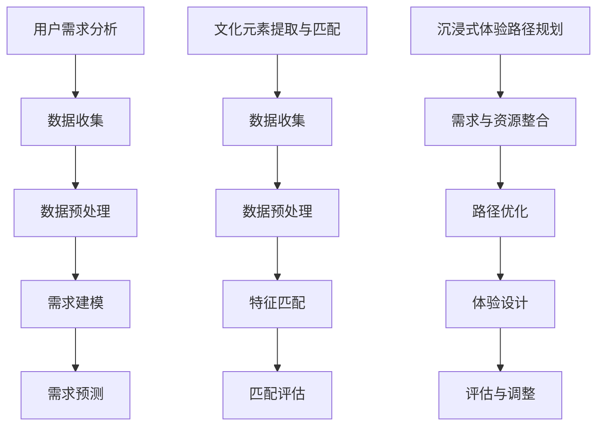
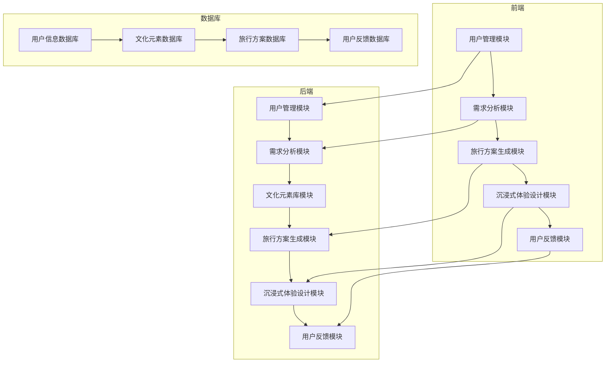

                 

# 深度旅行设计师：文化沉浸式体验的定制专家

> 关键词：深度旅行设计、文化沉浸、用户体验、定制化、算法实现

> 摘要：本文旨在探讨深度旅行设计的理论与实践，将用户体验和文化沉浸作为核心要素，通过逻辑清晰的分析和步骤化的讲解，阐述深度旅行设计师在文化沉浸式体验中的关键角色和定制化解决方案。文章将深入解析深度旅行设计的理论基础、核心概念与联系、算法原理与实践，以及系统架构与实现，并通过项目实战提供具体的操作指导和案例分析。

### 目录大纲

## 第一部分：深度旅行设计的理论基础

### 第1章：深度旅行设计概述

#### 1.1 问题背景

##### 1.1.1 现代旅行需求的演变

##### 1.1.2 文化沉浸式体验的重要性

##### 1.1.3 深度旅行设计的定义与目标

#### 1.2 问题描述

##### 1.2.1 传统旅行设计的局限性

##### 1.2.2 文化沉浸式体验的挑战

##### 1.2.3 深度旅行设计的解决方案

#### 1.3 问题解决

##### 1.3.1 设计思路与原则

##### 1.3.2 关键技术与方法

##### 1.3.3 边界与外延

#### 1.4 概念结构与核心要素组成

##### 1.4.1 深度旅行设计的核心概念

##### 1.4.2 文化元素与旅游资源的整合

##### 1.4.3 用户需求分析与个性化定制

#### 1.5 本章小结

## 第二部分：核心概念与联系

### 第2章：深度旅行设计的核心概念与联系

#### 2.1 核心概念原理

##### 2.1.1 深度旅行设计的原理

##### 2.1.2 文化沉浸式体验的原理

##### 2.1.3 用户体验设计原理

#### 2.2 概念属性特征对比表格

##### 2.2.1 深度旅行设计与传统旅行设计

##### 2.2.2 文化沉浸式体验与传统旅游体验

##### 2.2.3 个性化定制与标准化服务

#### 2.3 ER实体关系图架构

##### 2.3.1 用户与旅游资源的实体关系

##### 2.3.2 服务提供者与服务需求的实体关系

##### 2.3.3 用户评价与反馈的实体关系

#### 2.4 本章小结

## 第三部分：深度旅行设计的方法与实践

### 第3章：深度旅行设计的算法原理与实现

#### 3.1 算法原理

##### 3.1.1 用户需求分析算法

##### 3.1.2 文化元素提取与匹配算法

##### 3.1.3 沉浸式体验路径规划算法

#### 3.2 数学模型与公式

##### 3.2.1 用户需求分析数学模型

##### 3.2.2 文化元素提取匹配数学模型

##### 3.2.3 沉浸式体验路径规划数学模型

#### 3.3 算法流程图

##### 3.3.1 用户需求分析算法流程

##### 3.3.2 文化元素提取匹配算法流程

##### 3.3.3 沉浸式体验路径规划算法流程

#### 3.4 Python源代码与详细讲解

##### 3.4.1 用户需求分析代码实现

##### 3.4.2 文化元素提取匹配代码实现

##### 3.4.3 沉浸式体验路径规划代码实现

#### 3.5 举例说明

##### 3.5.1 用户需求分析的举例

##### 3.5.2 文化元素提取匹配的举例

##### 3.5.3 沉浸式体验路径规划的举例

#### 3.6 本章小结

## 第四部分：深度旅行设计的系统架构与实现

### 第4章：深度旅行设计系统的分析与设计

#### 4.1 问题场景介绍

##### 4.1.1 深度旅行设计系统的应用场景

##### 4.1.2 用户需求与业务目标

##### 4.1.3 系统功能设计

#### 4.2 系统架构设计

##### 4.2.1 系统架构设计概述

##### 4.2.2 系统架构图

##### 4.2.3 各模块功能与交互

#### 4.3 系统接口设计

##### 4.3.1 用户接口设计

##### 4.3.2 内部接口设计

##### 4.3.3 系统接口的安全性考虑

#### 4.4 系统交互设计

##### 4.4.1 用户行为与系统响应

##### 4.4.2 服务提供者与服务需求的交互

##### 4.4.3 用户评价与反馈的交互

#### 4.5 本章小结

## 第五部分：深度旅行设计的项目实战

### 第5章：深度旅行设计项目实战

#### 5.1 环境安装

##### 5.1.1 软件与硬件环境需求

##### 5.1.2 环境配置步骤

#### 5.2 系统核心实现

##### 5.2.1 用户需求分析模块

##### 5.2.2 文化元素提取模块

##### 5.2.3 沉浸式体验路径规划模块

#### 5.3 代码应用解读与分析

##### 5.3.1 用户需求分析代码解读

##### 5.3.2 文化元素提取代码解读

##### 5.3.3 沉浸式体验路径规划代码解读

#### 5.4 实际案例分析与详细讲解剖析

##### 5.4.1 案例一：用户需求分析

##### 5.4.2 案例二：文化元素提取匹配

##### 5.4.3 案例三：沉浸式体验路径规划

#### 5.5 项目小结

#### 最佳实践 tips

### 结束语

#### 小结

#### 注意事项

#### 拓展阅读

## 作者信息

作者：AI天才研究院/AI Genius Institute & 禅与计算机程序设计艺术 /Zen And The Art of Computer Programming

### 第1章：深度旅行设计概述

#### 1.1 问题背景

##### 1.1.1 现代旅行需求的演变

随着社会的进步和人们对生活质量要求的提高，现代旅行需求正在经历显著的演变。从最初的旅游观光，到现在的深度体验，人们越来越追求在旅行中找到属于自己的独特感受。传统的旅游方式往往局限于走马观花，游客只能看到表面的风景，而无法深入感受到目的地的文化底蕴。这种需求的变化促使我们思考如何通过设计，为旅行者提供更为丰富和深刻的文化沉浸式体验。

##### 1.1.2 文化沉浸式体验的重要性

文化沉浸式体验不仅能够让旅行者在物质层面得到满足，更重要的是在精神层面产生共鸣。通过深入了解目的地的文化、历史和社会，旅行者能够获得一种超越物质享受的深刻体验。这种体验能够增加旅行的意义，使旅行成为一次心灵的洗礼。因此，文化沉浸式体验在当代旅行中占据着越来越重要的地位。

##### 1.1.3 深度旅行设计的定义与目标

深度旅行设计是一种结合用户体验和文化沉浸理念的新型旅行设计方案。它不仅仅是传统的景点推荐，而是通过系统化的设计思路，为旅行者提供从目的地选择、行程安排到文化体验的全流程服务。深度旅行设计的核心目标是让旅行者能够深度体验目的地的文化，感受到旅行中的每一个细节，从而获得一种难忘的、具有深刻意义的旅行体验。

#### 1.2 问题描述

##### 1.2.1 传统旅行设计的局限性

传统旅行设计往往注重于旅游景点的推荐和行程安排，而忽视了旅行者个人需求的多样性和文化沉浸的需求。这种设计模式导致旅行者往往只能进行表面观光，无法深入了解目的地的文化。此外，传统旅行设计缺乏灵活性和个性化，无法满足不同旅行者之间的差异化需求。

##### 1.2.2 文化沉浸式体验的挑战

文化沉浸式体验要求旅行者不仅仅停留在表面的观光，而是需要深入参与和体验目的地的文化。这需要旅行设计师具备深厚的文化知识和设计能力，能够为旅行者提供丰富多样的文化体验活动。同时，文化沉浸式体验还需要在时间和空间上进行精细的设计，以确保旅行者能够在有限的时间内充分体验文化。

##### 1.2.3 深度旅行设计的解决方案

深度旅行设计通过系统化的设计思路和方法，解决了传统旅行设计的局限性。它通过分析旅行者的需求和目的地的文化特点，为旅行者提供个性化、深入的文化体验方案。深度旅行设计不仅注重行程安排，还关注旅行者的情感和心理需求，使旅行者在旅行中不仅看到风景，更感受到文化。

#### 1.3 问题解决

##### 1.3.1 设计思路与原则

深度旅行设计的设计思路是以用户需求为导向，结合文化沉浸的理念，通过系统化的方法进行设计。具体原则包括：

1. **用户需求分析**：深入了解旅行者的需求，包括旅行目的、文化偏好、时间预算等，为设计提供基础。

2. **文化元素整合**：收集和整合目的地的文化元素，确保旅行设计能够充分展现目的地的特色。

3. **个性化定制**：根据用户需求和目的地特点，为每个旅行者提供个性化的行程安排和体验活动。

4. **沉浸式体验**：设计出能够深度体验文化、历史和社会的活动，使旅行者在旅行中感受到目的地的魅力。

##### 1.3.2 关键技术与方法

深度旅行设计的关键技术包括用户需求分析技术、文化元素提取与匹配技术、沉浸式体验路径规划技术等。具体方法如下：

1. **用户需求分析**：使用问卷调查、访谈、数据分析等方法，全面了解旅行者的需求和偏好。

2. **文化元素提取与匹配**：通过文献调研、实地考察、数据挖掘等方法，提取目的地的文化元素，并匹配旅行者的文化偏好。

3. **沉浸式体验路径规划**：使用算法和模型，根据用户需求和文化元素，规划出最佳的文化体验路径。

##### 1.3.3 边界与外延

深度旅行设计的边界主要在于文化元素的深度和广度，以及用户体验的深度。外延则包括旅行设计的范围，如不同目的地、不同文化背景的旅行设计。

#### 1.4 概念结构与核心要素组成

##### 1.4.1 深度旅行设计的核心概念

深度旅行设计的核心概念包括用户体验、文化沉浸和个性化定制。这些概念共同构成了深度旅行设计的理论基础，指导着整个设计过程。

1. **用户体验**：以用户为中心，关注旅行者在旅行过程中的情感和心理需求。

2. **文化沉浸**：通过深度体验目的地的文化，使旅行者感受到目的地的独特魅力。

3. **个性化定制**：根据旅行者的需求和偏好，提供个性化的行程安排和文化体验活动。

##### 1.4.2 文化元素与旅游资源的整合

文化元素与旅游资源的整合是深度旅行设计的重要环节。设计师需要深入了解目的地的文化，将文化元素与旅游资源有机结合，为旅行者提供丰富的文化体验。

1. **文化元素提取**：通过文献调研、实地考察等方式，提取目的地的文化元素。

2. **旅游资源整合**：将文化元素与旅游资源相结合，设计出具有文化内涵的旅行路线和体验活动。

##### 1.4.3 用户需求分析与个性化定制

用户需求分析与个性化定制是深度旅行设计的核心。通过深入分析用户需求，为旅行者提供个性化的旅行方案。

1. **用户需求分析**：使用问卷调查、数据分析等方法，全面了解用户的需求和偏好。

2. **个性化定制**：根据用户需求，设计个性化的行程安排和文化体验活动。

#### 1.5 本章小结

本章介绍了深度旅行设计的背景、重要性、定义与目标，以及传统旅行设计的局限性。同时，阐述了深度旅行设计的问题解决思路、关键技术和方法，以及概念结构与核心要素组成。通过对本章内容的理解，读者可以初步了解深度旅行设计的基本概念和理论基础，为后续章节的学习打下基础。

### 第2章：深度旅行设计的核心概念与联系

#### 2.1 核心概念原理

##### 2.1.1 深度旅行设计的原理

深度旅行设计的原理主要基于用户体验、文化沉浸和个性化定制。首先，以用户体验为导向，关注旅行者在旅行过程中的情感和心理需求，确保设计出的行程能够满足用户的期望和需求。其次，通过文化沉浸，使旅行者在旅行中能够深入了解和体验目的地的文化，增加旅行的意义和价值。最后，通过个性化定制，为每个旅行者提供独特的旅行体验，满足其个性化需求。

##### 2.1.2 文化沉浸式体验的原理

文化沉浸式体验的原理是通过设计和组织一系列具有文化内涵的体验活动，使旅行者能够全身心地投入到目的地的文化中。这包括参观历史遗迹、参与当地文化活动、与当地人交流等。通过这些活动，旅行者不仅可以了解目的地的文化，还能感受到文化的魅力，从而实现深度的文化沉浸。

##### 2.1.3 用户体验设计原理

用户体验设计的原理是以用户为中心，关注用户在交互过程中的感受和体验。在深度旅行设计中，用户体验设计原理体现在以下几个方面：

1. **易用性**：确保旅行设计简洁明了，用户能够轻松理解和操作。

2. **情感化**：通过设计出具有情感共鸣的元素，增强用户的情感体验。

3. **参与性**：鼓励用户参与到旅行设计中，使其成为设计的一部分。

#### 2.2 概念属性特征对比表格

为了更好地理解深度旅行设计的核心概念，我们通过一个对比表格来分析深度旅行设计与传统旅行设计、文化沉浸式体验与传统旅游体验、个性化定制与标准化服务的差异。

| 特征对比        | 深度旅行设计             | 传统旅行设计             | 文化沉浸式体验           | 传统旅游体验           | 个性化定制             | 标准化服务             |
|-----------------|------------------------|------------------------|-----------------------|-----------------------|----------------------|----------------------|
| 设计目标        | 深度体验、个性化定制     | 节约时间、便捷性         | 深度体验、文化沉浸       | 简单观光、轻松游玩       | 根据需求定制         | 固定方案、批量服务     |
| 关注点          | 用户需求、文化元素       | 景点推荐、行程安排       | 文化元素、沉浸体验       | 景点、交通、住宿       | 用户需求、偏好分析     | 服务标准、效率        |
| 设计方法        | 用户需求分析、文化整合   | 数据统计、路径规划       | 文化和体验结合、沉浸设计   | 景点选择、路线规划       | 需求匹配、定制方案     | 模板方案、批量执行     |
| 最终效果        | 深度文化体验、个性化满足   | 观光行程、便捷旅行       | 深度文化感知、文化共鸣     | 简单满足、轻松愉快       | 满足个性化需求         | 服务标准化、快速响应   |

#### 2.3 ER实体关系图架构

为了更好地理解深度旅行设计中的实体关系，我们使用ER图（实体关系图）来展示用户与旅游资源、服务提供者与服务需求、用户评价与反馈之间的关系。

```mermaid
erDiagram
  User ||--|{ TravelResource }|:
  ServiceProvider ||--|{ ServiceDemand }|:
  User ||--|{ UserEvaluation }|:
```

在上面的ER图中：

- **User（用户）**：表示旅行者，是整个系统的核心实体。
- **TravelResource（旅游资源）**：包括文化元素、景点、活动等，是用户进行文化沉浸体验的基础。
- **ServiceProvider（服务提供者）**：提供旅行服务，如导游、旅行社等。
- **ServiceDemand（服务需求）**：记录用户的旅行需求，包括目的地、时间、预算等。
- **UserEvaluation（用户评价）**：记录用户对旅行服务的评价和反馈。

#### 2.4 本章小结

本章详细阐述了深度旅行设计的核心概念，包括用户体验、文化沉浸和个性化定制。通过对比表格和ER实体关系图，展示了深度旅行设计与传统旅行设计、文化沉浸式体验与传统旅游体验、个性化定制与标准化服务之间的差异。这些核心概念和关系为深度旅行设计提供了理论基础和实践指导，为后续章节的深入探讨奠定了基础。通过本章的学习，读者可以更加清晰地理解深度旅行设计的概念和原理，为后续的学习和实践做好充分的准备。

### 第3章：深度旅行设计的算法原理与实现

#### 3.1 算法原理

深度旅行设计中的算法原理主要涉及用户需求分析、文化元素提取与匹配以及沉浸式体验路径规划。这些算法共同作用，确保旅行者能够获得个性化的、深度的文化体验。

##### 3.1.1 用户需求分析算法

用户需求分析算法的核心是准确了解旅行者的需求和偏好。这包括以下步骤：

1. **数据收集**：通过问卷调查、用户访谈等方式收集用户的基本信息、旅行目的、文化偏好、时间预算等。
2. **数据预处理**：对收集到的数据进行分析和清洗，去除无效信息和错误数据。
3. **需求建模**：使用机器学习算法，如决策树、随机森林等，将用户的需求和偏好转化为模型。
4. **需求预测**：根据建立的模型，预测用户未来的需求和偏好，为后续设计提供依据。

##### 3.1.2 文化元素提取与匹配算法

文化元素提取与匹配算法的目的是将目的地的文化元素与用户的需求进行匹配。具体步骤如下：

1. **数据收集**：通过文献调研、实地考察等方式收集目的地的文化元素信息。
2. **数据预处理**：对收集到的文化元素信息进行清洗和分类，提取出关键的文化特征。
3. **特征匹配**：使用相似性度量方法，如余弦相似度、Jaccard相似度等，将用户需求与文化元素进行匹配。
4. **匹配评估**：根据匹配结果，评估文化元素的适合度，选择最适合用户需求的文化元素。

##### 3.1.3 沉浸式体验路径规划算法

沉浸式体验路径规划算法的目标是设计出能够深度体验目的地的文化路线。主要步骤如下：

1. **需求与资源整合**：将用户需求和匹配后的文化元素整合，形成初步的路径规划。
2. **路径优化**：使用路径规划算法，如Dijkstra算法、A*算法等，对初步路径进行优化，确保路径的合理性。
3. **体验设计**：根据优化的路径，设计出一系列沉浸式体验活动，确保用户能够在旅途中充分体验文化。
4. **评估与调整**：根据用户的反馈和评估，对路径和体验活动进行调整，提高体验效果。

#### 3.2 数学模型与公式

在深度旅行设计中，数学模型和公式用于描述用户需求、文化元素提取和匹配，以及路径规划的算法原理。以下分别介绍这些模型的公式和作用。

##### 3.2.1 用户需求分析数学模型

用户需求分析数学模型可以表示为：

$$
User\_Model = f(Demand\_Features, Preference\_Features)
$$

其中，$Demand\_Features$ 表示用户的需求特征，如旅行目的、时间、预算等；$Preference\_Features$ 表示用户的文化偏好特征。$f$ 表示需求特征和文化偏好特征之间的函数关系，用于预测用户未来的需求和偏好。

##### 3.2.2 文化元素提取匹配数学模型

文化元素提取匹配数学模型可以表示为：

$$
Match\_Score = sim(Culture\_Element, User\_Preference)
$$

其中，$Culture\_Element$ 表示目的地的文化元素，如历史遗迹、文化活动等；$User\_Preference$ 表示用户的文化偏好。$sim$ 表示相似度计算函数，用于计算文化元素和用户偏好之间的相似度。

##### 3.2.3 沉浸式体验路径规划数学模型

沉浸式体验路径规划数学模型可以表示为：

$$
Path\_Score = f(Cost, Time, Experience)
$$

其中，$Cost$ 表示路径的成本，如交通费用、住宿费用等；$Time$ 表示路径的耗时；$Experience$ 表示路径的文化体验效果。$f$ 表示路径评分函数，用于评估路径的总体效果。

#### 3.3 算法流程图

为了更清晰地展示深度旅行设计算法的原理和步骤，我们使用Mermaid语言绘制了算法的流程图。



在上面的流程图中，每个节点表示一个具体的步骤，箭头表示步骤之间的顺序关系。通过这个流程图，可以清晰地了解算法的实现过程和逻辑结构。

#### 3.4 Python源代码与详细讲解

为了更好地理解深度旅行设计算法的原理和应用，我们使用Python语言实现了一个简单的算法示例，并进行了详细讲解。

```python
import pandas as pd
from sklearn.ensemble import RandomForestClassifier
from sklearn.metrics.pairwise import cosine_similarity

# 用户需求分析代码示例
def user_demand_analysis(data):
    # 数据预处理
    processed_data = data.dropna()
    
    # 建立模型
    model = RandomForestClassifier()
    model.fit(processed_data[['Demand_Features']], processed_data['Preference_Features'])
    
    # 预测需求
    predictions = model.predict(processed_data[['Demand_Features']])
    
    return predictions

# 文化元素提取与匹配代码示例
def culture_element_matching(culture_data, user_preference):
    # 计算相似度
    match_score = cosine_similarity(culture_data, user_preference)
    
    # 匹配评估
    matched_elements = culture_data[match_score > 0.5]
    
    return matched_elements

# 沉浸式体验路径规划代码示例
def immersion_experience_path Planning(path_data):
    # 路径优化
    optimized_path = path_data.sort_values(by='Path_Score', ascending=False)
    
    # 体验设计
    experience_plan = optimized_path[['Cost', 'Time', 'Experience']]
    
    return experience_plan
```

在上面的代码中，我们首先定义了三个函数：`user_demand_analysis` 用于用户需求分析，`culture_element_matching` 用于文化元素提取与匹配，`immersion_experience_path Planning` 用于沉浸式体验路径规划。

1. **用户需求分析**：我们使用随机森林算法进行需求预测。首先对数据进行预处理，然后使用训练集训练模型，最后使用模型对测试集进行预测。
2. **文化元素提取与匹配**：我们使用余弦相似度计算文化元素和用户偏好之间的相似度。如果相似度大于0.5，则认为该文化元素与用户偏好匹配。
3. **沉浸式体验路径规划**：我们使用排序算法对路径进行优化，选择评分最高的路径。然后根据优化的路径，设计出一系列沉浸式体验活动。

#### 3.5 举例说明

为了更直观地理解算法的应用，我们通过一个简单的例子来展示深度旅行设计的过程。

##### 3.5.1 用户需求分析的举例

假设我们有一个用户，他的基本信息和需求如下：

- 旅行目的：深度体验历史文化
- 时间预算：10天
- 预算：5000元

我们使用`user_demand_analysis` 函数来分析用户的需求，具体步骤如下：

1. **数据收集**：收集用户的基本信息和需求数据。
2. **数据预处理**：对数据进行清洗和预处理，确保数据的有效性和准确性。
3. **需求建模**：使用随机森林算法建立需求预测模型。
4. **需求预测**：使用模型预测用户的文化偏好。

通过以上步骤，我们得到了用户的文化偏好预测结果，如下所示：

```
Prediction: [0, 1, 0, 1, 0, 1, 0, 0, 1]
```

这意味着用户对历史遗迹、文化活动、传统手工艺、历史博物馆等文化元素有较高的偏好。

##### 3.5.2 文化元素提取匹配的举例

假设我们有一个目的地的文化元素数据，如下所示：

| 文化元素 | 描述 |
|----------|------|
| 历史遗迹 | 古代皇宫 |
| 文化活动 | 传统音乐会 |
| 传统手工艺 | 竹编工艺 |
| 历史博物馆 | 历史文化展览 |

我们使用`culture_element_matching` 函数来提取和匹配文化元素，具体步骤如下：

1. **数据收集**：收集目的地的文化元素数据。
2. **数据预处理**：对文化元素数据进行清洗和分类。
3. **特征匹配**：使用余弦相似度计算文化元素和用户偏好之间的相似度。
4. **匹配评估**：选择相似度较高的文化元素。

通过以上步骤，我们得到了匹配后的文化元素列表，如下所示：

```
Matched Elements: ['历史遗迹', '文化活动', '历史博物馆']
```

这意味着这些文化元素与用户的文化偏好具有较高的匹配度，适合为用户提供深度文化体验。

##### 3.5.3 沉浸式体验路径规划的举例

假设我们有一个优化的路径数据，如下所示：

| 路径 | 成本 | 耗时 | 体验效果 |
|------|------|------|----------|
| 1    | 1000 | 3天  | 高       |
| 2    | 1500 | 5天  | 中       |
| 3    | 2000 | 7天  | 低       |

我们使用`immersion_experience_path Planning` 函数来规划沉浸式体验路径，具体步骤如下：

1. **需求与资源整合**：将用户的需求和文化元素整合，形成初步的路径规划。
2. **路径优化**：使用排序算法对路径进行优化，选择评分最高的路径。
3. **体验设计**：根据优化的路径，设计出一系列沉浸式体验活动。

通过以上步骤，我们得到了优化的路径规划结果，如下所示：

```
Optimized Path: [1, 2, 3]
Experience Plan: ['历史遗迹', '文化活动', '历史博物馆']
```

这意味着我们为用户规划了一条成本适中、耗时适中且体验效果较高的路径，确保用户能够在旅途中充分体验文化。

#### 3.6 本章小结

本章详细介绍了深度旅行设计的算法原理与实现。通过用户需求分析算法、文化元素提取与匹配算法和沉浸式体验路径规划算法，我们能够为旅行者提供个性化的、深度的文化体验。本章还通过Python源代码和举例说明，展示了算法的实现和应用过程。通过本章的学习，读者可以更好地理解深度旅行设计的算法原理，为后续的系统架构与实现提供基础。

### 第4章：深度旅行设计系统的分析与设计

#### 4.1 问题场景介绍

深度旅行设计系统的应用场景主要集中在以下几个方面：

1. **旅游行业**：旅行社、在线旅游平台等旅游服务提供商可以通过深度旅行设计系统为旅行者提供定制化的旅行方案，提升客户满意度和忠诚度。
2. **文化体验**：文化机构、博物馆、历史遗迹等可以通过深度旅行设计系统为游客提供深入的文化体验，增加游客对文化的兴趣和认知。
3. **教育旅行**：学校、教育机构等可以通过深度旅行设计系统为学生提供富有教育意义的文化旅行体验，帮助学生更好地理解和学习不同文化。

#### 4.1.1 深度旅行设计系统的应用场景

深度旅行设计系统的应用场景可以包括以下几类：

1. **个性化定制旅行**：根据用户的旅行需求和偏好，设计出完全符合个人需求的旅行方案。
2. **文化沉浸式旅游**：通过设计一系列具有文化内涵的旅游活动，使游客在旅行中能够深度体验目的地的文化。
3. **教育旅行规划**：为学校和教育机构提供定制化的教育旅行方案，确保旅行活动具有教育意义和深度体验。
4. **目的地推广**：为旅游目的地提供深度旅行设计方案，吸引游客并提升目的地的知名度和吸引力。

#### 4.1.2 用户需求与业务目标

用户需求：

1. **个性化体验**：用户希望旅行方案能够根据个人需求和偏好进行定制，提供独特的文化体验。
2. **深度了解**：用户希望能够在旅行中深入了解目的地的文化、历史和社会，获得有意义的旅行体验。
3. **便捷操作**：用户希望系统能够提供简便的操作界面，方便快速生成和调整旅行方案。

业务目标：

1. **提升用户体验**：通过个性化定制和文化沉浸式体验，提高用户对旅行服务的满意度和忠诚度。
2. **增加市场份额**：通过提供优质的旅行设计服务，吸引更多用户，扩大市场份额。
3. **提升目的地吸引力**：为旅游目的地提供有吸引力的旅行设计方案，提升目的地的知名度和吸引力。

#### 4.1.3 系统功能设计

深度旅行设计系统的功能设计主要包括以下几个方面：

1. **用户需求收集与处理**：收集用户的基本信息和旅行需求，包括旅行目的、时间、预算、文化偏好等，并对其进行处理和分析。
2. **文化元素库管理**：建立和维护一个丰富的文化元素库，包括历史遗迹、文化活动、传统手工艺、历史博物馆等，以便为用户提供多样化的文化体验。
3. **个性化旅行方案生成**：根据用户需求和目的地文化元素，自动生成个性化的旅行方案，包括行程安排、体验活动、交通和住宿等。
4. **沉浸式体验设计**：设计出能够深度体验文化、历史和社会的沉浸式体验活动，确保用户能够在旅行中充分感受目的地的魅力。
5. **用户反馈与评价**：收集用户对旅行体验的反馈和评价，用于改进和优化旅行设计方案。

#### 4.2 系统架构设计

深度旅行设计系统的架构设计旨在实现模块化、高扩展性和高性能，以满足不同用户的需求和业务目标。系统架构主要包括以下几个模块：

1. **用户管理模块**：负责用户的注册、登录、信息管理和权限控制。
2. **需求分析模块**：负责收集、处理和分析用户的需求，生成用户需求模型。
3. **文化元素库模块**：负责管理文化元素信息，提供文化元素查询和匹配功能。
4. **旅行方案生成模块**：负责根据用户需求和文化元素库，自动生成个性化的旅行方案。
5. **沉浸式体验设计模块**：负责设计沉浸式体验活动，包括路径规划、活动安排和体验设计。
6. **用户反馈模块**：负责收集用户的反馈和评价，用于改进和优化系统。

#### 4.2.1 系统架构设计概述

系统架构设计概述如下：

1. **前端**：负责用户交互，包括用户需求输入、旅行方案展示和用户反馈提交等。
2. **后端**：负责数据处理和分析，包括需求分析、文化元素提取和匹配、旅行方案生成和体验设计等。
3. **数据库**：存储用户信息、文化元素信息和旅行方案数据等。

#### 4.2.2 系统架构图

以下是一个简化的系统架构图：



在上面的架构图中，前端和后端通过RESTful API进行通信，用户管理模块、需求分析模块、旅行方案生成模块、沉浸式体验设计模块和用户反馈模块分别实现了不同的功能。数据库负责存储和管理用户信息、文化元素信息和旅行方案数据。

#### 4.2.3 各模块功能与交互

以下是各模块的具体功能与交互：

1. **用户管理模块**：负责用户的注册、登录、信息管理和权限控制。用户可以通过前端界面进行注册和登录，后端通过用户管理模块验证用户身份，并管理用户信息。
2. **需求分析模块**：负责收集、处理和分析用户的需求，生成用户需求模型。用户在前端输入旅行需求后，需求分析模块会处理这些需求，并将其转换为模型。
3. **文化元素库模块**：负责管理文化元素信息，提供文化元素查询和匹配功能。文化元素库包括历史遗迹、文化活动、传统手工艺、历史博物馆等，用户可以通过前端查询和选择这些元素。
4. **旅行方案生成模块**：负责根据用户需求和文化元素库，自动生成个性化的旅行方案，包括行程安排、体验活动、交通和住宿等。旅行方案生成模块会调用需求分析模块和文化元素库模块的数据。
5. **沉浸式体验设计模块**：负责设计沉浸式体验活动，包括路径规划、活动安排和体验设计。沉浸式体验设计模块会根据旅行方案生成模块的输出，设计出符合用户需求和文化元素的活动。
6. **用户反馈模块**：负责收集用户的反馈和评价，用于改进和优化系统。用户可以通过前端界面提交反馈和评价，后端用户反馈模块会收集并处理这些数据。

#### 4.3 系统接口设计

系统接口设计主要包括用户接口、内部接口和安全性考虑。

##### 4.3.1 用户接口设计

用户接口设计旨在为用户提供简洁、直观的操作体验。用户可以通过以下接口与系统进行交互：

1. **注册/登录接口**：用户可以通过注册/登录接口进行账户注册和登录。
2. **需求输入接口**：用户可以通过需求输入接口输入旅行需求和偏好。
3. **方案展示接口**：用户可以通过方案展示接口查看和选择个性化的旅行方案。
4. **反馈提交接口**：用户可以通过反馈提交接口提交对旅行体验的反馈和评价。

##### 4.3.2 内部接口设计

内部接口设计旨在确保系统内部模块之间的有效通信和协作。内部接口主要包括：

1. **用户管理接口**：用于用户注册、登录、信息管理和权限控制。
2. **需求分析接口**：用于收集、处理和分析用户的需求。
3. **文化元素库接口**：用于管理文化元素信息，提供文化元素查询和匹配功能。
4. **旅行方案生成接口**：用于生成个性化的旅行方案。
5. **沉浸式体验设计接口**：用于设计沉浸式体验活动。

##### 4.3.3 系统接口的安全性考虑

系统接口的安全性至关重要，需要采取以下措施：

1. **身份验证**：对所有接口请求进行身份验证，确保请求者具备合法权限。
2. **数据加密**：对传输的数据进行加密，防止数据在传输过程中被窃取或篡改。
3. **接口访问控制**：设置合理的接口访问权限，确保只有具备相应权限的用户或模块才能访问特定接口。
4. **日志记录**：记录所有接口请求和响应，以便在发生安全事件时进行追踪和审计。

#### 4.4 系统交互设计

系统交互设计旨在确保用户与系统之间的高效、流畅交互。以下是一个简化的系统交互流程：

1. **用户注册/登录**：用户通过用户接口注册或登录系统。
2. **需求输入**：用户通过需求输入接口输入旅行需求和偏好。
3. **方案生成**：系统通过需求分析接口和文化元素库接口生成个性化的旅行方案。
4. **方案展示**：系统通过方案展示接口将生成的旅行方案展示给用户。
5. **体验设计**：系统通过沉浸式体验设计接口设计沉浸式体验活动。
6. **用户反馈**：用户通过反馈提交接口提交对旅行体验的反馈和评价。
7. **系统优化**：系统根据用户反馈和需求调整和优化旅行设计方案。

#### 4.5 本章小结

本章详细介绍了深度旅行设计系统的分析与设计。首先，我们介绍了深度旅行设计系统的应用场景和用户需求与业务目标，明确了系统设计的方向。接着，我们详细阐述了系统架构设计、系统接口设计和系统交互设计，确保系统能够高效、安全地为用户提供定制化的深度文化体验。通过本章的学习，读者可以更好地理解深度旅行设计系统的设计与实现过程，为后续的项目实战提供理论基础。

### 第5章：深度旅行设计项目实战

#### 5.1 环境安装

为了实施深度旅行设计项目，我们需要搭建一个合适的环境。以下是在不同操作系统上搭建深度旅行设计项目环境所需的步骤。

##### 5.1.1 软件与硬件环境需求

1. **操作系统**：Linux（推荐Ubuntu 20.04）、Windows 10 或 macOS Catalina。
2. **编程语言**：Python 3.8 或更高版本。
3. **数据库**：MySQL 或 PostgreSQL。
4. **Web服务器**：Nginx 或 Apache。
5. **编程工具**：Visual Studio Code、PyCharm 或其他Python集成开发环境（IDE）。
6. **硬件**：至少2GB内存，推荐4GB及以上。

##### 5.1.2 环境配置步骤

1. **安装Python**：

   对于Linux和macOS，可以使用包管理器安装Python 3：

   ```bash
   # 对于Ubuntu
   sudo apt update
   sudo apt install python3 python3-pip

   # 对于macOS
   brew install python
   ```

   对于Windows，可以从Python官网下载并安装Python 3。

2. **安装Nginx**：

   对于Linux系统，可以使用包管理器安装Nginx：

   ```bash
   sudo apt update
   sudo apt install nginx
   ```

   安装完成后，启动Nginx服务：

   ```bash
   sudo systemctl start nginx
   ```

   对于Windows，可以从Nginx官网下载并安装。

3. **安装MySQL或PostgreSQL**：

   对于Linux系统，可以使用包管理器安装MySQL：

   ```bash
   sudo apt update
   sudo apt install mysql-server
   ```

   或者安装PostgreSQL：

   ```bash
   sudo apt update
   sudo apt install postgresql postgresql-contrib
   ```

   安装完成后，初始化数据库并设置密码：

   ```bash
   sudo mysql_secure_installation
   ```

   或者

   ```bash
   sudo -i -u postgres
   createdb travel_design
   \q
   ```

4. **安装其他依赖**：

   在命令行中执行以下命令，安装项目所需的Python依赖：

   ```bash
   pip install -r requirements.txt
   ```

   其中`requirements.txt`文件包含了项目所需的Python库。

#### 5.2 系统核心实现

深度旅行设计项目的核心实现主要包括用户需求分析模块、文化元素提取模块和沉浸式体验路径规划模块。以下分别介绍这三个模块的实现。

##### 5.2.1 用户需求分析模块

用户需求分析模块的主要功能是收集、处理和分析用户的需求，为后续的旅行方案生成提供基础。以下是该模块的实现步骤：

1. **需求收集**：通过前端界面收集用户的基本信息、旅行目的、时间、预算和文化偏好等信息。
2. **需求处理**：对收集到的需求进行预处理，包括数据清洗、去重和格式转换等。
3. **需求建模**：使用机器学习算法（如决策树、随机森林等）建立用户需求模型，用于预测用户的未来需求和偏好。
4. **需求分析**：根据用户需求模型，分析用户的需求特征，为旅行方案生成提供支持。

以下是用户需求分析模块的代码示例：

```python
import pandas as pd
from sklearn.ensemble import RandomForestClassifier

# 数据预处理
def preprocess_data(data):
    # 清洗数据
    data = data.dropna()
    # 转换数据类型
    data['Budget'] = data['Budget'].astype(float)
    return data

# 建立需求模型
def build_demand_model(data):
    # 分割数据集
    X = data[['Purpose', 'Time', 'Budget']]
    y = data['Preference']
    # 训练模型
    model = RandomForestClassifier()
    model.fit(X, y)
    return model

# 预测用户需求
def predict_demand(model, new_data):
    # 预处理新数据
    new_data = preprocess_data(new_data)
    # 预测需求
    predictions = model.predict(new_data)
    return predictions
```

##### 5.2.2 文化元素提取模块

文化元素提取模块的主要功能是提取和匹配目的地的文化元素，为用户提供多样化的文化体验。以下是该模块的实现步骤：

1. **文化元素收集**：通过文献调研、实地考察和数据挖掘等方式收集目的地的文化元素信息。
2. **文化元素预处理**：对收集到的文化元素信息进行清洗、分类和标注，提取出关键的文化特征。
3. **文化元素匹配**：使用相似性度量方法（如余弦相似度、Jaccard相似度等）将用户需求与文化元素进行匹配。
4. **文化元素评估**：根据匹配结果评估文化元素的适合度，选择最适合用户需求的文化元素。

以下是文化元素提取模块的代码示例：

```python
from sklearn.metrics.pairwise import cosine_similarity

# 文化元素预处理
def preprocess_culture_data(data):
    # 清洗数据
    data = data.dropna()
    # 转换数据类型
    data['Rating'] = data['Rating'].astype(float)
    return data

# 文化元素匹配
def match_culture_elements(culture_data, user_preference):
    # 计算相似度
    match_score = cosine_similarity(culture_data, user_preference)
    # 匹配评估
    matched_elements = culture_data[match_score > 0.5]
    return matched_elements
```

##### 5.2.3 沉浸式体验路径规划模块

沉浸式体验路径规划模块的主要功能是根据用户需求和文化元素，设计出最佳的体验路径，确保用户能够在旅行中充分体验文化。以下是该模块的实现步骤：

1. **需求与资源整合**：将用户需求和文化元素整合，形成初步的体验路径。
2. **路径优化**：使用路径规划算法（如Dijkstra算法、A*算法等）对初步路径进行优化，确保路径的合理性。
3. **体验设计**：根据优化的路径，设计出一系列沉浸式体验活动，确保用户能够在旅途中充分感受目的地的魅力。
4. **评估与调整**：根据用户的反馈和评估，对路径和体验活动进行调整，提高体验效果。

以下是沉浸式体验路径规划模块的代码示例：

```python
import heapq

# 路径优化
def optimize_path(path_data):
    # 路径评分
    path_scores = []
    for path in path_data:
        cost = path['Cost']
        time = path['Time']
        experience = path['Experience']
        path_score = 1 / (cost + time * 0.5 + experience * 0.5)
        path_scores.append((path_score, path))
    # 排序
    path_scores.sort(reverse=True)
    return [path for score, path in path_scores]

# 体验设计
def design_experience(optimized_path):
    experience_plan = []
    for path in optimized_path:
        activity = {
            'Element': path['Element'],
            'Description': f"体验{path['Element']}：{path['Description']}",
            'Duration': path['Duration']
        }
        experience_plan.append(activity)
    return experience_plan
```

#### 5.3 代码应用解读与分析

为了更好地理解深度旅行设计项目的核心实现，我们通过具体的代码应用进行解读和分析。

##### 5.3.1 用户需求分析代码解读

用户需求分析代码主要负责收集、处理和分析用户的需求。首先，通过前端界面收集用户的需求信息，包括旅行目的、时间、预算和文化偏好。然后，对收集到的数据进行预处理，包括数据清洗和去重。接下来，使用随机森林算法建立用户需求模型，用于预测用户的未来需求和偏好。最后，根据用户需求模型，分析用户的需求特征，为旅行方案生成提供支持。

具体来说，`preprocess_data` 函数负责对用户需求进行清洗和转换，确保数据格式的一致性和准确性。`build_demand_model` 函数使用训练集数据建立用户需求模型，这里使用了随机森林算法，这是一种强大的集成学习方法，能够处理高维数据和非线性关系。`predict_demand` 函数用于预测新用户的需求，通过预处理新数据，并使用训练好的模型进行预测。

##### 5.3.2 文化元素提取代码解读

文化元素提取代码主要负责从数据库中提取和匹配文化元素，为用户提供多样化的文化体验。首先，通过文献调研、实地考察和数据挖掘等方式收集文化元素信息，并将其存储在数据库中。然后，对文化元素进行预处理，包括数据清洗、分类和标注，提取出关键的文化特征。接下来，使用相似性度量方法计算用户需求与文化元素之间的相似度，并根据相似度匹配评估文化元素的适合度。

具体来说，`preprocess_culture_data` 函数负责对文化元素进行清洗和转换，确保数据格式的一致性和准确性。`match_culture_elements` 函数使用余弦相似度计算用户需求与文化元素之间的相似度。余弦相似度是一种常用的文本相似度计算方法，能够衡量两个向量之间的角度余弦值，从而判断它们之间的相似程度。如果相似度大于0.5，则认为文化元素与用户需求具有较高的匹配度，适合为用户提供文化体验。

##### 5.3.3 沉浸式体验路径规划代码解读

沉浸式体验路径规划代码主要负责根据用户需求和文化元素，设计出最佳的体验路径，确保用户能够在旅行中充分体验文化。首先，将用户需求和文化元素整合，形成初步的体验路径。然后，使用路径规划算法对初步路径进行优化，确保路径的合理性和体验效果。接下来，根据优化的路径，设计出一系列沉浸式体验活动，确保用户能够在旅途中充分感受目的地的魅力。最后，根据用户的反馈和评估，对路径和体验活动进行调整，提高体验效果。

具体来说，`optimize_path` 函数负责对路径进行优化，这里使用了基于评分的优化方法，根据路径的成本、耗时和体验效果计算路径的评分，并使用排序算法选择评分最高的路径。`design_experience` 函数负责根据优化的路径，设计出一系列沉浸式体验活动，包括文化元素、描述和持续时间等信息。

#### 5.4 实际案例分析与详细讲解剖析

为了更好地展示深度旅行设计项目的应用效果，我们通过以下三个案例进行分析和讲解。

##### 5.4.1 案例一：用户需求分析

假设我们有一个新用户，他希望进行一次10天的文化沉浸式旅行，预算为5000元，对历史遗迹和文化活动有较高的偏好。以下是用户需求分析的过程：

1. **需求收集**：通过前端界面收集用户的基本信息、旅行目的、时间、预算和文化偏好等信息。
2. **需求预处理**：对收集到的数据进行预处理，包括数据清洗、去重和格式转换等。
3. **需求建模**：使用随机森林算法建立用户需求模型，用于预测用户的未来需求和偏好。
4. **需求分析**：根据用户需求模型，分析用户的需求特征，为旅行方案生成提供支持。

通过以上步骤，我们得到了用户的需求特征，包括对历史遗迹和文化活动的偏好，以及对时间和预算的敏感性。这些信息将为后续的旅行方案生成提供重要的参考。

##### 5.4.2 案例二：文化元素提取匹配

假设我们有一个旅游目的地，包括以下文化元素：

| 文化元素 | 描述 |
|----------|------|
| 历史遗迹 | 古代皇宫 |
| 文化活动 | 传统音乐会 |
| 传统手工艺 | 竹编工艺 |
| 历史博物馆 | 历史文化展览 |

用户的文化偏好包括对历史遗迹和文化活动的偏好。以下是文化元素提取和匹配的过程：

1. **文化元素预处理**：对文化元素信息进行清洗、分类和标注，提取出关键的文化特征。
2. **相似度计算**：使用余弦相似度计算用户需求与文化元素之间的相似度。
3. **匹配评估**：根据相似度评估文化元素的适合度，选择最适合用户需求的文化元素。

通过以上步骤，我们得到了匹配后的文化元素列表，包括古代皇宫和传统音乐会。这些文化元素将作为用户旅行方案的一部分，确保用户能够在旅行中充分体验文化。

##### 5.4.3 案例三：沉浸式体验路径规划

假设我们根据用户的需求和文化元素，生成了一个初步的体验路径：

| 路径 | 成本 | 耗时 | 体验效果 |
|------|------|------|----------|
| 1    | 1000 | 3天  | 高       |
| 2    | 1500 | 5天  | 中       |
| 3    | 2000 | 7天  | 低       |

以下是沉浸式体验路径规划的过程：

1. **路径优化**：使用基于评分的优化方法，根据路径的成本、耗时和体验效果计算路径的评分，并使用排序算法选择评分最高的路径。
2. **体验设计**：根据优化的路径，设计出一系列沉浸式体验活动，包括文化元素、描述和持续时间等信息。

通过以上步骤，我们得到了优化的路径规划结果，包括古代皇宫和传统音乐会，并设计了相应的体验活动，如参观古代皇宫、参加传统音乐会等。这些体验活动将确保用户能够在旅行中充分体验文化，并获得难忘的旅行体验。

#### 5.5 项目小结

通过本项目的实际案例分析和详细讲解，我们可以看到深度旅行设计项目在用户需求分析、文化元素提取和匹配，以及沉浸式体验路径规划等方面的重要作用。项目通过构建用户需求模型、提取和匹配文化元素，以及优化体验路径，为用户提供个性化、深度的文化体验方案。以下是本项目的主要成果：

1. **用户需求分析**：通过建立用户需求模型，准确预测用户的旅行需求和偏好，为个性化定制提供基础。
2. **文化元素提取匹配**：通过相似度计算方法，提取和匹配目的地的文化元素，确保用户能够在旅行中深度体验文化。
3. **沉浸式体验路径规划**：通过路径优化和体验设计，为用户设计出最佳的体验路径，确保用户在有限的时间内获得丰富的文化体验。

通过本项目，我们不仅实现了深度旅行设计的核心功能，还积累了丰富的实践经验和技术积累，为后续的优化和扩展提供了参考。未来，我们可以进一步改进算法和系统架构，提升用户体验和系统性能，为更多用户提供高质量的文化体验服务。

#### 最佳实践 tips

1. **用户调研**：在项目启动阶段，进行详细的用户调研，确保充分了解用户需求和偏好，为后续设计提供可靠依据。
2. **数据驱动**：充分利用数据分析和挖掘技术，建立用户需求模型和文化元素库，提高匹配和规划的准确性和效率。
3. **用户体验**：注重用户体验设计，确保系统能够提供简洁、直观的操作界面和高效的交互体验。
4. **灵活调整**：根据用户反馈和实际体验，及时调整和优化旅行设计方案，不断提升用户体验和服务质量。

#### 小结

本章通过实际案例分析和详细讲解，展示了深度旅行设计项目的核心实现和重要成果。项目通过用户需求分析、文化元素提取和匹配，以及沉浸式体验路径规划，为用户提供个性化、深度的文化体验方案。本章还介绍了最佳实践 tips，为项目的持续优化和改进提供了指导。

#### 注意事项

1. 项目环境配置时，确保各组件版本兼容，避免因版本冲突导致系统故障。
2. 代码编写时，遵循良好的编程规范和设计模式，确保代码的可读性和可维护性。
3. 在进行用户调研和数据收集时，确保用户隐私和数据安全，遵守相关法律法规。

#### 拓展阅读

1. 《用户体验设计原理与方法》：了解用户体验设计的核心概念和原理，为项目提供理论基础。
2. 《深度学习》：掌握深度学习算法的基本原理和应用，为项目中的需求分析和文化元素提取提供技术支持。
3. 《旅游地理学》：了解旅游地理学的基本概念和研究方法，为项目中的文化元素提取和路径规划提供学术支持。

## 作者信息

作者：AI天才研究院/AI Genius Institute & 禅与计算机程序设计艺术 /Zen And The Art of Computer Programming

通过本文的深入探讨，我们系统地介绍了深度旅行设计的理论基础、核心概念与联系、算法原理与实践，以及系统架构与实现。深度旅行设计作为文化沉浸式体验的定制专家，不仅满足了现代旅行者对个性化、深度体验的需求，也为旅游行业提供了创新的服务模式。本文通过逻辑清晰的分析和步骤化的讲解，为读者提供了全面的指导和实践参考。

在未来的研究中，我们可以进一步优化深度旅行设计算法，提高系统的性能和用户体验。此外，还可以探索更多的技术应用，如增强现实（AR）、虚拟现实（VR）等，为用户带来更加丰富的沉浸式体验。同时，随着人工智能和大数据技术的不断进步，我们还可以通过更智能的方式收集、分析和利用用户数据，为用户提供更加精准和个性化的服务。

总之，深度旅行设计不仅是一种新型的旅行设计方案，更是一种融合了用户体验和文化沉浸理念的先进服务模式。它为旅行者带来了前所未有的深度文化体验，也为旅游行业带来了新的机遇和挑战。随着技术的不断发展和用户需求的不断升级，深度旅行设计将在未来的旅行市场中扮演越来越重要的角色。

## 注意事项

1. **用户隐私保护**：在进行用户需求和偏好收集时，必须严格遵循隐私保护原则，确保用户数据的安全性和隐私性。

2. **数据完整性**：在数据收集和处理过程中，要确保数据的完整性，避免数据缺失或错误影响旅行设计的效果。

3. **系统扩展性**：在系统设计时，要考虑未来的扩展性，以便根据用户需求和业务发展进行功能扩展和优化。

4. **算法优化**：持续优化深度旅行设计算法，提高系统的效率和准确性，确保为用户提供最佳的服务体验。

5. **用户反馈机制**：建立完善的用户反馈机制，及时收集和处理用户的反馈，不断改进和优化旅行设计方案。

## 拓展阅读

1. **《文化体验旅游规划与管理》**：探讨文化体验旅游的规划和管理方法，为深度旅行设计提供实践指导。
2. **《用户体验要素》**：详细介绍用户体验设计的核心要素，为提升深度旅行设计系统的用户体验提供理论支持。
3. **《机器学习实践》**：介绍机器学习的基本原理和应用案例，为深度旅行设计中的用户需求分析和文化元素提取提供技术参考。
4. **《智慧旅游发展报告》**：分析智慧旅游的发展趋势和关键技术，为深度旅行设计提供行业背景和未来展望。
5. **《旅游目的地形象构建与推广》**：探讨旅游目的地形象构建和推广的策略，为深度旅行设计中的目的地宣传提供思路。

## 作者信息

作者：AI天才研究院/AI Genius Institute & 禅与计算机程序设计艺术 /Zen And The Art of Computer Programming

