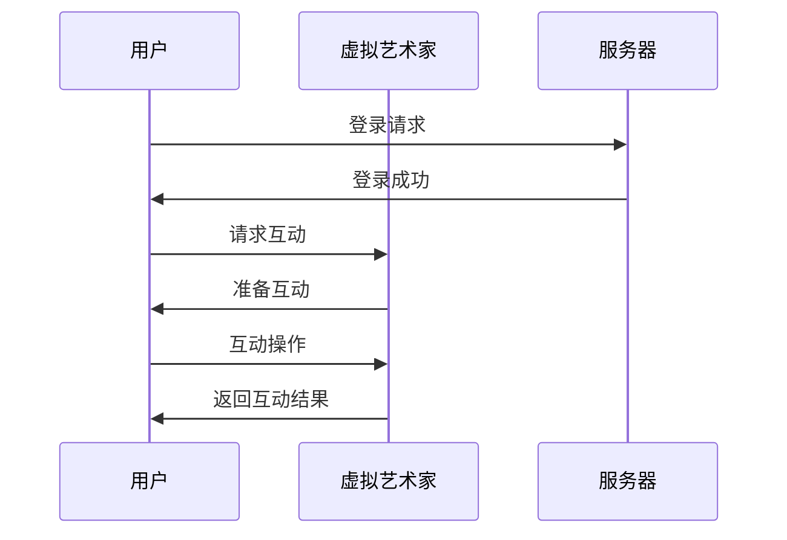
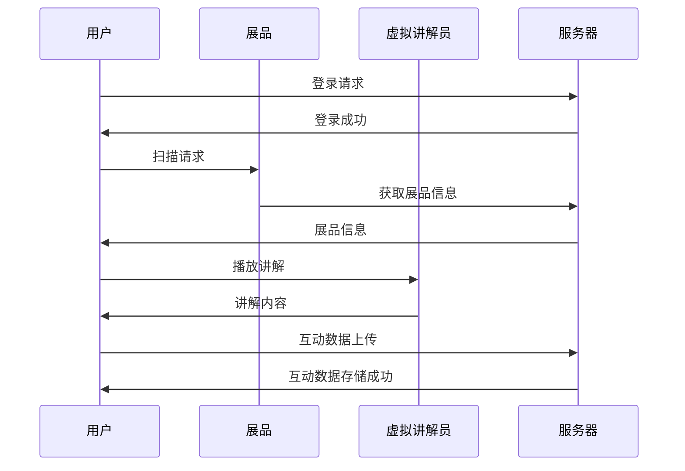

                 

### 混合现实艺术展：虚拟与现实交织的感官体验

#### 关键词：混合现实、艺术展览、虚拟与现实的交融、感官体验

> **摘要：**
>
> 本文章深入探讨混合现实（MR）艺术展的背景、概念、技术与艺术表达，并分析了其带来的感官体验和对社会的深远影响。文章分为十个章节，依次介绍了混合现实艺术展的基本概念、技术基础、艺术表现、应用案例以及未来展望，旨在为读者提供全面而深刻的理解。

### 引言

#### 混合现实技术的崛起

随着科技的发展，混合现实（Mixed Reality，简称MR）逐渐从科幻领域走进现实。MR是一种将虚拟世界与现实世界融合的技术，它通过增强现实（Augmented Reality，AR）和虚拟现实（Virtual Reality，VR）的结合，为用户创造出一种全新的感知体验。这一技术的出现不仅改变了我们的生活方式，也深刻影响了艺术领域。

#### 混合现实艺术的定义与历史

混合现实艺术（Mixed Reality Art）是指利用混合现实技术创作的艺术作品。它不仅限于视觉上的效果，还涉及到听觉、触觉等多感官的互动。这种艺术形式最早可以追溯到20世纪90年代，随着计算机图形学和显示技术的发展，混合现实艺术逐渐成熟并开始受到广泛关注。

#### 混合现实艺术的重要性

混合现实艺术不仅具有高度的观赏价值，还具有重要的社会和文化意义。首先，它打破了传统艺术的表现形式，使艺术家能够以全新的方式表达创意和情感。其次，它为观众提供了沉浸式的体验，使人们能够更加深入地感受艺术作品。此外，混合现实艺术还在教育和娱乐等领域有着广泛的应用前景，对社会发展产生了积极影响。

### 基本概念与原理

#### 混合现实的关键术语

在探讨混合现实艺术之前，我们需要了解一些关键术语，以便更好地理解这一领域。以下是一些重要概念的定义：

- **混合现实（Mixed Reality, MR）**：MR是一种通过计算机技术将虚拟世界与现实世界无缝融合的技术，用户可以与虚拟对象进行互动。
  
- **增强现实（Augmented Reality, AR）**：AR是在现实世界的基础上叠加虚拟信息，通常通过智能手机或AR眼镜实现。
  
- **虚拟现实（Virtual Reality, VR）**：VR是一种完全沉浸式的虚拟体验，用户通过VR设备如头戴显示器（HMD）进入虚拟环境。

#### 混合现实的核心原理

混合现实技术基于几个核心原理：

- **多感知交互**：MR技术利用视觉、听觉、触觉等多种感官与用户互动。
  
- **实时定位与跟踪**：MR设备通过摄像头、传感器等技术实时捕捉用户和环境，实现准确的定位与跟踪。
  
- **环境感知与融合**：MR系统根据实时获取的环境信息，将虚拟对象与环境融合，使虚拟内容看起来更加真实。

#### 混合现实的技术类型

混合现实技术可以分为以下几类：

- **桌面型MR**：用户通过电脑或平板电脑等桌面设备体验MR内容。
  
- **眼镜型MR**：用户通过AR眼镜或VR头显体验MR内容。
  
- **全沉浸型MR**：用户通过全身穿戴设备进入虚拟环境，实现全感官的沉浸体验。

### 技术栈与硬件软件要求

#### 混合现实技术的硬件要求

混合现实技术对硬件设备有着较高的要求，主要包括以下几类：

- **计算机设备**：高性能的计算机是MR技术的基础，用于处理复杂的图像和数据处理。
  
- **显示器**：高分辨率显示器或头戴显示器（HMD）用于呈现虚拟内容。
  
- **传感器**：包括摄像头、深度传感器、加速度计等，用于捕捉用户和环境信息。

#### 混合现实技术的软件要求

在软件方面，混合现实技术需要以下几个关键组件：

- **开发工具**：如Unity、Unreal Engine等，用于创建和编辑MR内容。
  
- **AR/VR平台**：如ARKit、Vuforia等，用于实现增强现实和虚拟现实功能。
  
- **算法库**：如OpenCV、PCL等，用于图像处理和计算机视觉。

#### 增强现实与虚拟现实的对比

- **视觉效果**：AR通常在现实环境中叠加虚拟内容，而VR则完全隔离现实世界。
  
- **交互方式**：AR通过手势和语音与虚拟对象交互，VR则通过控制器和动捕设备实现。
  
- **应用场景**：AR适用于信息增强和导航，VR则更适用于娱乐和培训。

### 用户体验设计

#### 用户为中心的设计原则

在混合现实艺术展的设计过程中，用户体验设计（User Experience Design，简称UXD）至关重要。以下是一些核心原则：

- **用户需求分析**：了解目标用户的需求和期望，为设计提供依据。
  
- **可用性测试**：在设计和开发过程中进行可用性测试，确保用户体验的流畅性。
  
- **交互设计**：设计直观、自然的交互方式，提高用户满意度。

#### 创造沉浸式体验的方法

为了提供高质量的感官体验，以下是一些创造沉浸式体验的方法：

- **多感官刺激**：利用视觉、听觉、触觉等多感官刺激，增强用户的沉浸感。
  
- **互动性设计**：设计具有互动性的内容，让用户能够主动参与和体验。
  
- **动态环境**：创建动态变化的虚拟环境，增加用户的趣味性和探索欲望。

#### 混合现实艺术展的挑战与解决方案

在设计和实现混合现实艺术展时，我们面临以下挑战：

- **技术实现难度**：MR技术的实现需要复杂的硬件和软件支持，对技术团队的要求较高。
  
- **用户适应期**：用户需要适应新的交互方式，提高对MR设备的熟练度。
  
- **内容创作成本**：高质量MR内容的创作需要较高的技术和艺术水平，导致成本较高。

针对这些挑战，我们可以采取以下解决方案：

- **技术培训**：为用户提供技术培训，帮助他们快速掌握MR设备的使用。
  
- **内容优化**：通过优化算法和内容设计，降低技术实现的难度和成本。
  
- **用户反馈**：及时收集用户反馈，根据用户需求调整和优化展览内容。

### 艺术表现与表达

#### 混合现实艺术的演变

混合现实艺术的发展历程可以追溯到20世纪90年代，随着计算机图形学和显示技术的进步，这一艺术形式逐渐成熟并得到了广泛的关注。早期的混合现实艺术主要采用简单的虚拟现实技术，而随着技术的不断发展，艺术家们开始探索更多的表达方式。

#### 关键艺术家与重要展览

在混合现实艺术的发展过程中，有许多关键艺术家对这一领域做出了重要贡献。以下是一些重要的艺术家和展览：

- **宋明华**：中国著名艺术家，以沉浸式的MR装置艺术作品著称。

- **罗斯玛丽·特纳**：英国艺术家，利用MR技术创作了许多具有互动性的艺术作品。

- **Vivian Wang**：美国艺术家，以其创新的MR表演艺术而闻名。

- **X诊所**：一个国际性的艺术家团队，通过MR技术创作了多个大型艺术项目。

- **虚拟现实艺术展**：近年来，多个虚拟现实艺术展在世界各地成功举办，吸引了大量观众。

### 技术与方法的运用

#### 3D建模与渲染

3D建模和渲染是混合现实艺术创作的重要技术手段。艺术家们通过3D建模软件（如Blender、Maya）创建虚拟场景和对象，然后利用渲染引擎（如Unity、Unreal Engine）进行高质量的渲染。这个过程包括以下几个步骤：

- **场景设计**：根据艺术作品的主题和风格，设计虚拟场景。
  
- **模型制作**：利用3D建模软件创建场景中的对象和角色。
  
- **贴图和材质**：为模型添加纹理和材质，增强视觉效果。

- **渲染设置**：配置渲染参数，实现高质量的图像输出。

#### 互动艺术装置

互动艺术装置是混合现实艺术中的重要组成部分。艺术家们通过编程和互动设计，使虚拟对象与现实环境产生互动。以下是一些常见的互动艺术装置：

- **手势识别**：通过摄像头和传感器捕捉用户的手势，实现虚拟对象的交互。
  
- **语音控制**：利用语音识别技术，让用户通过语音命令与虚拟对象互动。
  
- **动态环境**：根据用户的行为和环境变化，动态调整虚拟场景。

#### 音视频整合

音视频整合是混合现实艺术中不可或缺的一部分。通过将音频和视频内容融合到虚拟场景中，艺术家可以创造出更加丰富的感官体验。以下是一些音视频整合的方法：

- **背景音乐**：在虚拟场景中添加背景音乐，增强氛围。
  
- **视频播放**：将视频内容嵌入到虚拟场景中，实现动态交互。

- **语音合成**：通过语音合成技术，让虚拟对象与现实用户进行对话。

### 未来趋势与挑战

#### 新兴技术的发展

随着科技的不断进步，混合现实艺术领域涌现出许多新兴技术，这些技术将为混合现实艺术带来更多可能性：

- **5G技术**：5G网络的高速率和低延迟将为MR应用提供更流畅的交互体验。
  
- **人工智能**：人工智能技术可以帮助艺术家更好地理解和分析用户行为，创作出更具个性化的作品。
  
- **增强型传感器**：更先进的传感器技术将提高MR设备的感知能力，为用户提供更加真实的体验。

#### 道德与伦理问题

混合现实艺术在带来便利和乐趣的同时，也引发了一系列道德和伦理问题。以下是一些需要关注的问题：

- **隐私保护**：在MR环境中，用户的隐私可能受到侵犯，如何保护用户的隐私成为了一个重要问题。
  
- **虚拟欺凌**：在MR社交环境中，可能存在虚拟欺凌和骚扰现象，如何建立有效的监管机制是一个挑战。

#### 未来发展方向

未来，混合现实艺术有望在以下几个方面取得重大突破：

- **艺术创作**：艺术家们将利用更加先进的MR技术创作出更加震撼和具有创意的艺术作品。
  
- **教育应用**：MR技术在教育领域的应用将越来越广泛，为学生提供更加生动和互动的学习体验。
  
- **娱乐体验**：混合现实游戏和电影等娱乐形式将得到进一步发展，为用户提供全新的娱乐体验。

### 案例研究

#### 项目一：虚拟现实艺术展

**项目背景**：

虚拟现实艺术展是一个大型混合现实艺术项目，旨在通过虚拟现实技术展示艺术家的创意和艺术风格。该项目采用了Unity引擎进行开发和渲染，使用了大量的3D建模和音视频整合技术。

**项目介绍**：

虚拟现实艺术展包括多个展区，每个展区都有不同的艺术作品。用户可以通过VR头显进入虚拟艺术空间，与虚拟艺术家进行互动，观看艺术作品的制作过程和背后的故事。展区内还有多个互动装置，如虚拟画笔和虚拟雕塑，让用户可以亲手创作艺术作品。

**系统功能设计**：

- **用户交互功能**：用户可以通过手势和语音与虚拟艺术家和艺术作品互动。
  
- **内容播放功能**：展区内播放背景音乐和艺术作品制作视频。
  
- **创作功能**：用户可以在虚拟空间内使用虚拟画笔和雕塑工具创作艺术作品。

**系统架构设计**：

虚拟现实艺术展的系统架构主要包括以下几个部分：

- **客户端**：用户使用的VR头显和交互设备。
  
- **服务器**：存储和管理虚拟艺术作品和互动内容。
  
- **数据库**：存储用户创作数据和相关配置信息。

**系统接口设计**：

系统接口设计包括用户与虚拟艺术家和艺术作品之间的交互接口，以及用户创作数据上传和下载接口。

**系统交互序列图**：

#### 项目二：增强现实博物馆

**项目背景**：

增强现实博物馆是一个利用增强现实技术打造的虚拟博物馆，旨在通过虚拟增强现实体验，让用户深入了解博物馆中的展品和历史故事。

**项目介绍**：

增强现实博物馆包括多个展厅，每个展厅都有不同的历史主题。用户通过智能手机或AR眼镜扫描展品，即可看到展品的详细信息和背后的故事。展厅内还有互动装置，如虚拟讲解员和互动游戏，让用户更加深入地了解展品。

**系统功能设计**：

- **展品信息展示**：通过AR技术，为用户提供展品的详细信息和背景故事。
  
- **互动讲解功能**：虚拟讲解员为用户提供详细的历史讲解。
  
- **互动游戏**：用户可以通过互动游戏加深对展品的理解。

**系统架构设计**：

增强现实博物馆的系统架构主要包括以下几个部分：

- **客户端**：用户使用的智能手机或AR眼镜。
  
- **服务器**：存储和管理博物馆数据和互动内容。
  
- **数据库**：存储用户互动数据和展品信息。

**系统接口设计**：

系统接口设计包括用户与展品和虚拟讲解员的交互接口，以及用户互动数据上传和下载接口。

**系统交互序列图**：

### 实际应用场景

#### 教育领域

混合现实艺术展在教育教学领域具有广泛的应用潜力。通过混合现实技术，教师可以创建生动的教学场景，帮助学生更直观地理解复杂的概念。例如，在生物学课程中，学生可以通过虚拟现实眼镜观察细胞的微观结构，从而加深对生物学知识的理解。此外，混合现实艺术展还可以作为课外活动的一部分，激发学生的学习兴趣，提高教学效果。

#### 娱乐领域

混合现实艺术展在娱乐领域也有着巨大的应用前景。通过沉浸式的虚拟体验，用户可以感受到前所未有的感官刺激，享受全新的娱乐方式。例如，主题公园可以借助混合现实技术打造虚拟主题展区，让游客在虚拟世界中体验刺激的冒险和奇幻的童话故事。这种创新的娱乐形式将为旅游业带来新的增长点。

#### 设计领域

混合现实艺术展在设计领域也有着重要的应用价值。设计师可以通过虚拟现实技术创建和展示设计方案，从而更好地与客户沟通和协作。例如，在建筑设计中，设计师可以通过虚拟现实技术模拟建筑外观和内部结构，让客户在施工前就能体验到未来的居住环境。这种技术将提高设计方案的可行性和客户的满意度。

#### 医疗领域

混合现实艺术展在医疗领域也有重要的应用。通过混合现实技术，医生可以进行虚拟手术模拟，提高手术技能和操作精准度。此外，患者也可以通过虚拟现实技术了解病情和治疗方案，减少手术恐惧和焦虑。例如，在癌症治疗中，医生可以通过虚拟现实技术为患者展示肿瘤的位置和手术过程，从而更好地进行沟通和决策。

### 影响与展望

#### 社会影响

混合现实艺术展对社会产生了深远的影响。首先，它为艺术创作和表达提供了新的手段，丰富了艺术形式和内容。其次，它改变了人们的娱乐和学习方式，为人们提供了更加多样化和互动化的体验。此外，混合现实艺术展还在教育和娱乐领域推动了技术创新，为相关产业的发展提供了新的动力。

#### 未来展望

未来，混合现实艺术展有望在以下几个方面取得突破：

1. **技术进步**：随着5G、人工智能等新兴技术的不断发展，混合现实艺术展将实现更高质量的虚拟体验和更广泛的应用场景。

2. **内容创新**：艺术家和设计师将利用更先进的技术创作出更具创意和个性化的作品，为观众带来全新的感官体验。

3. **跨界融合**：混合现实艺术展将与其他领域（如教育、医疗、设计等）深度融合，推动各行业的技术创新和社会进步。

4. **普及化**：随着成本的降低和技术的普及，混合现实艺术展将走进更多的家庭和公共场所，成为人们日常生活的一部分。

### 总结

混合现实艺术展是一种将虚拟与现实交织的艺术形式，它不仅为观众提供了全新的感官体验，还对社会产生了深远的影响。通过深入探讨混合现实艺术展的基本概念、技术实现、艺术表现、应用案例和未来展望，我们可以更好地理解这一领域的魅力和发展潜力。未来，随着技术的不断进步，混合现实艺术展将在更多领域得到应用，为人类创造更加美好的生活。

### 作者信息

作者：AI天才研究院/AI Genius Institute & 禅与计算机程序设计艺术 /Zen And The Art of Computer Programming

AI天才研究院是一家专注于人工智能领域研究与应用的机构，致力于推动人工智能技术的创新与发展。同时，作者也是《禅与计算机程序设计艺术》的作者，该书深入探讨了计算机编程的艺术性和哲学内涵，对编程实践和思维方式有着深刻的启示。在撰写本文的过程中，作者结合了多年的技术积累和深厚的理论功底，力求为读者提供一篇有深度、有思考、有见解的专业技术博客文章。

