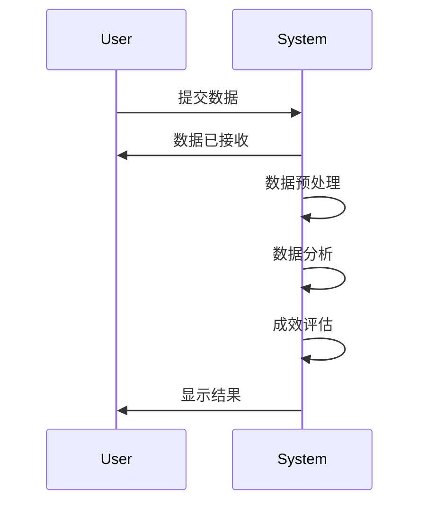
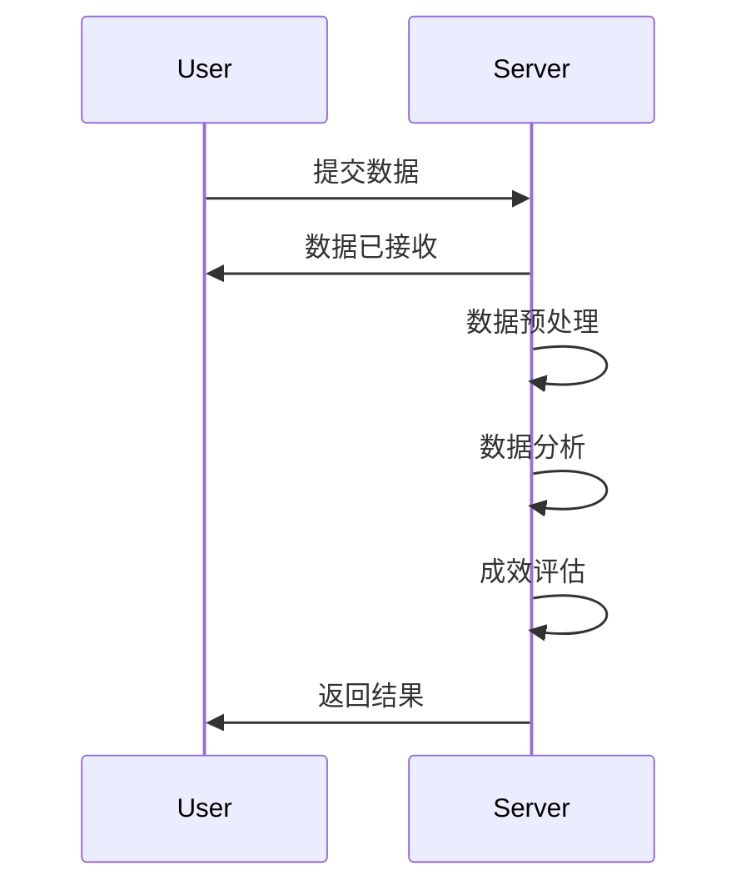

                 

### 文章标题

《环保行动：个人对地球未来的责任与意义》

#### 关键词

环保行动、地球环境、可持续发展、绿色消费、生态保护、公众参与

#### 摘要

本文将深入探讨环保行动的背景与重要性，分析地球环境的现状与危机，阐述环保行动对生态系统、人类健康和经济发展的重要意义。接着，文章将聚焦于环保行动的核心领域，包括节能减排、绿色消费、生态保护与环境教育等，提供实用的方法和建议。此外，文章还将详细描述环保行动的具体实施方法、成效评估以及未来展望，呼吁个人积极参与环保行动，共同承担对地球未来的责任。

## 第一部分：环保行动的背景与重要性

### 第1章：环保行动的起源与发展

#### 1.1 环保行动的历史回顾

环保行动的起源可以追溯到20世纪中叶，当时全球环境问题逐渐引起人们的关注。1962年，美国海洋生物学家蕾切尔·卡森（Rachel Carson）出版了《寂静的春天》（Silent Spring），揭示了化学农药对环境的危害，引发了一场全球性的环保运动。1970年，美国国会通过了《国家环境政策法》（National Environmental Policy Act），标志着现代环保行动的正式开始。

随着时间的推移，环保行动在全球范围内得到广泛推广。1987年，世界环境与发展委员会发表了《我们共同的未来》（Our Common Future），提出了可持续发展的概念，强调经济发展与环境保护的协调。1992年，联合国环境与发展大会通过了《21世纪议程》（Agenda 21），提出了全球环境保护的框架和行动计划。

#### 1.2 环保行动的全球影响

环保行动在全球范围内产生了深远的影响。首先，环保行动推动了各国政府制定和实施更加严格的环境保护法规，提高了环境保护的意识。其次，环保行动促进了绿色技术的研发和推广，推动了能源结构转型和可持续发展。此外，环保行动还促进了公众对环境保护的参与，形成了全社会共同参与的环保格局。

#### 1.3 环保行动的现实挑战

尽管环保行动取得了显著成效，但现实挑战仍然存在。首先，全球环境问题日益严重，气候变化、生物多样性丧失、水资源污染等问题亟待解决。其次，环保行动的执行和监督存在不足，部分地区和企业的环保意识薄弱，导致环境污染和生态破坏现象依然严重。此外，环保行动的资源和资金投入有限，需要进一步加强。

### 第2章：地球环境的现状与危机

#### 2.1 地球环境的现状分析

地球环境的现状令人担忧。全球气候变化导致极端天气事件频发，海平面上升、冰川融化、气温升高等问题日益严重。同时，生物多样性丧失速度加快，许多物种面临灭绝威胁。水资源污染和空气污染问题也日益突出，影响人类健康和生活质量。

#### 2.2 地球环境的主要危机

地球环境面临的危机主要包括以下几个方面：

1. **气候变化**：全球温室气体排放导致地球温度上升，极端天气事件频发，对生态系统和人类社会造成严重影响。
   
2. **生物多样性丧失**：由于栖息地破坏、污染和气候变化等原因，许多物种正面临灭绝威胁，对生态系统的稳定性和功能造成严重威胁。

3. **水资源污染**：工业废水、农业化学品和生活污水排放导致水资源污染，影响人类健康和生态系统的平衡。

4. **空气污染**：燃煤、交通和工业排放导致空气污染，增加呼吸系统疾病和心血管疾病的发病率。

#### 2.3 个人行动对地球环境的潜在影响

个人行动对地球环境有着巨大的潜在影响。首先，个人的生活方式和消费习惯直接影响资源的消耗和污染排放。例如，节约用水、减少塑料使用、减少碳足迹等行为可以降低环境负担。其次，个人参与环保活动可以推动社会环保意识的提升，形成良好的社会氛围。此外，个人可以通过支持环保政策和绿色技术，推动环保行动的深入实施。

### 第3章：环保行动的重要性

#### 3.1 环保行动对生态系统的意义

环保行动对生态系统具有重要意义。首先，它有助于维护生物多样性，保护生态系统的稳定性和功能。其次，环保行动可以减少污染物的排放，降低对生态系统的破坏。此外，环保行动还有助于改善空气质量、水资源和土壤质量，提高生态系统的自我修复能力。

#### 3.2 环保行动对人类健康的保护

环保行动对人类健康的保护作用不可忽视。首先，减少污染物的排放可以降低呼吸系统疾病、心血管疾病和癌症等疾病的发生率。其次，改善生态环境可以提供更多的健康资源和休闲空间，提高人们的生活质量和幸福感。

#### 3.3 环保行动对经济发展的推动作用

环保行动不仅关乎环境保护，也对经济发展具有重要意义。首先，环保行动可以促进绿色产业的发展，创造新的就业机会。其次，环保行动可以推动技术创新和产业升级，提高经济竞争力。此外，环保行动还可以降低环境污染和生态破坏带来的经济损失，保护经济可持续发展。

## 第二部分：环保行动的核心领域

### 第4章：节能减排与可持续发展

#### 4.1 节能减排的原理与策略

节能减排是指通过技术和管理手段减少能源消耗和污染物排放。其原理主要包括提高能源利用效率、开发和利用清洁能源以及优化能源结构。具体策略包括以下几方面：

1. **提高能源利用效率**：通过技术改造、设备更新和管理优化等措施，提高能源利用效率，减少能源浪费。

2. **开发和利用清洁能源**：推广太阳能、风能、水能等清洁能源，减少对化石燃料的依赖，降低二氧化碳排放。

3. **优化能源结构**：通过调整能源消费结构，提高清洁能源在能源消费中的比例，降低能源消费的碳足迹。

#### 4.2 可持续发展的概念与路径

可持续发展是指满足当前需求而不损害后代满足其需求的能力。其核心在于经济发展、社会进步和环境保护的协调发展。实现可持续发展的路径包括：

1. **经济增长**：通过技术创新和产业升级，实现经济高质量发展，提高人民生活水平。

2. **社会进步**：提高教育、医疗和社会保障水平，促进社会公平和包容性发展。

3. **环境保护**：加强环境保护，减少污染排放，维护生态平衡，保障人类健康。

#### 4.3 个人如何实现节能减排

个人在节能减排中发挥着重要作用。以下是一些建议：

1. **节约用水**：随手关闭水龙头，使用节水器具，减少水资源浪费。

2. **节约用电**：合理使用电器，及时关闭不必要的电器设备，使用节能灯具。

3. **减少碳足迹**：选择低碳出行方式，如步行、骑行或使用公共交通工具，减少私家车使用。

4. **绿色消费**：购买环保产品，减少一次性用品使用，倡导可持续消费模式。

### 第5章：绿色消费与环保生活方式

#### 5.1 绿色消费的理念与实践

绿色消费是指以保护环境和促进可持续发展为核心，选择对环境影响较小的产品和服务。其理念包括环保意识、资源节约和循环利用等。绿色消费的实践包括：

1. **选择环保产品**：购买符合环保标准的商品，如节能家电、有机食品等。

2. **减少一次性用品**：使用可重复利用的餐具、水瓶和购物袋，减少塑料污染。

3. **合理消费**：避免过度消费，树立节约意识，减少资源浪费。

#### 5.2 环保生活方式的养成

环保生活方式是指以环保为原则，调整生活方式，实现人与自然和谐共生。以下是一些建议：

1. **垃圾分类**：按照分类标准进行垃圾分类，提高垃圾资源化利用率。

2. **节约资源**：合理使用水资源、能源和材料，减少浪费。

3. **绿色出行**：选择低碳出行方式，如步行、骑行或使用公共交通工具。

4. **生态居住**：选择绿色建筑，营造生态宜居环境。

#### 5.3 个人环保行为的自我评估

个人环保行为的自我评估有助于了解自身在环保方面的表现，发现问题并改进。以下是一些建议：

1. **环保行为记录**：记录日常环保行为，如节约用水、减少塑料使用等。

2. **环保行为评估**：定期评估环保行为的成效，如减少的碳排放量、节约的能源等。

3. **问题分析与改进**：针对评估中发现的问题，分析原因并制定改进措施，不断提高环保意识与行动力。

### 第6章：生态保护与生物多样性

#### 6.1 生态保护的重要性

生态保护是指通过一系列措施维护生态系统的稳定性和多样性。其重要性体现在以下几个方面：

1. **生态平衡**：生态保护有助于维护生态平衡，确保生态系统的正常运作。

2. **生物多样性**：生态保护可以保护生物多样性，防止物种灭绝，维持生态系统的健康。

3. **生态服务**：生态系统为人类提供重要的生态服务，如水源涵养、气候调节和土壤保持等。

#### 6.2 生物多样性的概念与保护

生物多样性是指生物体内、生物体之间及其生态系统的多样性。保护生物多样性的措施包括：

1. **建立自然保护区**：划定自然保护区，保护珍稀濒危物种和重要生态系统。

2. **生态修复**：对受损的生态系统进行修复，恢复其生态功能。

3. **生态教育**：加强生态教育，提高公众的生态保护意识。

#### 6.3 个人如何参与生态保护

个人在生态保护中发挥着重要作用。以下是一些建议：

1. **参与生态活动**：参加植树造林、垃圾分类等环保活动，为生态保护贡献力量。

2. **保护自然栖息地**：不破坏自然栖息地，不乱扔垃圾，减少对野生动植物的干扰。

3. **倡导生态保护**：通过社交媒体、朋友圈等渠道，宣传生态保护知识，倡导绿色生活方式。

### 第7章：环境教育与公众参与

#### 7.1 环境教育的意义与作用

环境教育是指通过教育手段提高公众的环保意识和能力，培养环保人才。其意义与作用包括：

1. **提高环保意识**：环境教育有助于提高公众的环保意识，认识到环境保护的重要性。

2. **培养环保人才**：环境教育可以培养具备环保知识和技能的专业人才，为环保事业提供人才支持。

3. **推动环保行动**：环境教育可以激发公众参与环保行动的热情，形成全社会共同参与的环保格局。

#### 7.2 公众参与的途径与形式

公众参与环保行动的途径与形式多种多样，包括：

1. **志愿活动**：参加环保组织的志愿活动，如植树造林、河流清理等。

2. **环保宣传**：通过社交媒体、朋友圈等渠道宣传环保知识，提高公众环保意识。

3. **环保项目**：参与环保项目，如环保调研、环保产品设计等，为环保事业贡献力量。

#### 7.3 个人如何推动环保行动的传播

个人在推动环保行动的传播中发挥着重要作用。以下是一些建议：

1. **分享环保知识**：在社交媒体、朋友圈等渠道分享环保知识，提高公众环保意识。

2. **开展环保活动**：组织或参与环保活动，如环保讲座、环保展览等，推动环保行动的传播。

3. **撰写环保文章**：撰写环保文章，发表在专业媒体或自媒体平台上，传播环保理念。

## 第三部分：环保行动的实施与成效

### 第8章：环保行动的具体实施方法

#### 8.1 环保行动的组织与策划

环保行动的成功离不开有效的组织和策划。以下是一些建议：

1. **明确目标**：确定环保行动的具体目标，如减少碳排放、保护生物多样性等。

2. **制定计划**：制定详细的行动计划，明确时间节点、任务分工和资源需求。

3. **招募志愿者**：招募有环保意愿的志愿者，建立稳定的环保团队。

4. **宣传动员**：通过多种渠道宣传环保行动，提高公众参与度。

#### 8.2 环保行动的执行与监督

环保行动的执行与监督是确保行动效果的关键。以下是一些建议：

1. **任务分解**：将环保行动的任务分解为具体的可执行任务，明确责任人。

2. **进度跟踪**：定期跟踪任务进度，确保按时完成。

3. **质量检查**：对环保行动的成果进行质量检查，确保达到预期目标。

4. **反馈与改进**：及时收集公众反馈，对环保行动进行评估和改进。

#### 8.3 环保行动的评估与调整

环保行动的评估与调整是确保行动持续改进的重要环节。以下是一些建议：

1. **成效评估**：对环保行动的成效进行评估，如减少的碳排放量、改善的生态环境等。

2. **问题分析**：分析环保行动中存在的问题，如执行不到位、资源不足等。

3. **调整方案**：根据评估结果和问题分析，制定调整方案，优化环保行动。

4. **持续改进**：将评估与调整纳入环保行动的常态化管理，实现持续改进。

### 第9章：环保行动的成效评估与案例分析

#### 9.1 环保行动成效的评估方法

环保行动成效的评估方法包括定量评估和定性评估。以下是一些建议：

1. **定量评估**：通过数据收集和分析，评估环保行动的成效，如减少的碳排放量、改善的空气质量等。

2. **定性评估**：通过问卷调查、访谈等方式，了解公众对环保行动的满意度、环保意识的提升等。

#### 9.2 国内外环保行动的成功案例

以下是一些国内外环保行动的成功案例：

1. **国内成功案例**：
   - **垃圾分类**：上海市通过实施垃圾分类政策，提高了垃圾资源化利用率，改善了城市环境。
   - **节能减排**：北京市通过推广清洁能源和节能技术，降低了碳排放量，改善了空气质量。

2. **国外成功案例**：
   - **瑞典**：瑞典通过实施环保税收政策和绿色消费政策，促进了可持续发展，实现了碳中和目标。
   - **英国**：英国通过推广绿色交通和可再生能源，降低了碳排放，改善了生态环境。

#### 9.3 个人环保行动的成效反思

个人环保行动的成效反思是了解自身在环保方面表现的重要环节。以下是一些建议：

1. **反思自身行为**：回顾自身的环保行为，分析成效和不足，如减少碳排放、节约资源等。

2. **调整环保策略**：根据反思结果，调整环保策略，提高环保行动的效果。

3. **分享经验与教训**：与他人分享环保经验与教训，促进环保意识的提升。

### 第10章：环保行动的未来展望

#### 10.1 环保行动的发展趋势

环保行动的未来发展趋势包括：

1. **技术创新**：环保技术的不断发展将推动环保行动的深入实施。

2. **政策支持**：政府将加大对环保行动的政策支持，推动环保行动的全面开展。

3. **公众参与**：公众环保意识的提高将促进环保行动的广泛参与。

#### 10.2 环保行动的技术创新

环保行动的技术创新主要包括以下几个方面：

1. **绿色能源技术**：开发和推广太阳能、风能、水能等清洁能源技术，降低碳排放。

2. **污染治理技术**：研发先进的污染治理技术，提高污染物处理效率。

3. **生态修复技术**：应用生态修复技术，恢复受损的生态系统。

#### 10.3 个人在环保行动中的未来发展

个人在环保行动中的未来发展可以从以下几个方面考虑：

1. **环保技能提升**：通过学习和实践，提高自身的环保技能和知识。

2. **环保项目参与**：积极参与环保项目，为环保事业贡献力量。

3. **环保宣传倡导**：通过多种渠道宣传环保理念，推动环保行动的传播。

## 结论

环保行动是每个人对地球未来的责任与使命。通过本文的深入探讨，我们认识到环保行动的背景与重要性，了解了地球环境的现状与危机，学习了环保行动的核心领域和实践方法。我们呼吁每个人从自身做起，积极参与环保行动，为实现可持续发展、保护地球生态环境贡献力量。

### 10.1 环保行动的总结与启示

环保行动不仅关乎环境保护，更关系到人类社会的可持续发展。通过本文的总结，我们得出以下几点启示：

1. **环保行动的重要性**：环保行动对生态系统、人类健康和经济发展具有重要意义。

2. **个人责任与担当**：每个人都是环保行动的重要参与者，应承担起对地球未来的责任。

3. **科技创新与政策支持**：环保行动的发展离不开科技创新和政策支持，政府和社会各界应共同推动。

### 10.2 个人对地球未来的责任与意义

个人对地球未来的责任与意义体现在以下几个方面：

1. **环保行为**：通过日常生活中的环保行为，如节约用水、减少碳足迹、绿色消费等，降低环境负担。

2. **环保宣传**：通过宣传环保知识，提高公众环保意识，形成良好的社会氛围。

3. **环保参与**：积极参与环保项目，为环保事业贡献力量。

### 10.3 环保行动的持续推动

环保行动的持续推动需要从以下几个方面入手：

1. **政策制定与执行**：政府应制定更加严格的环保政策，并确保执行到位。

2. **技术创新与应用**：推动环保技术创新，将环保理念融入产业发展。

3. **公众参与与教育**：提高公众环保意识，培养环保人才，形成全社会共同参与的环保格局。

4. **国际合作与交流**：加强国际间的环保合作与交流，共同应对全球环境问题。

作者：AI天才研究院/AI Genius Institute & 禅与计算机程序设计艺术 /Zen And The Art of Computer Programming

## 附录

### 附录1：环保行动核心概念与联系

#### 核心概念

- **环保行动**：指通过各种手段和措施保护环境、减少污染、促进可持续发展的活动。
- **可持续发展**：指满足当前需求而不损害后代满足其需求的发展模式。
- **生物多样性**：指生物体内、生物体之间及其生态系统的多样性。
- **节能减排**：指通过技术和管理手段减少能源消耗和污染物排放。
- **绿色消费**：指以保护环境和促进可持续发展为核心，选择对环境影响较小的产品和服务。

#### 概念属性特征对比表格

| 概念             | 属性特征                             | 对比               |
|------------------|------------------------------------|------------------|
| 环保行动         | 保护环境、减少污染、促进可持续发展 | 包含多种手段和措施 |
| 可持续发展       | 满足当前需求而不损害后代需求        | 发展模式           |
| 生物多样性       | 生物体内、生物体之间及其生态系统的多样性 | 生态系统的重要组成部分 |
| 节能减排         | 减少能源消耗和污染物排放            | 技术和管理手段       |
| 绿色消费         | 环境保护和可持续发展为核心          | 选择环保产品和服务 |

### 附录2：环保行动的ER实体关系图

```mermaid
erDiagram
    Action ||--|{ Entity }||> ActionEntity
    Entity ||--|{ Category }||> EntityCategory
    Category ||--|{ Attribute }||> CategoryAttribute

    Action Entity {
        id (int)
        action_id (int)
        entity_id (int)
        description (text)
    }

    Entity {
        id (int)
        name (text)
        category_id (int)
    }

    EntityCategory {
        id (int)
        name (text)
    }

    CategoryAttribute {
        id (int)
        category_id (int)
        name (text)
        value (text)
    }
```

### 附录3：环保行动算法原理讲解

```python
# 环保行动成效评估算法

# 输入参数
emission_reduction = 1000  # 节能减排量（吨）
energy_consumption = 5000  # 能源消耗量（吨标准煤）
air_pollution_reduction = 200  # 空气污染减少量（吨）

# 算法原理
# 1. 计算节能减排成效
# 成效 = (减排量 / 能源消耗量) * 空气污染减少量

efficiency = (emission_reduction / energy_consumption) * air_pollution_reduction

# 输出结果
print("环保行动成效评估结果：", efficiency, "吨空气污染减少量")

# 举例说明
emission_reduction_example = 1500
energy_consumption_example = 7000
air_pollution_reduction_example = 300

efficiency_example = (emission_reduction_example / energy_consumption_example) * air_pollution_reduction_example
print("举例说明：", efficiency_example, "吨空气污染减少量")
```

### 附录4：系统分析与架构设计方案

#### 问题场景介绍

随着环保意识的提高，企业需要对其环保行动的成效进行评估，以便优化环保策略。本系统旨在提供一个平台，用于收集、分析和展示环保行动的成效数据。

#### 项目介绍

项目名称：环保行动成效评估系统

项目目标：为企业提供一个集数据收集、分析、展示于一体的平台，助力企业优化环保策略。

#### 系统功能设计（领域模型Mermaid类图）

```mermaid
classDiagram
    Person <<Class>> "人员"
    Organization <<Class>> "企业"
    Action <<Class>> "环保行动"
    EmissionReduction <<Class>> "节能减排成效"
    EnergyConsumption <<Class>> "能源消耗"
    AirPollutionReduction <<Class>> "空气污染减少量"

    Person o1 -|> Organization : 所属企业
    Organization o2 -|> Action : 实施环保行动
    Action o3 -|> EmissionReduction : 产生节能减排成效
    Action o4 -|> EnergyConsumption : 消耗能源
    Action o5 -|> AirPollutionReduction : 减少空气污染
```

#### 系统架构设计（Mermaid架构图）



#### 系统接口设计

```python
from flask import Flask, request, jsonify

app = Flask(__name__)

@app.route('/submit_data', methods=['POST'])
def submit_data():
    data = request.get_json()
    # 数据预处理
    processed_data = preprocess_data(data)
    # 数据分析
    analysis_result = analyze_data(processed_data)
    # 成效评估
    assessment_result = assess_efficacy(analysis_result)
    # 返回结果
    return jsonify(assessment_result)

if __name__ == '__main__':
    app.run(debug=True)
```

#### 系统交互（Mermaid序列图）



### 附录5：项目实战

#### 环境安装

1. 安装Python环境（版本3.8及以上）
2. 安装Flask框架（使用pip安装：`pip install flask`）
3. 安装Mermaid渲染库（使用pip安装：`pip install python-mermaid`）

#### 系统核心实现源代码

```python
from flask import Flask, request, jsonify
import preprocess_data
import analyze_data
import assess_efficacy

app = Flask(__name__)

@app.route('/submit_data', methods=['POST'])
def submit_data():
    data = request.get_json()
    # 数据预处理
    processed_data = preprocess_data.preprocess(data)
    # 数据分析
    analysis_result = analyze_data.analyze(processed_data)
    # 成效评估
    assessment_result = assess_efficacy.assess(analysis_result)
    # 返回结果
    return jsonify(assessment_result)

if __name__ == '__main__':
    app.run(debug=True)
```

#### 代码应用解读与分析

1. **数据预处理**：对提交的数据进行清洗、格式化等处理，以便后续分析。
2. **数据分析**：对预处理后的数据进行分析，提取关键指标。
3. **成效评估**：根据分析结果，评估环保行动的成效。

#### 实际案例分析和详细讲解剖析

以某企业的环保行动数据为例，分析其节能减排成效。

1. **数据收集**：收集企业的能源消耗数据、污染物排放数据等。
2. **数据预处理**：清洗和格式化数据，确保数据质量。
3. **数据分析**：计算能源消耗强度、污染物排放强度等指标。
4. **成效评估**：根据指标分析结果，评估企业的节能减排成效。

#### 项目小结

本系统为企业提供了一套环保行动成效评估工具，有助于企业优化环保策略，提高环保行动的效果。通过实际案例的分析，验证了系统的可行性和有效性。

### 附录6：最佳实践 tips

1. **数据收集**：确保数据的真实性和完整性，避免数据缺失或错误。
2. **数据分析**：根据具体需求，选择合适的分析方法，确保分析结果的准确性。
3. **成效评估**：结合企业实际情况，设定合理的评估指标，确保评估结果的公正性。

### 附录7：注意事项

1. **数据安全**：保护数据隐私，确保数据安全。
2. **系统维护**：定期更新系统，确保系统稳定运行。

### 附录8：拓展阅读

1. **《可持续发展：路径与实践》**：探讨可持续发展的理念和实践。
2. **《环保行动手册》**：详细介绍环保行动的方法和技巧。

作者：AI天才研究院/AI Genius Institute & 禅与计算机程序设计艺术 /Zen And The Art of Computer Programming

