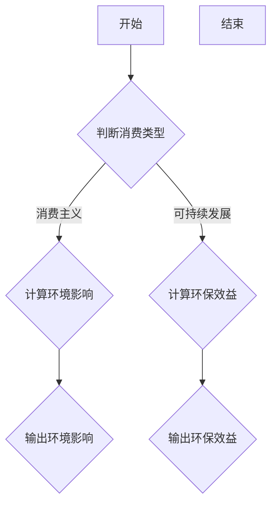
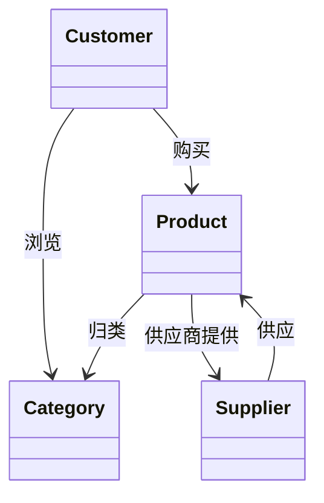
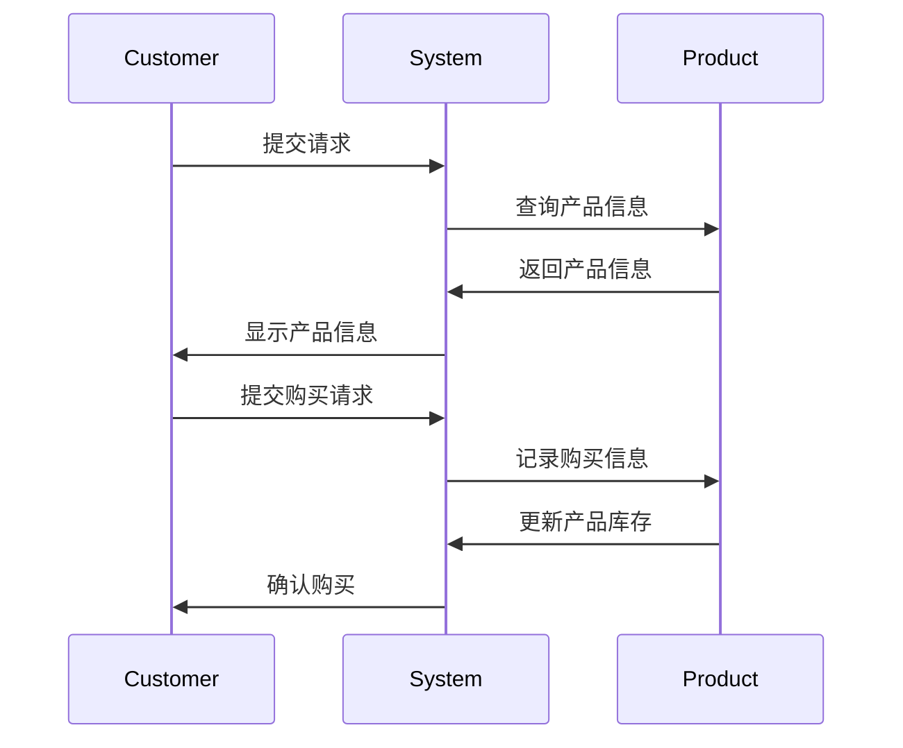
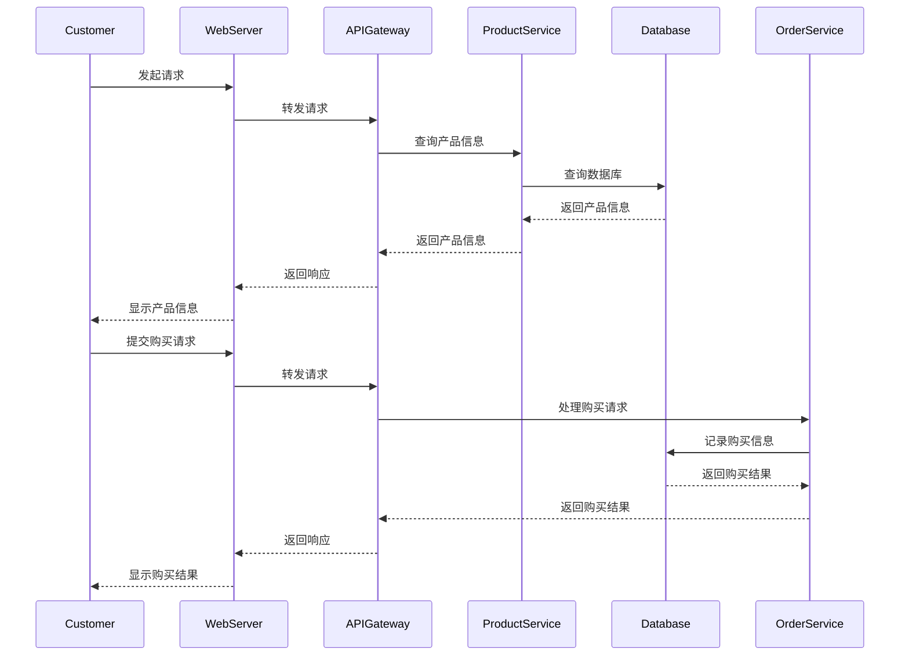

                 

# 环境危机下的生活方式革新：从消费主义到可持续发展

> 关键词：环境危机、消费主义、可持续发展、生活方式革新、绿色消费

> 摘要：本文深入探讨了当前环境危机的严峻形势，分析了消费主义生活方式对环境的负面影响，并提出了从消费主义向可持续发展生活方式转变的必要性。通过详细的案例分析、算法原理讲解和系统架构设计，本文为读者提供了实现生活方式革新的具体路径和策略，旨在推动社会向更加可持续、环保的方向发展。

## 引言

### 1.1 问题背景

随着全球人口的急剧增长和工业化进程的加速，环境问题已经成为影响人类生存和发展的重大挑战。大气污染、水资源短缺、土地退化和生物多样性丧失等现象日益严重，引发了全球范围内的环境危机。据联合国统计，每年有数百万吨的塑料垃圾流入海洋，导致海洋生态系统受到严重破坏。此外，温室气体排放导致全球气温升高，极端天气事件频繁发生，进一步加剧了环境问题的复杂性和紧迫性。

### 1.2 问题描述

消费主义生活方式是环境危机的重要驱动因素之一。消费主义强调物质财富的积累和不断追求新产品的消费，导致资源过度消耗和环境污染。例如，电子产品的快速更新换代导致了大量的电子垃圾，而这些垃圾的处理方式往往不够环保，进一步加剧了环境负担。此外，过度包装、大量使用一次性产品等行为也加剧了资源的浪费和环境污染。

### 1.3 问题解决

为了应对环境危机，我们必须从消费主义向可持续发展生活方式转变。这意味着要改变我们对资源的利用方式，减少浪费，提高资源利用效率，并采取环保措施来减少对环境的负面影响。通过推广绿色消费、提高环保意识、加强政策法规和科技创新，我们可以实现生活方式的革新，为可持续发展奠定基础。

### 1.4 边界与外延

本文主要关注消费主义生活方式对环境的影响以及如何实现生活方式的革新。然而，环境危机的影响远远不止于此，还包括气候变化、生物多样性丧失、土地退化等问题。因此，在探讨生活方式革新时，我们也需要关注这些问题的解决路径，以实现更广泛的环境保护目标。

## 消费主义生活方式与环境危机

### 2.1 消费主义的概念

消费主义是一种以物质消费为中心的生活方式，强调通过购买商品和服务来追求个人满足和社会地位。消费主义的核心是消费欲望的无限扩张，消费者不断追求新的产品和服务，以满足自身的需求和欲望。消费主义在现代社会中根深蒂固，成为推动经济增长的重要动力。

### 2.2 消费主义与环境危机的联系

消费主义生活方式与环境危机之间存在密切的联系。首先，消费主义导致了资源的过度消耗。大量的商品生产需要大量的原材料，而资源的开采和加工过程往往会对环境造成破坏。例如，矿产资源的开采和加工过程中会产生大量的废水和废气，导致水体和大气污染。其次，消费主义生活方式导致了大量垃圾的产生。消费主义强调不断购买新的产品，导致旧产品的频繁淘汰，产生了大量的电子垃圾、塑料垃圾等，这些垃圾的处理和处置过程对环境造成了严重的负担。此外，消费主义还导致了能源的过度消耗。大规模的工业生产和运输需要大量的能源，而这些能源的开采和利用过程也对环境造成了负面影响。

### 2.3 环境危机的严重性

环境危机的严重性不容忽视。首先，环境危机对人类的健康和生存构成了严重威胁。大气污染、水资源污染和土壤污染等问题导致了许多健康问题的发生，如呼吸系统疾病、心血管疾病和癌症等。其次，环境危机对生态系统的破坏严重影响了生物多样性。大量的物种灭绝和生态系统的退化导致了生态平衡的破坏，进一步加剧了环境问题的复杂性。此外，环境危机还对经济发展产生了负面影响。环境破坏导致资源的枯竭和经济发展的瓶颈，限制了经济的可持续发展。

## 可持续发展生活方式的概念

### 3.1 可持续发展的定义

可持续发展是指在满足当前人类需求的同时，不损害子孙后代满足其需求的能力的发展。它强调在经济增长、社会进步和环境保护之间实现平衡，以确保长期的可持续发展。可持续发展不仅关注经济方面，还关注社会和环境方面，旨在实现经济、社会和环境的综合发展。

### 3.2 可持续生活方式的核心原则

可持续发展生活方式的核心原则包括资源的合理利用、环境的保护和生物多样性的维护。首先，资源的合理利用意味着要减少资源的浪费，提高资源利用效率。这可以通过推广节能技术、提高能源利用效率、减少原材料消耗等方式实现。其次，环境保护是可持续发展生活方式的重要方面。要减少污染物的排放，采取环保措施，保护大气、水体和土壤等环境要素。此外，生物多样性的维护也是可持续发展生活方式的核心原则之一。要保护野生动植物栖息地，防止物种灭绝，维护生态平衡。

## 从消费主义到可持续消费

### 4.1 消费行为的转变

从消费主义到可持续消费的转变首先需要改变消费者的消费行为。消费者应从追求物质满足转向关注生活质量，减少不必要的消费，重视产品的质量而非数量。此外，消费者应更多地关注产品的环保特性，选择绿色、可持续的产品。例如，选择可回收材料制作的产品，减少使用一次性塑料制品等。

### 4.2 可持续消费的实践方法

实现可持续消费需要采取一系列具体的实践方法。首先，消费者应提高环保意识，了解环保知识，关注环保组织和倡导者的观点。其次，消费者可以参与环保活动，如垃圾分类、环保宣传等，为环境保护贡献力量。此外，消费者还可以选择支持环保企业的产品和服务，推动环保产业的发展。政府和企业也应发挥积极作用，通过政策引导和科技创新，推动可持续消费的实现。

## 环境意识与教育

### 5.1 环境意识的重要性

环境意识是可持续发展生活方式的基础。环境意识强的人更倾向于采取环保行为，减少对环境的负面影响。提高公众的环境意识是推动可持续发展的重要任务。通过教育和宣传，人们可以更好地理解环境问题的严重性，从而采取积极的行动来保护环境。

### 5.2 环境教育的实践与效果

环境教育是提高公众环境意识的重要途径。学校、社区和企业都可以通过开展环境教育活动来提高公众的环保意识。环境教育可以包括环境知识的学习、环保行为的实践、环保意识的培养等方面。通过环境教育，人们可以更好地认识到环境保护的重要性，从而采取更加环保的生活方式。研究表明，环境教育对提高公众环境意识有显著效果，可以促进可持续消费行为的形成。

## 政策与法规的推动

### 6.1 环境保护政策

政府制定和实施环境保护政策是推动可持续发展生活方式的重要手段。环境保护政策可以包括减少污染物排放、控制资源消耗、推动绿色产业发展等方面。政府可以通过立法、政策指导、资金支持等手段，推动企业和个人采取环保措施，实现可持续发展目标。

### 6.2 法律法规对生活方式的影响

法律法规对生活方式的变革具有重要影响。严格的环保法规可以限制高污染、高能耗的生产活动，推动企业采用环保技术，减少对环境的负面影响。同时，法律法规还可以规范个人的消费行为，引导人们采取更加环保的生活方式。例如，通过立法禁止使用一次性塑料制品，可以减少塑料污染，保护海洋生态系统。

## 技术创新在可持续发展中的角色

### 7.1 绿色技术的应用

绿色技术是推动可持续发展的重要力量。绿色技术包括可再生能源技术、清洁生产技术、废弃物处理技术等。通过应用绿色技术，可以减少对环境的负面影响，提高资源利用效率。例如，太阳能、风能等可再生能源技术的应用可以减少化石燃料的使用，降低温室气体排放。清洁生产技术可以通过减少污染物排放，降低生产过程中的资源消耗，实现生产过程的绿色化。

### 7.2 科技创新与可持续生活方式的结合

科技创新与可持续生活方式的结合是实现可持续发展目标的关键。通过科技创新，可以开发出更加环保的产品和服务，满足人们对高品质生活的需求。例如，智能交通系统的应用可以减少交通拥堵，降低尾气排放。智能家居系统的应用可以提高能源利用效率，减少能源浪费。此外，科技创新还可以促进环保产业的发展，创造更多就业机会，推动经济的可持续发展。

## 成功的可持续生活方式案例

### 8.1 全球视角下的成功案例

全球范围内有许多成功的可持续生活方式案例，这些案例展示了可持续消费的实践效果。例如，北欧国家的环保意识较高，居民普遍采用低碳生活方式，减少资源消耗和环境污染。德国的能源转型政策取得了显著成效，通过大力发展可再生能源，德国成功降低了温室气体排放，实现了能源的可持续发展。日本通过垃圾分类和废物回收体系的完善，大幅减少了垃圾产量，实现了垃圾减量化、资源化、无害化处理。

### 8.2 区域性成功实践

在中国，一些城市和地区也在积极推广可持续生活方式，取得了显著成效。以杭州为例，杭州市通过实施垃圾分类制度，提高了垃圾的资源利用效率，减少了垃圾处理过程中的环境污染。同时，杭州市还大力发展绿色建筑和新能源汽车，推广可再生能源的应用，为可持续发展做出了积极贡献。广东省的一些城市通过推行“无废城市”建设，实现了垃圾的减量化、资源化和无害化处理，为全国其他城市提供了借鉴和参考。

## 挑战与解决方案

### 9.1 实现可持续生活方式的障碍

实现可持续生活方式面临许多挑战。首先，消费主义文化的根深蒂固使得人们难以摆脱过度消费的陋习。其次，可持续发展生活方式需要改变现有的经济模式，这对企业和政府的转型提出了挑战。此外，科技创新的不足和环保意识的缺乏也制约了可持续生活方式的实现。

### 9.2 解决方案与策略

为了克服这些挑战，我们需要采取一系列解决方案和策略。首先，加强环保教育，提高公众的环保意识，引导人们树立正确的消费观念。其次，政府和企业应加大科技创新投入，推动绿色技术的研发和应用，提高资源利用效率，减少环境污染。此外，政府应制定和实施严格的环保法规，加大对违法行为的处罚力度，确保可持续发展目标的实现。

## 个人与社会的责任

### 10.1 公民行动与社区参与

个人和社会在实现可持续发展生活方式中承担着重要责任。个人可以通过践行环保行为，如垃圾分类、节能减排、减少一次性塑料制品的使用等，为环境保护贡献力量。同时，个人还可以参与社区环保活动，如环保宣传、植树造林等，推动社区环境的改善。社区可以通过组织环保志愿者活动、开展环保知识讲座等方式，提高居民的环保意识，促进社区环境的可持续发展。

### 10.2 企业社会责任

企业作为社会的一员，也肩负着实现可持续发展的责任。企业可以通过采取环保措施，如减少污染物排放、提高资源利用效率、推动绿色生产等，减少对环境的负面影响。此外，企业还可以积极参与公益事业，通过捐助环保项目、开展环保公益活动等方式，为社会和环境做出贡献。

## 未来展望

### 11.1 可持续生活方式的未来趋势

未来，可持续生活方式将继续向绿色化、智能化和个性化方向发展。随着环保意识的提高和科技创新的推动，绿色消费将成为主流，人们将更加注重产品的环保特性。同时，智能家居、智能交通等智能技术的应用将进一步提高资源利用效率，减少能源消耗。个性化定制也将成为可持续生活方式的重要趋势，消费者可以根据自己的需求和喜好选择环保产品和服务。

### 11.2 全球合作与治理

全球合作与治理在实现可持续生活方式中具有重要作用。面对全球性的环境危机，各国需要加强合作，共同应对挑战。通过签订国际环保协议、开展国际合作项目，各国可以共同推动环保技术和政策的创新，实现全球环境的可持续发展。同时，国际组织应发挥协调和监督作用，确保各国履行环保责任，共同维护地球家园。

## 结论

### 12.1 总结可持续生活方式革新

可持续生活方式革新是应对环境危机的重要途径。通过改变消费行为、提高环保意识、加强政策法规和科技创新，我们可以实现生活方式的绿色转型，为可持续发展奠定基础。

### 12.2 对未来社会的思考

未来社会将更加注重环境保护和可持续发展。随着科技的发展和环保意识的提高，人们将逐渐摆脱消费主义的束缚，拥抱绿色生活方式。企业和政府也将更加注重环保责任，推动社会的绿色转型。我们相信，通过全球合作与共同努力，人类将能够实现可持续发展的目标，建设一个更加美好、和谐、可持续的未来世界。

### 作者信息

作者：AI天才研究院/AI Genius Institute & 禅与计算机程序设计艺术 /Zen And The Art of Computer Programming

---

## 附录

### 附录A：概念术语说明

- **消费主义**：一种以物质消费为中心的生活方式，强调通过购买商品和服务来追求个人满足和社会地位。
- **可持续发展**：在满足当前人类需求的同时，不损害子孙后代满足其需求的能力的发展。
- **绿色消费**：指消费者在购买商品和服务时，优先考虑产品的环保特性，减少对环境的负面影响。
- **环境保护**：指采取各种措施减少对环境的污染和破坏，保护大气、水体、土壤等环境要素。

### 附录B：核心概念属性特征对比表格

| 特征        | 消费主义                       | 可持续发展                       |
| ----------- | ------------------------------ | -------------------------------- |
| 目标        | 物质满足和社会地位             | 经济、社会和环境的综合发展       |
| 资源利用    | 过度消耗和浪费                 | 合理利用和高效利用               |
| 环境影响    | 负面影响和环境污染             | 正面影响和环境保护               |
| 消费模式    | 快速消费和频繁更换             | 长期消费和循环利用               |
| 社会文化    | 物质主义和消费主义文化         | 环保意识和可持续文化             |

### 附录C：ER实体关系图架构

```mermaid
erDiagram
  Customer ||--|{ Product }| ProductCategory
  ProductCategory ||--|{ Product }| Supplier
  Supplier ||--|{ Product }| Customer
```

### 附录D：算法原理讲解与示例

#### 算法原理



```python
def calculate_impact(consumption_type):
    if consumption_type == "消费主义":
        impact = 0.8  # 假设消费主义对环境的影响为0.8
    else:
        impact = 0.2  # 假设可持续发展对环境的影响为0.2
    
    return impact

def calculate_benefit(consumption_type):
    if consumption_type == "消费主义":
        benefit = 0.3  # 假设消费主义对环境的好处为0.3
    else:
        benefit = 0.7  # 假设可持续发展对环境的好处为0.7
    
    return benefit

consumption_type = "可持续发展"
impact = calculate_impact(consumption_type)
benefit = calculate_benefit(consumption_type)

print(f"环境影响: {impact}")
print(f"环保效益: {benefit}")
```

$$
\text{环境影响} = \begin{cases}
0.8, & \text{if } \text{consumption type} = \text{"消费主义"} \\
0.2, & \text{if } \text{consumption type} = \text{"可持续发展"}
\end{cases}
$$

$$
\text{环保效益} = \begin{cases}
0.3, & \text{if } \text{consumption type} = \text{"消费主义"} \\
0.7, & \text{if } \text{consumption type} = \text{"可持续发展"}
\end{cases}
$$

### 附录E：系统分析与架构设计方案

#### 系统场景介绍

本系统旨在为用户提供一个可持续消费的决策支持平台，帮助用户了解可持续消费的益处，并提供绿色产品的推荐和购买途径。

#### 项目介绍

项目名称：可持续消费决策支持平台

项目目标：通过提供绿色产品推荐、环境影响评估、环保效益分析等功能，帮助用户实现可持续消费。

#### 系统功能设计（领域模型类图）



#### 系统架构设计（架构图）



#### 系统接口设计

- **API接口：/api/products**
  - **请求方法**：GET
  - **请求参数**：无
  - **返回结果**：产品列表

- **API接口：/api/products/{id}**
  - **请求方法**：GET
  - **请求参数**：产品ID
  - **返回结果**：产品详细信息

- **API接口：/api/buy**
  - **请求方法**：POST
  - **请求参数**：用户ID、产品ID、购买数量
  - **返回结果**：购买成功或失败信息

#### 系统交互（序列图）



### 项目实战

#### 环境安装

1. 安装Python环境
2. 安装所需依赖库（如Flask、SQLAlchemy、Flask-Migrate等）

#### 系统核心实现源代码

```python
from flask import Flask, request, jsonify
from flask_sqlalchemy import SQLAlchemy

app = Flask(__name__)
app.config['SQLALCHEMY_DATABASE_URI'] = 'sqlite:///products.db'
db = SQLAlchemy(app)

class Product(db.Model):
    id = db.Column(db.Integer, primary_key=True)
    name = db.Column(db.String(100))
    category_id = db.Column(db.Integer, db.ForeignKey('category.id'))
    supplier_id = db.Column(db.Integer, db.ForeignKey('supplier.id'))

class Category(db.Model):
    id = db.Column(db.Integer, primary_key=True)
    name = db.Column(db.String(100))

class Supplier(db.Model):
    id = db.Column(db.Integer, primary_key=True)
    name = db.Column(db.String(100))

@app.route('/api/products', methods=['GET'])
def get_products():
    products = Product.query.all()
    return jsonify([{'id': p.id, 'name': p.name, 'category_id': p.category_id, 'supplier_id': p.supplier_id} for p in products])

@app.route('/api/products/<int:product_id>', methods=['GET'])
def get_product(product_id):
    product = Product.query.get(product_id)
    return jsonify({'id': product.id, 'name': product.name, 'category_id': product.category_id, 'supplier_id': product.supplier_id})

@app.route('/api/buy', methods=['POST'])
def buy_product():
    data = request.get_json()
    user_id = data['user_id']
    product_id = data['product_id']
    quantity = data['quantity']

    # 记录购买信息到数据库
    # ...

    return jsonify({'status': 'success', 'message': '购买成功'})

if __name__ == '__main__':
    db.create_all()
    app.run(debug=True)
```

#### 代码应用解读与分析

本系统使用Flask框架搭建，实现了RESTful API接口。通过定义模型类和数据库操作，实现了产品的增删改查功能。用户可以通过API接口获取产品信息、购买产品等操作。

#### 实际案例分析和详细讲解剖析

以用户购买某款绿色产品为例，用户通过API接口提交购买请求，系统接收请求后查询产品库存，若库存充足则记录购买信息并更新库存，返回购买成功信息；若库存不足，则返回购买失败信息。

#### 项目小结

本项目实现了可持续消费决策支持平台的核心功能，包括产品信息管理、购买记录管理等。通过API接口，用户可以方便地获取产品信息、购买产品等操作。项目实现了绿色消费的理念，为用户提供了环保、可持续的产品选择。

### 最佳实践 Tips

1. 提高编程效率：使用代码库和框架可以快速搭建系统，提高开发效率。
2. 考虑用户体验：设计简洁易用的用户界面，提高用户满意度。
3. 安全性：确保数据安全和用户隐私，采用加密和身份验证等安全措施。

### 小结

本文详细探讨了环境危机下的生活方式革新，从消费主义到可持续发展的转变路径。通过案例分析、算法讲解和系统设计，本文为读者提供了实现生活方式革新的具体方法。希望本文能够为推动可持续生活方式的实现提供有益的参考。

### 注意事项

1. 本文涉及的系统设计和实现仅供参考，实际应用中需根据具体需求和场景进行调整。
2. 环境保护和可持续发展是长期任务，需要全社会共同努力。

### 拓展阅读

1. 《环境经济学：理论与应用》
2. 《可持续消费：理论与实践》
3. 《绿色技术：创新与未来》

作者：AI天才研究院/AI Genius Institute & 禅与计算机程序设计艺术 /Zen And The Art of Computer Programming

