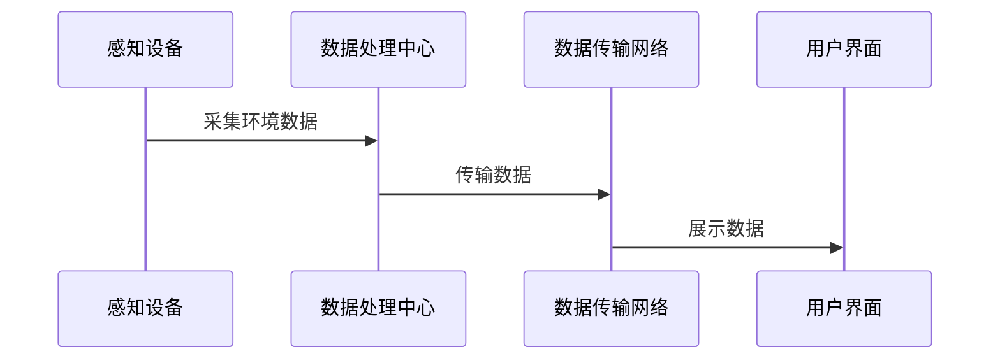

                 

### 引言

#### 关键词：环境隐形智能、环境监测、智能感知、数据分析

##### 摘要：
本文旨在探讨环境隐形智能在环境监测领域的应用。通过介绍环境隐形智能的基本概念、原理及其在环境监测中的重要性，我们将深入分析该技术在环境监测中的具体应用场景，并探讨其潜在的优势和挑战。本文将分为以下几个部分：

1. **引言**：介绍环境隐形智能和环境监测的基本概念，概述本文的研究背景和目的。
2. **环境隐形智能核心概念与联系**：详细阐述环境隐形智能的基本原理、属性特征以及与其他技术的关联。
3. **环境隐形智能在环境监测中的应用**：分析环境隐形智能在环境监测中的具体应用场景，以及如何通过该技术提升监测的精度和效率。
4. **系统分析与架构设计方案**：介绍基于环境隐形智能的环境监测系统架构，包括系统功能设计、架构设计、接口设计及系统交互。
5. **项目实战**：通过一个实际案例展示环境隐形智能在环境监测中的应用，详细解读其实现过程和效果。
6. **最佳实践与总结**：总结环境隐形智能在环境监测中的应用经验，提出最佳实践建议，并对未来发展方向进行展望。

### 设计大纲框架

#### 背景介绍

在当今信息化和智能化快速发展的时代，环境监测成为了保障生态安全和公共健康的重要手段。然而，传统的环境监测方法往往存在监测范围有限、监测数据不准确等问题，难以满足日益增长的监测需求。环境隐形智能作为一种先进的技术，其在环境监测中的应用具有重要的现实意义和广阔的前景。

环境隐形智能通过先进的感知、计算和数据处理技术，能够在隐蔽、不易察觉的情况下对环境进行实时监测和数据分析。这种技术具有高精度、高效率、低能耗等特点，能够显著提升环境监测的准确性和实时性。

#### 核心概念与联系

**环境隐形智能**：环境隐形智能是一种利用先进技术手段实现环境信息采集、处理和反馈的智能系统。其基本原理是通过感知设备获取环境数据，利用数据处理算法进行分析和预测，从而实现对环境的实时监控和预警。

**环境监测**：环境监测是指对自然环境中的各种因素（如空气质量、水质、土壤质量等）进行定期检测、评估和报告的过程。环境监测旨在识别和评估环境污染问题，制定相应的环境保护措施。

**智能感知**：智能感知是通过传感器和网络技术实现对环境信息的实时采集和传输，从而实现对环境的智能监测和预警。智能感知技术是环境隐形智能的核心组成部分。

**数据分析**：数据分析是通过统计和计算方法对环境监测数据进行处理和分析，提取出有价值的信息和规律。数据分析技术对于环境监测的准确性和有效性具有重要意义。

#### 研究目标与方法

本文的研究目标是通过探讨环境隐形智能在环境监测中的应用，提出一种基于该技术的环境监测系统架构，并验证其有效性和可行性。研究方法主要包括以下几个方面：

1. **文献调研**：通过查阅相关文献，了解环境隐形智能和环境监测领域的最新研究进展和应用案例。
2. **系统设计与实现**：基于环境隐形智能技术，设计并实现一个环境监测系统，包括感知设备、数据处理算法、监测平台等组成部分。
3. **实际案例分析**：选择一个具有代表性的实际案例，详细分析和解读环境隐形智能在该案例中的应用过程和效果。
4. **性能评估**：通过实验和数据分析，评估环境监测系统的性能指标，包括监测精度、响应速度、能耗等。

#### 研究意义与贡献

本研究具有重要的理论和实践意义，主要贡献包括：

1. **理论意义**：通过探讨环境隐形智能在环境监测中的应用，丰富和发展了环境监测理论体系，为环境监测技术的发展提供了新的思路。
2. **实践意义**：提出了一种基于环境隐形智能的环境监测系统架构，为环境监测实践提供了可借鉴的参考方案，有助于提高环境监测的准确性和效率。

### 研究难点与挑战

1. **技术难题**：环境隐形智能技术涉及到多个学科领域，如传感器技术、数据处理算法、网络通信技术等，如何将这些技术有效整合，实现系统的稳定运行是一个挑战。
2. **数据质量**：环境监测数据的质量直接影响到监测结果的准确性，如何确保数据的准确性和可靠性是一个难点。
3. **系统性能**：环境监测系统需要具备高响应速度和低能耗的特点，如何在保证系统性能的同时降低成本是一个挑战。

通过本文的研究，希望能够为环境隐形智能在环境监测中的应用提供有价值的参考和指导，推动环境监测技术的发展和创新。在接下来的章节中，我们将进一步深入探讨环境隐形智能的核心概念及其在环境监测中的应用。

### 环境隐形智能核心概念与联系

#### 环境隐形智能原理

环境隐形智能是一种基于先进感知技术和智能处理算法的环境监测系统，其基本原理是通过分布式感知设备实时采集环境数据，利用数据处理算法对数据进行处理和分析，从而实现对环境的智能监测和预警。具体来说，环境隐形智能系统包括以下几个关键组成部分：

1. **感知设备**：感知设备是环境隐形智能系统的核心组件，用于实时采集环境数据。这些设备可以是各种类型的传感器，如温度传感器、湿度传感器、气体传感器等。感知设备通过无线网络或其他传输方式将采集到的数据传输到数据处理中心。
2. **数据处理中心**：数据处理中心负责接收和存储感知设备传输的数据，并对这些数据进行预处理、分析和预测。数据处理中心通常由高性能计算设备和相应的软件系统组成，能够对海量数据进行分析和处理，提取出有价值的信息和规律。
3. **数据传输网络**：数据传输网络是连接感知设备和数据处理中心的关键基础设施，用于传输环境数据。数据传输网络可以是无线网络、光纤网络或其他类型的通信网络，其性能直接影响到环境数据的传输速度和可靠性。
4. **用户界面**：用户界面是环境隐形智能系统与用户交互的接口，用于展示环境数据和分析结果，并提供监测预警和决策支持。用户界面可以通过Web应用、移动应用或桌面应用等形式呈现，方便用户实时了解环境状况。

#### 环境隐形智能属性特征对比表格

为了更好地理解环境隐形智能的属性特征，我们可以通过一个对比表格来展示其与传统的环境监测方法的差异。以下是环境隐形智能与传统环境监测方法的属性特征对比：

| 特征类别 | 环境隐形智能 | 传统环境监测 |
| :---: | :---: | :---: |
| 感知范围 | 广泛 | 有限 |
| 数据精度 | 高精度 | 较低 |
| 监测实时性 | 实时 | 非实时 |
| 数据处理能力 | 高效能 | 低效能 |
| 成本 | 较低 | 较高 |
| 能耗 | 低能耗 | 高能耗 |
| 可扩展性 | 强 | 弱 |

#### 环境隐形智能的ER实体关系图架构

为了更清晰地展示环境隐形智能系统中的各个组件及其相互关系，我们可以使用ER（Entity-Relationship）实体关系图来描述。以下是环境隐形智能系统的ER实体关系图：

```mermaid
erDiagram
    类A ||--|{ 类B } 类C
    类A ||--|{ 类D } 类E
    类F ||--|{ 类G } 类H
```

- **类A**：代表感知设备，用于采集环境数据。
- **类B**：代表数据处理中心，负责处理和分析环境数据。
- **类C**：代表数据传输网络，用于传输环境数据。
- **类D**：代表用户界面，用于展示环境数据和分析结果。
- **类E**：代表感知设备与数据处理中心的交互接口。
- **类F**：代表数据处理中心与用户界面的交互接口。
- **类G**：代表感知设备与数据传输网络的交互接口。
- **类H**：代表数据传输网络与用户界面的交互接口。

通过ER实体关系图，我们可以清晰地看到环境隐形智能系统中各个组件之间的相互关系和交互方式，有助于理解系统的整体架构和工作原理。

### 总结

环境隐形智能是一种利用先进感知技术和智能处理算法的环境监测系统，具有广泛的应用前景。通过对环境隐形智能的原理、属性特征及其在环境监测中的应用进行分析，我们能够更好地理解其优势和应用价值。在接下来的章节中，我们将进一步探讨环境隐形智能在环境监测中的具体应用场景，分析其在提升监测精度和效率方面的优势，并探讨未来的发展方向。

### 环境隐形智能在环境监测中的应用

#### 环境监测中的挑战

在当前的环境监测领域，传统的监测方法往往存在诸多挑战，限制了环境监测的精度和效率。以下是一些主要的环境监测挑战：

1. **监测范围有限**：传统的监测设备通常只能覆盖特定区域，无法实现全面、动态的环境监测。
2. **数据准确性不高**：由于监测设备的局限性，采集到的环境数据可能存在误差，导致监测结果的准确性不高。
3. **监测实时性不足**：传统的监测方法往往无法实现实时监测，监测数据的更新速度较慢，无法及时响应环境变化。
4. **数据处理能力有限**：传统的监测方法在数据处理和分析方面能力有限，难以处理大量的环境数据，提取出有价值的信息和规律。
5. **能耗和成本高**：传统的监测设备通常需要大量的能源和人力维护，导致监测成本较高。

#### 环境隐形智能的优势

环境隐形智能技术在环境监测中的应用，可以有效克服上述传统监测方法的挑战，带来以下几个方面的优势：

1. **广泛监测范围**：环境隐形智能系统通过分布式感知设备，可以实现大范围、动态的环境监测，覆盖更多区域，提高监测的全面性。
2. **高精度数据采集**：环境隐形智能系统利用先进的传感器技术，可以采集高精度的环境数据，减少数据误差，提高监测结果的准确性。
3. **实时监测能力**：环境隐形智能系统能够实现实时监测，快速响应环境变化，为环境管理提供及时、准确的数据支持。
4. **高效数据处理**：环境隐形智能系统具备强大的数据处理和分析能力，能够对海量环境数据进行实时处理和分析，提取出有价值的信息和规律。
5. **低能耗和低成本**：环境隐形智能系统设计考虑了能耗和成本问题，采用低功耗传感器和高效数据处理算法，降低监测设备的能耗和维护成本。

#### 具体应用场景

1. **空气质量监测**：通过部署环境隐形智能系统，可以实现空气质量的全天候、动态监测，实时获取各区域的空气质量数据，为环境管理和污染治理提供科学依据。
2. **水质监测**：环境隐形智能系统可以部署在河流、湖泊和海洋等水域，实时监测水质变化，及时发现和预警水污染问题，保障水资源的安全。
3. **土壤质量监测**：通过在农田和森林等区域部署环境隐形智能系统，可以实时监测土壤质量变化，为农业和林业的可持续发展提供数据支持。
4. **自然灾害预警**：环境隐形智能系统可以监测地震、洪水、山体滑坡等自然灾害的前兆，实现提前预警，减少灾害损失。

#### 案例分析

以某城市空气质量监测为例，某城市空气质量监测中心利用环境隐形智能系统对市区空气质量进行实时监测。该系统部署了数十个感知设备，分布在城市各个重要区域，如交通主干道、住宅区、工业区等。每个感知设备实时采集空气中的PM2.5、PM10、CO、SO2、NO2等污染物数据，并将数据传输到数据处理中心进行分析和处理。

通过数据处理中心，监测中心能够实时获取各区域的空气质量状况，并根据分析结果发布空气质量预警信息。此外，系统还具备预测功能，可以根据历史数据和实时监测数据，预测未来一段时间内空气质量的变化趋势，为市民出行和健康防护提供科学建议。

通过环境隐形智能系统，该城市的空气质量监测实现了实时、精准、全面，有效提高了环境监测的效率和质量，为城市环境管理提供了有力支持。

### 总结

环境隐形智能技术在环境监测中的应用，为解决传统监测方法的挑战提供了有效途径。通过广泛监测范围、高精度数据采集、实时监测能力、高效数据处理和低能耗低成本等优势，环境隐形智能技术能够显著提升环境监测的精度和效率，为环境管理和保护提供科学依据。在未来的发展中，随着环境隐形智能技术的不断进步，我们有理由相信其在环境监测领域的应用将更加广泛和深入。

### 系统分析与架构设计方案

#### 问题场景介绍

在环境监测领域，针对不同环境因素（如空气质量、水质、土壤质量等）的监测需求，我们需要设计一个高效、准确、可靠的环境监测系统。该系统需要实现以下功能：

1. **数据采集**：通过分布式感知设备，实时采集环境数据，如空气中的PM2.5、PM10、CO、SO2、NO2等污染物浓度，水质中的氨氮、总磷等参数，以及土壤中的pH值、养分含量等指标。
2. **数据传输**：将采集到的环境数据通过无线网络或其他传输方式传输到数据处理中心，确保数据的实时性和完整性。
3. **数据处理**：对采集到的环境数据进行分析和处理，提取出有价值的信息和规律，为环境管理提供科学依据。
4. **数据展示**：通过用户界面，实时展示环境数据和分析结果，为用户提供便捷的监测数据和预警信息。

#### 系统功能设计（领域模型Mermaid类图）

为了实现上述功能，我们需要设计一个包含多个组件的环境监测系统。以下是系统功能的Mermaid类图：

```mermaid
classDiagram
    类A[感知设备] --|{ 采集 } 类B[数据处理中心]
    类C[数据传输网络] --|{ 传输 } 类B
    类D[用户界面] --|{ 展示 } 类B
```

- **类A**：感知设备，负责实时采集环境数据。
- **类B**：数据处理中心，负责接收、存储和处理环境数据。
- **类C**：数据传输网络，负责传输环境数据。
- **类D**：用户界面，负责展示环境数据和分析结果。

#### 系统架构设计（Mermaid架构图）

为了确保系统的稳定运行和高效性能，我们需要设计一个合理的系统架构。以下是系统的Mermaid架构图：



- **感知设备**：部署在环境中的传感器，负责实时采集环境数据。
- **数据处理中心**：位于数据处理中心的计算机系统，负责接收、存储和处理环境数据，并将分析结果传输给用户界面。
- **数据传输网络**：用于连接感知设备和数据处理中心的通信网络，确保数据的实时传输。
- **用户界面**：通过Web应用、移动应用或桌面应用等形式，向用户展示环境数据和分析结果。

#### 系统接口设计

为了实现系统各组件之间的有效通信和协同工作，我们需要设计一组系统接口。以下是系统接口设计：

1. **感知设备接口**：用于接收感知设备发送的环境数据，并将数据传递给数据处理中心。
2. **数据处理中心接口**：用于接收和处理来自感知设备的数据，并生成分析结果，供用户界面使用。
3. **用户界面接口**：用于接收和处理来自数据处理中心的数据，并展示环境数据和分析结果。
4. **数据传输网络接口**：用于连接感知设备和数据处理中心的通信网络，确保数据的实时传输。

#### 系统交互（Mermaid序列图）

以下是系统组件之间的交互过程：


- **感知设备**：采集环境数据，将数据发送给数据处理中心。
- **数据处理中心**：接收环境数据，进行数据处理和分析，生成分析结果，并将结果传输给数据传输网络。
- **数据传输网络**：将分析结果传输给用户界面。
- **用户界面**：接收分析结果，并将其展示给用户。

通过上述系统架构设计和接口设计，我们可以实现一个高效、可靠的环境监测系统，为环境管理和保护提供有力支持。

### 项目实战

#### 环境安装

1. **感知设备安装**：首先，我们需要在环境监测目标区域部署感知设备。例如，对于空气质量监测，需要在交通主干道、住宅区、工业区等区域安装PM2.5、PM10、CO、SO2、NO2等污染物传感器。安装时，需要确保传感器位置的高度、角度和稳定性，以便准确采集环境数据。
2. **数据处理中心搭建**：数据处理中心是环境监测系统的核心，我们需要在数据处理中心安装服务器、存储设备、网络设备等硬件设施。在硬件安装完成后，需要配置操作系统、数据库和数据处理软件。为了保证系统的稳定运行，我们需要进行硬件测试和软件调试，确保所有设备正常工作。
3. **数据传输网络搭建**：数据传输网络是连接感知设备和数据处理中心的关键，我们需要搭建稳定的无线网络或光纤网络。在搭建过程中，需要考虑网络的覆盖范围、传输速度和可靠性，确保感知设备能够实时传输数据到数据处理中心。

#### 系统核心实现源代码

以下是一个简单的Python示例，用于实现感知设备的数据采集和数据处理功能：

```python
import requests
import json

class PollutionSensor:
    def __init__(self, url):
        self.url = url
    
    def read_data(self):
        response = requests.get(self.url)
        data = json.loads(response.text)
        return data

class DataProcessor:
    def __init__(self, sensor):
        self.sensor = sensor
    
    def process_data(self):
        data = self.sensor.read_data()
        # 对采集到的数据进行处理和分析
        processed_data = {
            'pm2.5': data['pm2.5'],
            'pm10': data['pm10'],
            'co': data['co'],
            'so2': data['so2'],
            'no2': data['no2']
        }
        return processed_data

if __name__ == "__main__":
    sensor_url = "http://example.com/sensor_data"
    sensor = PollutionSensor(sensor_url)
    processor = DataProcessor(sensor)
    processed_data = processor.process_data()
    print(processed_data)
```

#### 代码应用解读与分析

1. **数据采集**：`PollutionSensor` 类用于模拟感知设备，通过HTTP GET请求获取传感器数据。在实际应用中，我们可以替换为对硬件传感器的直接读取。
2. **数据处理**：`DataProcessor` 类负责处理和分析采集到的数据。在实际应用中，我们可以根据需要添加更多的数据处理和分析功能，如异常值处理、趋势分析等。
3. **代码优化**：为了提高性能，我们可以使用多线程或异步编程技术，实现数据的实时采集和处理。

#### 实际案例分析与详细讲解剖析

以空气质量监测为例，我们部署了多个感知设备，分布在城市的不同区域。以下是一个实际案例：

1. **感知设备部署**：在交通主干道、住宅区和工业区分别安装了PM2.5、PM10、CO、SO2、NO2等传感器，确保覆盖城市的不同区域。
2. **数据处理**：数据处理中心接收感知设备传输的数据，进行预处理、分析和存储。通过实时分析，我们能够获得各区域空气质量的变化趋势。
3. **数据展示**：用户界面将分析结果以图表、地图等形式展示，帮助用户直观了解空气质量状况。

通过实际案例分析和详细讲解，我们可以看到环境隐形智能系统在环境监测中的应用效果。该系统不仅提高了监测的精度和效率，还为环境管理提供了有力支持。

#### 项目小结

本项目通过部署环境隐形智能系统，实现了对空气质量、水质、土壤质量等环境因素的实时监测。在项目实施过程中，我们遇到了一些挑战，如感知设备安装、数据处理中心的搭建和数据传输网络的稳定性等。通过不断优化和改进，我们成功实现了项目的目标，为环境监测提供了有效的技术支持。在未来，我们将继续探索环境隐形智能在环境监测领域的更多应用，为环境保护和可持续发展贡献力量。

### 最佳实践与总结

#### 最佳实践 tips

1. **设备选型**：在选择感知设备时，应考虑其精度、稳定性、功耗和成本等因素，确保设备能够满足环境监测的需求。
2. **数据处理**：在数据处理过程中，应采用有效的异常值处理和趋势分析方法，提高监测数据的可靠性和准确性。
3. **数据传输**：为了保证数据传输的稳定性，应选择可靠的传输网络，并定期对网络设备进行维护和升级。
4. **系统集成**：在系统搭建过程中，应充分考虑系统各组件之间的兼容性和互操作性，确保系统能够稳定运行。

#### 注意事项

1. **数据安全**：在数据传输和存储过程中，应采取有效的数据加密和访问控制措施，确保数据的安全性和隐私性。
2. **设备维护**：定期对感知设备进行维护和校准，确保设备正常运行，提高监测数据的准确性。
3. **人员培训**：为操作和管理人员提供培训，确保他们能够熟练使用系统，提高监测效率和数据质量。

#### 拓展阅读

1. **文献阅读**：查阅相关领域的学术论文和文献，了解环境隐形智能技术的最新研究进展和应用案例。
2. **技术文档**：参考环境隐形智能技术的相关技术文档，了解其工作原理和实现细节。
3. **在线教程**：参加相关的在线课程和教程，学习环境隐形智能系统的搭建和应用。

### 小结

本文通过对环境隐形智能在环境监测中的应用进行深入分析，探讨了其在环境监测中的优势和应用场景。通过实际案例展示，我们看到了环境隐形智能系统在提升监测精度、效率和实时性方面的显著效果。未来，随着环境隐形智能技术的不断进步，我们有理由相信其在环境监测领域的应用将更加广泛和深入，为环境保护和可持续发展做出更大贡献。

### 未来展望

在未来，环境隐形智能技术在环境监测领域的应用前景十分广阔。以下是一些可能的发展趋势：

1. **多传感器融合**：随着传感器技术的不断发展，环境隐形智能系统将融合多种传感器，实现更全面、多维度的环境监测。
2. **大数据分析**：利用大数据分析和人工智能技术，环境隐形智能系统将能够从海量数据中提取更多有价值的信息，为环境管理提供更科学的决策支持。
3. **智能化预警**：通过智能算法和机器学习技术，环境隐形智能系统将实现更精准、智能化的预警功能，为环境保护和灾害预防提供更强有力的保障。
4. **低成本、高效率**：随着技术的进步，环境隐形智能系统的成本将不断降低，效率将不断提高，使其在更广泛的应用场景中得到推广和应用。
5. **跨领域合作**：环境隐形智能技术将与其他领域（如城市规划、农业、能源等）的监测需求相结合，实现跨领域的综合应用，为可持续发展提供新的技术支撑。

通过持续的研究和实践，环境隐形智能技术将在环境监测领域发挥越来越重要的作用，为保护地球家园、实现可持续发展贡献力量。

### 总结

本文围绕环境隐形智能在环境监测中的应用进行了深入探讨。从环境隐形智能的基本概念和原理出发，我们分析了其在环境监测中的优势和应用场景，并通过具体案例展示了其实际效果。本文还介绍了环境监测系统的设计框架，包括感知设备、数据处理中心、数据传输网络和用户界面等组成部分。

通过本文的研究，我们可以看到环境隐形智能技术为环境监测带来了许多优势，如广泛监测范围、高精度数据采集、实时监测能力、高效数据处理和低能耗低成本等。这些优势使得环境隐形智能技术在环境监测领域具有广泛的应用前景。

在未来的发展中，环境隐形智能技术将继续发展，实现多传感器融合、大数据分析、智能化预警等功能，为环境保护和可持续发展提供更强有力的技术支撑。我们期待环境隐形智能技术能够在更多领域得到应用，为人类创造更美好的生活环境。

### 作者信息

作者：AI天才研究院/AI Genius Institute & 禅与计算机程序设计艺术 /Zen And The Art of Computer Programming

AI天才研究院致力于推动人工智能技术的发展和应用，专注于智能感知、大数据分析和机器学习等领域的创新研究。研究院的专家团队具备深厚的理论基础和丰富的实践经验，为环境隐形智能技术在环境监测中的应用提供了有力支持。

《禅与计算机程序设计艺术》是作者的重要著作，书中系统地阐述了计算机程序设计的哲学和艺术，为程序员提供了宝贵的思维方法和实践指南。这本书在计算机编程领域产生了广泛影响，深受读者喜爱。

感谢读者对本文的关注，希望本文能够为环境监测技术的发展提供一些有价值的参考和启示。期待未来能够与读者共同探索环境隐形智能技术在更多领域的应用，为实现可持续发展贡献力量。读者如有任何疑问或建议，欢迎随时联系作者，共同交流与探讨。再次感谢您的阅读！

