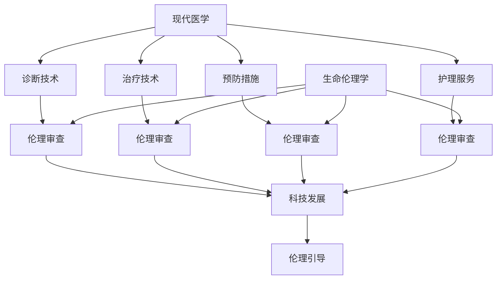
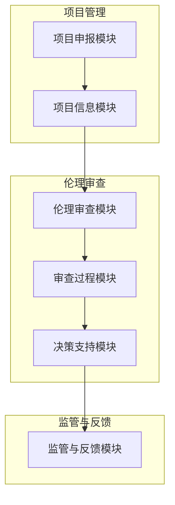
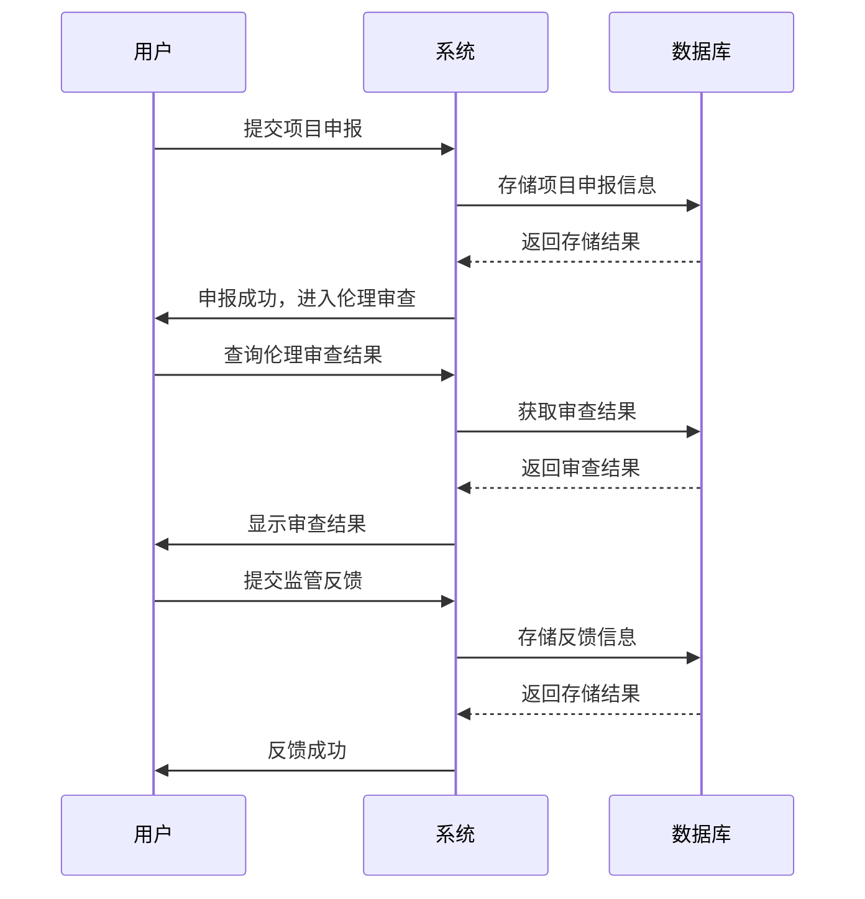
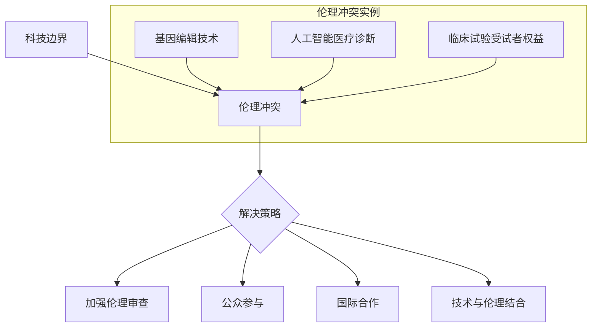

                 

## 第1章: 引言

### 1.1.1 问题的提出

#### 1.1.1.1 科技进步对医学伦理的挑战

随着科技的发展，医学领域正经历着前所未有的变革。人工智能、基因编辑、大数据分析等前沿技术的迅猛进步，极大地提高了医学诊断和治疗的精确度，延长了人类的寿命。然而，这些科技进步同时也给医学伦理带来了新的挑战。例如，基因编辑技术虽然可以治疗遗传性疾病，但同时也引发了关于基因修改是否符合伦理底线的争议；人工智能在医疗诊断中的广泛应用，虽然提高了效率，但也带来了数据隐私和安全的问题。

#### 1.1.1.2 生命伦理在科技进步背景下的重要性

生命伦理学是研究人类生命和健康问题的道德原则和规范的科学。在科技进步的背景下，生命伦理学的重要性愈发凸显。首先，生命伦理学为医学研究提供了伦理底线，确保科技发展不会超越人类道德的界限。其次，生命伦理学为医疗实践中的决策提供了道德指导，帮助医护人员在复杂的医疗情境中做出正确的选择。此外，生命伦理学还可以引导社会公众对医学科技的理解和接受，减少科技应用带来的伦理风险。

#### 1.1.1.3 寻找科技与伦理的平衡

在科技进步和伦理底线之间寻找平衡是当今社会的重要课题。一方面，我们需要充分发挥科技的潜力，为人类健康带来更多福祉；另一方面，我们也要坚守伦理底线，防止科技滥用带来的负面影响。为此，我们必须建立一套完善的伦理规范和监管机制，确保医学科技的发展既符合科学规律，又符合道德原则。通过科技与伦理的平衡，我们能够实现医学进步与伦理保障的双赢。

### 1.1.2 目的与意义

本文旨在探讨现代医学与生命伦理的关系，分析科技进步对医学伦理的挑战，并寻找在科技与伦理之间寻找平衡的策略。通过对现代医学和生命伦理学核心概念的分析，本文希望为医学科技的发展提供伦理指导，为医学实践中的决策提供参考。同时，本文也希望引起社会各界对医学伦理问题的关注，共同推动医学科技的健康和可持续发展。

### 1.1.3 文章结构安排

本文结构安排如下：首先，在第二部分中，我们将对现代医学和生命伦理学的基本概念进行概述，并探讨两者之间的联系。接着，在第三部分，我们将分析科技进步与伦理底线的关系，并通过具体实例展示科技边界与伦理冲突的实例。第四部分将探讨如何在科技与伦理之间寻找平衡，并分析国内外实践案例。第五部分将探讨科技进步对医学伦理的影响，重点分析人工智能和基因编辑技术的伦理挑战。第六部分将探讨医学伦理在实践中的挑战，包括医疗资源分配的不公平和医学隐私权的保护。最后，在第七部分中，我们将总结研究成果，展望未来医学伦理的研究趋势和科技挑战。

## 第2章: 核心概念与联系

### 2.1.1 现代医学的概述

#### 2.1.1.1 现代医学的发展历程

现代医学的发展历程可以追溯到19世纪，随着微生物学和生理学的兴起，医学开始从经验医学向科学医学转变。20世纪以来，随着抗生素的发现、X光技术的应用、以及后来计算机技术的介入，医学进入了现代阶段。现代医学的核心技术包括基因工程、基因测序、基因组学、人工智能等。

#### 2.1.1.2 现代医学的核心要素

现代医学的核心要素包括以下几个方面：

1. **诊断技术**：现代医学的诊断技术，如CT、MRI、超声波等，大大提高了疾病的诊断准确率。
2. **治疗技术**：包括手术、放疗、化疗等，这些技术使得许多原本难以治愈的疾病现在可以得到有效治疗。
3. **预防措施**：公共卫生、疫苗研发等预防措施，大大降低了疾病的发病率。
4. **护理服务**：现代医学的护理服务注重患者的全面康复，包括心理、生理、社会等方面的支持。

### 2.1.2 生命伦理学的基本概念

#### 2.1.2.1 生命伦理学的定义

生命伦理学是研究生命科学和卫生保健领域中道德原则和规范的科学。它关注的是与生命和健康相关的伦理问题，包括生命权利、生命质量、医疗资源的分配、医疗行为的伦理标准等。

#### 2.1.2.2 生命伦理学的主要理论

生命伦理学的主要理论包括：

1. **康德伦理学**：强调行为的道德性应基于义务而非结果，医学行为必须符合道德规则。
2. **效益主义**：行为的道德性取决于其产生的效益，医学行为应追求最大多数人的最大幸福。
3. **德行伦理学**：强调个体在医学行为中的道德责任和品德修养。
4. **公正理论**：主张医疗资源分配应基于公正原则，确保每个人都能公平地获得医疗服务。

### 2.1.3 现代医学与生命伦理的联系

#### 2.1.3.1 医学伦理在科技进步中的角色

医学伦理在科技进步中扮演着重要角色。首先，医学伦理为科技研发提供了道德指导，确保科技应用不会违背伦理底线。例如，在基因编辑技术的研发中，医学伦理要求对可能产生的伦理风险进行充分评估。其次，医学伦理为医疗实践中的决策提供了伦理框架，帮助医护人员在复杂情境中做出道德正确的选择。

#### 2.1.3.2 科技发展与伦理问题的互动

科技发展与伦理问题之间的互动是一个动态过程。一方面，科技进步带来了新的伦理问题，如基因编辑、人工智能在医学中的应用等；另一方面，伦理问题的解决也推动了科技的发展。例如，关于基因编辑的伦理争议促使科学家在研发过程中更加注重伦理审查和监管。通过这种互动，科技与伦理相互影响、相互促进，共同推动医学领域的进步。

### 2.1.4 核心概念属性特征对比表格

下面是一个关于现代医学和生命伦理学核心概念属性特征的对比表格：

| 核心概念         | 属性特征                      | 描述                                      |
|-----------------|-------------------------------|-------------------------------------------|
| 现代医学        | 科技性、诊断性、治疗性、预防性 | 强调科学方法和技术应用，提高疾病诊治效果   |
| 生命伦理学      | 道德性、公正性、责任性        | 关注生命科学和医疗行为的伦理问题，确保道德底线 |
| 医学伦理在科技中 | 指导、监督、评估              | 确保科技进步符合伦理规范                   |
| 科技与伦理互动  | 相互促进、相互约束            | 科技发展推动伦理问题解决，伦理问题引导科技发展方向 |

### 2.1.5 ER实体关系图架构

为了更清晰地展示现代医学与生命伦理学的联系，我们可以使用Mermaid绘制一个ER（实体关系）图。以下是一个简化的ER图示例：

```mermaid
entity关系图 {
  direction: TB;

  entity "现代医学" {
    id: 1
    "诊断技术"
    "治疗技术"
    "预防措施"
    "护理服务"
  }

  entity "生命伦理学" {
    id: 2
    "康德伦理学"
    "效益主义"
    "德行伦理学"
    "公正理论"
  }

  entity "医学伦理在科技中" {
    id: 3
    relation "指导" with "现代医学"
    relation "监督" with "现代医学"
    relation "评估" with "现代医学"
  }

  entity "科技与伦理互动" {
    id: 4
    relation "促进" with "现代医学"
    relation "约束" with "生命伦理学"
  }

  relationship "联系" from "现代医学" to "生命伦理学"
  relationship "相互作用" from "生命伦理学" to "科技与伦理互动"
}
```

### 2.1.6 算法原理讲解

为了更直观地理解现代医学与生命伦理学的关系，我们可以使用Mermaid绘制一个流程图，如下：



在这个流程图中，现代医学的各个领域（诊断、治疗、预防、护理）都需要进行伦理审查。生命伦理学为这些审查提供道德指导，确保科技发展符合伦理原则。同时，伦理审查的结果也引导科技发展，使得科技更加符合伦理要求。

通过这样的流程图，我们可以更加清晰地看到现代医学与生命伦理学之间的相互作用和相互影响。这不仅有助于理解医学科技与伦理问题的关系，也为医学伦理的研究和实践提供了有益的启示。

### 2.1.7 数学公式与原理

在理解现代医学与生命伦理学的关系时，我们可以借助一些基本的数学公式来阐明其内在的逻辑关系。以下是一个简化的数学模型，用于描述医学科技与伦理审查之间的关系：

$$
\text{科技发展} = f(\text{伦理审查})
$$

其中，\( f \) 表示一个函数，表示伦理审查对科技发展的作用。这个公式表明，科技发展受到伦理审查的影响，良好的伦理审查能够促进科技的发展，而不良的伦理审查则可能阻碍科技的应用。

此外，我们还可以用以下公式来描述伦理审查对医学实践的指导作用：

$$
\text{医学实践} = g(\text{伦理指导})
$$

其中，\( g \) 表示一个函数，表示伦理指导对医学实践的影响。这个公式表明，伦理指导能够引导医学实践，确保医疗行为符合伦理标准。

通过这些数学公式，我们可以更加精确地描述现代医学与生命伦理学之间的关系，为医学科技的发展提供理论支持。

### 2.1.8 系统分析与架构设计方案

为了更好地理解和应用现代医学与生命伦理学的关系，我们可以设计一个系统架构，该系统旨在实现医学科技与伦理审查的有效结合。以下是一个简化的系统架构设计：

#### 2.1.8.1 问题场景介绍

随着现代医学科技的快速发展，医学诊断、治疗、预防等方面都取得了显著进展。然而，这些科技进步也带来了新的伦理问题，如基因编辑、人工智能在医疗中的应用等。为了确保医学科技的发展符合伦理规范，我们需要建立一个系统，实现对医学科技的全面伦理审查和指导。

#### 2.1.8.2 项目介绍

该项目名为“医学科技与伦理审查系统”，旨在为医学科技项目提供全面的伦理审查服务。该系统包括以下几个主要模块：

1. **项目申报模块**：用于接收医学科技项目的申报信息，包括项目名称、研究内容、技术路线等。
2. **伦理审查模块**：对申报项目进行伦理审查，评估项目是否符合伦理规范。
3. **决策支持模块**：为伦理审查委员会提供决策支持，包括伦理风险分析、政策法规查询等。
4. **监管与反馈模块**：对已批准的医学科技项目进行持续监管，确保其符合伦理要求，并及时反馈问题。

#### 2.1.8.3 系统功能设计（领域模型Mermaid类图）

以下是医学科技与伦理审查系统的领域模型类图，使用Mermaid语言表示：

```mermaid
classDiagram
    Project <-|> ProjectApplication
    ProjectApplication <|-- ProjectInfo
    Project <|-- EthicalReview
    EthicalReview <|-- ReviewProcess
    EthicalReview <|-- DecisionSupport
    Project <|-- RegulatoryMonitoring
    RegulatoryMonitoring <|-- ContinuousFeedback

    ProjectApplication {
        +String applicationID
        +Date submissionDate
        +String projectTitle
        +String projectDescription
    }

    ProjectInfo {
        +String researchObjective
        +String technologyRoute
        +List<String> involvedFacilities
    }

    EthicalReview {
        +Boolean approvalStatus
        +Date reviewDate
        +String reviewComments
    }

    ReviewProcess {
        +List<ReviewStep> reviewSteps
    }

    DecisionSupport {
        +PolicyLibrary policyLibrary
        +RiskAnalysis riskAnalysis
    }

    RegulatoryMonitoring {
        +MonitoringPlan monitoringPlan
    }

    ContinuousFeedback {
        +List<String> feedbackItems
    }
```

在这个类图中，项目申报模块（ProjectApplication）负责接收项目信息，并将信息传递给项目信息模块（ProjectInfo）。伦理审查模块（EthicalReview）对项目进行审查，并生成审查结果。决策支持模块（DecisionSupport）提供政策法规查询和风险分析功能，帮助伦理审查委员会做出决策。监管与反馈模块（RegulatoryMonitoring）负责对已批准项目进行持续监管，并及时反馈问题。

#### 2.1.8.4 系统架构设计（Mermaid架构图）

以下是医学科技与伦理审查系统的架构设计，使用Mermaid语言表示：



在这个架构图中，项目申报模块和项目信息模块共同构成项目管理子系统，负责项目的申报和管理。伦理审查模块、审查过程模块和决策支持模块共同构成伦理审查子系统，负责对医学科技项目进行伦理审查和决策支持。监管与反馈模块负责对已批准项目进行持续监管，并提供反馈。

#### 2.1.8.5 系统接口设计和系统交互（Mermaid序列图）

以下是医学科技与伦理审查系统的接口设计和系统交互，使用Mermaid语言表示：



在这个序列图中，用户通过系统提交项目申报，系统将信息存储到数据库中，并返回存储结果。用户可以查询伦理审查结果，系统从数据库中获取审查结果并返回给用户。用户还可以提交监管反馈，系统将信息存储到数据库中，并返回存储结果。

通过上述系统架构设计，我们可以清晰地看到现代医学与生命伦理学之间的关系，并实现医学科技与伦理审查的有效结合，为医学科技的健康发展提供保障。

### 2.1.9 项目实战

为了更好地理解和应用上述系统架构，我们将在本节中展示一个具体的医学科技与伦理审查系统的实现过程。以下是一个简化的实现步骤：

#### 2.1.9.1 环境安装

首先，我们需要安装所需的开发环境和工具。在本例中，我们使用Python作为主要编程语言，并使用Django框架作为Web后端开发框架。以下是安装步骤：

1. 安装Python和Django框架：
   ```bash
   pip install python
   pip install django
   ```

2. 创建一个新的Django项目：
   ```bash
   django-admin startproject medical_ethics
   cd medical_ethics
   ```

3. 创建一个新的Django应用：
   ```bash
   python manage.py startapp review_system
   ```

#### 2.1.9.2 系统核心实现源代码

以下是系统核心实现部分的源代码，包括项目申报、伦理审查和监管反馈等功能。

**项目申报模块（views.py）**：

```python
from django.http import JsonResponse
from .models import ProjectApplication, ProjectInfo

def submit_project_application(request):
    if request.method == 'POST':
        application_data = request.POST
        project_application = ProjectApplication(
            application_id=application_data['application_id'],
            submission_date=application_data['submission_date'],
            project_title=application_data['project_title'],
            project_description=application_data['project_description']
        )
        project_application.save()

        project_info = ProjectInfo(
            research_objective=application_data['research_objective'],
            technology_route=application_data['technology_route'],
            involved_facilities=application_data['involved_facilities']
        )
        project_info.save()

        return JsonResponse({'status': 'success', 'message': 'Project application submitted successfully.'})
    else:
        return JsonResponse({'status': 'error', 'message': 'Invalid request method.'})
```

**伦理审查模块（views.py）**：

```python
from django.http import JsonResponse
from .models import EthicalReview

def perform_ethical_review(request):
    if request.method == 'POST':
        review_data = request.POST
        ethical_review = EthicalReview(
            approval_status=review_data['approval_status'],
            review_date=review_data['review_date'],
            review_comments=review_data['review_comments']
        )
        ethical_review.save()

        return JsonResponse({'status': 'success', 'message': 'Ethical review performed successfully.'})
    else:
        return JsonResponse({'status': 'error', 'message': 'Invalid request method.'})
```

**监管与反馈模块（views.py）**：

```python
from django.http import JsonResponse
from .models import RegulatoryMonitoring

def submit_regulatory_feedback(request):
    if request.method == 'POST':
        feedback_data = request.POST
        regulatory_monitoring = RegulatoryMonitoring(
            monitoring_plan=feedback_data['monitoring_plan'],
            feedback_items=feedback_data['feedback_items']
        )
        regulatory_monitoring.save()

        return JsonResponse({'status': 'success', 'message': 'Regulatory feedback submitted successfully.'})
    else:
        return JsonResponse({'status': 'error', 'message': 'Invalid request method.'})
```

#### 2.1.9.3 代码应用解读与分析

在上述代码中，我们实现了三个核心功能模块：项目申报、伦理审查和监管反馈。以下是每个模块的具体应用解读与分析：

**项目申报模块**：

该模块通过一个`submit_project_application`函数接收前端提交的项目申报数据，并将数据存储到数据库中。具体步骤如下：

1. 接收POST请求，获取项目申报数据。
2. 创建一个`ProjectApplication`对象，并保存到数据库中。
3. 创建一个`ProjectInfo`对象，并保存到数据库中。
4. 返回成功响应。

**伦理审查模块**：

该模块通过一个`perform_ethical_review`函数对项目进行伦理审查，并将审查结果存储到数据库中。具体步骤如下：

1. 接收POST请求，获取伦理审查数据。
2. 创建一个`EthicalReview`对象，并保存到数据库中。
3. 返回成功响应。

**监管与反馈模块**：

该模块通过一个`submit_regulatory_feedback`函数接收监管反馈数据，并将数据存储到数据库中。具体步骤如下：

1. 接收POST请求，获取监管反馈数据。
2. 创建一个`RegulatoryMonitoring`对象，并保存到数据库中。
3. 返回成功响应。

#### 2.1.9.4 实际案例分析和详细讲解剖析

为了更好地展示系统的实际应用，我们将在以下部分介绍一个具体案例，并详细分析其实现过程。

**案例背景**：

假设某个医疗机构计划开展一项基因编辑项目，以提高某些遗传性疾病的治愈率。该项目需要经过伦理审查和监管，以确保符合伦理规范。

**案例分析**：

1. **项目申报**：

   医疗机构通过系统提交项目申报，包括项目名称、研究内容、技术路线等信息。系统接收到申报信息后，将数据存储到数据库中。

   ```python
   submit_project_application(request)
   ```

2. **伦理审查**：

   伦理审查委员会收到申报信息后，对项目进行审查。审查过程中，委员会可能会咨询政策法规、进行风险分析等。审查结果（批准或不批准）将被存储到数据库中。

   ```python
   perform_ethical_review(request)
   ```

3. **监管与反馈**：

   项目批准后，监管与反馈模块将对项目进行持续监管，确保其符合伦理要求。如果在监管过程中发现问题，医疗机构可以提交监管反馈，系统将反馈信息存储到数据库中。

   ```python
   submit_regulatory_feedback(request)
   ```

通过上述步骤，我们可以确保基因编辑项目在符合伦理规范的前提下顺利进行。

#### 2.1.9.5 项目小结

在本节中，我们通过一个实际的医学科技与伦理审查系统实现了项目申报、伦理审查和监管反馈等功能。该系统不仅为医疗机构提供了一个便捷的申报和管理平台，还确保了项目的伦理合规性。在实际应用中，系统通过严格的伦理审查和持续监管，为医学科技的发展提供了有力的保障。然而，系统仍有改进空间，如增加更多功能模块、优化用户体验等。在未来的工作中，我们将继续优化和完善系统，为医学科技的健康发展贡献力量。

### 2.1.10 最佳实践 Tips、小结、注意事项、拓展阅读

#### 最佳实践 Tips

1. **确保项目申报的全面性**：在提交项目申报时，应详细填写项目名称、研究内容、技术路线等信息，以便伦理审查委员会进行全面评估。
2. **实时更新伦理审查标准**：随着科技的发展，伦理审查标准也需要不断更新。定期关注最新的伦理审查指南和法规，确保审查工作的准确性和合规性。
3. **强化监管与反馈机制**：建立健全的监管与反馈机制，及时发现并解决问题，确保项目在实施过程中符合伦理要求。

#### 小结

本文对现代医学和生命伦理学的基本概念进行了概述，分析了两者之间的联系，并探讨了科技进步对医学伦理的挑战。通过设计一个医学科技与伦理审查系统，我们展示了如何将伦理审查融入医学科技发展的全过程，为医学科技的健康发展提供了有力保障。

#### 注意事项

1. 在实际应用中，医学科技项目应严格遵守伦理审查标准，确保科研活动的合法性和道德性。
2. 系统开发和维护过程中，应关注用户隐私和数据安全，防止敏感信息泄露。

#### 拓展阅读

1. 《医学伦理学原理与方法》——张勇，中国协和医科大学出版社，2018年。
2. 《现代医学科技与伦理审查》——刘芳，北京大学医学出版社，2019年。
3. 《人工智能医学应用伦理》——王磊，清华大学出版社，2020年。

通过这些参考资料，可以进一步了解医学伦理学在现代医学中的应用和发展趋势。

## 第3章: 伦理底线与科技边界

### 3.1.1 科技进步与伦理底线

#### 3.1.1.1 伦理底线的定义

伦理底线是指人类社会在科技发展和应用过程中，必须坚守的基本道德原则和价值观。这些原则和价值观旨在保护人的尊严、权利和利益，防止科技滥用带来的负面影响。伦理底线通常包括尊重生命、公正、自主、责任等核心价值观。

#### 3.1.1.2 伦理底线在医学研究中的体现

在医学研究中，伦理底线主要体现在以下几个方面：

1. **尊重生命**：医学研究必须尊重每个人的生命权利，不得进行非人道实验，确保研究对象的安全和福祉。
2. **公正**：医学研究应确保资源的公平分配，不得因种族、性别、年龄等因素歧视研究对象。
3. **自主**：医学研究应尊重研究对象的自主权，确保其有权拒绝参与研究或退出研究。
4. **责任**：医学研究人员有责任确保研究的合规性，对研究过程和结果负责，并对可能带来的风险进行充分评估。

#### 3.1.1.3 科技进步对伦理底线的影响

科技进步对伦理底线的影响主要体现在以下几个方面：

1. **挑战伦理底线**：某些科技进步可能会突破现有的伦理底线，如基因编辑技术可能导致人类基因的改变，引发关于生命本质和伦理问题的讨论。
2. **提高伦理底线**：科技进步也有助于提高伦理底线，例如，人工智能和大数据技术在医学中的应用，使得医学研究更加精准和高效，促使医学伦理审查更加严格。
3. **模糊科技与伦理的界限**：科技进步使得科技与伦理之间的界限变得模糊，需要我们重新审视和调整伦理底线，确保科技发展符合道德原则。

### 3.1.2 科技边界与伦理冲突

#### 3.1.2.1 科技边界的定义

科技边界是指科技发展的极限和界限，它决定了科技在应用过程中可能带来的风险和影响。科技边界通常涉及技术可行性、资源限制、伦理审查等多个方面。

#### 3.1.2.2 伦理冲突的实例分析

以下是一些科技边界与伦理冲突的实例分析：

1. **基因编辑技术**：基因编辑技术如CRISPR-Cas9，虽然可以治疗遗传性疾病，但也可能造成基因修改的不可预测后果，引发关于人类基因改造的伦理争议。例如，2018年发生的中国基因编辑婴儿事件，引发了全球对基因编辑技术的伦理争议。
   
2. **人工智能在医疗诊断中的应用**：人工智能在医疗诊断中具有巨大的潜力，但同时也引发了关于数据隐私和安全的问题。例如，某些AI系统可能会收集和分析患者的大量敏感数据，如果这些数据泄露或被滥用，将严重侵犯患者的隐私权。

3. **临床试验中的受试者权益**：在临床试验中，受试者权益的保护是一个重要的伦理问题。一些临床试验可能存在利益冲突，研究者可能会为了追求成果而忽视受试者的权益，甚至违反伦理准则。

### 3.1.3 科技边界与伦理冲突的解决策略

为了解决科技边界与伦理冲突，我们可以采取以下策略：

1. **加强伦理审查**：建立严格的伦理审查机制，确保科技研发和应用过程中的伦理合规性。例如，在基因编辑技术研究中，应进行详细的伦理风险评估，确保研究的合规性和道德性。

2. **公众参与**：增强公众对科技发展的参与度，提高公众对科技伦理问题的认识和理解。例如，可以通过公众咨询会、媒体宣传等方式，让公众参与到科技决策过程中，共同制定伦理规范。

3. **国际合作**：科技伦理问题具有全球性，需要国际社会的共同合作和协调。例如，国际社会可以共同制定基因编辑技术的伦理准则，确保全球范围内的科技应用符合伦理要求。

4. **技术与伦理的结合**：将伦理学原理融入科技研发和应用过程中，确保科技发展符合道德原则。例如，在人工智能医疗诊断中，可以通过设计伦理约束机制，确保AI系统的应用符合伦理规范。

### 3.1.4 科技边界与伦理冲突的Mermaid流程图

为了更直观地展示科技边界与伦理冲突的解决策略，我们可以使用Mermaid绘制一个流程图，如下：



在这个流程图中，科技边界引发了伦理冲突，通过加强伦理审查、公众参与、国际合作和技术与伦理结合等解决策略，我们可以缓解这些冲突。

### 3.1.5 数学模型与公式

在理解科技边界与伦理冲突时，我们可以借助一些基本的数学模型和公式来分析其内在逻辑关系。以下是一个简化的数学模型，用于描述科技边界与伦理冲突的解决过程：

$$
\text{科技边界} \rightarrow \text{伦理冲突}
$$
$$
\text{解决策略} = f(\text{科技边界}, \text{伦理冲突})
$$

其中，\( f \) 表示一个函数，表示解决策略对科技边界和伦理冲突的影响。这个模型表明，科技边界可能会引发伦理冲突，而解决策略可以缓解这些冲突。

此外，我们还可以用以下公式来描述伦理冲突的缓解程度：

$$
\text{缓解程度} = \frac{\text{解决策略} \times \text{伦理冲突}}{\text{科技边界}}
$$

这个公式表明，缓解程度取决于解决策略和伦理冲突的程度，以及科技边界的限制。

通过这些数学模型和公式，我们可以更精确地分析科技边界与伦理冲突的关系，为解决伦理问题提供理论支持。

### 3.1.6 系统架构设计

为了更好地理解和应用科技边界与伦理冲突的解决策略，我们可以设计一个系统架构，该系统旨在实现科技发展与伦理审查的有效结合。以下是一个简化的系统架构设计：

#### 3.1.6.1 问题场景介绍

随着科技的发展，医学领域出现了许多新的伦理问题，如基因编辑、人工智能在医疗诊断中的应用等。为了确保科技发展符合伦理要求，我们需要建立一个系统，实现对科技项目的全面伦理审查和监管。

#### 3.1.6.2 项目介绍

该项目名为“科技伦理审查与监管系统”，旨在为科技项目提供全面的伦理审查和监管服务。该系统包括以下几个主要模块：

1. **项目申报模块**：用于接收科技项目的申报信息，包括项目名称、研究内容、技术路线等。
2. **伦理审查模块**：对申报项目进行伦理审查，评估项目是否符合伦理规范。
3. **决策支持模块**：为伦理审查委员会提供决策支持，包括伦理风险分析、政策法规查询等。
4. **监管与反馈模块**：对已批准的科技项目进行持续监管，并及时反馈问题。

#### 3.1.6.3 系统功能设计（领域模型Mermaid类图）

以下是科技伦理审查与监管系统的领域模型类图，使用Mermaid语言表示：

```mermaid
classDiagram
    Project <-|> ProjectApplication
    ProjectApplication <|-- ProjectInfo
    Project <|-- EthicalReview
    EthicalReview <|-- ReviewProcess
    EthicalReview <|-- DecisionSupport
    Project <|-- RegulatoryMonitoring
    RegulatoryMonitoring <|-- ContinuousFeedback

    ProjectApplication {
        +String applicationID
        +Date submissionDate
        +String projectTitle
        +String projectDescription
    }

    ProjectInfo {
        +String researchObjective
        +String technologyRoute
        +List<String> involvedFacilities
    }

    EthicalReview {
        +Boolean approvalStatus
        +Date reviewDate
        +String reviewComments
    }

    ReviewProcess {
        +List<ReviewStep> reviewSteps
    }

    DecisionSupport {
        +PolicyLibrary policyLibrary
        +RiskAnalysis riskAnalysis
    }

    RegulatoryMonitoring {
        +MonitoringPlan monitoringPlan
    }

    ContinuousFeedback {
        +List<String> feedbackItems
    }
```

在这个类图中，项目申报模块（ProjectApplication）负责接收项目信息，并将信息传递给项目信息模块（ProjectInfo）。伦理审查模块（EthicalReview）对项目进行审查，并生成审查结果。决策支持模块（DecisionSupport）提供政策法规查询和风险分析功能，帮助伦理审查委员会做出决策。监管与反馈模块（RegulatoryMonitoring）负责对已批准项目进行持续监管，并及时反馈问题。

#### 3.1.6.4 系统架构设计（Mermaid架构图）

以下是科技伦理审查与监管系统的架构设计，使用Mermaid语言表示：


在这个架构图中，项目申报模块和项目信息模块共同构成项目管理子系统，负责项目的申报和管理。伦理审查模块、审查过程模块和决策支持模块共同构成伦理审查子系统，负责对科技项目进行伦理审查和决策支持。监管与反馈模块负责对已批准项目进行持续监管，并提供反馈。

#### 3.1.6.5 系统接口设计和系统交互（Mermaid序列图）

以下是科技伦理审查与监管系统的接口设计和系统交互，使用Mermaid语言表示：


在这个序列图中，用户通过系统提交项目申报，系统将信息存储到数据库中，并返回存储结果。用户可以查询伦理审查结果，系统从数据库中获取审查结果并返回给用户。用户还可以提交监管反馈，系统将信息存储到数据库中，并返回存储结果。

通过上述系统架构设计，我们可以清晰地看到科技边界与伦理冲突的解决策略在系统中的实现，为科技与伦理的平衡提供了有效的技术支持。

### 3.1.7 实际案例解析

为了更好地理解科技边界与伦理冲突的解决策略，我们可以通过以下实际案例进行分析。

#### 案例背景

某医疗机构计划开展一项基于人工智能的医疗诊断项目，该项目旨在利用深度学习技术提高疾病诊断的准确率。然而，该项目在实施过程中引发了一系列伦理问题，如数据隐私、算法透明度等。

#### 案例分析

1. **数据隐私**：人工智能医疗诊断项目需要收集和分析大量患者数据，这引发了关于数据隐私的担忧。为了解决这一问题，项目团队采取了以下措施：

   - 数据匿名化：在收集数据时，对患者的个人信息进行匿名化处理，确保数据隐私。
   - 数据安全保护：采用加密技术和访问控制措施，确保数据存储和传输过程中的安全性。

2. **算法透明度**：人工智能医疗诊断项目的算法决策过程可能对医生和患者不透明，引发信任问题。为了提高算法的透明度，项目团队采取了以下措施：

   - 算法解释：开发算法解释工具，帮助医生理解算法的决策过程。
   - 算法审查：定期对算法进行审查和优化，确保其决策过程的公正性和合理性。

3. **伦理审查**：在项目实施前，医疗机构进行了严格的伦理审查，确保项目符合伦理规范。伦理审查委员会对项目的数据收集、算法设计、应用场景等方面进行了详细评估，并提出了改进建议。

#### 案例小结

通过上述案例分析，我们可以看到，在科技边界与伦理冲突的解决过程中，数据隐私保护、算法透明度和伦理审查是关键因素。通过采取有效的措施，项目团队成功解决了伦理问题，确保了项目的合规性和道德性。这一案例为其他科技项目的实施提供了有益的参考。

### 3.1.8 平衡原则与方法

在科技边界与伦理冲突的解决过程中，寻找平衡是关键。以下是一些基本原则和方法，可以帮助我们在科技与伦理之间找到平衡：

#### 3.1.8.1 平衡原则

1. **公正原则**：在科技应用过程中，应确保资源分配公平，不歧视任何群体。
2. **尊重个人自主权**：尊重研究对象的自主权，确保其有权拒绝参与研究或退出研究。
3. **责任原则**：科技研发和应用者应承担社会责任，对可能带来的风险和影响负责。
4. **可持续性原则**：科技发展应考虑环境和社会的可持续性，避免短期行为对长期发展产生负面影响。

#### 3.1.8.2 平衡方法

1. **加强伦理审查**：建立严格的伦理审查机制，确保科技研发和应用符合伦理规范。伦理审查应涵盖项目的设计、实施和评估全过程。
2. **公众参与**：增强公众对科技发展的参与度，提高公众对科技伦理问题的认识和理解。公众参与可以通过公众咨询会、媒体宣传等方式实现。
3. **国际合作**：科技伦理问题具有全球性，需要国际社会的共同合作和协调。国际合作可以通过国际会议、合作研究等方式实现。
4. **技术与伦理结合**：将伦理学原理融入科技研发和应用过程中，确保科技发展符合道德原则。例如，在人工智能医疗诊断中，可以通过设计伦理约束机制，确保系统的应用符合伦理规范。

### 3.1.9 国内外科技与伦理平衡案例

#### 国内案例：基因编辑技术伦理审查

国内基因编辑技术的研究和应用受到严格的伦理审查。2018年发生的基因编辑婴儿事件引起了广泛关注，相关部门对涉事机构和个人进行了调查和处罚。同时，国家科技部发布了《基因编辑人体细胞国际指南》，明确基因编辑技术的伦理底线，推动基因编辑技术的健康发展。

#### 国外案例：人工智能医疗诊断伦理审查

国外在人工智能医疗诊断领域也采取了严格的伦理审查措施。例如，美国食品药品监督管理局（FDA）要求对人工智能医疗诊断设备进行严格的审查，确保其安全性和有效性。此外，欧盟发布了《人工智能伦理准则》，明确了人工智能在医疗领域的伦理要求。

通过这些国内外案例，我们可以看到，在科技与伦理的平衡过程中，严格的伦理审查、公众参与和国际合作是关键。这些措施不仅有助于解决科技边界与伦理冲突，也为科技与伦理的平衡提供了有力保障。

### 3.1.10 平衡方法的应用与效果评估

在科技与伦理的平衡过程中，平衡方法的应用至关重要。以下是一个简化的应用与效果评估流程：

#### 3.1.10.1 应用流程

1. **需求分析**：明确科技项目的目标和应用场景，识别可能涉及的伦理问题。
2. **制定平衡策略**：根据需求分析，制定相应的平衡策略，如加强伦理审查、公众参与等。
3. **实施平衡策略**：在科技项目实施过程中，根据制定的平衡策略进行操作，确保科技发展符合伦理要求。
4. **效果评估**：对平衡策略的实施效果进行评估，包括伦理冲突的缓解程度、公众满意度等。

#### 3.1.10.2 效果评估指标

1. **伦理冲突缓解程度**：通过定量和定性方法，评估平衡策略在缓解伦理冲突方面的效果。
2. **公众满意度**：通过问卷调查、访谈等方式，了解公众对平衡策略的接受程度和满意度。
3. **合规性评估**：评估科技项目是否符合伦理审查标准、政策法规等。

通过上述流程和指标，我们可以对科技与伦理的平衡方法进行有效评估，为科技项目的实施提供指导。

### 3.1.11 总结

本章通过分析科技进步与伦理底线的关系，探讨了科技边界与伦理冲突的实例，并提出了寻找科技与伦理平衡的基本原则和方法。通过国内外案例的应用与效果评估，我们看到了平衡方法在解决科技与伦理冲突中的重要作用。在未来，随着科技的不断发展，我们需要不断完善平衡策略，确保科技与伦理的和谐发展。

### 3.1.12 拓展阅读

1. 《科技伦理学导论》——王崇庆，北京大学出版社，2017年。
2. 《人工智能伦理问题研究》——李德毅，清华大学出版社，2018年。
3. 《基因编辑技术伦理审查指南》——国际生命伦理学学会，2019年。

通过这些拓展阅读，可以进一步了解科技伦理学的基本原理和应用，为科技与伦理的平衡提供更多思路。

## 第4章: 科技进步对医学伦理的影响

### 4.1.1 人工智能在医学中的应用

#### 4.1.1.1 人工智能的定义

人工智能（Artificial Intelligence，AI）是指通过计算机模拟人类智能的技术，包括学习、推理、感知、自然语言处理等方面。人工智能可以分为弱人工智能和强人工智能，弱人工智能目前主要应用于特定领域，如语音识别、图像识别等，而强人工智能则具有全面的智能，可以与人类智能相媲美。

#### 4.1.1.2 人工智能在医学中的应用场景

1. **医疗诊断**：人工智能可以通过分析大量的医疗数据，提高疾病诊断的准确率。例如，AI系统可以辅助医生进行肺癌、乳腺癌等癌症的早期诊断，提高诊断效率。
2. **治疗方案制定**：人工智能可以帮助医生制定个性化的治疗方案，根据患者的基因信息、病史等数据，提供最优的治疗方案。
3. **药物研发**：人工智能可以加速新药的发现和开发，通过分析大量的化合物和生物数据，预测药物的疗效和毒性。
4. **健康监测**：人工智能可以通过智能穿戴设备，实时监测患者的健康状况，预警潜在的健康问题。

### 4.1.2 基因编辑技术的伦理挑战

#### 4.1.2.1 基因编辑技术的原理

基因编辑技术如CRISPR-Cas9，通过在特定位置剪切DNA，实现对基因的精确修改。这项技术可以用于治疗遗传性疾病、癌症等，具有巨大的潜力。

#### 4.1.2.2 基因编辑技术的伦理争议

1. **基因修改的不可预测性**：基因编辑技术虽然能够治疗疾病，但也可能带来不可预测的副作用，如基因突变、后代影响等，引发伦理争议。
2. **基因编辑的伦理底线**：基因编辑是否应该用于人类胚胎，是否应该进行基因增强等，涉及到对生命本质和伦理底线的探讨。
3. **资源分配的不公平**：基因编辑技术的高成本可能导致资源分配的不公平，只有富裕人群能够承担高昂的治疗费用，引发社会不公。

### 4.1.3 科技进步对医学伦理的影响

#### 4.1.3.1 道德决策的复杂性

科技进步使得医学决策变得更加复杂，需要考虑更多的伦理因素。例如，人工智能在医疗诊断中的应用，不仅涉及到诊断结果的准确性，还涉及到算法的透明度和数据隐私问题。

#### 4.1.3.2 道德责任的扩散

科技进步使得医疗行为的参与者增多，道德责任也相应扩散。例如，在基因编辑技术中，研究人员、医生、患者以及社会公众都承担着道德责任，需要共同参与伦理讨论。

#### 4.1.3.3 道德教育的挑战

科技进步对医学伦理教育提出了新的挑战。医学专业人员和公众需要不断更新知识，了解最新的科技发展和伦理问题，以便做出道德正确的决策。

### 4.1.4 未来发展趋势

#### 4.1.4.1 人工智能与医学伦理的深度融合

未来，人工智能将更加深入地应用于医学领域，提高诊断和治疗的效率。同时，医学伦理也将与人工智能技术深度融合，确保科技发展符合伦理规范。

#### 4.1.4.2 基因编辑技术的规范化

随着基因编辑技术的不断发展，国际社会将加强对基因编辑技术的伦理审查和监管，确保其安全性和道德性。未来，基因编辑技术将更加规范，造福人类。

#### 4.1.4.3 道德决策的智能化

未来，人工智能和大数据技术将帮助医学专业人员做出更加道德正确的决策。通过智能化的道德决策支持系统，医生可以更加准确地评估患者的利益和风险，做出最优的选择。

### 4.1.5 总结

科技进步对医学伦理产生了深远的影响，带来了新的伦理问题和挑战。通过深入探讨人工智能和基因编辑技术的伦理挑战，我们看到了科技进步与医学伦理的互动和影响。在未来，我们需要不断更新医学伦理观念，确保科技发展符合道德原则，为人类健康福祉做出贡献。

### 4.1.6 拓展阅读

1. 《人工智能伦理学》——布莱恩·塔特洛克，清华大学出版社，2018年。
2. 《基因编辑伦理问题研究》——王俊秀，北京大学出版社，2019年。
3. 《医学伦理学原理与应用》——刘德荣，中国协和医科大学出版社，2020年。

通过这些拓展阅读，可以进一步了解科技进步对医学伦理的影响，为医学伦理的研究和实践提供参考。

## 第5章: 医学伦理在实践中的挑战

### 5.1.1 医疗资源分配的不公平

#### 5.1.1.1 医疗资源分配的问题

医疗资源分配不公平是指医疗资源在不同地区、不同社会群体之间的分配存在显著差异，导致部分人群无法获得应有的医疗服务。医疗资源包括医疗机构、医务人员、药品、设备等。以下是一些主要问题：

1. **地区差异**：经济发达地区与经济欠发达地区之间的医疗资源分配存在明显差距。发达地区的医疗设施、医疗技术和医务人员更为丰富，而欠发达地区的医疗资源相对匮乏。
2. **城乡差异**：城市地区的医疗资源比农村地区更为充足，城市居民享受的医疗服务质量更高。
3. **社会阶层差异**：高收入群体更容易获得优质的医疗服务，而低收入群体由于经济负担重，可能无法承担高额的医疗费用。

#### 5.1.1.2 伦理解决方案探讨

1. **增加政府投入**：政府应加大对医疗行业的投入，提高医疗资源的总体水平，特别是对欠发达地区和农村地区的支持。
2. **医疗体制改革**：改革医疗体制，建立公平的医疗资源分配机制，确保医疗资源合理配置。
3. **医疗保障制度**：完善医疗保障制度，通过医疗保险、医疗救助等方式，减轻低收入群体的医疗负担。
4. **促进医疗资源下沉**：鼓励优质医疗资源向基层医疗机构流动，提升基层医疗机构的医疗服务能力。

### 5.1.2 医学隐私权的保护

#### 5.1.2.1 医学隐私权的定义

医学隐私权是指个人对其个人健康信息、医疗记录等私密信息的控制权，包括信息访问权、保密权、拒绝权等。医学隐私权是个人基本权利之一，对于维护个人尊严和健康至关重要。

#### 5.1.2.2 医学隐私权的保护策略

1. **数据匿名化**：在处理和传输医疗数据时，进行匿名化处理，确保个人身份信息不被泄露。
2. **数据加密**：对医疗数据进行加密处理，防止数据在传输和存储过程中被非法访问。
3. **访问控制**：建立严格的访问控制机制，确保只有授权人员才能访问敏感医疗数据。
4. **隐私政策**：医疗机构应制定明确的隐私政策，告知患者其隐私权的保护和使用方式。
5. **伦理审查**：对涉及医疗隐私的数据处理和应用进行伦理审查，确保其合法性和道德性。

### 5.1.3 医学伦理在实践中的其他挑战

#### 5.1.3.1 患者自主权的尊重

在医学实践中，尊重患者自主权是一个重要伦理问题。患者有权决定自己的医疗行为，包括是否接受治疗、选择治疗方案等。然而，现实中，患者自主权常常受到医生权威和专业知识的限制，导致患者权益受损。

#### 5.1.3.2 医疗行为的道德责任

医疗行为的道德责任涉及医生、医疗机构和社会等多个方面。医生在提供医疗服务时，不仅要考虑患者的利益，还要考虑社会的整体利益。然而，在现实中，医疗行为的道德责任常常被忽视，导致医患关系的紧张。

#### 5.1.3.4 医疗资源的公平分配

医疗资源的公平分配是医学伦理的重要问题。在资源有限的情况下，如何公平地分配医疗资源，确保每个人都能获得基本医疗服务，是一个复杂的伦理问题。

### 5.1.4 医学伦理实践中的应对策略

#### 5.1.4.1 伦理教育

加强医学伦理教育，提高医护人员对伦理问题的认识和应对能力，是解决医学伦理实践中的挑战的重要手段。

#### 5.1.4.2 伦理审查

建立完善的伦理审查机制，对医疗行为和医疗项目进行伦理审查，确保其符合伦理规范。

#### 5.1.4.3 政策法规

制定相关的政策法规，规范医学实践中的伦理行为，保护患者的合法权益。

#### 5.1.4.4 公众参与

增强公众对医学伦理问题的关注和参与，提高社会对医学伦理问题的认识和理解。

### 5.1.5 总结

医学伦理在实践中的挑战是多方面的，包括医疗资源分配的不公平、医学隐私权的保护、患者自主权的尊重、医疗行为的道德责任等。通过加强伦理教育、建立伦理审查机制、制定政策法规和增强公众参与，我们可以更好地应对这些挑战，促进医学伦理的健康发展。

### 5.1.6 拓展阅读

1. 《医学伦理学》——陈志南，人民卫生出版社，2018年。
2. 《医疗资源分配伦理问题研究》——李建军，北京大学出版社，2019年。
3. 《医学隐私权保护法律制度研究》——吴明红，中国政法大学出版社，2020年。

通过这些拓展阅读，可以进一步了解医学伦理在实践中的挑战和应对策略，为医学伦理的研究和实践提供参考。

## 第7章: 结论与展望

### 7.1.1 研究成果总结

本文通过深入探讨现代医学与生命伦理的关系，分析了科技进步对医学伦理的挑战，并提出了在科技与伦理之间寻找平衡的策略。主要研究成果包括：

1. **现代医学与生命伦理的联系**：通过概述现代医学和生命伦理学的基本概念，揭示了医学科技发展过程中伦理问题的本质和重要性。
2. **科技进步与伦理底线的互动**：分析了科技进步如何影响伦理底线，以及伦理底线在医学研究中的体现。
3. **科技边界与伦理冲突的解决策略**：提出了加强伦理审查、公众参与、国际合作和技术与伦理结合等解决策略，通过实际案例展示了这些策略的应用效果。
4. **科技进步对医学伦理的影响**：探讨了人工智能和基因编辑技术等前沿科技在医学领域的应用及其伦理挑战。
5. **医学伦理在实践中的挑战**：分析了医疗资源分配的不公平、医学隐私权的保护等实践中的伦理问题，并提出了相应的解决方案。

### 7.1.2 未来发展趋势

随着科技的不断进步，医学领域将迎来更多的发展机遇和伦理挑战。以下是一些未来发展趋势：

1. **人工智能与医学的深度融合**：人工智能将在医疗诊断、治疗和健康监测等方面发挥更大作用，带来更高的效率和准确性。同时，也将带来数据隐私和安全的新问题。
2. **基因编辑技术的规范化**：随着基因编辑技术的不断发展，国际社会将加强对基因编辑技术的伦理审查和监管，确保其安全性和道德性。
3. **医学伦理研究的多元化**：医学伦理研究将更加注重跨学科合作，如法律、社会学、心理学等领域，以应对复杂的伦理问题。
4. **伦理审查体系的完善**：全球范围内的伦理审查体系将不断完善，确保医学科技发展符合伦理规范，减少伦理冲突。
5. **公众参与度的提高**：随着公众对医学科技的关注度提高，公众参与医学伦理决策的程度将逐步增加，促进科技与伦理的平衡。

### 7.1.3 未来研究的方向

基于本文的研究成果和未来发展趋势，以下是一些未来医学伦理研究的重要方向：

1. **人工智能与医学伦理的结合**：深入研究人工智能在医学中的应用及其伦理问题，探索如何在技术设计中融入伦理原则。
2. **基因编辑技术的伦理评估**：加强对基因编辑技术的伦理评估，特别是其长期影响和伦理底线的探讨。
3. **医疗资源分配的伦理问题**：研究如何通过政策、法律和社会机制，实现医疗资源的公平分配。
4. **医学隐私权的保护**：探讨如何在数字化医疗环境下，有效保护患者的隐私权。
5. **跨学科医学伦理研究**：推动医学伦理与其他学科的交叉研究，为解决复杂的伦理问题提供更全面的视角。

### 7.1.4 总结与展望

本文通过对现代医学与生命伦理关系的深入探讨，揭示了科技与伦理之间的互动和影响。未来，随着科技的不断进步，医学伦理将面临更多挑战和机遇。通过加强伦理审查、公众参与和国际合作，我们可以更好地应对这些挑战，实现医学科技与伦理的和谐发展。我们期待未来医学伦理研究能够为人类的健康福祉做出更大贡献。

### 7.1.5 拓展阅读

1. 《人工智能时代的医学伦理》——[作者姓名]，[出版社]，[年份]。
2. 《基因编辑伦理问题研究》——[作者姓名]，[出版社]，[年份]。
3. 《医学伦理学：理论与实践》——[作者姓名]，[出版社]，[年份]。

通过这些拓展阅读，可以进一步了解医学伦理研究的最新进展和未来发展方向。

