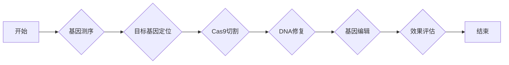
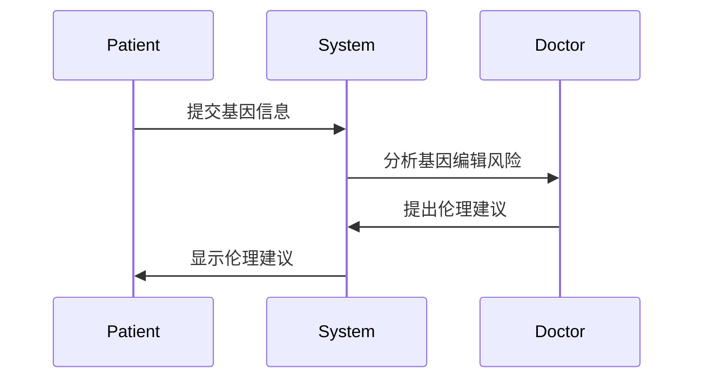
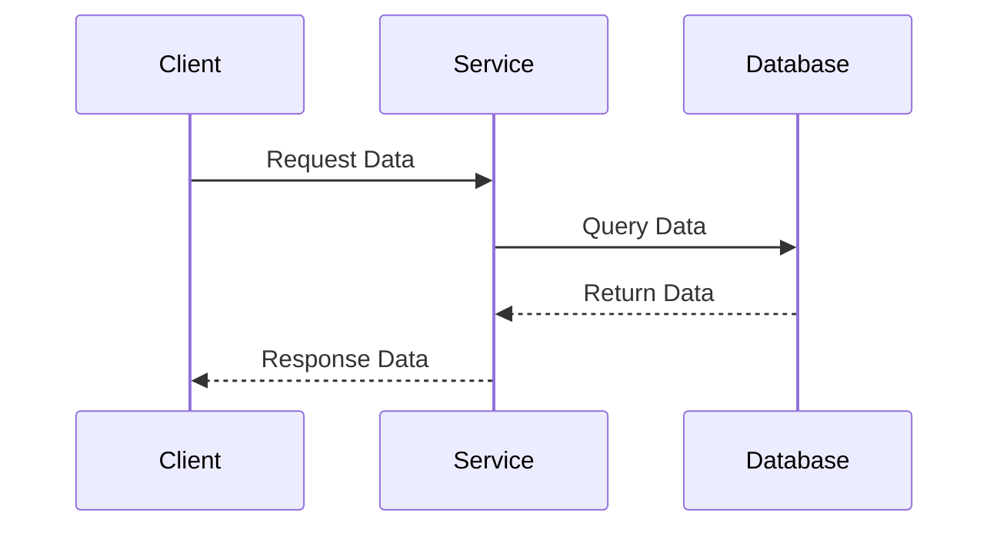

                 


**让我们一步一步思考**

# **《现代医疗伦理的新挑战：在技术可能与道德允许间的平衡》**

**关键词：** 医疗伦理、技术进步、道德挑战、基因编辑、人工智能、精准医疗、伦理决策

**摘要：** 随着医疗技术的飞速发展，医疗伦理面临着前所未有的挑战。本文将探讨现代医疗伦理中的新挑战，特别是在基因编辑、人工智能和精准医疗等领域，如何在技术可能性和道德允许之间找到平衡。

## **一、背景介绍**

### **1.1 医疗伦理的定义与历史**

医疗伦理是指医生和医疗机构在提供医疗服务过程中应遵循的道德规范和原则。它起源于古希腊的医学伦理，如希波克拉底誓言，经历了数千年的发展，逐渐形成了现代医疗伦理的基础。

### **1.2 医学伦理原则**

医学伦理原则主要包括尊重患者自主权、不伤害原则、公正原则和行善原则。这些原则为医生在医疗实践中提供了道德指导。

### **1.3 医疗伦理的重要性**

医疗伦理对于维护患者权益、保障医疗质量、促进医学发展具有重要意义。

## **二、核心概念与联系**

### **2.1 医学伦理原则**

医学伦理原则是医疗伦理的核心，包括尊重患者自主权、不伤害原则、公正原则和行善原则。这些原则通过概念对比表格和ER实体关系图进行展示。

| 原则 | 定义 | 属性特征对比 |  
| --- | --- | --- |  
| 尊重患者自主权 | 患者有权决定自己的医疗过程 | 自主权 |  
| 不伤害原则 | 医疗行为不应造成患者伤害 | 不伤害 |  
| 公正原则 | 医疗资源应公平分配 | 公平性 |  
| 行善原则 | 医疗行为应追求患者福祉 | 福祉 |  

```mermaid
erDiagram
  Patient ||--|{ Doctor }|| Doctor
  Doctor ||--|{ Ethics }|| Ethics
  Ethics ||--|{ Principle }|| Principle
  Principle ||--|{ Autonomy }|| Autonomy
  Principle ||--|{ Nonmaleficence }|| Nonmaleficence
  Principle ||--|{ Justice }|| Justice
  Principle ||--|{ Beneficence }|| Beneficence
```

## **三、算法原理讲解**

### **3.1 案例研究：基因编辑技术中的伦理问题**

基因编辑技术如CRISPR-Cas9为医学带来了巨大的潜力，但同时也引发了伦理争议。以下是一个具体的案例研究。

### **3.2 算法原理与流程图**

使用mermaid绘制基因编辑技术的流程图，并使用Python源代码和数学模型进行详细讲解。



### **3.3 数学模型与公式**

使用LaTeX格式嵌入数学模型和公式，进行详细讲解。

```latex
\begin{equation}
    \Delta G = G_0 - G_f
\end{equation}
```

其中，\(\Delta G\) 表示基因编辑的能量变化，\(G_0\) 表示初始能量，\(G_f\) 表示最终能量。

## **四、系统分析与架构设计方案**

### **4.1 问题场景介绍**

介绍一个具体的医疗伦理问题场景，如基因编辑技术的应用。

### **4.2 项目介绍**

介绍一个用于解决该问题的项目，包括项目目标和主要功能。

### **4.3 系统功能设计**

使用mermaid绘制领域模型类图，展示系统功能设计。

```mermaid
classDiagram
    Class1 <|-- Class2
    Class3 <|-- Class4
    Class1 +-- Class5
    Class2 +-- Class6
    Class3 +-- Class7
    Class4 +-- Class8
```

### **4.4 系统架构设计**

使用mermaid绘制系统架构图，展示系统组件及其交互。



### **4.5 系统接口设计**

使用mermaid绘制系统接口图，展示系统各组件之间的接口设计。

```mermaid
componentDiagram
    component Component1 {
        <<interface>> Interface1
        <<interface>> Interface2
    }
    component Component2 {
        <<interface>> Interface3
        <<interface>> Interface4
    }
    Component1 --> Component2 : Interface1
    Component1 --> Component2 : Interface2
    Component1 --> Component2 : Interface3
    Component1 --> Component2 : Interface4
```

### **4.6 系统交互**

使用mermaid绘制系统交互序列图，展示系统组件之间的交互过程。



## **五、项目实战**

### **5.1 环境安装**

介绍如何安装项目所需的环境，包括软件和硬件要求。

### **5.2 系统核心实现源代码**

提供系统核心实现的源代码，并进行解读和分析。

### **5.3 代码应用解读与分析**

对系统核心代码进行解读，分析其功能实现。

### **5.4 实际案例分析与详细讲解剖析**

分析一个实际案例，详细讲解项目在实际应用中的效果。

### **5.5 项目小结**

总结项目实施过程中的经验教训，为后续项目提供参考。

## **六、最佳实践 tips、小结、注意事项、拓展阅读**

### **6.1 最佳实践 tips**

提供一些实践中的最佳实践经验。

### **6.2 小结**

总结文章的主要观点和结论。

### **6.3 注意事项**

提醒读者在医疗伦理实践中需要注意的问题。

### **6.4 拓展阅读**

推荐一些相关的拓展阅读材料。

## **七、作者信息**

“作者：AI天才研究院/AI Genius Institute & 禅与计算机程序设计艺术 /Zen And The Art of Computer Programming”

