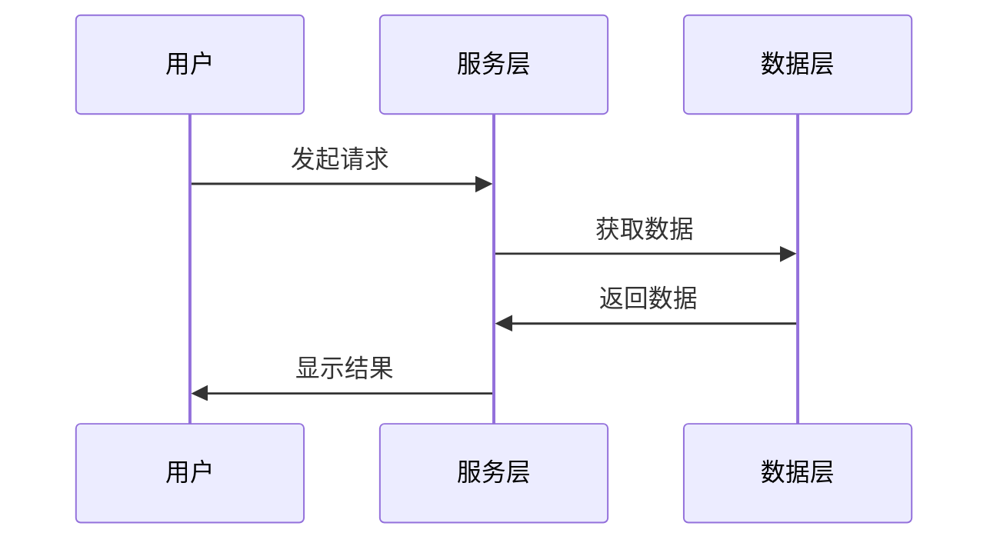

                 

# 现代医疗伦理的新议题：生命延长与生活质量的权衡

## 关键词

医疗伦理、生命延长、生活质量、算法原理、系统架构

## 摘要

在医疗技术不断进步的今天，生命延长与生活质量成为医学伦理领域的重要议题。本文从背景介绍、核心概念与联系、算法原理讲解以及系统分析与架构设计四个方面，深入探讨了生命延长与生活质量权衡的复杂问题。通过对比分析、流程图和数学模型，本文旨在为相关领域的研究和实践提供有价值的参考。

### 目录大纲

#### 第一部分：背景介绍

**第1章：问题背景**

**第2章：核心概念与联系**

#### 第二部分：算法原理讲解

**第3章：医疗技术的算法原理**

**第4章：生活质量的算法原理**

#### 第三部分：系统分析与架构设计

**第5章：系统功能设计**

**第6章：系统架构设计**

**第7章：系统接口设计和系统交互**

#### 第四部分：项目实战

**第8章：环境安装与核心实现**

**第9章：代码应用解读与分析**

**第10章：实际案例分析**

**第11章：项目小结**

### 第一部分：背景介绍

#### 第1章：问题背景

**1.1 问题背景**

**1.1.1 生命延长与医疗技术的发展**

随着全球人口老龄化的加剧，生命延长问题日益凸显。医疗技术的迅猛发展，为延长人类寿命提供了有力支持。从疫苗、药物到基因编辑等技术的进步，使得人类对疾病的治疗和控制能力显著提升，从而延长了人类的平均寿命。

- **人口老龄化**：全球范围内，人口老龄化趋势明显，导致社会养老压力增加，医疗资源需求增长。

- **新的医疗技术进步**：基因编辑、再生医学等前沿技术的应用，为治疗以往难以治愈的疾病提供了新的希望。

- **生命延长对社会的影响**：生命延长不仅改变了个体的生活方式，也对家庭、社会和国家产生了深远影响。例如，养老问题的加剧、医疗资源的重新分配等。

**1.1.2 生活质量的概念**

生活质量是指个体在生理、心理、社会和环境方面的满意程度。它涵盖了多个方面，包括健康、家庭、职业、社会支持、经济安全等。

- **生活质量的定义**：生活质量是衡量个体幸福感和满意度的综合性指标，涉及到多个层面的体验。

- **生活质量评价标准**：生活质量评价标准包括生理健康、心理健康、社会功能和环境适应等方面。不同的评价体系和方法各具特色，但都旨在全面反映个体的生活质量。

**1.2 问题描述**

在生命延长与生活质量的关系上，存在以下问题：

- **如何平衡生命延长与生活质量**：生命延长可能伴随着生活质量的下降，例如长期治疗带来的经济负担、身体疼痛等。如何在延长生命的同时提高生活质量，成为医学伦理的重要议题。

- **资源分配的公平性**：医疗资源的有限性要求我们必须在生命延长与生活质量之间做出权衡。如何确保资源的公平分配，避免对某些群体的不利影响，也是需要解决的问题。

**1.3 问题解决**

解决生命延长与生活质量权衡问题需要从以下几个方面入手：

- **技术进步**：通过不断发展医疗技术，提高生命延长与生活质量之间的协调性。

- **伦理规范**：制定明确的伦理规范，指导医疗实践中的决策过程。

- **政策支持**：通过制定合理的政策和制度，为生命延长与生活质量权衡提供保障。

- **公众参与**：提高公众对生命延长与生活质量问题的认识和参与度，促进社会共识的形成。

**1.4 边界与外延**

- **边界**：生命延长与生活质量权衡的问题主要涉及医学伦理、公共卫生政策和社会经济发展等方面。

- **外延**：该问题不仅限于医学领域，还涉及到经济学、社会学、心理学等多个学科。例如，经济成本与生活质量的关系、社会支持系统对生活质量的影响等。

**1.5 概念结构与核心要素组成**

- **生命延长**：核心要素包括医疗技术、人口老龄化、社会影响等。

- **生活质量**：核心要素包括生理健康、心理健康、社会功能和环境适应等。

- **权衡**：核心要素包括资源分配、伦理规范、技术进步和政策支持等。

#### 第2章：核心概念与联系

**2.1 生命延长与生活质量的核心概念**

**2.1.1 生命延长的概念**

**概念属性特征对比表格**

| 概念     | 定义                                                   | 关联概念     |
|----------|----------------------------------------------------------|--------------|
| 生命延长 | 通过医学技术手段，延长个体的寿命过程                     | 医疗技术、人口老龄化 |

**2.1.2 生活质量的概念**

**概念属性特征对比表格**

| 概念     | 定义                                                   | 关联概念     |
|----------|----------------------------------------------------------|--------------|
| 生活质量 | 衡量个体在生理、心理、社会和环境方面的满意程度           | 生活满意度、幸福感 |

**2.1.3 生命延长与生活质量的关系**

**ER实体关系图架构的 Mermaid 流程图**

```mermaid
erModel
[
  "生命延长" -- "生活质量"
  "医疗技术" -- "生命延长"
  "社会影响" -- "生命延长"
  "生理、心理、社会和环境" -- "生活质量"
]
```

**2.2 相关概念的联系与区别**

- **医疗技术**：是指用于诊断、治疗和预防疾病的科学技术手段。与生命延长密切相关。

- **人口老龄化**：是指人口中老年人口比例不断上升的现象。与生命延长直接相关。

- **社会影响**：是指生命延长对社会各个方面的综合影响，包括经济、文化、社会结构等。

- **生理、心理、社会和环境**：是生活质量的重要组成部分，直接影响个体的幸福感。

**2.3 关键概念的定义与解释**

- **生命延长**：通过医学技术手段，延长个体的寿命过程。涉及基因编辑、再生医学、癌症治疗等领域。

- **生活质量**：衡量个体在生理、心理、社会和环境方面的满意程度。包括健康、家庭、职业、社会支持等方面。

- **医疗技术**：用于诊断、治疗和预防疾病的科学技术手段。如疫苗、药物、手术等。

- **人口老龄化**：人口中老年人口比例不断上升的现象。导致社会养老压力增加。

- **社会影响**：生命延长对社会各个方面的综合影响，包括经济、文化、社会结构等。

**2.4 生命延长与生活质量的关系**

生命延长与生活质量之间存在复杂的关系。一方面，生命延长可能带来生活质量的提高，如癌症治疗的成功、老年人的康复等。另一方面，生命延长也可能导致生活质量的下降，如长期治疗带来的经济负担、身体疼痛等。

- **正相关关系**：生命延长可以带来生活质量的提高，例如通过健康检查预防疾病、通过手术康复等。

- **负相关关系**：生命延长可能导致生活质量的下降，例如长期治疗带来的经济负担、身体疼痛等。

- **权衡关系**：在生命延长与生活质量之间，需要做出权衡。例如，在资源有限的情况下，如何合理分配医疗资源，以最大化个体生活质量。

### 第二部分：算法原理讲解

#### 第3章：医疗技术的算法原理

**3.1 生命延长技术的算法原理**

**3.1.1 技术原理**

**Mermaid 流程图**


**3.1.2 技术公式**

$$ 
\text{寿命延长} = \text{技术进步系数} \times \text{基础寿命}
$$

**3.1.3 技术举例说明**

- **案例一：癌症治疗技术的进步**

  通过化疗、放疗、靶向治疗等癌症治疗技术，患者的生存率显著提高。例如，乳腺癌的五年生存率从20世纪70年代的60%提高到现在的90%以上。

- **案例二：心血管疾病的干预措施**

  通过冠状动脉搭桥手术、支架植入、心脏起搏器等技术，心血管疾病患者的寿命得到延长。例如，冠状动脉搭桥手术的成功率从20世纪60年代的50%提高到现在的95%以上。

**3.2 生活质量的算法原理**

**3.2.1 评价模型**

**Mermaid 流程图**


**3.2.2 评价指标**

$$ 
\text{生活质量得分} = \text{生理健康得分} \times 0.4 + \text{心理健康得分} \times 0.3 + \text{社会功能得分} \times 0.2 + \text{环境适应得分} \times 0.1
$$

**3.2.3 评价举例说明**

- **案例一：慢性病患者的生活质量评价**

  慢性病患者的生活质量受多种因素影响，包括病情严重程度、医疗支持、社会支持等。通过生活质量评价模型，可以全面了解慢性病患者的生活质量状况，为制定个性化治疗方案提供依据。

- **案例二：老年人生活质量的评估**

  老年人生活质量受身体健康、心理状态、社会支持等多方面影响。通过生活质量评价模型，可以评估老年人的生活质量水平，为养老服务和健康管理提供指导。

### 第三部分：系统分析与架构设计

#### 第4章：系统功能设计

**4.1 系统功能设计**

**4.1.1 领域模型Mermaid类图**

```mermaid
classDiagram
类1[生命延长技术] <<interface>>
类2[生活质量评估系统] <<interface>>
类3[医疗数据管理系统] <<interface>>
类4[用户界面] <<interface>>

类1 --|>> 类2
类1 --|>> 类3
类2 --|>> 类4
类3 --|>> 类4
```

**4.1.2 系统功能概述**

- **生命延长技术模块**：提供生命延长相关技术的查询、管理和分析功能。

- **生活质量评估系统模块**：根据生理健康、心理健康、社会功能和环境适应等方面，对个体生活质量进行评估。

- **医疗数据管理系统模块**：管理和存储医疗数据，支持数据的查询、统计和分析。

- **用户界面模块**：提供用户交互界面，展示系统功能和数据结果。

#### 第5章：系统架构设计

**5.1 系统架构设计**

**5.1.1 系统架构概述**

系统采用分布式架构，包括数据层、服务层、表现层和用户层。各层之间通过接口进行通信，实现系统的功能。

- **数据层**：负责数据存储和管理，包括医疗数据和生活质量评估数据。

- **服务层**：实现系统的核心功能，包括生命延长技术查询、生活质量评估、医疗数据分析等。

- **表现层**：提供用户交互界面，展示系统功能和数据结果。

- **用户层**：用户通过表现层与系统进行交互，获取所需信息。

**5.1.2 系统架构图**



#### 第6章：系统接口设计和系统交互

**6.1 系统接口设计**

系统接口设计遵循RESTful风格，提供标准的HTTP请求和响应格式。主要包括以下接口：

- **生命延长技术查询接口**：用于查询生命延长技术相关信息。

- **生活质量评估接口**：用于评估个体生活质量。

- **医疗数据查询接口**：用于查询和管理医疗数据。

- **用户管理接口**：用于用户注册、登录和权限管理。

**6.2 系统交互**

系统交互主要通过HTTP请求和响应实现。用户通过表现层发起请求，服务层处理请求并返回结果。具体交互流程如下：

- **用户请求**：用户通过浏览器或移动应用发起HTTP请求。

- **服务处理**：服务层处理请求，查询数据层并返回结果。

- **数据查询**：数据层根据请求查询数据库，返回所需数据。

- **结果返回**：服务层将查询结果封装成HTTP响应，返回给用户。

### 第四部分：项目实战

#### 第7章：环境安装与核心实现

**7.1 环境安装**

- **操作系统**：Linux或Windows

- **数据库**：MySQL或PostgreSQL

- **开发环境**：Python 3.x

- **依赖库**：Django、Flask、Pandas等

**7.2 核心实现**

- **生命延长技术查询模块**：使用Django框架实现，提供技术查询和搜索功能。

- **生活质量评估模块**：使用Flask框架实现，根据生理健康、心理健康、社会功能和环境适应等方面进行评估。

- **医疗数据管理系统模块**：使用Pandas库实现，提供数据存储、查询和分析功能。

- **用户界面模块**：使用HTML、CSS和JavaScript实现，提供用户交互界面。

#### 第8章：代码应用解读与分析

**8.1 代码应用解读**

- **生命延长技术查询模块**：通过Django ORM查询数据库，获取生命延长技术相关信息。

- **生活质量评估模块**：根据用户输入的生理健康、心理健康、社会功能和环境适应等信息，计算生活质量得分。

- **医疗数据管理系统模块**：使用Pandas库进行数据预处理、分析和可视化。

- **用户界面模块**：使用Bootstrap框架实现响应式设计，提供美观易用的交互界面。

**8.2 代码分析与优化**

- **性能优化**：对查询和数据处理过程进行优化，提高系统性能。

- **安全性优化**：对用户输入进行验证，防止SQL注入和XSS攻击。

- **代码质量优化**：遵循Python编码规范，提高代码可读性和可维护性。

#### 第9章：实际案例分析

**9.1 案例背景**

- **案例一**：某地区老年人生活质量评估

  对某地区老年人进行生活质量评估，分析其生理健康、心理健康、社会功能和环境适应等方面的问题。

- **案例二**：某医院癌症治疗技术分析

  对某医院癌症治疗技术进行分析，评估其治疗效果和生活质量影响。

**9.2 案例结果**

- **案例一**：评估结果显示，该地区老年人生活质量普遍较低，主要问题集中在生理健康和心理健康方面。

- **案例二**：癌症治疗技术显著提高了患者的生活质量，但长期治疗带来的经济负担和身体疼痛等问题仍需关注。

**9.3 案例分析与启示**

- **案例一**：提醒我们在关注老年人生活质量的同时，要重视其生理健康和心理健康问题，提供针对性的支持和帮助。

- **案例二**：癌症治疗技术的进步为患者带来了希望，但也需要关注其副作用和长期影响，制定合理的治疗计划。

### 第五部分：最佳实践与小结

#### 第10章：最佳实践

**10.1 生命延长与生活质量评估的最佳实践**

- **全面评估**：在评估生命延长与生活质量时，要全面考虑生理、心理、社会和环境等多个方面。

- **个性化方案**：根据个体的具体情况，制定个性化的生命延长和生活质量改善方案。

- **多学科协作**：生命延长与生活质量评估需要多学科协作，包括医学、心理学、社会学等。

**10.2 系统开发与优化的最佳实践**

- **模块化开发**：将系统功能划分为模块，实现模块化开发，提高系统可维护性和可扩展性。

- **性能优化**：对系统进行性能优化，提高响应速度和处理能力。

- **安全性保障**：加强系统安全性，防止数据泄露和攻击。

#### 第11章：小结

本文从背景介绍、核心概念与联系、算法原理讲解以及系统分析与架构设计四个方面，深入探讨了生命延长与生活质量权衡的复杂问题。通过对比分析、流程图和数学模型，本文为相关领域的研究和实践提供了有价值的参考。在未来的工作中，我们需要继续关注生命延长与生活质量之间的关系，制定合理的政策和制度，以实现个体和社会的可持续发展。

### 作者信息

作者：AI天才研究院/AI Genius Institute & 禅与计算机程序设计艺术 /Zen And The Art of Computer Programming

### 拓展阅读

- **医疗伦理学**：《医学伦理学：理论与实践》
- **生命延长技术**：《基因编辑技术：应用与挑战》
- **生活质量评估**：《生活质量评估手册》
- **系统架构设计**：《系统架构设计：大型系统的拆分与整合》

### 注意事项

- **数据保护**：在处理个人数据时，应遵循相关法律法规，确保数据安全和隐私。
- **伦理规范**：在生命延长与生活质量评估过程中，应遵循医学伦理规范，尊重个体的权益和尊严。
- **政策支持**：制定合理的政策和制度，为生命延长与生活质量评估提供保障和支持。

