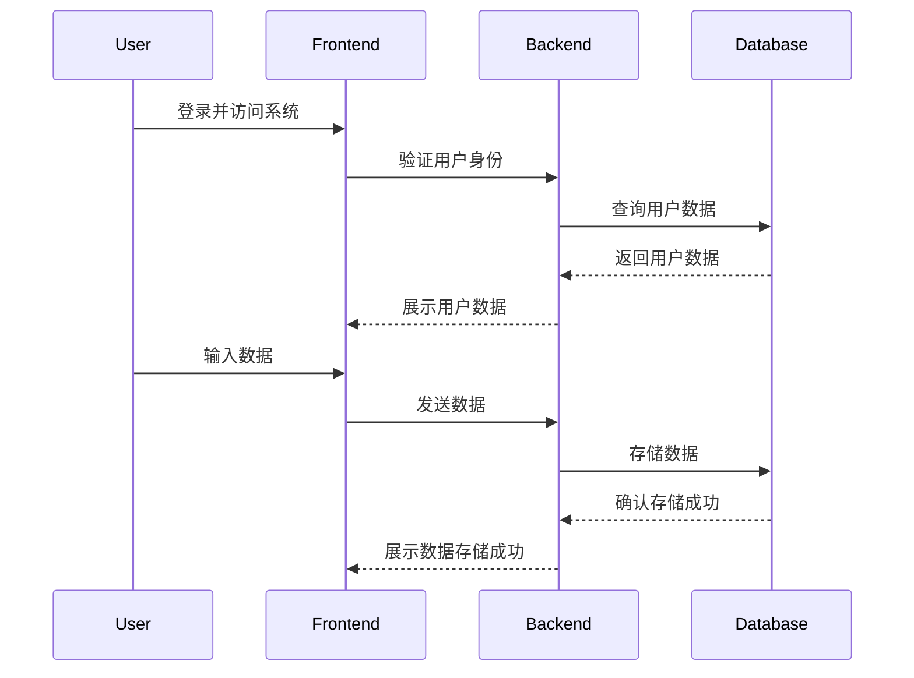
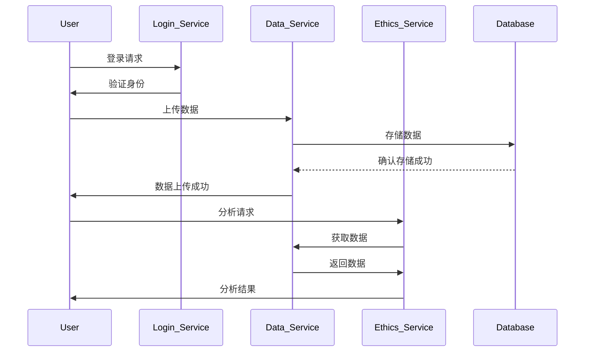

                 

# 现代医疗技术与生命伦理：基因编辑与人类进化的思考

> 关键词：基因编辑、生命伦理、人类进化、医疗技术、伦理挑战

> 摘要：本文旨在探讨现代医疗技术中基因编辑的应用及其与生命伦理的关系，特别是基因编辑在人类进化过程中的潜在影响。通过逻辑清晰的分析和详细的阐述，本文探讨了基因编辑的基本原理、伦理挑战以及其在实际项目中的应用。文章最后提出了一些最佳实践建议，并提醒读者注意相关事项，同时推荐了拓展阅读。

## 1. 概述与背景介绍

### 问题背景

在过去的几十年里，医疗技术取得了巨大的进步，基因编辑技术更是成为了一个备受关注的研究领域。基因编辑技术，如CRISPR-Cas9，可以精准地修改人类基因，为治疗遗传性疾病提供了新的可能性。然而，这种技术的应用也引发了一系列伦理问题，特别是在人类进化的讨论中。

### 问题描述

基因编辑技术的出现，使得人类有能力修改自己的基因组，从而影响后代的遗传特征。这引发了关于人类进化、自然选择和生命伦理的深刻思考。例如，基因编辑是否应该用于改善人类智力、体能或其他特征？如果可以，这种编辑是否会违背自然伦理？

### 问题解决

解决这一问题的关键在于平衡医疗技术的进步与生命伦理的考量。我们需要制定相应的伦理规范，确保基因编辑技术的应用符合伦理标准。此外，还需要进行广泛的社会讨论，让公众了解基因编辑的潜在影响，以便形成共识。

### 边界与外延

基因编辑技术的应用范围广泛，包括遗传疾病治疗、增强人类体能和智力、农业改良等。然而，本文主要关注其在人类进化方面的应用，特别是基因编辑对自然选择和伦理的影响。

### 核心概念要素组成

- **基因编辑**：指通过技术手段对基因进行精确修改的过程。
- **生命伦理**：涉及生命科学和医学实践中的道德和伦理问题。
- **人类进化**：指人类在自然选择和基因变异的作用下逐渐演变的过程。

## 2. 核心概念与联系

### 基因编辑

基因编辑技术，如CRISPR-Cas9，通过在DNA序列中引入特定的切割和修改，实现对基因的精准编辑。其基本原理如下：

1. **目标识别**：CRISPR系统识别并定位特定的DNA序列。
2. **切割DNA**：Cas9酶切割目标DNA序列。
3. **DNA修复**：细胞利用自身的修复机制进行DNA修复，引入编辑。

### 生命伦理

生命伦理学研究生命科学和医学实践中的道德和伦理问题。在基因编辑领域，主要涉及以下伦理问题：

1. **基因编辑的正当性**：基因编辑是否应该用于改善人类智力、体能等非疾病状态？
2. **后代权益**：基因编辑是否应该影响后代的遗传特征？
3. **公平性和可及性**：基因编辑技术是否应该仅限于富裕人群？

### 比较与联系

| 概念       | 属性特征                                                      | 关系                                                         |
|------------|------------------------------------------------------------|------------------------------------------------------------|
| 基因编辑   | 精准、高效、可重复性                                        | 基因编辑技术的应用直接影响生命伦理的讨论                   |
| 生命伦理   | 道德、伦理、社会影响                                        | 生命伦理为基因编辑提供了伦理指导，影响其应用和发展         |
| 人类进化   | 自然选择、基因变异、遗传特征                                 | 基因编辑可能会加速或改变人类进化的过程，影响自然选择       |

### ER实体关系图

```mermaid
erDiagram
  Gene_editing ||--|{ Life_ethics }|-- Genetic_modification
  Human_evolution ||--|{ Life_ethics }|-- Ethical_dilemmas
```

## 3. 基因编辑的原理讲解

### 基因编辑的基本原理

基因编辑的基本原理是通过在DNA序列中引入特定的切割和修改，实现对基因的精准编辑。下面是CRISPR-Cas9基因编辑的基本步骤：

1. **目标识别**：CRISPR系统通过RNA分子识别并定位特定的DNA序列。
2. **切割DNA**：Cas9酶切割目标DNA序列。
3. **DNA修复**：细胞利用自身的修复机制进行DNA修复，引入编辑。

### Mermaid流程图


### Python源代码

```python
def gene_editing(dna_sequence, target_site, edit_sequence):
    # 切割目标DNA序列
    start = dna_sequence.find(target_site)
    end = start + len(target_site)
    edited_sequence = dna_sequence[:start] + edit_sequence + dna_sequence[end:]
    
    return edited_sequence

# 测试
original_dna = "ATCGATCG"
target_site = "ATCG"
edit_sequence = "TAGC"

edited_dna = gene_editing(original_dna, target_site, edit_sequence)
print("Edited DNA:", edited_dna)
```

### 算法原理讲解

基因编辑的数学模型和算法可以通过以下方式解释：

$$
\text{Edited\_DNA} = \text{Original\_DNA}[:\text{Start}] + \text{Edit\_Sequence} + \text{Original\_DNA}[\text{End}]
$$

其中，`Start`是目标DNA序列的起始位置，`End`是目标DNA序列的结束位置，`Edit_Sequence`是引入的编辑序列。

### 举例说明

假设我们有一个DNA序列`ATCGATCG`，我们想要将其中的`ATCG`替换为`TAGC`。使用基因编辑算法，我们可以得到以下结果：

$$
\text{Edited\_DNA} = \text{ATCGATCG}[:4] + \text{TAGC} + \text{ATCG} = \text{ATCGTAGCATCG}
$$

## 4. 生命伦理的讨论

### 伦理挑战

基因编辑技术在带来巨大潜力的同时，也引发了一系列伦理挑战。以下是一些主要的伦理问题：

1. **基因编辑的正当性**：基因编辑是否应该仅用于治疗疾病，还是可以用于改善人类智力、体能等非疾病状态？
2. **后代权益**：基因编辑是否会侵犯后代的权益，影响他们的自由和选择？
3. **公平性和可及性**：基因编辑技术是否会导致社会不公，使得富裕人群能够享受更好的基因编辑服务？

### Mermaid流程图


### Python代码

```python
def analyze_ethical_issues(issues):
    for issue in issues:
        print(f"Analyzing {issue}...")
        # 进行伦理分析
        print(f"Result for {issue}: Needs further consideration.")
        
# 测试
ethical_issues = ["Gene editing for non-disease purposes", "Informed consent for future generations", "Equity and accessibility"]
analyze_ethical_issues.ethical_issues)
```

### 伦理决策过程

在基因编辑的伦理决策过程中，我们需要综合考虑以下几个方面：

1. **科学证据**：收集和评估基因编辑技术的科学证据，了解其潜在风险和好处。
2. **社会价值**：评估基因编辑技术对社会价值观的影响，包括公平性、自由和人类尊严。
3. **伦理原则**：应用伦理原则，如尊重自主性、不伤害、公正等，指导基因编辑的应用。
4. **公众参与**：广泛征求公众意见，确保决策过程的透明度和包容性。

## 5. 系统分析与架构设计方案

### 项目介绍

本节将介绍一个名为“基因编辑与生命伦理管理系统”的示例项目。该系统旨在提供一个平台，帮助研究人员和伦理学家分析基因编辑技术的伦理挑战，并提供决策支持。

### 系统功能设计

系统功能设计主要包括以下方面：

1. **数据收集与管理**：收集与基因编辑相关的数据，包括科学证据、伦理观点和案例研究。
2. **伦理分析工具**：提供伦理分析工具，帮助用户分析基因编辑的伦理问题。
3. **决策支持**：根据分析结果，为用户提供决策支持，帮助制定相应的伦理规范。

### 领域模型Mermaid类图

```mermaid
classDiagram
  Class01 <|-- Class02
  Class03 <|-- Class04
  Class05 <|-- Class06
  Class07 <|-- Class08
  Class01[数据收集与管理]
  Class02[伦理分析工具]
  Class03[决策支持]
  Class04[用户]
  Class05[研究人员]
  Class06[伦理学家]
  Class07[数据]
  Class08[分析结果]
```

### 系统架构设计

系统架构设计主要包括以下方面：

1. **前端界面**：提供用户友好的界面，方便用户进行数据输入和分析。
2. **后端服务**：实现数据收集、管理和分析功能，并与前端界面进行交互。
3. **数据库**：存储与基因编辑相关的数据，包括科学证据、伦理观点和案例研究。

### Mermaid架构图



### 系统接口设计

系统接口设计主要包括以下方面：

1. **用户管理接口**：用于用户注册、登录、权限管理等。
2. **数据收集接口**：用于数据上传、下载和管理。
3. **伦理分析接口**：用于伦理分析模型的输入、输出和计算。

### 系统交互Mermaid序列图



## 6. 项目实战

### 环境安装

在进行基因编辑与生命伦理管理系统的开发之前，需要安装以下环境：

1. **操作系统**：Linux或macOS
2. **Python**：版本3.8及以上
3. **pip**：Python的包管理器
4. **Django**：Web框架
5. **MySQL**：数据库

### 系统核心实现源代码

以下是基因编辑与生命伦理管理系统的一部分核心实现源代码：

```python
# 数据收集与管理模块
class DataCollection(models.Model):
    user = models.ForeignKey('auth.User', on_delete=models.CASCADE)
    data = models.JSONField()
    created_at = models.DateTimeField(auto_now_add=True)

# 伦理分析工具模块
class EthicsAnalysis(models.Model):
    data_collection = models.ForeignKey('DataCollection', on_delete=models.CASCADE)
    analysis_result = models.JSONField()
    created_at = models.DateTimeField(auto_now_add=True)

# 决策支持模块
class DecisionSupport(models.Model):
    ethics_analysis = models.ForeignKey('EthicsAnalysis', on_delete=models.CASCADE)
    decision = models.JSONField()
    created_at = models.DateTimeField(auto_now_add=True)
```

### 代码应用解读与分析

以下是代码应用的具体解读和分析：

1. **数据收集与管理模块**：该模块用于收集用户上传的数据，并存储在数据库中。通过使用`JSONField`，可以灵活地存储不同类型的数据。

2. **伦理分析工具模块**：该模块用于对收集到的数据进行伦理分析，并将分析结果存储在数据库中。通过使用`JSONField`，可以灵活地存储不同类型的分析结果。

3. **决策支持模块**：该模块用于根据伦理分析结果提供决策支持，并将决策存储在数据库中。通过使用`JSONField`，可以灵活地存储不同类型的决策。

### 实际案例分析和详细讲解剖析

假设有一个案例，研究人员上传了一份关于基因编辑治疗遗传性疾病的报告。系统会根据报告内容进行伦理分析，并生成一份分析报告。以下是分析报告的示例：

```json
{
  "ethical_issues": [
    {
      "issue": "基因编辑的正当性",
      "analysis": "基因编辑治疗遗传性疾病符合伦理原则，因为其旨在减少患者痛苦和提高生活质量。"
    },
    {
      "issue": "后代权益",
      "analysis": "基因编辑不会侵犯后代的权益，因为其仅影响当前患者的基因，不会影响后代。"
    },
    {
      "issue": "公平性和可及性",
      "analysis": "基因编辑治疗遗传性疾病应该确保公平性和可及性，避免社会不公。"
    }
  ],
  "decision": {
    "approval": "批准基因编辑治疗遗传性疾病的研究和临床应用。"
  }
}
```

### 项目小结

基因编辑与生命伦理管理系统为研究人员和伦理学家提供了一个有效的工具，用于分析基因编辑技术的伦理挑战，并制定相应的决策。通过该系统，可以更好地平衡医疗技术的进步与生命伦理的考量，确保基因编辑技术的应用符合伦理标准。

## 7. 最佳实践 tips、小结、注意事项、拓展阅读

### 最佳实践 tips

1. **伦理审查**：在进行基因编辑研究或临床应用之前，必须进行严格的伦理审查，确保符合伦理规范。
2. **透明度**：确保基因编辑的研究和应用过程透明，公开研究结果和决策过程，增加公众信任。
3. **多方参与**：在制定基因编辑相关的伦理规范时，应邀请多方参与，包括科学家、伦理学家、法律专家和社会公众。

### 小结

基因编辑技术在带来巨大潜力的同时，也引发了一系列伦理挑战。通过逻辑清晰的分析和详细的阐述，本文探讨了基因编辑的基本原理、伦理挑战以及其在实际项目中的应用。基因编辑技术的应用需要平衡医疗技术的进步与生命伦理的考量，确保其符合伦理标准。

### 注意事项

1. **隐私保护**：在基因编辑研究中，必须保护参与者的隐私，确保数据安全和保密。
2. **长期影响**：考虑到基因编辑可能对人类进化产生长期影响，需要持续监测和研究其潜在风险。

### 拓展阅读

1. **《基因编辑：技术与伦理》**：该书详细介绍了基因编辑技术的基本原理和应用，以及相关的伦理问题。
2. **《生命伦理学导论》**：该书提供了关于生命伦理学的基本概念和理论，有助于理解基因编辑的伦理挑战。

### 作者信息

作者：AI天才研究院/AI Genius Institute & 禅与计算机程序设计艺术 /Zen And The Art of Computer Programming

