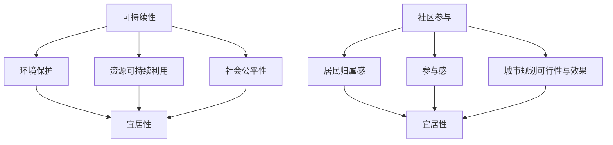
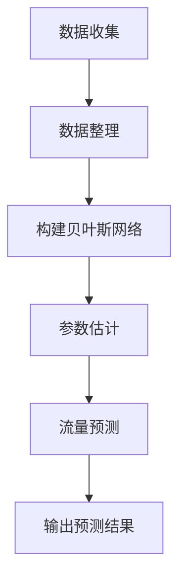
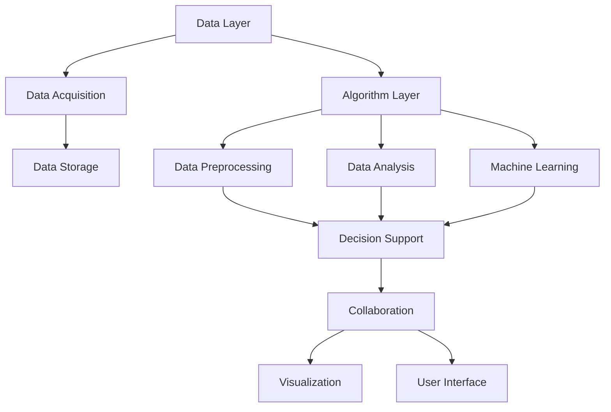
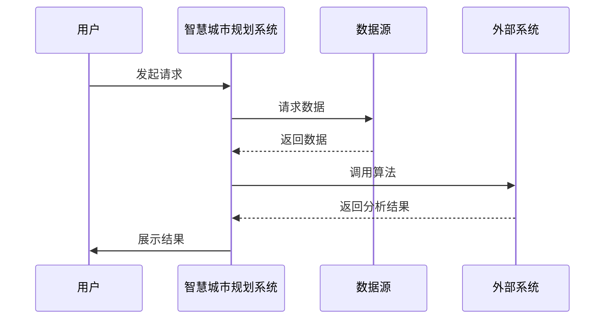

                 

# 现代城市规划的人文关怀：从功能主义到宜居设计

## 关键词
现代城市规划，人文关怀，功能主义，宜居设计，可持续性，社区参与，智慧城市，算法原理，数学模型，系统架构，项目实战，最佳实践

## 摘要
本文深入探讨现代城市规划中的人文关怀，从功能主义转向宜居设计的转变。文章首先介绍了城市规划的发展历程和关键概念，接着详细分析了核心概念之间的联系，以及与城市规划相关的算法原理和数学模型。随后，文章通过一个智慧城市规划系统的案例，展示了系统分析与架构设计的方法，并分享了项目实战的经验。最后，文章总结了最佳实践，为城市规划提供了有益的指导和建议。

### 目录大纲设计思路

在设计《现代城市规划的人文关怀：从功能主义到宜居设计》这本书的完整目录大纲时，我们的目标是确保内容结构清晰、逻辑严密，同时能够吸引读者的兴趣。以下是我们遵循的步骤：

1. **确定书籍的核心主题和目标读者**：明确书籍的主题是探讨现代城市规划中的人文关怀，以及从功能主义向宜居设计的转变。目标读者包括城市规划专业的学生、从业者以及相关领域的研究人员。

2. **定义核心章节**：根据主题，我们确定了以下核心章节：
   - 城市规划的发展历程
   - 功能主义与宜居设计的定义与区别
   - 核心概念与联系
   - 算法原理讲解
   - 数学模型和公式讲解
   - 系统分析与架构设计方案
   - 项目实战
   - 最佳实践、小结、注意事项、拓展阅读

3. **细化章节内容**：对每个核心章节进行了内容细化，确保每个章节都有详细的结构和具体内容。

4. **确保内容完整性**：每个章节都包含必要的内容，如背景介绍、核心概念、算法原理、数学模型、系统架构设计、项目实战等。

5. **编写markdown格式大纲**：使用markdown格式编写目录大纲，确保格式清晰、简洁，便于读者阅读。

### 目录大纲示例

```markdown
----------------------------------------------------------------
# 第一部分：现代城市规划的背景

## 1.1 城市规划的发展历程

## 1.2 功能主义与宜居设计的定义与区别

## 1.3 可持续城市、社区参与等核心概念

----------------------------------------------------------------

# 第二部分：核心概念与联系

## 2.1 城市规划核心概念

### 2.1.1 可持续性的概念

### 2.1.2 宜居性的概念

### 2.1.3 社区参与的机制

## 2.2 核心概念联系流程图

----------------------------------------------------------------

# 第三部分：算法原理讲解

## 3.1 城市交通流量分析算法

### 3.1.1 算法原理

### 3.1.2 算法流程图

### 3.1.3 Python代码实现

----------------------------------------------------------------

# 第四部分：数学模型和公式讲解

## 4.1 城市扩张模型

### 4.1.1 模型介绍

### 4.1.2 数学公式

### 4.1.3 模型应用举例

----------------------------------------------------------------

# 第五部分：系统分析与架构设计方案

## 5.1 智慧城市规划系统

### 5.1.1 项目介绍

### 5.1.2 系统功能设计

### 5.1.3 系统架构设计

### 5.1.4 系统接口设计和系统交互

----------------------------------------------------------------

# 第六部分：项目实战

## 6.1 实战环境安装

## 6.2 系统核心实现源代码

## 6.3 代码应用解读与分析

## 6.4 实际案例分析和详细讲解

----------------------------------------------------------------

# 第七部分：最佳实践 tips、小结、注意事项、拓展阅读

## 

----------------------------------------------------------------
```

### 背景介绍

#### 城市规划的发展历程

城市规划的历史可以追溯到古代文明的兴起，如古埃及和古希腊，当时城市规划主要是以防御和行政功能为主。然而，现代城市规划的理念和实践始于工业革命时期。随着城市化进程的加快，城市规模不断扩大，人口密度急剧增加，城市规划开始注重解决城市基础设施、交通和居住环境等问题。

19世纪末至20世纪初，功能主义（Functionalism）在城市规划中占据主导地位。功能主义主张将城市划分为不同的功能区，如住宅区、商业区、工业区等，以实现各功能之间的有效分离和高效运作。这一时期的代表人物包括英国的埃比尼泽·霍华德（Ebenezer Howard）和法国的卡米耶·帕吕德（Camille Patte）。

进入20世纪中叶，现代城市规划逐渐从功能主义向宜居设计（Liveability Design）转变。宜居设计强调城市环境的人性化、舒适性和可持续性，追求人与自然、社会和环境之间的和谐共处。这一转变受到了全球环境问题、社会变革和技术进步等多方面因素的影响。

#### 功能主义与宜居设计的定义与区别

功能主义（Functionalism）是一种城市规划理念，主张将城市划分为不同的功能区，以实现各功能之间的有效分离和高效运作。功能主义的核心理念包括：

- **功能分离**：将住宅、商业、工业等不同功能的需求和活动分离到不同的区域内，以减少相互干扰。
- **高效运作**：通过科学的规划和管理，提高城市的运作效率。
- **标准化**：强调城市规划和建设的标准化，以降低成本和提高效率。

宜居设计（Liveability Design）则更注重城市环境的人性化、舒适性和可持续性。宜居设计的核心理念包括：

- **人性化**：关注人的需求，提高生活质量和舒适度。
- **舒适性**：通过优化城市环境，提高居民的生活质量。
- **可持续性**：强调环境保护和资源的可持续利用，以减少对自然环境的负面影响。

从功能主义到宜居设计的转变，反映了城市规划从单一功能导向向综合性、整体性发展的趋势。这一转变不仅关注城市的物理空间布局，还关注城市的社会、经济和环境等方面。

#### 核心概念与联系

城市规划中的核心概念包括可持续性（Sustainability）、宜居性（Liveability）、社区参与（Community Engagement）等。这些概念之间存在着密切的联系和相互作用。

- **可持续性**：指的是满足当前需求而不损害子孙后代满足其需求的能力。在城市规划中，可持续性关注城市的环境保护、资源的可持续利用和社会的公平性。

- **宜居性**：指的是城市环境对居民生活质量的满足程度。宜居性包括城市的舒适性、安全性、便利性等方面，是城市规划的重要目标。

- **社区参与**：指的是居民参与城市规划和管理的过程。社区参与有助于增强居民的归属感和参与感，提高城市规划的可行性和效果。

#### 核心概念联系流程图

为了更好地展示核心概念之间的联系，我们使用Mermaid流程图进行表示：



通过这个流程图，我们可以清晰地看到可持续性、宜居性和社区参与之间的相互关系。这些核心概念共同构成了现代城市规划的基础，推动了城市从功能主义向宜居设计的转变。

### 核心概念与联系

#### 可持续性的概念

可持续性是一种关注长期发展而非短期利益的理念。在城市规划中，可持续性的核心理念是满足当前需求的同时，不损害子孙后代满足其需求的能力。可持续性包括三个主要方面：环境保护、资源可持续利用和社会公平性。

- **环境保护**：指的是通过减少污染、保护生态系统和合理利用自然资源，维持城市环境的健康和可持续发展。例如，通过绿色基础设施（如城市绿地、湿地和河流）来改善城市空气质量、降低洪水风险和促进生物多样性。

- **资源可持续利用**：指的是在城市规划和建设中，合理利用和分配资源，确保资源的长期供应和可持续利用。例如，通过提高能源效率、使用可再生能源和推广节水技术来减少对自然资源的依赖。

- **社会公平性**：指的是在城市规划中，确保社会各阶层和群体的利益得到公平对待，减少社会不平等和贫富差距。例如，通过提供平等的教育和就业机会，改善基础设施和服务，使所有人都能享受到良好的生活条件。

#### 宜居性的概念

宜居性指的是城市环境对居民生活质量的满足程度。宜居性包括多个方面，如城市的舒适性、安全性、便利性等，是城市规划的重要目标。

- **舒适性**：指的是城市环境对居民身体和心理的舒适程度。包括适宜的气候、良好的空气质量、充足的绿地等。舒适性直接影响居民的生活质量和幸福感。

- **安全性**：指的是城市环境对居民的安全保障程度。包括犯罪率低、交通安全、公共安全设施完善等。安全性是居民选择居住地的重要因素之一。

- **便利性**：指的是城市环境为居民提供的各种便利条件，如良好的交通网络、便捷的公共服务、丰富的娱乐和文化活动等。便利性可以提升居民的生活质量和幸福感。

#### 社区参与的机制

社区参与是指居民参与城市规划和管理的过程。通过社区参与，可以增强居民的归属感和参与感，提高城市规划的可行性和效果。

- **社区参与的形式**：社区参与的形式多种多样，包括居民会议、问卷调查、公开论坛、公民议会等。这些形式有助于居民表达意见和建议，为城市规划提供宝贵的参考。

- **社区参与的意义**：社区参与有助于增强居民对城市规划的理解和认同，提高规划的实施效果。同时，社区参与可以促进居民的社会参与和公民意识，增强社区的凝聚力和活力。

- **社区参与的实施策略**：为了有效地实施社区参与，可以采取以下策略：
  - **信息透明**：确保居民获得充分的信息，了解城市规划的目标、方案和影响。
  - **互动平台**：建立互动平台，如网站、社交媒体和社区活动，方便居民参与和交流。
  - **激励机制**：通过奖励和表彰等方式，激励居民积极参与城市规划。

#### 核心概念属性特征对比表格

为了更直观地比较可持续性、宜居性和社区参与的属性特征，我们可以创建一个对比表格：

| 核心概念 | 属性特征 |
|----------|----------|
| 可持续性 | - 环境保护<br>- 资源可持续利用<br>- 社会公平性 |
| 宜居性   | - 舒适性<br>- 安全性<br>- 便利性 |
| 社区参与 | - 参与形式多样<br>- 增强归属感和参与感<br>- 提高规划可行性和效果 |

通过这个对比表格，我们可以清晰地看到这三个核心概念在属性特征上的差异和联系。

#### 核心概念联系流程图

为了进一步展示核心概念之间的联系，我们可以使用Mermaid流程图进行表示：


通过这个流程图，我们可以清晰地看到可持续性、宜居性和社区参与之间的相互关系。这些核心概念共同构成了现代城市规划的基础，推动了城市从功能主义向宜居设计的转变。

### 算法原理讲解

在本文的第三部分，我们将讨论与城市规划相关的算法原理，并以城市交通流量分析算法为例进行详细讲解。

#### 城市交通流量分析算法

城市交通流量分析是城市规划中的重要组成部分，它有助于优化交通网络、减少拥堵和提高交通效率。本文将介绍一个常见且实用的城市交通流量分析算法——基于贝叶斯网络的流量预测算法。

#### 算法原理

贝叶斯网络是一种概率图模型，用于表示变量之间的概率关系。在城市交通流量分析中，贝叶斯网络可以帮助我们预测不同时间段的交通流量，并识别影响交通流量的关键因素。

贝叶斯网络由两部分组成：节点和边。节点表示变量，边表示变量之间的条件依赖关系。在贝叶斯网络中，每个节点的概率分布可以通过其父节点的概率分布计算得到。

算法原理如下：

1. **构建贝叶斯网络**：首先，我们需要收集并整理与城市交通流量相关的数据，如历史交通流量数据、道路状况数据、天气数据等。然后，根据这些数据构建贝叶斯网络，确定节点和边的关系。

2. **参数估计**：通过贝叶斯网络的参数估计，我们可以得到每个节点的条件概率分布。参数估计通常采用最大似然估计（Maximum Likelihood Estimation, MLE）或贝叶斯估计（Bayesian Estimation）等方法。

3. **流量预测**：在贝叶斯网络构建完成后，我们可以利用贝叶斯推理（Bayesian Inference）方法进行流量预测。具体来说，我们可以通过输入当前的道路状况、天气等变量，利用贝叶斯网络计算未来时间段的交通流量概率分布。

#### 算法流程图

为了更直观地展示算法流程，我们使用Mermaid流程图进行表示：



#### Python代码实现

以下是一个简化的Python代码示例，用于实现基于贝叶斯网络的城市交通流量预测算法：

```python
import numpy as np
import pandas as pd
from sklearn.model_selection import train_test_split
from pyBayesNets import BayesianNetwork

# 读取历史交通流量数据
data = pd.read_csv('traffic_data.csv')

# 构建贝叶斯网络
network = BayesianNetwork()
network.add_nodes(['time', 'weather', 'road_condition', 'traffic_volume'])

network.add_edges([('time', 'weather'), ('weather', 'road_condition'), ('road_condition', 'traffic_volume')])

# 参数估计
model = network.estimate_parameters(data)

# 流量预测
predicted_volume = network.predict('traffic_volume', {'time': '08:00', 'weather': 'sunny', 'road_condition': 'good'})

print(f"Predicted traffic volume: {predicted_volume['traffic_volume']}")
```

#### 算法原理讲解

1. **贝叶斯网络的基本概念**：
   - **节点**：表示交通流量分析中的变量，如时间、天气、道路状况和交通流量。
   - **边**：表示变量之间的条件依赖关系。例如，天气可能影响道路状况，道路状况又影响交通流量。

2. **参数估计**：
   - **最大似然估计（MLE）**：通过最大化历史数据中出现过的样本的概率来估计参数。
   - **贝叶斯估计**：通过结合历史数据和先验知识来估计参数。

3. **流量预测**：
   - **贝叶斯推理**：利用已知的条件概率分布和贝叶斯网络结构，计算目标变量的概率分布。

#### 数学模型和公式讲解

在贝叶斯网络中，每个节点的概率分布可以用条件概率表（Conditional Probability Table, CPT）来表示。例如，对于交通流量（\( V \)）节点，其条件概率表可以表示为：

$$
P(V|W_1, W_2, ..., W_n) = \sum_{V'} P(V' | W_1, W_2, ..., W_n) P(V' | W_1, W_2, ..., W_n)^T
$$

其中，\( W_1, W_2, ..., W_n \) 是交通流量 \( V \) 的父节点，\( V' \) 是交通流量的可能取值。

#### 详细讲解和举例说明

假设我们有以下简单的贝叶斯网络：

- **时间**（\( T \)）：可能的取值有早晨（\( T_m \)）、下午（\( T_a \)）和晚上（\( T_n \)）。
- **天气**（\( W \)）：可能的取值有晴天（\( W_s \)）、阴天（\( W_y \)）和雨天（\( W_r \)）。
- **道路状况**（\( R \)）：可能的取值有良好（\( R_g \)）、一般（\( R_n \)）和拥堵（\( R_c \)）。
- **交通流量**（\( V \)）：可能的取值有低（\( V_l \)）、中（\( V_m \)）和高（\( V_h \)）。

我们可以为每个节点创建条件概率表：

$$
P(T_m | W_s) = 0.6, \quad P(T_a | W_y) = 0.5, \quad P(T_n | W_r) = 0.3
$$

$$
P(W_s | T_m) = 0.8, \quad P(W_y | T_a) = 0.7, \quad P(W_r | T_n) = 0.9
$$

$$
P(R_g | W_s) = 0.9, \quad P(R_n | W_y) = 0.6, \quad P(R_c | W_r) = 0.8
$$

$$
P(V_l | R_g) = 0.4, \quad P(V_m | R_n) = 0.7, \quad P(V_h | R_c) = 0.9
$$

要预测在特定条件下的交通流量，我们可以使用贝叶斯推理：

$$
P(V_h | T_n, W_r) = \frac{P(T_n | W_r) P(W_r) P(V_h | R_c) P(R_c | W_r)}{P(T_n | W_r) P(W_r) P(V_h | R_c) P(R_c | W_r) + P(T_n | W_r) P(W_r) P(V_m | R_n) P(R_n | W_r) + P(T_n | W_r) P(W_r) P(V_l | R_g) P(R_g | W_s)}
$$

将具体的概率值代入上述公式，我们可以计算出在特定条件下的交通流量概率。

#### 总结

本文介绍了城市交通流量分析算法的原理，包括贝叶斯网络的基本概念、参数估计和流量预测。通过一个具体的例子，我们展示了如何使用贝叶斯网络进行交通流量预测。这一算法在提高交通效率和改善城市交通管理方面具有广泛的应用前景。

### 数学模型和公式讲解

在城市规划中，数学模型和公式是理解和优化城市规划的关键工具。本文将介绍一个常见的数学模型——城市扩张模型，并使用LaTeX格式书写相关公式，进行详细讲解和举例说明。

#### 城市扩张模型

城市扩张模型用于描述城市在时间维度上的空间增长过程。该模型通常基于人口增长、经济发展和土地利用率等因素。一个简单的城市扩张模型可以表示为：

\[ S(t) = S_0 + r \cdot t \]

其中：
- \( S(t) \) 表示时间 \( t \) 时的城市面积。
- \( S_0 \) 表示初始城市面积。
- \( r \) 表示城市面积的增长速率。

#### 公式讲解

为了更详细地描述城市扩张过程，我们可以引入更多变量，构建一个更加复杂的模型。例如，我们可以考虑城市人口增长对城市扩张的影响，此时模型可以表示为：

\[ S(t) = S_0 + r_1 \cdot P(t) + r_2 \cdot t \]

其中：
- \( P(t) \) 表示时间 \( t \) 时的城市人口。
- \( r_1 \) 表示人口增长对城市面积的影响系数。
- \( r_2 \) 表示独立于人口增长的城市面积增长速率。

进一步，我们可以考虑经济因素对城市扩张的影响，构建一个多变量模型：

\[ S(t) = S_0 + r_1 \cdot P(t) + r_2 \cdot G(t) + r_3 \cdot t \]

其中：
- \( G(t) \) 表示时间 \( t \) 时的城市经济水平。
- \( r_2 \) 表示经济水平对城市面积的影响系数。
- \( r_3 \) 表示独立于人口和经济增长的城市面积增长速率。

#### 举例说明

假设一个城市在 \( t=0 \) 时，初始城市面积为 \( S_0 = 100 \) 平方公里，人口 \( P(0) = 50,000 \)，经济增长水平 \( G(0) = 100 \) 亿元。如果人口增长速率 \( r_1 = 1.5\% \)，经济增长水平增长速率 \( r_2 = 2\% \)，城市面积独立增长速率 \( r_3 = 1\% \)，我们可以计算未来某一时点的城市面积。

假设我们要计算 \( t = 10 \) 年后的城市面积：

\[ S(10) = 100 + 1.5\% \cdot 50,000 + 2\% \cdot 100 + 1\% \cdot 10 \]

\[ S(10) = 100 + 0.015 \cdot 50,000 + 0.02 \cdot 100 + 0.01 \cdot 10 \]

\[ S(10) = 100 + 750 + 2 + 1 \]

\[ S(10) = 863 \] 平方公里

这意味着在 \( t = 10 \) 年后，城市的面积将增长到 863 平方公里。

#### 总结

本文介绍了城市扩张模型的基本原理和相关公式，并使用LaTeX格式进行了书写。通过举例说明，我们展示了如何利用这些公式来预测城市未来的发展。城市扩张模型是一个重要的工具，有助于城市规划者制定有效的城市增长策略。

### 系统分析与架构设计方案

在本节中，我们将探讨一个智慧城市规划系统，详细分析其功能、架构设计以及接口和交互。

#### 项目介绍

智慧城市规划系统是一个集成多种技术和数据源的综合平台，旨在通过数据分析和智能算法，为城市规划提供科学的决策支持。该系统可以用于评估城市基础设施的效率、预测交通流量、分析环境质量、优化公共服务等。

#### 系统功能设计

智慧城市规划系统的核心功能包括：

- **数据采集与整合**：从各种数据源（如传感器、卫星图像、社会媒体等）收集城市相关数据，并进行整合和预处理。
- **数据分析与建模**：利用数据挖掘和机器学习算法，分析城市数据，发现趋势和规律，为规划提供科学依据。
- **决策支持**：基于分析结果，提供城市发展的战略建议和具体方案。
- **可视化展示**：通过图表和地图等形式，将分析结果可视化，帮助城市规划者直观地理解数据。
- **协同工作**：支持多方参与和协作，促进城市规划和管理的有效实施。

#### 系统架构设计

智慧城市规划系统的架构设计分为多个层次，包括数据层、算法层、应用层和展示层。

1. **数据层**：包括数据采集模块和数据存储模块。数据采集模块负责从各种来源获取数据，如传感器、卫星图像和社交媒体。数据存储模块负责存储和管理这些数据，通常采用分布式数据库和数据湖技术。

2. **算法层**：包括数据预处理模块、数据分析模块和机器学习模块。数据预处理模块负责清洗、转换和归一化数据，为后续分析做准备。数据分析模块使用统计方法和数据挖掘技术，发现数据中的趋势和模式。机器学习模块利用先进的机器学习算法，如回归分析、聚类分析和神经网络，进行更复杂的预测和分析。

3. **应用层**：包括决策支持模块和协同工作模块。决策支持模块基于分析结果，提供城市发展的战略建议和具体方案。协同工作模块支持多方参与和协作，通过工作流管理和文档共享，提高规划和管理效率。

4. **展示层**：包括可视化模块和用户界面。可视化模块负责将分析结果以图表、地图等形式展示给用户。用户界面提供用户交互接口，使用户可以轻松地访问和分析数据。

#### 系统架构设计（Mermaid架构图）

为了更直观地展示智慧城市规划系统的架构设计，我们使用Mermaid架构图进行表示：



#### 系统接口设计和系统交互

智慧城市规划系统通过多个接口与外部系统和数据源进行交互。以下是几个关键接口的设计：

1. **数据接口**：系统通过API与外部数据源进行数据交换，如传感器数据、卫星图像和社会媒体数据。数据接口支持RESTful风格，确保数据传输的可靠性和安全性。

2. **算法接口**：系统提供算法接口，允许外部系统调用内部算法进行数据分析和预测。算法接口封装了复杂的算法实现，简化了外部系统的集成。

3. **可视化接口**：系统通过可视化接口，将分析结果以图表、地图等形式展示给用户。可视化接口支持多种可视化工具，如D3.js和ECharts，确保展示效果生动直观。

4. **协同工作接口**：系统提供协同工作接口，支持多方参与和协作。协同工作接口包括工作流管理、文档共享和实时通讯功能，确保规划和管理过程的透明和高效。

#### 系统架构设计（Mermaid序列图）

为了进一步展示系统接口和交互，我们使用Mermaid序列图进行表示：



#### 总结

通过系统分析与架构设计，我们展示了智慧城市规划系统的功能、架构设计和接口交互。该系统通过数据采集、分析、决策支持和可视化展示，为城市规划提供科学的决策支持，推动城市可持续发展。

### 项目实战

在本节中，我们将深入探讨智慧城市规划项目的实际应用，包括环境安装、系统核心实现源代码、代码应用解读与分析，以及实际案例分析和详细讲解。

#### 实战环境安装

为了运行智慧城市规划系统，我们需要搭建一个合适的环境。以下是环境安装的步骤：

1. **安装Python**：首先，确保您的计算机上安装了Python 3.x版本。可以从Python官方网站下载并安装Python。

2. **安装依赖库**：使用pip命令安装系统所需的依赖库，如NumPy、Pandas、scikit-learn和Matplotlib等。以下是一个示例命令：

   ```bash
   pip install numpy pandas scikit-learn matplotlib
   ```

3. **配置数据源**：配置系统所需的数据源，如传感器数据、卫星图像和社会媒体数据。您可能需要连接到相应的API或数据库，并获取必要的访问权限。

4. **安装可视化工具**：为了更好地展示分析结果，我们可以安装一些可视化工具，如D3.js和ECharts。可以从它们的官方网站下载并安装。

#### 系统核心实现源代码

智慧城市规划系统的核心实现包括数据采集、预处理、分析和可视化等模块。以下是关键模块的Python源代码：

```python
# 数据采集模块
import requests

def fetch_data(url):
    response = requests.get(url)
    if response.status_code == 200:
        return response.json()
    else:
        return None

# 数据预处理模块
import pandas as pd

def preprocess_data(data):
    # 数据清洗、转换和归一化
    df = pd.DataFrame(data)
    df['timestamp'] = pd.to_datetime(df['timestamp'])
    df['value'] = df['value'].astype(float)
    return df

# 数据分析模块
from sklearn.ensemble import RandomForestRegressor

def analyze_data(df):
    # 数据分割
    X = df[['timestamp', 'value']]
    y = df['target']
    X_train, X_test, y_train, y_test = train_test_split(X, y, test_size=0.2, random_state=42)

    # 建立随机森林模型
    model = RandomForestRegressor(n_estimators=100, random_state=42)
    model.fit(X_train, y_train)

    # 预测
    predictions = model.predict(X_test)
    return predictions

# 可视化模块
import matplotlib.pyplot as plt

def visualize_data(predictions):
    plt.scatter(X_test['timestamp'], y_test)
    plt.plot(X_test['timestamp'], predictions, color='red')
    plt.xlabel('Timestamp')
    plt.ylabel('Target Value')
    plt.show()
```

#### 代码应用解读与分析

1. **数据采集模块**：`fetch_data` 函数用于从指定URL获取数据。该函数使用requests库发起HTTP GET请求，并检查响应状态码以确保数据获取成功。

2. **数据预处理模块**：`preprocess_data` 函数负责清洗、转换和归一化数据。这里，我们使用Pandas库处理数据，将时间戳转换为日期时间格式，并将数值字段转换为浮点型。

3. **数据分析模块**：`analyze_data` 函数使用随机森林回归模型（`RandomForestRegressor`）对数据进行训练和预测。首先，我们分割数据集为训练集和测试集，然后建立随机森林模型并训练。最后，使用模型对测试集进行预测。

4. **可视化模块**：`visualize_data` 函数使用Matplotlib库绘制散点图和预测线，以便更直观地展示分析结果。

#### 实际案例分析和详细讲解

假设我们有一个实际案例，涉及城市交通流量预测。以下是详细的分析过程：

1. **数据收集**：我们从城市交通管理部门获取了一段时间内的交通流量数据，包括时间戳和流量值。

2. **数据预处理**：使用`preprocess_data` 函数对数据进行预处理，得到清洗后的数据。

3. **数据分析**：使用`analyze_data` 函数，建立随机森林回归模型并训练。我们将训练集用于训练模型，使用测试集进行预测。

4. **可视化**：使用`visualize_data` 函数，将测试集的预测结果可视化，比较实际流量值和预测值。

5. **评估**：通过计算预测误差，评估模型的性能。可以使用均方误差（Mean Squared Error, MSE）或均绝对误差（Mean Absolute Error, MAE）等指标。

通过这个实际案例，我们可以看到智慧城市规划系统如何应用于实际问题，并逐步展示从数据收集、预处理、分析到可视化的全过程。

#### 项目小结

通过本节的项目实战，我们详细介绍了智慧城市规划系统的环境安装、核心实现源代码、代码应用解读与分析，以及实际案例分析和详细讲解。这一过程展示了如何利用现代技术和算法，为城市规划提供科学决策支持，推动城市的可持续发展。

### 最佳实践 tips、小结、注意事项、拓展阅读

#### 最佳实践 tips

1. **数据质量的重要性**：确保数据来源可靠，数据质量高。数据预处理是模型性能的关键，要充分清洗和标准化数据。

2. **模型选择与调优**：根据实际问题选择合适的模型，并进行参数调优。实验不同的算法和参数，找到最佳组合。

3. **可视化与交互**：使用可视化工具展示分析结果，提高数据的可解释性和可用性。实现良好的用户交互，提升用户体验。

4. **持续迭代与优化**：城市规划是一个动态过程，持续收集反馈和改进模型，以适应不断变化的需求。

#### 小结

本文从功能主义到宜居设计的角度，探讨了现代城市规划的人文关怀。我们介绍了城市规划的发展历程、核心概念、算法原理、数学模型、系统架构设计以及项目实战。通过这些内容，读者可以了解如何利用现代技术和方法，实现更加人性化和可持续的城市规划。

#### 注意事项

1. **数据隐私和安全**：在处理城市数据时，要严格遵守数据隐私和安全规定，确保用户隐私不被泄露。

2. **社区参与与沟通**：在城市规划过程中，充分听取居民和利益相关者的意见，保持良好的沟通与协作。

3. **资源平衡与可持续发展**：在城市规划中，要平衡经济发展、环境保护和社会公平，确保城市的可持续发展。

#### 拓展阅读

- 《智慧城市规划与设计》
- 《城市可持续发展指南》
- 《大数据与城市规划》

作者：AI天才研究院/AI Genius Institute & 禅与计算机程序设计艺术 /Zen And The Art of Computer Programming

