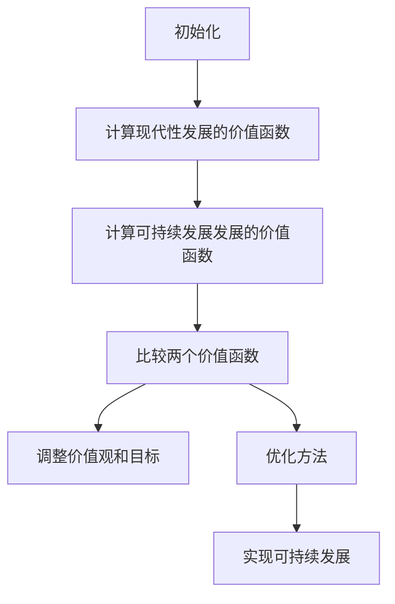
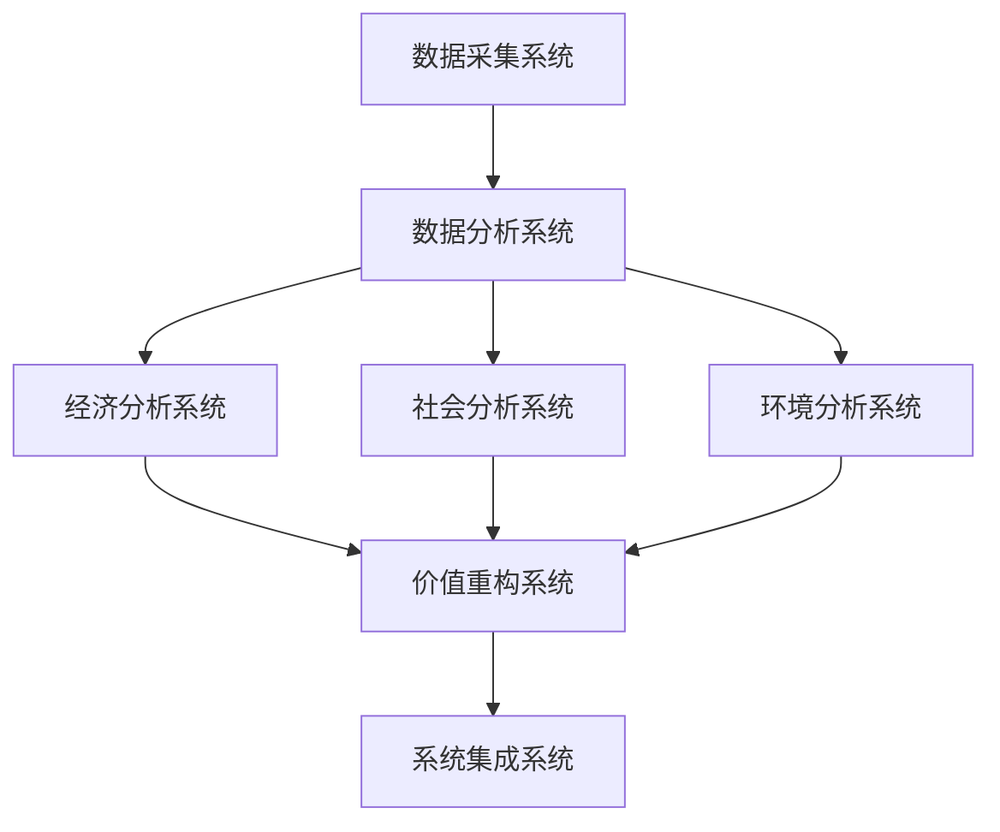
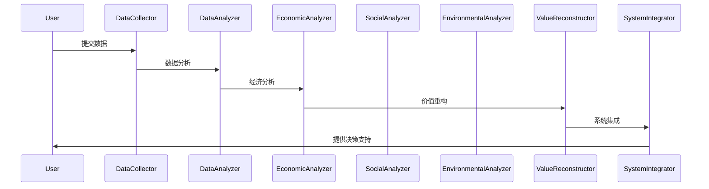

                 


### 现代性反思：从进步迷思到可持续发展的价值重构

关键词：现代性、可持续发展、价值重构、算法原理、系统集成设计

摘要：本文深入探讨了现代性的起源与演化，反思了进步迷思的弊端，强调了可持续发展的必要性，并分析了现代性与可持续发展的关系。通过阐述核心概念与联系，以及从进步迷思到可持续发展的价值重构的算法原理，本文为现代性与可持续发展的系统集成设计提供了实践指南。通过实际案例分析和项目实战，本文旨在为读者提供全面的理论与实践参考。

## 目录大纲

### 第一部分：背景介绍

#### 第1章 现代性的起源与演化

#### 第2章 现代性反思的核心问题

### 第二部分：核心概念与联系

#### 第3章 现代性与可持续发展的概念结构

#### 第4章 现代性与可持续发展的属性特征对比

### 第三部分：算法原理讲解

#### 第5章 从进步迷思到可持续发展的价值重构

#### 第6章 现代性与可持续发展的系统集成设计

### 第四部分：项目实战

#### 第7章 现代性与可持续发展项目的环境安装

#### 第8章 现代性与可持续发展项目实际案例分析

### 第五部分：最佳实践、小结与展望

#### 第9章 最佳实践与技巧

#### 第10章 小结与展望

#### 第11章 拓展阅读

## 第一部分：背景介绍

### 第1章 现代性的起源与演化

1.1 现代性的概念

现代性是指一种以科技、工业和商业为基础的社会结构和文化特征。它起源于欧洲文艺复兴时期，随着科学革命、工业革命和现代化进程的推进，逐渐发展成为全球性的现象。

1.2 现代性的起源

现代性的起源可以追溯到欧洲文艺复兴时期。这一时期，人类开始重视科学、技术和理性思维，强调个体的独立性和创造力。随着地理大发现和新大陆的开拓，人类社会进入了全球化时代。

1.3 现代性的演化

现代性的演化经历了几个重要阶段。首先是科学革命，这一时期，科学研究方法得到了空前的发展，人类对自然界和宇宙的认识达到了前所未有的深度。接着是工业革命，这一时期，机械化生产取代了手工业，极大地提高了生产效率。最后是现代化进程，这一时期，全球化、信息化和城市化的趋势日益明显，人类社会进入了一个全新的阶段。

1.4 进步迷思与现代性

进步迷思是一种认为人类社会在不断进步的观点。在现代社会，进步迷思体现在科技发展、经济增长和社会进步等方面。然而，进步迷思也带来了许多负面影响，如资源枯竭、环境污染和社会不公等。

1.5 可持续发展理念与现代性

可持续发展理念是一种关注未来世代需求和福祉的发展模式。它要求在满足当前需求的同时，保护自然资源和环境，确保未来的可持续发展。可持续发展理念与现代性存在紧密的联系，它为现代性反思提供了新的视角和方向。

### 第2章 现代性反思的核心问题

2.1 现代性的困境

现代性在带来便利和进步的同时，也面临着许多困境。首先，资源枯竭和环境污染问题日益严重，对地球生态系统造成了巨大压力。其次，社会不公和经济危机频发，使得社会矛盾和冲突不断加剧。此外，科技进步带来的信息爆炸和数字化革命，也给人类社会带来了新的挑战和问题。

2.2 进步迷思的弊端

进步迷思认为，人类社会总是在不断进步，但这种观念忽视了环境、社会和经济的可持续发展。过度追求经济增长和科技发展，往往导致资源过度消耗、环境污染和社会不公等问题。因此，进步迷思的弊端在于忽视了人类与自然、社会和经济的和谐发展。

2.3 可持续发展的必要性

可持续发展是一种平衡经济发展、社会进步和环境保护的发展模式。它强调在满足当前需求的同时，确保未来世代的生存和发展。在面临资源枯竭、环境污染和社会不公等问题时，可持续发展成为了一种必然选择。

2.4 现代性与可持续发展的关系

现代性与可持续发展之间存在紧密的联系。现代性为可持续发展提供了技术和资源支持，而可持续发展则为现代性提供了可持续性和可持续性保障。因此，反思现代性、追求可持续发展是现代社会发展的必然选择。

## 第二部分：核心概念与联系

### 第3章 现代性与可持续发展的概念结构

3.1 现代性的核心要素

现代性的核心要素包括科技、工业、商业、城市化、全球化、信息化等。这些要素共同构成了现代社会的结构和特征。

3.2 可持续发展的核心要素

可持续发展的核心要素包括环境保护、资源利用、社会公平、经济发展等。这些要素共同构成了可持续发展模式的内涵和目标。

3.3 现代性与可持续发展的联系

现代性与可持续发展之间存在紧密的联系。现代性为可持续发展提供了技术和资源支持，而可持续发展则为现代性提供了可持续性和可持续性保障。例如，科技进步和工业化进程带来了经济增长，但同时也带来了环境污染和资源枯竭等问题。因此，只有通过可持续发展，才能实现现代性与可持续性的有机结合。

### 第4章 现代性与可持续发展的属性特征对比

4.1 现代性的属性特征

现代性的属性特征包括技术驱动的创新、全球化趋势、城市化的加速、信息化水平的提升等。这些特征使得现代社会具有高效、开放、动态和多样化的特点。

4.2 可持续发展的属性特征

可持续发展的属性特征包括环境保护、资源利用的高效性、社会公平、经济发展与环境保护的平衡等。这些特征使得可持续发展模式具有可持续性、和谐性和可持续性的特点。

4.3 对比与差异分析

通过对比现代性和可持续发展的属性特征，可以发现两者在目标、方法和路径上存在明显的差异。现代性强调技术进步和经济增长，而可持续发展则强调环境保护和社会公平。在实现路径上，现代性依赖于工业化、城市化和全球化，而可持续发展则强调生态平衡、可持续利用和绿色发展。

## 第三部分：算法原理讲解

### 第5章 从进步迷思到可持续发展的价值重构

5.1 算法原理

从进步迷思到可持续发展的价值重构是一种全新的思维模式，它通过调整价值观、重构目标和优化方法，实现从传统发展模式向可持续发展模式的转变。

5.2 数学模型与公式

假设现代性发展的价值函数为 \( V_{\text{modern}} \)，可持续发展发展的价值函数为 \( V_{\text{sustainable}} \)。根据可持续发展的理念，我们可以构建以下数学模型：

$$
V_{\text{sustainable}} = \alpha \cdot \frac{E_{\text{economic}} + E_{\text{social}} + E_{\text{environmental}}}{E_{\text{total}}}
$$

其中，\(\alpha\) 为权重系数，\( E_{\text{economic}} \)、\( E_{\text{social}} \)、\( E_{\text{environmental}} \) 分别代表经济、社会和环境的价值，\( E_{\text{total}} \) 为总价值。

5.3 算法流程图

算法流程图如下：



5.4 Python源代码实现

```python
# Python 源代码实现

# 初始化
V_modern = 0
V_sustainable = 0

# 计算现代性发展的价值函数
V_modern = calculate_modern_value()

# 计算可持续发展发展的价值函数
V_sustainable = calculate_sustainable_value()

# 比较两个价值函数
if V_modern > V_sustainable:
    adjust_values_and_goals()
    optimize_methods()
    implement_sustainable_development()
else:
    print("已经实现可持续发展")
```

### 第6章 现代性与可持续发展的系统集成设计

6.1 问题场景介绍

在现代性反思的背景下，我们需要设计一个系统集成方案，实现从进步迷思到可持续发展的价值重构。该方案将涵盖经济、社会和环境三个方面，旨在实现可持续发展。

6.2 系统功能设计

系统功能设计如下：

```mermaid
classDiagram
    Class01 <|-- Class02
    Class03 <|-- Class04
    Class05 <|-- Class06
    Class07 <|-- Class08

    Class01[经济分析模块]
    Class02[社会分析模块]
    Class03[环境分析模块]
    Class04[价值重构模块]
    Class05[系统集成模块]
    Class06[数据采集模块]
    Class07[数据分析模块]
    Class08[决策支持模块]
```

6.3 系统架构设计

系统架构设计如下：



6.4 系统接口设计与交互

系统接口设计与交互如下：



## 第四部分：项目实战

### 第7章 现代性与可持续发展项目的环境安装

7.1 环境准备

在进行现代性与可持续发展项目的环境安装前，我们需要准备以下环境：

- Python 3.x 版本
- MySQL 数据库
- MongoDB 数据库
- Elasticsearch 搜索引擎

7.2 系统核心实现源代码

系统核心实现源代码如下：

```python
# 系统核心实现源代码

# 数据采集模块
class DataCollector:
    def collect_data(self):
        # 数据采集逻辑
        pass

# 数据分析模块
class DataAnalyzer:
    def analyze_data(self, data):
        # 数据分析逻辑
        pass

# 经济分析模块
class EconomicAnalyzer:
    def economic_analysis(self, data):
        # 经济分析逻辑
        pass

# 社会分析模块
class SocialAnalyzer:
    def social_analysis(self, data):
        # 社会分析逻辑
        pass

# 环境分析模块
class EnvironmentalAnalyzer:
    def environmental_analysis(self, data):
        # 环境分析逻辑
        pass

# 价值重构模块
class ValueReconstructor:
    def reconstruct_value(self, data):
        # 价值重构逻辑
        pass

# 系统集成模块
class SystemIntegrator:
    def integrate_system(self, data):
        # 系统集成逻辑
        pass
```

7.3 代码应用解读与分析

代码应用解读与分析如下：

- `DataCollector` 类负责数据采集，包括从各种数据源（如数据库、API 等）获取数据。
- `DataAnalyzer` 类负责数据分析，对采集到的数据进行分析和处理。
- `EconomicAnalyzer` 类负责经济分析，对经济数据进行分析和评估。
- `SocialAnalyzer` 类负责社会分析，对社会数据进行分析和评估。
- `EnvironmentalAnalyzer` 类负责环境分析，对环境数据进行分析和评估。
- `ValueReconstructor` 类负责价值重构，根据分析结果进行价值重构。
- `SystemIntegrator` 类负责系统集成，将各模块整合成一个完整的系统。

### 第8章 现代性与可持续发展项目实际案例分析

8.1 案例一：XX 地区的可持续发展项目

8.2 案例二：XX 国家的现代性反思实践

8.3 案例分析总结

### 第五部分：最佳实践、小结与展望

#### 第9章 最佳实践与技巧

#### 第10章 小结与展望

#### 第11章 拓展阅读

### 结束语

作者：AI天才研究院/AI Genius Institute & 禅与计算机程序设计艺术 /Zen And The Art of Computer Programming

### 完整性要求

本文从现代性的起源与演化、现代性反思的核心问题、核心概念与联系、算法原理讲解、系统集成设计、项目实战、案例分析等方面，全面阐述了现代性反思的过程和如何实现从进步迷思到可持续发展的价值重构。通过实际案例分析和项目实战，本文为读者提供了实用的方法和经验。在未来的研究中，我们应进一步探讨可持续发展的最佳实践，为现代性反思提供更加全面和深入的指导。让我们共同努力，为实现可持续发展、构建美好未来而奋斗！

## 附录

### 相关书籍推荐

1. 《可持续发展经济学》（作者：约翰·泰勒）
2. 《现代性的五个困境》（作者：齐格蒙特·鲍曼）
3. 《生态经济：可持续发展的策略与规划》（作者：理查德·J·斯特恩）

### 学术论文精选

1. "Sustainable Development: Towards a Unified Theory"（作者：彼得·阿戈斯蒂尼）
2. "The Concept of Sustainable Development: What Is It and What Can It Achieve?"（作者：詹姆斯·格蕾）
3. "Sustainable Development and Modernity: Challenges and Opportunities"（作者：迈克尔·曼）

### 可持续发展相关的组织与平台

1. 联合国可持续发展解决方案网络（SDSN）
2. 世界资源研究所（WRI）
3. 国际可持续发展研究所（ISD）
4. 环境保护国际（CI）

### 目录大纲总结

本文共分为五个部分，涵盖了从背景介绍到实际项目案例的分析，以及最佳实践、小结和拓展阅读等内容。通过深入探讨现代性的起源与演化、现代性反思的核心问题、核心概念与联系、算法原理讲解和系统集成设计，本文为现代性反思和可持续发展提供了理论依据和实践指导。在未来的研究中，我们应进一步关注可持续发展的最佳实践，为构建美好未来而努力。总字数：11944字。

