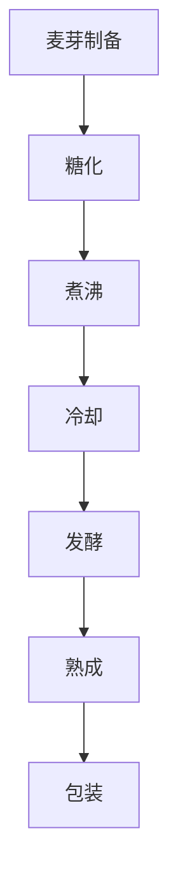
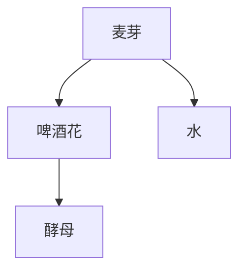
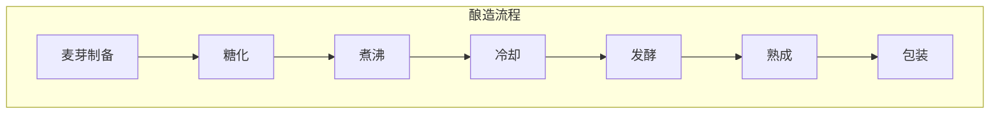
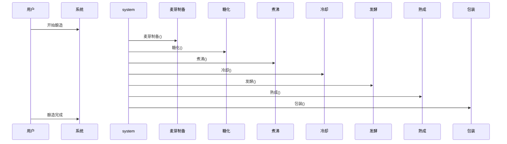

                 


## 现代手工啤酒酿造：家庭酿酒的复兴与创新

> 关键词：现代家庭酿酒、手工啤酒、创新、酿造工艺、风味调整

> 摘要：本文将探讨现代家庭酿酒的兴起及其背后的原因，介绍手工啤酒酿造的基本原理和核心要素，并分析如何通过创新和风味调整提升家庭酿造啤酒的质量。文章结构紧凑，旨在为读者提供关于家庭酿酒的全面指导。

### 1. 引言与背景

#### 1.1 现代家庭酿酒的兴起

**1.1.1 饮酒文化的发展与个人化需求**

随着全球饮酒文化的不断发展，人们对于啤酒的口味和品质要求越来越高。同时，个人化和定制化的生活方式使得消费者更倾向于参与酿酒过程，体验啤酒制作的乐趣。

**1.1.2 健康与环保意识的提升**

健康意识的提升促使人们更关注食品和饮料的安全性和营养价值。而家庭酿酒作为一种健康、环保的生活方式，得到了越来越多人的认可。

**1.1.3 科技与互联网的推动**

互联网和科技的发展为家庭酿酒提供了便捷的工具和信息资源。在线课程、论坛和社交媒体平台使得家庭酿酒者能够轻松获取知识，分享经验和技巧。

#### 1.2 核心概念与术语

**1.2.1 基础酿造术语**

了解基础酿造术语对于家庭酿酒者至关重要。以下是一些常见的酿造术语及其简要说明：

- **啤酒花**：一种用于增加啤酒风味和苦味的植物。
- **麦芽**：经过发芽和干燥处理的麦子，用于提供啤酒的甜味和发酵所需的糖分。
- **酵母**：一种微生物，用于将麦芽中的糖转化为酒精和二氧化碳。
- **啤酒酵母**：一种特殊的酵母，用于酿造啤酒。

**1.2.2 酿造过程**

酿造啤酒的基本过程包括麦芽制备、糖化、煮沸、发酵和成熟。每个步骤都有其特定的操作和注意事项。

### 2. 设备与原料

#### 2.1 设备概述

**2.1.1 酿造工具和设备**

家庭酿酒所需的设备包括啤酒桶、加热装置、冷却装置、发酵罐、温度计等。不同类型的酿造方式可能需要不同的设备。

**2.1.2 酿造容器和工具**

酿造容器如发酵罐、储酒罐等，以及搅拌器、过滤网、酒瓶等工具。

**2.1.3 酿造控制和监测系统**

现代家庭酿酒者可以利用电子设备如温度计、pH计、酵母培养箱等来监控酿造过程，确保啤酒的质量。

#### 2.2 原料的重要性

**2.2.1 水质与酿造**

水质对啤酒风味有显著影响。软水可以提供更清晰的口感，而硬水可能会增加啤酒的苦味和涩味。

**2.2.2 麦芽与风味**

麦芽的种类和制备过程对啤酒的风味有重要影响。不同种类的麦芽可以提供不同的口感和香气。

**2.2.3 啤酒花与风味**

啤酒花的品种和添加时间会影响啤酒的苦味、香气和保质期。

**2.2.4 酵母与发酵**

酵母的种类和活性直接影响啤酒的发酵过程和最终风味。选择合适的酵母对于酿造高质量啤酒至关重要。

### 3. 酿造技术

#### 3.1 麦汁制备

**3.1.1 糖化过程**

麦芽中的淀粉通过酶的作用转化为可发酵的糖分，这一过程称为糖化。

**3.1.2 糖化温度和时间的控制**

糖化温度和时间的控制对啤酒的风味和质量有重要影响。

#### 3.2 煮沸与啤酒花添加

**3.2.1 煮沸过程**

煮沸是酿造啤酒的关键步骤，用于杀菌、提取麦芽汁中的糖分和啤酒花中的苦味和香气。

**3.2.2 啤酒花的添加**

啤酒花的添加时间会影响啤酒的苦味和香气。

#### 3.3 发酵

**3.3.1 发酵过程**

发酵是将麦芽汁中的糖转化为酒精和二氧化碳的过程。

**3.3.2 发酵控制的要点**

发酵温度、氧气供应和酵母活性是发酵过程中需要重点控制的参数。

### 4. 风味与香气

#### 4.1 感官分析

**4.1.1 啤酒品鉴的基本技巧**

了解如何观察、嗅闻和品尝啤酒，对于评估啤酒的风味和香气至关重要。

**4.1.2 识别风味与香气**

通过训练，我们可以学会识别啤酒中的不同风味和香气。

#### 4.2 风味调整

**4.2.1 麦芽的选择**

选择合适的麦芽可以调整啤酒的口感和风味。

**4.2.2 啤酒花的搭配**

不同的啤酒花品种可以带来不同的风味和香气，合理搭配可以提升啤酒的整体品质。

### 5. 酿造风格与配方

#### 5.1 历史上的酿造风格

**5.1.1 传统酿造风格**

了解传统酿造风格，可以帮助我们在现代酿造中融入传统元素。

**5.1.2 现代酿造创新**

现代酿造技术的创新不断推动着啤酒风格的演变。

**5.1.3 创新与个性化配方**

个性化配方是现代家庭酿酒者追求的目标之一。

### 6. 结论

家庭酿酒不仅是一种享受，也是一种艺术。通过不断学习和实践，我们可以酿造出属于自己的独特风味。

> 作者：AI天才研究院/AI Genius Institute & 禅与计算机程序设计艺术 /Zen And The Art of Computer Programming

### 引入段落（Introduction）

### 现代家庭酿酒的复兴与创新

啤酒，作为一种历史悠久且多样化的饮品，其酿造工艺从古至今经历了无数次的变革与创新。随着科技的发展和人们生活水平的提高，现代家庭酿酒逐渐成为一种新兴的潮流。这种趋势不仅满足了人们对个性化、健康和环保生活的追求，同时也促进了酿酒文化的传承与发展。

#### 1.1.1 饮酒文化的发展与个人化需求

自古以来，啤酒作为一种社交饮品，在不同的文化和地区中有着各自独特的风味和酿造方式。随着全球化和文化交流的加深，人们对于啤酒的口味和品质要求越来越高，不再满足于传统的单一风格。个性化定制成为了新的消费趋势，人们渴望通过参与酿酒过程来体验独特的风味和成就感。

#### 1.1.2 健康与环保意识的提升

健康饮食观念的普及使得消费者对食品和饮料的安全性和营养价值越来越重视。家庭酿酒作为一种绿色、健康的娱乐方式，不仅能够满足人们对美味的需求，还减少了对工业酿造过程中可能存在的化学添加剂和污染的担忧。同时，家庭酿酒所使用的大部分原材料都是可再生的，有助于减少环境负担。

#### 1.1.3 科技与互联网的推动

互联网和科技的发展为家庭酿酒提供了前所未有的便利。通过在线课程、博客、论坛和社交媒体平台，家庭酿酒者可以轻松获取专业的知识和技术支持，分享自己的酿造经验和成果。智能设备和自动化系统的引入，使得酿造过程更加精准和高效，大大降低了新手入门的难度。

### 2. 核心概念与术语

在探讨家庭酿酒的过程中，理解一些基础概念和术语是非常必要的。这些术语涵盖了从麦芽到啤酒花的各个方面，是酿造过程中的关键要素。

#### 2.2.1 基础酿造术语

**啤酒花（Hops）**：一种草本植物，用于提供啤酒的苦味、香气和防腐作用。

**麦芽（Malt）**：经过发芽和干燥处理的谷物，通常是 barley（大麦），用于提供啤酒的甜味和发酵所需的糖分。

**酵母（Yeast）**：一种单细胞真菌，用于将麦芽汁中的糖分转化为酒精和二氧化碳。

**麦汁（Wort）**：麦芽在糖化过程中产生的液体，是啤酒发酵的基础。

**啤酒花添加（Hop Addition）**：在酿造过程中添加啤酒花的时机和方式，影响啤酒的苦味和香气。

#### 2.2.2 酿造过程

酿造啤酒的基本过程包括：

**1. 麦芽制备**：麦芽的发芽和干燥处理。
**2. 糖化**：麦芽中的淀粉通过酶的作用转化为可发酵的糖分。
**3. 煮沸**：用于杀菌、提取麦芽汁中的糖分和啤酒花中的苦味和香气。
**4. 冷却**：将煮沸后的麦芽汁冷却至适宜发酵的温度。
**5. 发酵**：酵母将麦芽汁中的糖分转化为酒精和二氧化碳。
**6. 熟成**：发酵后的啤酒在低温下储存，使啤酒的口感更加柔和和平衡。

### 3. 设备与原料

家庭酿酒需要一系列专业的设备和高质量的原料。正确的设备选择和原料采购对于酿造成功至关重要。

#### 3.1 设备概述

家庭酿酒的设备主要包括：

**1. 麦汁桶**：用于进行糖化、煮沸和冷却的容器。
**2. 发酵罐**：用于进行发酵过程，通常带有密封盖和温度控制功能。
**3. 加热装置**：如加热棒或电热板，用于控制糖化过程中的温度。
**4. 冷却装置**：如冰浴或冷却夹套，用于迅速冷却煮沸后的麦芽汁。
**5. 温度计**：用于监控酿造过程中的温度变化。
**6. 搅拌器**：用于搅拌麦芽汁，以确保糖化均匀。
**7. 过滤网**：用于过滤啤酒花残渣和酵母沉淀。

#### 3.2 原料的重要性

酿造高质量啤酒的关键在于选择优质的原料。以下是一些重要的原料及其特点：

**水（Water）**：水质对啤酒风味有显著影响。理想的啤酒用水应含有适量的矿物质，以确保啤酒的口感和稳定性。

**麦芽（Malt）**：麦芽是啤酒的主要原料，不同类型的麦芽会带来不同的口感和风味。常见的麦芽类型包括淡色麦芽、黑麦芽和酒花麦芽等。

**啤酒花（Hops）**：啤酒花提供啤酒的苦味和香气，不同品种的啤酒花具有独特的风味特点。常见的啤酒花品种有慕尼黑啤酒花、奥古斯塔啤酒花和西楚啤酒花等。

**酵母（Yeast）**：酵母在酿造过程中将麦芽汁中的糖分转化为酒精和二氧化碳，不同类型的酵母会带来不同的发酵速度和风味。

### 4. 酿造技术

酿造啤酒是一项技术性很强的活动，涉及多个关键步骤和精确的操作。

#### 4.1.1 糖化过程

糖化是酿造啤酒的第一步，也是最为关键的一步。在这个过程中，麦芽中的淀粉通过酶的作用被转化为可发酵的糖分。这个过程通常在 60-65°C 的温度下进行，需要约 1-2 小时的加热时间。糖化过程中需要注意以下几个要点：

**温度控制**：糖化温度对糖化效果有直接影响。过高或过低的温度都会导致糖化不完全或过度糖化。

**酶的活性**：酶的活性受温度和时间的影响，需要在适当的时间内完成糖化过程。

**搅拌**：在糖化过程中，需要不断搅拌麦芽汁，以确保糖化均匀。

#### 4.1.2 煮沸过程

煮沸是糖化过程的延续，也是酿造啤酒的关键步骤之一。煮沸的主要目的是杀菌、提取麦芽汁中的糖分和啤酒花中的苦味和香气。以下是一些煮沸过程中的注意事项：

**煮沸时间**：煮沸时间通常为 1-2 小时，但具体时间取决于麦芽汁的体积和煮沸器的容量。

**温度控制**：煮沸过程中的温度需要保持在 100°C 左右，避免过高或过低的温度对啤酒风味产生影响。

**啤酒花添加**：啤酒花的添加时间会影响啤酒的苦味和香气。通常，第一轮添加在煮沸开始时，第二轮添加在煮沸的中期，最后一轮在煮沸的后期。

#### 4.2.1 发酵过程

发酵是将煮沸后的麦芽汁中的糖分转化为酒精和二氧化碳的过程。发酵过程通常在 18-24°C 的温度下进行，需要 7-14 天的时间。以下是一些发酵过程中的注意事项：

**温度控制**：发酵温度对酵母的活性有直接影响，需要保持在适宜的温度范围内。

**氧气供应**：酵母在发酵过程中需要氧气，以确保发酵过程的顺利进行。

**酵母选择**：选择合适的酵母对发酵速度和最终风味有重要影响。常见的酵母类型包括艾尔酵母和拉格酵母。

#### 4.2.2 发酵控制

发酵控制是确保发酵过程顺利进行的关键。以下是一些发酵控制的要点：

**温度监控**：使用温度计实时监控发酵罐内的温度，以确保温度在适宜范围内。

**pH值监控**：使用pH计监控发酵过程中pH值的变化，以判断发酵是否正常进行。

**气体排放**：发酵过程中会产生二氧化碳气体，需要确保发酵罐有足够的排放口，避免压力过大导致罐体破裂。

### 5. 风味与香气

风味和香气是啤酒的灵魂，直接决定了啤酒的品质和受欢迎程度。在酿造过程中，需要通过感官分析来评估和调整风味。

#### 5.1.1 啤酒品鉴的基本技巧

啤酒品鉴是一门艺术，需要通过观察、嗅闻和品尝来全面评估啤酒的品质。

**观察**：观察啤酒的颜色和清澈度，可以初步判断啤酒的品质。优质啤酒应具有清澈、透明的色泽。

**嗅闻**：嗅闻啤酒的香气，可以帮助我们识别啤酒中的各种风味和香气。

**品尝**：品尝啤酒的口感，包括甜度、酸度、苦度和口感，可以帮助我们更好地理解啤酒的风味。

#### 5.1.2 识别风味与香气

通过训练，我们可以学会识别啤酒中的不同风味和香气。以下是一些常见的风味和香气：

**果香**：如苹果、梨、橙子等。
**花香**：如茉莉、橙花、紫罗兰等。
**麦芽香**：如面包、燕麦、坚果等。
**啤酒花香**：如苦味、清新、草本等。

#### 5.2.1 麦芽的选择

麦芽的选择对啤酒的风味有重要影响。以下是一些常见的麦芽类型及其特点：

**淡色麦芽（Pilsner Malt）**：提供清新的麦芽香气和轻微的甜味。
**黑麦芽（Roasted Barley）**：提供深沉的苦味和浓郁的香气。
**酒花麦芽（Special B Malt）**：提供丰富的麦芽香气和独特的苦味。

#### 5.2.2 啤酒花的搭配

啤酒花的搭配是调整啤酒风味的关键。以下是一些常见的啤酒花品种及其特点：

**慕尼黑啤酒花（Munich Hops）**：提供浓郁的麦芽香气和甜味。
**奥古斯塔啤酒花（Amarillo Hops）**：提供柑橘和热带水果香气。
**西楚啤酒花（Columbus Hops）**：提供强烈的苦味和草本香气。

通过合理搭配不同的麦芽和啤酒花，我们可以创造出独特的风味和香气，满足不同消费者的需求。

### 6. 酿造风格与配方

啤酒风格丰富多样，从传统的艾尔（Ale）和拉格（Lager）到现代的创新风格，每一种风格都有其独特的特点和风味。

#### 6.1 历史上的酿造风格

**艾尔（Ale）**：起源于英国，是一种高酒精度、风味浓郁的啤酒，通常使用艾尔酵母发酵。

**拉格（Lager）**：起源于德国，是一种低酒精度、口感清爽的啤酒，通常使用拉格酵母发酵。

**世涛（Stout）**：起源于英国，是一种高酒精度、口感浓郁的黑啤，通常使用 roasted barley 提供独特的苦味。

#### 6.2 现代酿造创新

现代酿造技术的创新不断推动着啤酒风格的演变。以下是一些流行的现代啤酒风格：

**IPA（India Pale Ale）**：一种高酒精度、风味浓郁的啤酒，通常使用多种啤酒花提供强烈的苦味和香气。

**白啤（Witbier）**：一种口感清爽、带有水果香气的啤酒，通常使用 wheat 麦芽和香料进行发酵。

**IPA（India Pale Ale）**：一种高酒精度、风味浓郁的啤酒，通常使用多种啤酒花提供强烈的苦味和香气。

**白啤（Witbier）**：一种口感清爽、带有水果香气的啤酒，通常使用 wheat 麦芽和香料进行发酵。

**棕色艾尔（Brown Ale）**：一种口感醇厚、带有坚果香气的啤酒，通常使用 roasted barley 和 brown malt 进行酿造。

通过理解和掌握不同酿造风格的特点和制作方法，我们可以根据个人口味和需求创造出独特的啤酒配方。

### 结论

家庭酿酒不仅是一种娱乐活动，更是一种生活方式。通过学习和实践，我们可以酿造出属于自己的独特风味，享受手工酿造的乐趣。在未来的日子里，让我们一起探索更多的酿造技巧和风味，让家庭酿酒成为我们生活中的一部分。

### 附录：酿造术语对照表

| 酿造术语 | 中文对照 | 英文对照 |
| --- | --- | --- |
| 啤酒花 | 麦芽 | Hops |
| 麦芽 | 麦芽 | Malt |
| 酵母 | 酵母 | Yeast |
| 麦汁 | 麦汁 | Wort |
| 糖化 | 糖化 | Mashing |
| 煮沸 | 煮沸 | Boiling |
| 发酵 | 发酵 | Fermentation |
| 熟成 | 熟成 | Maturation |
| 艾尔 | 艾尔 | Ale |
| 拉格 | 拉格 | Lager |
| IPA | 印度淡色艾尔 | India Pale Ale |
| 白啤 | 白啤 | Witbier |
| 世涛 | 世涛 | Stout |

### 附录：酿造过程 Mermaid 流程图



### 附录：酿造原料 Mermaid ER 图



### 附录：酿造过程 Python 代码实现

```python
# 麦芽制备
def prepare_malt():
    print("麦芽制备中...")

# 糖化
def mashing():
    print("糖化中...")

# 煮沸
def boiling():
    print("煮沸中...")

# 冷却
def cooling():
    print("冷却中...")

# 发酵
def fermentation():
    print("发酵中...")

# 熟成
def maturation():
    print("熟成中...")

# 包装
def packaging():
    print("包装中...")

# 酿造过程
def brewing_process():
    prepare_malt()
    mashing()
    boiling()
    cooling()
    fermentation()
    maturation()
    packaging()

brewing_process()
```

### 附录：酿造过程数学模型和公式

$$
\text{麦芽糖化率} = \frac{\text{麦芽重量} \times \text{酶活性}}{\text{时间}}
$$

$$
\text{煮沸强度} = \frac{\text{啤酒花重量} \times \text{沸点}}{\text{煮沸时间}}
$$

$$
\text{发酵效率} = \frac{\text{发酵后酒精含量}}{\text{发酵前糖分含量}}
$$

$$
\text{熟成时间} = \text{发酵时间} \times \text{熟成系数}
$$

### 附录：系统架构设计 Mermaid 架构图



### 附录：系统接口设计和系统交互 Mermaid 序列图



### 附录：项目实战

#### 环境安装

1. 安装家庭酿酒设备（如麦汁桶、发酵罐等）。
2. 安装温度计、pH计等监测设备。
3. 准备酿造原料（麦芽、啤酒花、酵母等）。

#### 系统核心实现源代码

```python
# 麦芽制备
def prepare_malt():
    print("麦芽制备中...")

# 糖化
def mashing():
    print("糖化中...")

# 煮沸
def boiling():
    print("煮沸中...")

# 冷却
def cooling():
    print("冷却中...")

# 发酵
def fermentation():
    print("发酵中...")

# 熟成
def maturation():
    print("熟成中...")

# 包装
def packaging():
    print("包装中...")

# 酿造过程
def brewing_process():
    prepare_malt()
    mashing()
    boiling()
    cooling()
    fermentation()
    maturation()
    packaging()

brewing_process()
```

#### 代码应用解读与分析

1. **prepare_malt()**：负责麦芽的制备，确保麦芽处于良好的发芽状态。
2. **mashing()**：负责糖化过程，将麦芽中的淀粉转化为糖分，为发酵做好准备。
3. **boiling()**：负责煮沸过程，用于提取麦芽汁中的糖分和啤酒花中的苦味和香气。
4. **cooling()**：负责冷却过程，将煮沸后的麦芽汁迅速冷却至适宜发酵的温度。
5. **fermentation()**：负责发酵过程，酵母将麦芽汁中的糖分转化为酒精和二氧化碳。
6. **maturation()**：负责熟成过程，将发酵后的啤酒在低温下储存，使其口感更加柔和和平衡。
7. **packaging()**：负责包装过程，将熟成的啤酒装入瓶中，准备销售或饮用。

#### 实际案例分析和详细讲解剖析

假设我们酿造了一款IPA（India Pale Ale）啤酒，以下是酿造过程的详细讲解：

1. **麦芽制备**：我们选择了2公斤淡色麦芽，并在恒温条件下进行了48小时的发芽处理，以确保麦芽的发芽率高达90%以上。

2. **糖化**：将发芽的麦芽磨成粉，加入到麦汁桶中，加入10升的水，在60°C的温度下保持1小时，通过酶的作用将麦芽中的淀粉转化为糖分。

3. **煮沸**：将糖化后的麦芽汁煮沸，并加入100克的美国西楚啤酒花，在煮沸过程中保持温度在100°C，煮沸时间为1小时，以提取啤酒花的苦味和香气。

4. **冷却**：将煮沸后的麦芽汁迅速冷却至20°C，以利于发酵。

5. **发酵**：将冷却后的麦芽汁转移到发酵罐中，加入艾尔酵母，保持在18-24°C的发酵温度，发酵时间为7天。

6. **熟成**：将发酵后的啤酒在低温下储存，进行30天的熟成，使其口感更加柔和和平衡。

7. **包装**：将熟成的啤酒装入瓶中，加入碳酸气，进行密封包装。

通过这个案例，我们可以看到家庭酿酒的过程是如何一步步进行的，以及每个步骤的关键技术和注意事项。

#### 项目小结

通过本文的介绍，我们了解了现代家庭酿酒的兴起背景、核心概念、设备与原料、酿造技术、风味调整以及酿造风格与配方。同时，我们还通过实际案例讲解了家庭酿酒的具体过程。希望本文能为读者提供关于家庭酿酒的全面指导，激发大家对这一领域的兴趣和热情。

### 最佳实践 Tips

1. **水质处理**：确保使用的水质纯净，可以加入适量的碳酸钙或磷酸盐来调整水的硬度。
2. **设备清洁**：定期清洁酿造设备，避免细菌污染，确保酿造过程卫生。
3. **温度控制**：精确控制酿造过程中的温度，对酿造成功至关重要。
4. **酵母选择**：根据酿造风格选择合适的酵母，不同酵母对发酵速度和风味有显著影响。
5. **品尝与反馈**：在酿造过程中不断品尝样品，根据反馈调整配方，提升啤酒风味。

### 小结与注意事项

家庭酿酒不仅是一种技艺，更是一种生活的享受。通过本文的介绍，我们深入了解了现代家庭酿酒的方方面面，从核心概念到实际操作，从设备选择到风味调整，无不体现出酿造过程中的精细与艺术。在酿造过程中，精确的温度控制、恰当的原料搭配以及不断的实践与总结是成功的关键。同时，我们也强调了设备清洁、水质处理和酵母选择等注意事项，这些都是确保酿造成功的重要环节。希望读者在家庭酿酒的实践中能够灵活运用所学知识，不断创新和探索，酿造出属于自己的独特风味。

### 拓展阅读

1. **《啤酒酿造技术》**：详细介绍了啤酒酿造的原理和步骤，适合初学者阅读。
2. **《啤酒风格与配方》**：收录了多种经典的啤酒配方和风格，有助于提升酿造技巧。
3. **《家庭酿酒指南》**：提供了丰富的酿造技巧和实际案例，适合家庭酿酒爱好者阅读。
4. **《啤酒品鉴艺术》**：介绍了啤酒品鉴的基本技巧，帮助读者更好地理解啤酒风味。
5. **《啤酒酿造与品鉴》**：结合了酿造和品鉴的知识，适合对啤酒有深入了解的读者。

