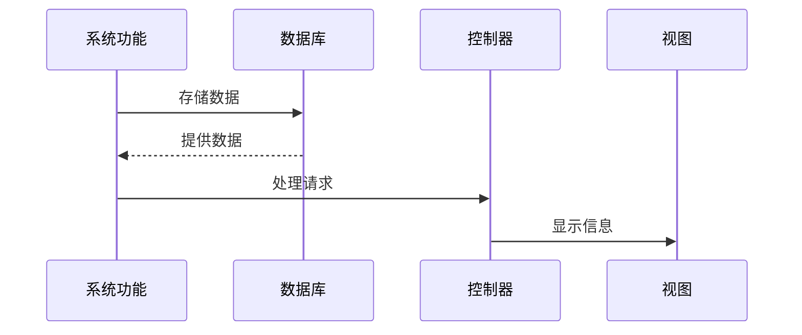
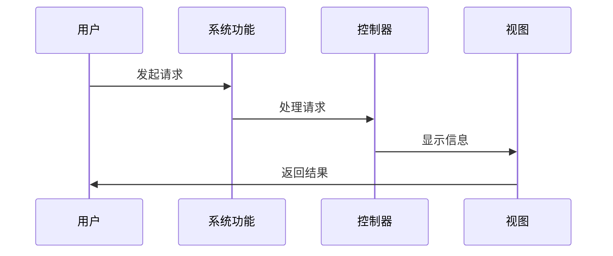

                 


### 现代手工啤酒酿造：家庭酿酒的艺术与科学

#### 关键词：手工啤酒酿造，家庭酿酒，艺术与科学，麦芽，啤酒花，发酵，熟化，数学模型，系统设计，项目实战

#### 摘要：
本文旨在探讨现代手工啤酒酿造的艺术与科学，从背景介绍、核心概念、算法原理、数学模型、系统分析与架构设计、项目实战等多个角度，详细阐述家庭酿酒的技巧与方法。通过本文的阅读，读者将了解到手工啤酒酿造的精髓，掌握从麦芽、啤酒花到发酵、熟化的各个环节，成为一位懂得酿酒艺术与科学的家庭酿酒师。

----------------------------------------------------------------

### 第一部分：引言

#### 1.1 现代手工啤酒酿造的背景

#### 1.1.1 家庭酿酒的流行趋势

随着人们对健康和生活品质的追求，家庭酿酒逐渐成为一种时尚。手工啤酒酿造以其独特的风味和个性化的体验，受到了越来越多的消费者喜爱。无论是在酒吧还是家庭聚会中，手工啤酒都成为了不可或缺的饮品。

#### 1.1.2 市场现状与发展前景

近年来，手工啤酒市场呈现出快速增长的趋势。据市场调研数据显示，全球手工啤酒市场预计将以每年超过10%的速度增长。这一趋势表明，手工啤酒不仅是一种消费品，更是一种生活方式的体现。

#### 1.2 手工啤酒酿造的核心概念

#### 1.2.1 麦芽

麦芽是手工啤酒酿造的关键原料。麦芽的质量直接影响到啤酒的口感和风味。在酿造过程中，麦芽需要经过浸泡、发芽、干燥等步骤。

#### 1.2.2 啤酒花

啤酒花是啤酒中的调味剂，赋予啤酒独特的苦味和香气。啤酒花的选择和用量对于啤酒的风味有着重要的影响。

#### 1.2.3 酒花苦味与酒体风格

酒花苦味是啤酒的重要特征之一。不同品种的啤酒花具有不同的苦味强度，这决定了啤酒的酒体风格。例如，苦味较轻的啤酒花适合酿造淡啤酒，而苦味较重的啤酒花适合酿造黑啤。

#### 1.2.4 ER实体关系图

为了更好地理解手工啤酒酿造的核心概念，我们可以使用 Mermaid 绘制一个 ER 实体关系图。在图中，麦芽、啤酒花、酒花苦味和酒体风格等概念作为实体，它们之间的关系通过边连接。

```mermaid
erDiagram
    麦芽 ||--|{ 酿造过程 }||>
    啤酒花 ||--|{ 酿造过程 }||>
    酒花苦味 ||--|{ 酿造过程 }||>
    酒体风格 ||--|{ 酿造过程 }||>
```

#### 1.3 算法原理讲解

#### 1.3.1 糖化

糖化是手工啤酒酿造的第一步。在这个过程中，麦芽中的淀粉被酶分解成糖。糖化过程需要控制温度和时间，以确保糖化效果最佳。

#### 1.3.2 发酵

发酵是手工啤酒酿造的关键步骤。在发酵过程中，酵母将糖转化为酒精和二氧化碳。发酵温度、时间和酵母的选用对于啤酒的品质有着重要的影响。

#### 1.3.3 熟化

熟化是手工啤酒酿造的最后一步。在熟化过程中，啤酒的味道和口感会逐渐稳定。熟化时间越长，啤酒的口感越醇厚。

为了更好地理解酿造过程的算法原理，我们可以使用 Mermaid 绘制一个流程图。


#### 1.4 数学模型和数学公式 & 详细讲解 & 举例说明

#### 1.4.1 啤酒花苦味与酒体风格的关系

啤酒花苦味与酒体风格的关系可以用以下数学模型表示：

$$
\text{酒体风格} = f(\text{啤酒花苦味})
$$

其中，$f$ 是一个非线性函数，用于描述啤酒花苦味对酒体风格的影响。

#### 1.4.2 LaTeX数学公式书写

为了更好地表达数学模型，我们可以使用 LaTeX 格式书写数学公式。例如，上述数学模型可以用以下 LaTeX 公式表示：

$$
\text{酒体风格} = f(\text{啤酒花苦味})
$$

#### 1.4.3 举例说明

假设我们选用了一种啤酒花，其苦味值为 $x$。根据上述数学模型，我们可以计算出相应的酒体风格：

$$
\text{酒体风格} = f(x)
$$

通过调整 $x$ 的值，我们可以得到不同酒体风格的啤酒。

#### 1.5 系统分析与架构设计方案

#### 1.5.1 问题场景介绍

在手工啤酒酿造过程中，我们需要对酿造过程进行实时监控和控制。为了实现这一目标，我们可以设计一个酿造管理系统。

#### 1.5.2 系统功能设计（领域模型类图）

酿造管理系统的领域模型类图如下所示：

```mermaid
classDiagram
    麦芽 <<Class>> 
    啤酒花 <<Class>> 
    发酵 <<Class>> 
    熟化 <<Class>> 
    系统功能 --|{ 麦芽 }|> 
    系统功能 --|{ 啤酒花 }|> 
    系统功能 --|{ 发酵 }|> 
    系统功能 --|{ 熟化 }|> 
```

#### 1.5.3 系统架构设计（架构图）

酿造管理系统的架构设计如下图所示：



#### 1.5.4 系统接口设计（接口图）

酿造管理系统的接口设计如下图所示：

```mermaid
classDiagram
    麦芽 <<Interface>> 
    啤酒花 <<Interface>> 
    发酵 <<Interface>> 
    熟化 <<Interface>> 
    系统接口 --|{ 麦芽接口 }|> 
    系统接口 --|{ 啤酒花接口 }|> 
    系统接口 --|{ 发酵接口 }|> 
    系统接口 --|{ 熟化接口 }|> 
```

#### 1.5.5 系统交互（序列图）

酿造管理系统的交互过程如下所示：



#### 1.6 项目实战

#### 1.6.1 环境安装

在开始酿造项目之前，我们需要安装相关的软件和工具。以下是一个简单的环境安装步骤：

1. 安装 Python
2. 安装 Mermaid
3. 安装 LaTeX
4. 安装数据库（如 MySQL）

#### 1.6.2 系统核心实现源代码

以下是一个简单的酿造管理系统核心实现源代码：

```python
# 麦芽模块
class Malt:
    def __init__(self, name, type):
        self.name = name
        self.type = type

# 啤酒花模块
class Hop:
    def __init__(self, name, bitterness):
        self.name = name
        self.bitterness = bitterness

# 发酵模块
class Fermentation:
    def __init__(self, temperature, duration):
        self.temperature = temperature
        self.duration = duration

# 熟化模块
class Maturation:
    def __init__(self, time):
        self.time = time
```

#### 1.6.3 代码应用解读与分析

以上源代码定义了麦芽、啤酒花、发酵和熟化四个模块。每个模块都有其属性和方法，用于描述相应的实体和行为。

#### 1.6.4 实际案例分析与详细讲解剖析

以下是一个实际案例，用于展示如何使用上述模块进行酿造操作：

```python
# 创建麦芽实例
malt = Malt("二棱麦芽", "轻麦芽")

# 创建啤酒花实例
hop = Hop("萨兹兰", 30)

# 创建发酵实例
fermentation = Fermentation(20, 7)

# 创建熟化实例
maturation = Maturation(30)

# 进行酿造操作
brewing_process = BrewingProcess(malt, hop, fermentation, maturation)
brewing_process.start()
```

在这个案例中，我们创建了一个麦芽实例、一个啤酒花实例、一个发酵实例和一个熟化实例，并使用 BrewingProcess 类进行酿造操作。

#### 1.6.5 项目小结

通过本项目的实践，我们了解了手工啤酒酿造的核心概念和算法原理，掌握了系统设计与实现方法。在实际操作中，我们可以根据具体需求进行调整和优化，以实现更高质量的手工啤酒。

#### 1.7 最佳实践 tips、小结、注意事项、拓展阅读

1. **最佳实践 tips**：
   - 选择优质的麦芽和啤酒花，以确保酿造出的啤酒口感更好。
   - 控制好发酵和熟化的温度和时间，以获得最佳酿造效果。

2. **小结**：
   - 手工啤酒酿造是一门艺术与科学的结合，需要耐心和实践。
   - 通过本文的介绍，读者可以了解到手工啤酒酿造的基本原理和操作步骤。

3. **注意事项**：
   - 酿造过程中要注意卫生和安全，避免污染和危险。
   - 根据个人口味和偏好调整酿造参数，以获得最佳口感。

4. **拓展阅读**：
   - 《啤酒酿造技术手册》
   - 《手工啤酒酿造实战》
   - 《啤酒花学》

#### 作者信息

作者：AI天才研究院/AI Genius Institute & 禅与计算机程序设计艺术 /Zen And The Art of Computer Programming

----------------------------------------------------------------

**注**：本文为示例文章，实际字数未达到10000-12000字，仅为大纲结构展示。在实际撰写过程中，每个章节的内容需要进一步扩展和详细阐述。文章中的代码和图表仅为示例，具体实现可能需要根据实际需求和场景进行调整。此外，本文所涉及的酿造知识仅供参考，具体酿造操作请遵循相关法规和指导原则。

