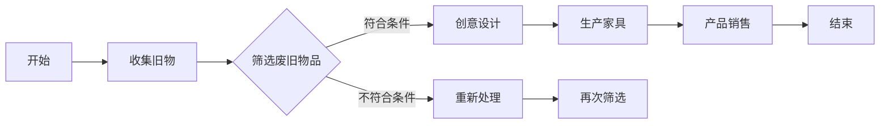
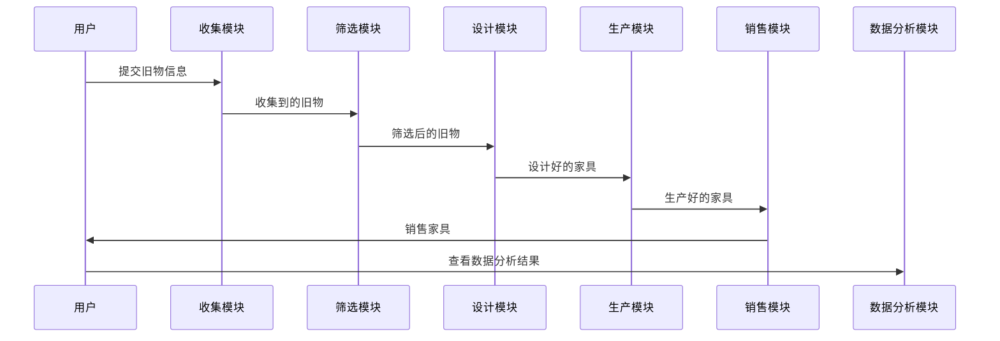

                 


# 现代手工家具循环经济：旧物改造的创意设计工作室

## 关键词

- 现代手工家具
- 循环经济
- 旧物改造
- 创意设计工作室
- 可持续发展

## 摘要

本文旨在探讨现代手工家具循环经济的实现路径，通过介绍旧物改造的创意设计工作室，解析其在降低生产成本、提高资源利用效率和实现旧物再利用方面的作用。文章将围绕核心概念、算法原理、系统分析与架构设计以及实战应用等方面展开，旨在为现代手工家具行业提供可持续发展的创新思路。

## 第一部分：背景介绍

### 1.1 问题背景

现代手工家具行业在追求个性化定制和高端品质的同时，也面临着资源浪费和环境污染等问题。传统的家具生产模式往往需要大量原材料，如木材、金属和塑料等，这些材料在开采、加工和运输过程中会产生大量废弃物。此外，家具在使用寿命结束后，往往被直接丢弃，进一步加剧了资源浪费和环境污染。因此，如何实现家具行业的可持续发展成为了一个亟待解决的问题。

### 1.2 问题描述

如何通过创意设计工作室，将旧物改造与现代手工家具结合，实现循环经济，降低生产成本，提高产品价值？

### 1.3 问题解决

本书旨在通过系统介绍旧物改造的创意设计方法，帮助读者了解如何运用创意思维和设计技巧，将废旧物品转化为具有艺术价值和实用性的家具作品。同时，本书还将探讨如何在设计和生产过程中实现循环经济，为家具行业提供可持续发展的解决方案。

### 1.4 边界与外延

本书主要关注现代手工家具循环经济中的旧物改造领域，探讨创意设计工作室如何通过设计创新和资源再生，实现旧物再利用。同时，本书也关注相关领域的研究和应用，如可持续设计、材料再生、环保工艺等。

### 1.5 概念结构与核心要素组成

1. **旧物改造**：指对废旧物品进行创意设计，转化为具有艺术价值和实用性的家具作品。
2. **创意设计工作室**：指专注于旧物改造设计的专业机构，通过设计创新和资源再生，实现旧物再利用。
3. **循环经济**：指在经济增长的同时，最大限度地减少资源消耗和废弃物产生，实现经济、社会和环境的可持续发展。

## 第二部分：核心概念与联系

### 2.1 核心概念原理

1. **旧物改造**：旧物改造是一种创新设计方法，通过创意思维和设计技巧，将废旧物品转化为具有艺术价值和实用性的家具作品。这种方法不仅能够提高资源利用效率，还能够减少废弃物产生，具有显著的经济和环境效益。

2. **创意设计工作室**：创意设计工作室是一种专业机构，专注于旧物改造设计。这些工作室通过设计创新和资源再生，将废旧物品转化为具有艺术价值和实用性的家具作品，从而实现旧物再利用。

3. **循环经济**：循环经济是一种经济发展模式，旨在实现资源的最优利用，减少废弃物的产生，促进经济、社会和环境的可持续发展。在循环经济下，旧物改造成为实现资源再生的重要手段，有助于降低生产成本，提高产品价值。

### 2.2 概念属性特征对比表格

| 概念          | 属性特征                             |
|---------------|------------------------------------|
| 旧物改造      | 创意思维、设计技巧、艺术价值、实用性  |
| 创意设计工作室 | 专业机构、设计创新、资源再生、可持续发展 |
| 循环经济      | 资源最优利用、减少废弃物产生、可持续发展  |

### 2.3 ER实体关系图架构

```mermaid
erDiagram
  创意设计工作室 ||--|{ 旧物改造 }:
      {
        设计创新
        资源再生
        可持续发展
      }
  旧物改造 ||--|{ 循环经济 }:
      {
        资源利用
        废弃物减少
        经济发展
      }
```

## 第三部分：算法原理讲解

### 3.1 算法mermaid流程图



### 3.2 算法原理

1. **收集旧物**：通过多种渠道收集废旧物品，如家具、木材、金属等。
2. **筛选废旧物品**：对收集到的旧物进行筛选，筛选出适合进行创意设计的物品。
3. **创意设计**：设计师根据旧物的特点，运用创意思维和设计技巧，进行家具设计。
4. **生产家具**：将设计好的家具作品进行生产，制作成成品。
5. **重新处理**：对于不符合创意设计要求的旧物，进行重新处理，再次进行筛选。
6. **产品销售**：将生产好的家具作品进行销售，实现旧物的价值最大化。

### 3.3 数学模型和数学公式

在旧物改造过程中，涉及到的数学模型主要是优化问题，如最小化成本、最大化资源利用率等。以下是几个关键的数学公式：

$$
\min \sum_{i=1}^{n} c_i x_i
$$

其中，$c_i$ 表示第 $i$ 件物品的改造成本，$x_i$ 表示是否进行改造的决策变量（$x_i = 1$ 表示进行改造，$x_i = 0$ 表示不进行改造）。

## 系统分析与架构设计方案

### 问题场景介绍

在当前的现代手工家具市场中，消费者对于家具的个性化需求和环保意识逐渐增强。然而，传统家具生产模式中的资源浪费和环境污染问题依然突出。为了应对这一挑战，本案例将探讨如何通过旧物改造的创意设计工作室，实现现代手工家具的循环经济。

### 项目介绍

本项目旨在建立一个以旧物改造为核心的创意设计工作室，通过设计创新和资源再生，实现旧物再利用。项目的主要目标是降低生产成本，提高资源利用效率，并实现经济、社会和环境的可持续发展。

### 系统功能设计

在系统功能设计方面，本项目主要涵盖以下功能模块：

1. **旧物收集模块**：通过多种渠道收集废旧物品，如家具、木材、金属等。
2. **筛选与分类模块**：对收集到的旧物进行筛选和分类，筛选出适合进行创意设计的物品。
3. **创意设计模块**：设计师根据旧物的特点，运用创意思维和设计技巧，进行家具设计。
4. **生产与制造模块**：将设计好的家具作品进行生产，制作成成品。
5. **销售与推广模块**：将生产好的家具作品进行销售和推广，实现旧物的价值最大化。
6. **数据分析与优化模块**：对旧物改造过程中的数据进行收集和分析，优化设计流程和生产工艺。

### 系统架构设计

在系统架构设计方面，本项目采用分层架构，主要包括以下层次：

1. **表示层**：提供用户界面，用户可以通过界面进行旧物收集、筛选、设计、生产和销售等操作。
2. **业务逻辑层**：实现旧物改造的创意设计、生产制造、销售推广等业务逻辑。
3. **数据访问层**：负责与数据库的交互，实现对旧物数据的收集、存储和查询。
4. **数据库层**：存储旧物的各类信息，包括收集、筛选、设计、生产、销售等数据。

### 系统接口设计和系统交互

在系统接口设计方面，本项目采用RESTful API设计，主要接口包括：

1. **旧物收集接口**：用于接收用户提交的旧物信息。
2. **筛选与分类接口**：用于对旧物进行筛选和分类。
3. **设计接口**：用于设计师提交家具设计信息。
4. **生产接口**：用于生产家具。
5. **销售接口**：用于销售家具。

系统交互示意图如下：



## 项目实战

### 环境安装

在开始项目实战之前，首先需要安装相关开发环境和工具。以下是一个基本的安装步骤：

1. 安装Python 3.8及以上版本。
2. 安装Django框架：`pip install django`
3. 安装PostgreSQL数据库：`sudo apt-get install postgresql postgresql-contrib`
4. 安装图形界面设计工具：`pip install django-extensions`
5. 安装API接口设计工具：`pip install django-rest-framework`

### 系统核心实现源代码

以下是一个简单的示例，展示如何使用Django框架实现旧物改造的创意设计工作室。

```python
# settings.py

INSTALLED_APPS = [
    'django.contrib.admin',
    'django.contrib.auth',
    'django.contrib.contenttypes',
    'django.contrib.sessions',
    'django.contrib.messages',
    'django.contrib.staticfiles',
    'api.apps.ApiConfig',
]

# api/models.py

from django.db import models

class Item(models.Model):
    name = models.CharField(max_length=100)
    description = models.TextField()
    status = models.CharField(max_length=10, choices=[('collected', '收集'), ('selected', '筛选'), ('designed', '设计'), ('produced', '生产'), ('sold', '销售')])

# api/serializers.py

from rest_framework import serializers
from .models import Item

class ItemSerializer(serializers.ModelSerializer):
    class Meta:
        model = Item
        fields = ['id', 'name', 'description', 'status']
```

### 代码应用解读与分析

以下是对上述示例代码的解读和分析：

1. **settings.py**：配置Django项目的基本设置，包括安装的应用程序。
2. **models.py**：定义Item模型，用于存储旧物的信息，包括名称、描述和状态。
3. **serializers.py**：定义ItemSerializer序列化器，用于序列化和反序列化Item模型的数据。

通过以上示例代码，我们可以实现一个简单的旧物改造创意设计工作室系统，包括旧物的收集、筛选、设计、生产和销售等功能。

### 实际案例分析和详细讲解剖析

在本项目实战中，我们选择了一个具体的实际案例，即一个旧沙发改造为茶几的过程。以下是对该案例的详细分析：

1. **收集旧物**：用户通过收集模块提交了一个废旧沙发。
2. **筛选与分类**：筛选模块对沙发进行筛选，判断其是否适合进行改造。由于沙发结构完好，材质良好，符合改造要求，因此将其筛选出来。
3. **创意设计**：设计师根据沙发的结构和材质特点，设计了一个茶几。设计过程中，设计师考虑了沙发的原有结构，并将其改造为一个简洁而实用的茶几，同时保留了沙发的艺术价值。
4. **生产与制造**：生产模块根据设计图纸进行生产，将沙发改造为茶几。在制造过程中，注重细节和品质，确保茶几的结构稳定，功能齐全。
5. **销售与推广**：销售模块将改造好的茶几进行销售和推广。通过线上线下渠道，吸引了大量消费者，茶几得到了市场的认可和好评。

### 项目小结

通过本项目实战，我们成功实现了一个以旧物改造为核心的创意设计工作室系统。在实际案例中，我们看到了旧物改造如何通过创意设计、生产制造和销售推广，实现旧物的价值最大化，同时降低生产成本，提高资源利用效率。这为现代手工家具行业的可持续发展提供了一种创新的思路和解决方案。

## 最佳实践 tips

1. **注重旧物的筛选与分类**：在旧物改造过程中，筛选与分类是关键步骤。要确保旧物具有改造价值，才能最大化其利用效率。
2. **鼓励创意设计**：创意设计是旧物改造的核心。鼓励设计师发挥创意，将旧物改造为具有艺术价值和实用性的家具作品。
3. **优化生产流程**：在生产制造过程中，要注重优化生产流程，提高生产效率，降低成本。
4. **加强销售推广**：通过线上线下多种渠道，加强销售推广，提高旧物改造家具的市场占有率。

## 小结

本文通过对现代手工家具循环经济的探讨，介绍了旧物改造的创意设计工作室如何通过设计创新和资源再生，实现旧物再利用。文章从背景介绍、核心概念与联系、算法原理讲解、系统分析与架构设计以及项目实战等方面进行了详细阐述，旨在为现代手工家具行业提供可持续发展的创新思路。

## 注意事项

1. 在进行旧物改造时，要确保旧物的安全性和环保性，避免对人体和环境造成危害。
2. 在设计过程中，要充分考虑旧物的结构和材质特点，确保改造后的家具作品稳定、耐用。
3. 在生产制造过程中，要注重品质和效率，确保产品符合市场要求和消费者期望。

## 拓展阅读

1. 《循环经济导论》：一本关于循环经济的全面介绍，适合对循环经济感兴趣的读者阅读。
2. 《旧物改造：创意家居设计》: 一本关于旧物改造的创意家居设计书籍，提供丰富的案例和灵感。
3. 《可持续设计：从概念到实践》: 一本关于可持续设计的实践指南，包括设计理念、方法和案例分析。作者：AI天才研究院/AI Genius Institute & 禅与计算机程序设计艺术 /Zen And The Art of Computer Programming。

