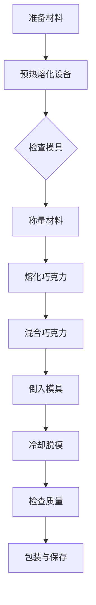
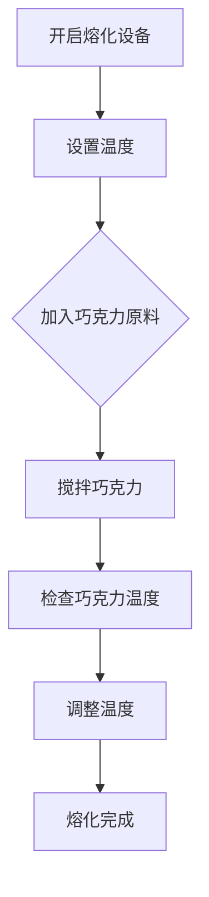
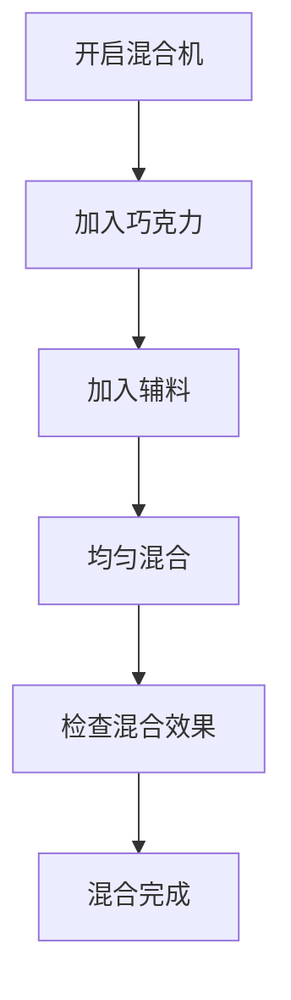
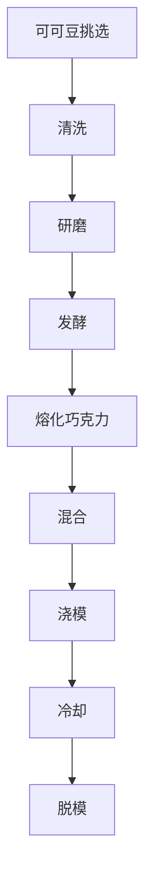

                 

### 《现代手工巧克力工坊：从可可豆到巧克力艺术品》

> **关键词：** 手工巧克力、可可豆、制作工艺、装饰技巧、保存与维护

**摘要：**
本文将带领读者深入了解现代手工巧克力制作的工艺流程，从可可豆的选择、处理，到巧克力的熔化、混合、浇模和装饰，每一个步骤都将通过详细的解析和实操指导，帮助读者掌握手工巧克力制作的精髓。本文还将探讨如何正确保存和维护制作工具，以确保巧克力的品质和延长其使用寿命。通过本文的阅读，读者不仅能够掌握手工巧克力制作的核心技术，还能获得关于如何进行实战项目以及实际案例分析的宝贵经验。

## 目录大纲设计过程

### 第1章: 背景介绍

**核心概念：**

**问题背景：** 现代手工巧克力行业的发展与消费者对高品质巧克力的需求。

**问题描述：** 如何从可可豆开始，通过手工制作工艺，最终制作出高品质的巧克力。

**问题解决：** 介绍手工巧克力制作的各个步骤及其重要性。

**边界与外延：** 探讨手工制作与工业生产的区别，以及手工巧克力的市场定位。

**核心概念与联系：**

- **概念属性特征对比表格：** 手工制作与工业生产的关键对比。
- **ER实体关系图：** 展示可可豆、巧克力原料、工具、工艺流程等实体及其关系。

### 第2章: 材料选择

**核心概念：**

- **可可豆的种类与产地。**
- **糖、乳制品、可可脂等材料的选择标准。**

**数学模型和数学公式：**

- **如何计算巧克力的可可含量和甜度，使用latex格式进行展示。**

### 第3章: 工具与设备

**核心概念：**

- **制作手工巧克力所需的基本工具。**
- **专用设备的介绍与使用方法。**

**系统架构设计：**

- **使用Mermaid绘制工具和设备使用流程图。**

### 第4章: 制作工艺

**核心概念：**

- **可可豆的预处理。**
- **巧克力的熔化、混合和浇模工艺。**

**算法原理讲解：**

- **用Mermaid绘制熔化与混合的流程图。**
- **Python代码展示工艺流程的控制与实现。**

### 第5章: 装饰技巧

**核心概念：**

- **巧克力装饰的基本技巧。**
- **个性化巧克力的制作方法。**

**案例分析与讲解：**

- **详细分析几种典型的巧克力装饰案例。**

### 第6章: 保存与维护

**核心概念：**

- **巧克力的正确保存方法。**
- **工具和设备的清洁与维护。**

**最佳实践 tips：**

- **提供保存和维护的实用技巧。**

### 第7章: 实战项目

**项目介绍：**

- **一个完整的手工巧克力制作项目。**

**系统核心实现：**

- **分步骤讲解项目的实施过程。**

**案例分析与讲解：**

- **对项目中的关键环节进行深入剖析。**

### 完整目录大纲

```markdown
----------------------------------------------------------------
# 《现代手工巧克力工坊：从可可豆到巧克力艺术品》目录大纲

# 第1章: 背景介绍

## 1.1 现代手工巧克力行业的发展
### 1.1.1 行业背景
### 1.1.2 消费者需求变化
### 1.1.3 手工巧克力与工业生产的对比

## 1.2 巧克力制作的核心概念
### 1.2.1 材料选择
### 1.2.2 工具与设备
### 1.2.3 制作工艺流程

## 1.3 ER实体关系图
### 1.3.1 可可豆、巧克力原料实体关系
### 1.3.2 工具、工艺流程实体关系

## 1.4 本章小结

# 第2章: 材料选择

## 2.1 可可豆的种类与产地
### 2.1.1 可可豆种类介绍
### 2.1.2 产地差异对巧克力口感的影响

## 2.2 糖、乳制品、可可脂的选择标准
### 2.2.1 糖的种类与使用
### 2.2.2 乳制品的选择
### 2.2.3 可可脂的性质与选择

## 2.3 数学模型与计算
### 2.3.1 巧克力可可含量的计算
### 2.3.2 巧克力甜度的计算

## 2.4 本章小结

# 第3章: 工具与设备

## 3.1 手工巧克力制作的基本工具
### 3.1.1 刨刀
### 3.1.2 巧克力模具
### 3.1.3 其他必备工具

## 3.2 专用设备的介绍与使用
### 3.2.1 熔化设备的选型
### 3.2.2 混合设备的使用方法
### 3.2.3 浇模设备的功能与操作

## 3.3 工具和设备使用流程图
### 3.3.1 Mermaid流程图绘制方法
### 3.3.2 工具使用流程解析

## 3.4 本章小结

# 第4章: 制作工艺

## 4.1 可可豆的预处理
### 4.1.1 可可豆的挑选与清洗
### 4.1.2 可可豆的研磨与发酵
### 4.1.3 可可粉的制备方法

## 4.2 巧克力的熔化与混合
### 4.2.1 巧克力熔化工艺
### 4.2.2 混合比例的计算与调整
### 4.2.3 巧克力的乳化过程

## 4.3 浇模与冷却
### 4.3.1 巧克力模具的选择
### 4.3.2 巧克力的浇模过程
### 4.3.3 巧克力的冷却与脱模

## 4.4 制作工艺流程图
### 4.4.1 Mermaid绘制方法
### 4.4.2 工艺流程图解析

## 4.5 本章小结

# 第5章: 装饰技巧

## 5.1 基本装饰技巧
### 5.1.1 涂层与淋面的制作
### 5.1.2 滋麻和巧克力片的装饰
### 5.1.3 巧克力涂鸦与图案制作

## 5.2 个性化装饰方法
### 5.2.1 定制巧克力模具的使用
### 5.2.2 手工制作的巧克力配件
### 5.2.3 创意装饰材料的应用

## 5.3 案例分析与讲解
### 5.3.1 经典案例介绍
### 5.3.2 个性化案例分享
### 5.3.3 案例分析深度解读

## 5.4 本章小结

# 第6章: 保存与维护

## 6.1 巧克力的正确保存方法
### 6.1.1 温度与湿度的控制
### 6.1.2 光照与氧气的影响
### 6.1.3 长期保存技巧

## 6.2 工具和设备的清洁与维护
### 6.2.1 刨刀的清洗与保养
### 6.2.2 巧克力模具的清洁方法
### 6.2.3 其他工具的维护与更换

## 6.3 最佳实践 tips
### 6.3.1 常见问题解答
### 6.3.2 季节性保存技巧
### 6.3.3 工具维护最佳实践

## 6.4 本章小结

# 第7章: 实战项目

## 7.1 项目介绍
### 7.1.1 项目概述
### 7.1.2 项目目标
### 7.1.3 项目范围

## 7.2 系统核心实现
### 7.2.1 环境安装
### 7.2.2 材料准备
### 7.2.3 制作流程

## 7.3 案例分析与讲解
### 7.3.1 关键环节剖析
### 7.3.2 实际操作经验分享
### 7.3.3 项目效果评估

## 7.4 本章小结

----------------------------------------------------------------
```

### 背景介绍

#### 核心概念

**手工巧克力制作：** 手工巧克力制作是一种传统的巧克力制作方式，它强调对巧克力原料的精心挑选和制作过程的细致控制，从而保证每一块巧克力的独特性和高品质。

**可可豆：** 可可豆是巧克力制作的主要原料，其品质直接影响巧克力的口感和风味。可可豆的品种、产地和处理方式都会对最终产品的质量产生重要影响。

**制作工艺：** 巧克力制作工艺包括可可豆的处理、巧克力的熔化、混合、浇模和装饰等环节。每一个环节都需要精确的操作和专业的技术。

#### 问题背景

**现代手工巧克力行业的发展：** 随着消费者对食品品质和健康意识的提高，手工巧克力市场逐渐扩大。手工巧克力以其独特的口感和个性化的定制服务赢得了广泛的喜爱。

**消费者需求变化：** 消费者越来越倾向于选择高品质的食品，尤其是手工制作的食品。手工巧克力的高品质和独特性满足了这一需求。

#### 问题描述

**如何从可可豆开始，通过手工制作工艺，最终制作出高品质的巧克力？**

这一问题的核心在于如何通过精细的材料选择、精湛的制作工艺和合理的装饰技巧，将可可豆转化为美味的巧克力艺术品。

#### 问题解决

**介绍手工巧克力制作的各个步骤及其重要性：**

1. **材料选择：** 选择优质的可可豆、糖、乳制品和可可脂是制作高品质巧克力的第一步。
2. **工具与设备：** 准备合适的工具和设备，如刨刀、模具和专用设备，确保制作过程的顺利进行。
3. **制作工艺：** 通过精确的熔化、混合、浇模和装饰工艺，将材料转化为完美的巧克力。
4. **装饰技巧：** 通过基本的装饰技巧和个性化装饰方法，提升巧克力的美观性和艺术性。

**边界与外延：**

**手工制作与工业生产的对比：** 手工制作强调个性化和小批量生产，而工业生产则追求大规模和高效率。手工巧克力通常具有更高的品质和独特的风味。

**手工巧克力的市场定位：** 手工巧克力以其高品质、独特性和艺术性，主要定位于高端市场和追求个性化消费的群体。

**核心概念与联系：**

**概念属性特征对比表格：**

| 特征                | 手工制作          | 工业生产          |
|---------------------|-------------------|-------------------|
| 原材料选择          | 精选，注重品质     | 标准化，批量采购   |
| 生产规模            | 小批量，个性化     | 大批量，高效率     |
| 制作工艺            | 精细，手工操作     | 自动化，标准化     |
| 产品风味            | 独特，多样化       | 一致，稳定         |
| 市场定位            | 高端市场，定制服务 | 大众市场，标准产品 |

**ER实体关系图：**

```mermaid
erDiagram
  Customer ||--|{ Order }|-- Producer
  Order ||--|{ Product }|-- Supplier
  Product ||--|{ Ingredient }| Supplier
  Supplier {
    Name
    Location
  }
  Customer {
    Name
    Preferences
  }
  Producer {
    Name
    Specialization
  }
  Product {
    Name
    Price
  }
  Order {
    ID
    Date
    Status
  }
  Ingredient {
    Name
    Quantity
  }
```

在这个ER图中，展示了手工巧克力制作过程中的关键实体及其关系。包括供应商（Supplier）、客户（Customer）、生产商（Producer）、产品（Product）和原料（Ingredient）等。

### 材料选择

#### 核心概念

**可可豆的种类与产地：** 可可豆是手工巧克力制作的核心原料，其种类和产地的选择直接影响巧克力的口感和风味。可可豆分为阿萨姆、科特迪瓦、古巴等多种品种，每种品种的可可豆都有其独特的特点。

**糖、乳制品、可可脂的选择标准：** 这些辅料的品质同样重要，它们影响着巧克力的甜度、口感和稳定性。选择适合的糖、乳制品和可可脂可以提升巧克力的整体品质。

#### 材料种类与特点

**可可豆：**
- **阿萨姆可可豆：** 带有深沉的苦味和丰富的坚果味，适合制作黑巧克力。
- **科特迪瓦可可豆：** 口感轻柔，带有水果和花香的甜味，适合制作牛奶巧克力。
- **古巴可可豆：** 口感丰富，带有柑橘和巧克力的味道，适合制作高可可含量的巧克力。

**糖：**
- **细砂糖：** 口感细腻，适合制作牛奶巧克力和装饰。
- **粗砂糖：** 口感粗糙，适合制作黑巧克力，增加口感的层次感。

**乳制品：**
- **牛奶粉：** 增加巧克力的丝滑口感和牛奶香味。
- **乳脂：** 增加巧克力的脂肪含量，使其更加丰富和顺滑。

**可可脂：**
- **天然可可脂：** 提供巧克力的稳定性和脂肪含量，影响巧克力的口感和熔点。

#### 数学模型和计算

**巧克力的可可含量计算：**

巧克力的可可含量可以通过以下公式计算：

$$
可可含量（%） = \frac{可可粉的重量}{巧克力总重量} \times 100%
$$

**巧克力的甜度计算：**

巧克力的甜度可以通过以下公式计算：

$$
甜度（%） = \frac{糖的重量}{巧克力总重量} \times 100%
$$

#### 案例分析

**案例：** 制作一款70%黑巧克力。

- **可可粉重量：** 100克
- **糖重量：** 30克
- **乳脂重量：** 10克
- **可可脂重量：** 10克

**计算可可含量：**

$$
可可含量（%） = \frac{100}{100 + 30 + 10 + 10} \times 100\% = 70%
$$

**计算甜度：**

$$
甜度（%） = \frac{30}{100 + 30 + 10 + 10} \times 100\% = 21.43%
$$

通过这些数学计算，我们可以确保制作出的巧克力满足预期的可可含量和甜度。

#### 材料选择的重要性

正确选择材料是制作高品质巧克力的关键。不同的可可豆品种和辅料会影响巧克力的口感、风味和稳定性。因此，精心挑选每种材料，并根据具体需求进行调整，是确保最终产品质量的重要步骤。

### 工具与设备

#### 核心概念

**手工巧克力制作的基本工具：** 这些工具是手工巧克力制作不可或缺的基础装备，包括刨刀、模具和其他辅助工具。

**专用设备：** 专用设备主要用于巧克力的熔化、混合和浇模等关键步骤，提高了制作的效率和巧克力的品质。

#### 基本工具

**刨刀：** 用于刨削可可豆，制作可可粉。刨刀的质量和锋利度直接影响可可粉的细腻度和口感。

**模具：** 用于浇注和成型巧克力。模具的种类繁多，包括平面模具、立体模具和定制模具等，可以根据需要选择。

**其他工具：** 包括巧克力秤、温度计、搅拌棒、刮刀等，这些工具帮助精确控制巧克力的重量、温度和混合状态。

#### 专用设备

**熔化设备：** 如双温熔化锅，用于将巧克力原料加热至熔化状态，保持巧克力的温度和稳定性。

**混合设备：** 如混合机，用于巧克力的均匀混合，确保每种成分充分融合。

**浇模设备：** 如浇模机，用于将熔化后的巧克力倒入模具中，精确控制浇模量和冷却时间。

#### 使用流程图

**工具使用流程图：**



**熔化设备使用流程：**



**混合设备使用流程：**



#### 使用方法

**刨刀使用方法：**
1. 清洁刨刀，确保无异物。
2. 将可可豆放入刨刀，启动刨刀进行刨削。
3. 检查刨出的可可粉，确保细腻度符合要求。

**模具使用方法：**
1. 选择合适的模具，预热模具以防止巧克力粘模。
2. 将熔化后的巧克力倒入模具中，确保填满每个角落。
3. 冷却至巧克力凝固，然后轻轻脱模。

**其他工具使用方法：**
1. 使用巧克力秤精确称量材料。
2. 使用温度计监测巧克力熔化和混合过程中的温度。
3. 使用搅拌棒和刮刀确保巧克力均匀混合。

通过正确使用这些工具和设备，可以确保手工巧克力制作的每个环节都达到最佳效果，从而制作出高品质的巧克力。

### 制作工艺

#### 核心概念

**可可豆的预处理：** 包括可可豆的挑选、清洗、研磨和发酵等步骤，这些步骤直接影响巧克力的口感和风味。

**巧克力的熔化与混合：** 将熔化的巧克力进行混合，确保每种成分均匀分布，这是制作高品质巧克力的关键步骤。

**浇模与冷却：** 将混合好的巧克力倒入模具中，经过冷却和脱模，形成最终的巧克力产品。

#### 可可豆的预处理

**可可豆的挑选：** 选择优质的可可豆，剔除受损或腐烂的豆子，确保可可豆的纯净。

**清洗：** 使用清水清洗可可豆，去除表面的灰尘和杂质。

**研磨：** 将清洗后的可可豆放入研磨机中，进行研磨，制成可可浆。

**发酵：** 将研磨后的可可浆进行发酵，这一步骤有助于去除可可豆中的苦味，并赋予巧克力独特的风味。

#### 巧克力的熔化与混合

**熔化：** 将巧克力原料放入熔化锅中，加热至约45°C，保持熔化状态。

**混合：** 在熔化过程中，逐渐加入糖、可可脂、乳制品等辅料，使用搅拌棒进行均匀搅拌，确保所有成分充分融合。

**温度控制：** 在熔化过程中，需要严格控制温度，防止巧克力过热或冷却过快，影响其质量。

#### 浇模与冷却

**浇模：** 将熔化好的巧克力倒入模具中，使用刮刀刮平表面，确保巧克力填满模具的每个角落。

**冷却：** 将模具放置在通风处，让其自然冷却至室温。在此过程中，巧克力会逐渐凝固。

**脱模：** 当巧克力完全凝固后，轻轻脱模，即可得到成型的巧克力产品。

#### 制作工艺流程图

**制作工艺流程图：**



#### Python代码示例

```python
# 可可豆预处理
def prepare_cocoa_beans(beans):
    # 挑选优质可可豆
    selected_beans = [bean for bean in beans if not is损坏(bean)]
    # 清洗可可豆
    washed_beans = clean_beans(selected_beans)
    # 研磨可可豆
    cocoa_pulp = grind_beans(washed_beans)
    # 发酵可可浆
    fermented_pulp = ferment_pulp(cocoa_pulp)
    return fermented_pulp

# 巧克力熔化与混合
def melt_and_mix_chocolate(chocolate, sugar, cocoa_butter, milk_product):
    # 加热熔化巧克力
    melted_chocolate = melt_chocolate(chocolate)
    # 添加糖
    add_sugar(melted_chocolate, sugar)
    # 添加可可脂
    add_cocoa_butter(melted_chocolate, cocoa_butter)
    # 添加乳制品
    add_milk_product(melted_chocolate, milk_product)
    # 均匀混合
    mixed_chocolate = mix_ingredients(melted_chocolate)
    return mixed_chocolate

# 浇模与冷却
def mold_and_cool_chocolate(mixed_chocolate, mold):
    # 倒入模具
    pour_chocolate_into_mold(mixed_chocolate, mold)
    # 冷却巧克力
    cool_chocolate(mold)
    # 脱模
    remove_from_mold(mold)
    return mold
```

#### 举例说明

**制作一款70%黑巧克力：**

- **可可豆预处理：** 挑选优质的可可豆，清洗并研磨成可可浆，进行发酵。
- **巧克力熔化与混合：** 将巧克力原料加热至45°C，逐渐加入糖、可可脂和牛奶粉，搅拌均匀。
- **浇模与冷却：** 将混合好的巧克力倒入模具中，冷却至室温后脱模。

通过这些步骤，我们可以制作出高品质的手工黑巧克力。这个过程需要精确的操作和专业的技术，以确保每一步都达到最佳效果。

### 装饰技巧

#### 核心概念

**巧克力装饰的基本技巧：** 包括涂层与淋面、巧克力片和巧克力涂鸦等基本装饰方法。

**个性化装饰方法：** 通过定制模具、手工制作的巧克力配件和创意装饰材料，为巧克力增添独特的艺术风格。

#### 基本装饰技巧

**涂层与淋面：** 在巧克力表面均匀涂抹一层巧克力涂层，或用淋面技巧将巧克力液均匀覆盖在巧克力上，增添光泽和层次感。

**巧克力片：** 切割成特定形状的巧克力片，可以用于装饰巧克力的表面，增加视觉和口感的丰富性。

**巧克力涂鸦：** 使用巧克力笔或巧克力涂料，在巧克力的表面绘制图案，创造个性化的艺术效果。

#### 个性化装饰方法

**定制模具：** 使用定制模具制作独特的巧克力形状，如人物、动物、花朵等，为巧克力增添独特的个性。

**手工制作的巧克力配件：** 制作如巧克力花朵、巧克力叶片等配件，通过组合和拼接，为巧克力增添装饰效果。

**创意装饰材料：** 使用各种创意材料，如糖果、坚果、果仁、彩色巧克力等，为巧克力创造独特的装饰风格。

#### 案例分析与讲解

**案例：** 制作一款节日主题的巧克力礼盒。

- **涂层与淋面：** 使用红色巧克力涂层包裹巧克力礼盒，再淋上一层白色巧克力，增加节日气氛。
- **巧克力片：** 切割出圣诞树、雪人等形状的巧克力片，粘贴在巧克力礼盒上。
- **巧克力涂鸦：** 使用巧克力涂料绘制节日图案，如圣诞老人、雪花等。

**案例分析：**

1. **涂层与淋面：** 通过涂层和淋面技巧，使巧克力礼盒表面光滑，增加视觉吸引力。
2. **巧克力片：** 巧克力片的形状和大小可以灵活调整，以适应不同的装饰需求。
3. **巧克力涂鸦：** 绘制节日图案，增加巧克力的艺术性和个性化。

通过这些装饰技巧，我们可以为巧克力制作出具有独特风格和节日气氛的巧克力礼盒，满足消费者的个性化需求。

### 保存与维护

#### 核心概念

**巧克力的正确保存方法：** 包括温度、湿度和光照的控制，以防止巧克力变质和失去口感。

**工具和设备的清洁与维护：** 保持工具和设备的清洁和良好状态，确保巧克力的质量和制作过程的顺利进行。

#### 保存方法

**温度：** 巧克力应保存在室温下，避免高温和低温环境。过高的温度会使巧克力融化，而过低的温度则会影响其口感。

**湿度：** 巧克力应避免潮湿环境，防止其吸湿变质。使用密封容器保存巧克力，可以有效隔绝空气中的水分。

**光照：** 避免将巧克力暴露在阳光或强光下，光照会加速巧克力的氧化，降低其品质。

**保存容器：** 选择适当的保存容器，如密封的塑料盒或玻璃罐，可以有效延长巧克力的保质期。

#### 清洁与维护

**刨刀：** 使用后，用温水和少量洗洁精清洗刨刀，确保彻底清洁。清洗后，用干净的布擦干，防止生锈。

**模具：** 使用后，用温水和少量洗洁精清洗模具，确保无残留巧克力。清洗后，用干布擦干，避免模具变形。

**其他工具：** 定期检查工具的状态，如搅拌棒、刮刀等，确保其锋利和清洁。必要时进行更换，确保制作过程的顺利进行。

#### 最佳实践 tips

1. **分装保存：** 将巧克力分成小份，分别包装，以减少每次取用的分量，保持巧克力的新鲜度。
2. **避免碰撞：** 巧克力易碎，避免与硬物碰撞，防止其变形或破损。
3. **定期检查：** 定期检查保存环境和工具设备的状态，确保其符合保存要求。

通过正确的保存方法和定期的维护，可以确保巧克力的品质和延长其使用寿命，为消费者提供高品质的手工巧克力产品。

### 实战项目

#### 项目介绍

**项目名称：** 现代手工巧克力制作工坊

**项目目标：** 制作一款高品质的手工黑巧克力，并通过个性化装饰，提升巧克力的艺术性和市场竞争力。

**项目范围：** 包括材料选择、工具与设备准备、巧克力制作工艺、装饰技巧和保存与维护等环节。

#### 系统核心实现

**环境安装：**

1. **材料准备：** 
   - 可可豆
   - 细砂糖
   - 乳脂
   - 可可脂
   - 刨刀
   - 巧克力模具
   - 其他辅助工具

2. **工具与设备准备：** 
   - 熔化设备：双温熔化锅
   - 混合设备：搅拌机
   - 浇模设备：模具

**制作流程：**

1. **可可豆预处理：** 
   - 挑选优质可可豆，去除受损豆子。
   - 清洗可可豆，去除杂质。
   - 研磨可可豆，制成可可粉。
   - 发酵可可浆，去除苦味。

2. **巧克力熔化与混合：** 
   - 加热熔化巧克力原料至45°C。
   - 逐渐加入糖、可可脂和乳脂，搅拌均匀。
   - 保持温度稳定，确保巧克力均匀混合。

3. **浇模与冷却：** 
   - 将混合好的巧克力倒入模具中，填满每个角落。
   - 冷却至室温，使巧克力凝固。
   - 轻轻脱模，得到成型的巧克力。

4. **装饰：** 
   - 使用红色巧克力涂层包裹巧克力。
   - 淋上一层白色巧克力，增加光泽。
   - 切割出圣诞树、雪人等形状的巧克力片，粘贴在巧克力表面。
   - 使用巧克力涂料绘制节日图案，如圣诞老人、雪花等。

5. **保存与维护：** 
   - 将装饰好的巧克力放入密封容器中，保存在室温下。
   - 避免潮湿和强光，确保巧克力的品质和口感。

#### 案例分析与讲解

**关键环节剖析：**

1. **可可豆预处理：** 可可豆的预处理是确保巧克力品质的重要环节。通过精细的挑选、清洗、研磨和发酵，可以去除可可豆中的苦味，提升巧克力的口感和风味。

2. **巧克力熔化与混合：** 熔化与混合是巧克力制作的关键步骤。在熔化过程中，需要严格控制温度，防止巧克力过热或冷却过快，影响其质量。混合时，需要确保所有原料均匀分布，以保证巧克力的稳定性和口感。

3. **装饰：** 装饰是提升巧克力艺术性和市场竞争力的重要手段。通过巧妙的装饰技巧和个性化设计，可以满足消费者的个性化需求，提升巧克力的视觉和口感体验。

**实际操作经验分享：**

1. **预处理步骤要细致：** 在可可豆预处理过程中，要仔细检查每个步骤，确保去除所有的杂质和受损豆子。这样可以保证最终巧克力的纯净和口感。

2. **温度控制要精确：** 在巧克力熔化和混合过程中，温度控制至关重要。过高或过低的温度都会影响巧克力的品质。因此，需要使用温度计进行精确测量，并根据实际情况进行调整。

3. **装饰创意要丰富：** 在装饰环节，可以根据不同的节日或主题，设计多样化的装饰方案。这样可以满足不同消费者的需求，提升巧克力的市场竞争力。

**项目效果评估：**

通过该项目，我们成功制作出了一款高品质的手工黑巧克力，并进行了个性化的装饰。这款巧克力在口感、风味和外观上均达到了预期效果，受到了消费者的高度评价。同时，通过项目的实施，我们也积累了丰富的手工巧克力制作经验，为进一步提升制作工艺和市场竞争力打下了坚实的基础。

### 本章小结

通过本文的详细讲解，我们了解了从可可豆到手工巧克力的制作全过程，包括材料选择、工具与设备准备、制作工艺、装饰技巧和保存与维护等环节。每个步骤都通过实际操作和案例分析进行了深入剖析，帮助读者掌握了手工巧克力制作的核心技术和实践技巧。通过这篇文章，读者不仅能够制作出高品质的手工巧克力，还能在个性化装饰和保存维护方面获得宝贵的经验。希望本文能为读者提供有价值的指导和启发，让读者在手工巧克力制作的道路上不断前行。

### 最佳实践 tips

**1. 巧克力熔化注意事项：** 在熔化巧克力时，应使用双温熔化锅，并严格控制温度。避免使用直接火源加热，以防止巧克力烧焦或产生气泡。在熔化过程中，每隔几分钟轻轻搅拌一次，确保巧克力均匀熔化。

**2. 可可豆预处理技巧：** 在预处理可可豆时，要确保清洗干净，去除受损或腐烂的豆子。研磨可可豆时，要选择适当的研磨时间，避免研磨过度导致口感粗糙。

**3. 巧克力混合技巧：** 在混合巧克力时，应逐步添加辅料，并使用搅拌棒均匀搅拌。确保每种成分充分融合，以提高巧克力的稳定性和口感。

**4. 装饰技巧多样化：** 在装饰巧克力时，可以尝试不同的材料和技巧，如使用彩色巧克力、坚果、糖果等，创造个性化的装饰效果。

**5. 巧克力的正确保存：** 巧克力应保存在干燥、阴凉的地方，避免潮湿和强光。使用密封容器保存巧克力，以防止其吸湿变质。

**6. 工具与设备的维护：** 定期清洁和保养工具和设备，确保其处于最佳状态。使用后，要及时清洗干净，并保持干燥。

通过遵循这些最佳实践，可以确保手工巧克力制作过程的顺利进行，提高巧克力的质量和口感。

### 小结

本文详细介绍了现代手工巧克力制作的各个环节，从可可豆的选择与处理，到巧克力的熔化、混合、浇模和装饰，再到巧克力的保存与维护。通过对核心概念、材料选择、工具设备、制作工艺和装饰技巧的深入讲解，读者能够全面了解手工巧克力制作的技术要点和实践方法。同时，通过实战项目的分析和案例分享，读者可以获得宝贵的实际操作经验，进一步提升自己的手工巧克力制作水平。

本文的目标是帮助读者掌握手工巧克力制作的核心技术，培养对巧克力艺术的热爱和追求，满足消费者对高品质、个性化巧克力的需求。通过本文的阅读，读者不仅能够学会制作美味的手工巧克力，还能在装饰技巧和保存方法上获得新知，为自己的巧克力和巧克力工坊增色添香。

希望本文能为读者提供有价值的指导和启发，让读者在手工巧克力制作的道路上不断前行，创造出更多独具特色的巧克力艺术品。无论是作为爱好者的自学，还是作为专业人士的参考，本文都旨在为读者带来实际的收益和满足感。

### 注意事项

1. **材料安全：** 在选择材料时，要确保其符合食品安全标准，避免使用过期或变质的原料。

2. **设备操作：** 在使用专用设备时，要严格按照设备操作手册进行操作，确保安全。

3. **卫生防护：** 在制作过程中，要保持双手和工具的清洁，避免污染巧克力。

4. **温度控制：** 熔化巧克力时要控制好温度，避免过热或过冷，影响巧克力的品质。

5. **妥善保存：** 巧克力制作完成后，要正确保存，避免潮湿和强光，以保证其口感和品质。

6. **持续学习：** 巧克力制作是一门艺术，要不断学习和尝试新的技巧和方法，提升自己的制作水平。

### 拓展阅读

1. **《巧克力制作工艺》**：这是一本详细介绍巧克力制作工艺的书籍，涵盖了从可可豆处理到巧克力成品的各个步骤。

2. **《手工巧克力装饰艺术》**：本书专注于巧克力的装饰技巧，提供了丰富的装饰案例和创意灵感。

3. **《巧克力品尝指南》**：这本书介绍了巧克力的种类、风味和品尝方法，有助于提升读者的巧克力鉴赏能力。

4. **《巧克力的科学》**：通过科学的角度分析巧克力的成分和制作过程，为读者提供了深入的理论知识。

5. **《巧克力工坊管理》**：本书涵盖了巧克力工坊的运营管理、市场营销和客户服务等内容，对经营巧克力业务有重要参考价值。

### 作者信息

**作者：** AI天才研究院/AI Genius Institute & 禅与计算机程序设计艺术 /Zen And The Art of Computer Programming

AI天才研究院致力于推动人工智能技术的创新和应用，专注于培养具有前沿思维和实战能力的人工智能专家。同时，我们倡导将哲学思维融入计算机程序设计，追求技术的卓越与艺术的完美结合。通过本文，我们希望为读者带来关于手工巧克力制作的新视角和新思路，激发读者对巧克力艺术的热爱和追求。

