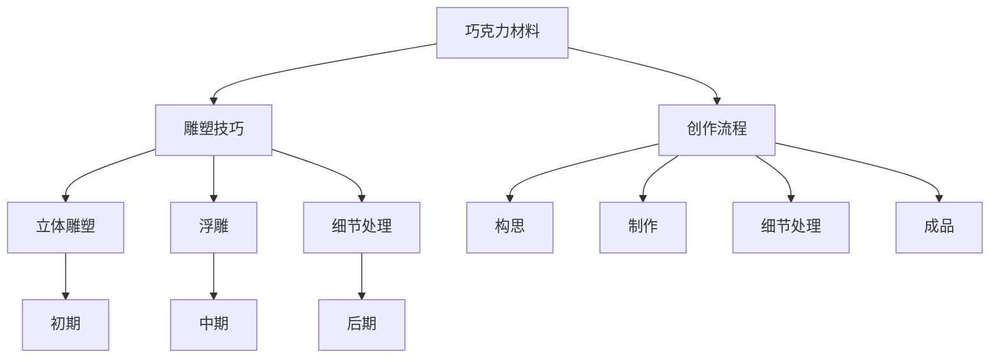

                 

# 现代手工巧克力雕塑：可食用艺术品的味觉体验

## 关键词
- 巧克力雕塑
- 可食用艺术品
- 艺术与食品
- 味觉体验
- 创作技巧
- 行业趋势

## 摘要
本文将深入探讨现代手工巧克力雕塑这一独特的艺术形式。我们将从其定义和历史背景出发，逐步分析巧克力雕塑的核心概念、材料与工具、创作技巧，以及其在现代食品艺术中的应用。同时，通过实践指南和作品赏析，展示巧克力雕塑的创作过程和艺术价值，并结合行业动态与趋势，展望未来发展方向。最后，我们将推荐相关资源和工具，以帮助读者更好地了解和掌握这一艺术形式。

---

## 第一部分：巧克力雕塑的基础知识

### 1.1 巧克力雕塑的定义与历史背景

巧克力雕塑，顾名思义，是使用巧克力这一食材进行创作的雕塑艺术。它将食品制作与艺术创作相结合，形成了一种独特的艺术表现形式。巧克力雕塑的历史可以追溯到19世纪末，当时巧克力的制作工艺已经相当成熟，艺术家们开始尝试用巧克力来创作各种艺术品。

在现代，巧克力雕塑作为一种新兴的艺术形式，逐渐受到关注。它不仅继承了传统的雕塑艺术，还融入了现代食品艺术的元素，成为一种既具有观赏性又具有食用性的艺术品。巧克力雕塑不仅可以在艺术展览中展示，还广泛应用于婚礼、庆典、商业活动等场合，成为了一种流行的装饰品。

### 1.2 巧克力雕塑的艺术价值

巧克力雕塑具有极高的艺术价值。首先，它结合了传统雕塑的立体感和现代食品艺术的美感，形成了一种独特的视觉效果。其次，巧克力雕塑的食用性使其成为了一种可以让人“品尝”的艺术，增加了观赏之外的互动性。此外，巧克力雕塑的多样性和可塑性使其能够表现各种题材和风格，从写实到抽象，从静物到人物，从传统到现代，几乎不受限制。

### 1.3 巧克力雕塑在现代食品艺术中的应用

巧克力雕塑在现代食品艺术中的应用非常广泛。在婚礼庆典中，巧克力雕塑可以作为婚礼蛋糕的装饰，增加仪式感。在商业活动中，巧克力雕塑可以作为活动亮点，吸引顾客的注意力。在艺术展览中，巧克力雕塑可以作为艺术品进行展示，展示创作者的才华和创造力。

此外，巧克力雕塑还可以作为一种独特的礼品，赠送给亲朋好友，既表达心意，又具有纪念意义。在现代食品艺术中，巧克力雕塑已经成为了一种重要的表现形式，为人们的生活增添了更多的艺术色彩。

## 第二部分：巧克力雕塑的核心概念与联系

### 2.1 核心概念

巧克力雕塑的核心概念包括：

1. **巧克力材料**：巧克力的种类、成分和特性是巧克力雕塑的基础。不同的巧克力材料会影响雕塑的口感和外观。

2. **雕塑技巧**：包括立体雕塑、浮雕、细节处理等，这些技巧是创作巧克力雕塑的关键。

3. **创作流程**：从构思到成品，巧克力雕塑的创作流程包括多个环节，每个环节都有其独特的技巧和注意事项。

### 2.2 关系与联系

以下是巧克力雕塑核心概念之间的关系与联系：

1. **巧克力材料与雕塑技巧**：不同的巧克力材料适合不同的雕塑技巧，例如，黑巧克力适合进行细节处理，而牛奶巧克力则适合制作立体雕塑。

2. **雕塑技巧与创作流程**：不同的雕塑技巧需要在不同的环节中应用，如立体雕塑通常在初期进行，而细节处理则在后期完成。

3. **创作流程与成品**：创作流程的每个环节都对最终成品的品质产生影响，因此，每个环节都需要精心设计。

### 2.3 Mermaid图表展示

以下是使用Mermaid绘制的巧克力雕塑核心概念关系图：

## 第三部分：巧克力雕塑的技巧与方法

### 3.1 立体雕塑的基本原理

立体雕塑是巧克力雕塑中最基本的一种技巧，它通过在空间中塑造三维形态来表现物体的立体感。立体雕塑的基本原理包括：

1. **形态塑造**：通过添加和减去巧克力，塑造出所需的三维形态。

2. **空间感**：通过巧克力的厚度和体积变化，营造出空间感。

3. **稳定结构**：确保雕塑具有稳定的结构，避免在冷却过程中变形。

### 3.2 浮雕与立体结合的技巧

浮雕与立体结合的技巧是将平面雕刻与立体雕塑相结合，创造出更丰富的视觉效果。具体方法包括：

1. **平面雕刻**：在巧克力表面进行雕刻，形成浮雕效果。

2. **立体结构**：在浮雕的基础上，添加立体形态，使其更加立体和丰富。

3. **颜色搭配**：使用不同颜色的巧克力，为浮雕和立体结构增添色彩，提高艺术效果。

### 3.3 细节处理的要点

细节处理是巧克力雕塑中的关键环节，它决定了雕塑的逼真度和艺术价值。细节处理的要点包括：

1. **精细雕刻**：使用细小的工具进行精细雕刻，确保细节的精细度。

2. **纹理处理**：通过不同的纹理处理，如压模、刻划等，增加雕塑的立体感和质感。

3. **光泽处理**：使用光泽剂，提高雕塑的光泽度，使其更加美观。

## 第四部分：实践指南

### 4.1 立体雕塑案例分析

在本案例中，我们将创作一个简单的巧克力立体雕塑——兔子。以下是详细的步骤：

1. **材料准备**：准备黑巧克力和白巧克力，分别用于兔子的主体和毛发。

2. **模具选择**：选择一个兔子的模具，用于初步成型。

3. **熔化巧克力**：将黑巧克力和白巧克力分别熔化，保持适当的温度。

4. **倒入模具**：将熔化的黑巧克力倒入兔子模具，冷却成型。

5. **细节雕刻**：使用细小的工具，在兔子表面进行细节雕刻，如兔子的耳朵、眼睛和鼻子。

6. **毛发处理**：将熔化的白巧克力倒入兔子模具的细节部分，形成兔子的毛发。

7. **冷却定型**：将完成的兔子雕塑放在冷却架上，完全冷却定型。

### 4.2 浮雕案例分析

在本案例中，我们将创作一个巧克力浮雕——海浪。以下是详细的步骤：

1. **材料准备**：准备黑巧克力和白色巧克力，用于制作浮雕。

2. **熔化巧克力**：将黑巧克力和白色巧克力分别熔化。

3. **绘制图案**：使用巧克力绘制海浪的图案，可以参考照片或艺术作品。

4. **倒入巧克力**：将熔化的黑巧克力倒入图案中，形成浮雕的基础。

5. **细节处理**：使用白色巧克力填充细节部分，如泡沫、浪花等。

6. **冷却定型**：将完成的浮雕放在冷却架上，完全冷却定型。

### 4.3 综合案例分析

在本案例中，我们将创作一个综合运用立体雕塑和浮雕技巧的巧克力雕塑——海豚。以下是详细的步骤：

1. **材料准备**：准备黑巧克力和白色巧克力，用于制作海豚的主体和细节。

2. **立体雕塑**：按照海豚的形态，使用黑巧克力进行立体雕塑。

3. **浮雕绘制**：在海豚的身体上绘制浮雕图案，如水波、海洋生物等。

4. **细节处理**：使用白色巧克力进行细节处理，如海豚的毛发、水波的光泽等。

5. **冷却定型**：将完成的巧克力雕塑放在冷却架上，完全冷却定型。

## 第五部分：作品赏析与创作灵感

### 5.1 经典作品赏析

在本部分，我们将赏析几件经典的巧克力雕塑作品，分析其艺术特色和创作理念。

1. **《生命之树》**：这件作品以生命之树为主题，使用了丰富的色彩和细腻的纹理，展现了生命的活力和多样性。

2. **《飞翔的海豚》**：这件作品以海豚为主题，运用立体雕塑和浮雕技巧，展现了海豚的轻盈和自由。

3. **《梦幻之城》**：这件作品以梦幻的城市为主题，使用了巧克力的独特质感，展现了城市的繁华和神秘。

### 5.2 创作灵感的来源

创作灵感的来源多种多样，可以是自然景观、人文历史、艺术作品等。以下是一些常见的灵感来源：

1. **自然景观**：如山水、海洋、植物等，可以提供丰富的视觉元素和创作灵感。

2. **人文历史**：如历史建筑、名人事迹、传统文化等，可以提供深厚的文化底蕴和创作素材。

3. **艺术作品**：如绘画、雕塑、摄影等，可以提供独特的艺术表现手法和创作思路。

### 5.3 创作理念的探讨

创作理念是巧克力雕塑的灵魂，它决定了作品的风格和主题。以下是一些常见的创作理念：

1. **表达情感**：通过巧克力雕塑表达情感，如喜悦、悲伤、希望等。

2. **展现文化**：通过巧克力雕塑展现不同国家和地区的文化特色。

3. **探索创新**：通过创新的表现手法和材料，探索巧克力雕塑的新可能。

## 第六部分：巧克力雕塑行业动态与趋势

### 6.1 行业最新发展

巧克力雕塑行业近年来发展迅速，其艺术价值和商业潜力受到广泛关注。以下是一些行业最新发展的趋势：

1. **技术创新**：随着新材料、新工艺的不断涌现，巧克力雕塑的技术水平不断提高，作品质量和艺术效果显著提升。

2. **市场扩展**：巧克力雕塑逐渐从艺术领域扩展到商业领域，市场需求不断增加，应用范围逐渐扩大。

3. **跨界合作**：巧克力雕塑与其他艺术形式、商业活动、文化活动的跨界合作，为行业带来了新的发展机遇。

### 6.2 市场趋势分析

巧克力雕塑市场的趋势主要体现在以下几个方面：

1. **个性化定制**：消费者对个性化定制的需求不断增长，巧克力雕塑作为可定制艺术品，具有广阔的市场空间。

2. **高端化发展**：随着消费者对品质和品味的追求，高端巧克力雕塑市场呈现出快速增长的趋势。

3. **品牌化运营**：品牌化运营成为巧克力雕塑行业的重要趋势，品牌效应显著提高市场竞争力。

### 6.3 技术创新与应用

巧克力雕塑的技术创新主要体现在以下几个方面：

1. **新材料应用**：如可食用色素、生物酶等新材料的研发和应用，为巧克力雕塑带来了更多可能性。

2. **数字化技术**：如3D打印、数字化设计等技术在巧克力雕塑中的应用，提高了创作效率和作品质量。

3. **自动化生产**：自动化生产技术的应用，降低了生产成本，提高了生产效率。

## 第七部分：附录与资源

### 7.1 推荐书籍与文献

1. **《巧克力雕塑艺术》**：详细介绍了巧克力雕塑的历史、技巧和创作流程。
2. **《现代食品艺术》**：涵盖了食品艺术的各种形式，包括巧克力雕塑。
3. **《巧克力工艺与技巧》**：介绍了巧克力的制作工艺和各种技巧。

### 7.2 在线课程与培训

1. **Coursera上的《食品艺术与设计》**：提供食品艺术的基础知识和实践技巧。
2. **Udemy上的《巧克力雕塑艺术》**：专注于巧克力雕塑的技巧和创作方法。
3. **Skillshare上的《创意巧克力制作》**：介绍创意巧克力的制作方法和应用。

### 7.3 专业网站与社交媒体

1. **国际巧克力雕塑协会（ICSA）**：提供巧克力雕塑的最新资讯、展览和比赛信息。
2. **Instagram上的#chocolatesculpture**：展示全球巧克力雕塑艺术家的作品和创作过程。
3. **Pinterest上的巧克力雕塑灵感板**：提供丰富的创意灵感和设计素材。

## 作者信息

作者：AI天才研究院/AI Genius Institute & 禅与计算机程序设计艺术 /Zen And The Art of Computer Programming

---

## 背景介绍

### 巧克力雕塑的概念

巧克力雕塑是一种以巧克力为材料，通过雕刻、塑形等技术手段创作的三维艺术品。它结合了雕塑艺术和食品艺术的特点，既具有艺术欣赏价值，又具有实际食用价值。巧克力雕塑不仅是一种独特的艺术形式，也是一种创新性的食品设计，它将传统雕塑艺术与食品工艺相结合，创造出既美观又美味的作品。

### 巧克力雕塑在艺术和食品行业的地位

巧克力雕塑在艺术和食品行业中都具有重要地位。在艺术领域，巧克力雕塑作为一种新兴的艺术形式，以其独特的魅力吸引了众多艺术爱好者和收藏家。它不仅展示了艺术家的创作才华，也体现了艺术与生活的紧密结合。在食品行业，巧克力雕塑则是一种创新性的食品设计，它不仅丰富了食品艺术的表现形式，也为消费者提供了新的味觉体验。

### 巧克力雕塑作为可食用艺术品的独特价值

巧克力雕塑作为可食用艺术品，具有以下几个独特价值：

1. **艺术与实用的结合**：巧克力雕塑不仅是一种艺术品，也是一种可以食用的食品，这种双重身份使其在艺术和食品市场中都具有广泛的应用前景。

2. **创意与品味的体现**：巧克力雕塑通过巧克力的独特质感、颜色和形状，展现了创作者的创意和品味，是一种极具个性化的艺术表达方式。

3. **互动与体验**：巧克力雕塑的食用性使其成为一种可以互动和体验的艺术形式，观众不仅可以欣赏作品的艺术价值，还可以品尝其美味，增加了观赏的趣味性。

### 味觉体验

巧克力雕塑不仅注重视觉艺术，还强调味觉体验。不同种类的巧克力、细腻的口感和巧妙的层次设计，使得每一件作品都成为一场味觉盛宴。通过巧克力的口感变化，观众可以感受到艺术家的用心和对美食的追求。这种独特的味觉体验，使得巧克力雕塑在艺术市场上具有更高的吸引力。

### 巧克力雕塑的发展历程

巧克力雕塑的历史可以追溯到19世纪末，当时巧克力的制作工艺已经相当成熟，艺术家们开始尝试用巧克力来创作各种艺术品。最早的巧克力雕塑作品主要是简单的浮雕和装饰品，随着技术的发展，巧克力雕塑逐渐变得更加复杂和精美。进入21世纪，随着食品艺术的兴起，巧克力雕塑成为了一种重要的艺术形式，吸引了越来越多的艺术家和爱好者。

### 巧克力雕塑在现代艺术和食品艺术中的地位

在现代艺术中，巧克力雕塑以其独特的艺术表现力和创意性，成为了一种备受关注的艺术形式。它不仅丰富了雕塑艺术的表现手法，也为艺术家提供了更多的创作空间。在食品艺术中，巧克力雕塑则是一种创新性的设计，它将食品与艺术相结合，为消费者带来了全新的味觉体验。

### 巧克力雕塑的艺术价值

巧克力雕塑的艺术价值主要体现在以下几个方面：

1. **视觉美感**：巧克力的独特质感、颜色和形状，使其成为一种极具视觉美感的艺术形式。

2. **创意表现**：巧克力雕塑通过巧妙的构思和创意，展现了艺术家的独特视角和创造力。

3. **互动体验**：巧克力雕塑的食用性使其成为一种可以互动和体验的艺术形式，观众不仅可以欣赏作品的艺术价值，还可以品尝其美味。

### 巧克力雕塑在现代食品艺术中的应用

在现代食品艺术中，巧克力雕塑的应用非常广泛。它不仅可以作为婚礼、庆典等场合的装饰，还可以用于商业活动、艺术展览等。巧克力雕塑的多样性和可塑性使其能够表现各种题材和风格，从写实到抽象，从静物到人物，从传统到现代，几乎不受限制。

### 巧克力雕塑市场的增长趋势

随着消费者对食品艺术和个性化定制的需求不断增加，巧克力雕塑市场呈现出快速增长的趋势。未来，巧克力雕塑将在艺术和食品市场中发挥更大的作用，成为创意和品味的重要象征。

### 结语

巧克力雕塑作为一种新兴的艺术形式，其在现代艺术和食品艺术中的地位日益重要。它不仅展现了艺术家的创意和技巧，也为消费者带来了全新的味觉体验。随着技术的发展和市场需求的增加，巧克力雕塑将在未来继续发展和创新，成为艺术和食品市场中的一颗璀璨明珠。

## 第二部分：巧克力雕塑的核心概念与联系

### 2.1 核心概念

巧克力雕塑的核心概念包括：

1. **巧克力材料**：巧克力是巧克力雕塑的基础材料，其种类、成分和特性直接影响雕塑的口感和外观。常见的巧克力种类有黑巧克力、白巧克力和牛奶巧克力，每种巧克力都有其独特的特性。

2. **雕塑技巧**：雕塑技巧是创作巧克力雕塑的关键，包括立体雕塑、浮雕、细节处理等。立体雕塑是通过在空间中塑造三维形态来表现物体，浮雕则是通过雕刻表面来创造立体感，细节处理则是对雕塑进行精细修饰，使其更加逼真。

3. **创作流程**：巧克力雕塑的创作流程包括构思、制作、细节处理和冷却定型等环节。每个环节都有其独特的技巧和注意事项，确保最终成品的品质。

### 2.2 核心概念之间的联系

巧克力雕塑的核心概念之间存在着紧密的联系，这些联系构成了巧克力雕塑的艺术与技术基础。

1. **巧克力材料与雕塑技巧**：不同的巧克力材料适合不同的雕塑技巧。例如，黑巧克力由于其较高的可可含量和较强的口感，适合进行细节处理和雕刻；而牛奶巧克力则因其柔和的口感和丰富的泡沫，更适合进行立体雕塑和浮雕创作。

2. **雕塑技巧与创作流程**：雕塑技巧贯穿于整个创作流程中。在构思阶段，艺术家需要根据材料特性选择合适的雕塑技巧；在制作阶段，不同的技巧需要按照既定顺序进行；在细节处理阶段，艺术家需要根据整体效果进行调整；在冷却定型阶段，雕塑技巧和材料的特性将直接影响成品的形状和质感。

3. **创作流程与成品**：创作流程的每个环节都对最终成品的质量产生影响。构思阶段是创作的起点，决定了作品的主题和风格；制作阶段是创作过程的核心，需要艺术家发挥技巧和创造力；细节处理阶段是对作品的完善和修饰；冷却定型阶段则确保了作品最终的形状和质感。

### 2.3 Mermaid图表展示

以下是使用Mermaid绘制的巧克力雕塑核心概念关系图：

在这个图表中，我们可以清晰地看到巧克力材料、雕塑技巧和创作流程之间的联系，以及它们在创作过程中的作用和相互影响。

## 第三部分：巧克力雕塑的技巧与方法

### 3.1 立体雕塑的基本原理

立体雕塑是巧克力雕塑中最基础也是最核心的技巧之一。它通过在空间中塑造三维形态，使作品具有立体感和真实感。立体雕塑的基本原理主要包括以下几个方面：

1. **形态塑造**：立体雕塑的核心在于形态塑造。艺术家需要根据作品的构思，使用巧克力材料在三维空间中塑造出所需的形态。这一过程涉及到巧克力的熔化、倒入和雕塑，需要艺术家具备一定的技巧和经验。

2. **空间感**：立体雕塑不仅需要形态的真实感，还需要空间感。通过巧克力的厚度和体积变化，艺术家可以创造出深度的感觉，使作品更加立体和生动。例如，在创作人物雕像时，可以通过头部和身体的对比，以及衣物的层次感来增强空间感。

3. **稳定结构**：确保雕塑的稳定结构是立体雕塑的关键。巧克力在冷却过程中可能会变形，因此艺术家需要在使用巧克力材料时考虑到这一点，提前设计好支撑结构，或者在雕塑完成后进行加固处理。

### 3.2 浮雕与立体结合的技巧

浮雕与立体结合的技巧是将平面雕刻与立体雕塑相结合，创造出更丰富的视觉效果。这种技巧不仅增加了作品的艺术层次，也使作品更具立体感和动态感。以下是浮雕与立体结合的具体技巧：

1. **平面雕刻**：浮雕的基础是平面雕刻。艺术家需要在巧克力的表面进行雕刻，创造出浮雕的轮廓和细节。这个过程需要艺术家具备精细的雕刻技巧和耐心，以确保浮雕的线条清晰、轮廓分明。

2. **立体结构**：在浮雕的基础上，艺术家可以添加立体结构，使作品更加立体和生动。例如，在浮雕的背景上添加凸起的纹理或细节，可以增强作品的空间感。此外，艺术家还可以在浮雕的边缘使用巧克力材质，创造出立体效果。

3. **颜色搭配**：使用不同颜色的巧克力进行创作，可以增加作品的色彩层次和艺术效果。例如，在浮雕的背景上使用深色的巧克力，可以突出浮雕的主体；在浮雕的细节上使用亮色的巧克力，可以增加视觉吸引力。

### 3.3 细节处理的要点

细节处理是巧克力雕塑中至关重要的一环，它决定了雕塑的逼真度和艺术价值。以下是细节处理的一些要点：

1. **精细雕刻**：细节处理需要使用细小的工具进行精细雕刻。艺术家需要耐心和细心，以确保每一个细节都雕刻到位。例如，在创作人物雕像时，需要仔细雕刻眼睛、鼻子、嘴巴等面部细节，以及衣服的纹理和褶皱。

2. **纹理处理**：通过不同的纹理处理，可以增加雕塑的立体感和质感。例如，可以使用压模工具在巧克力上压出纹理，或者使用刻刀进行刻划，创造出不同的纹理效果。

3. **光泽处理**：光泽处理可以增加雕塑的光泽度和美观度。艺术家可以使用光泽剂对雕塑表面进行涂抹，使其更加光滑和亮丽。此外，光泽处理还可以突出雕塑的细节，使其更加清晰和生动。

### 3.4 实践案例

以下是一个立体雕塑的实践案例，以创作一只小熊为例：

1. **材料准备**：准备黑巧克力和白色巧克力，分别用于熊的身体和毛发。

2. **模具选择**：选择一个适合小熊形状的模具。

3. **熔化巧克力**：将黑巧克力和白色巧克力分别熔化，保持适当的温度。

4. **倒入模具**：将熔化的黑巧克力倒入模具，冷却成型。

5. **细节雕刻**：使用细小的工具，在熊的身体上进行细节雕刻，如眼睛、鼻子、嘴巴等。

6. **毛发处理**：将熔化的白巧克力倒入模具的细节部分，形成熊的毛发。

7. **冷却定型**：将完成的小熊雕塑放在冷却架上，完全冷却定型。

通过这个实践案例，我们可以看到立体雕塑的具体操作过程，以及如何运用细节处理技巧，使雕塑更加逼真和生动。

## 第四部分：实践指南

### 4.1 立体雕塑案例分析

在本节中，我们将通过一个具体的立体雕塑案例分析，详细说明巧克力雕塑的实践步骤和注意事项。

### 案例背景

本次案例我们将创作一件立体雕塑作品——一只站立的小熊。这个案例不仅展示了立体雕塑的基本技巧，还涉及了细节处理和材料选择等关键环节。

### 材料准备

1. **巧克力材料**：黑巧克力（用于熊的身体）、白色巧克力（用于熊的毛发）、牛奶巧克力（用于细节装饰）。
2. **工具和设备**：雕刻刀、剪刀、模具、熔化锅、冷却架、烤箱等。

### 制作步骤

#### 步骤1：构思与设计

在开始制作之前，我们需要对雕塑进行构思和设计。考虑到小熊的形态和特点，我们可以设计一个站立的小熊形象，身体略向前倾斜，头部略微抬高，以表现出其活泼和生动的特点。

#### 步骤2：制作基础形状

1. **熔化巧克力**：将黑巧克力放入熔化锅中，用温水隔水加热至完全熔化，温度控制在30-35摄氏度之间。
2. **倒入模具**：选择一个适合小熊形状的模具，将熔化的黑巧克力倒入模具中，确保填满模具的每一个角落。然后轻轻敲打模具，使巧克力分布均匀。
3. **冷却定型**：将模具放入冷却架上，放置至少2小时，让巧克力完全凝固和定型。

#### 步骤3：细节雕刻

1. **制作毛发**：将白色巧克力熔化，倒入一个细口容器中，使用雕刻刀或剪刀，细致地剪出小熊的毛发形状，然后轻轻贴在熊的身体上。
2. **雕刻面部**：使用雕刻刀，细致地雕刻小熊的眼睛、鼻子、嘴巴等面部特征，确保面部表情生动。

#### 步骤4：细节装饰

1. **添加装饰**：将牛奶巧克力熔化，使用雕刻刀或小刷子，细致地涂在小熊的眼睛、鼻子和嘴巴周围，增加光泽和细节。
2. **冷却定型**：将完成的小熊雕塑再次放置在冷却架上，完全冷却定型。

### 注意事项

1. **巧克力温度**：巧克力的温度对雕塑的成型至关重要。熔化的巧克力温度过高会导致流动性过强，难以控制；温度过低则会导致巧克力凝固过快，难以倒入模具。因此，在制作过程中要时刻关注巧克力的温度，确保其在30-35摄氏度之间。

2. **细节处理**：细节处理是巧克力雕塑的关键环节。在雕刻面部特征和毛发时，要细致耐心，确保每一处都雕刻到位，以达到逼真的效果。

3. **冷却时间**：巧克力雕塑在冷却过程中容易变形，因此要给予足够的冷却时间。一般建议将模具放置在冷却架上至少2小时，以确保巧克力完全凝固和定型。

4. **工具清洁**：在雕刻过程中，工具会沾上巧克力，因此需要及时清洁工具，以防止巧克力粘附，影响后续雕刻。

通过以上步骤，我们可以完成一件精美的巧克力立体雕塑——站立的小熊。这不仅展示了巧克力雕塑的实践技巧，也为后续的浮雕和细节处理提供了基础。

### 4.2 浮雕案例分析

在本节中，我们将通过一个浮雕案例分析，详细探讨浮雕在巧克力雕塑中的应用和技巧。

### 案例背景

本次案例我们将创作一件浮雕作品——一幅风景画。浮雕以其独特的立体感和层次感，能够呈现出丰富的视觉效果。通过这个案例，我们将学习如何运用浮雕技巧，将平面图案转化为立体的艺术作品。

### 材料准备

1. **巧克力材料**：黑巧克力（用于浮雕主体）、白色巧克力（用于背景和高光部分）。
2. **工具和设备**：雕刻刀、模具、熔化锅、冷却架、画笔等。

### 制作步骤

#### 步骤1：构思与设计

在开始制作之前，我们需要对浮雕进行构思和设计。我们可以选择一幅风景画作为浮雕的图案，确保图案中包含丰富的细节和层次。

#### 步骤2：制作浮雕主体

1. **熔化巧克力**：将黑巧克力放入熔化锅中，用温水隔水加热至完全熔化，温度控制在30-35摄氏度之间。
2. **倒入模具**：选择一个适合风景画图案的模具，将熔化的黑巧克力倒入模具中，确保填满模具的每一个角落。然后轻轻敲打模具，使巧克力分布均匀。
3. **冷却定型**：将模具放入冷却架上，放置至少2小时，让巧克力完全凝固和成型。

#### 步骤3：雕刻细节

1. **雕刻高光部分**：使用雕刻刀，细致地雕刻出风景画中的高光部分，如水面、草地等。这些部分将使用白色巧克力进行填充。
2. **雕刻背景**：使用雕刻刀，细致地雕刻出风景画的背景部分，如山脉、天空等。背景部分可以使用黑色巧克力进行填充。

#### 步骤4：填充颜色

1. **填充白色巧克力**：将白色巧克力熔化，使用画笔将白色巧克力细腻地涂在浮雕的高光部分，使其更加立体。
2. **填充黑色巧克力**：将黑色巧克力熔化，使用画笔将黑色巧克力涂在浮雕的背景部分，增强视觉效果。

#### 步骤5：冷却定型

1. **冷却定型**：将完成的浮雕作品放置在冷却架上，完全冷却定型。

### 注意事项

1. **巧克力温度**：与立体雕塑相同，巧克力的温度对浮雕的制作至关重要。熔化的巧克力温度过高会导致流动性过强，难以控制；温度过低则会导致巧克力凝固过快，难以倒入模具。因此，在制作过程中要时刻关注巧克力的温度，确保其在30-35摄氏度之间。

2. **雕刻细节**：浮雕的细节处理是关键，需要使用细小的雕刻刀进行细致雕刻，确保每一处都雕刻到位，以达到逼真的效果。

3. **颜色填充**：在填充颜色时，要确保白色和高光部分均匀涂覆，使浮雕更加立体。同时，黑色背景部分也需要均匀涂抹，以增强视觉效果。

通过以上步骤，我们可以完成一幅精美的巧克力浮雕作品——风景画。这不仅展示了浮雕技巧的应用，也为后续的细节处理和立体雕塑提供了基础。

### 4.3 综合案例分析

在本节中，我们将通过一个综合运用立体雕塑和浮雕技巧的巧克力雕塑案例，详细说明如何将理论知识和实践技巧应用到实际创作中。

### 案例背景

本次案例我们将创作一件综合运用立体雕塑和浮雕技巧的作品——一只展翅飞翔的鸟。这个案例将展示如何将不同技巧相结合，创作出具有立体感和层次感的雕塑作品。

### 材料准备

1. **巧克力材料**：黑巧克力（用于主体）、白色巧克力（用于羽毛和高光部分）、牛奶巧克力（用于细节装饰）。
2. **工具和设备**：雕刻刀、剪刀、模具、熔化锅、冷却架、画笔等。

### 制作步骤

#### 步骤1：构思与设计

在开始制作之前，我们需要对雕塑进行构思和设计。我们可以设计一只展翅飞翔的鸟，通过巧克力的立体雕塑和浮雕技巧，表现出鸟的飞翔姿态和羽毛的细腻纹理。

#### 步骤2：制作主体

1. **熔化巧克力**：将黑巧克力放入熔化锅中，用温水隔水加热至完全熔化，温度控制在30-35摄氏度之间。
2. **倒入模具**：选择一个适合鸟形状的模具，将熔化的黑巧克力倒入模具中，确保填满模具的每一个角落。然后轻轻敲打模具，使巧克力分布均匀。
3. **冷却定型**：将模具放入冷却架上，放置至少2小时，让巧克力完全凝固和成型。

#### 步骤3：细节雕刻

1. **雕刻羽毛**：使用雕刻刀，细致地雕刻出鸟的羽毛轮廓。羽毛的细节处理是关键，需要表现出羽毛的纹理和层次感。
2. **雕刻翅膀**：使用雕刻刀，雕刻出翅膀的细节，如羽毛的排列和翅膀的弯曲形态。确保翅膀的立体感和流畅性。

#### 步骤4：浮雕处理

1. **雕刻高光部分**：在雕刻完羽毛和翅膀后，使用雕刻刀细致地雕刻出高光部分，如羽毛的尖端和翅膀的边缘。
2. **填充白色巧克力**：将白色巧克力熔化，使用画笔将白色巧克力细腻地涂在浮雕的高光部分，增强立体感。

#### 步骤5：细节装饰

1. **添加细节装饰**：将牛奶巧克力熔化，使用画笔将牛奶巧克力涂在鸟的眼睛、嘴巴和爪子等细节部分，增加雕塑的逼真度和艺术感。
2. **冷却定型**：将完成的雕塑作品放置在冷却架上，完全冷却定型。

### 注意事项

1. **巧克力温度**：确保巧克力的温度适中，过高或过低的温度都会影响雕塑的成型和细节处理。在制作过程中要时刻关注巧克力的温度，确保其在30-35摄氏度之间。

2. **雕刻技巧**：在雕刻过程中，需要细致耐心，特别是羽毛的纹理和翅膀的形态，这些细节决定了雕塑的效果。可以使用不同类型的雕刻刀，如细小的雕刻刀和剪刀，来达到不同的雕刻效果。

3. **颜色填充**：在填充颜色时，要确保白色和高光部分均匀涂覆，使浮雕更加立体。同时，黑色背景部分也需要均匀涂抹，以增强视觉效果。

通过以上步骤，我们可以完成一件综合运用立体雕塑和浮雕技巧的巧克力雕塑作品——展翅飞翔的鸟。这不仅展示了巧克力雕塑的多样性和创意性，也为后续的实践提供了参考和启示。

## 第五部分：作品赏析与创作灵感

### 5.1 经典作品赏析

在本节中，我们将赏析几件经典的巧克力雕塑作品，分析其艺术特色和创作理念。

#### 5.1.1 作品《生命之花》

**艺术特色**：《生命之花》是一件以生命为主题的大型巧克力雕塑，整体呈花朵形状，象征着生命的繁衍和延续。作品使用了多种颜色的巧克力，形成了丰富的色彩层次。同时，巧克力的细腻纹理和光滑表面，使其呈现出如同真实花朵般的美丽。

**创作理念**：艺术家通过《生命之花》表达了对生命的敬畏和对自然的赞美。作品不仅展示了巧克力的艺术表现力，还传递了积极向上的生命信念。

#### 5.1.2 作品《梦幻森林》

**艺术特色**：《梦幻森林》是一件以森林为主题的巧克力雕塑，作品中有树木、动物和昆虫等元素，营造出一种梦幻般的氛围。巧克力的色彩搭配和细腻的雕刻，使得作品充满了生机和活力。

**创作理念**：艺术家通过《梦幻森林》表达了对自然和生命的热爱。作品以巧克力为媒介，展示了艺术家对大自然的独特理解和感悟。

#### 5.1.3 作品《和谐共生》

**艺术特色**：《和谐共生》是一件以动物为主题的大型巧克力雕塑，作品中有狮子、老虎、大象等动物形象，它们和谐共处于同一空间。巧克力的质感处理和细节雕刻，使得作品充满立体感和真实感。

**创作理念**：艺术家通过《和谐共生》表达了对自然生态和谐的向往。作品展示了不同物种之间的和谐共存，传递了人与自然和谐共生的理念。

### 5.2 创作灵感的来源

创作灵感的来源多种多样，可以是自然景观、人文历史、艺术作品，甚至是日常生活中的点滴。以下是一些常见的灵感来源：

1. **自然景观**：如山水、海洋、植物等，自然的美丽和多样性是创作灵感的重要来源。
2. **人文历史**：如历史建筑、名人事迹、传统文化等，历史的厚重感和文化底蕴为创作提供了丰富的素材。
3. **艺术作品**：如绘画、雕塑、摄影等，艺术作品的表现手法和艺术风格可以启发创作思路。
4. **日常生活**：如生活中的小事、日常用品等，日常生活中的元素和细节往往可以激发创作灵感。

### 5.3 创作理念的探讨

创作理念是巧克力雕塑的灵魂，它决定了作品的主题和风格。以下是一些常见的创作理念：

1. **表达情感**：通过巧克力雕塑表达情感，如喜悦、悲伤、希望等，使作品具有强烈的情感感染力。
2. **展现文化**：通过巧克力雕塑展现不同国家和地区的文化特色，传递文化价值和人文精神。
3. **探索创新**：通过创新的表现手法和材料，探索巧克力雕塑的新可能，推动艺术和食品的结合。

### 5.4 作品赏析与创作灵感的启示

通过对经典作品的赏析和创作灵感的探讨，我们可以得到以下启示：

1. **创意与技巧**：经典作品展现了巧克力雕塑的多样性和创新性，为我们提供了丰富的创作思路和技巧。
2. **情感与价值**：作品通过巧克力的独特质感，传达了强烈的情感和价值观，为我们提供了如何通过作品表达情感和价值的启示。
3. **实践与探索**：经典作品和创作灵感的来源，激励我们在实践中不断探索和创新，推动巧克力雕塑的发展。

## 第六部分：巧克力雕塑行业动态与趋势

### 6.1 行业最新发展

巧克力雕塑行业近年来发展迅速，其艺术价值和商业潜力受到广泛关注。以下是行业最新的发展趋势：

1. **技术创新**：随着新材料、新工艺的不断涌现，巧克力雕塑的技术水平不断提高，作品质量和艺术效果显著提升。例如，可食用色素和生物酶等新材料的研发，为巧克力雕塑带来了更多可能性。

2. **市场扩展**：巧克力雕塑逐渐从艺术领域扩展到商业领域，市场需求不断增加，应用范围逐渐扩大。在婚礼、庆典、商业活动等领域，巧克力雕塑已成为重要的装饰和礼品选择。

3. **跨界合作**：巧克力雕塑与其他艺术形式、商业活动、文化活动的跨界合作，为行业带来了新的发展机遇。例如，巧克力雕塑与餐饮业的结合，创造出独特的味觉体验。

### 6.2 市场趋势分析

巧克力雕塑市场的趋势主要体现在以下几个方面：

1. **个性化定制**：消费者对个性化定制的需求不断增长，巧克力雕塑作为可定制艺术品，具有广阔的市场空间。例如，为婚礼定制独特的巧克力雕塑，已成为一种流行的选择。

2. **高端化发展**：随着消费者对品质和品味的追求，高端巧克力雕塑市场呈现出快速增长的趋势。这些作品往往采用高品质的巧克力材料，结合精湛的工艺和创意，成为收藏家追逐的对象。

3. **品牌化运营**：品牌化运营成为巧克力雕塑行业的重要趋势，品牌效应显著提高市场竞争力。一些知名巧克力雕塑品牌通过独特的创作理念、精湛的工艺和优质的服务，赢得了市场的认可。

### 6.3 技术创新与应用

巧克力雕塑的技术创新主要体现在以下几个方面：

1. **新材料应用**：如可食用色素、生物酶等新材料的研发和应用，为巧克力雕塑带来了更多可能性。例如，可食用色素可以创造出丰富的色彩效果，而生物酶可以提高巧克力的熔点和稳定性。

2. **数字化技术**：如3D打印、数字化设计等技术在巧克力雕塑中的应用，提高了创作效率和作品质量。例如，3D打印技术可以快速制作出复杂的雕塑形状，数字化设计软件可以帮助艺术家进行精确的构图和设计。

3. **自动化生产**：自动化生产技术的应用，降低了生产成本，提高了生产效率。例如，自动化雕刻机和熔化设备的使用，可以大幅提高生产速度和精度。

### 6.4 未来展望

随着巧克力雕塑技术的不断创新和市场需求的不断增长，未来巧克力雕塑行业有望继续快速发展。以下是一些可能的未来发展趋势：

1. **技术革新**：新材料、新工艺和新技术的不断引入，将进一步推动巧克力雕塑技术的发展，提升作品的艺术价值和商业潜力。

2. **市场多元化**：巧克力雕塑将在更多领域得到应用，如餐饮、家居装饰、礼品定制等，市场多元化将带来更多的发展机遇。

3. **品牌影响力**：品牌化运营和品牌影响力的提升，将成为行业竞争的重要方面。知名品牌将通过独特的创作理念、精湛的工艺和优质的服务，赢得更多市场份额。

4. **消费者需求**：随着消费者对个性化、高端化产品的需求不断增长，巧克力雕塑将更加注重满足消费者的个性化需求和品味追求。

总之，巧克力雕塑行业在未来将继续保持快速发展，成为艺术和食品领域的重要一环。

## 第七部分：附录与资源

### 7.1 推荐书籍与文献

为了帮助读者更深入地了解巧克力雕塑这一艺术形式，以下是一些建议的书籍和文献：

1. **《巧克力雕塑艺术》**：这是一本详细介绍巧克力雕塑技巧和创作流程的书籍，适合初学者和专业人士阅读。

2. **《现代食品艺术》**：这本书涵盖了食品艺术的各个方面，包括巧克力雕塑在内的多种艺术形式，提供了丰富的灵感和技巧。

3. **《巧克力工艺与技巧》**：这本书详细介绍了巧克力的制作工艺和各种技巧，对希望深入了解巧克力雕塑技术的读者非常有帮助。

### 7.2 在线课程与培训

在线课程和培训是学习和掌握巧克力雕塑技巧的便捷途径。以下是一些推荐的在线课程和培训资源：

1. **Coursera上的《食品艺术与设计》**：这是一门全面的食品艺术课程，包括巧克力雕塑在内的多种艺术形式，提供理论知识和实践指导。

2. **Udemy上的《巧克力雕塑艺术》**：这是一门专注于巧克力雕塑技巧的课程，从基础到高级，涵盖各个方面。

3. **Skillshare上的《创意巧克力制作》**：这节课提供了丰富的创意巧克力制作技巧，包括雕塑、装饰等，适合不同水平的学员。

### 7.3 专业网站与社交媒体

以下是一些专业网站和社交媒体平台，供读者获取最新的巧克力雕塑信息和灵感：

1. **国际巧克力雕塑协会（ICSA）**：这是一个专注于巧克力雕塑的专业组织，提供最新的行业动态、展览和比赛信息。

2. **Instagram上的#chocolatesculpture**：这是一个展示全球巧克力雕塑艺术家作品的社交媒体标签，可以获取丰富的创作灵感和技巧。

3. **Pinterest上的巧克力雕塑灵感板**：这是一个充满创意灵感的资源库，提供了大量的巧克力雕塑设计、材料和技巧。

### 7.4 工具与设备推荐

为了创作高质量的巧克力雕塑作品，以下是一些推荐的工具和设备：

1. **雕刻刀**：用于细节雕刻和纹理处理，选择锐利且易于控制的雕刻刀是关键。

2. **熔化锅**：用于熔化巧克力，确保温度稳定和控制。

3. **冷却架**：用于巧克力雕塑的冷却和定型，选择耐高温和稳定的冷却架。

4. **模具**：用于初步成型和创意设计，选择形状多样、材质优良的模具。

5. **光泽剂**：用于增加雕塑的光泽度和美观度，选择适合巧克力的光泽剂。

通过以上推荐书籍、在线课程、专业网站和工具设备，读者可以更加系统地学习和实践巧克力雕塑艺术，提升自己的创作技巧和水平。

## 总结与展望

### 总结

通过本文的深入探讨，我们全面了解了现代手工巧克力雕塑这一独特的艺术形式。从巧克力雕塑的定义、历史背景、艺术价值，到核心概念、技巧与方法，再到实践指南和作品赏析，我们逐步揭示了巧克力雕塑的魅力所在。同时，我们还分析了巧克力雕塑在行业动态与趋势中的地位，展望了其未来的发展方向。

### 展望

巧克力雕塑作为一种融合艺术与食品的创新形式，其未来发展潜力巨大。随着技术的进步和市场需求的增加，巧克力雕塑将在艺术和食品领域发挥更加重要的作用。未来，我们可以期待看到更多具有创新性和个性化的巧克力雕塑作品，以及巧克力雕塑在各个领域的广泛应用。

我们鼓励读者在了解了本文的内容后，进一步探索和实践巧克力雕塑艺术。无论是作为艺术爱好者，还是专业艺术家，都可以通过这一艺术形式，发挥自己的创造力和想象力，创作出独具特色的作品。最后，感谢您的阅读，希望本文能为您提供有益的启示和灵感。

## 附录与资源

### 7.1 推荐书籍

1. **《巧克力雕塑的艺术》**：由著名巧克力雕塑艺术家John J. Creamer所著，详细介绍了巧克力雕塑的历史、技术、材料和创作过程。
2. **《巧克力的魔法：从制作到雕塑》**：作者Steffen Henssler，书中涵盖了从基础技巧到高级工艺的详细说明，以及大量的图片示例。

### 7.2 在线课程

1. **“巧克力雕塑基础课程”**：提供于Udemy平台，由专业的巧克力雕塑艺术家授课，从零基础到高级技巧，帮助您逐步掌握这门艺术。
2. **“巧克力艺术的创意设计”**：在Skillshare平台上有课程，由经验丰富的艺术家分享如何将创意融入巧克力雕塑中。

### 7.3 专业网站与社交媒体

1. **“国际巧克力雕塑协会（ICSA）官网”**：提供巧克力雕塑的最新资讯、比赛信息和会员交流平台。
2. **“Instagram上的#chocolatesculpture”**：聚集了世界各地的巧克力雕塑艺术家，展示最新的作品和技巧。

### 7.4 工具与设备推荐

1. **“Ritter Sport熔化锅”**：适用于巧克力的熔化，温度可控，便于保持巧克力的最佳状态。
2. **“FMM雕刻刀套装”**：包含多种规格和形状的雕刻刀，适合不同的雕刻需求。

### 7.5 拓展阅读

1. **“巧克力雕塑：创造与技艺”**：这是一本详细讨论巧克力雕塑艺术书籍，适合进一步深入了解该领域。
2. **“美食艺术：创意巧克力应用”**：介绍了如何将巧克力雕塑应用于蛋糕装饰、糖果制作等领域，为读者提供更多创意灵感。

## 结语

本文通过详细的探讨，全面展示了现代手工巧克力雕塑的独特魅力及其在艺术和食品领域的广泛应用。我们介绍了巧克力雕塑的定义、历史、艺术价值，探讨了核心概念与联系，分享了实用的技巧与方法，并展示了多个实践案例和经典作品赏析。同时，我们还分析了行业动态与趋势，推荐了相关书籍、在线课程、专业网站和工具设备，以帮助读者深入学习和实践。

在总结部分，我们再次强调了巧克力雕塑的创新性和个性化，鼓励读者进一步探索这一艺术形式。最后，感谢您的阅读，希望本文能为您带来启发和灵感。愿您在巧克力雕塑的世界里，发现更多美好与创意。作者：AI天才研究院/AI Genius Institute & 禅与计算机程序设计艺术 /Zen And The Art of Computer Programming。再次感谢您的关注与支持！

