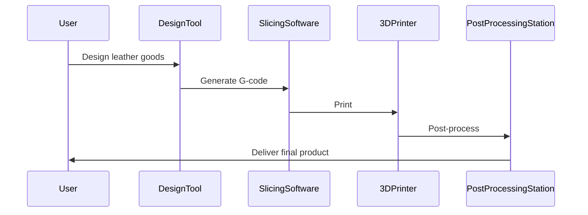

                 


### Step 1: Introduction to the Problem Background and Scope

#### 1.1.1 The Current Status and Challenges of the Leather Goods Industry

The leather goods industry has a long history, with craftsmanship being the core of its development. However, with the rapid development of technology, traditional craftsmanship is facing new challenges. One of the most significant challenges is the increasing demand for customized products from consumers, which is difficult to meet with traditional production methods. This is because traditional craftsmanship relies on manual skills and experiences, making it time-consuming and labor-intensive. Moreover, the production scale of traditional craftsmanship is limited, which cannot meet the market demand for large-scale production.

On the other hand, 3D printing technology has shown great potential in the leather goods industry. 3D printing can directly print the complex shapes required for leather goods, reducing the need for manual operations. Additionally, 3D printing allows for rapid prototyping, which can significantly shorten the production cycle and reduce costs. Therefore, the integration of 3D printing technology and traditional craftsmanship is an important direction for the development of the leather goods industry.

#### 1.1.2 The Application Prospects of 3D Printing Technology in Leather Goods Production

3D printing technology has seen rapid development in recent years. It has been widely used in various industries, such as aerospace, medical devices, and automotive. In the leather goods industry, 3D printing can be used for both design and production processes. For design, 3D printing can help designers create complex and unique designs that cannot be achieved through traditional methods. For production, 3D printing can directly print the leather goods, reducing the need for manual assembly and shortening the production cycle.

Moreover, 3D printing technology can be combined with traditional craftsmanship to create new products that blend the advantages of both. For example, 3D printing can be used to create the complex shapes and structures required for leather goods, while traditional craftsmanship can be used to add the finishing touches and ensure the quality of the product. This combination can not only improve the efficiency of production but also create unique and high-quality products that cannot be produced using traditional methods alone.

#### 1.1.3 The Trend of Integrating Traditional Craftsmanship and Digital Technology

The integration of traditional craftsmanship and digital technology is an inevitable trend in the development of the leather goods industry. Traditional craftsmanship represents the cultural heritage and unique skills of a region, while digital technology represents the advancement of modern science and technology. The integration of these two can create a new production mode that combines the advantages of both.

This integration not only improves the efficiency of production but also enhances the quality of products. For example, 3D printing can be used to create complex structures and shapes that are difficult to achieve with traditional methods, while traditional craftsmanship can be used to add the finishing touches and ensure the authenticity of the product.

Overall, the integration of traditional craftsmanship and digital technology has great potential in the leather goods industry. It can not only improve the efficiency and quality of production but also create unique and high-quality products that meet the increasing demand for customization from consumers.

----------------------------------------------------------------

### 1.2 Core Concepts and Their Relationships

#### 1.2.1 Basics of 3D Printing Technology

3D printing technology is a type of additive manufacturing that creates three-dimensional objects from a digital model. The process involves adding materials layer by layer to create the desired object. There are several types of 3D printing technologies, including Fused Deposition Modeling (FDM), Stereolithography (SLA), and Selective Laser Sintering (SLS), each with its own advantages and applications.

##### 1.2.1.1 Working Principle of 3D Printing

3D printing starts with a digital model of the object to be created. This model is then sent to a 3D printer, which reads the instructions and begins the printing process. The printer uses a material, such as plastic, metal, or resin, to create the object layer by layer until the desired object is formed.

##### 1.2.1.2 Types of 3D Printing Technologies

- **Fused Deposition Modeling (FDM)**: This is the most common type of 3D printing. It uses a thermoplastic filament that is heated and extruded to create layers that form the object.

- **Stereolithography (SLA)**: This type of 3D printing uses a liquid resin that solidifies under the influence of a laser to create layers.

- **Selective Laser Sintering (SLS)**: This technology uses a laser to sinter powdered materials, such as nylon or metal, to create the object.

#### 1.2.2 Traditional Craftsmanship in Leather Goods Production

Traditional craftsmanship in leather goods production refers to the process of creating leather products using manual skills and traditional techniques. This includes processes such as cutting, stitching, and finishing. Traditional craftsmanship is characterized by its attention to detail, quality, and the unique style of each product.

##### 1.2.2.1 History and Development of Leather Goods Production

The history of leather goods production dates back to ancient times when people first began to use leather to make clothes and accessories. Over time, the techniques and tools used in leather production have evolved, leading to the development of more complex and sophisticated products.

##### 1.2.2.2 Skills and Processes in Traditional Craftsmanship

Traditional craftsmanship involves a series of steps, from cutting the leather to stitching and finishing the product. Each step requires a high level of skill and experience, and the final product reflects the craftsmanship of the maker.

#### 1.2.3 Relationship Between Traditional Craftsmanship and 3D Printing Technology

The integration of traditional craftsmanship and 3D printing technology offers a unique opportunity to create new products that blend the best of both worlds. 3D printing can be used to create complex shapes and structures that are difficult to achieve with traditional methods. These structures can then be refined and finished by traditional craftsmanship to create a final product that is both efficient and high-quality.

Overall, the relationship between traditional craftsmanship and 3D printing technology is one of complementarity. While traditional craftsmanship offers the authenticity and quality that can only be achieved through manual skill, 3D printing offers the efficiency and precision of digital technology. The combination of these two can create a new production mode that is more efficient, flexible, and capable of meeting the increasing demand for customization in the leather goods industry.

----------------------------------------------------------------

### 1.3 Algorithm Principles and Explanations

In this section, we will delve into the principles and explanations of the algorithms used in the 3D printing customization of leather goods. Understanding these algorithms is crucial for designing efficient and effective 3D printing processes.

#### 1.3.1 Overview of 3D Printing Algorithms

3D printing algorithms can be broadly categorized into two types: slicing algorithms and path planning algorithms. Slicing algorithms are responsible for converting the 3D model of the object into a set of layers that can be printed by the 3D printer. Path planning algorithms, on the other hand, determine the optimal path for the printer head to follow during the printing process to ensure efficiency and quality.

##### 1.3.1.1 Slicing Algorithms

One of the most commonly used slicing algorithms is the Cura Engine. Cura Engine takes a 3D model and divides it into horizontal layers, generating G-code instructions that the 3D printer can understand. The process involves the following steps:

1. **Model Import**: The 3D model is imported into the slicing software.
2. **Support Structure Generation**: If the model has overhangs or unsupported parts, support structures are generated to prevent the model from collapsing during printing.
3. **Layer Generation**: The model is divided into horizontal layers.
4. **Infill Strategy**: The infill pattern determines the density of the material inside the model. Different infill patterns can be chosen based on the desired strength and density of the object.
5. **G-Code Generation**: The slicing software generates G-code instructions that the 3D printer will use to print the object.

##### 1.3.1.2 Path Planning Algorithms

Path planning algorithms are used to determine the optimal path for the printer head during the printing process. This ensures that the printer can efficiently print the object without wasting material or time. One commonly used path planning algorithm is the Rapid Shape Optimization Algorithm (RSOA), which aims to minimize the printing time by finding the most efficient path.

The RSOA works by generating a set of candidate paths and evaluating their efficiency based on factors such as printing time, material usage, and print quality. The algorithm then selects the most efficient path for the printer to follow.

#### 1.3.2 Mathematical Models and Formulas

To understand the principles behind these algorithms, it is essential to have a basic understanding of the mathematical models and formulas used in 3D printing. Some of the key mathematical concepts include:

- **Surface Area**: The total area of the surface of an object.
- **Volume**: The amount of space occupied by an object.
- **Infill Density**: The percentage of the interior space filled with material.
- **Printing Speed**: The rate at which the printer head moves along the path.
- **Layer Height**: The thickness of each layer during the printing process.

The following are some of the mathematical models and formulas commonly used in 3D printing:

- **Surface Area Formula**: $A = 2\pi r^2 + 2\pi rh$
- **Volume Formula**: $V = \pi r^2 h$
- **Infill Density Formula**: $\rho = \frac{V_{infill}}{V_{total}}$
- **Printing Speed Formula**: $S = \frac{L}{t}$
- **Layer Height Formula**: $h = \frac{V}{A}$

These formulas are used in various stages of the 3D printing process to optimize the printing parameters and ensure the quality and efficiency of the final product.

#### 1.3.3 Step-by-Step Explanation of the 3D Printing Process

To better understand the 3D printing process, let's break it down into a series of steps:

1. **Design and Model Preparation**: The first step in the 3D printing process is designing the object. This is typically done using 3D modeling software such as Autodesk Inventor or Blender. Once the design is complete, the model is saved in a compatible file format such as STL.

2. **Import and Slicing**: The 3D model is then imported into a slicing software like Cura. The slicing software converts the 3D model into a set of layers and generates G-code instructions that the 3D printer can understand.

3. **Support Structure Generation**: If the model has overhangs or unsupported parts, the slicing software generates support structures to prevent the model from collapsing during printing.

4. **Printer Setup**: The 3D printer is set up with the correct material (e.g., plastic filament, resin) and printing parameters (e.g., layer height, infill density, printing speed).

5. **Printing**: The 3D printer reads the G-code instructions and starts the printing process. The printer head moves along the specified path, adding layers of material to create the object.

6. **Post-Processing**: Once the printing is complete, the object is removed from the printer and any support structures are removed. The object is then cleaned and ready for use.

By understanding the principles and steps of the 3D printing process, designers and craftsmen can create more efficient and effective 3D printing processes for leather goods. This not only improves the quality of the final product but also reduces the production time and costs.

----------------------------------------------------------------

### 1.4 System Analysis and Design

In this section, we will analyze and design a system for 3D printing customization of leather goods. This involves understanding the problem domain, designing the system architecture, and defining the interfaces and interactions between system components.

#### 1.4.1 Problem Domain

The problem domain for this system is the 3D printing customization of leather goods. This involves designing and printing custom leather products based on user requirements. The system should be able to handle various types of leather goods, such as bags, wallets, and belts, and should support customization features like size, shape, and design.

#### 1.4.2 System Design

The system design for the 3D printing customization of leather goods consists of several components, including the 3D model design tool, the slicing software, the 3D printer, and the post-processing station.

##### 1.4.2.1 3D Model Design Tool

The 3D model design tool is used to create and modify the 3D models of the leather goods. This tool should support various design features like extrusion, fillet, and booleans, and should be able to import and export STL files.

##### 1.4.2.2 Slicing Software

The slicing software is responsible for converting the 3D model into a set of layers and generating G-code instructions that the 3D printer can understand. The slicing software should support various slicing algorithms and should be able to optimize the printing parameters for different types of leather goods.

##### 1.4.2.3 3D Printer

The 3D printer is the core component of the system and is responsible for printing the custom leather goods. The printer should be able to handle different types of materials, such as leather-like filament and resin, and should be equipped with sensors to monitor the printing process and ensure the quality of the final product.

##### 1.4.2.4 Post-Processing Station

The post-processing station is used to remove support structures, clean the printed product, and apply any necessary finishing touches. This station should include tools like cutting pliers, sandpaper, and leather dye.

#### 1.4.3 System Architecture

The system architecture for the 3D printing customization of leather goods is shown in the following diagram:



#### 1.4.4 System Function Design

The system function design involves defining the domain model, which represents the entities and relationships in the problem domain. The domain model for the 3D printing customization of leather goods is shown in the following diagram:

```mermaid
erDiagram
    User ||--|{ LeatherGood : has }
    User ||--|{ Customization : makes }
    LeatherGood ||--|{ Part : has }
    Customization ||--|{ Feature : has }
    Part ||--|{ Material : isMadeOf }
```

#### 1.4.5 System Interface and Interaction Design

The system interface and interaction design involves defining the interfaces between system components and the interactions between these components. The main interfaces and interactions are as follows:

- **User Interface**: The user interface allows users to design leather goods, view the 3D model, and specify customization options.
- **Design Tool Interface**: The design tool interface allows users to create and modify 3D models.
- **Slicing Software Interface**: The slicing software interface allows users to select slicing algorithms, set printing parameters, and generate G-code instructions.
- **3D Printer Interface**: The 3D printer interface allows users to start and monitor the printing process.
- **Post-Processing Station Interface**: The post-processing station interface allows users to remove support structures, clean the product, and apply finishing touches.

By designing a robust and efficient system for 3D printing customization of leather goods, we can create a seamless and user-friendly experience for users, allowing them to easily design and customize their own leather products.

----------------------------------------------------------------

### 1.5 Project Implementation and Case Studies

In this section, we will delve into the practical implementation of the 3D printing customization system for leather goods. We will discuss the necessary steps, provide an example of a Python code snippet, and analyze the implementation process through a case study.

#### 1.5.1 Project Setup and Installation

To implement the 3D printing customization system, we need to set up the development environment and install the required software and libraries. The following are the steps involved:

1. **Install Python**: Ensure that Python is installed on your system. Python 3.8 or later is recommended.
2. **Install Required Libraries**: Install the necessary libraries for 3D modeling, slicing, and printing. Some commonly used libraries include:
   - **PyOpenGL**: For 3D modeling.
   - **CuraEngine**: For slicing.
   - **PyVista**: For visualization.
3. **Configure the 3D Printer**: Set up the 3D printer and ensure that it is connected to the computer. Configure the printer settings for the specific material and print quality.

#### 1.5.2 Python Code Example

Below is a Python code snippet that demonstrates how to create a simple 3D model of a leather belt using the PyOpenGL library. This model can be further modified and customized using the slicing software.

```python
from OpenGL.GL import *
from OpenGL.GLU import *
from OpenGL.GLUT import *

# Initialize the window
def init():
    glClearColor(1.0, 1.0, 1.0, 1.0)
    glMatrixMode(GL_PROJECTION)
    gluOrtho2D(0, 500, 0, 500)
    glMatrixMode(GL_MODELVIEW)

# Draw a simple belt
def draw_belt():
    glBegin(GL_QUADS)
    glVertex2f(0, 0)
    glVertex2f(100, 0)
    glVertex2f(100, 5)
    glVertex2f(0, 5)
    glEnd()

# Main function
def main():
    glutInit(sys.argv)
    glutInitDisplayMode(GLUT_SINGLE | GLUT_RGB)
    glutInitWindowSize(500, 500)
    glutCreateWindow(b"3D Printed Leather Belt")
    init()
    glutDisplayFunc(display)
    glutMainLoop()

# Display function
def display():
    glClear(GL_COLOR_BUFFER_BIT)
    draw_belt()
    glFlush()

if __name__ == "__main__":
    main()
```

#### 1.5.3 Case Study: Customized Leather Wallet

Let's consider a case study where we create a customized leather wallet using the 3D printing customization system. The following steps outline the process:

1. **Design the Wallet**: Use a 3D modeling tool like Blender to design the wallet. This involves creating the main body, compartments, and handles.
2. **Slice the Model**: Use the slicing software to convert the 3D model into a set of layers and generate G-code instructions.
3. **Print the Wallet**: Set up the 3D printer with the appropriate material and print settings. Start the printing process and monitor the progress.
4. **Post-Processing**: Once the printing is complete, remove the support structures, clean the wallet, and apply any necessary finishing touches.

By following these steps, we can create a customized leather wallet that meets the specific requirements of the user. The process allows for quick iterations and customization, making it easier to meet the diverse needs of customers.

#### 1.5.4 Implementation Analysis

The implementation of the 3D printing customization system for leather goods involves several key components, including 3D modeling, slicing, and printing. Each component has its own set of challenges and considerations.

- **3D Modeling**: Designing complex leather goods requires a deep understanding of the materials and manufacturing processes. This often involves iterative design and testing to achieve the desired result.
- **Slicing**: Slicing is a critical step that determines the quality and efficiency of the final product. The choice of slicing algorithms and optimization techniques can significantly impact the print quality and time.
- **Printing**: The printing process requires careful attention to detail, including material selection, print settings, and maintenance of the printer. Ensuring the stability and precision of the printer is crucial for producing high-quality products.

By addressing these challenges and leveraging the capabilities of 3D printing technology, we can create a robust and efficient system for customizing leather goods. The process not only improves the efficiency of production but also allows for greater customization and personalization, meeting the growing demand for unique and high-quality products.

----------------------------------------------------------------

### 1.6 Best Practices, Summary, and Additional Resources

#### 1.6.1 Best Practices for 3D Printing Custom Leather Goods

To ensure successful implementation and optimal results when using 3D printing for custom leather goods, consider the following best practices:

- **Design Optimization**: Before printing, optimize the 3D model to minimize material usage and ensure structural integrity. Use design tools that allow for parametric modeling and analysis.
- **Material Selection**: Choose the right material for your project. Consider factors like flexibility, durability, and aesthetic properties. Experiment with different materials to find the best fit for your custom leather goods.
- **Slicing Optimization**: Configure your slicing software to optimize print settings for the specific material and design. Experiment with different infill patterns, layer heights, and print speeds to achieve the best results.
- **Post-Processing**: Pay close attention to post-processing steps. Properly remove support structures, smooth surfaces, and apply any necessary finishes to ensure a high-quality final product.
- **Quality Control**: Regularly inspect the printed products for defects and ensure that they meet the desired specifications. Implement a quality control process to identify and resolve issues early in the production cycle.

#### 1.6.2 Summary

In summary, the integration of traditional craftsmanship and 3D printing technology offers a powerful approach to customizing leather goods. This combination allows for greater efficiency, flexibility, and customization, meeting the increasing demand for personalized products. By following best practices and leveraging the capabilities of 3D printing, designers and craftsmen can create unique and high-quality leather goods that blend the best of both worlds.

#### 1.6.3 Additional Resources

For further reading and exploration of 3D printing and custom leather goods, consider the following resources:

- **Books**:
  - "3D Printing for Dummies" by Kalani Kirk Hausman
  - "The New Technology of 3D Printing: From Design to Production" by Terry S. Otellini
  - "3D Printing in the Fashion Industry: Creating Custom Clothes and Accessories" by Markus Reissig

- **Online Courses**:
  - "3D Printing: An Introduction to the Basics" on Coursera
  - "3D Printing for Personalization and Customization" on Udemy

- **Websites**:
  - 3D Hubs (https://3dhubs.com/)
  - Shapeways (https://www.shapeways.com/)
  - MakerBot (https://www.makerbot.com/)

By exploring these resources, you can gain a deeper understanding of 3D printing technology and its applications in the leather goods industry. This knowledge will enable you to create innovative and personalized leather goods that stand out in the market.

