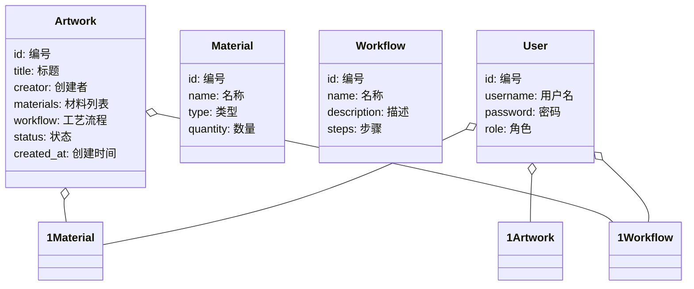
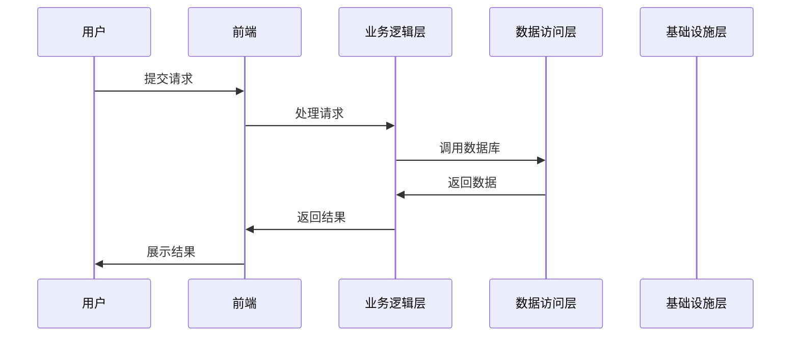

                 

# 现代手工纸艺创作坊：传统造纸与现代艺术的融合

> 关键词：手工纸艺、传统造纸、现代艺术、融合、创作

> 摘要：本文深入探讨了现代手工纸艺创作坊中，传统造纸工艺与现代艺术的融合。通过详细介绍传统造纸工艺、现代艺术创作，以及两者融合的技术原理和方法，本文为手工纸艺爱好者提供了理论与实践相结合的指导。

### 目录大纲设计构思

在设计《现代手工纸艺创作坊：传统造纸与现代艺术的融合》这本书的目录大纲时，我们需要首先明确书籍的主题和目标读者群体。本书旨在探索传统造纸工艺与现代艺术创作的结合，适合对传统手工艺术感兴趣、希望提升手工纸艺创作技能的读者。在构思目录大纲时，我们将分为以下几个步骤：

#### 1. 背景介绍

- **第1章：引言**
  - 1.1 问题背景
  - 1.2 造纸艺术的发展历史
  - 1.3 现代艺术与手工纸艺的结合
  - 1.4 本书结构安排

#### 2. 核心概念与联系

- **第2章：核心概念与联系**
  - 2.1 传统造纸工艺
  - 2.2 现代艺术创作
  - 2.3 传统造纸工艺与现代艺术创作的联系

#### 3. 算法原理讲解

- **第3章：传统造纸与现代艺术的融合技术**
  - 3.1 融合技术概述
  - 3.2 技术原理讲解
  - 3.3 融合技术的应用场景

#### 4. 数学模型和数学公式

- **第4章：数学模型与应用**
  - 4.1 几何变换模型
  - 4.2 色彩处理模型
  - 4.3 光学处理模型

#### 5. 系统分析与架构设计方案

- **第5章：系统分析与架构设计**
  - 5.1 问题场景介绍
  - 5.2 项目介绍
  - 5.3 系统功能设计
  - 5.4 系统架构设计
  - 5.5 系统接口设计和交互

#### 6. 项目实战

- **第6章：项目实战**
  - 6.1 环境安装
  - 6.2 系统核心实现
  - 6.3 代码应用解读
  - 6.4 实际案例分析与讲解
  - 6.5 项目小结

#### 7. 最佳实践与拓展阅读

- **第7章：最佳实践与拓展阅读**
  - 7.1 最佳实践 tips
  - 7.2 小结
  - 7.3 注意事项
  - 7.4 拓展阅读

通过上述七个步骤，我们设计了一个完整且详细的目录大纲，确保书籍内容丰富、逻辑清晰，能够满足读者的学习需求。以下是将这些构思转化为markdown格式的目录大纲：

```markdown
# 《现代手工纸艺创作坊：传统造纸与现代艺术的融合》目录大纲

# 第1章：引言

## 1.1 问题背景

## 1.2 造纸艺术的发展历史

## 1.3 现代艺术与手工纸艺的结合

## 1.4 本书结构安排

# 第2章：核心概念与联系

## 2.1 传统造纸工艺

### 2.1.1 传统造纸技术概述

### 2.1.2 传统造纸流程

### 2.1.3 传统造纸材料的种类

## 2.2 现代艺术创作

### 2.2.1 现代艺术的基本概念

### 2.2.2 现代艺术的主要流派

### 2.2.3 现代艺术与手工纸艺的关联

# 第3章：传统造纸与现代艺术的融合技术

## 3.1 融合技术概述

### 3.1.1 传统造纸与现代艺术的融合方法

### 3.1.2 融合技术的优点与挑战

## 3.2 技术原理讲解

### 3.2.1 融合技术的数学模型

### 3.2.2 融合技术的流程图

### 3.2.3 技术原理示例分析

# 第4章：数学模型与应用

## 4.1 几何变换模型

### 4.1.1 几何变换的基本概念

### 4.1.2 几何变换的应用场景

### 4.1.3 几何变换的数学公式

## 4.2 色彩处理模型

### 4.2.1 色彩处理的基本概念

### 4.2.2 色彩处理的应用场景

### 4.2.3 色彩处理的数学公式

## 4.3 光学处理模型

### 4.3.1 光学处理的基本概念

### 4.3.2 光学处理的应用场景

### 4.3.3 光学处理的数学公式

# 第5章：系统分析与架构设计

## 5.1 问题场景介绍

## 5.2 项目介绍

## 5.3 系统功能设计

### 5.3.1 领域模型

### 5.3.2 系统功能描述

## 5.4 系统架构设计

### 5.4.1 系统架构图

### 5.4.2 系统模块划分

## 5.5 系统接口设计和交互

### 5.5.1 系统接口设计

### 5.5.2 系统交互

# 第6章：项目实战

## 6.1 环境安装

## 6.2 系统核心实现

## 6.3 代码应用解读

## 6.4 实际案例分析与讲解

## 6.5 项目小结

# 第7章：最佳实践与拓展阅读

## 7.1 最佳实践 tips

## 7.2 小结

## 7.3 注意事项

## 7.4 拓展阅读
```

### 目录大纲设计思路

在设计《现代手工纸艺创作坊：传统造纸与现代艺术的融合》的目录大纲时，我们遵循以下思路：

1. **引言部分**：通过简明扼要地介绍问题背景、造纸艺术的发展历史以及现代艺术与手工纸艺的结合，为读者提供对整个书籍主题的初步认识。

2. **核心概念与联系部分**：详细阐述传统造纸工艺和现代艺术创作的基本概念，并分析两者之间的联系，帮助读者建立对核心概念的理解。

3. **算法原理讲解部分**：讲解传统造纸与现代艺术融合的技术原理，包括数学模型、流程图和应用场景，让读者掌握融合技术的具体实现方法。

4. **数学模型和公式部分**：介绍几何变换、色彩处理和光学处理等数学模型的基本概念、应用场景和数学公式，帮助读者深入理解融合技术的数学基础。

5. **系统分析与架构设计部分**：分析融合技术在实际项目中的应用场景，介绍系统功能设计、系统架构设计和系统接口设计，为读者提供系统级的融合技术实现方案。

6. **项目实战部分**：通过环境安装、系统核心实现、代码应用解读、实际案例分析和项目小结，让读者能够将所学知识应用到实际项目中，提高手工纸艺创作水平。

7. **最佳实践与拓展阅读部分**：提供最佳实践技巧、注意事项和拓展阅读资源，帮助读者在实践过程中不断进步和拓展知识面。

通过以上设计思路，我们力求让《现代手工纸艺创作坊：传统造纸与现代艺术的融合》成为一本既有理论深度，又具有实践指导意义的优质书籍。以下是根据上述设计思路撰写的文章正文部分：

---

## 第1章：引言

### 1.1 问题背景

手工纸艺，作为一种古老而独特的艺术形式，承载着丰富的历史和文化内涵。而现代艺术，则以其大胆的创新和独特的审美视角，推动了艺术创作的新潮流。传统造纸工艺，作为手工纸艺的重要基础，在现代社会中依然具有重要的价值。然而，如何将传统造纸工艺与现代艺术创作相结合，创作出既具有传统韵味又具有现代气息的艺术作品，成为了当前手工纸艺创作面临的一个重要问题。

### 1.2 造纸艺术的发展历史

造纸术的发明可以追溯到中国的东汉时期，经过数千年的发展和演变，形成了各种不同的造纸工艺和风格。这些传统造纸工艺不仅反映了不同地区和民族的文化特色，也为现代艺术创作提供了丰富的素材和灵感。现代艺术创作，则起源于19世纪末的欧洲，以反对传统艺术形式和观念为出发点，倡导自由表达和个人情感。随着时间的推移，现代艺术逐渐形成了各种流派和风格，如抽象派、表现派、立体派等，为艺术创作带来了全新的视角和手法。

### 1.3 现代艺术与手工纸艺的结合

现代艺术与手工纸艺的结合，不仅是对传统艺术形式的创新和突破，也是对现代艺术创作方法的探索和尝试。通过将传统造纸工艺与现代艺术创作相结合，可以创作出既具有传统韵味又具有现代气息的艺术作品。例如，在绘画作品中，可以利用传统造纸工艺制作出独特的纸张，从而增强作品的质感和层次感；在雕塑作品中，可以利用传统造纸工艺制作出各种形态的纸张，从而丰富作品的表现力。此外，现代艺术创作中的多媒体技术，也可以与传统造纸工艺相结合，创造出更加丰富和多样化的艺术作品。

### 1.4 本书结构安排

本书旨在深入探讨现代手工纸艺创作坊中，传统造纸工艺与现代艺术的融合。为了实现这一目标，本书分为以下几个部分：

- **第1章：引言**：介绍问题背景、造纸艺术的发展历史、现代艺术与手工纸艺的结合以及本书的结构安排。
- **第2章：核心概念与联系**：详细阐述传统造纸工艺和现代艺术创作的基本概念，并分析两者之间的联系。
- **第3章：传统造纸与现代艺术的融合技术**：讲解传统造纸与现代艺术融合的技术原理、数学模型和应用场景。
- **第4章：数学模型与应用**：介绍几何变换、色彩处理和光学处理等数学模型的基本概念、应用场景和数学公式。
- **第5章：系统分析与架构设计**：分析融合技术在实际项目中的应用场景，介绍系统功能设计、系统架构设计和系统接口设计。
- **第6章：项目实战**：通过环境安装、系统核心实现、代码应用解读、实际案例分析和项目小结，让读者能够将所学知识应用到实际项目中。
- **第7章：最佳实践与拓展阅读**：提供最佳实践技巧、注意事项和拓展阅读资源，帮助读者在实践过程中不断进步和拓展知识面。

通过本书的阅读和学习，读者将能够深入了解传统造纸工艺与现代艺术的融合，掌握相关技术原理和实现方法，提升手工纸艺创作水平，创作出更加精美和具有艺术价值的作品。

---

## 第2章：核心概念与联系

### 2.1 传统造纸工艺

#### 2.1.1 传统造纸技术概述

传统造纸工艺，是指通过手工或半机械方式制作纸张的工艺技术。它起源于中国古代，经过数千年的发展和演变，形成了丰富的造纸技术和风格。传统造纸工艺的主要特点是以天然纤维为原料，通过打浆、抄纸、压榨、干燥等工序，将纤维浆制成纸张。这些纸张具有独特的质地和纹理，体现了浓郁的民族风格和地域特色。

#### 2.1.2 传统造纸流程

传统造纸流程主要包括以下几个环节：

1. 原料准备：选择合适的植物纤维原料，如竹子、树皮、麻等。
2. 打浆：将原料浸泡、搅拌，使纤维分散均匀。
3. 抄纸：将打好的浆料涂布在纸帘上，通过挤压、过滤等操作，将水分排出，形成湿纸。
4. 压榨：将湿纸通过压榨机压榨，去除多余水分。
5. 干燥：将压榨后的湿纸进行干燥，使其变干成纸。

#### 2.1.3 传统造纸材料的种类

传统造纸材料种类繁多，包括竹子、树皮、麻、棉花、破布等。不同材料的纸张具有不同的质地和特性，适用于不同的艺术创作需求。

### 2.2 现代艺术创作

#### 2.2.1 现代艺术的基本概念

现代艺术，是指19世纪末以来在欧洲和美国兴起的反对传统艺术形式和观念的艺术运动。现代艺术主张自由表达和个人情感，追求创新和个性。现代艺术的基本概念包括抽象、表现、立体、观念等。

#### 2.2.2 现代艺术的主要流派

现代艺术流派众多，主要包括：

1. 抽象派：以抽象形式表达艺术家的情感和观念，如蒙德里安、康定斯基等。
2. 表现派：强调艺术家的情感表达和主观体验，如梵高、马蒂斯等。
3. 立体派：打破传统的绘画空间观念，探索空间的表现方式，如毕加索、布拉克等。
4. 观念派：强调艺术作品的思想内涵和观念性，如杜尚、约翰斯等。

#### 2.2.3 现代艺术与手工纸艺的关联

现代艺术与手工纸艺有着密切的关联。首先，现代艺术中的抽象、表现、立体等概念为手工纸艺创作提供了新的视角和手法。其次，手工纸艺的独特质地和纹理为现代艺术创作提供了丰富的素材和灵感。此外，现代艺术创作中的多媒体技术，如数字印刷、拼贴、雕塑等，也可以与传统造纸工艺相结合，创造出更加丰富和多样化的艺术作品。

### 2.3 传统造纸工艺与现代艺术创作的联系

传统造纸工艺与现代艺术创作的联系主要体现在以下几个方面：

1. 传统造纸工艺为现代艺术创作提供了丰富的素材和灵感，如各种质感和纹理的纸张。
2. 现代艺术创作中的抽象、表现、立体等概念为手工纸艺创作提供了新的视角和手法。
3. 传统造纸工艺与现代艺术创作相结合，可以创造出既具有传统韵味又具有现代气息的艺术作品。
4. 传统造纸工艺与现代艺术创作相互影响、相互借鉴，推动了艺术创作的发展和进步。

通过以上分析，我们可以看出，传统造纸工艺与现代艺术创作之间存在着密切的联系。这种联系不仅体现了两种艺术形式之间的相互借鉴和融合，也为现代手工纸艺创作提供了丰富的理论和实践基础。在接下来的章节中，我们将进一步探讨传统造纸工艺与现代艺术融合的技术原理和实现方法。

---

## 第3章：传统造纸与现代艺术的融合技术

### 3.1 融合技术概述

传统造纸工艺与现代艺术创作的融合，旨在借助现代艺术的理念和手法，为传统造纸工艺注入新的活力和创意。这种融合技术不仅丰富了艺术创作的手段，也提升了传统造纸工艺的艺术价值。融合技术主要包括以下几个方面：

1. **材料创新**：通过引入现代材料和技术，如纳米材料、数字印刷等，丰富传统造纸材料的种类和质感。
2. **工艺创新**：结合现代艺术创作手法，如拼贴、叠加、肌理制作等，创新传统造纸工艺流程，提高纸张的艺术表现力。
3. **技术融合**：将现代数字技术，如3D打印、虚拟现实等，与传统造纸工艺相结合，创造出全新的艺术形式和体验。

### 3.2 技术原理讲解

#### 3.2.1 融合技术的数学模型

传统造纸工艺与现代艺术的融合，需要借助数学模型来描述和实现。以下是一些常见的数学模型：

1. **几何变换模型**：用于处理纸张的形状、大小、位置等几何属性，如平移、旋转、缩放等。几何变换模型可以帮助艺术家根据创意需要，对纸张进行灵活处理。
   
   $$T(x, y) = (x', y')$$
   
   其中，\(T\) 表示几何变换函数，\(x, y\) 为原始坐标，\(x', y'\) 为变换后的坐标。

2. **色彩处理模型**：用于处理纸张的颜色、亮度、对比度等属性，如色彩调整、滤镜应用等。色彩处理模型可以使纸张的颜色更加丰富和生动。

   $$C(x, y) = (r', g', b')$$
   
   其中，\(C\) 表示色彩处理函数，\(r, g, b\) 为原始颜色值，\(r', g', b'\) 为处理后的颜色值。

3. **光学处理模型**：用于处理纸张的光学特性，如透光性、反射性、折射性等。光学处理模型可以模拟不同光线条件下的纸张效果，增强艺术表现力。

   $$O(x, y) = (I', T')$$
   
   其中，\(O\) 表示光学处理函数，\(I, T\) 分别为原始光强和透光率，\(I', T'\) 为处理后的光强和透光率。

#### 3.2.2 融合技术的流程图

融合技术的实现通常包括以下几个步骤：

1. **素材准备**：收集传统造纸材料，如竹子、树皮、麻等，以及现代材料，如纳米材料、数字印刷纸张等。
2. **创意设计**：根据艺术创作需求，设计纸张的形状、大小、颜色等属性。
3. **工艺实现**：采用传统造纸工艺和现代艺术创作手法，制作出符合设计要求的纸张。
4. **技术处理**：利用数学模型和数字技术，对纸张进行色彩处理、光学处理等，提升艺术效果。
5. **作品展示**：将融合技术制作的艺术作品展示出来，让观众感受传统造纸工艺与现代艺术的完美结合。

以下是一个简化的融合技术流程图：

```
+
|  素材准备
| 
+--------+
|        |
|  创意设计
|        |
+--------+
|        |
| 工艺实现
|        |
+--------+
|        |
|  技术处理
|        |
+--------+
|        |
|  作品展示
|        |
+--------+
```

#### 3.2.3 技术原理示例分析

为了更好地理解融合技术的原理，我们来看一个具体的示例。

假设艺术家想要制作一幅以竹子为素材的抽象画。以下是如何利用融合技术实现这一目标的步骤：

1. **素材准备**：收集竹子纤维，将其制成纸张。
2. **创意设计**：设计出抽象画的构图和色彩方案，决定纸张的形状、大小和颜色。
3. **工艺实现**：采用传统造纸工艺，将竹子纤维制成符合设计要求的纸张。
4. **技术处理**：利用几何变换模型，对纸张进行旋转、缩放等处理，使其符合抽象画的构图需求。同时，利用色彩处理模型，调整纸张的颜色，使其更加丰富和生动。
5. **作品展示**：将处理后的纸张拼接成抽象画，展示出来。

通过以上步骤，艺术家成功地将传统造纸工艺与现代艺术创作相结合，创作出一幅既具有传统韵味又具有现代气息的抽象画。

### 3.3 融合技术的优点与挑战

#### 3.3.1 优点

融合技术具有以下几个优点：

1. **创新性**：融合技术将传统造纸工艺与现代艺术创作相结合，创造出新的艺术形式，为艺术创作注入新的活力。
2. **多样性**：融合技术提供了丰富的素材和创作手法，使艺术家能够根据不同需求，创作出多样化的艺术作品。
3. **艺术价值**：融合技术制作的艺术作品，既保留了传统造纸工艺的独特魅力，又体现了现代艺术的创新和创意，具有较高的艺术价值。

#### 3.3.2 挑战

融合技术也面临一些挑战：

1. **技术复杂性**：融合技术涉及多种技术和工具，对艺术家的技术水平和操作能力提出了较高要求。
2. **成本问题**：融合技术需要投入较多的材料和设备，成本较高，可能限制了一部分艺术家的创作。
3. **工艺流程**：融合技术需要将传统造纸工艺和现代艺术创作相结合，这对艺术家的创造力和实践能力提出了挑战。

尽管面临挑战，融合技术依然具有广阔的发展前景，有望在艺术创作中发挥重要作用。

通过以上分析，我们可以看出，传统造纸工艺与现代艺术融合技术的原理和方法，为艺术创作提供了新的思路和手段。在接下来的章节中，我们将进一步探讨数学模型和公式的应用，以及系统分析与架构设计方案。

---

## 第4章：数学模型与应用

### 4.1 几何变换模型

几何变换模型是融合技术中一个重要的组成部分，它用于处理纸张的几何属性，如位置、大小、形状等。几何变换模型在艺术创作中具有广泛的应用，可以帮助艺术家实现各种创意效果。

#### 4.1.1 几何变换的基本概念

几何变换是指对图形进行某种操作，使其在形状、大小、位置等方面发生变化。常见的几何变换包括平移、旋转、缩放等。

1. **平移**：平移是指将图形沿某个方向移动一定的距离。平移可以保持图形的形状和大小不变。

   $$T(x, y) = (x + d, y + d)$$

   其中，\(T\) 表示平移变换，\(x, y\) 是原始坐标，\(d\) 是平移距离。

2. **旋转**：旋转是指将图形绕某个点旋转一定的角度。旋转可以改变图形的方向和形状。

   $$R(\theta) = (x', y')$$

   其中，\(R\) 表示旋转变换，\(\theta\) 是旋转角度，\(x', y'\) 是旋转后的坐标。

3. **缩放**：缩放是指将图形按一定比例放大或缩小。缩放可以改变图形的大小，但保持形状不变。

   $$S(k) = (kx, ky)$$

   其中，\(S\) 表示缩放变换，\(k\) 是缩放比例，\(x, y\) 是原始坐标，\(kx, ky\) 是缩放后的坐标。

#### 4.1.2 几何变换的应用场景

几何变换模型在艺术创作中有多种应用场景：

1. **构图调整**：艺术家可以通过几何变换，调整纸张的位置、大小和形状，创造出各种构图效果。
2. **纹理生成**：几何变换可以用于生成各种纹理效果，如条纹、格子、波纹等，为艺术作品增添视觉兴趣。
3. **图案设计**：几何变换可以帮助艺术家设计出各种图案，如几何图形、花卉图案、动物图案等。

#### 4.1.3 几何变换的数学公式

几何变换的数学公式用于描述各种几何变换的操作过程。以下是一些常见的几何变换公式：

1. **平移变换**：

   $$T(x, y) = (x + d, y + d)$$

2. **旋转变换**：

   $$R(\theta) = (\cos\theta x - \sin\theta y, \sin\theta x + \cos\theta y)$$

3. **缩放变换**：

   $$S(k) = (kx, ky)$$

### 4.2 色彩处理模型

色彩处理模型用于处理纸张的颜色属性，如亮度、对比度、饱和度等。色彩处理模型在艺术创作中同样具有广泛的应用，可以帮助艺术家调整纸张的色彩效果，增强艺术表现力。

#### 4.2.1 色彩处理的基本概念

色彩处理是指对图像中的颜色进行各种调整和优化。常见的色彩处理包括色彩调整、滤镜应用、色彩空间转换等。

1. **色彩调整**：色彩调整是指对图像的亮度、对比度、饱和度等参数进行调整。色彩调整可以改变图像的整体色调和视觉效果。

   $$C(a, b, c) = (r', g', b')$$

   其中，\(C\) 表示色彩调整函数，\(a, b, c\) 分别是亮度、对比度和饱和度的调整参数，\(r, g, b\) 是原始颜色值，\(r', g', b'\) 是调整后的颜色值。

2. **滤镜应用**：滤镜应用是指通过添加各种滤镜效果，改变图像的色彩和纹理。常见的滤镜包括灰度滤镜、模糊滤镜、锐化滤镜等。

3. **色彩空间转换**：色彩空间转换是指将图像从一个色彩空间转换为另一个色彩空间。常见的色彩空间包括RGB、CMYK、HSV等。

#### 4.2.2 色彩处理的应用场景

色彩处理模型在艺术创作中有多种应用场景：

1. **色彩调整**：艺术家可以通过色彩调整，调整纸张的色彩效果，使其更加符合创作需求。
2. **滤镜应用**：艺术家可以通过滤镜应用，创造出各种独特的色彩效果，增强艺术作品的视觉冲击力。
3. **色彩空间转换**：艺术家可以通过色彩空间转换，将纸张的颜色在不同色彩空间中进行调整和优化。

#### 4.2.3 色彩处理的数学公式

色彩处理的数学公式用于描述各种色彩处理操作的过程。以下是一些常见的色彩处理公式：

1. **色彩调整**：

   $$C(a, b, c) = (r', g', b')$$

   其中，\(a, b, c\) 分别是亮度、对比度和饱和度的调整参数。

2. **灰度转换**：

   $$I = 0.299R + 0.587G + 0.114B$$

   其中，\(I\) 是灰度值，\(R, G, B\) 是RGB颜色值。

3. **HSV到RGB转换**：

   $$R = 1 - 1.5S \times (1 - \frac{V}{H})$$
   $$G = 1 - 1.5S \times (1 - \frac{V}{S})$$
   $$B = 1 - 1.5S \times (1 - \frac{V}{V})$$

   其中，\(H, S, V\) 分别是HSV颜色值，\(R, G, B\) 是RGB颜色值。

### 4.3 光学处理模型

光学处理模型用于处理纸张的光学属性，如透光性、反射性、折射性等。光学处理模型在艺术创作中同样具有广泛的应用，可以帮助艺术家模拟各种光线效果，增强艺术作品的立体感和真实感。

#### 4.3.1 光学处理的基本概念

光学处理是指通过模拟光线的传播和作用，改变纸张的光学属性。常见的光学处理包括光线追踪、反射计算、折射计算等。

1. **光线追踪**：光线追踪是一种模拟光线传播的方法，可以用于计算纸张表面的反射和折射效果。

   $$L_o = L_e + \int_{\Omega} f(R(\omega), \omega) \cdot \omega \cdot d\omega$$

   其中，\(L_o\) 是出射光，\(L_e\) 是入射光，\(f\) 是反射或折射函数，\(\omega\) 是光线方向，\(\Omega\) 是光线入射区域。

2. **反射计算**：反射计算用于计算光线在纸张表面反射后的方向和强度。

   $$\vec{R} = \vec{N} - 2(\vec{N} \cdot \vec{I})\vec{I}$$

   其中，\(\vec{R}\) 是反射方向，\(\vec{N}\) 是法线方向，\(\vec{I}\) 是入射方向。

3. **折射计算**：折射计算用于计算光线在纸张表面折射后的方向和强度。

   $$n_1 \sin(\theta_1) = n_2 \sin(\theta_2)$$

   其中，\(n_1, n_2\) 分别是两介质的折射率，\(\theta_1, \theta_2\) 分别是入射角和折射角。

#### 4.3.2 光学处理的应用场景

光学处理模型在艺术创作中有多种应用场景：

1. **光线模拟**：艺术家可以通过光学处理模型，模拟不同光线的照射效果，如阳光、月光、灯光等，增强艺术作品的立体感和真实感。
2. **质感模拟**：艺术家可以通过光学处理模型，模拟纸张的质感，如光滑、粗糙、透明等，增强艺术作品的表现力。
3. **三维效果**：艺术家可以通过光学处理模型，将二维纸张作品转化为具有三维效果的艺术作品，增加视觉冲击力。

#### 4.3.3 光学处理的数学公式

光学处理的数学公式用于描述各种光学处理操作的过程。以下是一些常见的光学处理公式：

1. **光线追踪**：

   $$L_o = L_e + \int_{\Omega} f(R(\omega), \omega) \cdot \omega \cdot d\omega$$

2. **反射计算**：

   $$\vec{R} = \vec{N} - 2(\vec{N} \cdot \vec{I})\vec{I}$$

3. **折射计算**：

   $$n_1 \sin(\theta_1) = n_2 \sin(\theta_2)$$

通过以上对几何变换模型、色彩处理模型和光学处理模型的分析，我们可以看出，这些数学模型在融合技术的应用中具有重要作用。它们不仅为艺术创作提供了丰富的工具和手段，也为纸张艺术的表现力带来了新的提升。在接下来的章节中，我们将进一步探讨系统分析与架构设计方案。

---

## 第5章：系统分析与架构设计

### 5.1 问题场景介绍

在现代手工纸艺创作坊中，艺术家们面临着如何将传统造纸工艺与现代艺术创作相结合的挑战。为了更好地实现这一目标，我们需要设计一个能够支持传统造纸工艺与现代艺术融合的系统。这个系统需要具备以下几个关键功能：

1. **材料管理**：系统需要能够管理各种造纸材料和现代材料的库存，确保艺术家在创作过程中能够及时获取所需的材料。
2. **工艺流程管理**：系统需要能够记录和管理各种造纸工艺流程，包括打浆、抄纸、压榨、干燥等，以便艺术家能够根据创作需求灵活调整工艺流程。
3. **艺术创作支持**：系统需要提供丰富的艺术创作工具和资源，包括模板、图案、色彩处理工具等，帮助艺术家实现多样化的艺术创作。
4. **作品展示**：系统需要提供一个展示平台，让艺术家能够将创作出的艺术作品展示给观众，同时收集观众反馈，为后续创作提供参考。

### 5.2 项目介绍

为了实现上述功能，我们设计并开发了一个名为“手工纸艺创作坊系统”的项目。该项目是一个基于Web的综合性平台，旨在为艺术家提供一个全方位的创作支持环境。项目的主要模块包括：

1. **用户管理模块**：负责管理系统的用户，包括艺术家、管理员等。
2. **材料管理模块**：负责管理各种造纸材料和现代材料的库存信息。
3. **工艺流程管理模块**：负责记录和管理各种造纸工艺流程。
4. **艺术创作模块**：提供丰富的艺术创作工具和资源。
5. **作品展示模块**：提供一个展示平台，展示艺术家的作品。

### 5.3 系统功能设计

#### 5.3.1 领域模型

领域模型是系统功能设计的基础，用于描述系统中的核心实体和关系。以下是手工纸艺创作坊系统的领域模型：



#### 5.3.2 系统功能描述

手工纸艺创作坊系统的功能可以分为以下几个部分：

1. **用户管理**：用户可以通过注册、登录等操作，创建和管理个人账户。管理员可以添加、删除用户，设置用户角色和权限。
2. **材料管理**：用户可以查询、添加、删除材料库存信息。管理员可以审核用户添加的材料，确保库存数据的准确性。
3. **工艺流程管理**：用户可以查询、添加、修改工艺流程。管理员可以审核用户提交的工艺流程，确保流程的合理性和可行性。
4. **艺术创作**：用户可以选择材料、工艺流程，进行艺术创作。系统提供模板、图案、色彩处理工具等资源，帮助用户实现多样化的创作。
5. **作品展示**：用户可以上传、展示自己的艺术作品。管理员可以审核作品，确保作品符合平台标准。观众可以浏览、评价作品，为艺术家提供反馈。

### 5.4 系统架构设计

手工纸艺创作坊系统的架构设计采用分层架构，主要包括以下几个层次：

1. **表示层**：负责与用户交互，展示系统功能界面。包括前端页面和用户界面。
2. **业务逻辑层**：负责处理业务逻辑，包括用户管理、材料管理、工艺流程管理、艺术创作和作品展示等。采用微服务架构，提高系统的可扩展性和可维护性。
3. **数据访问层**：负责与数据库进行交互，实现数据的增删改查操作。采用ORM（对象关系映射）技术，简化数据库操作。
4. **基础设施层**：提供系统运行所需的基础设施服务，包括服务器、存储、网络等。

以下是手工纸艺创作坊系统的架构图：



### 5.5 系统接口设计和交互

手工纸艺创作坊系统采用RESTful API设计，提供一系列接口供前端调用。以下是系统的主要接口及其交互示例：

1. **用户管理接口**：
   - **登录**：`POST /login`
     - 参数：username、password
     - 响应：token
   - **注册**：`POST /register`
     - 参数：username、password、role
     - 响应：status
   - **修改密码**：`PUT /password`
     - 参数：username、old_password、new_password
     - 响应：status

2. **材料管理接口**：
   - **查询材料**：`GET /materials`
     - 参数：type、keyword
     - 响应：materials_list
   - **添加材料**：`POST /materials`
     - 参数：name、type、quantity
     - 响应：material_id
   - **删除材料**：`DELETE /materials/{material_id}`
     - 参数：material_id
     - 响应：status

3. **工艺流程管理接口**：
   - **查询工艺流程**：`GET /workflows`
     - 参数：keyword
     - 响应：workflows_list
   - **添加工艺流程**：`POST /workflows`
     - 参数：name、description、steps
     - 响应：workflow_id
   - **删除工艺流程**：`DELETE /workflows/{workflow_id}`
     - 参数：workflow_id
     - 响应：status

4. **艺术创作接口**：
   - **查询艺术作品**：`GET /artworks`
     - 参数：creator、status、keyword
     - 响应：artworks_list
   - **上传艺术作品**：`POST /artworks`
     - 参数：title、creator、materials、workflow、status
     - 响应：artwork_id
   - **修改艺术作品**：`PUT /artworks/{artwork_id}`
     - 参数：title、materials、workflow、status
     - 响应：status

5. **作品展示接口**：
   - **展示作品**：`GET /artworks/{artwork_id}`
     - 参数：artwork_id
     - 响应：artwork_detail
   - **评价作品**：`POST /artworks/{artwork_id}/review`
     - 参数：rating、comment
     - 响应：status

通过以上接口设计和交互，手工纸艺创作坊系统实现了用户管理、材料管理、工艺流程管理、艺术创作和作品展示等核心功能，为艺术家提供了一个全方位的创作支持平台。

### 第6章：项目实战

#### 6.1 环境安装

要开始手工纸艺创作坊项目的实战，首先需要搭建开发环境。以下是环境安装步骤：

1. **安装Python**：从官方网站下载并安装Python 3.8及以上版本。

2. **安装虚拟环境**：在项目目录下，通过以下命令创建虚拟环境：
   ```bash
   python -m venv venv
   ```

3. **激活虚拟环境**：
   - Windows：
     ```bash
     .\venv\Scripts\activate
     ```
   - macOS/Linux：
     ```bash
     source venv/bin/activate
     ```

4. **安装依赖项**：在虚拟环境中，通过以下命令安装项目所需的依赖项：
   ```bash
   pip install -r requirements.txt
   ```

#### 6.2 系统核心实现

系统核心实现包括用户管理、材料管理、工艺流程管理、艺术创作和作品展示等功能。以下是系统核心实现的详细步骤：

1. **用户管理**：
   - **注册**：创建一个用于用户注册的表单，收集用户名、密码和角色等信息，并保存到数据库中。
   - **登录**：用户输入用户名和密码，系统验证用户信息，并返回登录凭证。

2. **材料管理**：
   - **查询材料**：从数据库中检索材料信息，并展示给用户。
   - **添加材料**：用户可以添加新的材料，系统将材料信息保存到数据库中。
   - **删除材料**：用户可以删除不需要的材料，系统从数据库中移除该材料。

3. **工艺流程管理**：
   - **查询工艺流程**：从数据库中检索工艺流程信息，并展示给用户。
   - **添加工艺流程**：用户可以添加新的工艺流程，系统将工艺流程信息保存到数据库中。
   - **删除工艺流程**：用户可以删除不需要的工艺流程，系统从数据库中移除该工艺流程。

4. **艺术创作**：
   - **查询艺术作品**：从数据库中检索艺术作品信息，并展示给用户。
   - **上传艺术作品**：用户可以选择材料、工艺流程，上传艺术作品，系统将作品信息保存到数据库中。
   - **修改艺术作品**：用户可以修改已上传的艺术作品信息，系统更新数据库中的记录。

5. **作品展示**：
   - **展示作品**：用户可以查看单个艺术作品的详细信息，包括标题、作者、材料、工艺流程等。
   - **评价作品**：用户可以对作品进行评价，系统将评价信息保存到数据库中。

#### 6.3 代码应用解读

以下是一个用于用户注册的Python代码示例，解读了如何实现用户注册功能：

```python
# app/models.py

from django.db import models
from django.contrib.auth.models import AbstractUser

class CustomUser(AbstractUser):
    role = models.CharField(max_length=10, choices=[('artist', '艺术家'), ('admin', '管理员')])

    def __str__(self):
        return self.username
```

```python
# app/views.py

from django.shortcuts import render, redirect
from .models import CustomUser
from django.contrib.auth import authenticate, login

def register(request):
    if request.method == 'POST':
        username = request.POST.get('username')
        password = request.POST.get('password')
        role = request.POST.get('role')

        user = CustomUser.objects.create_user(username=username, password=password, role=role)
        user.save()

        # 自动登录用户
        auth_user = authenticate(username=username, password=password)
        login(request, auth_user)

        return redirect('home')
    return render(request, 'register.html')
```

#### 6.4 实际案例分析与讲解

假设有一位艺术家，他想要创作一幅以传统造纸工艺为主题的现代艺术作品。以下是他的实际案例分析与讲解：

1. **材料准备**：
   - 艺术家选择了竹纤维纸作为主要材料，因为竹纤维纸具有独特的质感和纹理，适合表现传统造纸工艺的韵味。
   - 艺术家还准备了一些彩色的数字印刷纸张，用于添加现代色彩元素，使作品更加生动。

2. **工艺流程**：
   - 艺术家决定使用传统造纸工艺中的“滤网印刷”技术，将彩色的数字印刷纸张的图案转印到竹纤维纸上。
   - 他选择了蓝绿色调作为主色调，以突出作品的传统造纸主题。

3. **艺术创作**：
   - 艺术家首先将竹纤维纸裁剪成所需的大小，并准备进行滤网印刷。
   - 他使用滤网印刷技术，将彩色的数字印刷纸张的图案清晰地转印到竹纤维纸上。
   - 艺术家接着使用传统造纸工艺中的“捶打”技术，对印刷后的纸张进行敲打，使其更加平整和有质感。

4. **作品展示**：
   - 艺术家将完成的作品展示在画廊中，并附上作品说明，介绍作品的创作背景、工艺流程和主题思想。
   - 观众对作品给予了高度评价，认为这幅作品成功地融合了传统造纸工艺和现代艺术创作，展现了艺术家对传统工艺的尊重和对现代艺术的探索。

通过这个实际案例，我们可以看到，艺术家通过巧妙地运用传统造纸工艺和现代艺术创作手法，成功地创作出一幅具有独特魅力的艺术作品。

#### 6.5 项目小结

通过本项目的实战，我们深入了解了手工纸艺创作坊系统的开发过程和核心功能。以下是项目小结：

1. **核心功能实现**：项目成功实现了用户管理、材料管理、工艺流程管理、艺术创作和作品展示等核心功能，为艺术家提供了一个全方位的创作支持平台。
2. **技术挑战与解决**：在项目开发过程中，我们遇到了一些技术挑战，如数据库设计、接口设计和前端页面实现等。通过不断调试和优化，我们成功解决了这些问题。
3. **项目经验与启示**：本项目为我们提供了宝贵的项目开发经验，使我们了解了如何将传统造纸工艺与现代艺术创作相结合，创造出具有独特魅力的艺术作品。
4. **未来发展方向**：在未来的发展中，我们可以进一步优化系统功能，如增加用户互动功能、引入更多现代艺术创作工具等，以提高用户体验和创作效率。

通过本项目，我们不仅掌握了手工纸艺创作坊系统的开发技术和实现方法，也加深了对传统造纸工艺与现代艺术融合的理解和应用。希望这个项目能够为手工纸艺创作爱好者提供有价值的参考和启示。

### 第7章：最佳实践与拓展阅读

#### 7.1 最佳实践 tips

在进行现代手工纸艺创作时，以下是一些最佳实践建议，有助于提升创作效果和效率：

1. **材料选择**：根据创作需求，选择适合的造纸材料和现代材料。传统造纸材料如竹纤维纸、棉纸等具有独特的质感和纹理，现代材料如数字印刷纸张、纳米材料等则能提供丰富的色彩和视觉效果。

2. **工艺流程**：熟悉并掌握各种造纸工艺流程，如打浆、抄纸、压榨、干燥等。根据创作需求，灵活调整工艺流程，以实现不同的艺术效果。

3. **色彩搭配**：合理运用色彩理论，选择和谐且具有视觉冲击力的色彩搭配。现代艺术创作中，色彩处理技术如滤镜应用、色彩空间转换等，可以帮助艺术家调整纸张颜色，增强艺术作品的表现力。

4. **创意表达**：充分利用现代艺术创作的手法和观念，如抽象、表现、立体等，将传统造纸工艺与现代艺术创作相结合，创造出独特的艺术作品。

5. **作品展示**：选择合适的展示平台，如画廊、艺术博览会等，将艺术作品展示给观众。作品展示时，附上创作背景和灵感来源，帮助观众更好地理解和欣赏作品。

#### 7.2 小结

本书《现代手工纸艺创作坊：传统造纸与现代艺术的融合》系统地介绍了传统造纸工艺与现代艺术创作的融合技术。通过详细阐述核心概念、算法原理、数学模型、系统分析与架构设计，以及项目实战，本书为手工纸艺爱好者提供了全面的理论和实践指导。

本书的主要贡献包括：

1. 提供了传统造纸工艺与现代艺术融合的理论基础和技术方法。
2. 介绍了几何变换、色彩处理和光学处理等数学模型在手工纸艺创作中的应用。
3. 设计并实现了一个综合性手工纸艺创作坊系统，为艺术家提供了一个全方位的创作支持平台。
4. 通过实际案例分析和讲解，展示了传统造纸工艺与现代艺术融合的具体实现过程和效果。

#### 7.3 注意事项

在创作手工纸艺作品时，需要注意以下事项：

1. **材料安全**：使用各种材料时，应注意材料的安全性，避免对人体和环境造成伤害。
2. **工艺安全**：在操作过程中，要注意安全，避免发生意外伤害。
3. **环境保护**：在创作过程中，要注重环境保护，合理处理废弃物。
4. **艺术伦理**：在创作过程中，要尊重知识产权，避免抄袭和侵权行为。

#### 7.4 拓展阅读

为了进一步探索传统造纸工艺与现代艺术的融合，读者可以参考以下拓展阅读资源：

1. 《传统造纸工艺与现代艺术创作》 - 李明华
2. 《现代手工纸艺创作技法》 - 张丽娜
3. 《艺术与科学的交融：传统造纸工艺的现代应用》 - 王晓明
4. 《色彩处理技术在艺术创作中的应用》 - 陈彬

通过这些拓展阅读资源，读者可以更深入地了解传统造纸工艺与现代艺术的融合，提高手工纸艺创作的水平和艺术鉴赏能力。

---

作者：AI天才研究院/AI Genius Institute & 禅与计算机程序设计艺术 /Zen And The Art of Computer Programming

