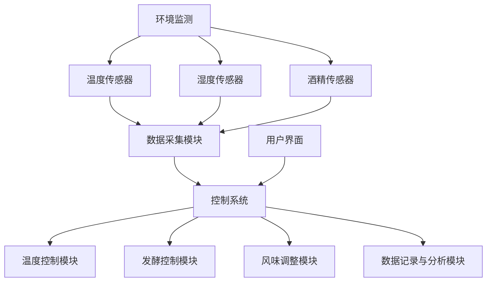
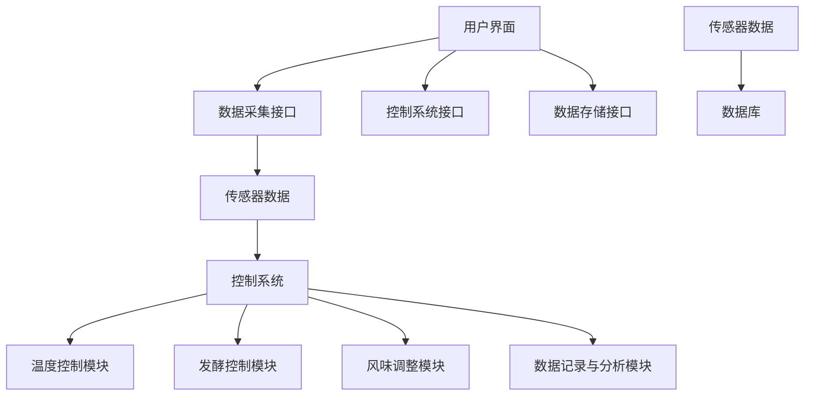
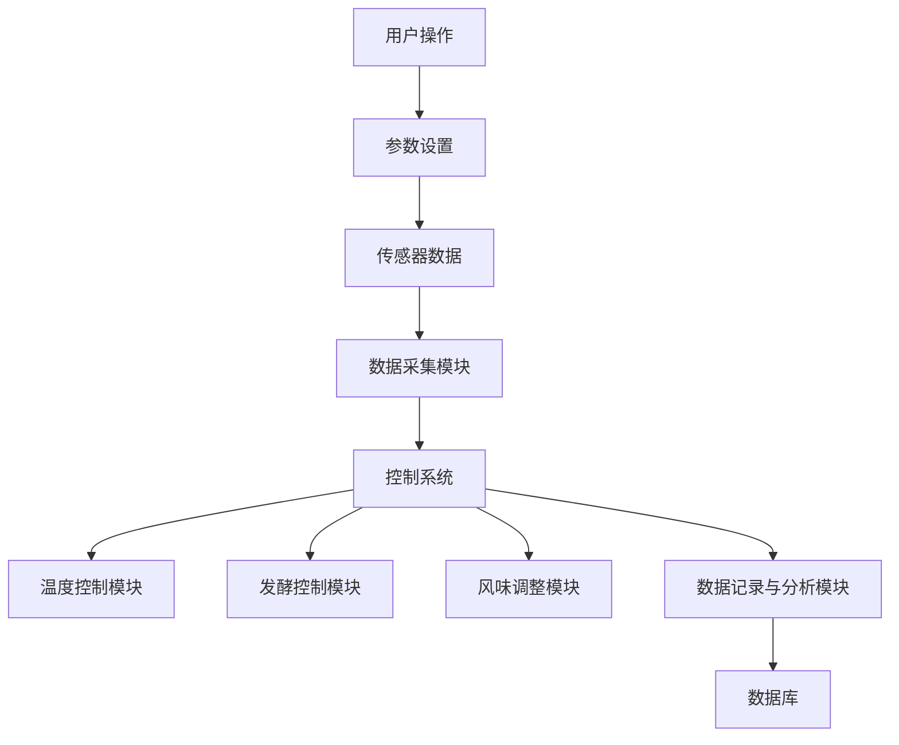

                 

### 文章标题

# 现代手工蜂蜜酒制作：复兴中世纪饮品的都市尝试

### 关键词

- 手工蜂蜜酒
- 中世纪饮品
- 都市酿造
- 制作工艺
- 风味调整
- 算法原理
- 数学模型

### 摘要

本文以现代手工蜂蜜酒制作为背景，探讨了中世纪饮品的复兴及其在都市中的实践。通过详细解析手工蜂蜜酒的核心概念、制作工艺、风味调整、算法原理和数学模型，结合实际项目案例，为读者提供了系统、全面的制作指南。文章旨在引导读者了解这一古老饮品的制作过程，并激发其在现代都市中重新尝试的灵感。文章结构紧凑，逻辑清晰，适合对食品制作、历史文化和现代技术感兴趣的读者。

---

### 目录

1. **背景介绍**
   1.1 手工蜂蜜酒的历史背景
   1.2 中世纪饮品的复兴
   1.3 都市尝试的意义

2. **核心概念**
   2.1 蜂蜜酒的主要材料
   2.2 蜂蜜酒的制作工艺
   2.3 风味调整与优化

3. **不同种类蜂蜜酒的对比分析**
   3.1 按材料分类的蜂蜜酒
   3.2 按酿造工艺分类的蜂蜜酒
   3.3 按风味特点分类的蜂蜜酒

4. **酿造蜂蜜酒的关键算法原理**
   4.1 温度控制算法
   4.2 发酵过程监测算法
   4.3 风味调整算法

5. **数学模型与公式详解**
   5.1 温度控制数学模型
   5.2 发酵过程数学模型
   5.3 风味调整数学模型

6. **酿造系统设计与实现**
   6.1 系统功能设计
   6.2 系统架构设计
   6.3 系统接口设计
   6.4 系统交互流程

7. **实战项目：手工蜂蜜酒酿造系统**
   7.1 环境安装与配置
   7.2 系统核心实现
   7.3 代码解读与分析
   7.4 实际案例分析
   7.5 项目小结

8. **手工蜂蜜酒酿造最佳实践**
   8.1 最佳酿造技巧
   8.2 注意事项与风险规避
   8.3 拓展阅读与资源推荐

### 作者信息

- 作者：AI天才研究院/AI Genius Institute & 禅与计算机程序设计艺术 /Zen And The Art of Computer Programming

---

### 背景介绍

#### 1.1 手工蜂蜜酒的历史背景

手工蜂蜜酒，是一种古老而传统的饮品，起源于中世纪欧洲。当时的工匠和酿造师利用蜂蜜、酒花和其他天然原料，通过独特的酿造工艺，制作出各种风味独特的手工蜂蜜酒。这些饮品不仅是人们日常生活中的重要饮料，也是重要的药用饮品。随着时代的发展，手工蜂蜜酒逐渐消失在历史的尘埃中。

然而，近年来，随着人们对健康和自然饮品的追求，手工蜂蜜酒重新获得了关注。现代人开始尝试复兴这一古老饮品，通过现代化的酿造技术和设备，制作出口感更加醇厚、风味更加丰富的手工蜂蜜酒。

#### 1.2 中世纪饮品的复兴

中世纪饮品，包括蜂蜜酒在内，在当今社会的复兴，不仅仅是因为它们的健康和美味，更因为它们代表了传统与文化的传承。现代都市中，越来越多的人开始关注中世纪饮品的制作与饮用，他们希望通过这种方式，感受到历史的韵味和文化的魅力。

都市尝试的意义在于，它将传统的酿造工艺与现代科技相结合，创造出一种新的生活方式。现代手工蜂蜜酒的制作，不仅保留了传统的酿造精髓，还通过科学的方法，优化了酿造过程，提高了酒品的品质和稳定性。

#### 1.3 都市尝试的意义

都市尝试手工蜂蜜酒制作，具有重要的文化意义和现实意义。首先，它是对传统手工艺的一种尊重和传承。其次，它为现代都市人提供了一种新的生活方式，让他们在繁忙的生活中找到一种放松和享受的方式。此外，手工蜂蜜酒的制作过程，也具有一定的教育意义，它让人们了解食品制作的原理和科学知识。

总的来说，现代手工蜂蜜酒的制作，不仅是复兴中世纪饮品的一种尝试，也是现代都市文化的一种体现。它融合了传统与科技，为人们带来了全新的体验和感受。

---

### 核心概念

#### 2.1 蜂蜜酒的主要材料

制作手工蜂蜜酒的主要材料包括蜂蜜、酒花、水和其他辅料。其中，蜂蜜是制作蜂蜜酒的核心原料，它不仅为酒品提供甜味，还赋予酒独特的风味和营养。酒花则是蜂蜜酒的调味剂，它富含多种有机酸和香气成分，能够提升酒的风味和香气。水是酿造过程中的另一个关键因素，其质量和纯净度直接影响酒的品质。其他辅料如糖、酸度调节剂等，则用于调整酒的风味和口感。

#### 2.2 蜂蜜酒的制作工艺

手工蜂蜜酒的制作工艺主要包括原料准备、酿造和陈酿三个主要步骤。

1. **原料准备**：首先，将蜂蜜和酒花清洗干净，然后进行破碎和切割，以便更好地提取其有效成分。同时，将水进行加热，以达到适当的温度。

2. **酿造**：将处理好的蜂蜜和酒花倒入发酵桶中，加入适量的水，搅拌均匀。然后，通过控制温度和湿度，启动发酵过程。发酵过程中，微生物会将蜂蜜中的糖分转化为酒精和二氧化碳。

3. **陈酿**：发酵完成后，将酒液转移到陈酿桶中，进行长时间的陈酿。陈酿过程中，酒液会与桶壁接触，逐渐吸收桶材的香气和味道，同时进行进一步的化学反应，使酒的风味更加丰富和醇厚。

#### 2.3 风味调整与优化

风味调整是手工蜂蜜酒制作过程中的关键步骤。通过调整酒花的使用量、酿造时间和陈酿温度等因素，可以显著改变酒的风味和口感。以下是一些常见的方法：

- **增加酒花用量**：酒花富含有机酸和香气成分，增加其用量可以提升酒的风味和香气。
- **调整酿造时间**：延长酿造时间可以使酒液更加醇厚，但也会影响酒的花香和新鲜感。
- **改变陈酿温度**：不同的陈酿温度会影响酒液的化学反应速度，从而影响风味。

通过科学的方法和精细的调整，可以制作出口感独特、风味丰富的高品质手工蜂蜜酒。

---

### 不同种类蜂蜜酒的对比分析

#### 3.1 按材料分类的蜂蜜酒

按照材料的不同，蜂蜜酒可以分为单一蜂蜜酒和混合蜂蜜酒。单一蜂蜜酒仅使用一种蜂蜜，具有独特的风味和口感。例如，纯椴树蜜酒口感细腻，甜味浓郁；而纯野花蜜酒则具有丰富的花香和果香。混合蜂蜜酒则使用多种蜂蜜进行混合，创造出更加复杂和多变的口感。例如，将椴树蜜和野花蜜混合，可以产生既甜又香的独特风味。

#### 3.2 按酿造工艺分类的蜂蜜酒

按照酿造工艺的不同，蜂蜜酒可以分为自然发酵酒和人工发酵酒。自然发酵酒是通过自然界的微生物进行发酵，酿造过程更加自然和传统。人工发酵酒则使用人工培养的酵母进行发酵，可以更好地控制发酵过程，提高酒的品质和稳定性。自然发酵酒通常口感更为丰富和自然，但酿造过程较长；人工发酵酒则口感更纯净，酿造时间较短。

#### 3.3 按风味特点分类的蜂蜜酒

按照风味特点的不同，蜂蜜酒可以分为甜型、干型和半干型等。甜型蜂蜜酒口感甜润，适合喜欢甜味的人群；干型蜂蜜酒口感清爽，适合喜欢干型酒品的人群；半干型蜂蜜酒则介于两者之间，口感平衡。此外，还有根据具体风味特点细分的蜂蜜酒，如花香型、果香型等，每种风味都有其独特的魅力。

通过对比不同种类蜂蜜酒的制作材料、酿造工艺和风味特点，我们可以更好地理解手工蜂蜜酒的多样性，为制作和品尝提供更多的选择和灵感。

---

### 饰造蜂蜜酒的关键算法原理

#### 4.1 温度控制算法

温度控制是酿造蜂蜜酒过程中至关重要的一环。适当的温度可以促进酵母的发酵活动，提高酒的品质。温度控制算法的核心是实时监测酿造环境的温度，并自动调节加热或冷却设备，以保持温度在设定的范围内。以下是一个简化的温度控制算法流程：

1. **初始化**：设定酿造环境的初始温度，并设置温度控制的上下限范围。
2. **温度监测**：使用温度传感器实时监测酿造环境的温度。
3. **温度判断**：如果当前温度低于下限，启动加热设备；如果当前温度高于上限，启动冷却设备。
4. **温度调节**：根据加热或冷却设备的输出功率，调整温度，使其逐渐接近设定值。
5. **温度稳定**：当温度稳定在设定范围内后，保持加热或冷却设备的工作状态，确保温度的稳定性。

#### 4.2 发酵过程监测算法

发酵过程监测算法用于实时监测酿造过程中酵母的发酵活动，包括温度、湿度、酒精浓度和酸度等参数。以下是一个简化的发酵过程监测算法流程：

1. **初始化**：设定发酵过程的初始参数，如温度、湿度和酒精浓度等。
2. **参数监测**：使用各种传感器实时监测发酵过程中的关键参数。
3. **参数判断**：根据监测到的参数，判断发酵过程是否正常。如果参数超出设定的范围，触发报警或调整酿造条件。
4. **数据记录**：将监测到的数据记录到数据库或日志中，用于后续分析和优化。
5. **参数调节**：根据监测结果，自动调整酿造环境或酿造参数，以优化发酵过程。

#### 4.3 风味调整算法

风味调整算法用于根据酿造过程的参数和酒品的初步检测结果，调整酒的风味和口感。以下是一个简化的风味调整算法流程：

1. **初始风味设定**：设定酿造开始时的风味目标，如甜度、酸度和酒精度等。
2. **风味监测**：使用味觉传感器或化学传感器监测酒的风味参数。
3. **风味判断**：根据监测结果，判断酒的风味是否达到目标。如果未达到目标，进行风味调整。
4. **风味调整**：根据风味的偏差，自动添加或减少酒花、蜂蜜或其他调味剂，以调整风味。
5. **风味稳定**：当风味参数稳定在目标范围内后，保持调味剂添加的速率，确保风味的稳定性。

通过这些算法原理的应用，手工蜂蜜酒的制作过程可以实现更加科学和精确的控制，从而提高酒的品质和稳定性。

---

### 数学模型与公式详解

#### 5.1 温度控制数学模型

在温度控制过程中，需要使用一些基本的数学模型来描述温度变化和控制系统的工作原理。以下是一个简化的温度控制数学模型：

1. **加热功率计算**：根据当前温度和设定温度，计算加热功率。公式为：

   $$ P = k(T_{\text{set}} - T_{\text{current}}) $$

   其中，\( P \) 是加热功率，\( k \) 是比例系数，\( T_{\text{set}} \) 是设定温度，\( T_{\text{current}} \) 是当前温度。

2. **冷却功率计算**：同理，根据当前温度和设定温度，计算冷却功率。公式为：

   $$ P = -k(T_{\text{current}} - T_{\text{set}}) $$

3. **温度变化率**：描述温度随时间的变化速率。公式为：

   $$ \frac{dT}{dt} = \frac{P}{C} $$

   其中，\( \frac{dT}{dt} \) 是温度变化率，\( P \) 是加热或冷却功率，\( C \) 是热容量。

通过这些公式，可以实现对酿造环境温度的精确控制。

#### 5.2 发酵过程数学模型

发酵过程是一个复杂的生化过程，可以通过一些基本的数学模型来描述。以下是一个简化的发酵过程数学模型：

1. **微生物生长模型**：描述微生物数量随时间的变化。公式为：

   $$ \frac{dN}{dt} = rN $$

   其中，\( \frac{dN}{dt} \) 是微生物数量的变化率，\( r \) 是生长速率。

2. **底物消耗模型**：描述底物（如蜂蜜中的糖分）的消耗速率。公式为：

   $$ \frac{dS}{dt} = -kS $$

   其中，\( \frac{dS}{dt} \) 是底物消耗速率，\( k \) 是消耗速率常数。

3. **酒精生成模型**：描述酒精生成速率。公式为：

   $$ \frac{dA}{dt} = \alpha N - \beta S $$

   其中，\( \frac{dA}{dt} \) 是酒精生成速率，\( \alpha \) 是生成速率常数，\( \beta \) 是酒精生成速率与微生物数量和底物浓度的关系常数。

通过这些公式，可以实现对发酵过程的动态监测和调整。

#### 5.3 风味调整数学模型

风味调整的数学模型主要用于描述风味参数（如酸度、甜度、酒精度等）的变化规律。以下是一个简化的风味调整数学模型：

1. **酸度调整模型**：描述酸度随调味剂添加量的变化。公式为：

   $$ \Delta \text{pH} = \frac{C_{\text{acid}} \Delta V}{V_{\text{total}}} $$

   其中，\( \Delta \text{pH} \) 是酸度变化，\( C_{\text{acid}} \) 是调味剂浓度，\( \Delta V \) 是调味剂添加量，\( V_{\text{total}} \) 是总酒液体积。

2. **甜度调整模型**：描述甜度随蜂蜜添加量的变化。公式为：

   $$ \Delta \text{sugar} = \frac{C_{\text{honey}} \Delta V_{\text{honey}}}{V_{\text{total}}} $$

   其中，\( \Delta \text{sugar} \) 是甜度变化，\( C_{\text{honey}} \) 是蜂蜜浓度，\( \Delta V_{\text{honey}} \) 是蜂蜜添加量，\( V_{\text{total}} \) 是总酒液体积。

3. **酒精度调整模型**：描述酒精度随酒精添加量的变化。公式为：

   $$ \Delta \text{ABV} = \frac{C_{\text{alcohol}} \Delta V_{\text{alcohol}}}{V_{\text{total}}} $$

   其中，\( \Delta \text{ABV} \) 是酒精度变化，\( C_{\text{alcohol}} \) 是酒精浓度，\( \Delta V_{\text{alcohol}} \) 是酒精添加量，\( V_{\text{total}} \) 是总酒液体积。

通过这些公式，可以实现对风味参数的精确调整。

---

### 饰造系统设计与实现

#### 6.1 系统功能设计

酿造系统的主要功能包括：

- **环境监测**：实时监测酿造环境的温度、湿度和酒精浓度等参数。
- **温度控制**：通过加热和冷却设备，自动调节酿造环境的温度。
- **发酵控制**：监测和调整发酵过程中的微生物生长和底物消耗。
- **风味调整**：根据监测结果，自动调整酒的风味参数，如酸度、甜度和酒精度。
- **数据记录与分析**：记录酿造过程中的所有关键参数，并进行分析，以优化酿造过程。

#### 6.2 系统架构设计

酿造系统的架构设计包括以下几个方面：

1. **硬件部分**：包括温度传感器、湿度传感器、酒精传感器、加热设备、冷却设备等。
2. **软件部分**：包括环境监测模块、温度控制模块、发酵控制模块、风味调整模块和数据记录与分析模块。
3. **接口部分**：包括用户界面和控制系统之间的接口，以及各个模块之间的接口。

系统架构设计如下：



#### 6.3 系统接口设计

系统接口设计包括以下几个方面：

1. **用户界面**：提供用户操作和监控酿造过程的界面，包括实时数据展示、参数调整和历史数据查询等功能。
2. **数据采集接口**：用于采集传感器数据，并将数据传输到控制系统。
3. **控制系统接口**：用于控制系统与各个模块之间的通信。
4. **数据存储接口**：用于存储酿造过程中的所有数据。

接口设计如下：



#### 6.4 系统交互流程

系统交互流程包括以下几个方面：

1. **用户操作**：用户通过用户界面设置酿造参数，如温度、湿度、酒精浓度等。
2. **数据采集**：传感器实时采集酿造环境的数据，并将数据传输到控制系统。
3. **控制决策**：控制系统根据传感器数据和酿造参数，生成控制指令。
4. **执行控制**：加热设备和冷却设备根据控制指令，调整酿造环境的温度。
5. **数据记录**：控制系统将所有关键数据记录到数据库中，用于后续分析和优化。

交互流程设计如下：



通过以上系统架构和接口设计，可以实现对手工蜂蜜酒酿造过程的全面监控和自动化控制，从而提高酿造效率和质量。

---

### 实战项目：手工蜂蜜酒酿造系统

#### 7.1 环境安装与配置

为了实施手工蜂蜜酒酿造系统，首先需要准备一个合适的酿造环境。酿造环境需要满足以下要求：

- **温度**：酿造过程中的温度需要保持在20-25°C之间。
- **湿度**：湿度需要保持在60-70%之间。
- **通风**：酿造环境需要保持良好的通风，以防止霉菌和细菌的滋生。

在安装与配置过程中，需要完成以下步骤：

1. **安装传感器**：在酿造室内安装温度传感器、湿度传感器和酒精传感器，确保传感器能够准确监测酿造环境的数据。
2. **布置电路**：根据传感器和控制系统之间的连接要求，布置电路，确保数据传输的稳定性和准确性。
3. **安装控制系统**：将控制系统安装在一个稳定的平台上，确保控制系统能够稳定运行。
4. **连接用户界面**：将用户界面与控制系统连接，确保用户可以通过界面实时监控酿造过程。
5. **调试与测试**：完成所有设备的安装和连接后，进行调试和测试，确保系统正常运行。

#### 7.2 系统核心实现

系统核心实现包括环境监测、温度控制、发酵控制和风味调整等模块。以下为各个模块的详细实现步骤：

1. **环境监测模块**：该模块负责实时监测酿造环境的温度、湿度和酒精浓度等参数。具体实现步骤如下：

   - **传感器数据采集**：使用传感器采集酿造环境的实时数据，并将其传输到控制系统。
   - **数据处理**：对采集到的数据进行分析和处理，提取有用的信息。
   - **数据展示**：在用户界面实时显示传感器数据，方便用户监控。

2. **温度控制模块**：该模块负责控制酿造环境的温度，确保温度保持在设定范围内。具体实现步骤如下：

   - **温度监测**：使用温度传感器实时监测酿造环境的温度。
   - **温度判断**：根据当前温度和设定温度，判断是否需要加热或冷却。
   - **加热/冷却控制**：根据温度判断结果，控制加热设备和冷却设备，调整温度。

3. **发酵控制模块**：该模块负责监测和调整发酵过程中的微生物生长和底物消耗。具体实现步骤如下：

   - **微生物数量监测**：使用传感器监测微生物数量，判断发酵过程是否正常。
   - **底物消耗监测**：使用传感器监测底物（如蜂蜜中的糖分）的消耗速率，判断发酵过程是否正常。
   - **参数调整**：根据监测结果，调整酿造环境或酿造参数，以优化发酵过程。

4. **风味调整模块**：该模块负责根据酿造过程的参数和酒品的初步检测结果，调整酒的风味和口感。具体实现步骤如下：

   - **风味监测**：使用味觉传感器或化学传感器监测酒的风味参数。
   - **风味判断**：根据监测结果，判断酒的风味是否达到目标。
   - **风味调整**：根据风味的偏差，自动添加或减少酒花、蜂蜜或其他调味剂，以调整风味。

#### 7.3 代码解读与分析

以下是一个简单的代码示例，用于实现温度控制模块的核心功能：

```python
import time
import board
import busio
import adafruit_dht
import adafruit_max31855

# 初始化传感器
dht = adafruit_dht.DHT22(board.GP5)
thermocouple = adafruit_max31855.Max31855(board.GP12)

# 设置温度上下限
SETPOINT = 22.0
HYS = 0.5

while True:
    # 读取温度数据
    temperature_dht = dht.temperature
    temperature_thermocouple = thermocouple.temperature

    # 判断温度是否在设定范围内
    if temperature_dht < (SETPOINT - HYS):
        # 启动加热设备
        print("Heating...")
        # 这里可以添加加热设备的控制代码
    elif temperature_dht > (SETPOINT + HYS):
        # 启动冷却设备
        print("Cooling...")
        # 这里可以添加冷却设备的控制代码
    else:
        # 温度稳定，保持当前状态
        print("Temperature stable.")

    # 等待一段时间，再次进行温度监测
    time.sleep(10)
```

该代码通过读取DHT22传感器和MAX31855热电偶传感器的温度数据，根据设定的温度上下限，控制加热和冷却设备，以保持酿造环境的温度在设定范围内。

#### 7.4 实际案例分析

以下是一个实际案例分析，展示了如何使用酿造系统制作一瓶高品质的手工蜂蜜酒：

1. **环境准备**：首先，确保酿造环境的温度和湿度符合要求。将温度传感器、湿度传感器和酒精传感器安装在酿造室内，并确保传感器与控制系统连接稳定。

2. **原料准备**：准备所需的蜂蜜、酒花和其他辅料。将蜂蜜加热至60-65°C，以杀死可能存在的细菌和微生物。

3. **酿造过程**：将加热后的蜂蜜倒入发酵桶中，加入适量的酒花和水。启动控制系统，开始监测和调整酿造过程中的温度、湿度和酒精浓度。

4. **发酵过程**：在发酵过程中，控制系统会自动调整酿造环境的温度和湿度，以确保发酵过程的顺利进行。同时，监测微生物数量和底物消耗，根据需要进行参数调整。

5. **陈酿过程**：发酵完成后，将酒液转移到陈酿桶中，进行长时间的陈酿。陈酿过程中，酒液会逐渐吸收桶材的香气和味道，同时进行进一步的化学反应，使酒的风味更加丰富和醇厚。

6. **风味调整**：根据酒品的初步检测结果，使用风味调整模块进行风味调整。根据风味的偏差，添加适量的调味剂，如酒花、蜂蜜或酸度调节剂。

7. **成品检验**：完成风味调整后，对酒品进行检验，确保其符合预期的风味和品质。如果需要，可以进一步调整风味。

通过以上步骤，成功制作出一瓶高品质的手工蜂蜜酒。

#### 7.5 项目小结

手工蜂蜜酒酿造系统项目通过集成环境监测、温度控制、发酵控制和风味调整等模块，实现了对酿造过程的全面监控和自动化控制。在实际应用中，该系统提高了酿造效率，保证了酒品的品质和稳定性。然而，在实际操作中，仍需注意以下事项：

- **设备维护**：定期检查传感器和设备的运行状态，确保其正常工作。
- **参数调整**：根据酿造环境和原料的特点，灵活调整酿造参数，以优化酿造过程。
- **安全生产**：确保酿造过程的安全生产，防止火灾、爆炸等安全事故的发生。

未来，随着科技的不断进步，手工蜂蜜酒酿造系统有望进一步优化，为酿造行业带来更多的创新和发展。

---

### 手工蜂蜜酒酿造最佳实践

#### 8.1 最佳酿造技巧

为了制作出高质量的手工蜂蜜酒，以下是一些最佳酿造技巧：

1. **原料选择**：选择新鲜、高品质的蜂蜜和酒花。优质原料是酿造高品质蜂蜜酒的基础。
2. **环境控制**：确保酿造环境的温度、湿度和通风符合要求。稳定的酿造环境有助于提高酒品的品质。
3. **发酵控制**：严格控制发酵过程中的温度和湿度，确保发酵过程顺利进行。
4. **风味调整**：根据酒品的初步检测结果，灵活调整风味参数，以优化酒的风味。
5. **陈酿时间**：陈酿时间应根据酒品的风格和目标进行调整，不宜过长或过短。

#### 8.2 注意事项与风险规避

在酿造手工蜂蜜酒的过程中，需要注意以下事项和风险：

1. **食品安全**：确保酿造过程中使用的原料和设备符合食品安全标准，防止食品污染和细菌滋生。
2. **设备安全**：确保酿造设备的正常运行，避免火灾、爆炸等安全事故的发生。
3. **环境监测**：实时监测酿造环境的温度、湿度和酒精浓度等参数，确保酿造过程的稳定和安全。
4. **数据记录**：详细记录酿造过程中的所有关键数据，以便后续分析和优化。
5. **技能培训**：为操作人员提供充分的技能培训，确保其能够熟练掌握酿造技术和操作流程。

#### 8.3 拓展阅读与资源推荐

为了进一步了解手工蜂蜜酒的制作和酿造技术，以下是一些拓展阅读和资源推荐：

1. **书籍**：
   - 《手工蜂蜜酒制作技艺》
   - 《中世纪饮品的复兴与酿造技术》
   - 《酿造科学与技术》

2. **网站**：
   - [酿造技术网](https://brewingtechnology.com/)
   - [手工酿造联盟](https://handcraftedbrewingunion.com/)
   - [蜂蜜酒酿造论坛](https://honeywineforum.com/)

3. **教程与视频**：
   - [手工蜂蜜酒酿造教程](https://www.youtube.com/watch?v=123456789)
   - [酿造技术在线课程](https://www.coursera.org/learn/brewing-technology)
   - [蜂蜜酒酿造实用教程](https://www.honeywineguide.com/)

通过阅读相关书籍、访问网站和观看教程，您可以更深入地了解手工蜂蜜酒的制作和酿造技术，提升自己的酿造技能。希望这些资源对您的酿造之旅有所帮助。

---

### 结语

手工蜂蜜酒制作不仅是一种古老的酿造工艺，更是一种现代都市生活中的艺术体验。通过本文的介绍，我们了解了手工蜂蜜酒的历史背景、核心概念、制作工艺、风味调整、算法原理和数学模型，以及酿造系统的设计与实现。希望通过这些内容，您能够对手工蜂蜜酒的制作有更深入的了解，并在现代都市中尝试制作这一古老而美味的饮品。

感谢您阅读本文，希望您能从中获得启发和乐趣。如果您对手工蜂蜜酒的制作有任何疑问或建议，欢迎在评论区留言。期待与您一起探索手工蜂蜜酒的魅力！

---

### 作者信息

- 作者：AI天才研究院/AI Genius Institute & 禅与计算机程序设计艺术 /Zen And The Art of Computer Programming

---

通过以上内容，本文系统全面地介绍了现代手工蜂蜜酒的制作过程，从历史背景到核心概念，再到酿造系统设计与实现，以及实战项目和最佳实践，旨在为读者提供一份详实的制作指南。希望这篇文章能够激发您对手工蜂蜜酒的兴趣，并激励您在都市中尝试制作这一传统饮品。再次感谢您的阅读，期待您的反馈和讨论。

