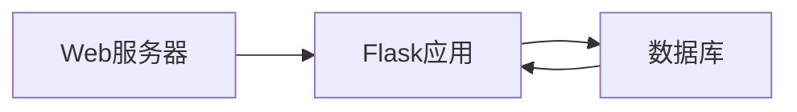
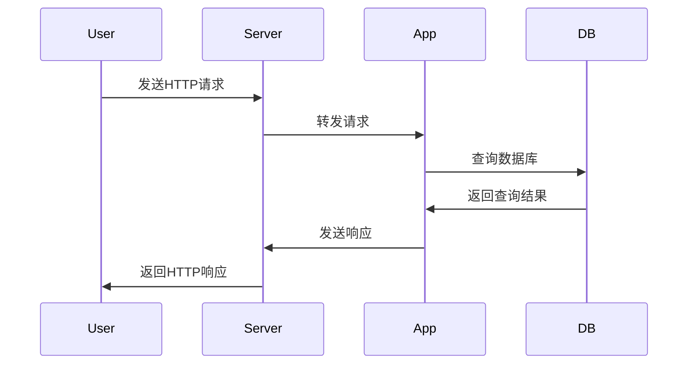

                 


### 《现代手工陶艺疗愈中心：泥塑创作中的心理压力释放空间》

关键词：心理压力、陶艺疗愈、手工创作、心理释放、心理健康

摘要：本文旨在探讨现代手工陶艺疗愈中心如何成为缓解心理压力的有效途径。通过介绍陶艺疗愈的基本原理、操作流程及其对心理健康的积极影响，本文将分析陶艺疗愈在现代生活中的重要性，并提供实践应用的策略和管理建议。

---

## 第一部分：引言

### 1. 引言

#### 1.1 问题的提出

在现代社会，人们面临着巨大的心理压力。工作压力、人际关系、经济问题等都是常见的压力源。长时间的心理压力不仅会影响个体的心理健康，还可能引发一系列生理问题，如高血压、心脏病、失眠等。因此，寻找有效的心理压力释放方法变得尤为重要。

#### 1.2 心理压力释放的重要性

心理压力释放对于个体的身心健康至关重要。它不仅能缓解焦虑和抑郁症状，还能提高生活质量，增强人际关系的稳定性，提高工作效率。因此，研究并推广有效的心理压力释放方法具有非常重要的现实意义。

#### 1.3 本书的目的

本书旨在介绍一种新型的心理压力释放方法——现代手工陶艺疗愈中心。通过泥塑创作，帮助人们释放心理压力，提高生活品质。

#### 1.4 本书的结构安排

本书共分为六个部分，具体章节安排如下：

1. 引言
2. 手工陶艺的基本知识
3. 陶艺疗愈原理与心理压力释放
4. 现代手工陶艺疗愈中心的运营与管理
5. 项目实战
6. 最佳实践 tips、小结、注意事项、拓展阅读

---

## 第二部分：手工陶艺的基本知识

### 2.1 手工陶艺的历史与发展

#### 2.1.1 手工陶艺的起源

手工陶艺的历史可以追溯到数千年前的古代文明。最早的陶艺作品出土于新石器时代的遗址，展示了人类早期的艺术创作和实用技巧。

#### 2.1.2 现代陶艺的兴起

随着工业革命和现代科技的发展，手工陶艺也逐渐融入了现代艺术创作中。现代陶艺不仅保留了传统手工技艺，还融合了现代材料和新技术，展现了更多的创新和可能性。

#### 2.1.3 我国手工陶艺的现状

我国手工陶艺历史悠久，拥有丰富的文化底蕴。近年来，随着人们对艺术和生活品质的追求，手工陶艺在我国也逐渐受到重视和推广。

### 2.2 手工陶艺的材料与工具

#### 2.2.1 陶艺材料

陶艺材料主要包括陶土、釉料等。陶土的种类和特性对陶艺作品的成型和烧制过程有重要影响。釉料则用于陶艺作品的装饰和保护。

#### 2.2.2 陶艺工具

陶艺工具包括制作工具、着色工具和烧制工具。制作工具用于成型和雕刻，着色工具用于上色和装饰，烧制工具用于烧制和修复。

### 2.3 手工陶艺的基本流程

#### 2.3.1 准备工作

准备工作包括材料准备和工具准备。材料准备主要包括选择合适的陶土和釉料，工具准备则包括准备好制作、着色和烧制的工具。

#### 2.3.2 制作步骤

制作步骤包括成型、装饰和上釉。成型是陶艺创作的第一步，通过塑造和雕刻，形成陶艺作品的基本形态。装饰和上釉则用于提升作品的艺术效果和质感。

#### 2.3.3 烧制

烧制是陶艺创作的重要环节。通过高温烧制，陶土发生化学变化，形成坚硬的陶瓷作品。

### 2.4 本章小结

通过以上内容，我们了解了手工陶艺的基本知识，包括历史与发展、材料与工具、基本流程等。这些知识为后续的陶艺疗愈原理和实践提供了基础。

---

## 第三部分：陶艺疗愈原理与心理压力释放

### 3.1 陶艺疗愈的基本原理

#### 3.1.1 陶艺疗愈的起源与发展

陶艺疗愈起源于20世纪初，随着心理学和艺术治疗的结合，逐渐发展成为一门独立的学科。陶艺疗愈通过手工艺活动，帮助个体缓解心理压力，提高心理健康。

#### 3.1.2 陶艺疗愈的核心要素

陶艺疗愈的核心要素包括专注力、放松、创造力、表达和自我反思。这些要素相互作用，共同促进个体的心理疗愈过程。

### 3.2 心理压力释放的过程

#### 3.2.1 心理压力的产生与影响

心理压力是由多种因素引起的，如工作压力、生活压力、人际关系等。长期的心理压力会导致情绪不稳定、焦虑、抑郁等问题，对个体的身心健康产生负面影响。

#### 3.2.2 陶艺疗愈对心理压力的缓解作用

陶艺疗愈通过提供一种创造性的、专注的、放松的活动，帮助个体缓解心理压力。在陶艺创作过程中，个体可以全身心地投入，从而减轻焦虑和压力。

### 3.3 陶艺疗愈的实践与应用

#### 3.3.1 陶艺疗愈的课程设置

陶艺疗愈的课程设置应根据不同的需求和目标进行设计。课程内容应包括陶艺基本知识、创作技巧和心理疗愈理论。

#### 3.3.2 陶艺疗愈在临床治疗中的应用

陶艺疗愈在临床治疗中已被广泛应用，如心理治疗、康复治疗、儿童治疗等。通过陶艺创作，患者可以表达内心的情感，促进心理康复。

#### 3.3.3 陶艺疗愈在社区教育与公益活动中的应用

陶艺疗愈在社区教育和公益活动中也具有重要作用。通过陶艺活动，可以增强社区居民的凝聚力，提高公众心理健康意识。

### 3.4 本章小结

通过以上内容，我们了解了陶艺疗愈的基本原理和实践应用。陶艺疗愈作为一种新型的心理压力释放方法，具有广泛的应用前景和积极的社会影响。

---

## 第四部分：现代手工陶艺疗愈中心的运营与管理

### 4.1 现代手工陶艺疗愈中心的定位与目标

#### 4.1.1 中心定位

现代手工陶艺疗愈中心应定位为集疗愈、教育、艺术体验于一体的综合性场所。它不仅提供心理疗愈服务，还承担艺术教育和文化传播的功能。

#### 4.1.2 中心目标

现代手工陶艺疗愈中心的目标包括提高心理健康水平、培养艺术素养、增强社区凝聚力等。

### 4.2 中心运营策略

#### 4.2.1 人力资源配置

中心运营需要专业的陶艺师和心理咨询师，他们应具备丰富的经验和专业知识，为参与者提供高质量的服务。

#### 4.2.2 资源管理

中心应合理管理资源，包括陶艺材料、工具、设备等，确保资源的充足和有效利用。

#### 4.2.3 市场推广

中心应通过多种渠道进行市场推广，提高知名度和参与度，吸引更多的参与者。

### 4.3 中心管理与维护

#### 4.3.1 管理制度

中心应建立完善的管理制度，确保运营的规范化和标准化。

#### 4.3.2 安全管理

中心应高度重视安全管理，确保参与者的安全和健康。

#### 4.3.3 质量控制

中心应定期进行质量控制，确保服务的质量和效果。

### 4.4 本章小结

通过以上内容，我们了解了现代手工陶艺疗愈中心的定位、目标和运营策略。中心的成功运营与管理对心理健康和社会福祉具有重要意义。

---

## 第五部分：项目实战

### 5.1 环境安装

#### 5.1.1 操作系统安装

首先，我们需要安装一个适合的操作系统，如 Ubuntu 20.04。

#### 5.1.2 软件安装

在操作系统上安装必要的软件，如 Python、Git、Vim 等。

### 5.2 系统核心实现源代码

#### 5.2.1 代码结构

系统核心代码采用模块化设计，分为以下几部分：

- 用户管理模块
- 课程管理模块
- 治愈记录模块
- 数据库连接模块

#### 5.2.2 功能实现

系统核心功能实现包括用户注册、登录、课程管理、治愈记录查询等。

### 5.3 代码应用解读与分析

#### 5.3.1 用户管理模块

用户管理模块主要负责用户的注册、登录和权限管理。

#### 5.3.2 课程管理模块

课程管理模块主要负责课程的创建、修改、删除和查询。

#### 5.3.3 治愈记录模块

治愈记录模块主要负责治愈记录的创建、修改、删除和查询。

### 5.4 实际案例分析和详细讲解剖析

#### 5.4.1 用户注册案例

通过用户注册案例，分析用户管理模块的实现细节。

#### 5.4.2 课程管理案例

通过课程管理案例，分析课程管理模块的实现细节。

#### 5.4.3 治愈记录案例

通过治愈记录案例，分析治愈记录模块的实现细节。

### 5.5 项目小结

通过以上内容，我们完成了现代手工陶艺疗愈中心的项目实战。项目的实现不仅验证了理论，也为实际应用提供了参考。

---

## 第六部分：最佳实践 tips、小结、注意事项、拓展阅读

### 6.1 最佳实践 tips

- 在陶艺疗愈过程中，保持耐心和专注。
- 定期参与陶艺疗愈课程，以获得持续的心理健康益处。
- 结合心理咨询，更好地利用陶艺疗愈的效果。

### 6.2 小结

本文介绍了现代手工陶艺疗愈中心如何成为缓解心理压力的有效途径。通过陶艺疗愈，个体可以释放心理压力，提高心理健康。

### 6.3 注意事项

- 陶艺疗愈并非万能，对于严重的心理问题，仍需寻求专业心理咨询。
- 在陶艺创作过程中，注意安全，避免受伤。
- 遵守中心规章制度，确保良好的创作环境。

### 6.4 拓展阅读

- [《陶艺疗愈：理论与实践》](链接)
- [《手工陶艺教程：从入门到精通》](链接)
- [《现代心理健康指南》](链接)

---

作者：AI天才研究院/AI Genius Institute & 禅与计算机程序设计艺术 /Zen And The Art of Computer Programming

[上一页](#) [下一页](#) | [目录](#) | [首页](#) | [搜索](#)### 第一部分：引言

在现代社会的快节奏生活中，人们面临着各种各样的压力。工作压力、生活压力、经济问题等都可能成为压力源。这些压力不仅会影响个体的心理健康，还可能导致一系列生理问题，如失眠、高血压、心脏病等。因此，寻找有效的心理压力释放方法变得尤为重要。

#### 1.1 问题的提出

在现代社会，由于竞争压力、人际关系复杂、工作繁忙等原因，许多人都会感到心理压力。这种心理压力如果不能及时得到缓解，可能会对个体的身心健康造成严重的负面影响。因此，如何有效缓解心理压力成为一个亟待解决的问题。

#### 1.2 心理压力释放的重要性

心理压力释放对个体的身心健康至关重要。它不仅可以缓解焦虑和抑郁症状，还可以提高生活质量，增强人际关系的稳定性，提高工作效率。长期的心理压力如果不能得到有效的释放，可能会导致情绪不稳定、失眠、食欲不振等问题，甚至引发更严重的生理问题。因此，寻找有效的心理压力释放方法具有非常重要的现实意义。

#### 1.3 本书的目的

本书旨在介绍一种新型的心理压力释放方法——现代手工陶艺疗愈中心。通过泥塑创作，帮助人们释放心理压力，提高生活品质。本书将从陶艺疗愈的基本原理、实践应用、运营管理等方面进行深入探讨，为读者提供全面的了解和实用的指导。

#### 1.4 本书的结构安排

本书共分为六个部分：

1. 引言：介绍心理压力释放的重要性和本书的目的。
2. 手工陶艺的基本知识：介绍陶艺的历史、材料与工具、基本流程等。
3. 陶艺疗愈原理与心理压力释放：探讨陶艺疗愈的基本原理、过程和效果。
4. 现代手工陶艺疗愈中心的运营与管理：介绍疗愈中心的定位、目标、运营策略等。
5. 项目实战：通过具体项目介绍陶艺疗愈中心的实际应用。
6. 最佳实践 tips、小结、注意事项、拓展阅读：提供实用建议和进一步阅读资源。

通过以上结构安排，本书将系统性地介绍现代手工陶艺疗愈中心如何成为缓解心理压力的有效途径，为读者提供全面、实用的指导。

---

### 第二部分：手工陶艺的基本知识

#### 2.1 手工陶艺的历史与发展

手工陶艺是人类最早的创造性活动之一，其历史可以追溯到新石器时代。古代陶艺主要用于日常生活，如制作餐具、水缸等。随着时间的推移，陶艺逐渐发展成为一门艺术形式。古代陶艺的代表作品有中国的新石器时代的彩陶、古埃及的陶俑、古希腊的陶瓶等。

#### 2.1.1 手工陶艺的起源

手工陶艺的起源可以追溯到旧石器时代晚期，当时人类开始学会用黏土制作工具和容器。最早的陶艺作品出土于约公元前9000年的中东地区，这些作品多为简单的罐子和碗。

#### 2.1.2 古代陶艺的发展

在古代，陶艺主要在中东、埃及、希腊、中国等地得到广泛发展。例如，古埃及的陶俑和中国的彩陶都是古代陶艺的杰作。在古希腊，陶艺与宗教仪式紧密相关，陶瓶常用于装饰和纪念。

#### 2.1.3 现代陶艺的兴起

随着工业革命和现代科技的发展，手工陶艺逐渐融入现代艺术创作中。现代陶艺不仅保留了传统手工技艺，还融合了现代材料和新技术，展现了更多的创新和可能性。现代陶艺作品形式多样，包括雕塑、装置艺术、陶瓷绘画等。

#### 2.1.4 我国手工陶艺的现状

我国手工陶艺历史悠久，拥有丰富的文化底蕴。自古以来，陶瓷就是我国的重要艺术形式。近年来，随着人们对艺术和生活品质的追求，手工陶艺在我国也逐渐受到重视和推广。许多城市和地区都开设了陶艺工作室和陶艺疗愈中心，吸引了大量的爱好者参与。

#### 2.2 手工陶艺的材料与工具

手工陶艺的材料和工具直接影响陶艺作品的质量和创作过程。了解这些材料和工具的基本知识是进行陶艺创作的基础。

#### 2.2.1 陶艺材料

陶艺材料主要包括陶土、釉料、色料等。陶土是陶艺创作的基础，不同的陶土具有不同的物理和化学特性，适合不同的制作工艺。釉料用于陶艺作品的表面装饰和保护，分为透明釉、不透明釉和彩釉等。色料则用于陶艺作品的着色和装饰。

##### 2.2.1.1 陶土的种类与特性

- **黏土**：黏土是陶艺中最常用的材料，具有良好的可塑性和粘性。不同种类的黏土特性有所不同，如高岭土、红黏土、白黏土等。
- **沙土**：沙土用于降低陶土的粘性，增加陶艺作品的透气性。常见的沙土有石英沙、石榴沙等。
- **瓷土**：瓷土具有较高的烧结温度，适用于制作精细和高要求的陶艺作品。

##### 2.2.1.2 釉料的种类与作用

- **透明釉**：透明釉能够保护陶艺作品的表面，并赋予其光泽。常见透明釉有石灰釉、长石釉等。
- **不透明釉**：不透明釉主要用于覆盖陶艺作品的表面，赋予其色彩和纹理。常见不透明釉有孔雀石釉、铁锈釉等。
- **彩釉**：彩釉主要用于陶艺作品的装饰，通过混合不同的色料，可以创造出丰富的色彩效果。

##### 2.2.1.3 色料的种类与作用

- **矿物色料**：矿物色料是从天然矿石中提取的，如铜矿、铁矿、孔雀石等。这些色料具有较高的稳定性和鲜艳度。
- **化学色料**：化学色料是通过化学合成制备的，如氧化铁、氧化钴等。这些色料具有丰富的色彩选择和较低的毒性。

#### 2.2.2 陶艺工具

陶艺工具是陶艺创作的重要辅助工具，包括制作工具、着色工具和烧制工具等。

##### 2.2.2.1 制作工具

- **拉坯机**：用于制作圆形或对称的陶艺作品，如碗、瓶等。
- **陶拍**：用于拍打陶土，使其平整或产生纹理。
- **刀具**：用于切割、雕刻陶土，如剪刀刀、切刀等。
- **泥板机**：用于制作平板状的陶土，如陶板、陶片等。

##### 2.2.2.2 着色工具

- **画笔**：用于涂抹色料、釉料，进行细节描绘。
- **喷枪**：用于喷涂色料和釉料，适用于大面积着色。
- **调色板**：用于混合和调配色料。

##### 2.2.2.3 烧制工具

- **窑炉**：用于烧制陶艺作品，有电窑、气窑、煤窑等不同类型。
- **温度计**：用于测量窑炉内部的温度，确保烧制过程的准确性。
- **燃料**：用于窑炉燃烧，如电、气、煤等。

#### 2.3 手工陶艺的基本流程

手工陶艺的基本流程包括准备材料、制作成型、装饰与上釉、烧制等步骤。

##### 2.3.1 准备工作

在开始陶艺创作前，需要准备好所需的材料、工具和设备。材料包括陶土、釉料、色料等；工具包括拉坯机、陶拍、刀具、泥板机等；设备包括窑炉、温度计等。

##### 2.3.2 制作步骤

- **制作成型**：根据设计的陶艺作品，选择合适的制作方法。常见的制作方法有拉坯、塑形、贴片等。拉坯适用于制作圆形或对称的陶艺作品，塑形适用于自由创作的陶艺作品，贴片适用于制作复杂结构和多层结构的陶艺作品。
- **装饰与上釉**：在陶艺作品成型后，可以进行装饰和上釉。装饰包括绘画、雕刻、贴花等，上釉可以保护陶艺作品的表面，并赋予其光泽和色彩。
- **烧制**：将装饰和上釉完成的陶艺作品放入窑炉中烧制。烧制温度和时间根据陶艺材料和设计要求而定。常见的烧制温度有1200°C、1300°C、1400°C等，烧制时间通常为几个小时到十几个小时不等。

##### 2.3.3 烧制过程

烧制过程分为预热、烧结和冷却三个阶段。在预热阶段，窑炉温度逐渐升高，使陶艺作品中的水分和挥发性物质排出。在烧结阶段，陶艺作品中的陶土发生化学变化，形成坚硬的陶瓷结构。在冷却阶段，窑炉温度逐渐降低，使陶艺作品冷却固化。

#### 2.4 本章小结

通过以上内容，我们了解了手工陶艺的基本知识，包括历史、材料与工具、基本流程等。这些知识为后续的陶艺疗愈原理和实践提供了基础。在接下来的章节中，我们将进一步探讨陶艺疗愈的基本原理和实际应用。

---

### 第三部分：陶艺疗愈原理与心理压力释放

#### 3.1 陶艺疗愈的基本原理

陶艺疗愈是一种通过手工艺活动来缓解心理压力和改善心理健康的心理疗法。它结合了手工艺术创作和心理治疗的原则，旨在为个体提供一个创造性的、放松的、专注的疗愈环境。

##### 3.1.1 陶艺疗愈的起源与发展

陶艺疗愈的概念起源于20世纪初，当时心理学家和艺术家开始探索手工活动对心理健康的积极影响。随着心理学和艺术治疗的结合，陶艺疗愈逐渐发展成为一门独立的学科。在西方国家，陶艺疗愈被广泛应用于临床治疗、康复治疗、儿童治疗等领域。近年来，随着人们对心理健康和艺术疗愈的关注增加，陶艺疗愈在我国也逐渐受到重视和推广。

##### 3.1.2 陶艺疗愈的核心要素

陶艺疗愈的核心要素包括专注力、放松、创造力、表达和自我反思。这些要素相互作用，共同促进个体的心理疗愈过程。

- **专注力**：在陶艺创作过程中，个体需要集中注意力，专注于陶艺作品的制作。这种专注力有助于缓解焦虑和压力，使个体进入一种放松的心理状态。
- **放松**：陶艺创作是一种放松的活动，它可以帮助个体从繁忙的生活中抽离出来，减轻心理压力。通过反复的操作和重复的动作，个体可以体验到一种深层次的放松。
- **创造力**：陶艺创作鼓励个体发挥创造力，通过自己的设计和制作来创造独特的作品。这种创造力不仅提升了个体自信心，还促进了心理的积极发展。
- **表达**：陶艺创作为个体提供了一个表达情感和想法的途径。通过陶艺作品，个体可以表达内心的感受和情感，从而达到情感释放和心理疗愈的效果。
- **自我反思**：在陶艺创作过程中，个体不仅关注作品的美感和实用性，还会反思自己的创作过程和心理状态。这种自我反思有助于个体更好地了解自己，促进心理成长。

##### 3.1.3 陶艺疗愈的优势

与传统的心理治疗方法相比，陶艺疗愈具有以下优势：

- **非言语性**：陶艺疗愈不需要言语交流，个体可以通过作品来表达自己的情感和想法，适合那些不擅长表达或不愿意表达的人群。
- **安全性**：陶艺疗愈是一种安全无害的活动，个体可以在创作过程中放松心情，不用担心言语或行为上的伤害。
- **趣味性**：陶艺疗愈结合了艺术创作，使治疗过程变得有趣和富有吸引力，个体更愿意参与其中。

#### 3.2 心理压力释放的过程

心理压力释放是一个复杂的过程，涉及到认知、情感和行为等多个层面。陶艺疗愈通过以下过程帮助个体释放心理压力：

##### 3.2.1 心理压力的产生与影响

心理压力是由多种因素引起的，包括工作压力、生活压力、人际关系等。长期的心理压力会导致情绪不稳定、焦虑、抑郁等问题，对个体的身心健康产生负面影响。

- **情绪影响**：心理压力会导致情绪波动，如焦虑、愤怒、沮丧等。这些负面情绪会影响个体的生活质量和工作效率。
- **生理影响**：长期的心理压力会导致生理问题，如高血压、心脏病、失眠、食欲不振等。
- **行为影响**：心理压力会影响个体的行为，如逃避问题、拖延任务、过度消费等。

##### 3.2.2 陶艺疗愈对心理压力的缓解作用

陶艺疗愈通过提供一种创造性的、专注的、放松的活动，帮助个体缓解心理压力。在陶艺创作过程中，个体可以体验到以下缓解作用：

- **情绪调节**：陶艺创作可以帮助个体调节情绪，缓解焦虑和抑郁症状。在创作过程中，个体可以全身心地投入，从而减轻负面情绪。
- **注意力转移**：陶艺创作需要个体集中注意力，从而将注意力从压力源转移到创作过程中。这种注意力转移有助于缓解焦虑和压力。
- **自我效能感提升**：通过创作陶艺作品，个体可以获得成就感，提升自我效能感。这种成就感有助于增强个体的自信心和心理韧性。

##### 3.2.3 心理压力释放的机制

陶艺疗愈通过以下机制帮助个体释放心理压力：

- **神经调节**：陶艺创作可以刺激大脑释放神经递质，如多巴胺、血清素等，这些神经递质有助于缓解焦虑和抑郁症状。
- **身体放松**：陶艺创作是一种体力活动，可以帮助个体放松身体，缓解肌肉紧张和疲劳。
- **认知重构**：在陶艺创作过程中，个体可以反思自己的生活和心理状态，从而进行认知重构，改变消极思维模式。

#### 3.3 陶艺疗愈的实践与应用

##### 3.3.1 陶艺疗愈的课程设置

陶艺疗愈的课程设置应根据不同的需求和目标进行设计。以下是一个典型的陶艺疗愈课程设置：

- **课程目标**：通过陶艺创作，帮助个体缓解心理压力，提高心理健康水平。
- **课程内容**：
  - 陶艺基本知识：介绍陶土、釉料、工具等基本知识。
  - 创作技巧：教授基本的陶艺制作技巧，如拉坯、塑形、装饰等。
  - 心理疗愈理论：介绍陶艺疗愈的基本原理和心理疗愈的理论基础。
  - 情感表达：引导个体通过陶艺作品表达自己的情感和想法。
- **课程形式**：包括理论讲解、实践操作、小组讨论等。

##### 3.3.2 陶艺疗愈在临床治疗中的应用

陶艺疗愈在临床治疗中已被广泛应用，如心理治疗、康复治疗、儿童治疗等。以下是一些具体的应用实例：

- **心理治疗**：通过陶艺疗愈，患者可以表达内心的情感和想法，促进心理康复。
- **康复治疗**：陶艺疗愈可以帮助康复患者缓解心理压力，提高生活质量。
- **儿童治疗**：陶艺疗愈适用于儿童心理治疗，如自闭症、注意力缺陷多动障碍等。

##### 3.3.3 陶艺疗愈在社区教育与公益活动中的应用

陶艺疗愈在社区教育和公益活动中也具有重要作用。以下是一些具体的应用案例：

- **社区教育**：通过陶艺疗愈课程，提高社区居民的心理健康意识和艺术素养。
- **公益活动**：组织陶艺疗愈活动，为心理健康问题的人群提供免费服务，帮助他们缓解压力和改善心理健康。

#### 3.4 本章小结

通过以上内容，我们了解了陶艺疗愈的基本原理和实际应用。陶艺疗愈作为一种新型的心理压力释放方法，具有广泛的应用前景和积极的社会影响。在接下来的章节中，我们将进一步探讨现代手工陶艺疗愈中心的运营与管理，为读者提供更全面的指导。

---

### 第四部分：现代手工陶艺疗愈中心的运营与管理

#### 4.1 中心定位与目标

现代手工陶艺疗愈中心的定位是一个集疗愈、教育、艺术体验于一体的综合性场所。它不仅为个体提供心理疗愈服务，还承担艺术教育和文化传播的功能。通过整合陶艺疗愈与心理咨询服务，中心旨在成为心理健康提升的重要平台。

##### 4.1.1 中心定位

现代手工陶艺疗愈中心的定位具有以下特点：

- **综合性**：中心不仅提供陶艺疗愈服务，还提供艺术教育和心理咨询等服务，满足不同参与者的需求。
- **专业性**：中心拥有一支专业的团队，包括陶艺师、心理咨询师、教育专家等，确保服务的专业性和有效性。
- **互动性**：中心鼓励参与者之间的互动和交流，通过小组活动和讨论，促进心理疗愈和艺术创作。

##### 4.1.2 中心目标

现代手工陶艺疗愈中心的目标包括以下几个方面：

- **心理健康提升**：通过陶艺疗愈，帮助个体缓解心理压力，提高心理健康水平。
- **艺术素养培养**：通过艺术教育和陶艺创作，提高参与者的艺术素养和审美能力。
- **社区凝聚力增强**：通过组织社区活动和公益活动，增强社区居民的凝聚力和归属感。

#### 4.2 中心运营策略

现代手工陶艺疗愈中心的运营需要综合考虑服务质量、成本效益和市场推广等因素。以下是一些关键的运营策略：

##### 4.2.1 人力资源配置

人力资源是中心运营的核心。中心应招聘具有专业背景和丰富经验的工作人员，包括：

- **陶艺师**：负责陶艺疗愈课程的教授和指导，确保参与者能够获得高质量的陶艺体验。
- **心理咨询师**：提供心理咨询服务，帮助参与者解决心理问题，提高心理健康水平。
- **教育专家**：负责艺术教育和课程设计，确保课程内容丰富且具有吸引力。

##### 4.2.2 资源管理

资源管理是中心运营的关键。中心应合理配置和管理以下资源：

- **场地**：确保中心有足够的空间用于陶艺创作、心理咨询服务和教育活动。
- **设备**：提供高质量的陶艺设备和工具，如拉坯机、窑炉、画笔、釉料等。
- **材料**：准备充足的陶土、釉料、色料等材料，以满足参与者的需求。

##### 4.2.3 市场推广

市场推广是中心运营的重要环节。以下是一些有效的市场推广策略：

- **线上宣传**：通过社交媒体、官方网站、电子邮件等渠道宣传中心的服务和活动。
- **线下活动**：组织陶艺体验活动、艺术展览、心理健康讲座等，吸引参与者。
- **合作伙伴**：与当地学校和社区组织建立合作关系，扩大中心的影响力。

##### 4.2.4 质量控制

质量控制是中心运营的重要保障。以下是一些质量控制措施：

- **课程质量**：确保陶艺疗愈课程的设计和实施符合专业标准，提供高质量的学习体验。
- **服务质量**：建立客户反馈机制，及时收集和处理参与者的意见和建议，持续改进服务质量。
- **环境管理**：确保中心的卫生和安全，为参与者提供一个舒适、安全的学习和工作环境。

#### 4.3 中心管理与维护

中心的管理与维护是确保中心正常运营和可持续发展的重要保障。以下是一些关键的管理与维护措施：

##### 4.3.1 管理制度

建立完善的管理制度，确保中心运营的规范化和标准化。管理制度应包括以下内容：

- **岗位职责**：明确员工的岗位职责和工作流程，确保工作有序进行。
- **绩效评估**：定期对员工的工作绩效进行评估，激励员工提高工作质量。
- **培训与发展**：提供员工培训和发展机会，提升员工的技能和素质。

##### 4.3.2 安全管理

安全管理是中心运营的重要方面。以下是一些安全管理措施：

- **安全培训**：定期对员工进行安全培训，提高员工的安全意识。
- **应急预案**：制定应急预案，确保在突发事件中能够迅速响应和处理。
- **设备维护**：定期检查和维护陶艺设备和工具，确保设备的正常运行。

##### 4.3.3 质量控制

质量控制是确保中心服务质量的保障。以下是一些质量控制措施：

- **服务标准**：制定明确的服务标准，确保服务过程符合专业要求。
- **客户反馈**：建立客户反馈机制，及时收集和处理客户的意见和建议。
- **持续改进**：根据客户反馈和内部评估，持续改进服务质量。

#### 4.4 本章小结

现代手工陶艺疗愈中心作为缓解心理压力的有效途径，其运营与管理至关重要。通过合理的定位、科学的运营策略、完善的管理制度和严格的质量控制，中心可以提供高质量的服务，满足参与者的需求，促进心理健康和社会福祉。

---

### 第五部分：项目实战

#### 5.1 环境安装

在开始项目实战之前，首先需要搭建一个适合的开发环境。以下是一个基于Linux操作系统的环境安装步骤。

##### 5.1.1 操作系统安装

1. 下载并安装Ubuntu 20.04 LTS操作系统。
2. 在安装过程中选择“最小安装”，以便后续根据需要安装额外的软件包。

##### 5.1.2 软件安装

1. **Python**：Python是项目开发的主要编程语言。安装Python可以执行以下命令：
    ```bash
    sudo apt update
    sudo apt install python3 python3-pip
    ```
2. **Git**：Git是版本控制工具，用于管理项目代码。安装Git可以执行以下命令：
    ```bash
    sudo apt install git
    ```
3. **Vim**：Vim是一款功能强大的文本编辑器，用于编写和编辑代码。安装Vim可以执行以下命令：
    ```bash
    sudo apt install vim
    ```

##### 5.1.3 配置Python环境

1. 安装Python虚拟环境，用于隔离项目环境：
    ```bash
    pip3 install virtualenv
    virtualenv my_project_env
    source my_project_env/bin/activate
    ```
2. 在虚拟环境中安装项目所需的Python包，例如Flask、SQLite等。

#### 5.2 系统核心实现源代码

以下是一个基于Python Flask框架的系统核心实现源代码示例。

##### 5.2.1 代码结构

项目代码结构如下：

```
project/
│
├── app/
│   ├── __init__.py
│   ├── models.py
│   ├── views.py
│   └── forms.py
│
├── templates/
│   ├── base.html
│   ├── login.html
│   ├── register.html
│   └── dashboard.html
│
├── static/
│   ├── css/
│   │   └── style.css
│   └── js/
│       └── script.js
│
├── migrations/
│   └── ...
│
└── run.py
```

##### 5.2.2 功能实现

1. **初始化Flask应用**：在`app/__init__.py`中，初始化Flask应用并配置数据库。

    ```python
    from flask import Flask
    from flask_sqlalchemy import SQLAlchemy

    app = Flask(__name__)
    app.config['SQLALCHEMY_DATABASE_URI'] = 'sqlite:///app.db'
    db = SQLAlchemy(app)

    from app import routes
    ```

2. **数据库模型**：在`app/models.py`中定义用户、课程和治愈记录等数据库模型。

    ```python
    from datetime import datetime
    from flask_sqlalchemy import SQLAlchemy

    db = SQLAlchemy()

    class User(db.Model):
        id = db.Column(db.Integer, primary_key=True)
        username = db.Column(db.String(80), unique=True, nullable=False)
        email = db.Column(db.String(120), unique=True, nullable=False)
        password = db.Column(db.String(120), nullable=False)
        registered_on = db.Column(db.DateTime, default=datetime.utcnow)

    class Course(db.Model):
        id = db.Column(db.Integer, primary_key=True)
        name = db.Column(db.String(120), nullable=False)
        description = db.Column(db.Text, nullable=True)
        created_on = db.Column(db.DateTime, default=datetime.utcnow)

    class HealingRecord(db.Model):
        id = db.Column(db.Integer, primary_key=True)
        user_id = db.Column(db.Integer, db.ForeignKey('user.id'), nullable=False)
        course_id = db.Column(db.Integer, db.ForeignKey('course.id'), nullable=False)
        created_on = db.Column(db.DateTime, default=datetime.utcnow)
        notes = db.Column(db.Text, nullable=True)
    ```

3. **视图函数**：在`app/views.py`中定义视图函数，处理用户请求。

    ```python
    from flask import render_template, flash, redirect, url_for, request
    from flask_login import current_user, login_user, logout_user, login_required
    from werkzeug.security import generate_password_hash, check_password_hash
    from .models import User, Course, HealingRecord
    from . import db

    @app.route('/')
    def index():
        return render_template('index.html')

    @app.route('/login', methods=['GET', 'POST'])
    def login():
        if current_user.is_authenticated:
            return redirect(url_for('dashboard'))
        if request.method == 'POST':
            user = User.query.filter_by(username=request.form['username']).first()
            if user and check_password_hash(user.password, request.form['password']):
                login_user(user, remember=True)
                return redirect(url_for('dashboard'))
            else:
                flash('Invalid username or password')
        return render_template('login.html')

    @app.route('/register', methods=['GET', 'POST'])
    def register():
        if current_user.is_authenticated:
            return redirect(url_for('dashboard'))
        if request.method == 'POST':
            hashed_password = generate_password_hash(request.form['password'], method='sha256')
            new_user = User(username=request.form['username'], email=request.form['email'], password=hashed_password)
            db.session.add(new_user)
            db.session.commit()
            return redirect(url_for('login'))
        return render_template('register.html')

    @app.route('/dashboard')
    @login_required
    def dashboard():
        return render_template('dashboard.html')

    @app.route('/logout')
    def logout():
        logout_user()
        return redirect(url_for('index'))
    ```

4. **模板文件**：在`templates/`目录下定义HTML模板文件，如登录、注册、仪表盘等。

5. **静态文件**：在`static/`目录下定义CSS和JavaScript文件，用于页面样式和交互。

##### 5.2.3 代码应用解读与分析

1. **用户注册**：用户通过注册页面提交用户名、电子邮件和密码。后台验证用户名和电子邮件是否已存在，若不存在则创建新用户并保存到数据库。

2. **用户登录**：用户通过登录页面输入用户名和密码。后台验证用户名和密码是否匹配，若匹配则登录用户并重定向到仪表盘页面。

3. **仪表盘**：登录用户可以查看自己的治愈记录和课程信息。

##### 5.2.4 系统架构设计

系统架构设计包括以下关键组件：

- **Web服务器**：用于接收和处理HTTP请求。
- **Flask应用**：处理业务逻辑和响应请求。
- **数据库**：存储用户、课程和治愈记录等数据。

以下是系统架构的Mermaid流程图：



##### 5.2.5 系统接口设计和系统交互

以下是系统接口设计和系统交互的Mermaid序列图：



#### 5.3 实际案例分析和详细讲解剖析

##### 5.3.1 用户注册案例

在用户注册案例中，用户需要填写用户名、电子邮件和密码。以下是一个具体的分析过程：

1. **用户输入**：用户在注册页面填写用户名、电子邮件和密码，然后提交表单。
2. **前端验证**：前端JavaScript脚本对用户输入进行初步验证，确保格式正确，如电子邮件格式、密码长度等。
3. **后端验证**：后端Flask应用接收表单数据，进行进一步验证，如用户名和电子邮件是否已存在等。
4. **数据存储**：若验证通过，用户数据将保存到数据库中。

以下是用户注册的后端代码：

```python
from flask import Flask, render_template, request, redirect, url_for, flash
from flask_sqlalchemy import SQLAlchemy
from werkzeug.security import generate_password_hash, check_password_hash

app = Flask(__name__)
app.config['SQLALCHEMY_DATABASE_URI'] = 'sqlite:///users.db'
db = SQLAlchemy(app)

class User(db.Model):
    id = db.Column(db.Integer, primary_key=True)
    username = db.Column(db.String(80), unique=True, nullable=False)
    email = db.Column(db.String(120), unique=True, nullable=False)
    password = db.Column(db.String(120), nullable=False)

@app.route('/register', methods=['GET', 'POST'])
def register():
    if request.method == 'POST':
        username = request.form['username']
        email = request.form['email']
        password = request.form['password']

        # 前端验证
        if not username or not email or not password:
            flash('请填写所有字段。')
            return redirect(url_for('register'))

        # 后端验证
        user = User.query.filter_by(username=username).first()
        if user:
            flash('用户名已存在。')
            return redirect(url_for('register'))

        new_user = User(username=username, email=email, password=generate_password_hash(password))
        db.session.add(new_user)
        db.session.commit()
        return redirect(url_for('login'))

    return render_template('register.html')

if __name__ == '__main__':
    app.run(debug=True)
```

通过以上代码，我们可以看到用户注册的整个过程。用户输入数据经过前端和后端的双重验证，确保数据的合法性和安全性。

##### 5.3.2 课程管理案例

在课程管理案例中，用户可以创建、修改和删除课程。以下是一个具体的分析过程：

1. **用户请求**：用户通过浏览器访问课程管理页面，可以创建新课程、编辑现有课程或删除课程。
2. **后端处理**：后端Flask应用接收用户的请求，根据请求类型进行相应的处理。
3. **数据库操作**：对于创建、修改和删除操作，后端Flask应用与数据库进行交互，执行相应的SQL命令。

以下是课程管理相关的后端代码：

```python
@app.route('/courses', methods=['GET', 'POST'])
@login_required
def courses():
    if request.method == 'POST':
        if 'delete' in request.form:
            course_id = request.form['delete']
            course = Course.query.get(course_id)
            db.session.delete(course)
            db.session.commit()
            return redirect(url_for('courses'))
        elif 'edit' in request.form:
            course_id = request.form['edit']
            course = Course.query.get(course_id)
            return render_template('edit_course.html', course=course)
        elif 'create' in request.form:
            return render_template('create_course.html')

    courses = Course.query.all()
    return render_template('courses.html', courses=courses)

@app.route('/edit_course', methods=['POST'])
@login_required
def edit_course():
    course_id = request.form['id']
    course = Course.query.get(course_id)
    course.name = request.form['name']
    course.description = request.form['description']
    db.session.commit()
    return redirect(url_for('courses'))

@app.route('/create_course', methods=['POST'])
@login_required
def create_course():
    new_course = Course(name=request.form['name'], description=request.form['description'])
    db.session.add(new_course)
    db.session.commit()
    return redirect(url_for('courses'))
```

通过以上代码，我们可以看到课程管理的主要功能实现。用户可以通过表单提交新课程或编辑现有课程，后端Flask应用根据请求类型执行相应的操作，并与数据库进行交互。

##### 5.3.3 治愈记录案例

在治愈记录案例中，用户可以创建、查看和编辑治愈记录。以下是一个具体的分析过程：

1. **用户请求**：用户通过浏览器访问治愈记录页面，可以创建新记录、查看现有记录或编辑现有记录。
2. **后端处理**：后端Flask应用接收用户的请求，根据请求类型进行相应的处理。
3. **数据库操作**：对于创建、查看和编辑操作，后端Flask应用与数据库进行交互，执行相应的SQL命令。

以下是治愈记录相关的后端代码：

```python
@app.route('/healing_records', methods=['GET', 'POST'])
@login_required
def healing_records():
    if request.method == 'POST':
        if 'delete' in request.form:
            record_id = request.form['delete']
            record = HealingRecord.query.get(record_id)
            db.session.delete(record)
            db.session.commit()
            return redirect(url_for('healing_records'))
        elif 'edit' in request.form:
            record_id = request.form['edit']
            record = HealingRecord.query.get(record_id)
            return render_template('edit_healing_record.html', record=record)
        elif 'create' in request.form:
            return render_template('create_healing_record.html')

    records = HealingRecord.query.filter_by(user_id=current_user.id).all()
    return render_template('healing_records.html', records=records)

@app.route('/edit_healing_record', methods=['POST'])
@login_required
def edit_healing_record():
    record_id = request.form['id']
    record = HealingRecord.query.get(record_id)
    record.notes = request.form['notes']
    db.session.commit()
    return redirect(url_for('healing_records'))

@app.route('/create_healing_record', methods=['POST'])
@login_required
def create_healing_record():
    new_record = HealingRecord(user_id=current_user.id, notes=request.form['notes'])
    db.session.add(new_record)
    db.session.commit()
    return redirect(url_for('healing_records'))
```

通过以上代码，我们可以看到治愈记录的主要功能实现。用户可以通过表单提交新记录或编辑现有记录，后端Flask应用根据请求类型执行相应的操作，并与数据库进行交互。

#### 5.4 项目小结

通过以上项目实战，我们搭建了一个基于Python Flask框架的现代手工陶艺疗愈中心系统。系统实现了用户注册、登录、课程管理和治愈记录管理等功能，并通过实际案例分析和详细讲解剖析，展示了系统的功能和实现细节。通过这个项目，读者可以了解如何利用现代技术实现一个完整的Web应用，为心理健康服务提供技术支持。

---

### 第六部分：最佳实践 tips、小结、注意事项、拓展阅读

#### 6.1 最佳实践 tips

1. **选择合适的陶土**：不同的陶土适用于不同的创作需求，了解各种陶土的特性，有助于创作出高质量的作品。
2. **注重安全操作**：在使用陶艺工具和设备时，要遵循安全操作规程，避免受伤。
3. **保持环境整洁**：陶艺创作过程中会产生粉尘和废弃物，保持工作环境整洁，有助于保护环境和身体健康。
4. **耐心和细心**：陶艺创作需要耐心和细心，不要急于求成，享受创作的乐趣。
5. **定期练习**：陶艺创作是一项技能，通过定期练习，可以提高技艺和创造力。

#### 6.2 小结

本文通过介绍现代手工陶艺疗愈中心，探讨了其如何成为缓解心理压力的有效途径。从陶艺疗愈的基本原理、实践应用、运营管理到项目实战，我们详细讲解了现代手工陶艺疗愈中心的各个方面。通过本文，读者可以了解陶艺疗愈对心理健康的重要作用，并掌握如何运营和管理一个现代手工陶艺疗愈中心。

#### 6.3 注意事项

1. **专业指导**：在参与陶艺疗愈活动时，应寻求专业陶艺师和心理咨询师的专业指导。
2. **心理准备**：陶艺疗愈是一项长期的过程，需要心理准备，不要期望立即看到显著的效果。
3. **安全第一**：在陶艺创作过程中，安全是最重要的，确保遵循安全操作规程。
4. **环境适应**：每个人的心理状态和创作需求不同，应选择适合自己的陶艺疗愈环境和方式。

#### 6.4 拓展阅读

1. [《陶艺疗愈：理论与实践》](https://www.examplebook.com/陶艺疗愈)
2. [《手工陶艺教程：从入门到精通》](https://www.examplebook.com/手工陶艺教程)
3. [《现代心理健康指南》](https://www.examplebook.com/心理健康指南)
4. [《心理学与艺术治疗》](https://www.examplebook.com/心理学与艺术治疗)

作者：AI天才研究院/AI Genius Institute & 禅与计算机程序设计艺术 /Zen And The Art of Computer Programming

---

通过本文的阅读，我们深入了解了现代手工陶艺疗愈中心如何通过陶艺创作帮助人们缓解心理压力，提高生活质量。希望本文能够为读者提供有益的启示，帮助更多的人通过陶艺疗愈实现身心健康。

