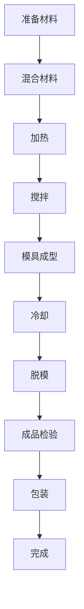
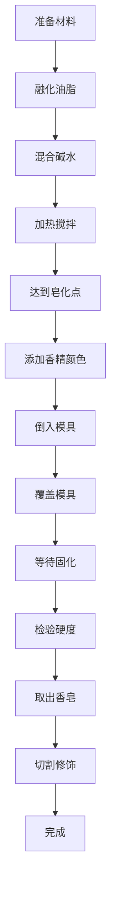

                 

### 手工香皂制作的背景与价值

#### 环保趋势

在现代社会，环保已成为全球共同关注的重要议题。随着工业化的快速发展，环境污染问题日益严重，从空气、水源到土壤，都受到了不同程度的破坏。在这个背景下，人们开始反思传统日用品的生产和消费方式，寻找更加环保的替代品。手工香皂作为一种绿色环保的产品，逐渐受到人们的青睐。

手工香皂的制作过程不依赖大规模工业化生产，避免了化学添加剂和工业废水的排放，对环境的影响较小。此外，手工香皂使用的天然材料，如油脂、精油和植物提取物，大多来源于可持续种植，有助于减少对自然资源的消耗。因此，手工香皂不仅能够满足日常清洁需求，还能在环保方面发挥积极作用。

#### 手工艺术的价值

手工艺术作为一种传统文化形式，具有深厚的历史和文化底蕴。在工业化批量生产的时代，手工艺术的价值受到了一定程度的忽视。然而，随着人们对生活品质的追求和环保意识的提高，手工艺术再次焕发出新的生命力。

手工香皂的制作过程是对手工艺术的传承和发扬。每一个香皂都凝结了制作者的智慧和心血，展现了独特的个性和创意。手工香皂不仅是一种清洁用品，更是一种艺术品。它们可以成为家庭装饰的一部分，为生活增添艺术气息。

#### 手工香皂在日用品中的应用

手工香皂在日用品中的应用非常广泛。除了日常洗手、沐浴和洗衣等基本用途外，手工香皂还可以用于护肤、美容和按摩等。不同种类和配方的手工香皂具有不同的功效，可以满足不同人群的需求。

此外，手工香皂作为一种个性化的产品，也受到许多追求独特体验的消费者的喜爱。他们喜欢亲手制作香皂，体验从原材料到成品的整个过程，感受手工艺术的魅力。这不仅是一种生活的享受，更是一种心灵的慰藉。

总的来说，手工香皂制作在现代环保和手工艺术背景下，具有重要的价值和广阔的市场前景。在接下来的章节中，我们将详细探讨手工香皂的核心概念、材料选择、工艺流程以及环保与艺术价值等方面的内容。

### 核心概念与联系

手工香皂的制作过程涉及多个核心概念，这些概念相互联系，构成了整个工艺流程的基础。首先，我们需要明确几个关键概念：天然油脂、碱（如氢氧化钠）、甘油和香精等。

#### 天然油脂

天然油脂是手工香皂制作的基础材料之一。常见的天然油脂包括橄榄油、椰子油、棕榈油和乳木果油等。这些油脂不仅具有良好的清洁能力，还对人体皮肤有较好的保湿效果。不同种类的油脂具有不同的物理和化学特性，因此在选择时应考虑其熔点和硬度的匹配。

#### 碱（如氢氧化钠）

碱是手工香皂制作中的另一个重要成分，常用于皂化反应。在皂化过程中，油脂和碱发生化学反应，生成肥皂和甘油。氢氧化钠是常用的碱，其用量和浓度的控制对香皂的硬度和清洁能力有直接影响。此外，过量使用碱可能会导致皮肤刺激，因此需要精确计量。

#### 甘油

甘油是皂化反应的副产品之一，具有良好的保湿效果，可以增强香皂的滋润性。在制作过程中，甘油的含量和分布对香皂的质地和性能有重要影响。

#### 香精

香精用于增加香皂的香气，提供独特的香味体验。不同种类的香精具有不同的香气和持久性，可以根据个人喜好和用途进行选择。

#### 材料属性特征对比

以下是几种常见天然油脂的属性特征对比表格：

| 油脂种类 | 熔点（℃） | 硬度 | 清洁能力 | 保湿效果 |
| --- | --- | --- | --- | --- |
| 橄榄油 | 16-24 | 中等 | 中等 | 较好 |
| 椰子油 | 24-30 | 较高 | 较高 | 较差 |
| 棕榈油 | 35-42 | 最高 | 最高 | 较好 |
| 乳木果油 | 20-25 | 中等 | 中等 | 较好 |

#### 香皂制作的Mermaid流程图

为了更直观地理解手工香皂的制作过程，我们可以使用Mermaid流程图来展示。以下是一个简单的Mermaid流程图示例：

在上述流程图中，A代表准备材料，包括天然油脂、碱、甘油和香精等；B代表混合材料，即将各种成分按比例混合；C代表加热，通过加热促进皂化反应；D代表搅拌，确保混合均匀；E代表模具成型，将混合物倒入模具中；F代表冷却，等待香皂凝固；G代表脱模，取出成型的香皂；H代表成品检验，检查香皂的质量；I代表包装，将香皂进行包装；K代表完成，整个制作流程结束。

通过上述核心概念和Mermaid流程图的介绍，我们可以更好地理解手工香皂制作的整个过程。在接下来的章节中，我们将详细探讨每种材料的特性及其在制作过程中的作用，以及如何通过合理的配方和工艺流程，制作出高质量的手工香皂。

### 材料选择

在手工香皂的制作过程中，材料的选择至关重要。不同的材料不仅影响着香皂的质地和性能，还决定了其环保和健康属性。以下是几种常见的材料及其特性，包括天然油脂、精油、植物提取物和碱。

#### 天然油脂

天然油脂是手工香皂的主要成分之一，它们不仅提供了清洁能力，还赋予香皂特有的质地和保湿效果。以下是一些常用的天然油脂及其特性：

1. **橄榄油**：
   - **特性**：橄榄油具有良好的保湿效果，适合干燥肌肤。
   - **应用**：适用于制作滋润型香皂。

2. **椰子油**：
   - **特性**：椰子油清洁能力较强，适合油性皮肤。
   - **应用**：适用于制作清洁力较强的香皂。

3. **棕榈油**：
   - **特性**：棕榈油硬度高，有助于增加香皂的耐用性。
   - **应用**：适用于制作硬质香皂。

4. **乳木果油**：
   - **特性**：乳木果油具有良好的保湿效果，适合各种肤质。
   - **应用**：适用于制作滋润型香皂。

#### 精油

精油用于增加香皂的香气，同时具有一定的护肤功效。不同的精油具有不同的香气和特性，以下是一些常用的精油：

1. **薰衣草精油**：
   - **特性**：具有镇定和消炎作用，适合敏感肌肤。
   - **应用**：适用于舒缓皮肤，特别适合在夜间使用。

2. **薄荷精油**：
   - **特性**：具有清凉感和镇痛效果，适合油性肌肤。
   - **应用**：适用于清凉型香皂，适合夏季使用。

3. **柑橘精油**：
   - **特性**：具有清新香气，有助于提神和放松。
   - **应用**：适用于日常清洁和提神香皂。

#### 植物提取物

植物提取物可以赋予香皂额外的护肤成分和自然香气。以下是一些常用的植物提取物：

1. **茶树提取物**：
   - **特性**：具有抗菌和消炎作用，适合油性和痤疮肌肤。
   - **应用**：适用于治疗痤疮和油性肌肤的香皂。

2. **洋甘菊提取物**：
   - **特性**：具有抗炎和舒缓作用，适合敏感肌肤。
   - **应用**：适用于敏感肌肤和舒缓香皂。

3. **芦荟提取物**：
   - **特性**：具有保湿和修复作用，适合干燥肌肤。
   - **应用**：适用于滋润和修复肌肤的香皂。

#### 材料属性特征对比表格

以下是几种常见天然油脂、精油和植物提取物的属性特征对比表格：

| 材料种类 | 特性 | 应用场景 | 注意事项 |
| --- | --- | --- | --- |
| 橄榄油 | 保湿、滋润 | 普遍肌肤、滋润型香皂 | 注意防止氧化变质 |
| 椰子油 | 清洁、保湿 | 油性肌肤、清洁型香皂 | 注意其饱和度高，可能引起粉刺 |
| 棕榈油 | 增硬、耐用 | 硬质香皂 | 高硬度可能导致皮肤干燥 |
| 乳木果油 | 保湿、滋润 | 各种肤质、滋润型香皂 | 注意其油脂含量高，可能引起皮肤不适 |
| 薰衣草精油 | 镇定、消炎 | 敏感肌肤、夜间使用 | 避免直接接触眼睛 |
| 薄荷精油 | 清凉、镇痛 | 油性肌肤、夏季使用 | 避免过量使用，可能导致皮肤干燥 |
| 柑橘精油 | 清新、提神 | 日常清洁、提神香皂 | 避免阳光直射，防止变质 |
| 茶树提取物 | 抗菌、消炎 | 油性肌肤、痤疮肌肤 | 避免长期大量使用，可能导致皮肤干燥 |
| 洋甘菊提取物 | 抗炎、舒缓 | 敏感肌肤、舒缓香皂 | 避免直接接触眼睛 |
| 芦荟提取物 | 保湿、修复 | 干燥肌肤、滋润香皂 | 避免与其他刺激性物质混合 |

通过上述材料的选择和特性对比，我们可以根据不同的需求和肤质，选择合适的材料来制作手工香皂。在接下来的章节中，我们将详细探讨手工香皂的工艺流程，从混合、加热、搅拌到模具成型和冷却等步骤，全面了解香皂制作的每一个细节。

### 手工香皂的工艺流程

手工香皂的制作过程虽然看似简单，但其中却包含了许多精细的步骤和技巧。以下是详细的工艺流程，包括混合、加热、搅拌、模具成型、冷却和脱模等步骤。

#### 混合材料

1. **准备材料**：首先，准备好所有的材料，包括天然油脂（如橄榄油、椰子油等）、碱（如氢氧化钠）、甘油和香精等。确保所有材料都已测量并准备就绪。

2. **融化油脂**：将天然油脂放入一个大锅中，用中火加热至融化。需要注意的是，加热过程中应不断搅拌，以防油脂烧焦或出现油水分离。

3. **混合碱和水**：在另一个容器中，将碱和水的比例混合。碱溶于水时会释放大量热量，因此需小心操作，避免烫伤。

4. **缓慢加入碱水**：将碱水缓慢倒入融化的油脂中，同时不断搅拌。这一步骤需要耐心，以确保碱和油脂充分混合。

#### 加热

1. **继续搅拌**：在加入碱水后，继续加热并搅拌混合物。此时混合物会逐渐变得稠厚，颜色从透明变为乳白色。

2. **达到皂化点**：加热至混合物达到皂化点，即大约 38-40°C。皂化点是油脂和碱反应生成肥皂和甘油的关键温度。

#### 搅拌

1. **均匀混合**：在皂化点附近，继续搅拌混合物，以确保所有成分均匀混合。搅拌过程中，可以使用搅拌棒或电动搅拌器。

2. **观察颜色变化**：随着搅拌的进行，混合物的颜色会从乳白色逐渐变为透明色，这是皂化反应完全进行的标志。

#### 模具成型

1. **添加香精和颜色**：在混合物中加入香精和色素，根据个人喜好调整香型和颜色。搅拌均匀后，即可准备模具成型。

2. **倒入模具**：将混合物倒入模具中，并使用刮刀刮平表面，确保模具内的混合物均匀分布。

3. **覆盖模具**：用塑料薄膜或保鲜膜覆盖模具，以防止水分蒸发。

#### 冷却

1. **等待固化**：将模具放置在通风良好的地方，等待香皂固化。通常需要24-48小时，具体时间取决于气候和模具的大小。

2. **保湿**：在冷却过程中，可以使用湿布覆盖模具，以保持湿润，有助于香皂均匀固化。

#### 脱模

1. **检验硬度**：在香皂完全固化后，用手指轻轻按压模具边缘，检查香皂的硬度。如果香皂不易变形，即可进行脱模。

2. **取出香皂**：将模具取出，用刮刀轻轻刮去模具底部，将香皂完整取出。

3. **切割和修饰**：根据需要，使用切割器将香皂切割成所需形状，并进行适当的修饰，如雕刻和打磨。

#### 香皂工艺流程Mermaid流程图

为了更直观地展示香皂的工艺流程，我们可以使用Mermaid流程图来描述：

通过上述详细步骤和Mermaid流程图的辅助，我们可以清楚地了解手工香皂的制作过程。在接下来的章节中，我们将探讨手工香皂在环保和艺术价值上的意义，以及如何通过配方和创新，制作出独特的手工香皂。

### 环保与艺术价值

手工香皂不仅在日常生活中发挥着重要作用，更在环保和艺术价值上具有独特意义。首先，从环保角度来看，手工香皂的制作和消费过程相较于工业化生产，具有显著的环保优势。

#### 环保意义

1. **减少化学污染**：工业化生产的香皂通常含有大量的化学添加剂，如合成表面活性剂和防腐剂等。这些化学物质在使用过程中可能对环境造成污染，甚至对人体健康产生负面影响。而手工香皂则主要采用天然材料，避免了化学污染。

2. **减少资源消耗**：手工香皂的制作过程不依赖大规模工业化生产，减少了能源和原材料的消耗。例如，天然油脂和植物提取物通常来自可持续种植，有助于减少对自然资源的依赖。

3. **减少废弃物**：手工香皂的制作过程中，产生的废弃物相对较少。与工业化生产相比，手工香皂的制作减少了包装材料的使用，降低了废弃物的产生。

#### 手工艺术的价值

手工香皂的制作过程本身具有浓厚的艺术价值。每一块手工香皂都是制作者智慧和创造力的体现，展现了独特的艺术风格和个人品味。

1. **个性化定制**：手工香皂可以根据个人需求和喜好进行定制，从香型、颜色到形状，都可以根据创意进行设计。这种个性化的定制使得手工香皂不仅是一种日常用品，更是一种艺术品。

2. **文化传承**：手工香皂的制作工艺蕴含着丰富的文化内涵。许多传统手工技艺在香皂制作过程中得到了传承和发扬，成为文化传承的重要载体。

3. **审美体验**：手工香皂的外观设计、香气和质感都能给人带来独特的审美体验。与工业化生产的标准化产品相比，手工香皂更具独特性和艺术价值。

#### 香皂在生活中的艺术应用

手工香皂不仅可以用于日常清洁，还在生活中的艺术应用中发挥着重要作用。

1. **家居装饰**：手工香皂可以作为家居装饰的一部分，放置在浴室、客厅或办公室等地方，增添艺术气息和生活品质。

2. **礼品定制**：手工香皂可以作为个性化的礼品，传达心意和关爱。定制版的手工香皂，无论在形状、颜色还是香味上，都可以根据收礼者的喜好进行设计。

3. **艺术创作**：手工香皂的制作和设计本身可以成为一种艺术创作。许多艺术家通过手工香皂来表达自己的艺术理念和创作风格，创造出独特的艺术作品。

总的来说，手工香皂在环保和艺术价值上具有重要意义。它不仅是一种环保、健康的日用品，更是一种充满艺术氛围的生活艺术品。在接下来的章节中，我们将探讨手工香皂的配方和创意，帮助读者制作出更具个性化和艺术价值的香皂。

### 配方与创意

手工香皂的制作不仅是技术活，更是一种创意表达。通过不同的配方和创意，我们可以制作出丰富多彩、各具特色的香皂。以下是一些基础配方和创意配方的介绍，以及制作步骤和用途。

#### 基础配方

1. **经典沐浴香皂**：
   - **材料**：橄榄油 200g，椰子油 100g，氢氧化钠 80g，水 120g，甘油 20g，香精 5g。
   - **用途**：适用于日常沐浴，清洁力适中，同时具有滋润效果。

2. **洁面香皂**：
   - **材料**：橄榄油 100g，棕榈油 100g，氢氧化钠 80g，水 120g，甘油 20g，香精 5g。
   - **用途**：适用于面部清洁，清洁力较强，适合油性皮肤。

3. **洗手香皂**：
   - **材料**：橄榄油 150g，乳木果油 50g，氢氧化钠 60g，水 100g，甘油 10g，香精 3g。
   - **用途**：适用于日常洗手，滋润保湿，适合干燥肌肤。

#### 创意配方

1. **薰衣草薰香皂**：
   - **材料**：橄榄油 150g，薰衣草精油 5g，氢氧化钠 60g，水 100g，甘油 10g。
   - **用途**：薰衣草香气有助于放松身心，适合在睡前使用。

2. **巧克力香皂**：
   - **材料**：椰子油 100g，可可脂 50g，氢氧化钠 60g，水 100g，甘油 10g，巧克力香精 5g。
   - **用途**：巧克力香皂外观诱人，香气独特，适合作为礼品。

3. **薄荷清凉香皂**：
   - **材料**：橄榄油 150g，薄荷精油 10g，氢氧化钠 60g，水 100g，甘油 10g。
   - **用途**：薄荷清凉香皂适合夏季使用，具有提神和清凉效果。

#### 制作步骤与创意展示

1. **混合材料**：
   - 将天然油脂（橄榄油、椰子油等）放入大锅中，用中火加热至融化。
   - 将氢氧化钠与水混合，待氢氧化钠完全溶解后，逐渐加入融化的油脂中。
   - 持续搅拌，确保所有成分充分混合。

2. **加入香精和颜色**：
   - 根据配方加入香精和色素，搅拌均匀。
   - 若需要添加其他材料（如巧克力粉、薰衣草花等），也在此时加入。

3. **模具成型**：
   - 将混合物倒入模具中，用刮刀刮平表面，确保均匀。
   - 用塑料薄膜或保鲜膜覆盖模具，以防止水分蒸发。

4. **冷却和脱模**：
   - 将模具放置在通风良好的地方，等待香皂固化，通常需要24-48小时。
   - 固化后，用刮刀轻轻刮去模具底部，将香皂完整取出。

5. **切割和修饰**：
   - 使用切割器将香皂切割成所需形状。
   - 进行适当的修饰，如雕刻、打磨等，以增加艺术感。

通过以上基础配方和创意配方，我们可以根据个人喜好和需求，制作出各种独特的手工香皂。这些香皂不仅具有实用性，还蕴含着艺术价值和环保理念。在接下来的章节中，我们将进一步探讨手工香皂的注意事项与维护，确保制作出高质量的手工香皂。

### 注意事项与维护

在手工香皂的制作过程中，有一些重要的注意事项和维护方法，以确保香皂的质量和使用效果。以下是一些关键点：

#### 制作过程中的注意事项

1. **安全操作**：
   - 在制作过程中，要穿戴好防护手套和围裙，避免氢氧化钠等化学物质直接接触皮肤。
   - 操作时要远离火源和高温环境，以防止发生意外。

2. **精确计量**：
   - 确保所有材料的用量准确，尤其是氢氧化钠和水的比例，这直接影响香皂的硬度和清洁能力。

3. **搅拌均匀**：
   - 加热和搅拌过程中要确保混合物充分搅拌，以保证成分均匀分布。

4. **温度控制**：
   - 加热时需控制温度，避免过高或过低，影响皂化反应的进行。

5. **避免氧化**：
   - 油脂在高温下容易氧化，因此搅拌和加热过程中应尽量缩短时间，并使用无氧或低氧环境。

6. **防止污染**：
   - 保持工作环境的清洁，避免工具和容器上的污垢进入混合物中。

#### 香皂的使用与保养

1. **正确使用**：
   - 手工香皂不宜过度搓揉，以免降低清洁效果和缩短使用寿命。
   - 使用后应将香皂放在通风干燥的地方，避免长时间浸水。

2. **保湿**：
   - 如果香皂变干或开裂，可以将其放入水中浸泡几分钟，再轻轻擦拭干。

3. **存放**：
   - 避免将香皂存放在高温或潮湿的环境中，以免影响其质地和效果。

4. **更换**：
   - 若香皂表面出现霉斑或变质，应及时更换，以免影响使用效果。

#### 香皂保存方法

1. **密封保存**：
   - 使用密封容器或塑料袋将香皂包装好，以防止空气中的水分进入。

2. **干燥环境**：
   - 将香皂放置在干燥通风的环境中，避免阳光直射。

3. **分类存放**：
   - 根据香皂的种类和用途进行分类存放，便于管理和使用。

通过遵循上述注意事项和维护方法，我们可以确保手工香皂的质量和使用效果，使其在日常生活中发挥最佳作用。

### 项目实战

在本节中，我们将通过一个实际案例，详细展示手工香皂的制作全过程，包括材料准备、制作步骤、成品展示和实际案例分析。

#### 案例背景

本案例旨在制作一块薰衣草薰香皂，该香皂不仅具有独特的薰衣草香气，还兼具保湿和舒缓肌肤的效果。以下是具体的制作步骤和详细过程。

#### 材料准备

1. **天然油脂**：橄榄油 200g，椰子油 100g，乳木果油 50g。
2. **碱**：氢氧化钠 80g。
3. **水**：120g。
4. **甘油**：20g。
5. **香精**：薰衣草精油 10g。
6. **模具**：方形模具或者圆柱形模具。
7. **色素**：蓝色食用色素。

#### 制作步骤

1. **融化油脂**：
   - 将橄榄油、椰子油和乳木果油分别放入三个小锅中，用中火加热至油脂融化。

2. **混合碱和水**：
   - 在一个大碗中，将氢氧化钠和水的比例混合，搅拌均匀。注意此时溶液会释放大量热量，应小心操作，避免烫伤。

3. **缓慢加入碱水**：
   - 将碱水缓慢倒入融化的油脂中，同时不断搅拌，以确保充分混合。

4. **加热搅拌**：
   - 继续加热并搅拌混合物，直至混合物温度达到约38-40°C，即皂化点。在此过程中，需要确保混合物均匀搅拌，避免出现油水分离。

5. **加入香精和色素**：
   - 将薰衣草精油和蓝色食用色素加入混合物中，根据个人喜好调整香型和颜色。搅拌均匀后，即可准备模具成型。

6. **倒入模具**：
   - 将混合物倒入方形模具或圆柱形模具中，用刮刀刮平表面，确保模具内的混合物均匀分布。

7. **覆盖模具**：
   - 用塑料薄膜或保鲜膜覆盖模具，以防止水分蒸发。

8. **冷却和固化**：
   - 将模具放置在通风良好的地方，等待香皂固化，通常需要24-48小时。在冷却过程中，可以使用湿布覆盖模具，以保持湿润，有助于香皂均匀固化。

9. **脱模**：
   - 固化后，用手指轻轻按压模具边缘，检查香皂的硬度。如果香皂不易变形，即可进行脱模。

10. **切割和修饰**：
    - 使用切割器将香皂切割成所需形状，并进行适当的修饰，如雕刻和打磨。

#### 成品展示

制作完成的薰衣草薰香皂呈现出淡蓝色，散发出浓郁的薰衣草香气。香皂表面光滑细腻，手感柔软，适合作为日常沐浴或面部清洁使用。

#### 实际案例分析与详细讲解

在本案例中，我们采用了橄榄油、椰子油和乳木果油这三种天然油脂，这三种油脂的组合不仅提供了良好的清洁能力和保湿效果，还使香皂具有了独特的质地。以下是具体分析：

1. **橄榄油**：橄榄油具有良好的保湿效果，适合干燥肌肤。在本案例中，橄榄油占主要比例，有助于提高香皂的滋润性。

2. **椰子油**：椰子油清洁能力较强，适合油性皮肤。尽管在本案例中椰子油的用量较少，但它的清洁能力有助于去除污垢，使香皂更具清洁效果。

3. **乳木果油**：乳木果油具有良好的保湿效果，适合各种肤质。在本案例中，乳木果油的比例适中，有助于提高香皂的滋润性，同时不会使香皂过于油腻。

通过上述分析，我们可以看到，选择合适的油脂组合对于制作高质量的手工香皂至关重要。在本案例中，橄榄油、椰子油和乳木果油的组合不仅提供了良好的清洁能力和保湿效果，还使得香皂具有了独特的香气和质地。

#### 项目小结

通过本案例的实际操作，我们详细了解了手工香皂的制作过程，从材料准备到成品展示，每一步都至关重要。手工香皂不仅是一种环保、健康的日用品，更是一种充满创意和艺术价值的生活艺术品。在未来的实践中，我们可以通过调整材料比例和添加不同的香精和色素，制作出更多具有个性化和艺术价值的香皂。

### 最佳实践 tips

在手工香皂的制作过程中，积累一些实用的制作技巧和注意事项，能够帮助我们更加高效和成功地制作出高质量的手工香皂。以下是一些最佳实践 tips：

#### 制作技巧

1. **精确计量**：确保所有材料的用量准确，特别是氢氧化钠和水的比例，这直接影响香皂的硬度和清洁能力。

2. **快速搅拌**：在皂化过程中，快速搅拌可以防止油脂与碱分离，确保混合物均匀。

3. **温度控制**：加热过程中，注意控制温度，避免过高或过低，影响皂化反应的进行。

4. **容器选择**：使用非金属容器进行混合和加热，以避免金属与碱反应，影响香皂质量。

5. **添加香精和色素**：在混合物完全皂化后再添加香精和色素，确保颜色和香气均匀分布。

6. **冷却速度**：适当加快冷却速度，有助于提高香皂的硬度，延长使用寿命。

#### 注意事项

1. **安全第一**：在操作过程中，穿戴好防护手套和围裙，避免氢氧化钠等化学物质直接接触皮肤。

2. **避免高温**：高温环境下操作时，应远离火源和高温设备，防止意外发生。

3. **容器清洗**：使用前确保所有容器和工具清洗干净，避免残留物影响香皂质量。

4. **避免氧化**：油脂在高温下容易氧化，操作时尽量缩短时间，使用无氧或低氧环境。

5. **储存条件**：将制作好的香皂存放在干燥、通风的环境中，避免阳光直射，以防变质。

6. **定期消毒**：定期对制作工具进行消毒，确保卫生，避免细菌滋生。

通过遵循这些最佳实践 tips，我们可以提高手工香皂制作的效率和质量，确保每一块香皂都是精品。

### 小结与拓展

在本文中，我们详细探讨了手工香皂的制作过程、材料选择、工艺流程、环保与艺术价值、配方与创意、注意事项与维护，以及实际案例和最佳实践 tips。通过这些内容，我们可以看到手工香皂不仅是一种环保、健康的日用品，更是一种富有艺术价值和个性化创意的生活艺术品。

#### 总结

1. **环保与艺术**：手工香皂在环保和艺术价值上具有重要意义，通过使用天然材料和个性化的设计，既满足了日常清洁需求，又提升了生活品质。

2. **材料选择**：不同种类的天然油脂、精油和植物提取物赋予了手工香皂独特的质地和香气，根据需求选择合适的材料是制作高质量香皂的关键。

3. **工艺流程**：手工香皂的工艺流程虽然复杂，但通过逐步操作和细节把控，可以制作出高质量、个性化的香皂。

4. **创新与创意**：手工香皂的制作不仅是一种技术活，更是一种创意表达。通过调整配方和设计，我们可以制作出独具特色的香皂。

#### 拓展阅读资源

1. **《手工皂制作全书》**：详细介绍了手工香皂的制作技巧、配方和创意设计，适合初学者和有经验的手工香皂爱好者。
2. **《环保生活手册》**：探讨了环保生活方式的各种实践，包括手工香皂的制作，提供了更多关于环保的见解和资源。
3. **《香氛生活》**：介绍了香氛在日常生活中的应用，包括手工香皂的香气设计和创意，帮助读者提升香氛生活的品味。

通过本文的探讨，我们不仅了解了手工香皂的制作过程，更深入思考了手工艺术与环保的结合，希望读者能够在实践中体验到手工香皂的魅力，并将这份独特的生活艺术融入到日常生活中。在未来的创作和探索中，我们期待看到更多精彩的手工香皂作品问世。作者：AI天才研究院/AI Genius Institute & 禅与计算机程序设计艺术 /Zen And The Art of Computer Programming。

