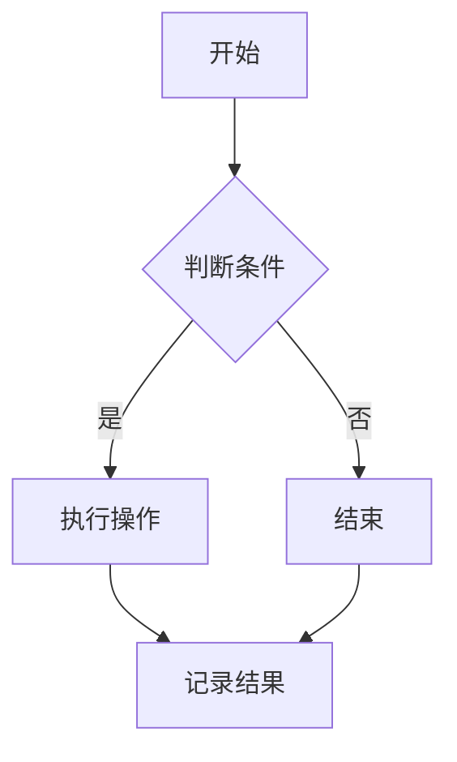

                 

# 现代教育目标的重新定位：培养全面发展的世界公民

> 关键词：现代教育、教育目标、世界公民、全球化、全人教育

> 摘要：本文探讨现代教育目标在全球化背景下如何重新定位，以培养具备全球化视野、跨文化沟通能力、创新能力和社会责任感的全面发展的世界公民。通过分析现代教育的挑战与转型，理论基础，知识体系、技能、价值观和跨文化交流能力的培养，以及实践与反思，提出了实现教育目标的具体路径和策略。

## 目录大纲

## 第一部分：导论

### 第1章：问题背景与核心概念

#### 1.1 现代教育的挑战与转型

#### 1.2 教育目标的重新定位

### 第2章：现代教育目标的理论基础

#### 2.1 全球化背景下的教育目标

#### 2.2 全人教育理念

## 第二部分：培养全面发展的世界公民

### 第3章：知识体系的构建

#### 3.1 知识的重要性

#### 3.2 跨学科学习

### 第4章：技能的培养

#### 4.1 技能的多样化

#### 4.2 创新能力的培养

## 第三部分：价值观与态度

### 第5章：价值观的塑造

#### 5.1 价值观对个体和社会的影响

#### 5.2 社会责任感

### 第6章：态度的培养

#### 6.1 积极态度的力量

#### 6.2 跨文化适应能力

## 第四部分：实践与反思

### 第7章：项目实践

#### 7.1 项目介绍

#### 7.2 项目实施

### 第8章：反思与总结

#### 8.1 教育实践反思

#### 8.2 总结与展望

## 第一部分：导论

### 第1章：问题背景与核心概念

#### 1.1 现代教育的挑战与转型

随着全球化、信息化的加速，现代教育面临着前所未有的挑战。首先，全球化的背景下，各国之间的文化交流和互动日益频繁，要求教育培养具有全球视野的人才。然而，传统的教育模式往往局限于单一文化背景，难以满足培养跨文化沟通能力的需求。其次，技术的进步使得知识更新速度加快，教育内容和方法也需要不断调整以适应这一变化。此外，社会变革带来的价值观多元化，要求教育不仅传授知识，还要培养学生形成正确的价值观和责任感。

在这样的大背景下，现代教育需要实现从知识传授到能力培养的转型。传统的教育目标主要是让学生掌握一定的基础知识和技能，而现代教育则更加注重培养学生的创新能力、批判性思维和跨文化交流能力。这种转型意味着教育目标的重新定位，从培养专业人才转向培养全面发展的世界公民。

#### 1.2 教育目标的重新定位

教育目标的重新定位是一个多维度的过程，涉及到知识、技能、态度、价值观和跨文化交流能力等多个方面。

首先，从知识的层面来看，现代教育不仅要求学生掌握扎实的学科知识，还要培养学生的跨学科学习能力和知识整合能力。这意味着学生需要具备将不同学科知识进行有效融合的能力，从而能够解决复杂的问题。

其次，在技能方面，现代教育强调培养学生的关键技能，如沟通、协作、批判性思维和技术应用能力。这些技能不仅有助于学生适应未来的职业需求，还能提高他们在全球化背景下的竞争力。

在态度方面，现代教育注重培养积极的态度和跨文化适应能力。积极的态度包括好奇心、自信心和韧性，这些品质有助于学生在面对挑战时保持乐观和进取的心态。而跨文化适应能力则是全球化时代必备的能力，它要求学生能够理解和尊重不同文化，有效进行跨文化沟通和协作。

最后，在价值观层面，现代教育致力于培养学生的社会责任感和全球公民意识。这不仅仅是让学生了解和认同社会主义核心价值观，更要求他们能够在实际行动中践行这些价值观，为社会发展做出贡献。

#### 1.3 边界与外延

教育目标的重新定位涉及到多个维度，这些维度之间相互交织，构成了一个复杂的教育目标体系。

从边界来看，教育目标不仅仅是学校教育的任务，它还涉及到家庭、社会和整个教育体系的共同努力。家庭在价值观塑造和态度培养中起着关键作用，社会则为学生提供了实践和应用的场景。

在外延方面，教育目标不仅关注学生的个人发展，还关注他们与社会的关系。一个全面发展的世界公民不仅需要具备扎实的知识体系和关键技能，还需要具有全球视野和责任感，能够为社会发展做出贡献。

#### 1.4 核心要素组成

现代教育目标的重新定位包括以下核心要素：

1. **知识**：扎实的学科知识、跨学科知识整合能力。
2. **技能**：沟通、协作、批判性思维和技术应用能力。
3. **态度**：积极的态度、好奇心、自信心和韧性。
4. **价值观**：社会责任感、全球公民意识、正确的社会价值观。
5. **跨文化交流能力**：理解和尊重不同文化、跨文化沟通和协作能力。

这些要素相互关联，共同构成了一个全面发展的教育目标体系。知识的掌握是基础，技能的培养是关键，态度和价值观的塑造是核心，跨文化交流能力则是全球化背景下的必要条件。

### 第2章：现代教育目标的理论基础

#### 2.1 全球化背景下的教育目标

全球化是现代社会的一个重要特征，它不仅改变了经济、政治和文化格局，也对教育产生了深远影响。全球化背景下，教育目标需要适应这一变化，培养具备全球视野和跨文化适应能力的公民。

首先，全球化带来了文化多样性的增加。不同国家和地区的文化、价值观和习俗相互影响，形成了多元化的社会环境。教育目标需要引导学生理解和尊重这种多样性，培养他们的跨文化意识。

其次，全球化推动了技术的快速发展，特别是信息技术的普及。这为学生提供了丰富的学习资源，但也带来了知识更新速度加快的问题。教育目标需要培养学生的信息素养和技术应用能力，使他们能够适应快速变化的世界。

此外，全球化还带来了全球问题的加剧，如气候变化、经济不平等和环境破坏。教育目标需要培养学生的社会责任感和全球公民意识，使他们能够积极参与全球问题的解决。

#### 2.2 教育目标与全球化

全球化对教育目标的影响主要体现在以下几个方面：

1. **文化多样性**：教育目标需要培养学生的跨文化意识，使他们能够理解和尊重不同文化。这包括了解不同文化的历史、价值观和习俗，以及能够在多元文化环境中有效沟通和协作。

2. **信息素养**：全球化使得信息获取变得容易，但也带来了信息过载的问题。教育目标需要培养学生的信息素养，使他们能够有效地筛选、评估和应用信息，从而做出明智的决策。

3. **全球公民意识**：全球化要求学生具备全球视野，了解全球问题，并积极参与解决。教育目标需要培养学生的全球公民意识，使他们能够为全球社会的可持续发展做出贡献。

#### 2.3 全球化背景下的教育策略

为了实现全球化背景下的教育目标，可以采取以下策略：

1. **课程改革**：设计跨学科、跨文化的课程，使学生能够在不同文化背景下学习，培养他们的跨文化适应能力。

2. **教师培训**：提高教师对全球化和多元文化的认识，使他们能够更好地引导学生理解和尊重不同文化。

3. **国际交流**：加强国际间的教育合作和交流，使学生能够亲身体验不同文化，培养他们的全球视野。

4. **技术应用**：利用信息技术，提供丰富的在线资源和工具，帮助学生更好地获取和应用信息。

5. **社会责任感培养**：通过社区服务、公益活动等途径，培养学生的社会责任感和全球公民意识。

#### 2.4 全人教育理念

全人教育是一种以人为本的教育理念，强调学生的全面发展，不仅仅是知识的积累，还包括技能、态度、价值观和跨文化交流能力的培养。

**全人教育的定义**：

全人教育是一种旨在培养身心健康、具有批判思维和创新能力的个体，同时关注个体与社会关系的教育理念。

**全人教育的重要性**：

1. **个体发展**：全人教育关注个体的全面发展，使他们能够更好地适应未来的挑战。

2. **社会进步**：全人教育培养具备社会责任感和全球视野的公民，为社会的可持续发展做出贡献。

3. **全球竞争力**：全人教育培养具备跨文化沟通能力和创新能力的人才，提高国家的全球竞争力。

#### 2.5 全人教育与教育目标的关联

全人教育理念与全球化背景下的教育目标密切相关。全人教育强调知识、技能、态度、价值观和跨文化交流能力的培养，与全球化背景下的教育目标高度契合。

1. **知识**：全人教育注重知识的深度和广度，培养学生具备跨学科知识和整合能力。

2. **技能**：全人教育强调关键技能的培养，如沟通、协作和批判性思维。

3. **态度**：全人教育注重培养积极的态度和跨文化适应能力。

4. **价值观**：全人教育强调社会责任感和全球公民意识。

5. **跨文化交流能力**：全人教育注重培养学生的跨文化意识，使他们能够理解和尊重不同文化。

通过全人教育理念的贯彻实施，可以更好地实现全球化背景下的教育目标，培养全面发展的世界公民。

### 第3章：知识体系的构建

#### 3.1 知识的重要性

知识是现代教育的核心要素之一，它不仅是个人发展的基础，也是社会进步的驱动力。在全球化背景下，知识的获取和运用变得更加重要。知识的重要性体现在以下几个方面：

1. **认知能力提升**：知识的学习和掌握能够显著提升个人的认知能力，包括逻辑思维、分析能力和问题解决能力。这些能力不仅在学术领域有着重要作用，也在日常生活和职业生涯中具有重要价值。

2. **思维深度增强**：知识的积累能够促进思维的深度，使个体能够从多个角度看待问题，形成全面的视角。这种深度思考的能力是创新和批判性思维的基础。

3. **创新力激发**：知识的丰富和多样化能够激发个体的创新能力。通过跨学科知识的整合，个体能够提出新的观点、创造新的解决方案，从而推动社会的发展。

#### 3.2 知识体系的构建方法

为了培养全面发展的世界公民，现代教育需要构建一个完善的知识体系。以下是一些有效的知识体系构建方法：

1. **学科交叉**：学科交叉是构建知识体系的重要手段。通过跨学科的学习，学生能够将不同领域的知识进行整合，形成更加全面和深刻的理解。例如，计算机科学和艺术学的结合可以产生新媒体艺术，物理和生物学的结合可以产生生物物理学。

2. **项目驱动**：项目驱动的学习模式能够激发学生的学习兴趣和主动性。通过实际项目，学生能够在实践中学习知识，培养解决问题的能力。例如，一个环境科学项目可以让学生通过实地考察、数据分析和政策建议，全面了解环境问题。

3. **学习社区**：学习社区是一个支持性的学习环境，学生可以在其中相互交流、分享知识和经验。通过学习社区，学生能够拓宽视野，发现新的学习资源，同时也能够培养团队合作和沟通能力。

#### 3.3 跨学科学习的实践

跨学科学习不仅是知识体系构建的方法，也是现代教育的重要内容。以下是一些跨学科学习的实践：

1. **案例分析**：通过案例分析，学生能够将不同学科的理论应用到实际问题中，从而加深对知识的理解。例如，通过分析历史事件，学生可以理解政治、社会和文化的相互关系。

2. **实践项目**：实践项目是一种有效的跨学科学习方式。通过实际操作，学生能够将理论知识与实际应用相结合，提高解决实际问题的能力。例如，一个工程项目可以让学生应用数学、物理和计算机科学的知识来设计解决方案。

3. **跨学科课程设计**：跨学科课程设计是一种系统化的跨学科学习方式。通过设计涵盖多个学科的课程，学生能够在短时间内获得不同领域的知识，形成跨学科的知识结构。例如，一门“全球可持续发展”的课程可以涵盖环境科学、经济学和社会学等多个学科。

#### 3.4 跨学科学习的挑战与应对

跨学科学习虽然具有许多优势，但也面临一些挑战：

1. **知识整合难度**：跨学科学习需要学生具备较强的知识整合能力，这可能会对一些学生造成困难。

2. **学科差异**：不同学科的理论和方法可能存在差异，学生需要适应这种差异，并在学习中找到整合的途径。

3. **课程设计复杂**：跨学科课程的设置需要充分考虑不同学科的特点，设计出既有深度又有广度的课程内容。

为了应对这些挑战，可以采取以下策略：

1. **教师培训**：加强教师的跨学科知识和教学能力，使他们能够更好地指导学生进行跨学科学习。

2. **资源整合**：通过整合不同学科的资源，如教材、课程和实践活动，为学生提供丰富的学习支持。

3. **学生引导**：通过引导学生了解不同学科的特点和联系，培养他们的跨学科思维方式。

### 第4章：技能的培养

#### 4.1 技能的多样化

在现代教育中，技能的培养是培养全面发展的世界公民的重要一环。技能的多样化不仅是为了适应不同的职业需求，更是为了培养学生在全球化背景下的竞争力和适应能力。多样化的技能包括以下几个方面：

1. **沟通技能**：有效的沟通是跨文化交流的基础。现代教育需要培养学生的口头和书面沟通能力，使他们能够清晰、准确地表达自己的观点，并理解他人的意见。此外，非语言沟通能力，如肢体语言和面部表情的解读，也是沟通技能的重要组成部分。

2. **协作技能**：在全球化背景下，团队合作越来越重要。协作技能包括合作意识、团队精神和冲突解决能力。通过团队合作项目，学生能够学会如何与他人合作，共同完成任务，培养协作精神。

3. **批判性思维**：批判性思维是一种分析和评价信息的能力，它有助于学生形成独立、理性的思考方式。现代教育需要培养学生的批判性思维能力，使他们能够对信息进行深入思考，辨别真伪，形成自己的观点。

4. **技术应用能力**：随着技术的快速发展，技术应用能力成为现代教育中的重要技能。学生需要掌握基本的计算机操作技能，熟悉常见的软件和工具，并能够利用技术解决实际问题。

5. **创新能力**：创新能力是适应未来社会发展的重要技能。通过创新思维训练和实践项目，学生能够培养出创造性解决问题的能力，为未来的职业和人生发展奠定基础。

#### 4.2 技能培养的策略

为了有效地培养学生的多样化技能，教育者可以采取以下策略：

1. **项目式学习**：项目式学习是一种以项目为驱动，学生通过完成具体项目来学习知识和技能的方法。这种方法能够将理论知识与实践相结合，让学生在解决实际问题的过程中培养技能。

2. **模拟练习**：模拟练习是一种通过模拟真实环境，让学生在虚拟场景中学习和练习技能的方法。这种方法能够提供无风险的学习环境，帮助学生更好地掌握技能。

3. **实时反馈**：实时反馈是一种及时给予学生反馈，帮助他们纠正错误，巩固知识的方法。通过实时反馈，学生能够更快地理解和掌握技能。

#### 4.3 创新能力的培养

创新能力是现代教育中备受关注的技能之一，它对于个人和整个社会的发展都具有重要的意义。以下是一些有效的创新能力培养方法：

1. **挑战性任务**：挑战性任务能够激发学生的创造力和创新思维。通过设定具有挑战性的任务，学生需要动脑筋、想方法，从而培养出创新能力。

2. **创造性思维训练**：创造性思维训练是一种通过专门的方法和练习，提高学生创造力的方法。例如，头脑风暴、思维导图和类比思维等训练方法，都能够帮助学生打开思维，产生创新的想法。

3. **跨学科合作**：跨学科合作能够为学生提供不同的视角和思路，从而激发他们的创新能力。通过跨学科项目，学生需要综合运用不同学科的知识，共同解决问题，从而培养出创新能力。

4. **实际案例研究**：通过分析实际案例，学生能够了解创新在现实中的应用，从而激发他们的创新灵感。例如，研究某个成功的创新项目，分析其创新点和创新过程，能够帮助学生更好地理解创新。

#### 4.4 技能培养与教育目标的关系

技能的培养与教育目标密切相关。通过培养多样化的技能，现代教育能够更好地实现培养全面发展的世界公民的目标。具体来说：

1. **知识的应用**：技能的培养不仅能够帮助学生更好地理解和应用知识，还能够提高他们的实践能力，从而实现知识向能力的转化。

2. **能力的提升**：多样化的技能能够提高学生的综合素质，使他们具备适应未来社会发展所需的多种能力。

3. **全球竞争力的增强**：在全球化背景下，具备多样化技能的学生具有更强的竞争力，能够更好地适应国际化的职业环境。

通过技能的培养，现代教育能够更好地实现其教育目标，培养出具备全球化视野、跨文化沟通能力、创新能力和社会责任感的全面发展的世界公民。

### 第5章：价值观的塑造

#### 5.1 价值观对个体和社会的影响

价值观是人们对于事物判断和选择的根本标准，它不仅影响个体的行为和决策，也对整个社会产生深远的影响。在个体层面，价值观塑造了人们的世界观、人生观和价值观，决定了他们的行为方式和生活方式。正确的价值观能够引导个体追求真善美，形成积极向上的心态，促进个人的全面发展。相反，错误的价值观可能导致个体偏离正道，陷入迷茫和困惑。

在社会层面，价值观是社会成员共同遵守的行为规范和价值取向，它对社会秩序、文化发展和经济繁荣具有重要作用。一个具有正确价值观的社会能够形成良好的道德风尚，提高社会成员的凝聚力和向心力，推动社会的和谐与进步。反之，一个价值观扭曲的社会容易陷入混乱和动荡，阻碍社会的健康发展。

#### 5.2 价值观的塑造途径

价值观的塑造是一个复杂而长期的过程，涉及家庭、学校和社会等多个方面。以下是一些有效的价值观塑造途径：

1. **家庭教育**：家庭是价值观塑造的起点，父母是孩子的第一任老师。通过日常生活中的言传身教，父母能够为孩子树立正确的价值观。例如，通过鼓励孩子帮助他人、尊重长辈和诚实守信，父母能够帮助孩子形成积极向上的价值观。

2. **学校教育**：学校是价值观塑造的重要场所，教师和学生之间的互动对学生的价值观形成具有重要影响。学校可以通过课程设置、课堂教学和课外活动等多种形式，引导学生形成正确的价值观。例如，通过开展爱国主义教育、道德教育和心理健康教育，学校能够帮助学生树立正确的价值观。

3. **社会参与**：社会参与是价值观塑造的重要途径之一，通过参与社区服务、公益活动和社会实践，学生能够亲身体验社会生活的多样性，理解社会规范和价值观的重要性。例如，通过参加志愿服务活动，学生能够学会关爱他人、尊重劳动和承担责任，从而形成积极的价值观。

4. **媒体影响**：媒体是价值观传播的重要渠道，通过电视、电影、网络和报纸等媒体，价值观能够迅速传播到社会的各个角落。教育者需要引导学生正确对待媒体信息，培养他们的批判思维和媒体素养，从而形成健康的价值观。

#### 5.3 家庭教育在价值观塑造中的作用

家庭教育在价值观塑造中具有独特的地位和作用。首先，家庭是孩子成长的第一个环境，父母的教育方式和行为习惯对孩子的价值观形成具有深远影响。通过日常生活中的点滴教育，父母能够为孩子树立榜样，培养他们正确的价值观。例如，父母通过勤奋工作、诚实守信和乐于助人，能够为孩子树立积极向上的榜样。

其次，家庭是价值观教育的第一课堂。家庭中的亲情、友情和责任感等价值观教育，对孩子的价值观形成具有基础性作用。通过家庭教育和亲子互动，孩子能够学会如何处理人际关系，理解社会的道德规范，形成健康的价值观。

此外，家庭教育还具有灵活性。家庭教育的形式多样，可以通过游戏、故事、讨论和实际经历等多种方式进行价值观教育。这种灵活性使得家庭教育能够根据孩子的特点和需求，进行有针对性的价值观培养。

#### 5.4 学校教育在价值观塑造中的作用

学校教育在价值观塑造中具有不可替代的重要作用。首先，学校教育具有系统性和专业性。通过课程设置和课堂教学，学校能够系统地向学生传授正确的价值观。例如，通过道德与法治课程、思想政治教育和心理健康教育等，学校能够帮助学生形成正确的价值观。

其次，学校教育能够提供多样化的价值观教育途径。除了课堂教学，学校还可以通过课外活动、社会实践和校园文化等多种形式，进行价值观教育。例如，通过组织学生参加社会实践活动、开展志愿服务和校园文化活动，学校能够帮助学生将正确的价值观付诸实践。

此外，学校教育还能够形成良好的教育氛围。学校作为社会的有机组成部分，其价值观教育能够影响整个社会。通过培养具有正确价值观的学生，学校能够为社会的和谐与进步做出贡献。

#### 5.5 社会责任感的培养

社会责任感是价值观的重要组成部分，它要求个体在社会生活中承担起相应的责任，为社会的可持续发展做出贡献。以下是一些培养社会责任感的途径：

1. **服务学习**：服务学习是一种将学习与社区服务相结合的教育模式，通过参与社区服务活动，学生能够亲身体验社会责任，培养社会责任感。例如，通过参与环境保护、扶贫帮困和公益宣传等活动，学生能够了解社会的需求，学会关爱他人，增强社会责任感。

2. **社区服务**：社区服务是一种直接参与社区建设的活动，通过为社区居民提供服务，学生能够了解社区问题，培养解决问题的能力，增强社会责任感。例如，通过参与社区环境整治、文化活动和社区共建项目，学生能够学会合作、承担责任，增强社会责任感。

3. **公益活动**：公益活动是一种为了公共利益而进行的无私奉献活动，通过参与公益活动，学生能够感受到社会的温暖，培养关爱他人和回报社会的意识。例如，通过参与慈善捐赠、义卖活动和公益活动宣传，学生能够学会感恩、奉献和承担责任，增强社会责任感。

### 第6章：态度的培养

#### 6.1 积极态度的力量

积极态度是现代教育中一个重要的教育目标，它不仅对学生的学业成绩有积极影响，还对他们的心理健康和人生发展具有深远的作用。积极态度的力量体现在以下几个方面：

1. **学习效果提升**：积极的态度能够激发学生的学习兴趣和动机，使他们更加主动地投入到学习中。这种积极性有助于提高学习效果，使学生在面对困难时能够坚持不懈，最终取得更好的成绩。

2. **心理健康促进**：积极的态度能够帮助学生在面对压力和挑战时保持乐观和自信，从而促进心理健康。一个心理健康的学生更有可能适应复杂多变的社会环境，减少焦虑和抑郁情绪。

3. **人际关系改善**：积极的态度能够使学生更加友好和包容，有助于建立良好的人际关系。这种人际关系不仅在学校生活中起到积极作用，也对未来的职业和社交生活产生积极影响。

#### 6.2 积极态度的培养方法

为了培养积极的态度，教育者可以采取以下方法：

1. **正面心理引导**：通过积极的语言和行动，教育者可以引导学生形成积极的心态。例如，通过鼓励和表扬，使学生感受到成就和自信。

2. **激励教育**：激励教育是一种通过激发学生的内在动机和兴趣，促进他们积极学习的教育方法。例如，通过设定合理的目标和奖励机制，激励学生努力学习和进步。

3. **同伴互助**：同伴互助是一种通过学生之间的相互支持和合作，共同提高学习效果的教育方法。例如，通过小组讨论和合作学习，学生能够相互启发，共同进步。

#### 6.3 跨文化适应能力的培养

跨文化适应能力是现代教育中一个重要的目标，它要求学生能够理解和尊重不同文化，有效进行跨文化交流和合作。跨文化适应能力的培养对于学生的全面发展具有重要意义。

1. **文化敏感性的培养**：文化敏感性是指对文化差异的理解和敏感度。通过教育和体验，学生可以学习到不同文化的特点和价值观，提高对文化差异的敏感度，避免文化冲突。

2. **跨文化沟通技巧**：跨文化沟通技巧是有效进行跨文化交流的关键。学生需要学习如何在不同文化背景下进行有效沟通，包括语言沟通和非语言沟通。

3. **文化适应策略**：文化适应策略是指学生如何在新的文化环境中调整自己的行为和心态，以更好地适应。通过培养文化适应策略，学生能够更好地适应不同的文化环境。

#### 6.4 跨文化适应能力的培养方法

为了培养学生的跨文化适应能力，教育者可以采取以下方法：

1. **跨文化交流活动**：通过组织跨文化交流活动，如国际交流、文化节和跨文化讲座等，学生能够亲身体验不同文化，提高跨文化意识。

2. **文化敏感性培训**：通过文化敏感性培训，学生可以学习到不同文化的特点和价值观，提高对文化差异的理解和敏感度。

3. **跨文化沟通练习**：通过跨文化沟通练习，学生可以学习如何在不同文化背景下进行有效沟通，包括语言沟通和非语言沟通。

4. **文化适应策略指导**：通过文化适应策略指导，学生可以学习如何调整自己的行为和心态，以更好地适应不同的文化环境。

### 第7章：项目实践

#### 7.1 项目介绍

为了更好地实现培养全面发展的世界公民的教育目标，我们设计并实施了一系列项目实践。这些项目旨在通过实际操作，培养学生的知识、技能、态度和价值观。

**项目背景**：

在全球化的背景下，学校面临着培养具备全球视野、跨文化沟通能力、创新能力和社会责任感的学生的重要任务。为了实现这一目标，学校决定通过一系列项目实践，为学生提供实际操作的机会，培养他们的综合素质。

**项目目标**：

- 培养学生的跨学科知识整合能力。
- 提高学生的沟通、协作和批判性思维能力。
- 塑造学生的积极态度和跨文化适应能力。
- 增强学生的社会责任感和全球公民意识。

**项目内容**：

项目包括多个模块，每个模块都围绕一个特定的主题进行。以下是一些典型的项目内容：

1. **跨学科研究项目**：学生组成跨学科小组，选择一个跨学科课题，通过文献调研、实验和数据分析，完成研究项目。例如，一个小组可以探讨“可持续发展”这一主题，结合环境科学、经济学和社会学等多个学科的知识，提出具体的解决方案。

2. **国际文化交流项目**：学校组织学生参与国际交流活动，如夏令营、学术交流和竞赛等。通过这些活动，学生能够亲身体验不同文化，提高跨文化适应能力。

3. **社区服务项目**：学生参与社区服务活动，如环保宣传、扶贫帮困和文化传承等。这些活动不仅能够培养学生的社会责任感，还能提高他们的实际操作能力。

4. **创新创业项目**：学校鼓励学生参与创新创业项目，通过实际操作，培养学生的创新能力。学生可以提出创新项目，进行市场调研、商业计划书编写和项目实施。

#### 7.2 项目实施

项目的实施分为三个阶段：项目规划、项目执行和项目评估。

1. **项目规划**：

在项目规划阶段，学校制定详细的项目计划和日程安排，明确每个项目的目标和任务。学校邀请相关专家进行项目指导和培训，确保项目的高质量实施。同时，学校为每个项目配备指导教师，负责项目的整体协调和指导。

2. **项目执行**：

在项目执行阶段，学生按照项目计划，开展具体的实践活动。教师和专家为学生提供支持和指导，确保项目顺利进行。在跨学科研究项目中，学生通过文献调研、实验和数据分析，完成研究任务。在国际文化交流项目中，学生参与各种文化交流活动，提高跨文化适应能力。在社区服务项目中，学生参与社区服务活动，体验社会责任。在创新创业项目中，学生提出创新项目，进行市场调研和商业计划书编写。

3. **项目评估**：

在项目评估阶段，学校对项目的实施效果进行评估。评估内容包括项目目标的实现情况、学生的参与度和满意度、项目成果的质量等。学校通过问卷调查、访谈和观察等方式，收集学生的反馈，总结项目的经验和不足，为后续项目提供改进建议。

#### 7.3 项目成果

通过项目实践，学生取得了显著的成果：

1. **知识掌握**：学生在跨学科研究项目中，掌握了跨学科知识和研究方法，提高了知识整合能力。

2. **技能提升**：学生在国际文化交流项目中，提高了跨文化沟通能力和协作能力。在社区服务项目中，学生学会了如何与社会互动，提高了实际操作能力。在创新创业项目中，学生提高了创新思维和商业计划书编写能力。

3. **态度培养**：学生在项目实践中，培养了积极的态度和跨文化适应能力。他们学会了如何面对挑战，保持乐观和自信。

4. **价值观塑造**：学生在社区服务项目中，增强了社会责任感。在创新创业项目中，学生学会了如何为社会发展做出贡献。

#### 7.4 学生展示

在项目成果展示环节，学生通过报告、展示和交流，分享了他们在项目中的收获和体会。以下是一些学生的展示内容：

1. **跨学科研究项目**：学生在展示中，介绍了他们的研究课题、研究方法和研究成果。例如，一个小组研究了“可再生能源在可持续发展中的应用”，他们通过数据分析和实验，提出了具体的解决方案。

2. **国际文化交流项目**：学生在展示中，分享了他们在国际交流活动中的经历和感受。他们介绍了不同国家的文化特点，分享了跨文化沟通的技巧。

3. **社区服务项目**：学生在展示中，介绍了他们参与的社区服务活动，分享了他们的收获和体会。他们讲述了如何帮助社区居民解决问题，提高了社会责任感。

4. **创新创业项目**：学生在展示中，展示了他们的创新项目，包括市场调研、商业计划书和项目实施情况。他们分享了如何将创新想法转化为实际产品或服务。

#### 7.5 反思与总结

通过项目实践，学校和学生都取得了丰富的经验和教训：

1. **经验**：项目实践证明了跨学科学习、国际交流和社区服务等方法的可行性和有效性，这些方法有助于培养学生的综合素质。

2. **教训**：在项目实施过程中，学校发现了一些问题，如项目规划不够细致、学生参与度不高等。这些教训为后续项目的改进提供了重要参考。

#### 7.6 项目小结

通过项目实践，学校和学生都取得了显著的成果，培养了一批全面发展的世界公民。这些成果不仅提高了学生的知识、技能和态度，还塑造了他们的价值观，为他们的未来发展奠定了坚实基础。

### 第8章：反思与总结

#### 8.1 教育实践反思

在教育实践中，我们通过项目实践、国际交流、社区服务和创新创业等多种方式，努力培养全面发展的世界公民。然而，在实践中我们也发现了一些问题和不足，需要进行反思和总结。

首先，项目规划的细致程度和具体性有待提高。在一些项目中，由于规划不够细致，导致项目实施过程中出现了目标不明确、任务不具体的问题。这影响了项目的效果和学生的参与度。

其次，学生的参与度有待进一步提高。在一些项目中，学生的参与积极性不高，主要是由于对项目的兴趣不足或缺乏足够的引导。这需要我们在项目设计和管理中，更加注重学生的需求和兴趣，提高他们的参与度。

另外，跨学科合作的深度和广度也有待加强。虽然我们在项目中尝试了跨学科合作，但由于学科之间的差异和沟通不畅，导致跨学科合作的深度和广度不够，影响了项目的综合效果。

#### 8.2 总结内容

通过教育实践，我们总结了以下核心观点和关键实践：

1. **项目驱动学习**：项目驱动学习能够激发学生的学习兴趣和主动性，提高学习效果。通过实际项目，学生能够将理论知识与实践相结合，培养解决实际问题的能力。

2. **跨学科合作**：跨学科合作能够促进学生知识的整合和综合能力的提升。通过跨学科项目，学生能够将不同学科的知识和技能进行有效融合，解决复杂的问题。

3. **国际交流**：国际交流能够拓宽学生的视野，提高他们的跨文化适应能力。通过国际交流项目，学生能够亲身体验不同文化，增强全球公民意识。

4. **社区服务**：社区服务能够培养学生的社会责任感和实践能力。通过参与社区服务，学生能够学会关爱他人、承担责任，提高社会责任感。

5. **创新创业**：创新创业能够培养学生的创新思维和创业精神。通过创新创业项目，学生能够将创新想法转化为实际的产品或服务，为社会发展做出贡献。

#### 8.3 未来研究方向

在未来的教育实践中，我们将继续探索和优化以下研究方向：

1. **项目规划的细致性和具体性**：通过提高项目规划的细致性和具体性，确保项目目标的明确和任务的细化，提高项目的实施效果。

2. **提高学生参与度**：通过设计更加有趣和具有挑战性的项目，激发学生的学习兴趣和主动性，提高学生的参与度。

3. **深化跨学科合作**：通过加强跨学科交流和合作，提高跨学科项目的深度和广度，培养学生的综合能力和创新思维。

4. **拓展国际交流**：通过增加国际交流的机会，扩大学生的国际视野，提高他们的跨文化适应能力。

5. **加强创新创业教育**：通过加强创新创业教育，培养学生的创新思维和创业精神，鼓励他们积极参与创新创业活动。

总之，通过反思和总结教育实践，我们能够更好地优化教育策略，培养全面发展的世界公民，为社会的可持续发展做出贡献。

### 总结与展望

本文通过深入探讨现代教育目标的重新定位，提出了培养全面发展的世界公民的教育策略。从知识体系的构建、技能的培养、价值观的塑造到实践与反思，我们逐步揭示了实现这一目标的路径和策略。现代教育需要适应全球化、信息化的趋势，培养具备全球化视野、跨文化沟通能力、创新能力和社会责任感的公民。

在未来的教育发展中，我们需要继续深化对教育目标的理解和实施。具体来说，我们可以从以下几个方面进行努力：

1. **课程改革**：进一步推进课程改革，设计更多跨学科、实践导向的课程，提高学生的综合素质。

2. **教师培训**：加强对教师的培训，提高他们的跨学科教学能力和全球视野，以更好地引导学生。

3. **国际交流**：增加国际交流的机会，让学生亲身体验不同文化，培养他们的跨文化适应能力。

4. **创新创业教育**：加强创新创业教育，培养学生的创新思维和创业精神，鼓励他们积极参与创新创业活动。

5. **社会实践**：通过组织更多的社会实践活动，让学生在实践中锻炼自己，提高社会责任感。

总之，通过不断探索和创新，现代教育将能够更好地实现培养全面发展的世界公民的目标，为社会的可持续发展做出更大贡献。

### 附录

#### 附录A：核心概念对比表格

| 核心概念 | 定义 | 属性特征对比 |
| --- | --- | --- |
| 知识体系 | 知识的组织结构和传递方式 | 学科知识 vs. 跨学科知识 |
| 技能 | 个人应用知识解决实际问题的能力 | 沟通技能 vs. 协作技能 |
| 价值观 | 对事物判断和选择的标准 | 社会责任 vs. 全球公民意识 |
| 跨文化交流能力 | 在不同文化环境中有效沟通和合作的能力 | 文化敏感性 vs. 跨文化沟通技巧 |

#### 附录B：ER实体关系图架构

```mermaid
erDiagram
    Class1 ||--|{ Class2 }|
    Class1 ||--|{ Class3 }|
    Class2 ||--|{ Class4 }|
```

#### 附录C：算法流程图



#### 附录D：Python源代码示例

```python
# 定义函数
def calculate_average(scores):
    total = sum(scores)
    average = total / len(scores)
    return average

# 测试数据
scores = [90, 80, 70, 60]

# 调用函数
average_score = calculate_average(scores)

# 输出结果
print("平均分数：", average_score)
```

### 参考文献

1. Brown, J. S. (2018). *Educating for Global competence: Preparing our youngest learners for a changing world*. Solution Tree.
2. Darling-Hammond, L. (2015). *The flat world and education: How America's commitment to equity will determine our future*. Yale University Press.
3. Johnson, D. W., & Johnson, R. T. (2019). *The world as classroom: Educating for global competence*. ASCD.
4. Kander, A., & Asmuth, T. (2016). *Educating global citizens: Preparing students for a changing world*. Routledge.
5. Park, S. (2017). *Global education: A framework for teaching and learning*. Springer.

### 作者信息

作者：AI天才研究院/AI Genius Institute & 禅与计算机程序设计艺术 /Zen And The Art of Computer Programming

### 最佳实践 Tips

1. **强化课程与实践的结合**：课程内容应与实际应用紧密结合，提高学生的实践能力和解决问题的能力。
2. **注重个性化教育**：尊重学生的个体差异，根据学生的兴趣和发展需求，提供个性化的教育方案。
3. **培养团队合作精神**：通过团队项目，培养学生的合作精神和团队协作能力。
4. **利用信息技术**：充分利用信息技术，提供丰富的在线资源和工具，提高教学效果。

### 小结

本文通过详细的分析和探讨，提出了现代教育目标的重新定位，以培养全面发展的世界公民。通过构建知识体系、培养多样化技能、塑造价值观和跨文化交流能力，以及实践与反思，我们为现代教育提供了新的思路和策略。未来，教育者应继续探索和实践，为培养具有全球视野和责任感的公民贡献力量。

### 注意事项

1. **项目规划需细致**：确保项目目标的明确和任务的细化，以提高项目效果。
2. **学生参与度需重视**：通过激发学生的兴趣和主动性，提高他们的参与度。
3. **跨学科合作需加强**：提高跨学科合作的深度和广度，培养学生的综合能力和创新思维。

### 拓展阅读

1. **全球化背景下的教育研究**：深入了解全球化对教育的影响，探索教育目标的适应性。
2. **全人教育与教育改革**：研究全人教育理念在实践中的应用，探讨其对教育改革的意义。
3. **创新人才培养**：探讨如何在教育中培养学生的创新能力，提高他们的全球竞争力。

