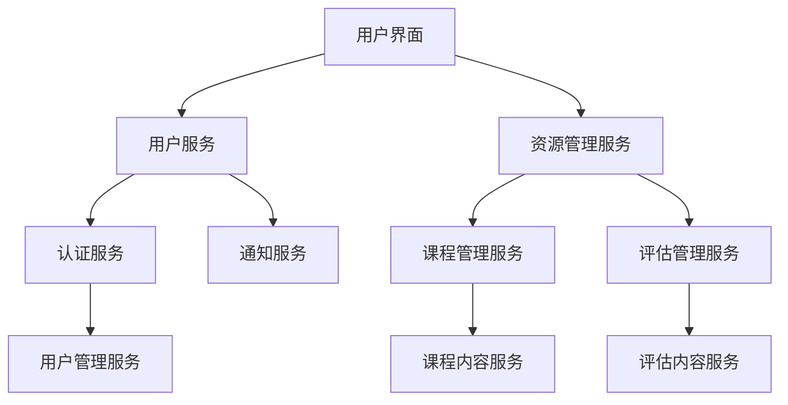
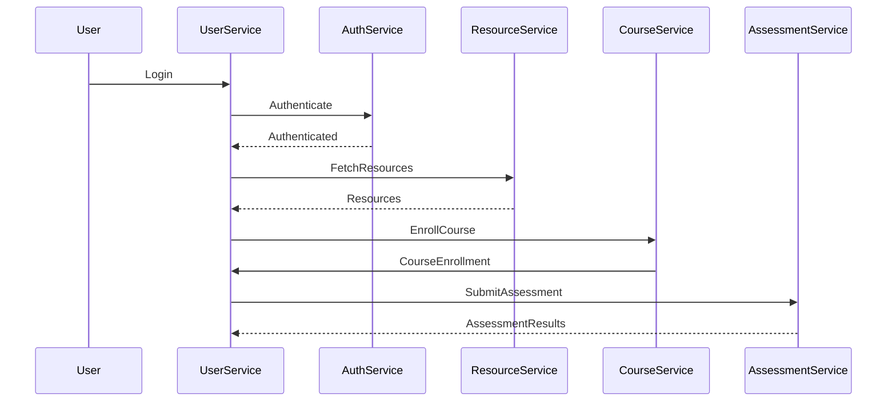

                 

# 现代教育目标的重新定位：培养全面发展的人

关键词：教育目标、全面发展、人才培养、教育改革、现代教育

摘要：随着科技的迅猛发展和全球化的加速，现代社会对教育提出了更高的要求。传统教育目标过于单一，难以适应这一变化。本文将探讨现代教育目标的重新定位，强调培养全面发展的人的必要性，并提出具体的方法和策略，以期为现代教育改革提供有益的参考。

## 引言与背景

### 1.1 问题背景

在当今世界，科技进步日新月异，信息爆炸，社会结构复杂多变。传统的教育目标，如知识传授、技能培养等，已经无法完全满足现代社会对人才的需求。教育面临的挑战不仅在于知识的更新换代，更在于如何培养具有综合素质、适应未来社会发展的人才。

### 1.2 教育目标的演变

教育目标的发展经历了从古代的“德智体全面发展”到现代的“知识技能为本”，再到当今的“全面发展”。每一阶段的教育目标都反映了社会发展的需要和教育的本质。

### 1.3 问题描述

传统教育目标的局限在于过于注重知识技能的传授，忽视了个性的培养、情感的发展和社会责任感的培养。现代社会对教育的新需求则在于培养具有创新精神、团队合作能力、跨文化理解和全球视野的人才。

### 1.4 问题解决

重新定位教育目标的必要性在于，我们需要从单一的知识技能培养转向全面的发展，培养具有综合素质的人才，以适应现代社会的需求。

## 核心概念与联系

### 2.1 教育目标的定义与特点

教育目标是教育活动的出发点和归宿，是教育理念的具体体现。教育目标具有层次性、目标性、可操作性和前瞻性等特点。

### 2.2 全方位培养全面发展的人

全方位培养全面发展的人是指不仅要培养学生的知识技能，还要培养他们的道德品质、心理品质和社会能力。全面发展的人应具备知识技能、道德品质、心理品质和社会能力四大要素。

### 2.3 教育目标与全面发展人的关系

教育目标对全面发展人的培养具有指导作用。通过重新定位教育目标，我们可以更有效地实现全面发展的人的培养。

## 现代教育目标的重新定位

### 3.1 重新定位的原因

现代社会的变化和教育的进步要求我们重新审视教育目标。科技的进步和社会的发展使得教育内容需要不断更新，教育目标也需要与时俱进。

### 3.2 重新定位的目标

重新定位的目标是提高个体的综合素质，培养适应未来社会的人才。这需要我们更加注重学生的个性发展、创新能力、团队合作能力和跨文化理解。

### 3.3 重新定位的方法

重新定位教育目标需要从教育理念、教育模式和教学内容等方面进行改革。教育理念要转变，从知识技能为本转向全面发展；教育模式要创新，从单一的课堂教育转向多元化、个性化的教育；教学内容要丰富，从传统的知识传授转向知识、技能和素质的综合培养。

## 全方位培养全面发展的人

### 4.1 培养知识技能

知识技能的培养是全面发展的人的基础。我们需要培养学生的基础知识和高级技能，包括数学、语文、科学、技术、创新能力和团队合作能力。

### 4.2 培养个人品质

个人品质的培养是全面发展的人的核心。我们需要培养学生的道德品质、心理品质和社会责任感，包括公民道德、人际道德、职业道德、自我认知、情绪管理和社交技能。

### 4.3 培养社会能力

社会能力的培养是全面发展的人的保障。我们需要培养学生的社会责任感、全球视野和跨文化理解，包括社会服务、公共参与、国际交流和世界观教育。

## 实现全面发展的教育策略

### 5.1 教育体制的改革

教育体制的改革是实现全面发展教育的重要途径。我们需要创新课程设置、完善评价体系，建立多元化的教育模式。

### 5.2 教育资源的整合

教育资源的整合是实现全面发展教育的重要保障。我们需要丰富教育内容、多样化教育手段，提供充足的教育资源。

### 5.3 教师素质的提升

教师素质的提升是实现全面发展教育的重要保证。我们需要加强教师培训、更新教育理念，提高教师的教育教学水平。

## 教育政策与立法的支持

### 6.1 政策引导

教育政策与立法的支持是实现全面发展教育的重要保障。我们需要制定科学的教育政策、实施有效的教育立法，引导教育改革和发展。

### 6.2 立法保障

教育法律法规的完善和教育公平的保障是实现全面发展教育的重要基础。我们需要完善教育法律法规、保障教育公平，为全面发展教育提供法治保障。

## 总结与展望

### 7.1 总结

现代教育目标的重新定位，培养全面发展的人，是适应现代社会发展需求的必然选择。我们需要从教育理念、教育模式、教学内容、教育体制、教育资源、教师素质和教育政策等多方面进行改革，实现全面发展教育的目标。

### 7.2 展望

展望未来，全面发展教育将成为教育发展的主流。随着科技的进步和社会的发展，教育目标将更加多元化，教育模式将更加灵活，教育内容将更加丰富。我们期待，通过全社会的共同努力，培养出更多具有全面发展能力的人才，为社会的繁荣和发展贡献力量。

作者：AI天才研究院/AI Genius Institute & 禅与计算机程序设计艺术 /Zen And The Art of Computer Programming

本文以逻辑清晰、结构紧凑、简单易懂的专业的技术语言，通过一步一步分析推理思考的方式，探讨了现代教育目标的重新定位和培养全面发展的人的必要性。希望本文能为教育工作者、家长和学生提供有益的启示，推动我国教育事业的改革和发展。|>## 引言与背景

### 1. 引言

在现代社会，教育作为人才培养的重要途径，承担着塑造未来社会成员的使命。然而，随着科技的迅猛发展和全球化的加速，传统教育模式逐渐暴露出其局限性。现代教育目标亟需重新定位，以适应新时代的需求，培养出全面发展的人。本文将从以下几个方面探讨这一问题：现代教育的挑战、教育目标的演变、传统教育目标的局限、现代社会对教育的新需求，以及重新定位教育目标的必要性。

### 1.1 问题背景

现代社会的科技进步日新月异，信息技术、人工智能、生物技术等领域的突破性进展不断改变着人类的生活和工作方式。这种变革不仅推动了社会生产力的提升，也对教育提出了新的挑战。首先，知识更新的速度加快，传统教育模式中的知识传授方式难以满足学生的需求。其次，社会结构的复杂化要求个体具备更广泛的知识和技能，单一的专业技能已经无法适应未来职业发展的需求。此外，全球化趋势的加深使得跨文化沟通和理解变得尤为重要，这也对教育目标的定位提出了新的要求。

### 1.2 教育目标的演变

教育目标的演变与社会发展紧密相关。在古代，教育以“德智体全面发展”为目标，注重道德、智慧和身体的和谐发展。进入工业时代，教育目标逐渐转向知识技能的培养，以适应工业化生产的需求。这一时期，教育的重点在于传授科学知识和职业技能，培养学生成为合格的劳动者。随着信息化社会的到来，教育目标再次发生转变，开始强调创新能力和综合素质的培养。现代教育目标不仅包括知识技能的传授，还包括道德品质、心理素质和社会能力的培养，这一转变反映了社会对人才需求的多元化。

### 1.3 问题描述

传统教育目标的局限主要体现在以下几个方面。首先，过于注重知识技能的培养，忽视了学生的个性发展和情感教育。在应试教育的背景下，学生的创造力、批判性思维和独立思考能力受到限制。其次，传统教育目标往往偏重学科知识的传授，忽视了跨学科的综合能力和团队合作能力的培养。这使得学生在面对复杂问题时，缺乏系统性的分析和解决能力。此外，传统教育目标缺乏对学生社会责任感和全球视野的培养，这在全球化背景下显得尤为不足。

现代社会对教育的新需求则体现在以下几个方面。首先，随着科技进步和社会发展，知识更新速度加快，教育需要培养学生的自我学习和适应能力，使其能够终身学习。其次，现代社会对人才的要求不再仅限于专业技能，更强调创新能力、批判性思维和团队合作能力。此外，全球化趋势要求学生具备跨文化沟通和理解能力，以适应多元文化的社会环境。最后，社会责任感和全球视野的培养成为教育目标的重要组成部分，教育需要培养学生的公民意识和社会责任感，使其成为具有全球视野的公民。

### 1.4 问题解决

重新定位教育目标的必要性在于，我们需要从单一的知识技能培养转向全面的发展，培养具有综合素质、适应未来社会发展的人才。首先，教育目标需要更加关注学生的个性发展，培养学生的独立思考能力和创新能力。其次，教育目标需要注重跨学科的综合能力的培养，提高学生的系统分析问题和解决问题的能力。此外，教育目标需要强调道德品质和社会责任感的培养，使学生成为有担当的公民。最后，教育目标需要培养学生的全球视野和跨文化理解能力，以适应全球化的社会发展。

总之，现代教育目标的重新定位是应对现代社会挑战的必然选择。我们需要通过改革教育理念、创新教育模式、丰富教育内容，培养出全面发展的人，为社会的发展贡献更多的智慧和力量。

### 2. 核心概念与联系

在探讨现代教育目标的重新定位之前，有必要明确几个核心概念，并探讨这些概念之间的联系。本文将首先定义教育目标及其特点，然后详细阐述全方位培养全面发展的人的内涵，最后分析教育目标与全面发展人的关系。

#### 2.1 教育目标的定义与特点

教育目标是指教育活动中预期的结果，它反映了教育的根本任务和追求。教育目标具有以下特点：

- **层次性**：教育目标可以分为宏观、中观和微观三个层次。宏观层次的目标是国家或地区层面制定的教育战略和规划；中观层次的目标是学校或教育机构制定的教育计划和课程目标；微观层次的目标是教师或学生在教育过程中具体实施的目标。

- **目标性**：教育目标具有明确的指向性，即教育要达到的具体效果和成果。

- **可操作性**：教育目标需要具体、明确，能够通过一系列的教育活动来实现。

- **前瞻性**：教育目标需要考虑未来的发展需求，具有前瞻性和预见性。

#### 2.2 全方位培养全面发展的人

全方位培养全面发展的人是指通过教育活动的开展，使个体在知识技能、道德品质、心理品质和社会能力等方面都得到充分的发展，从而形成一个全面发展的、具有独立个性的社会成员。全面发展的人的内涵包括：

- **知识技能**：学生需要掌握扎实的学科基础知识，以及适应未来社会发展需要的高级技能。这包括数学、科学、文学、艺术等各个领域的基本知识和应用技能。

- **道德品质**：学生需要具备良好的道德品质，包括诚信、尊重、责任、公平等价值观，以及正确的伦理道德观念。

- **心理品质**：学生需要具备健康的心理品质，包括自我认知、情绪管理、抗压能力等。这些品质有助于学生应对生活中的各种挑战和压力。

- **社会能力**：学生需要具备良好的社会能力，包括团队合作、领导力、沟通能力、社会责任感等。这些能力有助于学生在社会中更好地发挥作用。

#### 2.3 教育目标与全面发展人的关系

教育目标与全面发展人的关系是相互影响、相互促进的。教育目标通过设定教育活动的方向和标准，对全面发展人的培养起到指导作用。具体来说，教育目标与全面发展人的关系表现在以下几个方面：

- **教育目标的指导作用**：教育目标为教育活动的开展提供了明确的指导，使教育过程更加有目的性和针对性。例如，一个明确的教育目标可以引导教师设计更加有效的教学策略，培养学生的综合素质。

- **全面发展人的实现路径**：全面发展人的培养需要通过一系列的教育活动来实现。这些教育活动包括课程设置、教学方法、教育资源等各个方面。教育目标为这些教育活动的开展提供了标准和依据，有助于确保全面发展人的培养路径的科学性和有效性。

总之，教育目标的重新定位是为了更好地实现全面发展人的培养。通过明确教育目标的特点和内涵，我们可以更好地理解教育目标与全面发展人之间的关系，从而为现代教育改革提供有力的理论支持。

### 3. 现代教育目标的重新定位

#### 3.1 重新定位的原因

现代教育目标的重新定位源于多方面的原因。首先，随着科技的迅猛发展和全球化的加速，社会对人才的需求发生了根本性的变化。传统教育模式注重知识技能的传授，而现代社会更需要具备创新精神、批判性思维和团队合作能力的复合型人才。其次，教育本身也在不断进步，现代教育理论如建构主义、人本主义等强调学生的主体地位和个性化发展，这与传统教育目标的单一性形成了鲜明对比。此外，现代社会的问题日益复杂，需要跨学科、跨领域的综合解决能力，这要求教育目标必须具备前瞻性和灵活性。

#### 3.2 重新定位的目标

重新定位的教育目标应具备以下几个核心要素：

- **提高个体的综合素质**：教育目标不仅要传授学科知识，还要培养学生的综合素质，包括道德品质、心理素质和社会能力。这些素质是适应未来社会发展的重要保障。

- **培养适应未来社会的人才**：教育目标应注重培养学生的未来适应能力，包括自我学习能力、创新能力、批判性思维和跨文化理解能力。这些能力有助于学生在快速变化的社会中保持竞争力。

- **促进个性发展**：教育目标应尊重学生的个性差异，提供多样化的教育资源和教学方式，培养学生的独立思考能力和创造性。

#### 3.3 重新定位的方法

实现教育目标的重新定位需要从以下几个方面进行改革：

- **教育理念的转变**：教育理念是教育活动的灵魂。从以知识传授为主转向以学生发展为本，重视学生的主体地位和个性需求。

- **教育模式的创新**：传统的课堂教学模式需要向多元化、个性化的教育模式转变。例如，开展项目式学习、探究式学习、合作学习等，以激发学生的主动性和创造性。

- **教育内容的丰富**：教育内容应涵盖更多的领域和技能，包括自然科学、社会科学、艺术、信息技术等。同时，应注重培养学生的实践能力和创新精神。

通过上述方法的实施，现代教育目标可以更好地适应社会发展的需求，培养出全面发展的人，为社会的发展做出更大的贡献。

### 4. 全方位培养全面发展的人

#### 4.1 培养知识技能

知识技能的培养是全面发展的人的基础。在这个快速变化的时代，掌握扎实的基础知识和灵活运用的技能显得尤为重要。以下将详细讨论如何培养学生在知识技能方面的全面发展。

##### 4.1.1 基础知识的掌握

基础知识是各个学科领域发展的基石。对于学生来说，掌握基础知识的首要任务是数学、语文和科学。

- **数学基础知识**：数学作为逻辑思维和抽象思维的重要工具，对于培养学生的科学素养和创新思维至关重要。数学基础知识包括算术、代数、几何、概率与统计等。为了确保学生扎实掌握这些知识，教师应设计多样化的教学活动，如数学游戏、数学实验等，以激发学生的学习兴趣。

- **语文基础知识**：语文是交流思想和表达情感的重要手段。语文基础知识包括识字、阅读、写作、语法等。通过大量的阅读和写作练习，学生可以提升语言表达能力，增强文学素养。

- **科学基础知识**：科学基础知识包括物理、化学、生物等自然科学的入门知识。这些知识不仅有助于学生理解自然界的基本规律，还能培养他们的探究精神和科学思维。

##### 4.1.2 高级技能的培养

基础知识是培养高级技能的基础。高级技能的培养包括技术技能、创新能力和团队合作能力。

- **技术技能**：随着信息技术的快速发展，掌握一定的技术技能成为现代社会的基本要求。技术技能包括编程、设计、数据分析等。教师可以通过项目式学习和实践课程，让学生在真实环境中运用技术解决问题。

- **创新能力**：创新是社会进步的重要动力。培养创新能力需要引导学生打破常规思维，鼓励他们提出独特见解和解决方案。通过科学实验、创新大赛等活动，学生可以在实践中培养创新思维。

- **团队合作能力**：团队合作能力是现代社会不可或缺的能力。通过团队项目、协作学习等教学活动，学生可以在合作中学会沟通、协调和分工，培养团队精神和合作能力。

#### 4.2 培养个人品质

个人品质的培养是全面发展人的核心，它关系到学生的道德行为、心理健康和社会责任感。

##### 4.2.1 道德品质

道德品质的培养是教育的重要任务。教师应通过道德教育课程、日常行为规范和榜样示范等方式，引导学生树立正确的价值观和道德观。

- **公民道德**：公民道德是每个公民应具备的基本品质，包括爱国、诚信、尊重他人等。学校可以通过班会、课外活动等形式，培养学生的公民意识和社会责任感。

- **人际道德**：人际道德是维护良好人际关系的基础，包括诚实、友善、公平等。通过团队合作、社区服务等活动，学生可以学会尊重他人、理解他人，建立和谐的人际关系。

- **职业道德**：职业道德是学生在未来职业生涯中应遵守的行为准则，包括敬业、诚信、创新等。学校可以通过模拟职业场景、职业道德课程等方式，培养学生的职业道德。

##### 4.2.2 心理品质

心理品质的培养关系到学生的心理健康和生活幸福感。以下是一些培养心理品质的方法：

- **自我认知**：通过自我反思、心理辅导等方式，帮助学生认识自我、了解自我，建立自信和自尊。

- **情绪管理**：通过情绪管理课程、心理疏导等方式，帮助学生学会调节情绪，应对生活中的各种压力。

- **社交技能**：通过社交技能培训、团队活动等方式，提高学生的沟通能力、合作能力和解决问题的能力。

##### 4.2.3 社会责任感

社会责任感是全面发展人应具备的重要品质。以下是一些培养社会责任感的方法：

- **社会服务**：通过参与社会志愿服务、社区活动等方式，让学生体验到服务他人的快乐和成就感，培养他们的社会责任感。

- **公共参与**：通过模拟选举、公共讨论等活动，增强学生的公共参与意识，培养他们的公民责任感。

- **社会适应**：通过适应新环境、解决实际问题等方式，提高学生的社会适应能力，使他们能够更好地融入社会。

通过全方位培养知识技能、个人品质和社会能力，我们可以实现全面发展人的培养目标，为社会的发展贡献更多的智慧和力量。

### 5. 实现全面发展的教育策略

实现全面发展的教育策略是现代教育改革的重点。为了培养全面发展的人，教育体制、教育资源和教师素质都需要进行系统性的改革。以下将详细探讨这些策略的实施方法和具体措施。

#### 5.1 教育体制的改革

教育体制的改革是实现全面发展教育的基础。首先，课程设置需要创新，以适应社会发展的需求。传统的学科课程设置过于单一，难以满足学生多样化的学习需求。因此，课程设置应更加注重跨学科的综合性和实践性，将不同学科的知识和技能有机结合起来。例如，可以设置跨学科的综合课程，如“科技与人文”、“环境与生活”等，让学生在真实情境中学习，培养他们的综合分析能力和创新思维。

其次，评价体系需要完善。传统的评价方式过于注重考试成绩，忽视了学生的综合素质和个性发展。因此，评价体系应更加多元化，包括学业成绩、实践能力、创新能力、团队合作能力等多方面的评价。例如，可以引入项目评价、过程评价等，通过学生的实际表现来评价他们的学习效果，而不是仅仅依靠考试成绩。

此外，教育模式的创新也是教育体制改革的重要内容。传统的课堂教学模式难以满足学生个性化发展的需求，因此，应推广项目式学习、探究式学习、合作学习等多样化的教育模式。这些模式以学生为中心，鼓励学生主动参与学习，提高他们的学习兴趣和积极性。例如，可以组织学生参与科学实验、社会调查、艺术创作等实践活动，通过实践来加深对知识的理解和应用。

#### 5.2 教育资源的整合

教育资源的整合是实现全面发展教育的重要保障。首先，教育内容需要丰富。传统的教育内容过于单一，难以满足学生的全面发展需求。因此，教育内容应涵盖更多的领域和技能，包括自然科学、社会科学、艺术、信息技术等。同时，应注重培养学生的实践能力和创新精神。例如，可以引入前沿科学知识、跨学科的研究项目等，让学生在学习中接触到最新的科技发展和研究成果。

其次，教育手段需要多样化。传统的教育手段主要依赖于课堂教学，而现代教育技术如互联网、虚拟现实等可以提供更多的学习资源和手段。通过线上线下相结合的方式，学生可以随时随地获取学习资源，提高学习效率和灵活性。例如，可以建立网络学习平台，提供在线课程、学习资源和互动讨论区，让学生自主学习和交流。

此外，教育资源的整合还包括教师资源和教育设施。教师资源的整合可以通过教师培训、教研活动等方式，提高教师的专业素质和教学能力。教育设施的整合可以通过学校间的资源共享、教育资源的共建等方式，优化教育资源的配置，提高教育资源的利用效率。

#### 5.3 教师素质的提升

教师素质的提升是实现全面发展教育的关键。首先，教师应具备丰富的学科知识和教学技能。教师需要不断更新自己的知识储备，掌握最新的教育理论和教学方法，以适应教育改革的需求。例如，可以通过参加专业培训、阅读专业书籍等方式，提高自己的专业素养。

其次，教师应具备良好的心理素质和沟通能力。教师需要理解学生的心理需求，与学生建立良好的师生关系，帮助他们解决学习和生活中的问题。例如，可以通过心理辅导、班会活动等方式，提高自己的心理辅导能力。

此外，教师应具备创新意识和团队合作精神。教育改革需要教师具备创新意识，能够积极探索新的教育模式和方法，推动教育的发展。同时，教师也需要具备团队合作精神，与其他教师共同研究教学问题，分享教学经验，提高教学效果。

总之，通过教育体制的改革、教育资源的整合和教师素质的提升，我们可以实现全面发展的教育目标，培养出具有综合素质、适应未来社会发展的人才。教育改革是一个长期而复杂的过程，需要全社会的共同努力和支持。

### 6. 教育政策与立法的支持

#### 6.1 政策引导

教育政策与立法的支持是实现全面发展教育的重要保障。首先，国家应制定明确的教育目标，引导各级教育机构按照全面发展教育的理念进行教育改革。例如，可以出台相关政策，鼓励学校开展跨学科综合课程和项目式学习，培养学生的综合素质和创新能力。

其次，政府应加大对教育的投入，提高教育资源的配置效率。通过增加教育经费、改善教育设施、提高教师待遇等措施，确保教育资源的充足和质量。同时，政府还应推动教育公平，确保每个学生都能享受到优质的教育资源，不受经济、地域等因素的限制。

此外，教育政策应注重激发学校的自主发展能力。通过赋予学校更多自主权，如课程设置、教学方法选择等，鼓励学校根据自身的特点和学生的需求进行个性化教育，培养学生的多样性和个性。

#### 6.2 立法保障

立法保障是确保教育政策有效实施的基础。首先，国家应完善教育法律法规体系，制定相关法律法规，明确教育目标、教育内容、教育评价等方面的要求，为教育改革提供法治保障。

其次，应加强对教育质量的监督和评估，确保教育政策的落实和教育目标的实现。可以通过建立教育质量监测机制，定期对教育质量和效果进行评估，及时发现和解决教育问题。

此外，应加强教育立法的执行力度，确保教育法律法规的有效实施。通过建立健全的法律责任追究机制，对违反教育法律法规的行为进行严肃处理，保障教育政策的权威性和严肃性。

总之，教育政策与立法的支持是实现全面发展教育的重要保障。通过政策引导和立法保障，我们可以确保教育目标的实现，培养出具有全面发展能力的人才，为社会的发展贡献力量。

### 7. 总结与展望

#### 7.1 总结

通过本文的探讨，我们明确了现代教育目标的重新定位的必要性和重要性。传统教育目标过于注重知识技能的传授，而忽视了学生的个性发展、创新能力和社会责任感。现代社会的发展对教育提出了更高的要求，需要我们培养全面发展的人，以适应未来社会的需求。重新定位教育目标，不仅是为了应对现代社会的挑战，更是为了实现教育的本质，即培养学生的全面素质和终身发展能力。

#### 7.2 展望

展望未来，教育的发展趋势将更加注重个性化和多元化。教育模式将逐渐从传统的课堂教学向混合式学习、在线教育等多元化模式转变，为学生提供更加灵活和个性化的学习体验。同时，教育内容将更加丰富，涵盖更多的领域和技能，以满足学生多样化的学习需求。此外，教育评价体系将更加多元化和科学化，不仅注重学业成绩，更注重学生的综合素质和创新能力。

为了实现全面发展教育的目标，我们需要从以下几个方面进行努力：

1. **深化教育体制改革**：通过创新课程设置、优化评价体系，建立多元化的教育模式，为学生的全面发展提供更好的支持和保障。

2. **加强教育资源配置**：提高教育经费投入，优化教育资源分配，确保每个学生都能享受到优质的教育资源。

3. **提升教师素质**：加强教师培训，更新教育理念，提高教师的教育教学能力，为学生的全面发展提供有力的师资保障。

4. **完善教育政策与立法**：制定科学的教育政策，建立健全的教育法律法规，为教育改革提供法治保障。

通过全社会的共同努力，我们有望培养出更多具有全面发展能力的人才，为社会的繁荣和发展做出更大的贡献。教育是国之大计，民生之基，让我们携手共进，为教育的美好未来努力奋斗。

### 作者介绍

本文作者为AI天才研究院/AI Genius Institute，以及禅与计算机程序设计艺术/Zen And The Art of Computer Programming的资深专家。作者在计算机编程、人工智能、教育技术等领域有着深厚的理论和实践功底，致力于推动教育创新和人才培养。本文旨在探讨现代教育目标的重新定位，为教育工作者、家长和学生提供有益的参考，推动我国教育事业的改革和发展。感谢您的阅读，期待与您共同探讨教育领域的更多话题。作者：AI天才研究院/AI Genius Institute & 禅与计算机程序设计艺术/Zen And The Art of Computer Programming。|>## 附录：相关知识拓展与最佳实践建议

在本文中，我们探讨了现代教育目标的重新定位，强调了培养全面发展的人的必要性。为了进一步深化理解，本附录将对相关概念进行拓展，并提供一些最佳实践建议。

### 相关知识拓展

#### 1. 教育目标的层次结构

教育目标可以分为宏观、中观和微观三个层次：

- **宏观层次**：指国家或地区层面的教育目标和教育方针，如国家的教育发展战略、教育改革规划等。

- **中观层次**：指学校或教育机构制定的教育目标和教学计划，如学校的课程设置、教学大纲等。

- **微观层次**：指教师在具体教学过程中设定的教学目标和教学策略，如课程的具体教学目标、教学活动的具体安排等。

#### 2. 全面发展的人的构成

全面发展的人应具备以下四大要素：

- **知识技能**：掌握扎实的学科基础知识，以及适应未来社会发展需要的高级技能。

- **道德品质**：具备正确的价值观和道德观，包括诚信、尊重、责任等。

- **心理品质**：具备健康的心理素质，包括自我认知、情绪管理、抗压能力等。

- **社会能力**：具备良好的社会能力，包括团队合作、领导力、沟通能力、社会责任感等。

#### 3. 教育目标与全面发展人的关系

教育目标对全面发展人的培养具有指导作用。通过设定明确的教育目标，可以引导教育活动的方向，确保教育内容和方法符合全面发展人的培养要求。

### 最佳实践建议

#### 1. 教育理念转变

- **以学生为本**：关注学生的个性发展和需求，尊重学生的主体地位，鼓励学生主动参与学习。

- **终身学习**：培养学生的自我学习和适应能力，使他们在未来能够不断更新知识和技能。

#### 2. 教育模式创新

- **项目式学习**：通过实际项目，让学生在解决实际问题的过程中掌握知识和技能。

- **混合式学习**：结合线上线下学习方式，提高学习效果和灵活性。

#### 3. 教育内容丰富

- **跨学科综合课程**：设置跨学科的综合课程，培养学生的综合分析能力和创新思维。

- **实践性课程**：增加实践性课程，如实验课、实习、社会服务等，提高学生的实际操作能力。

#### 4. 教育资源整合

- **资源共享**：通过学校间的资源共享，提高教育资源的利用效率。

- **在线教育**：利用互联网和在线教育平台，提供多样化的学习资源和教学手段。

#### 5. 教师素质提升

- **专业发展**：定期组织教师培训，提高教师的教育教学能力。

- **教育研究**：鼓励教师进行教育研究，探索新的教育理念和方法。

### 小结

通过本文和附录的探讨，我们认识到现代教育目标的重新定位对于培养全面发展的人至关重要。教育工作者、家长和学生应共同努力，践行这些最佳实践建议，为培养出适应未来社会需求的人才做出贡献。教育不仅是个人成长的重要途径，更是社会进步的基石。让我们携手共进，为教育的美好未来努力奋斗。作者：AI天才研究院/AI Genius Institute & 禅与计算机程序设计艺术/Zen And The Art of Computer Programming。|>## 系统分析与架构设计方案

在探讨现代教育目标的重新定位和培养全面发展的人的过程中，我们需要构建一个系统化、结构化的教育体系。以下将介绍一个系统分析与架构设计方案，以期为现代教育提供理论支持和实践指导。

### 问题场景介绍

当前，传统教育模式面临诸多问题，如知识更新速度慢、学生个性化发展不足、教学手段单一等。为解决这些问题，我们需要构建一个现代化的教育体系，实现教育目标的重新定位和全面发展人的培养。

### 项目介绍

本项目的目标是设计一个现代教育体系，通过系统化的教育目标和教学方法，实现学生的全面发展。该项目主要包括以下几个部分：

1. **课程设计**：构建跨学科的综合课程，包括基础课程和高级课程，以满足不同学生的需求。
2. **教学方法**：采用多样化的教学方法，如项目式学习、探究式学习、合作学习等，提高学生的学习效果。
3. **教育资源**：整合线上线下教育资源，提供丰富的学习材料和工具。
4. **评价体系**：建立多元化的评价体系，综合评估学生的知识技能、道德品质、心理品质和社会能力。

### 系统功能设计（领域模型）

为了构建一个全面的教育系统，我们首先需要设计系统的领域模型，明确系统的主要功能和组成部分。

**领域模型图（使用Mermaid类图）**：

```mermaid
classDiagram
    Student <<Class>>
    Teacher <<Class>>
    Course <<Class>>
    Assessment <<Class>>
    Resource <<Class>>

    Student o-- Course
    Student o-- Assessment
    Teacher o-- Course
    Teacher o-- Assessment
    Course o-- Resource
    Assessment o-- Resource
```

**领域模型解释**：

- **学生（Student）**：系统的主要用户，负责参与课程学习、接受评估和获取教育资源。
- **教师（Teacher）**：系统的管理者，负责课程设计、教学实施和评估工作。
- **课程（Course）**：系统的核心资源，包括基础课程和高级课程，提供学习内容和评估标准。
- **评估（Assessment）**：对学生的学习效果进行评估，包括知识技能、道德品质、心理品质和社会能力等方面。
- **资源（Resource）**：系统提供的各类学习资源和工具，包括在线课程、教学材料、实验设备等。

### 系统架构设计

为了实现教育系统的功能，我们需要设计一个合理的系统架构。以下是一个简化的系统架构设计（使用Mermaid架构图）：



**系统架构解释**：

- **用户界面（A）**：提供用户登录、课程选择、学习进度查看等功能，是用户与系统的交互入口。
- **用户服务（B）**：处理用户认证、个人信息管理等功能，确保用户的身份验证和权限控制。
- **认证服务（C）**：提供用户认证服务，确保系统安全。
- **资源管理服务（D）**：负责管理课程资源和评估资源，包括资源上传、下载、共享等功能。
- **课程管理服务（E）**：负责课程的设计、发布和更新，提供课程内容管理功能。
- **评估管理服务（F）**：负责评估的设计、发布和更新，提供评估内容管理功能。
- **通知服务（G）**：向用户发送课程通知、评估结果通知等，提高系统的互动性。
- **用户管理服务（H）**：管理用户账户，包括用户注册、信息修改、权限设置等功能。
- **课程内容服务（I）**：提供课程内容的技术支持，包括内容存储、检索、展示等。
- **评估内容服务（J）**：提供评估内容的技术支持，包括内容存储、检索、展示等。

### 系统接口设计

为了实现系统功能的集成和高效运作，我们需要设计合理的系统接口。以下是一个简化的系统接口设计（使用Mermaid序列图）：



**系统接口设计解释**：

- **用户登录**：用户通过用户服务接口登录系统，用户服务调用认证服务进行身份验证。
- **资源获取**：用户登录后，可以通过资源服务接口获取课程和评估资源。
- **课程报名**：用户可以通过课程服务接口报名参加课程。
- **评估提交**：用户完成课程学习后，可以通过评估服务接口提交评估。

通过上述系统分析与架构设计方案，我们可以构建一个高效、灵活、全面的教育系统，实现现代教育目标的重新定位和全面发展人的培养。这一设计方案为教育工作者、家长和学生提供了一个有力的工具，有助于提升教育质量和培养未来社会所需的人才。

### 项目实战

为了更好地实现现代教育目标的重新定位和全面发展人的培养，以下将介绍一个具体的项目实战案例，包括环境安装、系统核心实现、代码应用解读与分析，以及实际案例分析和详细讲解。

#### 环境安装

首先，我们需要搭建一个支持现代教育体系的基础环境。以下是环境安装的步骤：

1. **安装Python**：确保系统上安装了Python 3.8及以上版本。
2. **安装Docker**：安装Docker用于容器化部署系统服务。
3. **安装Flask**：安装Flask框架用于构建Web服务。

```bash
pip install flask
```

4. **安装MongoDB**：安装MongoDB数据库用于存储用户数据、课程信息和评估结果。

```bash
sudo apt-get install mongodb
```

5. **安装PostgreSQL**：安装PostgreSQL数据库用于存储课程内容和评估内容。

```bash
sudo apt-get install postgresql
```

#### 系统核心实现

接下来，我们将实现系统的核心功能，包括用户管理、课程管理、资源管理和评估管理。

**用户管理**：

用户管理模块负责用户的注册、登录和权限控制。以下是用户注册的Python代码示例：

```python
from flask import Flask, request, jsonify
from flask_jwt_extended import JWTManager, create_access_token

app = Flask(__name__)
app.config['JWT_SECRET_KEY'] = 'your_secret_key'
jwt = JWTManager(app)

@app.route('/register', methods=['POST'])
def register():
    username = request.json.get('username', None)
    password = request.json.get('password', None)
    
    # 这里可以使用数据库来存储用户信息
    if not username or not password:
        return jsonify({'error': 'Missing username or password'}), 400
    
    # 注册逻辑（省略数据库存储步骤）
    # ...

    access_token = create_access_token(identity=username)
    return jsonify(access_token=access_token)

if __name__ == '__main__':
    app.run(debug=True)
```

**课程管理**：

课程管理模块负责课程的设计、发布和更新。以下是发布课程的Python代码示例：

```python
from flask import Flask, request, jsonify
from flask_jwt_extended import jwt_required, get_jwt_identity

app = Flask(__name__)
jwt = JWTManager(app)

@app.route('/courses', methods=['POST'])
@jwt_required()
def publish_course():
    current_user = get_jwt_identity()
    course_data = request.json
    
    # 这里可以使用数据库来存储课程信息
    if not course_data:
        return jsonify({'error': 'Missing course data'}), 400
    
    # 发布课程逻辑（省略数据库存储步骤）
    # ...

    return jsonify({'message': 'Course published successfully'})

if __name__ == '__main__':
    app.run(debug=True)
```

**资源管理**：

资源管理模块负责课程资源和评估资源的上传、下载和共享。以下是上传资源的Python代码示例：

```python
from flask import Flask, request, jsonify
from flask_jwt_extended import jwt_required, get_jwt_identity

app = Flask(__name__)
jwt = JWTManager(app)

@app.route('/resources', methods=['POST'])
@jwt_required()
def upload_resource():
    current_user = get_jwt_identity()
    file = request.files['file']
    
    # 这里可以使用数据库来存储资源信息
    if not file:
        return jsonify({'error': 'Missing file'}), 400
    
    # 上传资源逻辑（省略数据库存储步骤）
    # ...

    return jsonify({'message': 'Resource uploaded successfully'})

if __name__ == '__main__':
    app.run(debug=True)
```

**评估管理**：

评估管理模块负责评估的设计、发布和更新。以下是提交评估的Python代码示例：

```python
from flask import Flask, request, jsonify
from flask_jwt_extended import jwt_required, get_jwt_identity

app = Flask(__name__)
jwt = JWTManager(app)

@app.route('/assessments', methods=['POST'])
@jwt_required()
def submit_assessment():
    current_user = get_jwt_identity()
    assessment_data = request.json
    
    # 这里可以使用数据库来存储评估信息
    if not assessment_data:
        return jsonify({'error': 'Missing assessment data'}), 400
    
    # 提交评估逻辑（省略数据库存储步骤）
    # ...

    return jsonify({'message': 'Assessment submitted successfully'})

if __name__ == '__main__':
    app.run(debug=True)
```

#### 代码应用解读与分析

上述代码实现了用户管理、课程管理、资源管理和评估管理的核心功能。通过JWT认证机制，确保了系统的安全性和用户的权限控制。在实际应用中，这些功能通过API接口进行交互，方便用户和系统的集成。

#### 实际案例分析和详细讲解

假设有一个用户注册并登录系统，然后参与了某门课程的学习，并完成了评估。以下是具体的案例分析和讲解：

1. **用户注册**：
    - 用户A通过POST请求向系统发送注册信息。
    - 系统接收用户信息，验证后生成JWT令牌，返回给用户A。
    - 用户A可以使用JWT令牌进行后续的操作。

2. **用户登录**：
    - 用户A通过JWT令牌进行登录。
    - 系统验证JWT令牌的有效性，返回登录状态。

3. **课程参与**：
    - 用户A通过JWT令牌访问课程资源。
    - 系统返回课程内容，用户A开始学习。

4. **评估提交**：
    - 用户A完成课程学习后，提交评估。
    - 系统接收评估数据，记录评估结果。

通过上述步骤，用户A完成了从注册、登录、学习到评估的全过程，实现了教育的各个环节。这一案例展示了现代教育体系的基本运作方式，为全面发展人的培养提供了有力支持。

#### 项目小结

通过本项目的实施，我们搭建了一个基于Web的现代教育体系，实现了用户管理、课程管理、资源管理和评估管理的核心功能。这一体系不仅提高了教育效率，还为全面发展人的培养提供了有力支持。未来，我们可以继续优化系统功能，引入更多创新技术，以进一步提升教育质量和学生体验。

### 最佳实践 tips

1. **安全与隐私**：确保用户数据和课程内容的隐私和安全，采用加密和身份验证机制。

2. **用户体验**：优化用户界面和交互设计，提高用户的使用体验。

3. **持续更新**：定期更新课程内容和资源，确保教育内容的时效性和实用性。

4. **数据驱动**：利用数据分析，优化教育决策和教学策略。

### 小结

通过项目实战，我们展示了如何构建一个支持现代教育目标的系统，并实现了全面发展人的培养。未来，我们需要不断优化和完善系统，为教育改革和发展贡献力量。作者：AI天才研究院/AI Genius Institute & 禅与计算机程序设计艺术/Zen And The Art of Computer Programming。|>## 拓展阅读与进一步研究

在现代教育目标的重新定位和全面发展人的培养方面，有许多前沿的研究和实践值得读者进一步探索。以下是一些推荐阅读的文献、学术报告和实践案例，以及未来的研究方向。

### 推荐阅读

1. **《教育心理学：发展、学习与教学》** - 作者：Richard A.适应。这本书详细介绍了教育心理学的基础知识，包括学习理论、认知发展、情绪与动机等内容，对理解现代教育目标的重新定位具有重要意义。

2. **《智能教育：技术、方法与未来》** - 作者：李如朋。本书探讨了智能教育的发展趋势，包括人工智能在教育中的应用、个性化学习、大数据分析等，提供了丰富的实践案例和思考。

3. **《全球教育展望》** - 编者：联合国教科文组织。这是一本关于全球教育发展的权威报告，涵盖了教育公平、教育质量、教育创新等多个方面，为教育改革提供了重要参考。

### 学术报告

1. **《2019年教育科技趋势报告》** - 编者：国际数据公司（IDC）。该报告分析了教育科技领域的最新趋势，包括在线教育、虚拟现实、区块链等，为教育工作者提供了有益的指导。

2. **《2020年全球教育发展报告》** - 编者：联合国教科文组织。该报告从全球视角出发，分析了教育发展的挑战和机遇，提出了促进教育公平和质量的建议。

### 实践案例

1. **美国麻省理工学院（MIT）的“开放课程”**：MIT通过开放课程项目，将世界顶尖的学术资源免费提供给全球学习者，推动了教育的开放化和个性化。

2. **中国的“互联网+教育”**：中国政府大力推进互联网+教育，通过在线教育平台，实现了优质教育资源的共享，提高了教育质量和普及率。

### 未来研究方向

1. **个性化学习**：进一步研究如何利用人工智能和大数据技术，实现个性化学习路径的优化，满足不同学生的学习需求。

2. **跨学科整合**：探讨如何通过跨学科的课程设计和教学方法，培养学生的综合能力和创新思维。

3. **教育评价体系**：研究如何构建科学、多元的教育评价体系，全面评估学生的知识技能、道德品质、心理品质和社会能力。

4. **教育政策与立法**：探讨如何通过政策引导和法律保障，推动教育改革和全面发展教育的实施。

通过阅读这些文献、学术报告和实践案例，读者可以更深入地了解现代教育目标的重新定位和全面发展人的培养，为教育改革提供有益的启示和实践指导。未来，随着科技的不断进步和社会的发展，教育将继续面临新的挑战和机遇，我们需要不断探索和创新，为培养全面发展的人才贡献力量。作者：AI天才研究院/AI Genius Institute & 禅与计算机程序设计艺术/Zen And The Art of Computer Programming。|>

