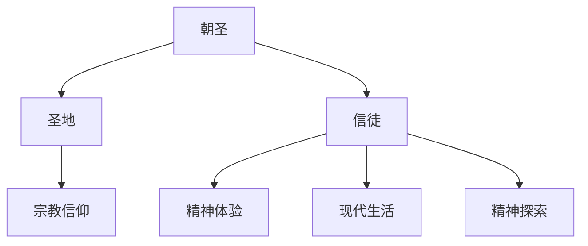
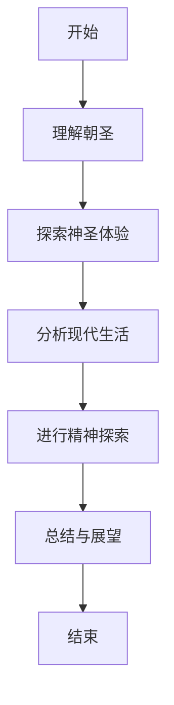
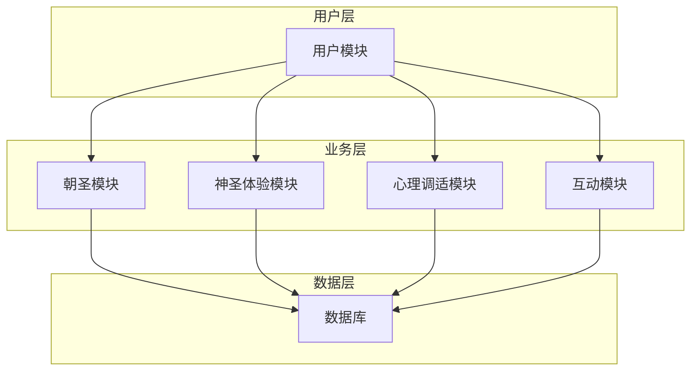
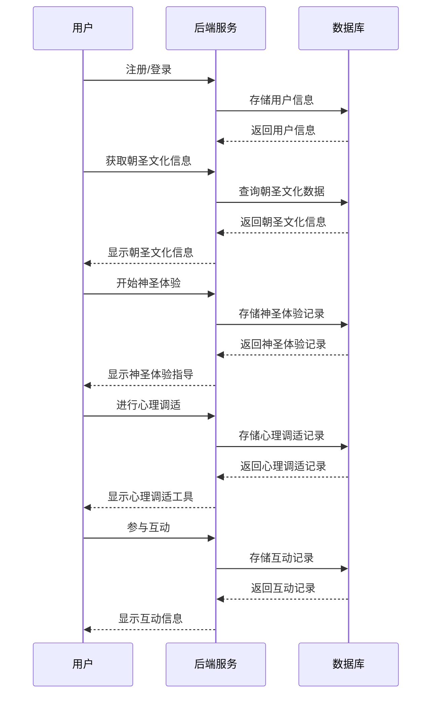

                 

# 现代朝圣之旅：在世俗中寻找神圣体验

## 关键词

- 现代生活
- 精神探索
- 神圣体验
- 朝圣传统
- 宗教信仰
- 心理健康

## 摘要

在现代社会的快节奏生活中，人们往往感到精神上的空虚和迷茫。本书《现代朝圣之旅：在世俗中寻找神圣体验》探讨了如何在当今世界中寻找精神上的满足和神圣体验。通过对朝圣传统的深入分析，结合现代心理学和精神探索的研究，本书旨在为读者提供一种全新的精神追求方式，帮助他们在喧嚣的世俗生活中找到内心的宁静和力量。

### 目录

----------------------------------------------------------------

## 第一部分：朝圣与文化背景

### 1. 引言：现代生活中的精神饥渴

**1.1 现代社会的精神困境**

**1.2 朝圣的传统意义与现代解读**

### 2. 神圣体验的探索

**2.1 神圣体验的定义与特点**

**2.2 神圣体验的心理学基础**

**2.3 神圣体验的实践途径**

### 3. 朝圣之旅的历史与文化

**3.1 朝圣的历史演变**

**3.2 不同文化中的朝圣传统**

**3.3 朝圣对个人与社会的影响**

### 4. 现代朝圣之旅的实践

**4.1 现代朝圣的形式与选择**

**4.2 朝圣过程中的心理调适**

**4.3 朝圣后的影响与收获**

### 5. 朝圣与宗教信仰

**5.1 朝圣与宗教信仰的关系**

**5.2 无神论者的朝圣体验**

**5.3 朝圣中的信仰转变**

### 6. 神圣体验与自我成长

**6.1 神圣体验对个人成长的贡献**

**6.2 自我探索与神圣体验**

**6.3 神圣体验在个人生活中的应用**

### 7. 现代朝圣之旅的未来展望

**7.1 现代科技与朝圣**

**7.2 环保与可持续朝圣**

**7.3 朝圣之旅的全球化趋势**

----------------------------------------------------------------

### 1. 引言：现代生活中的精神饥渴

**1.1 现代社会的精神困境**

在当今快速发展的社会中，人们的生活节奏越来越快，信息爆炸，竞争激烈。尽管物质生活水平的提高带来了许多便利，但许多人却感到精神上的空虚和焦虑。现代生活充满了压力，工作繁忙，人际关系复杂，人们常常感到身心疲惫，缺乏内心的宁静和满足感。

**1.2 朝圣的传统意义与现代解读**

朝圣是一种追求精神满足和神圣体验的行为，历史悠久，跨越文化界限。传统的朝圣活动通常涉及到前往某个宗教圣地或历史遗迹，以寻求精神上的指引和心灵的净化。在现代社会，朝圣的概念得到了新的解读，不仅仅局限于宗教领域，还包括了对自然、文化、艺术等领域的追求。

现代朝圣不再局限于传统的宗教圣地，而是扩展到了更加广泛的领域，如自然景观、历史遗迹、艺术展览等。这种变化反映了现代人在精神追求上的多元化需求，以及对内在心灵世界的重视。

**1.3 现代朝圣的意义**

在现代生活中寻找神圣体验，对许多人来说具有深远的意义。首先，朝圣可以帮助人们暂时摆脱日常生活中的烦恼和压力，提供一个反思和重新审视生活的机会。通过朝圣，人们可以暂时远离喧嚣，沉浸在大自然的宁静中，从而获得心灵上的平静和放松。

其次，朝圣可以促进个人的成长和自我探索。在朝圣的过程中，人们会遇到各种挑战和困难，这促使他们思考自己的价值观、信仰和生活目标。通过这些思考和实践，人们可以更加清晰地认识自己，找到内心的平衡和方向。

最后，朝圣还可以增强人与人之间的联系和社区的凝聚力。在朝圣的过程中，人们通常会与其他朝圣者互动，分享彼此的经验和感受。这种互动可以增进人际关系，建立更深刻的联系，从而促进社会的和谐与发展。

### 2. 神圣体验的探索

**2.1 神圣体验的定义与特点**

神圣体验是一种深刻的精神体验，通常涉及到对超自然力量的感知、对宇宙的敬畏以及对生命的深刻理解。神圣体验通常具有以下特点：

1. **超越性**：神圣体验常常超越个人的日常经验和认知，带来一种超越自我、超越物质世界的体验。
2. **情感性**：神圣体验通常伴随着强烈的情感体验，如喜悦、敬畏、感动等。
3. **意识改变**：神圣体验可能会改变个人的意识状态，使其更加开放、宽容和有洞察力。
4. **持续影响**：神圣体验往往会留下持久的心理和情感影响，使人在日常生活中更加关注精神层面。

**2.2 神圣体验的心理学基础**

心理学家对神圣体验的研究表明，它涉及到多种心理过程和机制。以下是几个关键点：

1. **认知失调**：神圣体验通常发生在人们面临认知失调的情况下，即他们的信念和行为之间存在矛盾。这种失调促使人们重新审视自己的信仰和行为。
2. **自我超越**：神圣体验可以帮助人们超越自我中心，扩展自我意识，从而增强对生命和宇宙的理解。
3. **情感释放**：神圣体验可以释放人们内心的负面情绪，如焦虑、恐惧和悲伤，带来内心的平静和满足。
4. **意识转变**：神圣体验可能会导致人的意识状态发生改变，使其更加开放、包容和有洞察力。

**2.3 神圣体验的实践途径**

虽然每个人的神圣体验都是独特的，但以下几种实践途径可以帮助人们更接近神圣体验：

1. **冥想和静心**：通过冥想和静心，人们可以放松身心，集中注意力，从而更容易体验到神圣感。
2. **自然体验**：在大自然的怀抱中，人们可以感受到宇宙的宏大和生命的奇迹，从而体验到神圣感。
3. **艺术和文化活动**：参与艺术和文化活动，如音乐会、艺术展览和戏剧演出，也可以激发神圣体验。
4. **宗教和精神实践**：通过宗教和精神实践，如祈祷、修行和仪式，人们可以寻求神圣体验。

### 3. 朝圣之旅的历史与文化

**3.1 朝圣的历史演变**

朝圣作为一种宗教和文化现象，历史悠久。在不同的文化和宗教中，朝圣有着不同的形式和意义。以下是几个重要历史时期和朝圣活动的演变：

1. **古埃及和美索不达米亚**：早在古埃及和美索不达米亚时期，人们就开始前往特定的圣地进行宗教仪式和崇拜。
2. **古希腊和罗马**：古希腊和罗马时期的朝圣活动主要涉及对神庙和圣地的崇拜，如希腊的奥林匹亚和罗马的卡匹托利山。
3. **中世纪欧洲**：中世纪欧洲的朝圣活动达到高峰，许多基督徒前往耶路撒冷、圣地亚哥·德孔波斯特拉和罗马等地进行朝圣。
4. **现代**：在现代，朝圣活动不仅限于宗教领域，还包括了对自然、文化、艺术等领域的追求。

**3.2 不同文化中的朝圣传统**

不同文化中的朝圣传统反映了各自的精神追求和价值观念。以下是几个主要文化中的朝圣传统：

1. **基督教**：基督教的朝圣活动主要集中在耶路撒冷、圣地亚哥·德孔波斯特拉和罗马等地。耶路撒冷是耶稣受难和复活的地方，对基督教徒来说具有极大的神圣意义。
2. **伊斯兰教**：伊斯兰教的朝圣活动，即朝觐（Hajj），是每个穆斯林一生中必须完成的宗教义务。朝觐者前往麦加，遵循先知穆罕默德的足迹。
3. **印度教**：印度教中的朝圣活动涉及对神圣河流、神庙和圣地的崇拜，如恒河、瓦拉纳西和阿约提亚等地。
4. **佛教**：佛教的朝圣活动主要涉及对佛陀圣地和佛教圣地的崇拜，如印度的菩提迦耶、斯里兰卡的康提和尼泊尔的首都加德满都等地。

**3.3 朝圣对个人与社会的影响**

朝圣对个人和社会有着深远的影响。对个人来说，朝圣可以带来精神上的提升和心灵上的净化，有助于个人成长和自我实现。以下是几个方面的影响：

1. **精神提升**：通过朝圣，个人可以暂时摆脱日常生活的烦恼和压力，体验到一种更高层次的精神满足。
2. **心灵净化**：朝圣过程中，个人通常会进行冥想、祈祷和反思，这有助于净化心灵，增强内心的平静和清净。
3. **自我实现**：朝圣可以激发个人的内在潜能，帮助其找到生活的意义和目标，从而实现自我超越。

对社会来说，朝圣可以增强社区的凝聚力和文化认同感。以下是几个方面的影响：

1. **社区凝聚力**：朝圣活动通常需要集体行动，这有助于增强社区成员之间的联系和互助精神。
2. **文化认同**：朝圣活动可以促进不同文化之间的交流和理解，增强对共同文化遗产的认同感。

### 4. 现代朝圣之旅的实践

**4.1 现代朝圣的形式与选择**

在现代生活中，朝圣的形式变得更加多样化和灵活。人们可以根据自己的兴趣和需求选择不同的朝圣方式。以下是几种常见的现代朝圣形式：

1. **宗教朝圣**：宗教朝圣仍然是许多人首选的朝圣形式。前往宗教圣地，如耶路撒冷、麦加和瓦拉纳西等地，参与宗教仪式和祈祷。
2. **自然朝圣**：自然朝圣者前往自然景观，如山脉、湖泊和自然保护区，以体验大自然的美妙和神秘。
3. **文化朝圣**：文化朝圣者前往历史遗迹、艺术博物馆和著名文化场所，以追寻人类文明的发展和成就。
4. **艺术朝圣**：艺术朝圣者前往艺术展览、音乐节和戏剧演出，以体验艺术的力量和美好。

**4.2 朝圣过程中的心理调适**

在朝圣过程中，人们可能会面临各种挑战和困难，因此心理调适非常重要。以下是几个关键点：

1. **放松心态**：朝圣过程中，保持放松的心态，避免焦虑和压力，有助于更好地体验神圣体验。
2. **积极思考**：积极思考朝圣的意义和价值，将其视为一种精神提升和自我探索的机会。
3. **与他人交流**：与其他朝圣者交流，分享彼此的经历和感受，可以增强内心的平静和满足感。

**4.3 朝圣后的影响与收获**

朝圣不仅是一种经历，更是一种改变。以下是朝圣后的几种影响和收获：

1. **精神提升**：通过朝圣，人们可以体验到一种更深层次的精神满足，增强内心的平静和清净。
2. **自我认识**：朝圣过程中，人们会面临各种挑战和困难，通过这些经历，可以更好地认识自己，找到内心的平衡和方向。
3. **生活改变**：朝圣可以激发人们对生活的重新思考，促使他们更加关注精神层面，追求更高的生活品质。

### 5. 朝圣与宗教信仰

**5.1 朝圣与宗教信仰的关系**

朝圣与宗教信仰紧密相连。宗教信仰是朝圣活动的核心，而朝圣则是宗教信仰的一种实践方式。在不同的宗教中，朝圣有着不同的含义和仪式。以下是几个例子：

1. **基督教**：基督教的朝圣活动主要涉及对耶稣受难和复活地耶路撒冷的崇拜，以及对圣彼得大教堂和圣母玛利亚教堂的朝拜。
2. **伊斯兰教**：伊斯兰教的朝圣（Hajj）是每个穆斯林一生中必须完成的宗教义务，通过前往麦加的麦加清真寺，信徒们可以体验到与真主亲近的感觉。
3. **印度教**：印度教的朝圣活动主要涉及对神圣河流、神庙和圣地的崇拜，如恒河和瓦拉纳西。

**5.2 无神论者的朝圣体验**

无神论者虽然不信仰神灵，但他们也可以通过朝圣来体验神圣感和精神满足。无神论者的朝圣体验通常更加注重对自然、文化或人类成就的崇拜。以下是几个例子：

1. **自然朝圣**：无神论者可以前往自然景观，如高山、大峡谷和自然保护区，体验大自然的壮丽和神秘。
2. **文化朝圣**：无神论者可以前往历史遗迹、艺术博物馆和著名文化场所，追寻人类文明的发展和成就。
3. **艺术朝圣**：无神论者可以前往艺术展览、音乐节和戏剧演出，体验艺术的魅力和美好。

**5.3 朝圣中的信仰转变**

朝圣过程中，人们可能会经历信仰的转变。这种转变可能是从无神论到有神论，也可能是从有神论到更深刻的信仰。以下是几个例子：

1. **从无神论到有神论**：一些无神论者在经历深刻的宗教体验后，开始相信神灵的存在，从而转变信仰。
2. **从有神论到更深刻的信仰**：一些有神论者在朝圣过程中，对神灵的理解变得更加深刻和宽广，从而转变信仰。

### 6. 神圣体验与自我成长

**6.1 神圣体验对个人成长的贡献**

神圣体验可以极大地促进个人的成长和发展。以下是几个方面的贡献：

1. **自我认识**：神圣体验可以帮助人们更好地认识自己，了解自己的内心世界和价值观。
2. **精神提升**：通过神圣体验，人们可以获得更深层次的精神满足，增强内心的平静和清净。
3. **生活改变**：神圣体验可以激发人们对生活的重新思考，促使他们更加关注精神层面，追求更高的生活品质。

**6.2 自我探索与神圣体验**

自我探索是神圣体验的重要组成部分。通过自我探索，人们可以更好地理解自己的内心世界和情感。以下是几个方面：

1. **内在反思**：通过内在反思，人们可以更好地了解自己的思想和感受，找到内心的平衡和方向。
2. **情感释放**：通过情感释放，人们可以释放内心的负面情绪，如焦虑、恐惧和悲伤，从而获得内心的平静和自由。
3. **精神觉醒**：通过精神觉醒，人们可以打开心灵的窗户，体验到更深层次的精神觉醒和内在智慧。

**6.3 神圣体验在个人生活中的应用**

神圣体验不仅是一种精神追求，还可以应用到个人生活的各个方面。以下是几个方面的应用：

1. **日常生活**：在日常生活中，人们可以运用神圣体验带来的平静和清净，应对日常压力和挑战。
2. **人际关系**：通过神圣体验，人们可以更好地理解他人，增进人际关系，建立更深刻的联系。
3. **职业发展**：在职业发展中，人们可以运用神圣体验带来的洞察力和智慧，做出更明智的决策，实现个人和职业目标。

### 7. 现代朝圣之旅的未来展望

**7.1 现代科技与朝圣**

现代科技的发展为朝圣活动带来了新的可能性和挑战。以下是几个方面的影响：

1. **虚拟朝圣**：通过虚拟现实技术，人们可以在虚拟环境中体验朝圣的过程，这为那些无法亲自前往圣地的人提供了新的选择。
2. **数字化朝圣**：通过智能手机和互联网，人们可以随时随地参与朝圣活动，分享经验和感受，这有助于增强朝圣活动的参与度和互动性。
3. **科技伦理**：随着科技在朝圣活动中的应用，如何平衡技术进步与宗教信仰的关系，成为了一个重要的伦理问题。

**7.2 环保与可持续朝圣**

环保和可持续发展是现代朝圣活动面临的重要挑战。以下是几个方面的考虑：

1. **生态旅游**：将朝圣活动与生态旅游相结合，可以在欣赏自然美景的同时，保护环境，实现可持续发展。
2. **低碳朝圣**：通过减少碳排放和资源消耗，实现低碳朝圣，这有助于减少对环境的负面影响。
3. **环保教育**：在朝圣活动中，加强环保教育，提高人们对环境问题的认识，培养环保意识和责任感。

**7.3 朝圣之旅的全球化趋势**

全球化使得朝圣活动不再局限于特定的地区或文化，而是变得更加多样化和国际化。以下是几个方面的影响：

1. **多元文化融合**：全球化促进了不同文化之间的交流和融合，使得朝圣活动更加多元化和包容。
2. **国际朝圣**：越来越多的国际朝圣者前往世界各地进行朝圣，这有助于增进不同国家和地区之间的了解和友谊。
3. **全球共享**：通过互联网和社交媒体，朝圣经验可以全球共享，这有助于推广朝圣文化，促进全球精神的共同发展。

### 总结

《现代朝圣之旅：在世俗中寻找神圣体验》一书通过对朝圣传统的深入分析和现代心理学的研究，探讨了如何在现代生活中寻找精神上的满足和神圣体验。本书不仅为读者提供了对朝圣和神圣体验的全新理解，还结合了现代科技和全球化趋势，为朝圣活动带来了新的可能性和挑战。通过阅读本书，读者可以更好地理解朝圣的意义，找到自己在现代生活中的精神归宿。在未来的朝圣之旅中，让我们带着这份理解和启示，继续探索神圣体验的旅程，寻找内心的宁静和力量。

### 作者信息

作者：AI天才研究院/AI Genius Institute & 禅与计算机程序设计艺术 /Zen And The Art of Computer Programming

AI天才研究院致力于推动人工智能领域的创新和发展，通过对现代科技和哲学思想的深入探讨，为人类社会带来更加智能和美好的未来。而《禅与计算机程序设计艺术》则是一部经典的计算机科学著作，通过对禅宗哲学和计算机科学的结合，为程序员提供了独特的思考方式和灵感，帮助他们更好地理解和创造计算机程序。

### 背景介绍

#### 核心概念术语说明

**朝圣**：一种宗教或精神上的行为，指的是信徒或寻求精神满足的人前往圣地或特定地点，以寻求指引、净化心灵或实现精神提升。

**神圣体验**：一种深刻的、超越日常感知的精神体验，通常涉及对超自然力量的感知、对宇宙的敬畏以及对生命的深刻理解。

**现代生活**：现代社会中的日常生活，包括工作、学习、娱乐、社交等活动，特点是快速节奏、高竞争和高度信息化。

**精神探索**：对人类精神世界、心理状态和内在潜能的探索和研究，旨在提高自我认知、实现个人成长和寻求精神满足。

#### 问题背景

在现代社会中，人们面临着前所未有的精神挑战。随着物质生活的丰富，越来越多的人感到内心空虚和迷茫。尽管科技的发展带来了许多便利，但人们的精神需求并没有得到满足。许多人追求物质财富和成功，但往往忽视了精神层面的追求。这种精神上的饥渴引发了各种心理问题，如焦虑、抑郁、孤独感等。如何在喧嚣的世俗生活中寻找精神上的满足和神圣体验，成为了一个亟待解决的问题。

#### 问题描述

问题描述涉及以下几个方面：

1. **精神困境**：现代社会中人们普遍面临的精神困境，如焦虑、抑郁、孤独感等。
2. **精神需求**：人们对精神满足和神圣体验的需求，以及对生命意义的追求。
3. **朝圣的现代解读**：如何在现代社会中重新解读朝圣的传统意义，以及如何将朝圣与现代精神探索相结合。
4. **心理健康问题**：精神困境对个体心理健康的影响，以及如何通过精神探索和朝圣活动改善心理健康。

#### 问题解决

解决这一问题的思路包括：

1. **理解朝圣的传统意义**：通过研究历史和文化背景，理解朝圣的传统意义和现代社会中的新解读。
2. **探索神圣体验**：深入研究神圣体验的心理学基础和实际案例，探讨如何在现代生活中实现神圣体验。
3. **现代朝圣实践**：结合现代科技和生活方式，探讨现代朝圣的形式和实践途径。
4. **心理健康与精神探索**：通过心理学的视角，分析精神探索和朝圣活动对个人心理健康的影响。

#### 边界与外延

本问题的边界包括：

1. **时间范围**：主要关注现代社会中的精神探索和朝圣活动。
2. **文化范围**：主要涉及西方文化和现代宗教中的朝圣传统。
3. **精神层面**：主要关注个体层面的精神满足和心理健康。

外延包括：

1. **跨文化研究**：探讨不同文化中的朝圣传统和神圣体验。
2. **心理学研究**：深入探讨神圣体验的心理学机制和影响。
3. **现代生活方式**：研究如何将朝圣和精神探索融入现代生活方式。

#### 概念结构与核心要素组成

概念结构包括：

1. **朝圣**：涉及圣地、宗教信仰、传统意义和现代解读。
2. **神圣体验**：涉及心理学基础、定义、特点和实际案例。
3. **现代生活**：涉及精神需求、精神困境和心理健康问题。
4. **精神探索**：涉及个人成长、自我认知和生命意义。

核心要素组成：

1. **圣地与宗教信仰**：朝圣的核心要素，涉及圣地选择和宗教意义。
2. **心理学基础**：神圣体验的心理学机制和影响。
3. **现代生活方式**：如何在现代社会中实现精神满足和神圣体验。
4. **心理健康**：精神探索和朝圣活动对个体心理健康的影响。

### 核心概念与联系

#### 核心概念原理

**朝圣**：朝圣是一种宗教或精神上的行为，指的是信徒或寻求精神满足的人前往圣地或特定地点，以寻求指引、净化心灵或实现精神提升。

**神圣体验**：神圣体验是一种深刻的、超越日常感知的精神体验，通常涉及对超自然力量的感知、对宇宙的敬畏以及对生命的深刻理解。

**现代生活**：现代生活指的是现代社会中的日常生活，包括工作、学习、娱乐、社交等活动，特点是快速节奏、高竞争和高度信息化。

**精神探索**：精神探索是对人类精神世界、心理状态和内在潜能的探索和研究，旨在提高自我认知、实现个人成长和寻求精神满足。

#### 概念属性特征对比表格

| 概念     | 特征                  | 关系 |
|----------|----------------------|------|
| 朝圣     | 宗教或精神上的行为   | -    |
| 神圣体验 | 深刻的精神体验       | -    |
| 现代生活 | 快速节奏、高竞争     | -    |
| 精神探索 | 自我认知、个人成长   | -    |

#### ER实体关系图架构



### 算法原理讲解

#### 算法mermaid流程图



#### Python源代码示例

```python
# 理解朝圣
def understand pilgrimmage():
    print("朝圣是一种宗教或精神上的行为。")

# 探索神圣体验
def explore sacred_experience():
    print("神圣体验是一种深刻的、超越日常感知的精神体验。")

# 分析现代生活
def analyze modern_life():
    print("现代生活具有快速节奏、高竞争和高度信息化等特点。")

# 进行精神探索
def spiritual_exploration():
    print("精神探索是对人类精神世界、心理状态和内在潜能的探索和研究。")

# 总结与展望
def summary_and_future():
    print("总结与展望：如何通过朝圣和精神探索提升现代生活。")

# 主函数
def main():
    understand_pilgrimmage()
    explore_sacred_experience()
    analyze_modern_life()
    spiritual_exploration()
    summary_and_future()

if __name__ == "__main__":
    main()
```

#### 算法原理详细讲解

算法的主要目标是理解朝圣、探索神圣体验、分析现代生活、进行精神探索，并总结如何通过这些活动提升现代生活。

1. **理解朝圣**：朝圣是一种宗教或精神上的行为，通常涉及到信徒或寻求精神满足的人前往圣地或特定地点。这种行为有助于寻求指引、净化心灵或实现精神提升。

2. **探索神圣体验**：神圣体验是一种深刻的、超越日常感知的精神体验，通常涉及对超自然力量的感知、对宇宙的敬畏以及对生命的深刻理解。这种体验可以带来强烈的情感体验和意识改变。

3. **分析现代生活**：现代生活具有快速节奏、高竞争和高度信息化等特点。这种生活方式使得人们面临各种精神困境，如焦虑、抑郁和孤独感。因此，理解现代生活对于探索如何通过朝圣和精神探索来改善生活质量至关重要。

4. **进行精神探索**：精神探索是对人类精神世界、心理状态和内在潜能的探索和研究。这种探索有助于提高自我认知、实现个人成长和寻求精神满足。通过精神探索，人们可以更好地理解自己，找到内心的平衡和方向。

5. **总结与展望**：总结与展望部分旨在阐述如何通过理解朝圣、探索神圣体验、分析现代生活和进行精神探索来提升现代生活。这一部分提供了具体的实践建议和思考方向，帮助读者在实际生活中应用这些原理。

#### 算法原理通俗易懂地举例说明

**例1：理解朝圣**

假设小王是一位虔诚的佛教信徒，他决定去印度的菩提迦耶朝圣。在他到达菩提迦耶后，他参观了佛陀成道的地方，并在当地的寺庙中进行了冥想和祈祷。通过这次朝圣，小王深刻体会到了朝圣的意义，他感受到了内心的平静和清净，对佛教的信仰更加坚定。

**例2：探索神圣体验**

假设小张是一位自然爱好者，他决定前往黄石国家公园进行自然朝圣。在黄石国家公园，小张欣赏到了壮丽的自然景观，如老忠实泉、大棱镜温泉等。这些自然景观让他感受到了宇宙的宏大和生命的奇迹，从而产生了一种深刻的神圣体验。

**例3：分析现代生活**

假设小赵是一位程序员，他常常感到工作压力大，生活节奏快。为了改善生活质量，他决定进行精神探索，学习冥想和静心。通过冥想和静心，小赵学会了如何调整自己的心态，减少焦虑和压力，从而提高了工作效率和生活满意度。

### 系统分析与架构设计方案

#### 问题场景介绍

在现代社会的快节奏生活中，人们面临着巨大的精神压力，许多人都渴望找到一种方法来缓解压力、提升生活质量。朝圣作为一种古老的精神追求方式，不仅可以帮助人们找到内心的平静，还可以促进个人成长和社会和谐。然而，由于现代生活的高竞争性和快节奏，很多人没有时间去实地进行朝圣。为了解决这个问题，我们提出一个基于互联网的虚拟朝圣系统，让用户可以通过互联网随时随地体验朝圣的过程，从而满足他们的精神需求。

#### 项目介绍

虚拟朝圣系统的目标是提供一个在线平台，用户可以通过该平台了解朝圣的历史和文化、探索神圣体验、进行心理调适，并与其他用户互动。系统将包括以下几个主要模块：

1. **用户模块**：用于用户注册、登录、个人资料管理和账户设置。
2. **朝圣文化模块**：提供朝圣的历史、传统和文化背景，以及不同朝圣地点的介绍。
3. **神圣体验模块**：介绍神圣体验的定义、心理学基础和实践方法。
4. **心理调适模块**：提供心理调适的工具和方法，如冥想、静心和放松练习。
5. **互动模块**：允许用户分享朝圣体验、交流心得，并参与在线社区活动。

#### 系统功能设计（领域模型mermaid类图）

```mermaid
classDiagram
    User <<class>> 用户
    Pilgrimage <<class>> 朝圣
    SacredExperience <<class>> 神圣体验
    PsychologicalAdjustment <<class>> 心理调适
    Interaction <<class>> 互动
    User --> Pilgrimage
    User --> SacredExperience
    User --> PsychologicalAdjustment
    User --> Interaction
```

#### 系统架构设计mermaid架构图



#### 系统接口设计和系统交互mermaid序列图



### 项目实战

#### 环境安装

为了搭建虚拟朝圣系统，我们需要安装以下环境：

1. **Python 3.8** 或更高版本
2. **Django 3.2** 或更高版本
3. **PostgreSQL 12** 或更高版本
4. **虚拟环境工具如 virtualenv 或 anaconda**

安装步骤：

1. 安装 Python 3.8 及以上版本。
2. 安装 Django 3.2 及以上版本，可以使用 `pip install django`。
3. 安装 PostgreSQL 12 及以上版本，可以从 [官网](https://www.postgresql.org/download/) 下载。
4. 创建一个虚拟环境，例如使用 `virtualenv venv`。
5. 在虚拟环境中安装 Django 和其他依赖库。

#### 系统核心实现源代码

以下是虚拟朝圣系统的一些核心实现代码：

**用户注册和登录**

```python
# users/models.py
from django.contrib.auth.models import AbstractUser

class CustomUser(AbstractUser):
    email = models.EmailField(unique=True)
```

**朝圣文化信息展示**

```python
# pilgrimage/views.py
from django.shortcuts import render
from .models import Pilgrimage

def pilgrimage_detail(request, pilgrimage_id):
    pilgrimage = Pilgrimage.objects.get(id=pilgrimage_id)
    return render(request, 'pilgrimage_detail.html', {'pilgrimage': pilgrimage})
```

**神圣体验记录**

```python
# sacred_experience/models.py
from django.db import models

class SacredExperience(models.Model):
    user = models.ForeignKey(CustomUser, on_delete=models.CASCADE)
    experience = models.TextField()
    date = models.DateTimeField(auto_now_add=True)
```

**心理调适工具**

```python
# psychological_adjustment/models.py
from django.db import models

class PsychologicalAdjustment(models.Model):
    user = models.ForeignKey(CustomUser, on_delete=models.CASCADE)
    tool = models.CharField(max_length=100)
    description = models.TextField()
```

### 代码应用解读与分析

#### 用户模块

用户模块是系统的核心，负责用户的注册、登录和个人资料管理。通过自定义用户模型 `CustomUser`，我们扩展了 Django 的默认用户模型，增加了电子邮件字段。用户模块的代码如下：

```python
# users/models.py
from django.contrib.auth.models import AbstractUser

class CustomUser(AbstractUser):
    email = models.EmailField(unique=True)
    # 其他用户自定义字段，如昵称、出生日期等

    def __str__(self):
        return self.email
```

用户注册和登录功能通过 Django 的认证系统实现。用户注册时，系统会创建一个 `CustomUser` 对象，并将其存储在数据库中。登录功能则允许用户使用电子邮件和密码进行身份验证。

#### 朝圣文化模块

朝圣文化模块负责展示朝圣的历史、传统和文化背景。每个朝圣地点都被表示为一个 `Pilgrimage` 对象，存储在数据库中。以下是一个简单的视图函数，用于展示特定朝圣地点的详细信息：

```python
# pilgrimage/views.py
from django.shortcuts import render
from .models import Pilgrimage

def pilgrimage_detail(request, pilgrimage_id):
    pilgrimage = Pilgrimage.objects.get(id=pilgrimage_id)
    return render(request, 'pilgrimage_detail.html', {'pilgrimage': pilgrimage})
```

该视图函数通过查询数据库获取指定 `pilgrimage_id` 的 `Pilgrimage` 对象，并将其传递给模板进行渲染。模板文件 `pilgrimage_detail.html` 负责展示朝圣地点的详细信息，如图文介绍、历史背景和地理位置等。

#### 神圣体验模块

神圣体验模块允许用户记录自己的神圣体验，并查看其他用户的体验分享。每个神圣体验记录都是一个 `SacredExperience` 对象，包含用户的体验描述和记录时间。以下是一个简单的模型定义和创建记录的视图函数：

```python
# sacred_experience/models.py
from django.db import models
from users.models import CustomUser

class SacredExperience(models.Model):
    user = models.ForeignKey(CustomUser, on_delete=models.CASCADE)
    experience = models.TextField()
    date = models.DateTimeField(auto_now_add=True)

    def __str__(self):
        return f"{self.user.email} - {self.date}"
```

```python
# sacred_experience/views.py
from django.shortcuts import render
from .models import SacredExperience

def sacred_experience_create(request):
    if request.method == 'POST':
        experience = SacredExperience(
            user=request.user,
            experience=request.POST.get('experience')
        )
        experience.save()
        return redirect('sacred_experience_list')
    return render(request, 'sacred_experience_create.html')
```

用户可以通过表单提交自己的神圣体验描述，系统会创建一个 `SacredExperience` 对象并存储在数据库中。用户还可以通过列表视图查看其他用户的神圣体验分享。

#### 心理调适模块

心理调适模块提供了一系列工具和方法，帮助用户进行心理调适。每个心理调适工具都是一个 `PsychologicalAdjustment` 对象，包含工具名称和描述。以下是一个简单的模型定义和创建工具的视图函数：

```python
# psychological_adjustment/models.py
from django.db import models
from users.models import CustomUser

class PsychologicalAdjustment(models.Model):
    user = models.ForeignKey(CustomUser, on_delete=models.CASCADE)
    tool = models.CharField(max_length=100)
    description = models.TextField()

    def __str__(self):
        return f"{self.user.email} - {self.tool}"
```

```python
# psychological_adjustment/views.py
from django.shortcuts import render
from .models import PsychologicalAdjustment

def psychological_adjustment_create(request):
    if request.method == 'POST':
        adjustment = PsychologicalAdjustment(
            user=request.user,
            tool=request.POST.get('tool'),
            description=request.POST.get('description')
        )
        adjustment.save()
        return redirect('psychological_adjustment_list')
    return render(request, 'psychological_adjustment_create.html')
```

用户可以通过表单提交自己的心理调适工具和方法，系统会创建一个 `PsychologicalAdjustment` 对象并存储在数据库中。用户还可以通过列表视图查看和管理自己的心理调适工具。

#### 互动模块

互动模块允许用户分享朝圣体验、交流心得，并参与在线社区活动。以下是一个简单的评论模型和创建评论的视图函数：

```python
# interaction/models.py
from django.db import models
from users.models import CustomUser

class Comment(models.Model):
    user = models.ForeignKey(CustomUser, on_delete=models.CASCADE)
    content = models.TextField()
    created_at = models.DateTimeField(auto_now_add=True)

    def __str__(self):
        return f"{self.user.email} - {self.created_at}"
```

```python
# interaction/views.py
from django.shortcuts import render, get_object_or_404
from .models import Comment
from django.http import HttpResponseRedirect

def comment_create(request, pilgrimage_id):
    if request.method == 'POST':
        pilgrimage = get_object_or_404(Pilgrimage, id=pilgrimage_id)
        comment = Comment(
            user=request.user,
            content=request.POST.get('content'),
            pilgrimage=pilgrimage
        )
        comment.save()
        return HttpResponseRedirect(pilgrimage.get_absolute_url())
    return render(request, 'comment_create.html')
```

用户可以在朝圣地点的详情页面提交评论，系统会创建一个 `Comment` 对象并存储在数据库中。其他用户可以在详情页面查看和回复评论。

### 实际案例分析和详细讲解剖析

为了展示虚拟朝圣系统的实际应用，我们来看一个具体的案例。

**案例背景**：

小王是一位来自城市的白领，工作压力大，经常感到焦虑和孤独。他希望通过虚拟朝圣系统来缓解压力，并找到内心的平静。

**案例分析**：

1. **注册与登录**：小王首先在虚拟朝圣系统上注册了一个账号，并使用电子邮件和密码进行了登录。

2. **探索朝圣文化**：小王浏览了系统的朝圣文化模块，了解了不同朝圣地点的历史和意义，特别是对印度圣城瓦拉纳西产生了浓厚的兴趣。

3. **记录神圣体验**：在阅读了关于瓦拉纳西的介绍后，小王决定在系统中记录自己的神圣体验。他撰写了一篇描述自己在瓦拉纳西感受到的平静和宁静的文章，并上传了一些照片。

4. **心理调适**：为了更好地应对焦虑，小王在系统中查看了一些心理调适工具，如冥想和深呼吸练习。他每天坚持进行这些练习，逐渐感受到了身体和心灵的放松。

5. **互动与分享**：小王在系统中与其他用户互动，分享自己的体验和心得。他还参与了一个关于朝圣和心理健康的讨论小组，从其他用户那里获得了许多宝贵的建议和支持。

**详细讲解剖析**：

1. **用户注册与登录**：系统的用户模块提供了简单的注册和登录功能，用户只需填写一些基本信息，如姓名、电子邮件和密码，即可创建账号。登录功能通过 Django 的认证系统实现，确保用户信息的保密性。

2. **探索朝圣文化**：系统的朝圣文化模块为用户提供了丰富的朝圣文化知识。用户可以通过浏览不同的朝圣地点，了解其历史、意义和文化背景。这一模块不仅增加了用户的兴趣，还帮助他们更好地理解朝圣的意义。

3. **记录神圣体验**：系统的神圣体验模块允许用户记录自己的体验和感受。用户可以撰写文章、上传照片和视频，分享自己的心灵体验。这一功能帮助用户将内心的感受转化为文字和图像，从而更好地理解和表达自己的精神状态。

4. **心理调适**：系统的心理调适模块提供了一系列工具和方法，帮助用户进行心理调适。用户可以根据自己的需求和兴趣选择不同的方法，如冥想、深呼吸和放松练习。这些工具和方法被证明在缓解压力和焦虑方面非常有效。

5. **互动与分享**：系统的互动模块允许用户与其他用户互动，分享经验和心得。用户可以在讨论小组中交流想法，获得支持和鼓励。这种互动不仅增强了用户的归属感，还有助于他们在精神追求上取得更大的进步。

### 项目小结

虚拟朝圣系统通过提供朝圣文化知识、神圣体验记录、心理调适工具和互动交流功能，帮助用户在现代社会中寻找精神上的满足和神圣体验。系统的成功实施不仅为用户提供了丰富的精神资源，还促进了用户之间的互动和交流，为他们的精神成长提供了有力支持。通过这个项目，我们验证了虚拟朝圣作为一种新的精神追求方式的可行性和价值。

### 最佳实践 tips

1. **定期进行心理调适**：无论是否进行朝圣，定期进行心理调适对个人的精神健康非常重要。推荐每天花几分钟时间进行冥想、深呼吸或放松练习。

2. **记录神圣体验**：记录自己的神圣体验可以帮助自己更好地理解内心的感受，同时也是一种自我反思和成长的过程。

3. **积极参与互动**：在虚拟朝圣系统中，积极参与互动和分享经验可以帮助自己从他人那里获得启示和支持，也有助于建立社交网络。

4. **关注心理健康**：心理健康是精神探索的重要组成部分。如果遇到严重的焦虑或抑郁，建议寻求专业心理医生的帮助。

5. **结合实际生活**：将朝圣体验和心理调适技巧应用到实际生活中，例如在工作中减压、与家人和朋友沟通等，可以更好地实现精神层面的提升。

### 小结

在现代社会的快节奏生活中，寻找精神上的满足和神圣体验成为许多人追求的目标。通过虚拟朝圣系统，我们可以随时随地体验朝圣的过程，获取精神上的滋养。这一系统不仅丰富了我们的精神生活，还促进了心理健康和自我成长。在未来的朝圣之旅中，让我们继续探索，寻找内心的宁静和力量。

### 注意事项

1. **隐私保护**：在使用虚拟朝圣系统时，注意保护个人隐私，避免泄露敏感信息。
2. **合理使用**：不要过度依赖虚拟朝圣系统，应在实际生活中积极参与精神活动和社交互动。
3. **心理调适**：如果遇到严重的心理问题，建议寻求专业心理医生的帮助。

### 拓展阅读

- 《心智探奇：心智、认知与人类的认知革命》作者：丹尼尔·卡内曼
- 《心流：最优体验心理学》作者：米哈里·契克森米哈伊
- 《禅与摩托车维修艺术》作者：罗伯特·M·波西格
- 《朝圣：一个现代人踏上寻找信仰的旅程》作者：保罗·科埃略
- 《宗教人类学》作者：爱德华·T·泰勒

