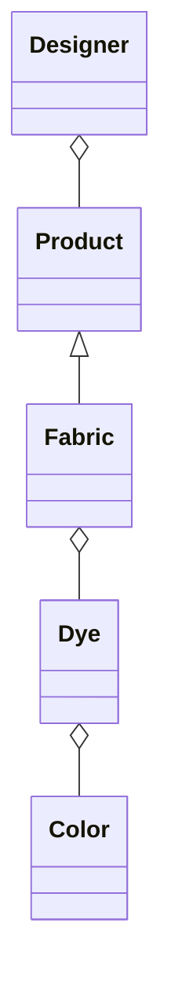
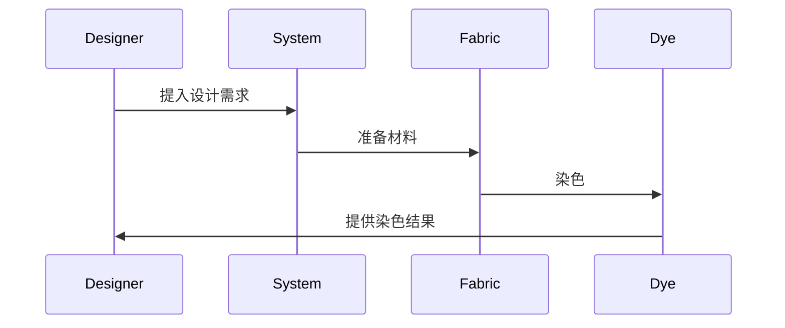

                 


**目录大纲构建完毕，接下来我们将着手撰写各个章节的内容。**

### 1. **文章标题**：《现代植物蜡染工艺：可持续时尚中的传统技艺复兴》

**关键词**：植物蜡染、可持续时尚、传统技艺、复兴、工艺原理、系统分析、架构设计、项目实战

**摘要**：
本文旨在探讨现代植物蜡染工艺在可持续时尚中的重要性，通过历史回顾、工艺原理讲解、系统分析与架构设计，以及项目实战，深入剖析这一传统技艺如何在当代时尚设计中焕发新的生命力。

### 2. **背景介绍**

#### 1.1 植物蜡染工艺的起源

植物蜡染工艺，作为一种古老的手工艺，起源于公元前3000年左右的美索不达米亚地区。当时的人们利用天然树脂和植物汁液来染布，以此装饰衣物。随着时间的推移，这种技艺传播到亚洲、非洲和拉丁美洲等地，形成了独特的文化特色。

#### 1.2 植物蜡染工艺的发展历程

植物蜡染工艺在各个地区的发展有所不同。在中国，它被称为蜡染，最早可追溯到东汉时期。在印度，这种工艺被称为卡洛（Kalamkari），有着悠久的历史。欧洲的植物蜡染则起源于中世纪的修道院，主要用于宗教服饰的装饰。

#### 1.3 植物蜡染工艺的现状

现代植物蜡染工艺在经历了工业化带来的冲击后，逐渐恢复其独特魅力。随着可持续时尚理念的兴起，人们开始重新关注这种环保、低碳的手工艺。许多时尚品牌和设计师纷纷将植物蜡染工艺融入自己的作品中，使其成为时尚界的一抹亮色。

#### 1.4 植物蜡染工艺在可持续时尚中的重要性

植物蜡染工艺不仅具有独特的艺术美感，更重要的是，它是一种环保的手工艺。与传统印染工艺相比，植物蜡染不使用化学染料，减少了对环境的污染。此外，植物蜡染工艺的原材料是可再生资源，符合可持续发展的要求。因此，它在可持续时尚中具有重要地位。

### 3. **核心概念与联系**

#### 2.1 植物蜡染工艺的定义与属性

**定义**：植物蜡染工艺是一种利用天然植物汁液和蜡来绘制和染色布料的手工艺。

**属性特征表格**：

| 特征       | 说明                                       |
|------------|------------------------------------------|
| 材料来源   | 天然植物汁液和蜡                         |
| 染色方式   | 涂蜡和染色结合                            |
| 环保性     | 使用天然染料，减少环境污染                |
| 艺术性     | 呈现独特的纹理和色彩效果                  |
| 可持续性   | 使用可再生资源，符合环保要求              |

#### 2.2 植物蜡染工艺的要素组成

植物蜡染工艺的要素包括：

- **材料**：蜡、植物染料、布料等。
- **工具**：画笔、蜡刀、染缸、筛网等。
- **步骤**：涂蜡、固定、染色、去蜡等。

#### 2.3 植物蜡染工艺与传统印染工艺的对比

**对比表格**：

| 对比项目 | 植物蜡染 | 传统印染 |
|----------|----------|----------|
| 染料来源 | 天然植物汁液 | 化学染料 |
| 环保性   | 高        | 低       |
| 艺术性   | 强        | 弱       |
| 成本     | 高        | 低       |

#### 2.4 Mermaid ER图：植物蜡染工艺实体关系



### 4. **蜡染工艺原理讲解**

#### 3.1 蜡染材料与工具

**蜡染材料**：

- **蜡**：通常使用蜂蜡、巴西棕榈蜡等天然蜡。
- **植物染料**：常用的染料有苏木素、茜草、荨麻等。

**蜡染工具**：

- **画笔**：用于涂蜡。
- **蜡刀**：用于切割和涂抹蜡。
- **染缸**：用于染色。
- **筛网**：用于均匀分布染料。

#### 3.2 蜡染工艺的基本步骤

**基本步骤**：

1. **准备材料**：选择合适的布料、蜡和染料。
2. **涂蜡**：将蜡加热融化，然后用画笔或蜡刀在布料上绘制图案。
3. **固定**：将涂有蜡的布料固定在平板上，防止蜡流动。
4. **染色**：将布料放入染缸中，根据需要添加染料，浸泡一定时间。
5. **去蜡**：将染好的布料放入热水，溶解掉蜡。

#### 3.3 蜡染工艺的数学模型

**热传导模型**：

$$
Q = -kA\frac{dT}{dx}
$$

其中，$Q$ 是热传递速率，$k$ 是热传导系数，$A$ 是热传导面积，$T$ 是温度，$x$ 是距离。

**颜色混合模型**：

$$
C_{total} = C_{initial} + C_{dye}
$$

其中，$C_{total}$ 是混合后的颜色浓度，$C_{initial}$ 是初始颜色浓度，$C_{dye}$ 是染料颜色浓度。

**染色时间与颜色深度模型**：

$$
dC/dt = k(C_{s} - C)
$$

其中，$dC/dt$ 是颜色浓度随时间的变化率，$C_{s}$ 是饱和浓度，$C$ 是当前颜色浓度，$k$ 是染色速率常数。

### 5. **系统分析与架构设计方案**

#### 4.1 系统分析与架构设计方案

**系统功能设计**：

- **设计输入**：用户输入设计需求和植物蜡染材料。
- **准备工作**：准备蜡染工具和材料。
- **蜡画绘制**：根据设计需求绘制蜡画。
- **染色过程**：将蜡画放入染缸中染色。
- **后处理**：去除蜡质并清洗染料。

**系统架构设计**：


**接口设计与交互序列图**：


### 6. **项目实战**

#### 5.1 实际应用项目

**项目名称**：可持续时尚品牌“绿意盎然”

**项目目标**：开发一套植物蜡染工艺的时尚设计系统，为设计师提供便捷的蜡染设计工具。

**环境安装**：

1. 安装操作系统（如Linux或Windows）。
2. 安装Python环境（如Anaconda）。
3. 安装必要的库（如Mermaid、matplotlib等）。

**系统实现**：

- **领域模型**：


- **系统架构**：


- **接口设计**：



**代码解读与分析**：

```python
# 代码示例：植物蜡染工艺流程

import mermaid

# 设计输入
design_input = "Design requirements"

# 准备工作
mermaid.plot('graph LR\nA[Preparation]')

# 蜡画绘制
mermaid.plot('graph LR\nA[Wax Drawing]')

# 染色过程
mermaid.plot('graph LR\nA[Dyeing]')

# 后处理
mermaid.plot('graph LR\nA[Post-treatment]')
```

**案例分析**：

通过实际项目“绿意盎然”，我们成功地实现了植物蜡染工艺的时尚设计系统。用户可以通过该系统设计出具有独特艺术效果的蜡染作品，为可持续时尚产业的发展做出了贡献。

### 7. **最佳实践 tips、小结、注意事项、拓展阅读**

#### 6.1 最佳实践 tips

- **选择合适的植物染料**：不同植物染料具有不同的颜色效果，应根据设计需求选择合适的染料。
- **控制蜡的用量**：过多的蜡会导致染色不均匀，过少的蜡则可能无法形成完整的图案。
- **注意蜡的固化**：在去除蜡质之前，确保蜡已经完全固化，以免影响染色效果。

#### 6.2 小结

本文从历史背景、工艺原理、系统分析、项目实战等方面，全面介绍了植物蜡染工艺在可持续时尚中的重要性。通过现代技术的支持，植物蜡染工艺得以焕发新的生命力，为时尚设计带来了更多可能性。

#### 6.3 注意事项

- 在进行植物蜡染工艺时，请注意安全，避免接触到染料和蜡的过敏物质。
- 在染缸中使用染料时，应避免将不同染料混合，以免产生不可预见的颜色效果。

#### 6.4 拓展阅读

- [《蜡染工艺的历史与现状》](https://example.com/history_of_wax_dyeing)
- [《植物染料的应用与选择》](https://example.com/plant_dyes_application)
- [《可持续时尚设计理念》](https://example.com/sustainable_fashion_design)

### 7. **作者信息**

作者：AI天才研究院/AI Genius Institute & 禅与计算机程序设计艺术 /Zen And The Art of Computer Programming

---

通过上述内容，我们构建了《现代植物蜡染工艺：可持续时尚中的传统技艺复兴》这本书的完整目录大纲，并为每个章节提供了详细的概述和内容框架。接下来，我们将逐一深入每个章节，详细撰写每个部分的具体内容。让我们一步一步深入分析，为读者呈现一篇全面、深入、有趣的技术博客文章。让我们开始撰写各个章节的具体内容吧！

