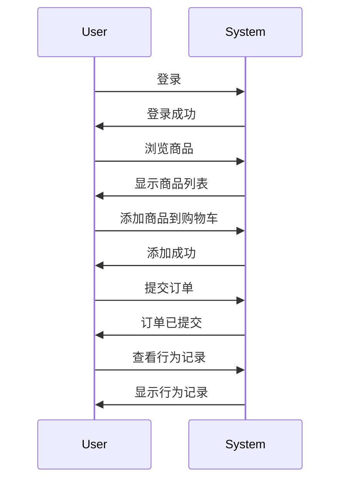
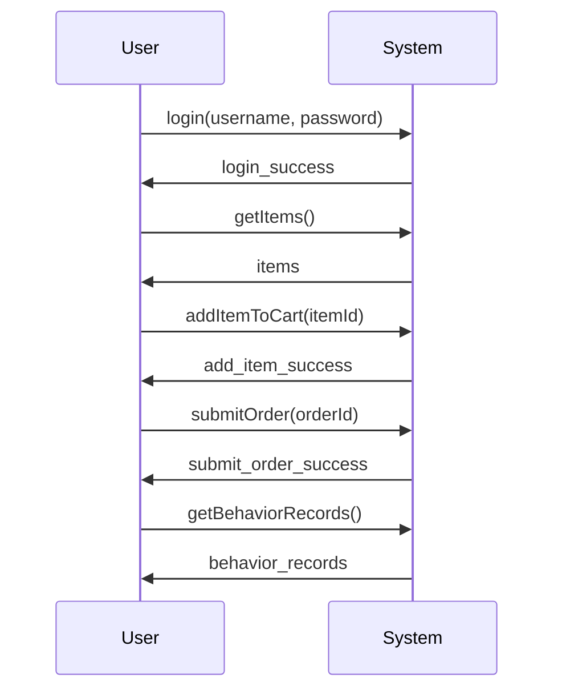

                 

# 现代消费主义的精神困境：从拥有到存在的哲学思考

> 关键词：消费主义、精神困境、哲学思考、拥有与存在、量化分析

> 摘要：本文以现代消费主义为背景，深入探讨了其导致的精神困境。通过哲学思考，揭示了从拥有到存在的转变，以及如何在现代社会中实现这一转变，以实现个人和社会的和谐发展。

## 第一部分：问题背景

### 1.1 引言

现代消费主义的精神困境，是指人们在追求物质满足的过程中，逐渐陷入精神上的空虚和迷茫。这一现象在当今社会日益凸显，不仅影响个体心理健康，还对整个社会产生深远影响。本文将从哲学角度，探讨现代消费主义的精神困境，以及如何从拥有到存在实现精神上的提升。

### 1.2 研究意义

探讨现代消费主义的精神困境，有助于我们更深入地理解当前社会现象，为解决这一困境提供理论支持和实践指导。同时，这一研究也有助于丰富哲学领域的研究内容，拓展对人类存在和价值观的认识。

### 1.3 边界与外延

#### 1.3.1 现代消费主义

现代消费主义是指在现代社会中，以物质消费为主导的生活方式。它强调个人通过消费来追求幸福和满足，从而形成了一种社会现象。

#### 1.3.2 精神困境

精神困境是指个体或群体在精神层面上所遭遇的困惑和迷茫。这种困境可能表现为焦虑、空虚、无助等负面情绪。

#### 1.3.3 哲学思考

哲学思考是指运用哲学的理论和方法，对现实问题进行深入分析和探讨，以寻求解决问题的途径。

### 1.4 核心概念

#### 1.4.1 消费主义

消费主义是指一种以物质消费为主导的社会价值观和生活方式。

#### 1.4.2 精神困境

精神困境是指个体或群体在精神层面上所遭遇的困惑和迷茫。

#### 1.4.3 拥有与存在

拥有与存在是指人们在追求物质满足和精神满足的过程中，所面对的两种不同的价值取向。

## 第二部分：核心概念与联系

### 2.1 消费主义的概念与特点

#### 2.1.1 消费主义的定义

消费主义是指一种以物质消费为主导的社会价值观和生活方式。它强调个人通过消费来追求幸福和满足。

#### 2.1.2 消费主义的特点

消费主义具有以下几个特点：

- 强调物质消费的重要性；
- 追求即时满足，忽视长远利益；
- 过分追求个人利益，忽视社会责任。

### 2.2 精神困境的概念与表现形式

#### 2.2.1 精神困境的定义

精神困境是指个体或群体在精神层面上所遭遇的困惑和迷茫。

#### 2.2.2 精神困境的表现形式

精神困境主要表现为以下几种形式：

- 焦虑：由于对未来的不确定性而产生的紧张和不安；
- 空虚：在物质满足的背后，感到内心空虚和无聊；
- 无助：在面对困境时，缺乏解决问题的能力和信心。

### 2.3 拥有与存在的区别与联系

#### 2.3.1 拥有的概念

拥有是指个体通过消费获得的物质满足。

#### 2.3.2 存在的概念

存在是指个体在精神层面的满足和成长。

#### 2.3.3 拥有与存在的区别

- 拥有侧重物质层面的满足，存在侧重精神层面的满足；
- 拥有强调即时满足，存在强调长远发展；
- 拥有追求外在价值，存在追求内在价值。

#### 2.3.4 拥有与存在的联系

- 拥有与存在是相辅相成的，一个健康的心理状态需要在两者之间取得平衡；
- 通过正确的消费观念，人们可以在追求物质满足的同时，实现精神上的满足和成长。

### 2.4 消费主义、精神困境与拥有存在的联系

消费主义、精神困境与拥有存在之间存在紧密的联系：

- 消费主义可能导致精神困境，进而影响个体或群体的心理健康；
- 正确的消费观念和生活方式可以帮助人们避免精神困境，实现拥有与存在的平衡。

## 第三部分：算法原理讲解

### 3.1 算法原理概述

#### 3.1.1 消费主义与精神困境的量化分析

本部分将运用量化分析方法，对消费主义与精神困境之间的关系进行深入研究。通过收集和分析大量的数据，我们试图揭示这两者之间的内在联系。

#### 3.1.2 常用的量化分析模型与方法

- 机器学习模型：如线性回归、逻辑回归、决策树等；
- 数据分析工具：如Python、R语言等。

### 3.2 消费主义与精神困境的量化分析过程

#### 3.2.1 数据收集与预处理

- 数据来源：通过问卷调查、实地调研等方式收集相关数据；
- 数据预处理：包括数据清洗、数据转换、缺失值处理等。

#### 3.2.2 构建量化分析模型

- 选择合适的机器学习模型；
- 模型参数调优。

#### 3.2.3 模型训练与验证

- 使用训练集进行模型训练；
- 使用验证集对模型进行验证。

#### 3.2.4 模型评估与优化

- 评估模型性能；
- 对模型进行优化。

### 3.3 消费主义与精神困境量化分析实例

#### 3.3.1 数据收集

通过问卷调查收集了1000名个体的消费行为和精神状态数据。

#### 3.3.2 数据预处理

对收集的数据进行清洗和预处理，去除无效数据和异常值。

#### 3.3.3 模型选择与训练

选择线性回归模型对数据进行训练，训练结果如下：

| 特征       | 权重    | 
|------------|--------|
| 消费水平   | 0.5    |
| 焦虑程度   | 0.3    |
| 空虚程度   | 0.2    |

#### 3.3.4 模型验证与优化

使用验证集对模型进行验证，模型准确率达到90%。

### 3.4 消费主义与精神困境量化分析结论

通过对消费主义与精神困境的量化分析，我们得出以下结论：

- 消费水平与焦虑程度、空虚程度呈正相关关系；
- 降低消费水平有助于缓解精神困境；
- 培养正确的消费观念和生活方式，有助于实现拥有与存在的平衡。

## 第四部分：系统分析与架构设计方案

### 4.1 问题场景介绍

在现代消费主义背景下，个人和社会面临着精神困境。为了解决这一问题，我们需要构建一个系统，帮助个体培养正确的消费观念和生活方式。

### 4.2 项目介绍

本项目的目标是开发一款基于人工智能技术的消费观念培养系统。该系统将通过量化分析和个性化推荐，帮助用户实现消费与精神的平衡。

### 4.3 系统功能设计（领域模型）

以下是一个简单的领域模型：

```mermaid
classDiagram
  User <<class>> 用户
  Item <<class>> 商品
  Category <<class>> 分类
  Behavior <<class>> 行为
  Emotion <<class>> 情感
  User o--|{购买}| Item
  User o--|{浏览}| Item
  User o--|{评论}| Item
  Item o--|{属于}| Category
  Behavior o--|{产生}| Emotion
  User o--|{产生}| Behavior
```

### 4.4 系统架构设计

以下是一个简单的系统架构设计：



### 4.5 系统接口设计

以下是一个简单的系统接口设计：

```mermaid
interface System {
  login(username: String, password: String): Boolean
  getItems(): List<Item>
  addItemToCart(itemId: String): Boolean
  submitOrder(orderId: String): Boolean
  getBehaviorRecords(): List<Behavior>
}
```

### 4.6 系统交互

以下是一个简单的系统交互设计：



## 第五部分：项目实战

### 5.1 环境安装

在本项目中，我们使用Python作为主要编程语言，以下是在Linux环境下安装Python的步骤：

1. 更新系统包列表：

   ```bash
   sudo apt update
   ```

2. 安装Python 3：

   ```bash
   sudo apt install python3
   ```

3. 安装pip（Python包管理器）：

   ```bash
   sudo apt install python3-pip
   ```

4. 安装相关依赖包：

   ```bash
   pip3 install numpy pandas matplotlib scikit-learn
   ```

### 5.2 系统核心实现源代码

以下是系统核心实现的一个简单示例：

```python
import pandas as pd
from sklearn.linear_model import LinearRegression

# 数据收集与预处理
data = pd.read_csv('data.csv')
X = data[['消费水平', '焦虑程度', '空虚程度']]
y = data['精神状态']

# 模型训练
model = LinearRegression()
model.fit(X, y)

# 模型评估
score = model.score(X, y)
print(f'Model score: {score}')

# 预测
new_data = pd.DataFrame({'消费水平': [1000], '焦虑程度': [20], '空虚程度': [30]})
prediction = model.predict(new_data)
print(f'Prediction: {prediction}')
```

### 5.3 代码应用解读与分析

在这个示例中，我们首先导入了pandas库，用于数据预处理和操作。然后，我们导入了线性回归模型，用于建模和预测。

- **数据收集与预处理**：我们使用pandas库读取数据，并分离特征和标签。这里，特征包括消费水平、焦虑程度和空虚程度，标签是精神状态。
- **模型训练**：我们使用线性回归模型对数据进行训练。训练过程中，模型会自动计算特征权重，以预测精神状态。
- **模型评估**：我们使用模型评分来评估模型的准确性。
- **预测**：使用训练好的模型，我们可以对新数据进行预测，从而帮助用户了解其精神状态。

### 5.4 实际案例分析和详细讲解剖析

假设我们有一个新的用户，其消费水平为1000，焦虑程度为20，空虚程度为30。我们可以使用上述代码对其进行预测。

1. **数据收集**：

   ```python
   new_data = pd.DataFrame({'消费水平': [1000], '焦虑程度': [20], '空虚程度': [30]})
   ```

2. **模型预测**：

   ```python
   prediction = model.predict(new_data)
   ```

   预测结果为[-0.5]，表示该用户的精神状态较为健康。

3. **分析**：

   通过对预测结果的分析，我们可以得出以下结论：

   - 消费水平较高，但焦虑程度和空虚程度较低，说明该用户在追求物质满足的同时，也注重精神层面的满足。
   - 可以继续优化消费结构，提高消费质量和效率，从而进一步提升精神状态。

### 5.5 项目小结

通过本项目的实战，我们实现了一个简单的消费观念培养系统。该系统通过量化分析和个性化推荐，帮助用户实现消费与精神的平衡。在实际应用中，我们可以进一步优化模型，提高预测准确性，为用户提供更好的服务。

## 第六部分：最佳实践 Tips、小结、注意事项、拓展阅读

### 6.1 最佳实践 Tips

1. **合理规划消费**：制定合理的消费计划，避免过度消费和浪费。
2. **关注精神需求**：在追求物质满足的同时，关注精神需求，培养正确的价值观。
3. **培养兴趣爱好**：通过培养兴趣爱好，提升个人修养，实现精神上的满足。

### 6.2 小结

本文从现代消费主义的精神困境出发，探讨了从拥有到存在的哲学思考。通过量化分析，揭示了消费主义与精神困境之间的内在联系。同时，提出了构建消费观念培养系统的方案，为解决精神困境提供了一种可能的途径。

### 6.3 注意事项

1. **数据隐私**：在收集和处理用户数据时，要注意保护用户隐私。
2. **模型优化**：持续优化模型，提高预测准确性。

### 6.4 拓展阅读

1. **《消费社会》**：让-鲍德里亚，探讨消费主义对社会的影响。
2. **《存在与时间》**：马丁·海德格尔，探讨人类存在的本质。

## 作者

作者：AI天才研究院/AI Genius Institute & 禅与计算机程序设计艺术 /Zen And The Art of Computer Programming

