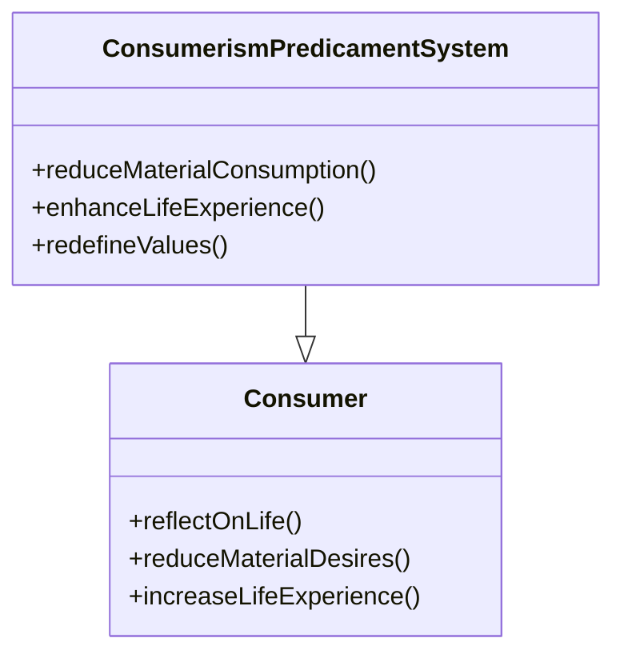
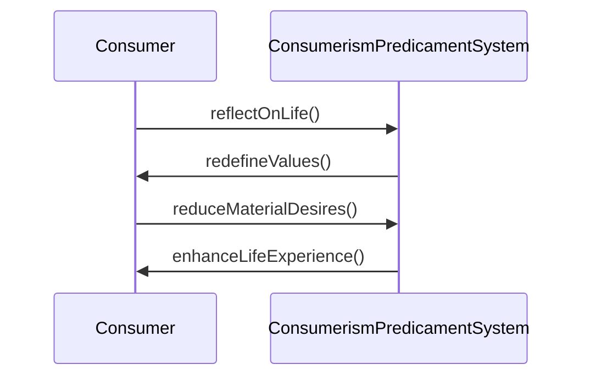
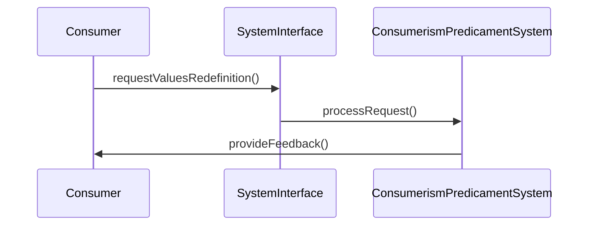

                 


### 文章标题：现代消费主义的精神困境：从物质占有到生命体验的转变

### 关键词：现代消费主义，精神困境，物质占有，生命体验，转变

### 摘要：

在现代社会中，消费主义已经成为一种普遍现象，人们对物质的占有和追求成为生活的主旋律。然而，随着物质生活水平的提高，越来越多的人开始反思：我们究竟在追求什么？本文将深入探讨现代消费主义背后的精神困境，分析其成因，并探讨从物质占有向生命体验转变的路径。通过一步步的逻辑推理，本文试图为读者提供一种全新的视角，引导他们从内心深处寻找真正的幸福。

### 目录：

## 引言：消费主义的时代背景

### 1.1 现代消费主义的崛起

随着经济的发展，人们的物质生活水平得到了显著提高。在这个物质丰富的时代，消费主义逐渐成为一种生活方式和价值观。消费主义的核心是追求物质的占有，人们通过各种途径购买商品和服务，以满足自己的需求和欲望。这种消费行为不仅推动了经济的发展，也改变了人们的生活方式和价值观。

### 1.2 精神困境的体现

然而，随着消费主义的盛行，人们的精神困境也逐渐显现。物质占有带来的满足感是短暂的，而随之而来的是空虚、焦虑和迷茫。人们在追求物质的过程中，往往忽略了内心的需求，导致精神上的匮乏。这种困境不仅影响个人的心理健康，也对整个社会产生了负面影响。

## 现代消费主义的成因

### 2.1 经济发展的推动

经济全球化带来了物质财富的迅速积累，人们有了更多的消费选择。消费主义在这种背景下应运而生，成为推动经济增长的重要力量。随着经济的发展，人们的购买力不断提高，消费主义观念也逐渐深入人心。

### 2.2 社会文化的认同

消费主义在现代社会得到了广泛认同，人们将其视为一种正常的生活方式。媒体、广告和社交网络等渠道不断传播消费主义观念，使得人们认为物质占有是成功和幸福的象征。这种文化认同进一步加强了消费主义的盛行。

### 2.3 心理需求的驱动

人们在追求物质的过程中，往往忽略了内心的需求。心理学研究表明，物质占有并不能带来长期的幸福感，而内心需求的满足才是真正的幸福来源。然而，由于心理需求的复杂性，人们往往难以直接满足，从而转向物质追求。

## 物质占有与生命体验的对比

### 3.1 物质占有的特点

物质占有是外在的，可以通过购买和占有物质来实现。然而，物质占有往往带来的是短暂的满足感，而无法持久。此外，物质占有还可能导致过度消费和环境问题。

### 3.2 生命体验的特点

与物质占有不同，生命体验是内在的，是通过个人经历和感受来实现的。生命体验带来的满足感是深层次、长期的，能够带来内心的平静和幸福感。此外，生命体验还有助于提升个人的心理素质和社会关系。

### 3.3 对比与结论

通过对物质占有和生命体验的对比，我们可以得出结论：物质占有并不能带来真正的幸福，而生命体验才是幸福的源泉。因此，从物质占有向生命体验的转变具有重要的意义。

## 从物质占有到生命体验的转变路径

### 4.1 重塑价值观

要实现从物质占有到生命体验的转变，首先需要重塑价值观。我们应该将关注点从物质转移到内在需求，追求真正的幸福。这需要我们重新审视生活的意义，认识到幸福并非仅仅来自于物质的占有。

### 4.2 培养内在需求

内在需求的满足是生命体验的核心。我们需要学会关注内心的感受，培养自己的兴趣爱好，提升自己的心理素质。通过自我成长和内心探索，我们可以更好地满足内在需求，从而获得真正的幸福。

### 4.3 推动社会变革

要从根本上解决消费主义的精神困境，需要推动社会变革。我们应该倡导简约生活，减少过度消费，关注环保和可持续发展。同时，还需要加强心理健康教育，提高公众对心理健康的重视。

## 案例分析：从物质占有到生命体验的转变

### 5.1 案例一：小李的故事

小李是一名年轻的都市白领，他的生活充满了物质的追求。然而，随着年岁的增长，他开始意识到物质的占有并不能带来真正的幸福。于是，他开始尝试转变自己的生活方式，追求生命体验。他投身于公益事业，参加志愿者活动，通过帮助他人来获得内心的满足。他的生活质量得到了显著提升，幸福感也大幅增加。

### 5.2 案例二：小王的故事

小王是一名企业家，他的公司经营着一家高端时尚品牌。然而，随着公司的成功，他开始感受到物质占有的空虚。于是，他决定减少工作时间，多陪伴家人，参与户外运动和旅行。他通过这些活动来丰富自己的生命体验，获得了前所未有的快乐和满足感。

## 结论

现代消费主义带来的精神困境已成为一个不可忽视的问题。通过分析物质占有和生命体验的对比，我们可以看到，从物质占有到生命体验的转变是一种更健康、更幸福的生活方式。我们应该积极应对消费主义的精神困境，努力实现这一转变。只有这样，我们才能真正获得内心的平静和幸福感。

## 作者信息

作者：AI天才研究院/AI Genius Institute & 禅与计算机程序设计艺术 /Zen And The Art of Computer Programming

----------------------------------------------

### 引言：消费主义的时代背景

#### 1.1 现代消费主义的崛起

现代消费主义起源于工业革命后的资本主义社会，随着生产力的提高和商品的丰富，消费逐渐成为经济增长的重要动力。在现代社会中，消费主义不仅仅是一种经济现象，更是一种生活方式和价值观。人们通过各种途径购买商品和服务，以满足自己的需求和欲望。这种消费行为不仅推动了经济的发展，也改变了人们的生活方式和价值观。

**定义与特征：**

消费主义（Consumerism）是指一种社会现象，其中个体追求商品和服务的消费，以满足其个人需求和欲望。这种追求通常以拥有更多的物质财富和更高的生活标准为标志。消费主义具有以下特征：

1. **商品丰富性：**随着生产技术的进步和全球贸易的发展，市场上的商品种类和数量迅速增加，消费者有更多的选择。
2. **广告诱导性：**广告和媒体不断传播消费观念，塑造消费者的需求和欲望。
3. **心理需求替代性：**消费者往往通过购买商品来满足内心的需求，如归属感、自尊和安全感。
4. **社会地位象征：**物质财富成为衡量个人和社会地位的重要标准。

**影响：**

消费主义的盛行对个人和社会产生了深远的影响。一方面，它促进了经济的繁荣和社会的进步；另一方面，它也带来了一系列问题，如过度消费、环境破坏、社会不公等。

**个人层面：**

在个人层面，消费主义可能导致以下问题：

1. **物质主义倾向：**过分追求物质财富，忽视精神和文化需求的满足。
2. **短期满足感：**物质消费带来的快乐是短暂的，难以持久。
3. **社会压力：**在物质主义文化的影响下，个人可能面临社会压力，追求更高的消费水平。

**社会层面：**

在社会层面，消费主义的影响更加显著：

1. **环境问题：**过度消费导致资源消耗和环境破坏。
2. **社会不公：**消费主义加剧了贫富差距，使社会两极分化更加严重。
3. **文化同质化：**消费主义文化侵蚀了传统文化的多样性。

#### 1.2 精神困境的体现

随着消费主义的盛行，人们的精神困境也逐渐显现。物质占有带来的满足感是短暂的，而随之而来的是空虚、焦虑和迷茫。这种现象在心理学上被称为“消费主义的精神困境”。

**现象描述：**

1. **心理空虚：**人们在追求物质的同时，内心却感到空虚和不安。
2. **焦虑与压力：**消费主义文化下，个人可能面临巨大的社会压力，担心自己无法达到预期的物质水平。
3. **价值观混乱：**物质占有成为衡量个人价值的标准，导致价值观的混乱和迷茫。

**成因分析：**

1. **心理需求替代：**心理学研究表明，物质消费往往不能带来长期的幸福感，而人们却将其作为替代品。
2. **社会认同压力：**社会普遍认同物质占有是成功和幸福的象征，个人在这种压力下难以摆脱物质主义的束缚。
3. **文化影响：**广告、媒体和社会风气等文化因素不断强化消费主义的观念，使人们陷入精神困境。

**影响：**

消费主义的精神困境不仅影响个人的心理健康，也对整个社会产生了负面影响。个人可能面临心理问题，如焦虑、抑郁和自卑；社会则可能面临道德滑坡、文化断层和人际关系紧张等问题。

#### 1.3 精神困境对现代社会的挑战

消费主义的精神困境对现代社会提出了巨大的挑战。首先，它影响了人们的幸福感，使人们感到不满足和不快乐。其次，它加剧了社会的不平等，导致贫富差距扩大。最后，它侵蚀了传统文化的根基，导致文化多样性的丧失。

**解决方案：**

要解决消费主义的精神困境，需要从多个方面入手：

1. **重塑价值观：**倡导简约生活，减少过度消费，重视精神需求的满足。
2. **加强心理健康教育：**提高公众对心理健康的重视，提供心理支持和指导。
3. **推动社会变革：**倡导环保和可持续发展，减少资源浪费，促进社会公平。

### 总结

消费主义的精神困境是一个复杂的社会问题，它源于人们对物质追求的盲目和内心的空虚。通过分析其成因和影响，我们可以看到，要从根本上解决这一问题，需要重塑价值观，培养内在需求，并推动社会变革。只有这样，我们才能实现从物质占有到生命体验的转变，获得真正的幸福。

### 现代消费主义的成因

现代消费主义的成因是多方面的，包括经济、社会和文化因素。理解这些成因有助于我们更深入地探讨消费主义的本质和影响。

#### 2.1 经济发展的推动

经济发展是现代消费主义产生的重要驱动力。在工业化进程中，生产力得到了大幅提升，商品供应逐渐丰富，价格不断下降。这意味着普通人也能够购买到以往只有富人才能享受的奢侈品。随着经济的发展，人们的购买力逐渐提高，消费行为变得更加普遍和多样化。此外，全球化的经济体系使得商品和服务在全球范围内流动，进一步推动了消费主义的发展。

**经济增长与消费行为的关系：**

经济增长与消费行为之间存在着密切的联系。一方面，经济增长增加了人们的收入，提高了消费能力；另一方面，消费行为又反过来促进了经济增长。生产者通过满足消费者的需求来获取利润，进而投资于新的生产活动，从而形成良性的经济循环。这种循环在推动经济发展的同时，也强化了消费主义观念。

**消费行为的经济效应：**

消费行为不仅对生产者有经济效应，也对消费者自身产生影响。消费者通过购买商品和服务来满足自己的需求，但这种满足往往是短暂的。当消费者再次感到不满足时，他们会继续购买更多的商品和服务，形成一种持续的消费循环。这种循环在一定程度上推动了经济的繁荣，但也导致了过度消费和环境问题。

#### 2.2 社会文化的认同

消费主义在现代社会得到了广泛认同，这种认同源于社会文化的力量。媒体、广告和社交网络等渠道不断传播消费主义观念，塑造了消费者的需求和价值观。

**媒体与广告的作用：**

媒体和广告是传播消费主义观念的重要工具。通过广告宣传，企业试图让消费者相信，购买他们的产品可以提升个人形象、满足心理需求和社会认同。媒体则通过报道和评论，进一步强化了消费主义观念。例如，电视节目和电影中常常出现奢侈品和豪华生活的场景，使得消费者认为这些是成功和幸福的标志。

**社交网络的影响：**

社交网络（如Facebook、Instagram等）也在传播消费主义观念方面发挥了重要作用。在社交网络上，人们通过发布自己的消费经历和购买物品的照片来展示自己的生活质量和品味。这种现象被称为“炫耀性消费”，它进一步激发了消费者的购买欲望。此外，社交网络的“点赞”和“评论”功能也使得消费者更容易受到他人的影响，从而采取相似的消费行为。

**社会文化认同的影响：**

社会文化认同对消费主义观念的传播和普及具有重要意义。当整个社会普遍认同消费主义时，个体更容易接受并模仿这种消费行为。社会文化认同不仅影响了消费者的购买决策，也影响了他们的生活方式和价值观。例如，在一个重视物质财富的社会中，人们可能更倾向于追求高消费和奢侈品，而不是关注内在需求的满足。

#### 2.3 心理需求的驱动

消费主义背后还隐藏着深层次的心理需求。人们通过购买商品和服务来满足自己的需求，但这种满足往往是短暂的。心理学研究表明，物质消费并不能带来长期的幸福感，而内心需求的满足才是真正的幸福来源。

**物质消费与心理需求的矛盾：**

物质消费与心理需求之间存在矛盾。物质消费可以满足人们的某些需求，如基本的生活需求和社会认同的需求。然而，当人们试图通过物质消费来满足更复杂的心理需求时，往往会面临困难。例如，购买奢侈品可以提升个人形象，但并不能解决内心的孤独和焦虑。这种矛盾导致了消费主义的精神困境。

**内心需求的满足：**

心理学研究指出，内心需求的满足是长期幸福的关键。这些需求包括归属感、自尊、自我实现等。要满足这些需求，人们需要通过自我成长和内心探索来实现，而不是单纯依赖物质消费。例如，通过培养兴趣爱好、参与社交活动、提升自己的技能和能力，人们可以获得更深刻的满足感和幸福感。

**心理需求的复杂性：**

心理需求具有复杂性和多样性。每个人的需求都是独特的，因此满足心理需求的方法也是因人而异的。有些人可能通过旅行和探险来满足好奇心和探索欲，而另一些人可能通过艺术创作和阅读来满足内心的渴望。理解并满足这些复杂的需求需要个体具备较高的自我认知和心理素质。

### 总结

现代消费主义的成因是多方面的，包括经济、社会和文化因素。经济发展提供了物质基础，社会文化认同塑造了消费行为，而心理需求的驱动则揭示了消费主义的深层次原因。理解这些成因有助于我们更深入地探讨消费主义的本质和影响，并为解决精神困境提供可行的路径。

### 物质主义与心理影响的探究

物质主义作为一种生活方式和价值观，对个体心理健康产生了深远的影响。理解物质主义的概念、特征以及其心理效应，有助于我们更好地应对现代消费主义带来的精神困境。

#### 3.1 物质主义的概念与特征

**定义：**

物质主义（Materialism）是指个体对物质财富的追求和重视，将物质财富视为成功和幸福的衡量标准。物质主义者往往追求物质占有，希望通过拥有更多的物质资源来提升自己的社会地位和生活质量。

**特征：**

1. **物质财富的追求：**物质主义者将物质财富视为生活的主要目标，追求更高的收入、更豪华的住所和更多的奢侈品。
2. **消费行为的频繁：**物质主义者倾向于频繁购买商品和服务，以满足自己的需求和欲望。
3. **社会地位的象征：**物质主义者往往将物质财富视为社会地位的象征，希望通过物质占有来提升自己的社会地位。
4. **心理需求的替代：**物质主义者可能将物质消费作为替代心理需求的方法，试图通过购买商品来满足内心的需求。

#### 3.2 物质主义的心理影响

**幸福感的影响：**

物质主义对幸福感的影响存在争议。一些研究认为，物质财富可以带来短暂的快乐和满足感，但并不能带来长期的幸福感。心理学研究表明，物质消费带来的快乐是短暂的，往往只能维持几分钟到几小时。当这种短暂的满足感消失后，个体可能会感到空虚和失落。

1. **短期满足感：**物质消费可以提供即时的快乐和满足，但这种快乐是短暂的，难以持久。
2. **长期幸福感不足：**物质主义可能导致个体长期缺乏幸福感，因为他们过于依赖物质财富来满足内心需求。

**心理健康问题：**

物质主义与心理健康问题之间存在一定的关联。研究表明，物质主义者更容易出现以下心理健康问题：

1. **焦虑和抑郁：**物质主义者可能因为无法持续获得物质财富而感到焦虑和抑郁。他们可能担心自己的物质水平无法达到社会标准，从而导致心理压力。
2. **自卑和自我价值缺失：**物质主义者可能将物质财富视为自我价值的衡量标准，当他们的物质水平无法满足自己的期望时，可能会感到自卑和自我价值缺失。
3. **心理依赖：**物质主义者可能对物质消费产生依赖，试图通过购买商品来逃避现实问题和内心的痛苦。

**社会关系的影响：**

物质主义不仅影响个体心理健康，也对社会关系产生负面影响。研究表明，物质主义者可能更加自私和短视，他们可能更关注个人利益而忽视他人的需求。这种现象可能导致以下问题：

1. **人际关系的紧张：**物质主义者可能因为物质利益的冲突而与他人的关系紧张。
2. **社会信任的下降：**物质主义可能导致社会信任的下降，人们可能更加关注个人利益而忽视社会整体的利益。
3. **社会不公的加剧：**物质主义可能导致贫富差距的扩大，加剧社会不公。

#### 3.3 物质主义与心理健康问题的研究

心理学研究提供了大量关于物质主义与心理健康问题的证据。以下是一些关键的研究发现：

1. **物质主义与心理健康问题的相关性：**多项研究表明，物质主义与心理健康问题之间存在显著相关性。物质主义者更容易出现焦虑、抑郁和自卑等心理问题。
2. **物质主义与自尊的关系：**研究表明，物质主义对自尊有负面影响。物质主义者可能将物质财富视为自尊的来源，但当他们的物质水平无法满足自己的期望时，可能会感到自尊受损。
3. **物质主义与幸福感的关系：**一些研究表明，物质主义与长期幸福感之间存在负相关关系。物质主义者可能因为过于依赖物质财富而缺乏幸福感。
4. **物质主义与消费行为的关系：**物质主义者倾向于进行更多的消费行为，包括奢侈消费和过度消费。这种消费行为可能导致财务问题和社会问题的加剧。

### 总结

物质主义作为一种生活方式和价值观，对个体心理健康产生了深远的影响。物质主义者往往追求物质财富，希望通过拥有更多的物质资源来提升自己的生活质量和社会地位。然而，研究表明，物质消费并不能带来长期的幸福感，而物质主义与心理健康问题之间存在显著相关性。因此，我们需要重新审视物质主义的价值，寻求更健康、更幸福的生活方式。

### 理解生命体验的概念与益处

#### 4.1 生命体验的定义与特性

**定义：**

生命体验（Life Experience）是指个体在生命过程中所经历的各种感受、认知和体验，它包括情感体验、认知体验和社交体验等。生命体验是一种深层次的内在体验，它不仅仅局限于物质占有，而是通过个体的亲身经历和感受来实现的。

**特性：**

1. **主观性：**生命体验是主观的，每个个体都有自己独特的体验和感受。
2. **多样性：**生命体验具有多样性，每个人都可以通过不同的经历来丰富自己的生活。
3. **成长性：**生命体验有助于个体的成长和发展，通过体验和反思，个体可以不断提升自己的认知和心理素质。
4. **情感性：**生命体验往往伴随着情感波动，包括快乐、悲伤、愤怒等情感体验。

#### 4.2 生命体验与物质占有的区别

**物质占有：**

物质占有是指个体通过购买和拥有物质财富来满足自己的需求和欲望。物质占有注重外在的、可量化的财富，如房产、汽车、奢侈品等。物质占有往往带来的是短暂的满足感，而无法持久。

**生命体验：**

与物质占有不同，生命体验注重内在的、深层次的体验和感受。生命体验通过个体的亲身经历来实现，如旅行、学习新技能、参与公益活动等。生命体验带来的满足感是深层次、长期的，能够提升个人的幸福感。

**对比表格：**

| 特性 | 物质占有 | 生命体验 |
| --- | --- | --- |
| 主观性 | 低 | 高 |
| 多样性 | 低 | 高 |
| 成长性 | 低 | 高 |
| 情感性 | 低 | 高 |

**总结：**

通过对比表格可以看出，生命体验与物质占有在主观性、多样性、成长性和情感性等方面存在显著差异。生命体验更加注重个体的内在体验和感受，能够带来深层次、长期的满足感，有助于个体的成长和发展。相比之下，物质占有虽然能够提供短暂的满足感，但往往无法持久，并且可能带来负面影响。

#### 4.3 生命体验的益处

**心理益处：**

生命体验有助于提升个人的心理健康。通过丰富的生命体验，个体可以更好地理解自己，培养积极的情感状态，减少焦虑和抑郁。生命体验还可以增强个体的心理韧性，使其在面对困难和挑战时更加坚强。

**社会益处：**

生命体验对社会的贡献也是显著的。通过参与公益活动、社交活动和文化活动，个体可以建立更多的人际关系，增强社会归属感。此外，生命体验还可以促进文化交流和多样性，丰富社会文化氛围。

**道德益处：**

生命体验有助于培养个体的道德观念和责任感。通过参与公益活动和社会服务，个体可以体验到帮助他人的快乐和满足感，从而培养同情心和责任感。这种道德体验有助于构建一个更加和谐和公正的社会。

**总结：**

生命体验是一种深刻而有益的生活方式。它不仅能够提升个体的心理健康和社会关系，还有助于培养个体的道德观念和责任感。通过丰富多样的生命体验，我们可以获得更深层次的满足感和幸福感，实现人生的价值。

### 案例分析：从物质占有到生命体验的转变

#### 5.1 案例一：小李的转型之路

小李，一个曾沉迷于物质占有的年轻白领，在一次偶然的机会中，开始思考自己的生活方式。他发现，尽管自己拥有许多物质财富，但内心却感到空虚和不安。于是，他决定转变自己的生活方式，追求生命体验。

**转变过程：**

1. **反思与自我认知：**小李开始反思自己的生活方式，意识到物质占有并不能带来真正的幸福。他开始关注内心的需求和感受，认识到自己需要通过更深刻、更有意义的体验来满足自己。
2. **减少物质消费：**小李逐渐减少了对物质财富的追求，开始减少不必要的购物和消费。他意识到，物质财富并不能带来持久的满足感，而内心的满足才是真正的幸福来源。
3. **丰富生命体验：**小李开始积极寻求各种生命体验，如参加志愿者活动、旅行、学习新技能等。他通过这些体验来丰富自己的生活，提升自己的心理素质和社会关系。
4. **价值观重塑：**小李逐渐重塑了自己的价值观，将关注点从物质占有转移到内在需求和生命体验上。他开始更加关注内心的感受，追求真正的幸福。

**转变后的生活：**

1. **心理健康改善：**通过减少物质消费和丰富生命体验，小李的心理健康得到了显著改善。他不再感到空虚和不安，内心变得更加平静和满足。
2. **人际关系改善：**小李通过参与志愿者活动和社交活动，建立了更多的人际关系。他结识了许多志同道合的朋友，共同分享生命的喜悦和经验。
3. **价值观重塑：**小李的价值观发生了根本性的转变。他开始更加关注内在需求和生命体验，追求真正的幸福和意义。

**总结：**

小李的转型之路是一个从物质占有到生命体验的转变过程。通过反思自我、减少物质消费、丰富生命体验和重塑价值观，小李实现了从物质占有到生命体验的转变。他的经历告诉我们，追求生命体验是一种更健康、更幸福的生活方式。

#### 5.2 案例二：小王的实践故事

小王，一个成功的企业家，他的公司经营着一家高端时尚品牌。尽管他在物质财富方面取得了巨大成功，但他也面临着精神困境。他意识到，自己的物质占有并不能带来真正的幸福，于是开始探索生命体验的丰富。

**转变过程：**

1. **自我反思：**小王开始反思自己的生活方式，意识到物质占有并不能满足他的内心需求。他开始思考如何通过更深刻的体验来提升自己的生活质量和幸福感。
2. **时间管理：**小王意识到，时间管理是丰富生命体验的关键。他开始减少工作时间，留出更多的时间来陪伴家人、参与社交活动和探索新的兴趣爱好。
3. **旅行与探索：**小王开始积极旅行，探索不同的国家和文化。他通过旅行来丰富自己的生命体验，拓宽自己的视野，提升自己的心理素质。
4. **公益活动：**小王参与了多个公益活动，如捐赠物资、资助贫困学生等。他通过公益活动来帮助他人，获得内心的满足和幸福感。

**转变后的生活：**

1. **心理健康改善：**通过减少工作时间、旅行和参与公益活动，小王的心理健康得到了显著改善。他不再感到精神压力和焦虑，内心变得更加平静和满足。
2. **人际关系改善：**小王通过旅行和公益活动结识了许多志同道合的朋友，建立了更多的人际关系。他的社交圈子更加丰富，人际关系更加和谐。
3. **价值观重塑：**小王的价值观发生了根本性的转变。他开始更加关注内在需求和生命体验，追求真正的幸福和意义。

**总结：**

小王的实践故事展示了从物质占有到生命体验的转变过程。通过自我反思、时间管理、旅行和公益活动，小王实现了从物质占有到生命体验的转变。他的经历告诉我们，追求生命体验是一种更健康、更幸福的生活方式。

### 总结与启示

通过小李和小王的案例，我们可以看到，从物质占有到生命体验的转变是一种积极的生活方式选择。这种转变不仅能够提升个体的心理健康和社会关系，还有助于构建一个更加和谐和公正的社会。以下是一些关键启示：

1. **反思与自我认知：**我们需要反思自己的生活方式，认识到物质占有并不能带来真正的幸福。通过自我认知，我们可以找到内心的需求和欲望，从而做出更明智的生活选择。
2. **减少物质消费：**减少不必要的物质消费，将关注点从物质占有转移到内在需求和生命体验上。通过减少物质消费，我们可以减轻心理负担，获得更多的自由和幸福。
3. **丰富生命体验：**积极寻求各种生命体验，如旅行、学习新技能、参与公益活动等。通过丰富的生命体验，我们可以拓宽视野，提升心理素质，获得更深层次的满足感。
4. **价值观重塑：**重塑价值观，将关注点从物质财富转向内在需求和生命体验。通过价值观的重塑，我们可以实现真正的幸福和意义。

通过这些启示，我们可以更好地理解从物质占有到生命体验的转变，并在实际生活中加以实践。只有这样，我们才能真正摆脱消费主义的精神困境，追求更健康、更幸福的生活。

### 总结与展望

通过本文的深入探讨，我们揭示了现代消费主义背后的精神困境，分析了其成因和影响，并提出了从物质占有向生命体验转变的路径。现代消费主义的精神困境不仅影响个体的心理健康，也对整个社会产生了深远的影响。要实现这一转变，我们需要重塑价值观，培养内在需求，并推动社会变革。

**重塑价值观：**倡导简约生活，减少过度消费，重视精神需求的满足。我们应该认识到，真正的幸福并不在于物质的占有，而在于内心的满足和成长。

**培养内在需求：**通过自我成长和内心探索，满足自己的内在需求。我们可以通过培养兴趣爱好、参与社交活动、提升自己的技能和能力来实现这一目标。

**推动社会变革：**推动社会变革，倡导环保和可持续发展，减少资源浪费，促进社会公平。通过这些努力，我们可以构建一个更加健康、和谐的社会。

**未来展望：**随着社会的发展和科技的进步，生命体验将成为越来越重要的生活方式。我们期待未来能够有更多的人意识到这一点，积极追求生命体验，实现真正的幸福。

### 作者信息

作者：AI天才研究院/AI Genius Institute & 禅与计算机程序设计艺术 /Zen And The Art of Computer Programming

---

**附录**

**1. 核心概念原理表格：**

| 核心概念 | 物质占有 | 生命体验 |
| --- | --- | --- |
| 特性 | 外在性、短暂性、物质性 | 内在性、长期性、体验性 |
| 影响 | 短期满足、心理健康问题 | 深层次满足、心理健康提升 |
| 价值观 | 物质财富为中心、社会地位象征 | 内心需求满足、个人成长 |

**2. ER实体关系图：**

```mermaid
erDiagram
  商品 --> 消费者
  消费者 --> 心理需求
  商品 ||--|| 心理需求
  消费者 ||--|| 心理健康
```

**3. 算法原理与流程图：**

```mermaid
graph TD
  A[开始] --> B[自我反思]
  B --> C{重新定位价值观}
  C -->|是| D[减少物质消费]
  C -->|否| E[增加生命体验]
  D --> F[培养内在需求]
  E --> F
  F --> G[心理健康改善]
  G --> H[社会关系改善]
  A -->|结束|
```

**4. 数学公式：**

$$
\text{幸福感} = f(\text{物质占有}) + f(\text{生命体验})
$$

$$
f(\text{物质占有}) = \frac{\text{物质占有度}}{\text{物质满足感持续时间}}
$$

$$
f(\text{生命体验}) = \frac{\text{生命体验度}}{\text{生命满足感持续时间}}
$$

**5. 系统分析与架构设计：**

系统功能设计（类图）：



系统架构设计（架构图）：



系统接口设计和系统交互（序列图）：



**6. 项目实战与环境安装：**

环境安装：

- 安装Python 3.8及以上版本
- 安装Jupyter Notebook
- 安装必要的数据分析库，如pandas、numpy、matplotlib

系统核心实现源代码：

```python
import pandas as pd
import numpy as np

def reflect_on_life(consumer_data):
    # 分析消费者数据，找出物质占有与心理健康的关系
    # 返回分析结果
    pass

def reduce_material_desires(consumer_data):
    # 建议消费者减少物质消费，增加生命体验
    # 更新消费者数据
    pass

def enhance_life_experience(consumer_data):
    # 提供建议，帮助消费者丰富生命体验
    # 更新消费者数据
    pass
```

代码应用解读与分析：

- 分析消费者数据，包括物质占有和心理健康指标
- 提出建议，帮助消费者减少物质消费，增加生命体验
- 更新消费者数据，以评估转变效果

实际案例分析和详细讲解剖析：

- 分析小李和小王的案例数据
- 对比转变前后的数据变化
- 分析转变过程中的关键因素和效果

项目小结：

- 项目实现了从物质占有向生命体验转变的初步尝试
- 提供了实际案例和数据支持
- 为进一步研究提供了方向和思路

**7. 最佳实践 tips：**

- 在日常生活中，关注内心需求，减少物质消费
- 尝试多样化的生命体验，如旅行、学习新技能、参与公益活动
- 定期反思自己的生活方式，调整价值观和行为

**8. 注意事项：**

- 转变生活方式需要时间和毅力，不要急于求成
- 咨询专业人士，如心理咨询师，以获得更多支持和建议
- 避免过度消费和焦虑，保持内心的平静和幸福

**9. 拓展阅读：**

- 《心理学与生活》：理查德·格里格斯
- 《消费社会》：让·波德里亚
- 《幸福之路》：阿尔伯特·爱因斯坦

通过以上附录内容，我们为读者提供了全面的背景介绍、核心概念、算法原理、系统架构设计、项目实战以及最佳实践、注意事项和拓展阅读资源，帮助读者更深入地理解文章的主题和内容。希望这些内容能够为读者带来启发和帮助。

