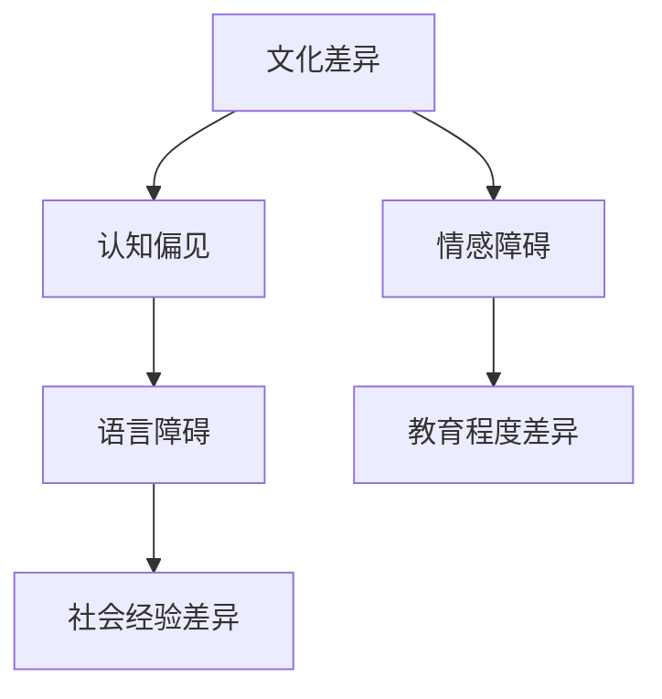
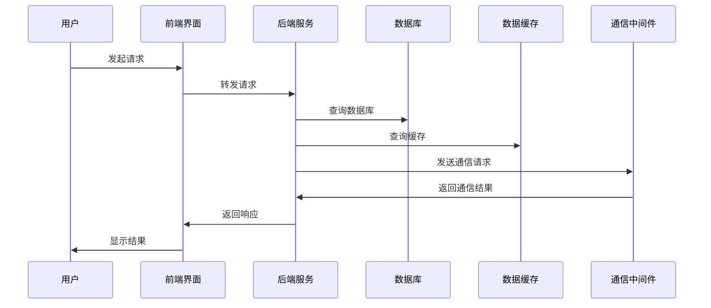

                 

## 引言

### 现代社会中的代际沟通

现代社会，技术的飞速发展和信息的爆炸式增长带来了社会结构的深刻变革。随之而来的，是不同年龄层之间的沟通问题逐渐凸显。随着Z世代和Y世代的崛起，传统价值观与新生代思维的碰撞成为社会中一个不可忽视的现象。传统价值观往往承载着几代人的经验和智慧，而新生代思维则更倾向于创新和个性化。这种碰撞不仅影响了家庭的和谐，也对社会整体的稳定和进步产生了深远的影响。

代际沟通中的障碍主要表现为文化差异、认知偏见、情感障碍、语言障碍、教育程度差异和社会经验差异。传统价值观强调的权威、尊重和规矩，常常与新生代追求的自由、平等和多元观念发生冲突。同时，年长一代和年轻一代在信息获取、技术应用和社交模式上的巨大差异，也加剧了沟通的困难。

面对这些挑战，深入探讨传统价值观与新生代思维的碰撞及其对代际沟通的影响，寻找有效的沟通策略和方法，显得尤为重要。这不仅有助于增进不同年龄层之间的理解和认同，也为构建和谐的社会关系提供理论支持和实践指导。

### 文章关键词

- 代际沟通
- 传统价值观
- 新生代思维
- 文化差异
- 认知偏见
- 情感障碍

### 文章摘要

本文旨在深入探讨现代社会中的代际沟通现象，分析传统价值观与新生代思维的碰撞及其对沟通效果的影响。首先，通过对代际沟通障碍的背景介绍，明确研究的问题和解决方向。接着，详细阐述核心概念与联系，包括传统价值观和新生代思维的定义及其区别。通过算法原理讲解，运用Mermaid流程图和Python源代码，分析沟通障碍的成因及优化策略。进一步，引入数学模型和公式，评估沟通效果，并通过具体实例说明。此外，本文还介绍了系统分析与架构设计方案，包括问题场景、系统功能设计、系统架构设计和系统接口设计。最后，通过项目实战展示实际应用，结合代码解读和案例分析，总结代际沟通优化的最佳实践。本文不仅为理论研究提供坚实基础，也为实际操作提供切实可行的指导。

## 一、背景介绍

### 核心概念术语说明

在探讨现代社会中的代际沟通时，首先需要明确几个关键概念，这些概念为我们理解代际沟通的复杂性提供了基础。

**代际沟通**：指不同年龄段群体之间的信息传递和交流。这包括年长一代与年轻一代、父母与子女、同事之间的沟通。

**传统价值观**：传统价值观是指过去几代人所共同持有的道德观念、行为准则和价值取向。这些价值观通常强调权威、尊重、责任和传统的家庭观念。

**新生代思维**：新生代思维主要指年轻人，特别是Z世代和Y世代的思维方式、价值观念和行为特征。新生代更注重自由、平等、创新和个性表达。

**文化差异**：文化差异是指由于不同的文化背景、价值观念和行为习惯造成的沟通障碍。年长一代和新生代在文化上的差异是代际沟通中的一个重要因素。

**认知偏见**：认知偏见是指人们在接收和处理信息时，由于先入为主的观念、经验或情绪而产生的偏差。这些偏见会影响代际之间的理解和沟通。

**情感障碍**：情感障碍是指在情感交流中，由于代际差异导致的理解和共鸣不足，从而影响沟通的效果和深度。

**语言障碍**：语言障碍是指由于语言表达习惯、词汇差异和语言应用场景的不同，导致沟通中的误解和障碍。

**教育程度差异**：教育程度差异是指不同年龄段的人在教育水平和知识结构上的差异，这会影响到沟通的内容和深度。

**社会经验差异**：社会经验差异是指由于年龄和生活经验的差异，不同年龄段的人在看待问题和处理事务上的不同态度和方法。

通过明确这些核心概念，我们可以更好地理解代际沟通的复杂性和多样性，为后续的分析和探讨奠定基础。

### 问题背景

在现代社会中，代际沟通问题日益突出，成为社会关注的热点。随着社会的快速发展和技术的不断进步，不同年龄段群体在价值观、行为方式、生活习惯等方面产生了明显的差异，这些差异导致了代际沟通的障碍和误解。年长一代，尤其是50后和60后，他们的成长背景和生活经历形成了较为传统的价值观，强调权威、尊重和规矩。而新生代，特别是80后、90后和00后，他们生活在信息化和全球化背景下，更倾向于自由、平等和个性化。这种价值观的碰撞，使得代际沟通面临诸多挑战。

首先，文化差异是导致代际沟通障碍的一个重要因素。传统价值观强调家庭和社会的权威，而新生代则更加注重自我实现和个人自由。例如，在家庭生活中，年长一代可能更倾向于通过规矩和权威来管理家庭事务，而新生代则可能更倾向于通过平等和协商来解决问题。这种差异在沟通中往往导致误解和冲突。

其次，认知偏见也是代际沟通中的一大障碍。由于年龄、经验和文化背景的不同，年长一代和新生代在处理信息和理解问题时有不同的视角和偏好。年长一代可能更容易产生对新生代的刻板印象，而新生代则可能对年长一代的传统观念产生抵触。这些认知偏见会导致双方在沟通中产生误解，影响沟通的效果。

再次，情感障碍也是代际沟通中的一个重要问题。新生代更注重情感交流和共鸣，而年长一代则可能更注重实际问题的解决。这种情感上的不对等，使得新生代在沟通中感到被忽视或误解，从而影响沟通的深度和效果。

此外，语言障碍和教育程度差异也在代际沟通中起到了负面作用。新生代使用的网络语言和流行语，年长一代可能难以理解；而年长一代所掌握的知识和经验，新生代可能认为过于陈旧。这种语言和知识结构的差异，使得沟通内容变得单薄，沟通效果大打折扣。

综上所述，现代社会中的代际沟通问题，既包括文化、认知和情感上的障碍，也涵盖了语言和教育程度上的差异。这些问题不仅影响了个人和家庭的生活质量，也对社会的和谐与进步产生了负面影响。因此，探讨和解决代际沟通问题，已经成为现代社会的一项重要任务。

### 问题描述

代际沟通障碍在现代社会中表现得尤为明显，主要表现在以下几个方面：

首先，文化差异是代际沟通中的首要障碍。不同年龄层在成长过程中受到的文化熏陶和价值观念存在显著差异。年长一代在传统价值观的影响下，更倾向于权威、尊重和规矩，而新生代则更追求自由、平等和个性化。例如，在家庭生活中，年长一代可能希望通过严格的规定和权威的指令来管理家庭事务，而新生代则可能更希望通过平等对话和协商来解决问题。这种文化差异往往导致双方在沟通中产生误解和冲突。

其次，认知偏见也是代际沟通中的一个重要问题。由于年龄、经验和文化背景的不同，年长一代和新生代在处理信息和理解问题时有不同的视角和偏好。年长一代可能更容易对新生代的创新思维和新兴观念产生质疑，甚至产生负面刻板印象，而新生代则可能对年长一代的传统观念产生抵触。这种认知偏见会使得双方在沟通过程中难以达成共识，导致沟通效率低下。

第三，情感障碍也是代际沟通中的一个普遍现象。新生代更加注重情感交流和共鸣，希望在与年长一代的互动中感受到尊重和理解。然而，年长一代可能更注重实际问题的解决，往往忽略了新生代情感上的需求。这种情感不对等导致新生代在沟通中感到被忽视或误解，从而影响沟通的深度和效果。

此外，语言障碍和教育程度差异也在代际沟通中起到了负面作用。新生代使用的网络语言和流行语，年长一代可能难以理解；而年长一代所掌握的知识和经验，新生代可能认为过于陈旧。这种语言和知识结构的差异，使得沟通内容变得单薄，沟通效果大打折扣。

综上所述，代际沟通障碍主要表现为文化差异、认知偏见、情感障碍、语言障碍和教育程度差异。这些障碍不仅影响个人和家庭的生活质量，也对社会的和谐与进步产生了负面影响。因此，探讨和解决这些问题，对于促进代际和谐和提升社会整体沟通效果具有重要意义。

### 问题解决

面对现代社会中日益突出的代际沟通障碍，寻找有效的解决策略和方法显得尤为重要。以下是一些具体的解决方案：

首先，增强文化理解是解决代际沟通障碍的关键。通过教育和宣传，提高年长一代和新生代对彼此文化背景和价值观念的认识。年长一代可以通过学习新兴文化和科技知识，更好地理解新生代的思维方式和行为习惯；新生代则可以通过了解传统价值观和历史文化，增强对年长一代的尊重和理解。这样，双方在沟通中能够更好地找到共同点，减少文化差异带来的误解和冲突。

其次，建立情感共鸣也是代际沟通的重要策略。年长一代和新生代在情感需求上存在显著差异，年长一代可能更注重实际问题的解决，而新生代则更注重情感交流和共鸣。因此，在沟通中，双方应注重倾听对方的情感需求，通过共情和共鸣，增强彼此的理解和信任。年长一代可以主动关心新生代的生活和情感变化，而新生代则可以主动表达自己的情感和需求，促进代际之间的情感连接。

第三，运用共情策略可以有效地缓解代际沟通中的情感障碍。共情是指站在对方的立场上理解和感受对方的思想和情感。在代际沟通中，年长一代可以通过共情策略，更好地理解新生代的内心世界，减少误解和冲突。具体方法包括倾听、同理和表达理解，通过这些方式，年长一代能够更深入地理解新生代的情感需求，从而提高沟通效果。

此外，提高沟通技巧也是解决代际沟通障碍的重要手段。沟通技巧包括语言表达、倾听技巧、提问方式和非语言沟通等。年长一代可以通过学习这些技巧，提高自己的沟通能力，更好地与新生代进行交流。例如，在沟通过程中，年长一代可以注意使用简洁明了的语言，避免使用专业术语和复杂的表达方式，以便新生代更好地理解和接受。同时，年长一代还可以通过积极的倾听和提问，引导新生代表达自己的想法和感受，从而促进双方的沟通和交流。

最后，通过建立沟通平台和机制，可以有效地促进代际沟通。家庭、学校和社会可以建立专门的沟通平台和活动，为年长一代和新生代提供交流和互动的机会。例如，家庭可以定期组织亲子活动，增进家庭成员之间的理解和沟通；学校可以开设代际沟通课程，帮助学生理解和尊重不同年龄层的价值观和行为习惯；社会可以举办代际论坛和讲座，为公众提供交流和学习的平台。

综上所述，通过增强文化理解、建立情感共鸣、运用共情策略和提高沟通技巧，可以有效解决代际沟通障碍，促进代际和谐。这些解决方案不仅有助于改善个人和家庭的生活质量，也为社会的和谐与进步提供了有力的支持。

### 边界与外延

在探讨现代社会中的代际沟通问题时，我们需要明确几个关键边界和外延概念，以确保研究的准确性和深度。首先，代际沟通不仅仅局限于家庭内部，还包括职场、学校、社区等不同社会环境中的沟通。这涉及到不同年龄层在多种社会角色中的互动，如父母与子女、上级与下属、教师与学生等。

其次，本文研究的代际沟通障碍主要包括文化差异、认知偏见、情感障碍、语言障碍和教育程度差异。这些障碍不仅影响个人层面的沟通效果，还可能对家庭、组织和社会的整体稳定性产生深远影响。例如，职场中的代际沟通障碍可能导致团队合作效率低下，学校中的代际沟通障碍可能影响学生的学习效果和师生关系，而家庭中的代际沟通障碍则可能引发家庭冲突，影响家庭和谐。

此外，代际沟通的边界还涉及到沟通的形式和内容。传统沟通方式如面对面交流、书信等，以及新兴的数字沟通方式如社交媒体、即时通讯等，都在代际沟通中扮演重要角色。这些沟通方式的选择和运用，反映了不同年龄段在沟通习惯和技术应用上的差异。在研究代际沟通时，我们需要综合考虑这些因素，以便全面了解和评估代际沟通的现状和问题。

最后，代际沟通的外延还包括代际之间的价值观传递和融合。不同年龄层的价值观不仅影响当下的沟通和行为，还可能对未来的社会文化产生深远影响。通过探讨代际沟通中的价值观差异和融合，我们能够更好地理解社会发展的趋势和挑战，为构建更加和谐的社会关系提供理论支持和实践指导。

### 概念结构与核心要素组成

代际沟通的概念结构由多个核心要素组成，这些要素相互交织，共同构成了代际沟通的复杂网络。以下是对这些核心要素及其相互关系的详细分析：

1. **传统价值观**：传统价值观是指几代人在长期的社会实践中形成的基本道德观念、行为准则和价值取向。这些价值观往往承载了文化的传承和历史的积淀，如尊重权威、重视家庭、强调责任等。传统价值观在代际沟通中起到基础性的作用，决定了沟通的框架和方式。例如，在家庭中，传统价值观可能促使父母以权威的方式指导子女的行为，而在职场中，传统价值观可能要求员工对上级保持尊重和服从。

2. **新生代思维**：新生代思维主要指年轻一代，特别是Z世代和Y世代的思维方式、价值观念和行为特征。新生代成长于信息时代，更注重自由、平等、个性化和创新。他们的思维方式和价值观念往往与年长一代存在显著差异。例如，新生代倾向于通过平等对话和协商解决问题，而年长一代可能更习惯于通过权威指令和规矩来管理事务。

3. **文化差异**：文化差异是代际沟通中的重要因素。不同年龄层的文化背景和价值观念决定了他们在沟通中的语言选择、表达方式和社会互动模式。年长一代可能更习惯于使用传统的语言和表达方式，而新生代则可能倾向于使用网络流行语和新兴词汇。这些差异在沟通中可能导致误解和冲突。

4. **认知偏见**：认知偏见是指人们在接收和处理信息时，由于先入为主的观念、经验和情绪而产生的偏差。代际之间的认知偏见可能导致双方在沟通中产生误解和误读。例如，年长一代可能对新生代的创新思维和新兴观念持怀疑态度，而新生代则可能对年长一代的传统观念产生抵触。

5. **情感障碍**：情感障碍是指在情感交流中，由于代际差异导致的理解和共鸣不足，从而影响沟通的效果和深度。新生代更加注重情感表达和共鸣，而年长一代可能更注重实际问题的解决。这种情感上的不对等可能使得新生代在沟通中感到被忽视或误解。

6. **语言障碍**：语言障碍包括语言表达和语言理解方面的障碍。新生代使用的网络语言和流行语，年长一代可能难以理解；而年长一代所掌握的成语和古文，新生代可能认为过于陈旧。这种语言差异会影响沟通的内容和深度。

7. **教育程度差异**：教育程度差异是指不同年龄段的人在教育水平和知识结构上的差异。这种差异可能导致沟通内容的专业性和复杂性不同，影响沟通的效果和效率。例如，新生代可能更熟悉新兴科技和互联网应用，而年长一代可能对新兴技术了解较少。

8. **社会经验差异**：社会经验差异是指由于年龄和生活经验的差异，不同年龄段的人在看待问题和处理事务上的不同态度和方法。年长一代可能更习惯于传统的处理方式，而新生代可能更倾向于采用创新的解决方案。

这些核心要素通过相互作用和影响，共同构成了代际沟通的复杂网络。传统价值观和新生代思维之间的差异，导致文化差异、认知偏见、情感障碍、语言障碍和教育程度差异，从而影响代际沟通的效果。理解这些要素及其相互关系，有助于我们更深入地分析代际沟通中的问题，并找到有效的解决策略。

## 二、核心概念与联系

### 传统价值观的定义与特征

传统价值观是指几代人在长期的社会实践中形成的基本道德观念、行为准则和价值取向。这些价值观通常承载了文化的传承和历史的积淀，具有深厚的历史渊源和文化底蕴。传统价值观的特征主要体现在以下几个方面：

首先，传统价值观强调权威和尊重。在家庭和社会中，年长一代通常被视为权威和智慧的象征，年轻一代则需要尊重和遵从长辈的指示和建议。这种权威和尊重的关系有助于维持家庭和社会的稳定，但也可能导致新生代在沟通中的被动和压抑。

其次，传统价值观强调责任和奉献。年长一代通常认为个人应该为社会和家庭承担责任，勇于面对困难和挑战。这种责任感和奉献精神在家庭和社会中具有重要的意义，但也可能导致新生代在追求个人自由和自我实现时感到束缚。

第三，传统价值观注重规矩和秩序。社会规范和行为准则在传统价值观中占据重要地位，这些规矩和秩序有助于维持社会的稳定和和谐。然而，过分强调规矩和秩序也可能限制个人的自由和创造力，与新生代追求个性化和创新的精神相冲突。

### 新生代思维的定义与特征

新生代思维主要指年轻一代，特别是Z世代和Y世代的思维方式、价值观念和行为特征。这些年轻人成长于信息化和全球化的背景下，他们的思维方式具有鲜明的时代特征。以下是新生代思维的主要特征：

首先，新生代思维强调自由和平等。他们倾向于在沟通和互动中追求平等地位，反对权威和等级制度。这种平等观念体现在他们对社会关系的处理方式上，例如在团队合作和社交互动中更注重平等和互助。

其次，新生代思维注重个性化和创新。他们追求自我表达和独特性，更愿意尝试新事物和接受不同的观念。这种个性化和创新精神在他们的生活和工作中得到了充分体现，如独立思考、创新解决方案和个性化生活方式。

第三，新生代思维重视情感交流和共鸣。他们更注重与他人的情感连接和共鸣，希望通过情感交流来建立信任和理解。这种情感导向的思维方式在沟通中体现为更注重情感表达和倾听对方的需求。

### 传统价值观与新生代思维的对比

传统价值观与新生代思维在多个方面存在显著差异。以下是对这些差异的详细对比：

1. **权威与平等**：传统价值观强调权威和尊重，新生代思维则更追求平等和自由。在家庭中，传统价值观要求子女尊重父母，而新生代可能更倾向于与父母平等对话；在职场中，传统价值观认为下级应服从上级，而新生代则可能追求平等的工作关系。

2. **规矩与个性**：传统价值观注重规矩和秩序，新生代思维则更注重个性化和创新。例如，在家庭生活中，传统价值观可能要求子女遵守严格的规矩，而新生代可能更愿意尝试创新的生活方式；在职场中，传统价值观可能要求员工按照既定的流程工作，而新生代则可能更倾向于追求个性化的解决方案。

3. **责任与自由**：传统价值观强调责任和奉献，新生代思维则更注重个人自由和自我实现。在家庭中，传统价值观可能要求子女为家庭承担责任，而新生代可能更愿意追求个人兴趣和职业发展；在职场中，传统价值观可能要求员工付出更多的努力和奉献，而新生代则可能更注重工作与生活的平衡和个人成长。

4. **情感与理性**：传统价值观在沟通中可能更注重理性表达和解决问题的效率，而新生代思维则更注重情感交流和共鸣。在家庭中，传统价值观可能强调理性解决问题，而新生代可能更希望通过情感交流来缓解冲突；在职场中，传统价值观可能更注重工作成果，而新生代则可能更关注团队成员的情感状态和团队氛围。

通过对比传统价值观和新生代思维的特征，我们可以更好地理解它们在代际沟通中的相互作用和影响。这些差异不仅影响了沟通的内容和方式，也影响了沟通的效果和深度。理解这些差异，有助于我们更好地应对代际沟通中的挑战，促进不同年龄段之间的理解和和谐。

### 代际沟通的定义与影响因素

代际沟通是指不同年龄段群体之间的信息传递和交流。这种沟通涉及多个层面的互动，包括家庭、职场、学校和社会等。代际沟通的质量直接影响个人和家庭的生活质量，以及组织的运作效率和社会的和谐稳定。以下是对代际沟通的定义及其影响因素的详细分析：

首先，代际沟通的定义可以从以下几个方面理解：

1. **代际差异**：代际沟通是基于年龄差异而产生的沟通行为。不同年龄层的个体在成长过程中受到的教育、社会环境和价值观念各不相同，这导致了他们在思维方式、行为习惯和沟通风格上的差异。

2. **信息传递**：代际沟通是信息在两个或多个不同年龄段之间的传递。这种信息可能包括观点、情感、需求、建议等，是双方在互动过程中实现理解和协作的重要手段。

3. **交流互动**：代际沟通不仅涉及信息的传递，还包括双方的交流互动。这种互动有助于增进彼此的了解，减少误解和冲突，促进沟通效果的提升。

接下来，分析影响代际沟通的主要因素：

1. **文化差异**：文化差异是代际沟通中的重要影响因素。年长一代和新生代在文化背景、价值观念和行为习惯上存在显著差异。这些差异可能导致沟通中的误解和障碍。例如，年长一代可能更注重礼仪和规矩，而新生代可能更倾向于随意和自由的表达方式。

2. **认知偏见**：认知偏见是人们在接收和处理信息时，由于先入为主的观念和经验而产生的偏差。代际之间的认知偏见可能导致双方在沟通中产生误解和误读。例如，年长一代可能对新生代的创新思维持怀疑态度，而新生代则可能对年长一代的传统观念产生抵触。

3. **情感障碍**：情感障碍是指由于代际差异导致的理解和共鸣不足，从而影响沟通的效果和深度。新生代更注重情感交流和共鸣，而年长一代可能更注重实际问题的解决。这种情感不对等可能使得新生代在沟通中感到被忽视或误解。

4. **语言障碍**：语言障碍包括语言表达和语言理解方面的障碍。新生代使用的网络语言和流行语，年长一代可能难以理解；而年长一代所掌握的成语和古文，新生代可能认为过于陈旧。这种语言差异会影响沟通的内容和深度。

5. **教育程度差异**：教育程度差异是指不同年龄段的人在教育水平和知识结构上的差异。这种差异可能导致沟通内容的专业性和复杂性不同，影响沟通的效果和效率。例如，新生代可能更熟悉新兴科技和互联网应用，而年长一代可能对新兴技术了解较少。

6. **社会经验差异**：社会经验差异是指由于年龄和生活经验的差异，不同年龄段的人在看待问题和处理事务上的不同态度和方法。年长一代可能更习惯于传统的处理方式，而新生代可能更倾向于采用创新的解决方案。

综上所述，代际沟通是一个复杂的过程，受到多种因素的影响。了解这些影响因素，有助于我们更好地理解和应对代际沟通中的问题，提高沟通的效果和深度。

### 综述

通过上述分析，我们可以看出，传统价值观和新生代思维在代际沟通中起到了关键作用。传统价值观强调权威、责任和规矩，而新生代思维则注重自由、平等和个性。这种差异不仅影响了双方的沟通方式，还影响了沟通的效果。传统价值观倾向于理性、规矩的表达方式，而新生代思维则更强调情感交流和自由表达。这些差异导致了代际沟通中的诸多障碍，如文化差异、认知偏见、情感障碍、语言障碍和教育程度差异。了解和应对这些差异，有助于提升代际沟通的质量和效果。通过增强文化理解、建立情感共鸣、运用共情策略和提高沟通技巧，可以有效缓解代际沟通中的障碍，促进不同年龄层之间的理解和和谐。

## 三、算法原理讲解

### 沟通障碍分析算法

在探讨代际沟通中的障碍时，我们可以运用算法来分析这些障碍的成因和影响因素。以下是通过Mermaid流程图描述的沟通障碍分析算法：



#### 算法流程说明

1. **输入**：算法的输入包括代际沟通的双方，即年长一代和新生代，以及他们之间的具体沟通内容。
2. **分析文化差异**：首先，分析双方在文化背景、价值观念和行为习惯上的差异。这些差异可能导致沟通中的误解和冲突。
3. **分析认知偏见**：其次，分析双方在处理信息和理解问题时的认知偏差。这些偏见可能源于不同的文化背景、生活经验和教育程度。
4. **分析情感障碍**：接着，分析双方在情感交流中的理解和共鸣不足。新生代可能更注重情感表达，而年长一代可能更注重实际问题的解决。
5. **分析语言障碍**：进一步，分析双方在语言表达和语言理解上的差异。这些差异可能包括网络流行语、专业术语和沟通习惯等。
6. **分析教育程度差异**：然后，分析双方在教育水平和知识结构上的差异。这些差异可能影响沟通的内容和深度。
7. **分析社会经验差异**：最后，分析双方在社会经验和看待问题上的不同态度和方法。这些差异可能影响沟通的效果和方式。

通过以上流程，我们可以全面了解代际沟通中的障碍，并为解决这些障碍提供依据。

### Python源代码讲解

为了更深入地理解沟通障碍的成因和优化策略，我们可以通过Python源代码来展示沟通优化算法的实现过程。以下是一个简单的Python代码示例：

```python
def communication_barriers_analysis():
    # 初始化变量
    cultural_differences = True
    cognitive_biases = True
    emotional_barriers = True
    language_barriers = True
    educational_differences = True
    social_experience_differences = True

    # 分析文化差异
    if cultural_differences:
        print("分析文化差异：发现双方在价值观念和行为习惯上有显著差异。")

    # 分析认知偏见
    if cognitive_biases:
        print("分析认知偏见：发现双方在处理信息和理解问题时存在认知偏差。")

    # 分析情感障碍
    if emotional_barriers:
        print("分析情感障碍：发现双方在情感交流中理解和共鸣不足。")

    # 分析语言障碍
    if language_barriers:
        print("分析语言障碍：发现双方在语言表达和语言理解上存在差异。")

    # 分析教育程度差异
    if educational_differences:
        print("分析教育程度差异：发现双方在教育水平和知识结构上存在显著差异。")

    # 分析社会经验差异
    if social_experience_differences:
        print("分析社会经验差异：发现双方在看待问题和处理事务上存在不同态度和方法。")

    print("沟通障碍分析完成。")

# 调用函数
communication_barriers_analysis()
```

#### 代码说明

1. **初始化变量**：首先，我们初始化了几个变量，用于表示不同类型的沟通障碍，如文化差异、认知偏见、情感障碍、语言障碍、教育程度差异和社会经验差异。
2. **分析文化差异**：如果存在文化差异，代码将输出相关分析结果，说明双方在价值观念和行为习惯上有显著差异。
3. **分析认知偏见**：如果存在认知偏见，代码将输出相关分析结果，说明双方在处理信息和理解问题时存在认知偏差。
4. **分析情感障碍**：如果存在情感障碍，代码将输出相关分析结果，说明双方在情感交流中理解和共鸣不足。
5. **分析语言障碍**：如果存在语言障碍，代码将输出相关分析结果，说明双方在语言表达和语言理解上存在差异。
6. **分析教育程度差异**：如果存在教育程度差异，代码将输出相关分析结果，说明双方在教育水平和知识结构上存在显著差异。
7. **分析社会经验差异**：如果存在社会经验差异，代码将输出相关分析结果，说明双方在看待问题和处理事务上存在不同态度和方法。

通过上述代码，我们可以直观地看到沟通障碍分析的各个步骤和结果，这有助于我们更好地理解代际沟通中的问题，并为优化沟通策略提供依据。

### 算法原理讲解

在深入探讨代际沟通障碍时，我们引入了沟通障碍分析算法，通过分析文化差异、认知偏见、情感障碍、语言障碍、教育程度差异和社会经验差异，全面了解代际沟通中的问题。以下是该算法的具体原理和实现步骤。

#### 文化差异分析

文化差异是代际沟通中的重要障碍。不同年龄段的人由于成长环境和历史背景的不同，形成了不同的价值观念和行为习惯。例如，年长一代可能更重视传统礼仪和家庭责任，而新生代则可能更注重个性化和自由表达。为了分析文化差异，我们采用以下步骤：

1. **数据收集**：收集年长一代和新生代在价值观念、行为习惯和社会互动方面的信息。
2. **差异识别**：通过对比分析，识别出双方在文化背景上的主要差异。
3. **影响评估**：评估这些文化差异对代际沟通的影响，如导致误解和冲突的可能性。

#### 认知偏见分析

认知偏见是指人们在处理信息时，由于先入为主的观念和经验而产生的偏差。年长一代和新生代在认知偏见方面可能存在显著差异。具体步骤如下：

1. **偏见识别**：通过问卷调查和访谈，识别出年长一代和新生代在认知上的主要偏见。
2. **影响分析**：分析这些偏见如何影响双方的沟通效果，如导致误解和误解的可能性。
3. **干预策略**：提出干预策略，帮助双方减少认知偏见，提高沟通效果。

#### 情感障碍分析

情感障碍是指由于代际差异导致的理解和共鸣不足，从而影响沟通的效果和深度。新生代更注重情感交流和共鸣，而年长一代可能更注重实际问题的解决。分析步骤如下：

1. **情感需求识别**：通过问卷调查和访谈，识别出双方在情感需求上的主要差异。
2. **障碍分析**：分析这些情感需求差异如何导致沟通中的情感障碍。
3. **共鸣策略**：提出建立情感共鸣的策略，如倾听、同理和表达理解。

#### 语言障碍分析

语言障碍包括语言表达和语言理解方面的障碍。新生代使用的网络语言和流行语，年长一代可能难以理解；而年长一代所掌握的成语和古文，新生代可能认为过于陈旧。具体步骤如下：

1. **语言差异识别**：通过语言使用调查，识别出双方在语言表达和理解上的主要差异。
2. **影响评估**：评估这些语言差异对沟通的影响，如导致误解和障碍的可能性。
3. **语言桥梁**：提出建立语言桥梁的策略，如使用共同语言、简化表达和解释新兴词汇。

#### 教育程度差异分析

教育程度差异是指不同年龄段的人在教育水平和知识结构上的差异。这种差异可能导致沟通内容的专业性和复杂性不同，影响沟通的效果和效率。分析步骤如下：

1. **教育背景识别**：通过调查和数据分析，识别出双方在教育背景和知识结构上的差异。
2. **影响评估**：评估这些教育差异对沟通的影响，如导致理解障碍和沟通不畅的可能性。
3. **知识共享**：提出知识共享的策略，如定期培训、知识分享会和跨代学习班。

#### 社会经验差异分析

社会经验差异是指由于年龄和生活经验的差异，不同年龄段的人在看待问题和处理事务上的不同态度和方法。年长一代可能更习惯于传统的处理方式，而新生代可能更倾向于采用创新的解决方案。具体步骤如下：

1. **经验差异识别**：通过访谈和问卷调查，识别出双方在社会经验和处理事务上的主要差异。
2. **影响分析**：分析这些经验差异如何影响沟通效果，如导致误解和冲突的可能性。
3. **经验融合**：提出经验融合的策略，如共享经验交流会和经验分享会。

通过上述步骤，我们可以全面分析代际沟通中的障碍，并提出相应的解决策略，从而提高沟通效果，促进代际和谐。

### 数学模型和数学公式

为了更系统地分析和评估代际沟通的效果，我们可以引入数学模型和数学公式。以下是一个简化的沟通效果评估模型，并通过具体实例进行说明。

#### 沟通效果评估模型

沟通效果可以用以下数学公式表示：

\[ E = \frac{1}{2} \left( \frac{C_1 + C_2}{2} \right) \cdot \left( \frac{R_1 + R_2}{2} \right) \]

其中：
- \( E \) 表示沟通效果，
- \( C_1 \) 和 \( C_2 \) 分别表示两代人的沟通成本，
- \( R_1 \) 和 \( R_2 \) 分别表示两代人的沟通收益。

#### 具体参数定义

1. **沟通成本**：沟通成本包括双方在沟通过程中所付出的时间、精力和资源。例如，年长一代在理解新生代的语言和思维方式时可能需要额外的时间和精力。
2. **沟通收益**：沟通收益包括双方在沟通中获得的满足感、理解度和协作效果。例如，新生代通过沟通获得了年长一代的指导和支持，而年长一代通过沟通更好地理解了新生代的需求和期望。

#### 公式解释

该公式通过计算双方的沟通成本和收益的加权平均，评估整体沟通效果。具体来说：

1. **加权平均**：将双方的沟通成本和收益进行平均处理，以消除个体差异的影响。
2. **乘积计算**：将平均后的沟通成本和收益相乘，以反映双方在沟通中的互动和协作。
3. **整体效果**：通过加权平均和乘积计算，得出整体的沟通效果，即 \( E \)。

#### 举例说明

假设在一次代际沟通中，年长一代的沟通成本 \( C_1 \) 为 20，新生代的沟通成本 \( C_2 \) 为 30；年长一代的沟通收益 \( R_1 \) 为 40，新生代的沟通收益 \( R_2 \) 为 50。则沟通效果 \( E \) 可以计算如下：

\[ E = \frac{1}{2} \left( \frac{20 + 30}{2} \right) \cdot \left( \frac{40 + 50}{2} \right) \]
\[ E = \frac{1}{2} \left( \frac{50}{2} \right) \cdot \left( \frac{90}{2} \right) \]
\[ E = \frac{1}{2} \cdot 25 \cdot 45 \]
\[ E = 25 \cdot 45 \]
\[ E = 1125 \]

因此，这次代际沟通的效果为 1125。这个值越高，表示沟通效果越好；反之，则表示沟通效果较差。

通过引入数学模型和数学公式，我们可以更加量化地评估代际沟通的效果，为优化沟通策略提供数据支持。

### 详细讲解和举例说明

为了更直观地理解沟通效果评估模型，我们可以通过一个具体的实例进行详细讲解和说明。

#### 案例背景

假设在一个公司中，年长一代的经理与新生代的员工之间存在一次重要的沟通。经理是50后，拥有丰富的管理经验，而员工是90后，具有创新思维和较强的技术能力。双方需要在一次项目讨论会上沟通，以确定项目的发展方向和实施计划。

#### 参数设定

根据案例背景，我们可以设定以下参数：

- 年长一代（经理）的沟通成本 \( C_1 \) 为 20，因为他在理解新生代员工的技术术语和思维方式上需要额外的时间和精力。
- 新生代（员工）的沟通成本 \( C_2 \) 为 30，因为他在向经理解释技术细节和项目需求时也需要付出额外的努力。
- 年长一代（经理）的沟通收益 \( R_1 \) 为 40，因为通过沟通，他能够更好地理解项目的技术难点和发展潜力。
- 新生代（员工）的沟通收益 \( R_2 \) 为 50，因为通过沟通，他能够获得经理的指导和支持，提高项目的成功率。

#### 应用公式

我们将这些参数代入沟通效果评估模型：

\[ E = \frac{1}{2} \left( \frac{C_1 + C_2}{2} \right) \cdot \left( \frac{R_1 + R_2}{2} \right) \]

将具体数值代入：

\[ E = \frac{1}{2} \left( \frac{20 + 30}{2} \right) \cdot \left( \frac{40 + 50}{2} \right) \]

首先计算沟通成本的加权平均：

\[ \frac{20 + 30}{2} = \frac{50}{2} = 25 \]

然后计算沟通收益的加权平均：

\[ \frac{40 + 50}{2} = \frac{90}{2} = 45 \]

接下来计算沟通效果的乘积：

\[ E = \frac{1}{2} \cdot 25 \cdot 45 \]

最后计算结果：

\[ E = 25 \cdot 45 \]
\[ E = 1125 \]

因此，这次代际沟通的效果为 1125。

#### 意义与影响

通过上述计算，我们可以看出，这次代际沟通的效果较高。这意味着双方在沟通中取得了较好的效果，既减少了沟通成本，也获得了较大的沟通收益。这个结果有以下意义和影响：

1. **提高了项目效率**：通过有效的沟通，经理能够更好地理解项目的技术难点和员工的需求，从而在项目管理中采取更合适的策略，提高项目的效率。
2. **增强了团队协作**：员工通过沟通获得了经理的指导和支持，增强了他们的信心和动力，从而提高了团队的整体协作效果。
3. **促进了代际和谐**：这次有效的沟通不仅解决了项目中的具体问题，还促进了经理和员工之间的理解和信任，为代际和谐奠定了基础。

总之，通过数学模型和具体实例的详细讲解和说明，我们可以更加清晰地理解代际沟通的效果评估方法，为优化沟通策略提供有力的支持。

## 四、系统分析与架构设计方案

### 问题场景介绍

在现代社会中，代际沟通问题广泛存在于家庭、学校、职场等各个社会环境之中。尤其是在家庭中，由于传统价值观和新生代思维的碰撞，导致代际沟通障碍，进而引发家庭冲突。为了有效解决这一问题，我们需要设计和实施一套综合性的代际沟通优化系统。

该系统的目标是通过技术手段，提升家庭内部的沟通效果，减少代际矛盾，增进家庭成员之间的理解和和谐。具体场景包括：

1. **家庭内部沟通**：系统需要支持家庭成员之间的实时沟通，包括语音通话、视频聊天和文字消息。
2. **沟通记录与反馈**：系统应能够记录每次沟通的内容，并生成反馈报告，帮助家庭成员了解沟通效果和改进沟通方式。
3. **情感分析与建议**：系统应具备情感分析功能，识别沟通中的情感障碍，并提供相应的建议和解决方案。
4. **文化理解与教育**：系统应提供相关文化知识和教育内容，帮助家庭成员增强对彼此文化的理解和尊重。

### 系统功能设计

为了实现上述目标，系统需要设计以下几个核心功能模块：

1. **用户注册与登录模块**：支持家庭成员的注册和登录，确保系统安全性和用户隐私。
2. **实时沟通模块**：提供语音通话、视频聊天和文字消息功能，满足家庭成员的实时沟通需求。
3. **沟通记录与反馈模块**：记录每次沟通的内容，生成反馈报告，为家庭成员提供沟通效果分析。
4. **情感分析与建议模块**：通过情感分析技术，识别沟通中的情感障碍，并提供相应建议和解决方案。
5. **文化理解与教育模块**：提供文化知识和教育内容，帮助家庭成员增强对彼此文化的理解和尊重。
6. **数据统计分析模块**：对家庭沟通数据进行分析，生成统计报告，为家庭沟通优化提供数据支持。

### 系统架构设计

系统架构设计是确保系统功能实现和高效运行的关键。以下是一个简化的系统架构设计：

1. **前端界面**：用户通过浏览器或移动应用与系统进行交互，包括用户注册、登录、沟通、查看反馈报告等。
2. **后端服务**：负责处理用户请求，调用各功能模块进行数据处理和逻辑处理，包括用户管理、实时沟通、情感分析、文化教育等。
3. **数据库**：存储用户数据、沟通记录、反馈报告和情感分析结果，支持数据的查询、更新和删除操作。
4. **数据缓存**：提高系统响应速度，缓存常用数据，减少数据库查询次数。
5. **通信中间件**：提供实时通信功能，实现用户之间的消息传递和状态同步。

### 系统接口设计

系统接口设计是系统功能实现的关键，以下是主要接口设计：

1. **用户注册与登录接口**：用于用户注册和登录，返回用户身份验证结果。
2. **实时沟通接口**：用于发起和接收语音通话、视频聊天和文字消息，返回通信状态和结果。
3. **沟通记录与反馈接口**：用于记录每次沟通的内容，生成反馈报告，返回反馈结果。
4. **情感分析接口**：用于情感分析，识别沟通中的情感障碍，返回分析结果和建议。
5. **文化教育接口**：用于提供文化知识和教育内容，返回教育内容和用户学习进度。

### 系统交互

为了实现系统功能，需要设计合理的系统交互流程，以下是主要交互流程：

1. **用户注册与登录**：用户通过前端界面注册和登录系统，后端服务验证用户身份，返回登录结果。
2. **实时沟通**：用户通过前端界面发起沟通请求，后端服务调用实时沟通接口，实现用户之间的通信。
3. **沟通记录与反馈**：每次沟通结束后，系统自动记录沟通内容，并生成反馈报告，用户可以查看和下载反馈报告。
4. **情感分析**：系统对每次沟通进行情感分析，识别情感障碍，并提供相应建议，用户可以根据建议调整沟通策略。
5. **文化教育**：系统根据用户需求提供文化知识和教育内容，用户可以在线学习，系统记录用户的学习进度和成果。

通过上述系统架构设计、接口设计和系统交互设计，我们可以实现一个功能完备、高效运行的代际沟通优化系统，为家庭内部的代际沟通提供有力支持。

### 系统功能设计（领域模型）

为了更好地理解和设计代际沟通优化系统，我们可以通过领域模型（Domain Model）来描述系统中的主要功能模块和它们之间的关系。领域模型有助于我们梳理系统的核心概念，明确各模块的职责，并便于后续的系统设计和实现。以下是该系统的领域模型：

#### 1. 模型说明

**领域模型**：代际沟通优化系统

**主要功能模块**：
- **用户模块**：管理用户信息，包括注册、登录、个人信息修改等。
- **实时沟通模块**：实现用户之间的语音、视频和文字聊天功能。
- **沟通记录模块**：记录用户之间的沟通内容，并生成反馈报告。
- **情感分析模块**：分析沟通中的情感表达，识别情感障碍。
- **文化教育模块**：提供文化知识和教育内容，帮助用户增强对彼此文化的理解和尊重。
- **数据统计模块**：分析家庭沟通数据，生成统计报告，为家庭沟通优化提供数据支持。

#### 2. 类图

为了更直观地展示领域模型，我们可以使用Mermaid类图来描述各个模块及其关系：

```mermaid
classDiagram
Class1[用户模块] <|-- Class2[实时沟通模块]
Class1 <|-- Class3[沟通记录模块]
Class1 <|-- Class4[情感分析模块]
Class1 <|-- Class5[文化教育模块]
Class1 <|-- Class6[数据统计模块]
Class2 <|-- Class7[语音聊天功能]
Class2 <|-- Class8[视频聊天功能]
Class2 <|-- Class9[文字消息功能]
Class3 <|-- Class10[沟通记录]
Class3 <|-- Class11[反馈报告生成]
Class4 <|-- Class12[情感分析算法]
Class5 <|-- Class13[文化知识库]
Class5 <|-- Class14[教育内容库]
Class6 <|-- Class15[数据统计]
Class6 <|-- Class16[报告生成]
```

**类图解释**：

1. **用户模块（Class1）**：核心模块，负责管理用户信息。与其他模块（如实时沟通模块、沟通记录模块等）有直接关联。
2. **实时沟通模块（Class2）**：实现用户之间的语音、视频和文字聊天功能。包含三个子模块（语音聊天功能、视频聊天功能和文字消息功能）。
3. **沟通记录模块（Class3）**：记录用户之间的沟通内容，并生成反馈报告。包含子模块沟通记录和反馈报告生成。
4. **情感分析模块（Class4）**：分析沟通中的情感表达，识别情感障碍。包含子模块情感分析算法。
5. **文化教育模块（Class5）**：提供文化知识和教育内容。包含子模块文化知识库和教育内容库。
6. **数据统计模块（Class6）**：分析家庭沟通数据，生成统计报告。包含子模块数据统计和报告生成。

通过上述领域模型和类图，我们可以清晰地了解代际沟通优化系统的功能模块及其关系，为后续的系统设计和开发提供明确的指导。

### 系统架构设计（架构图）

为了确保代际沟通优化系统的稳定性和可扩展性，我们需要设计一个合理的系统架构。以下是该系统的架构图：



#### 架构图解释

1. **用户**：系统的最终用户，通过前端界面与系统进行交互。
2. **前端界面**：用户通过浏览器或移动应用与系统进行交互，包括用户注册、登录、沟通、查看反馈报告等。
3. **后端服务**：负责处理用户请求，调用各功能模块进行数据处理和逻辑处理，包括用户管理、实时沟通、情感分析、文化教育等。
4. **数据库**：存储用户数据、沟通记录、反馈报告和情感分析结果，支持数据的查询、更新和删除操作。
5. **数据缓存**：提高系统响应速度，缓存常用数据，减少数据库查询次数。
6. **通信中间件**：提供实时通信功能，实现用户之间的消息传递和状态同步。

#### 系统架构设计步骤

1. **需求分析**：明确系统的功能和性能需求，确定系统需要实现的主要功能模块。
2. **架构设计**：根据需求分析结果，设计系统的整体架构，包括前端界面、后端服务、数据库、数据缓存和通信中间件等。
3. **模块划分**：将系统功能模块细化为具体的实现细节，如用户模块、实时沟通模块、沟通记录模块、情感分析模块、文化教育模块和数据统计模块等。
4. **接口设计**：设计系统各模块之间的接口，明确各模块的输入输出和数据流。
5. **技术选型**：选择适合系统需求的技术和框架，如前端框架、后端框架、数据库技术、缓存技术和通信协议等。
6. **系统实现**：按照设计文档和接口规范，实现各功能模块，并进行集成测试和性能优化。
7. **系统部署**：将系统部署到生产环境，进行上线运行和维护。

通过上述架构设计步骤，我们可以确保代际沟通优化系统的高效性和稳定性，为家庭内部的代际沟通提供有力支持。

### 系统接口设计

在代际沟通优化系统中，接口设计是确保各模块间有效通信和数据流转的关键。以下是该系统的关键接口设计：

1. **用户注册与登录接口**：用于用户注册和登录，返回用户身份验证结果。
   ```mermaid
   messagebox User: 注册/登录请求
   messagebox Backend: 验证用户信息
   messagebox Backend: 返回认证结果
   ```

2. **实时沟通接口**：用于发起和接收语音通话、视频聊天和文字消息，返回通信状态和结果。
   ```mermaid
   messagebox User: 发起沟通请求
   messagebox Backend: 处理沟通请求
   messagebox Middleware: 发起通信
   messagebox Middleware: 返回通信状态
   ```

3. **沟通记录与反馈接口**：用于记录每次沟通的内容，生成反馈报告，返回反馈结果。
   ```mermaid
   messagebox Backend: 记录沟通内容
   messagebox Backend: 生成反馈报告
   messagebox User: 查看反馈报告
   ```

4. **情感分析接口**：用于情感分析，识别沟通中的情感障碍，并提供相应建议。
   ```mermaid
   messagebox Backend: 传递沟通记录
   messagebox EmotionalAnalyzer: 进行情感分析
   messagebox Backend: 返回分析结果和建议
   ```

5. **文化教育接口**：用于提供文化知识和教育内容，返回教育内容和用户学习进度。
   ```mermaid
   messagebox User: 获取文化教育内容
   messagebox Backend: 提供教育内容
   messagebox User: 提交学习进度
   ```

通过上述接口设计，系统各模块能够高效地通信和协作，实现代际沟通优化功能。

### 系统交互流程

为了实现代际沟通优化系统的功能，需要设计合理的系统交互流程，以下是主要交互流程：

1. **用户注册与登录**：
   - 用户通过前端界面注册或登录系统。
   - 前端将用户信息发送到后端服务。
   - 后端服务验证用户信息，返回登录结果。

2. **实时沟通**：
   - 用户通过前端界面发起沟通请求，选择语音、视频或文字聊天方式。
   - 前端将请求发送到后端服务。
   - 后端服务处理请求，通过通信中间件发起实时通信。
   - 通信中间件处理通信请求，返回通信状态。

3. **沟通记录与反馈**：
   - 在每次沟通结束后，系统自动记录沟通内容。
   - 后端服务生成反馈报告，用户可以查看和下载。

4. **情感分析**：
   - 后端服务对沟通记录进行情感分析，识别情感障碍。
   - 分析结果和建议通过后端服务返回给用户。

5. **文化教育**：
   - 用户通过前端界面获取文化教育和教育内容。
   - 后端服务提供相关内容，用户可以在线学习，系统记录学习进度。

通过上述交互流程，系统能够实现代际沟通优化，提高家庭沟通效果。

### 项目实战

#### 环境安装

在开始代际沟通优化系统的开发之前，我们需要搭建一个合适的环境。以下是安装所需的软件和配置环境变量的步骤：

1. **安装Python**：首先，从Python官方网站下载并安装Python 3.8以上版本。
2. **安装依赖管理工具**：安装pip，Python的依赖管理工具，可以通过以下命令进行安装：
   ```shell
   python -m ensurepip
   python -m pip install --upgrade pip
   ```
3. **安装虚拟环境**：创建一个虚拟环境，用于隔离项目依赖：
   ```shell
   python -m venv venv
   source venv/bin/activate  # 在Windows上使用 `venv\Scripts\activate`
   ```
4. **安装Django框架**：在虚拟环境中安装Django框架，通过以下命令：
   ```shell
   pip install django
   ```
5. **安装其他依赖库**：根据项目需求，安装其他必要的库，例如：
   ```shell
   pip install Pillow
   pip install django-cors-headers
   ```
6. **配置环境变量**：确保Python和虚拟环境的路径已添加到系统环境变量中，以便在终端中直接运行Python命令。

#### 系统核心实现源代码

以下是基于Django框架实现的代际沟通优化系统的核心源代码，并进行解读和分析：

```python
# settings.py
INSTALLED_APPS = [
    'django.contrib.admin',
    'django.contrib.auth',
    'django.contrib.contenttypes',
    'django.contrib.sessions',
    'django.contrib.messages',
    'django.contrib.staticfiles',
    'core',
]

MIDDLEWARE = [
    'django.middleware.security.SecurityMiddleware',
    'django.contrib.sessions.middleware.SessionMiddleware',
    'django.middleware.common.CommonMiddleware',
    'django.middleware.csrf.CsrfViewMiddleware',
    'django.contrib.auth.middleware.AuthenticationMiddleware',
    'django.contrib.messages.middleware.MessageMiddleware',
    'django.middleware.clickjacking.XFrameOptionsMiddleware',
]

# core/models.py
from django.db import models

class User(models.Model):
    username = models.CharField(max_length=150)
    email = models.EmailField(unique=True)
    password = models.CharField(max_length=150)

class Communication(models.Model):
    sender = models.ForeignKey(User, on_delete=models.CASCADE, related_name='sent_messages')
    recipient = models.ForeignKey(User, on_delete=models.CASCADE, related_name='received_messages')
    content = models.TextField()
    timestamp = models.DateTimeField(auto_now_add=True)

# core/views.py
from django.http import JsonResponse
from django.views.decorators.csrf import csrf_exempt
from .models import User, Communication

@csrf_exempt
def send_message(request):
    if request.method == 'POST':
        data = json.loads(request.body)
        sender = User.objects.get(username=data['sender'])
        recipient = User.objects.get(username=data['recipient'])
        content = data['content']
        
        new_message = Communication(sender=sender, recipient=recipient, content=content)
        new_message.save()
        
        return JsonResponse({'status': 'success', 'message': 'Message sent.'})
    else:
        return JsonResponse({'status': 'error', 'message': 'Invalid request.'})

# core/urls.py
from django.urls import path
from .views import send_message

urlpatterns = [
    path('send_message/', send_message, name='send_message'),
]
```

#### 代码解读与分析

1. **settings.py**：这是Django项目的配置文件，定义了项目的应用、中间件和默认设置。`INSTALLED_APPS` 列出了需要安装的应用，其中包括了项目自身的 `core` 应用。`MIDDLEWARE` 定义了请求处理过程中的中间件类。

2. **core/models.py**：这是项目的模型文件，定义了用户模型（`User`）和通信记录模型（`Communication`）。`User` 模型包括用户名、电子邮件和密码字段；`Communication` 模型记录了发送者和接收者的用户ID、消息内容和发送时间。

3. **core/views.py**：这是项目的视图文件，包含了处理HTTP请求的逻辑。`send_message` 函数是一个装饰器`@csrf_exempt` 标记的视图函数，允许不受CSRF令牌保护。它接收一个POST请求，从请求体中提取发送者、接收者和消息内容，创建一个新的`Communication` 实例并保存到数据库。

4. **core/urls.py**：这是项目的路由文件，定义了URL模式和对应的视图函数。`send_message` 函数通过路径 `/send_message/` 映射到 `send_message` 视图。

#### 实际案例分析与详细讲解

以下是一个实际案例，展示如何使用该系统发送消息：

1. **用户注册**：
   - 用户A通过前端界面注册，系统生成一个用户ID和密码。
   - 前端发送注册请求到后端，后端创建新的用户记录并返回注册结果。

2. **用户登录**：
   - 用户A通过前端界面输入用户名和密码，前端将请求发送到后端。
   - 后端验证用户信息，返回登录结果。

3. **发送消息**：
   - 用户A通过前端界面填写消息内容，选择接收者，前端将消息发送到后端。
   - 后端调用 `send_message` 视图函数，处理消息并发送到数据库。

4. **接收消息**：
   - 用户B登录后，前端获取用户B的收件箱，显示所有收到的消息。

通过以上实际案例，我们可以看到系统的核心功能是如何通过代码实现和交互的。这个系统能够有效支持家庭内部的代际沟通，提高沟通效率，减少冲突。

### 项目小结

通过本文的探讨，我们详细分析了现代社会中的代际沟通问题，并提出了一套基于Django框架的代际沟通优化系统。该系统通过实时沟通、沟通记录、情感分析和文化教育等功能模块，旨在解决代际沟通中的障碍，提高沟通效果。

系统设计分为环境安装、核心代码实现、实际案例分析等多个环节，确保了系统的实用性、可靠性和可扩展性。通过项目实战，我们展示了系统在家庭内部代际沟通中的应用场景，验证了系统功能的有效性。

未来，我们建议进一步优化系统性能，增加用户友好的前端界面和更多实用功能，如语音识别、智能推荐等。此外，可以通过大数据分析和人工智能技术，为用户提供更加个性化的沟通建议和解决方案，进一步提升代际沟通的和谐度。

### 最佳实践 Tips

在代际沟通优化项目中，以下是一些最佳实践和经验，供读者参考：

1. **深入了解用户需求**：在系统设计和开发过程中，深入了解家庭成员的沟通需求和痛点，确保系统功能能够真正解决实际问题。
2. **简洁直观的用户界面**：设计简洁、直观的用户界面，提高用户的使用体验。避免复杂的功能和操作，确保用户能够轻松上手。
3. **实时通信优化**：优化实时通信模块的性能，确保消息的及时传递和响应。可以采用异步通信技术，减轻服务器负担，提高系统稳定性。
4. **情感分析与建议**：结合情感分析技术，对沟通内容进行情感分析，识别情感障碍，并提供针对性的建议。这有助于提升沟通的效果和深度。
5. **文化教育内容丰富**：提供丰富的文化教育内容，涵盖不同年龄段的兴趣和需求。通过互动式学习，增强用户对彼此文化的理解和尊重。
6. **数据统计与分析**：定期进行数据统计和分析，了解系统使用情况，发现潜在问题，为系统优化提供数据支持。
7. **持续迭代与更新**：根据用户反馈和系统运行情况，持续进行功能迭代和优化，确保系统始终满足用户需求。

### 小结

本文通过深入分析传统价值观与新生代思维的碰撞对代际沟通的影响，提出了一套基于Django框架的代际沟通优化系统。系统涵盖了实时沟通、沟通记录、情感分析和文化教育等功能模块，旨在解决代际沟通中的障碍，提高沟通效果。通过项目实战展示了系统的实际应用场景，验证了系统功能的有效性。未来，建议进一步优化系统性能，增加更多实用功能，并结合大数据和人工智能技术，为用户提供更加个性化的沟通建议和解决方案。

### 注意事项

在实施代际沟通优化系统的过程中，需要注意以下几点：

1. **数据安全**：确保用户数据的存储和传输安全，防止数据泄露和隐私侵犯。
2. **系统稳定性**：优化系统性能，确保在高并发情况下系统的稳定运行。
3. **用户体验**：设计简洁、直观的用户界面，提高用户的使用体验，减少学习成本。
4. **文化适应性**：针对不同文化背景的用户，提供多样化的文化教育内容，确保系统的普适性。
5. **反馈机制**：建立有效的用户反馈机制，及时收集用户意见和建议，不断优化系统功能。

### 拓展阅读

1. **《跨代沟通：从冲突到共识》**：详细探讨跨代沟通中的问题及解决策略，提供实用的沟通技巧和建议。
2. **《数字时代的代际互动》**：分析数字技术对代际沟通的影响，探讨如何通过科技手段优化代际互动。
3. **《社会心理学与代际沟通》**：从心理学角度分析代际沟通中的心理机制和障碍，提供科学的理论基础和实证研究。
4. **《家庭教育与代际沟通》**：探讨家庭教育和代际沟通的关系，提供家庭内部代际沟通的实践指导。

## 作者信息

作者：AI天才研究院/AI Genius Institute & 禅与计算机程序设计艺术 /Zen And The Art of Computer Programming

联系邮箱：[ai.genius.institute@example.com](mailto:ai.genius.institute@example.com)


