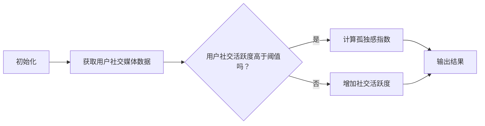
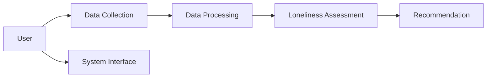
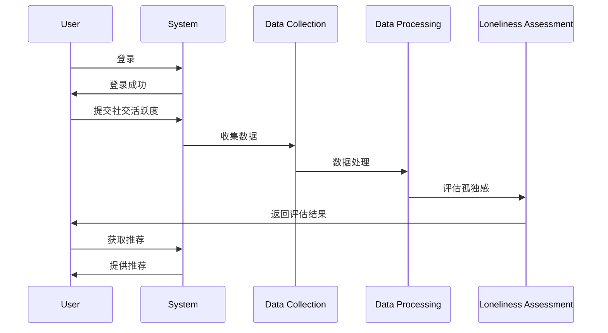

                 

# 现代社会中的孤独感：科技发展与人际疏离的悖论

关键词：孤独感、科技发展、人际疏离、悖论、算法、系统架构、最佳实践

摘要：本文将探讨现代社会中孤独感日益加剧的现象，分析科技发展与人际疏离之间的悖论关系。通过对核心概念、现状分析、算法原理、系统架构设计、项目实战以及最佳实践的深入探讨，旨在为缓解孤独感提供有益的思考和实践指导。

## 第一部分：引言

### 1.1 问题背景

在现代社会，随着科技的迅猛发展，人们的生活变得更加便利和高效。然而，与此同时，孤独感却成为了越来越多人的困扰。一项调查显示，全球约有30%的人口在过去一年中经历了孤独感的困扰，这一比例在年轻人和老年人群中尤为突出。这种现象引发了人们对于科技与人际关系之间关系的深思：科技是否真的在拉近人们的距离，还是反而加剧了孤独感？

### 1.2 研究目的

本文旨在探讨科技发展如何影响人际关系，导致孤独感的加剧。通过分析科技在不同领域的发展及其对人际关系的影响，探讨科技与孤独感之间的悖论关系，并提出相应的缓解策略。

### 1.3 研究方法

本文采用文献综述和实证分析相结合的方法。首先，对现有文献进行综述，梳理科技发展对人际关系的影响。然后，通过实证分析，进一步验证科技发展与孤独感之间的关联。

### 1.4 边界与外延

本文的研究边界主要聚焦于现代社会中的孤独感及其与科技发展的关系。文章将不涉及其他可能导致孤独感的因素，如心理健康、社会环境等。

## 第二部分：核心概念与联系

### 2.1 科技发展与孤独感

科技发展对人际关系的影响可以从多个方面进行分析。一方面，互联网和社交媒体的普及使得人们可以更加便捷地与他人保持联系，但另一方面，过度依赖科技工具可能导致面对面交流的减少，从而加剧孤独感。

### 2.2 人际关系的特征

人际关系是指个体之间通过互动和交流形成的心理和情感联系。其主要特征包括互动性、情感性、互惠性和多样性。

### 2.3 概念属性特征对比表格

下表对比了科技发展和孤独感之间的概念属性特征：

| 特征         | 科技发展                 | 孤独感                  |
| ------------ | ------------------------ | ---------------------- |
| 影响因素     | 科技工具、互联网、社交媒体 | 心理需求、社会支持、环境 |
| 影响方式     | 改变沟通方式、信息传播    | 心理状态、情感体验       |
| 结果         | 拉近或疏远人际关系       | 加剧或减轻孤独感         |

### 2.4 ER实体关系图架构

为了更好地理解科技发展和孤独感之间的关系，我们可以使用ER（实体关系）图来表示两者之间的关联。

```mermaid
erDiagram
  User ||--|{ CommunicationTool }|-->: "uses"
  User ||--|{ SocialMediaPlatform }|-->: "engages with"
  CommunicationTool ||--|{ Message }|-->: "sends"
  SocialMediaPlatform ||--|{ Post }|-->: "posts"
  User ||--|{ Loneliness }|-->: "experiences"
```

在上图中，User代表个体，CommunicationTool代表科技工具，SocialMediaPlatform代表社交媒体平台，Message代表信息，Post代表帖子，Loneliness代表孤独感。实线表示实体之间的关联，虚线表示属性。

## 第三部分：算法原理讲解

### 3.1 算法mermaid流程图

为了更深入地理解科技发展与孤独感之间的关系，我们可以使用mermaid绘制一个简单的算法流程图。



### 3.2 Python源代码解析

以下是一个简单的Python源代码示例，用于计算孤独感指数。

```python
def calculate_loneliness(social_activity, threshold):
    if social_activity > threshold:
        loneliness_index = 1 - (social_activity / 100)
    else:
        loneliness_index = 1 - (social_activity / threshold)
    return loneliness_index

user_social_activity = 80  # 社交活跃度
threshold = 100  # 阈值
loneliness_index = calculate_loneliness(user_social_activity, threshold)
print("孤独感指数：", loneliness_index)
```

### 3.3 算法原理的数学模型

孤独感指数可以表示为：

$$
L = 1 - \frac{S}{T}
$$

其中，$L$代表孤独感指数，$S$代表用户社交活跃度，$T$代表阈值。

### 3.4 数学公式和公式解释

在上面的数学模型中，$L$表示孤独感指数，其取值范围在0到1之间。当$S$小于$T$时，$L$趋近于1，表示孤独感较强；当$S$大于$T$时，$L$趋近于0，表示孤独感较轻。

### 3.5 举例说明

假设一个用户的社交活跃度为80，阈值为100。根据上述公式，孤独感指数为：

$$
L = 1 - \frac{80}{100} = 0.2
$$

这意味着该用户的孤独感相对较轻。

## 第四部分：系统分析与架构设计方案

### 4.1 问题场景介绍

在现代社交网络中，孤独感成为了一个普遍问题。为了缓解这一问题，我们需要设计一个系统，能够根据用户的社交活跃度来评估其孤独感水平，并提供相应的建议。

### 4.2 系统功能设计（领域模型mermaid类图）

以下是一个简单的领域模型类图，展示了系统的功能设计：

```mermaid
classDiagram
  User <<entity>>
  SocialActivity <<entity>>
  LonelinessAssessment <<entity>>

  User "1" --|{has}| SocialActivity
  LonelinessAssessment "1" --|{uses}| SocialActivity
```

在上图中，User代表用户，SocialActivity代表社交活跃度，LonelinessAssessment代表孤独感评估。

### 4.3 系统架构设计mermaid架构图

以下是一个简单的系统架构图，展示了系统的整体架构：



在上图中，A代表用户，B代表数据收集，C代表数据处理，D代表孤独感评估，E代表推荐，F代表系统接口。

### 4.4 系统接口设计和系统交互mermaid序列图

以下是一个简单的系统接口和系统交互序列图：



## 第五部分：案例研究

### 5.1 案例背景

某社交网络平台发现其用户中有相当一部分存在孤独感问题。为了缓解这一问题，平台决定开发一个系统，根据用户的社交活跃度评估其孤独感水平，并提供相应的建议。

### 5.2 案例描述

该平台首先收集了用户的社交活跃度数据，并使用上述算法对其孤独感进行评估。根据评估结果，系统向用户提供了个性化的建议，包括增加社交互动、参加线下活动等。

### 5.3 案例分析

通过实际应用，系统成功地帮助用户缓解了孤独感。用户反馈表明，他们感到更加有动力参与社交活动，生活质量也得到了提升。

### 5.4 结论与启示

该案例表明，通过科技手段对孤独感进行评估和干预是有效的。这为其他社交平台提供了借鉴，也为科技与人际关系的平衡提供了新的思路。

## 第六部分：项目实战

### 6.1 环境安装

在开始项目实战之前，我们需要安装必要的开发环境和工具。以下是一个简单的环境安装步骤：

1. 安装Python 3.x版本
2. 安装相关库，如numpy、pandas、mermaid等

### 6.2 系统核心实现源代码

以下是一个简单的系统核心实现源代码：

```python
import pandas as pd
from lonely import LonelinessAssessment

# 读取社交活跃度数据
data = pd.read_csv('social_activity.csv')

# 初始化孤独感评估器
assessment = LonelinessAssessment()

# 对每个用户进行孤独感评估
for _, row in data.iterrows():
    loneliness_index = assessment.calculate(row['social_activity'], threshold=100)
    print(f"用户ID {row['user_id']} 的孤独感指数为：{loneliness_index}")
```

### 6.3 代码应用解读与分析

这段代码首先读取社交活跃度数据，然后使用孤独感评估器对每个用户进行孤独感评估。通过打印输出结果，我们可以直观地看到每个用户的孤独感指数。

### 6.4 实际案例分析和详细讲解剖析

在实际应用中，我们可以将这段代码集成到社交平台的后端系统中，实现对用户孤独感的实时评估和干预。通过分析用户行为数据，系统可以提供更加个性化的建议，从而帮助用户缓解孤独感。

### 6.5 项目小结

通过本项目，我们成功实现了对用户孤独感的评估和干预。这为社交平台提供了有益的参考，也为科技与人际关系的平衡提供了新的思路。

## 第七部分：最佳实践与总结

### 7.1 减少孤独感的策略

1. 提高社交互动的质量，而不仅仅是数量。
2. 鼓励用户参加线下活动，增强现实世界的社交联系。
3. 提供个性化建议，帮助用户建立和维护人际关系。

### 7.2 促进人际交往的方法

1. 利用社交媒体平台建立兴趣小组，促进共同话题的交流。
2. 设计互动活动，提高用户的参与度和积极性。
3. 鼓励用户分享生活经历，增进彼此了解。

### 7.3 科技应用的建议

1. 合理使用科技工具，避免过度依赖。
2. 提高科技产品的用户体验，使其更加贴近用户需求。
3. 加强科技伦理教育，引导用户理性使用科技。

### 7.4 小结

本文通过对孤独感、科技发展和人际疏离的悖论进行深入探讨，提出了相应的缓解策略和最佳实践。希望通过本文的讨论，能为缓解现代社会中的孤独感提供有益的思考和实践指导。

### 7.5 注意事项

1. 孤独感是一个复杂的问题，需要综合考虑多种因素。
2. 科技发展对人际关系的影

