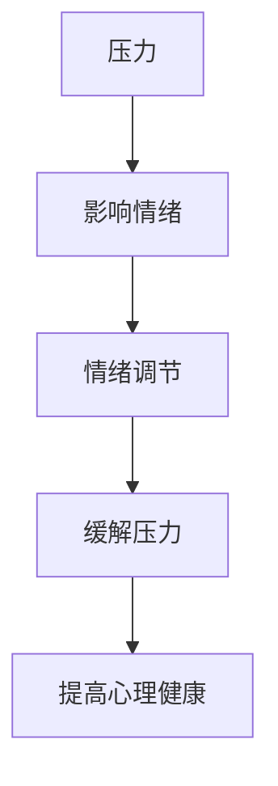

                 

# 社会现代中的心理健康：压力管理与情绪调节

> 关键词：心理健康，压力管理，情绪调节，生活方式，职业发展

> 摘要：本文旨在探讨现代社会中心理健康的重要性，特别是压力管理与情绪调节对个人生活和社会发展的深远影响。文章通过逻辑清晰、结构紧凑的论述，为读者提供了关于如何有效管理和调节情绪、减轻压力的具体策略，以促进心理健康。文章还结合了实际案例，为不同人群提供了实用的指导和建议。

## 前言

### 1.1 书籍背景与目的

随着现代社会节奏的加快，人们面临的生活和工作压力日益增大，心理健康问题逐渐成为全球关注的焦点。心理健康不仅影响个人的生活质量，还对社会的稳定和发展产生重要影响。因此，研究心理健康，尤其是压力管理和情绪调节，具有重要的现实意义。

本书旨在为读者提供一套科学、系统、实用的心理健康管理指南。通过深入分析心理健康的基本概念、压力与情绪调节的策略，以及生活方式和职业发展对心理健康的影响，帮助读者理解心理健康的重要性，掌握有效的压力管理和情绪调节方法，从而提升生活质量，促进个人和社会的发展。

### 1.2 心理健康的定义与分类

心理健康是指个体在认知、情感、行为和社交等方面的健康状态。它不仅仅是没有心理疾病，而是一种积极的、适应性的生活状态。

心理健康可以从多个维度进行分类，包括：

- **心理健康状态**：个体在特定时间内的心理健康状态，如情绪稳定、人际关系和谐等。
- **心理健康问题**：包括焦虑、抑郁、精神分裂等心理疾病。
- **心理健康素质**：个体应对压力、适应环境的能力，如情绪调节能力、心理弹性等。

心理健康的核心要素包括：

- **情绪稳定**：能够合理表达和处理情绪，保持情绪的平衡。
- **社交和谐**：与他人的良好互动，建立积极的人际关系。
- **自我认知**：正确认识自己，包括自己的优点和缺点。
- **自我调节**：能够自我控制和调节情绪、行为和认知。

### 1.3 压力管理与情绪调节的关系

压力管理与情绪调节是心理健康的重要组成部分。压力是指个体在面临生活事件时感受到的威胁或挑战。压力的来源多种多样，包括工作压力、生活压力、社交压力等。

情绪调节是指个体对自身情绪状态的管理和调整。良好的情绪调节能力有助于缓解压力，提高心理健康水平。

压力管理与情绪调节之间的关系如下：

- **压力导致情绪变化**：长期的压力会导致个体产生焦虑、抑郁等情绪问题。
- **情绪调节缓解压力**：通过有效的情绪调节策略，个体可以减轻压力带来的负面影响。
- **两者相互影响**：有效的压力管理有助于提高情绪调节能力，而良好的情绪调节也有助于减轻压力。

### 1.4 心理健康对现代社会的影响

心理健康对现代社会的影响深远且广泛，涉及个人生活、社会发展以及家庭和谐等多个方面。

- **个人生活**：心理健康良好的个体能够更好地应对生活中的挑战，保持积极的生活态度，提高生活质量。
- **社会发展**：一个心理健康水平较高的社会，能够更稳定、更和谐地发展，减少社会矛盾和冲突。
- **家庭和谐**：心理健康有助于家庭成员之间的良好沟通和互动，促进家庭关系的和谐。

### 1.5 本书结构与内容安排

本书分为五个部分：

- **第一部分：前言**：介绍书籍的背景与目的，心理健康的基本概念和重要性。
- **第二部分：压力管理**：探讨压力管理的基本概念、影响和策略。
- **第三部分：情绪调节**：分析情绪调节的基本概念、障碍和策略。
- **第四部分：心理健康与生活方式**：讨论生活方式对心理健康的影响以及如何维护心理健康。
- **第五部分：心理健康与职业发展**：探讨职场压力与心理健康的关系，以及如何维护职场心理健康。

读者可以通过本书系统地了解心理健康的相关知识，掌握有效的压力管理和情绪调节方法，从而提升心理健康水平，享受更加美好的生活。

### 1.6 本章小结

本章从背景介绍、定义与分类、压力与情绪调节的关系、影响以及书籍结构等方面，全面阐述了心理健康的重要性。接下来，本书将深入探讨压力管理和情绪调节的具体策略，帮助读者更好地应对生活中的压力，维护心理健康。

----------------------------------------------------------------

# 第二部分：压力管理

## 2.1 压力管理的基本概念

### 2.1.1 压力的定义

压力是指个体在面临生活事件或挑战时感受到的紧张状态。这种紧张状态可能导致生理、心理和行为上的反应。压力的来源多种多样，包括工作压力、生活压力、社交压力等。

### 2.1.2 压力的类型

压力可以分为急性压力和慢性压力：

- **急性压力**：短期内突然出现的压力，如考试、面试等。
- **慢性压力**：长期存在的压力，如工作压力、家庭矛盾等。

### 2.1.3 压力的来源

压力的来源包括：

- **工作压力**：工作任务繁重、工作环境不理想等。
- **生活压力**：经济压力、家庭矛盾、人际关系等。
- **社交压力**：社交活动、社交关系等。

### 2.1.4 压力的表现形式

压力的表现形式多样，包括：

- **生理反应**：如失眠、头痛、胃痛等。
- **心理反应**：如焦虑、抑郁、愤怒等。
- **行为反应**：如逃避、攻击、过度消费等。

### 2.1.5 压力的负面影响

长期的压力对身心健康产生负面影响，包括：

- **心理健康问题**：如焦虑、抑郁等。
- **生理健康问题**：如心脏病、高血压等。
- **社交关系问题**：如人际关系紧张、家庭矛盾等。

### 2.1.6 压力的调节

压力的调节包括：

- **认知调节**：改变对压力事件的看法和解释。
- **行为调节**：通过锻炼、休息等行为来减轻压力。
- **情绪调节**：通过情绪调节技巧来缓解压力。

## 2.2 压力的影响

### 2.2.1 压力对心理健康的影响

压力对心理健康的影响显著，可能导致以下问题：

- **焦虑**：长期的压力可能导致焦虑情绪的持续存在。
- **抑郁**：严重的压力可能导致抑郁症状，如情绪低落、失去兴趣等。
- **心理疲劳**：长期的压力可能导致心理疲劳，影响个体的工作能力和生活质量。

### 2.2.2 压力对生理健康的影响

压力对生理健康的影响包括：

- **免疫系统功能下降**：长期的压力可能导致免疫系统功能下降，增加患病的风险。
- **心血管健康问题**：长期的压力可能导致心血管疾病，如高血压、心脏病等。
- **消化系统问题**：压力可能导致消化系统问题，如胃痛、胃溃疡等。

### 2.2.3 压力对社交关系的影响

压力对社交关系的影响包括：

- **人际关系紧张**：长期的压力可能导致人际关系紧张，影响家庭、朋友和同事的关系。
- **社交回避**：压力可能导致个体回避社交活动，减少社交互动。
- **家庭矛盾**：压力可能导致家庭矛盾加剧，影响家庭和谐。

### 2.2.4 压力的综合影响

压力的综合影响体现在以下几个方面：

- **工作效率降低**：长期的压力可能导致工作效率降低，影响工作和学业。
- **生活质量下降**：长期的压力可能导致生活质量下降，影响身心健康。
- **心理健康问题**：长期的、无法缓解的压力可能导致严重的心理健康问题，如抑郁症、焦虑症等。

### 2.2.5 压力的缓解策略

缓解压力的策略包括：

- **时间管理**：合理安排时间，避免过度工作。
- **锻炼**：定期锻炼有助于减轻压力，提高身心健康。
- **休息**：保证充足的睡眠，有助于缓解压力。
- **社交支持**：寻求家人、朋友和专业人士的支持和帮助。
- **认知重构**：改变对压力事件的看法和解释，从积极的角度看待问题。

## 2.3 压力管理的策略与方法

### 2.3.1 认知行为疗法

认知行为疗法是一种通过改变思维和行为来减轻压力的心理治疗方法。它主要包括以下几个方面：

- **认知重构**：通过识别和挑战负面思维，改变对压力事件的看法和解释。
- **行为激活**：通过增加积极行为，减少消极行为，提高生活质量。
- **技能训练**：通过技能训练，如时间管理、情绪调节等，提高应对压力的能力。

### 2.3.2 正念冥想

正念冥想是一种通过集中注意力和意识来减轻压力的方法。它主要包括以下几个方面：

- **呼吸练习**：通过深呼吸来放松身心，减轻压力。
- **身体扫描**：通过扫描身体各个部位，识别和释放身体的紧张和不适。
- **正念饮食**：通过专注地感受食物的味道和口感，减轻进食时的压力。

### 2.3.3 睡眠管理

睡眠管理是一种通过改善睡眠质量来减轻压力的方法。它主要包括以下几个方面：

- **规律作息**：保持规律的作息时间，有助于提高睡眠质量。
- **睡眠环境**：创造一个安静、舒适的睡眠环境，有助于改善睡眠。
- **睡前放松**：通过冥想、阅读等方式，帮助身心放松，进入睡眠状态。

### 2.3.4 锻炼与运动

锻炼与运动是一种通过身体活动来减轻压力的方法。它主要包括以下几个方面：

- **有氧运动**：如跑步、游泳等，有助于提高心肺功能，减轻压力。
- **力量训练**：如举重、俯卧撑等，有助于增强肌肉力量，提高身体素质。
- **灵活性训练**：如瑜伽、普拉提等，有助于提高身体的灵活性，减轻压力。

### 2.3.5 社交支持

社交支持是一种通过社交互动来减轻压力的方法。它主要包括以下几个方面：

- **寻求支持**：向家人、朋友和专业人士寻求支持和帮助。
- **社交互动**：通过参加社交活动，增加社交互动，提高心理健康水平。
- **互助小组**：加入互助小组，与他人分享经验和感受，减轻压力。

## 2.4 压力管理的案例分析

### 2.4.1 案例一：职场压力管理

小王是一名软件工程师，他的工作压力非常大，经常感到焦虑和疲劳。通过认知行为疗法和锻炼，小王学会了如何有效地管理压力。他开始每天早上进行正念冥想，晚上进行深呼吸练习，同时增加了锻炼的频率。几个月后，小王的压力水平明显降低，工作效率也提高了。

### 2.4.2 案例二：学生压力管理

小李是一名高中生，面临着学业压力和家庭期望。她通过睡眠管理和社交支持来减轻压力。她开始保持规律的作息时间，每天晚上进行身体扫描放松，同时与朋友和家人保持良好的沟通。通过这些方法，小李的压力水平得到了有效控制，她的学习成绩也有所提升。

### 2.4.3 案例三：家庭压力管理

张先生是一名家庭主妇，她的家庭生活压力很大，经常感到疲惫和焦虑。她通过锻炼和社交支持来减轻压力。她开始每天早晨进行瑜伽练习，晚上与朋友一起散步。同时，她加入了一个互助小组，与其他家庭主妇分享经验和感受。通过这些方法，张先生的家庭生活压力明显减轻，家庭关系也得到了改善。

## 2.5 本章小结

本章详细介绍了压力管理的基本概念、影响、策略和方法。通过案例分析和实践经验，读者可以了解到压力管理的具体方法和效果。在接下来的章节中，我们将进一步探讨情绪调节的重要性以及如何有效进行情绪调节。

----------------------------------------------------------------

## 第三部分：情绪调节

### 3.1 情绪调节的基本概念

情绪调节是指个体对自身情绪状态的管理和调整。情绪是人类心理体验的重要组成部分，包括愉快、悲伤、愤怒、焦虑等多种类型。情绪调节的目的是使个体在面对压力和挑战时能够保持情绪稳定，从而更好地适应环境。

### 3.1.1 情绪的定义与分类

情绪是指个体在特定情境下产生的主观体验，通常伴随有生理和心理反应。情绪可以分为以下几类：

- **积极情绪**：如快乐、满足、兴奋等，对个体的身心健康有积极作用。
- **消极情绪**：如愤怒、恐惧、悲伤等，对个体的身心健康有负面影响。
- **复合情绪**：由多种基本情绪混合而成，如焦虑、羞愧等。

### 3.1.2 情绪调节的定义

情绪调节是指个体通过认知、行为和生理等多种方式，调整和适应自身情绪状态的过程。有效的情绪调节能够帮助个体在面对压力和挑战时保持情绪稳定，提高心理韧性。

### 3.1.3 情绪调节的重要性

情绪调节在个体的心理健康和生活中起着至关重要的作用：

- **提高心理韧性**：有效的情绪调节能力有助于个体更好地应对生活中的挑战和压力。
- **促进心理健康**：良好的情绪调节能力有助于预防焦虑、抑郁等心理问题。
- **改善社交关系**：有效的情绪调节有助于个体在社交互动中表现出积极的情绪，建立和谐的人际关系。
- **提高生活质量**：良好的情绪调节能力有助于提高个体的整体生活质量，使个体能够更好地享受生活。

### 3.1.4 情绪调节的核心要素

情绪调节的核心要素包括：

- **认知重构**：通过改变对事件的认知和解释，调整情绪反应。
- **情绪识别**：准确识别和理解自身的情绪状态。
- **情绪表达**：适当地表达和沟通情绪，避免压抑或过度表达。
- **情绪管理**：通过行为和生理调节，有效管理和调整情绪。

### 3.1.5 情绪调节的基本策略

情绪调节的基本策略包括：

- **认知重构**：通过改变对事件的认知和解释，调整情绪反应。
- **情绪表达**：适当地表达和沟通情绪，避免压抑或过度表达。
- **情绪放松**：通过深呼吸、冥想等方式，放松身心，缓解情绪。
- **积极思考**：培养积极思维，从积极的角度看待问题，减轻负面情绪的影响。

### 3.1.6 情绪调节的好处

情绪调节的好处包括：

- **提高心理健康**：有效的情绪调节有助于预防焦虑、抑郁等心理问题。
- **增强社交能力**：良好的情绪调节能力有助于个体在社交互动中表现出积极的情绪，建立和谐的人际关系。
- **提升生活质量**：良好的情绪调节能力有助于提高个体的整体生活质量，使个体能够更好地享受生活。
- **增强心理韧性**：有效的情绪调节能力有助于个体更好地应对生活中的挑战和压力。

### 3.1.7 情绪调节的挑战

情绪调节的挑战包括：

- **情绪复杂性**：情绪调节需要应对复杂的情绪体验，如焦虑、愤怒和悲伤的混合。
- **认知偏见**：个体往往存在认知偏见，如过度关注负面信息，这会影响情绪调节的效果。
- **文化差异**：不同的文化背景下，情绪表达和调节方式可能有所不同，需要考虑文化差异。

### 3.1.8 情绪调节的实践建议

为了提高情绪调节能力，可以采取以下实践建议：

- **自我观察**：定期进行自我观察，了解自己的情绪状态，及时发现和调整情绪。
- **情绪记录**：通过记录情绪日记，分析情绪变化规律，找到有效的情绪调节方法。
- **寻求支持**：向家人、朋友或专业人士寻求支持和帮助，分享情绪体验，减轻情绪负担。
- **学习和练习**：学习情绪调节技巧，如深呼吸、冥想、认知重构等，并定期进行实践。

### 3.1.9 情绪调节的案例分析

#### 案例一：愤怒管理

小张在工作场合中经常因为同事的行为感到愤怒，影响了工作效率和人际关系。通过认知重构和情绪表达技巧，小张学会了从积极的角度看待问题，合理表达自己的情绪。他开始使用“我感到愤怒，是因为我需要更多的理解和支持”这样的表达方式，而不是直接指责他人。经过一段时间的练习，小张的愤怒情绪得到了有效调节，工作效率和人际关系都得到了改善。

#### 案例二：焦虑管理

小丽在参加重要考试前总是感到焦虑，影响了考试发挥。她通过深呼吸和冥想技巧，学会了在考试前放松身心，调整情绪。她还制定了详细的复习计划，减少焦虑感。在考试过程中，小丽运用了深呼吸技巧，使自己的心情保持平静。最终，小丽在考试中取得了优异成绩。

#### 案例三：悲伤管理

小李的母亲去世后，他感到非常悲伤，难以恢复正常生活。他通过寻求专业心理咨询和情绪表达技巧，学会了如何面对悲伤情绪。他参加了一个丧亲者的支持小组，与同龄人分享自己的感受，获得了情感上的支持。通过这些方法，小李逐渐走出了悲伤，重新开始了新的生活。

### 3.1.10 本章小结

情绪调节是心理健康的重要组成部分，对于个体的生活质量和心理韧性具有重要作用。通过了解情绪调节的基本概念、策略和实践，读者可以学会如何有效地管理和调节情绪，提高心理健康水平。在接下来的章节中，我们将进一步探讨心理健康与生活方式、心理健康与职业发展的关系，帮助读者全面了解和应对心理健康问题。

----------------------------------------------------------------

## 第四部分：心理健康与生活方式

### 4.1 生活方式对心理健康的影响

生活方式是影响心理健康的重要因素。健康的生活方式可以促进心理健康，而不健康的生活方式则可能对心理健康产生负面影响。

#### 4.1.1 饮食与心理健康

饮食对心理健康具有重要影响。合理的饮食可以提供身体所需的营养，维持身体和心理健康。

- **营养均衡**：均衡的饮食有助于保持身体健康，提高免疫力，减少心理问题的发生。
- **减少加工食品**：加工食品中常含有过多的添加剂和防腐剂，可能对心理健康产生不利影响。
- **摄入足够的水分**：充足的水分摄入有助于保持身体的水平衡，促进新陈代谢，改善心理健康。
- **限制糖分摄入**：高糖饮食可能导致情绪波动和焦虑，限制糖分摄入有助于改善心理健康。

#### 4.1.2 睡眠与心理健康

睡眠是保持心理健康的重要因素。良好的睡眠有助于恢复精力，调节情绪，提高心理韧性。

- **保持规律的作息时间**：规律的作息时间有助于调整身体的生物钟，促进睡眠质量的提高。
- **创造良好的睡眠环境**：良好的睡眠环境，如安静的卧室、舒适的床铺和适宜的室温，有助于提高睡眠质量。
- **避免夜间使用电子产品**：夜间使用电子产品会发出蓝光，影响褪黑激素的分泌，干扰睡眠。
- **睡前放松**：睡前进行深呼吸、冥想等放松活动，有助于减轻压力，进入良好的睡眠状态。

#### 4.1.3 社交与心理健康

社交活动对心理健康具有重要影响。积极的社交活动可以增强个体的心理韧性，提高心理健康水平。

- **建立稳定的社交网络**：与家人、朋友和同事建立良好的关系，有助于缓解压力，提高心理健康。
- **参与社交活动**：参与社区活动、志愿者工作等社交活动，有助于建立归属感，提高生活质量。
- **倾听与倾诉**：与他人分享自己的感受和经历，倾听他人的意见和建议，有助于缓解心理压力，提高心理健康。
- **保持适度的社交互动**：适度的社交互动有助于满足社交需求，同时避免过度社交带来的压力。

#### 4.1.4 其他生活方式因素

除了饮食、睡眠和社交，其他生活方式因素也对心理健康产生重要影响。

- **锻炼**：定期锻炼有助于提高身体健康，增强心理韧性，缓解压力。
- **放松技巧**：学习并实践放松技巧，如冥想、瑜伽等，有助于减轻压力，提高心理健康。
- **心理调适**：培养乐观的心态，学会从积极的角度看待问题，有助于提高心理健康水平。
- **自我照顾**：关注自己的身心健康，定期进行自我反思和调整，有助于维持心理健康。

### 4.2 心理健康的维护与促进

维护和促进心理健康需要从多个方面入手，包括自我评估、心理健康的促进策略和心理健康的维护技巧。

#### 4.2.1 心理健康的自我评估

自我评估是了解自己心理健康状况的重要方法。可以通过以下方法进行自我评估：

- **心理健康问卷**：使用专业的心理健康问卷，如PHQ-9、GAD-7等，评估自己的心理健康水平。
- **自我反思**：定期反思自己的情绪、行为和思维方式，了解自己的心理健康状况。
- **寻求专业帮助**：如果怀疑自己存在心理健康问题，可以寻求专业心理咨询师的帮助。

#### 4.2.2 心理健康的促进策略

促进心理健康需要采取积极的策略，包括以下几个方面：

- **建立良好的生活习惯**：保持规律的作息时间，健康的饮食，适量的锻炼等。
- **培养积极的情绪调节能力**：学会有效地调节和管理情绪，如通过认知重构、情绪表达和放松技巧等。
- **增强心理韧性**：通过应对挑战、培养乐观心态等方式，增强心理韧性。
- **建立稳定的社交网络**：与家人、朋友和同事建立良好的关系，保持积极的社交互动。

#### 4.2.3 心理健康的维护技巧

维护心理健康需要采取一系列的技巧和方法，包括以下几个方面：

- **自我放松**：通过冥想、深呼吸、瑜伽等方式，缓解压力和紧张情绪。
- **情绪表达**：学会表达和处理自己的情绪，避免压抑或过度表达。
- **自我照顾**：关注自己的身心健康，定期进行自我反思和调整。
- **寻求支持**：在遇到困难和挑战时，向家人、朋友或专业人士寻求支持和帮助。

### 4.3 心理健康与疾病预防

心理健康与疾病预防密切相关。心理健康良好的人更容易保持健康的生活习惯，减少疾病的风险。

#### 4.3.1 心理健康与疾病预防的关系

心理健康与疾病预防之间的关系体现在以下几个方面：

- **心理因素影响生理健康**：心理健康状况良好的个体，其生理健康水平通常较高，患病风险较低。
- **心理压力与疾病发生**：长期的心理压力可能导致生理系统的紊乱，增加患病风险。
- **心理健康促进健康行为**：心理健康有助于个体采取健康的生活方式和行为，减少疾病的风险。

#### 4.3.2 心理健康与疾病预防的策略

为了预防疾病，可以采取以下策略：

- **维护心理健康**：通过心理健康维护策略，如自我评估、情绪调节、压力管理等，提高心理健康水平。
- **健康生活方式**：保持健康的生活习惯，如均衡饮食、适量运动、充足睡眠等，降低疾病风险。
- **疾病早期筛查**：定期进行健康检查，早期发现和治疗疾病。
- **寻求专业帮助**：在遇到心理或健康问题时，及时寻求专业心理咨询或医疗帮助。

#### 4.3.3 心理健康与疾病预防的实践

以下是一些具体的实践方法：

- **定期体检**：每年进行一次全面的体检，早期发现和治疗疾病。
- **健康饮食**：摄入均衡的营养，减少加工食品和高糖食品的摄入。
- **适量运动**：每周至少进行150分钟的中等强度运动，如快走、游泳等。
- **情绪调节**：学会情绪调节技巧，如深呼吸、冥想等，减轻压力和焦虑。
- **心理健康咨询**：在遇到心理问题时，寻求专业心理咨询师的帮助，维护心理健康。

### 4.4 心理健康与家庭关系

心理健康对家庭关系具有重要影响。一个心理健康的人能够更好地处理家庭关系，促进家庭和谐。

#### 4.4.1 家庭关系对心理健康的影响

家庭关系对心理健康的影响包括：

- **情感支持**：良好的家庭关系提供情感支持，有助于提高心理健康水平。
- **压力缓解**：与家人共享压力，减轻个体的心理负担。
- **角色冲突**：家庭角色冲突可能导致心理压力，影响心理健康。

#### 4.4.2 心理健康在家庭关系中的作用

心理健康在家庭关系中的作用包括：

- **促进沟通**：心理健康有助于家庭成员之间更好地沟通和交流。
- **解决冲突**：心理健康有助于家庭成员更好地解决冲突，维护家庭和谐。
- **提供支持**：心理健康的人能够为家庭成员提供情感支持和帮助。

#### 4.4.3 促进家庭心理健康的方法

为了促进家庭心理健康，可以采取以下方法：

- **建立良好的沟通**：与家人保持开放、真诚的沟通，分享情感和需求。
- **共同参与活动**：与家人共同参与娱乐活动、户外运动等，增强家庭凝聚力。
- **提供支持**：在家人遇到困难时，提供情感支持和实际帮助。
- **家庭心理咨询**：在家庭关系出现问题时，寻求专业家庭心理咨询帮助。

### 4.5 本章小结

心理健康与生活方式、家庭关系密切相关。通过了解生活方式对心理健康的影响，采取有效的维护和促进策略，我们可以提高心理健康水平，享受更美好的生活。在接下来的章节中，我们将进一步探讨心理健康与职业发展的关系，帮助读者在职业领域更好地应对心理健康问题。

----------------------------------------------------------------

## 第五部分：心理健康与职业发展

### 5.1 职场压力与心理健康

在现代社会中，职场压力已成为影响员工心理健康的重要因素。职场压力的来源多种多样，包括工作负担、人际关系、职业发展压力等。长期承受过大的职场压力可能导致心理健康问题，如焦虑、抑郁、失眠等。

#### 5.1.1 职场压力的定义与来源

职场压力是指员工在工作过程中感受到的压力和挑战。职场压力的来源主要包括：

- **工作负担**：工作量大、任务紧急、工作时间长等。
- **人际关系**：与同事、上司或下属之间的冲突和矛盾。
- **职业发展**：对职业前景的不确定、职位晋升的压力等。
- **工作环境**：工作环境不良、工作氛围紧张等。

#### 5.1.2 职场压力对心理健康的影响

职场压力对心理健康的影响显著，可能导致以下问题：

- **焦虑和抑郁**：长期承受职场压力可能导致焦虑和抑郁症状，影响生活质量。
- **心理健康问题**：严重的职场压力可能导致心理健康问题，如精神分裂、躁郁症等。
- **工作效率下降**：职场压力可能导致工作效率下降，影响工作表现。
- **社交关系紧张**：职场压力可能导致员工与同事、上司或下属之间的关系紧张，影响团队合作。

#### 5.1.3 职场压力管理的策略

为了有效管理职场压力，可以采取以下策略：

- **时间管理**：合理安排工作，避免过度劳累，确保充足的休息。
- **情绪调节**：学会情绪调节技巧，如深呼吸、冥想等，减轻压力。
- **社交支持**：寻求家人、朋友和同事的支持和帮助，缓解压力。
- **职业发展规划**：制定明确的职业发展目标，合理规划职业生涯。
- **工作与生活平衡**：确保工作与生活的平衡，减少工作对生活的影响。

### 5.2 职业心理健康的重要性

职业心理健康是指员工在工作中的心理健康状态，包括情绪稳定、心理韧性、工作满意度等。职业心理健康对员工的职业发展、工作效率和生活质量具有重要影响。

#### 5.2.1 职业心理健康的概念

职业心理健康是指员工在工作过程中的心理健康状态，包括情绪管理、心理韧性、工作满意度、职业认同感等。良好的职业心理健康有助于提高工作效率、促进职业发展，并提升生活质量。

#### 5.2.2 职业心理健康对职业发展的影响

职业心理健康对职业发展的影响包括：

- **工作效率**：良好的职业心理健康有助于提高工作效率，减少工作失误。
- **职业发展**：职业心理健康良好的员工更容易获得晋升机会和职业发展。
- **工作满意度**：职业心理健康有助于提高员工对工作的满意度，减少离职率。
- **职业认同感**：职业心理健康有助于增强员工的职业认同感，提高工作积极性。

#### 5.2.3 职业心理健康的发展趋势

随着社会对心理健康重视程度的提高，职业心理健康正逐渐成为企业管理和人力资源发展的关注点。未来，职业心理健康的发展趋势包括：

- **企业关注**：越来越多的企业开始关注员工的职业心理健康，提供相应的心理支持和资源。
- **个性化服务**：职业心理健康服务将更加注重个性化，根据员工的具体需求和情况提供定制化的支持。
- **技术整合**：心理健康与科技的结合将推动心理健康服务的发展，如利用人工智能、虚拟现实等技术提供更高效的干预和治疗方案。

### 5.3 职场心理健康的维护

维护职场心理健康需要从多个方面入手，包括企业、员工和管理者的共同努力。

#### 5.3.1 职场心理健康自我维护

员工可以通过以下方法自我维护职场心理健康：

- **情绪管理**：学会情绪调节技巧，如深呼吸、冥想等，减轻工作压力。
- **健康生活**：保持健康的生活习惯，如规律作息、均衡饮食、适量运动等。
- **积极心态**：培养积极的心态，从积极的角度看待问题，提高心理韧性。
- **社交互动**：保持良好的社交互动，与同事、家人和朋友分享情感和体验。

#### 5.3.2 企业心理健康支持

企业可以通过以下措施提供心理健康支持：

- **员工心理健康培训**：定期开展心理健康培训，提高员工的情绪调节能力和心理健康水平。
- **心理健康咨询服务**：提供专业的心理健康咨询服务，帮助员工解决心理问题。
- **健康福利政策**：制定健康福利政策，如健身补贴、心理咨询等，支持员工保持健康的生活方式。
- **工作与生活平衡**：鼓励员工工作与生活的平衡，提供灵活的工作安排和远程工作机会。

#### 5.3.3 管理者心理健康促进

管理者可以通过以下方法促进职场心理健康：

- **积极沟通**：与员工保持良好的沟通，关注他们的心理健康状态。
- **支持与鼓励**：给予员工支持和鼓励，帮助他们应对职场压力。
- **团队建设**：通过团队建设活动，增强员工之间的凝聚力和支持。
- **健康领导**：以身作则，关注员工的身心健康，营造积极健康的工作氛围。

### 5.4 职场心理健康案例分析

#### 案例一：员工压力管理

小王是一名软件工程师，工作压力很大，经常感到焦虑和疲劳。通过情绪管理和健康生活方式的调整，小王学会了如何有效管理压力。他开始每天进行深呼吸练习和冥想，保持健康饮食和适量运动。同时，他向公司申请了心理咨询支持，与专业咨询师进行沟通，得到了有效的心理支持和建议。经过一段时间的努力，小王的工作效率和生活质量都得到了显著提高。

#### 案例二：团队心理健康促进

某科技公司注重员工的职场心理健康，通过一系列措施促进团队心理健康。公司定期举办心理健康讲座和培训，提高员工的情绪调节能力。此外，公司还为员工提供心理健康咨询服务，鼓励员工在工作压力大的情况下寻求帮助。公司还组织团队建设活动，增强员工之间的凝聚力和支持。通过这些措施，公司的员工心理健康水平显著提高，工作效率和团队合作能力也得到了提升。

#### 案例三：管理者心理健康引导

某公司的经理李先生意识到职场心理健康的重要性，开始关注员工的身心健康。他定期与员工进行一对一沟通，了解他们的心理状态和工作需求。同时，他鼓励员工积极面对挑战，提供支持和鼓励。李先生还组织团队活动，增强员工之间的互动和支持。通过这些措施，团队的士气和凝聚力得到了显著提升，员工的工作满意度和心理健康水平也得到了改善。

### 5.5 本章小结

职场压力对心理健康产生重要影响，维护职场心理健康需要企业、员工和管理者的共同努力。通过采取有效的策略和方法，我们可以提高员工的职业心理健康水平，促进职业发展，提升生活质量。在接下来的章节中，我们将进一步探讨心理健康在其他方面的应用和影响。

----------------------------------------------------------------

# 总结

本文通过深入探讨心理健康、压力管理和情绪调节的重要性，为读者提供了全面、系统的心理健康管理指南。我们首先从基本概念入手，详细介绍了心理健康、压力和情绪调节的定义、分类及其关系。接着，我们分析了压力对心理健康的影响以及如何通过认知行为疗法、正念冥想、睡眠管理和锻炼等策略进行压力管理。然后，我们探讨了情绪调节的基本概念、障碍和策略，并通过案例分析了情绪调节的实践方法。此外，我们还讨论了生活方式对心理健康的影响，提供了饮食、睡眠、社交等方面的建议。最后，我们探讨了心理健康与职业发展的关系，提供了职场压力管理、职业心理健康维护的方法。

心理健康是现代社会中不可忽视的重要问题，它不仅影响个人的生活质量，还对社会的稳定和发展产生深远影响。有效的压力管理和情绪调节是维护心理健康的关键。通过本文的阐述，我们希望读者能够更好地理解心理健康的重要性，掌握有效的压力管理和情绪调节方法，从而提升生活质量，享受更美好的生活。

# 拓展阅读与参考资料

为了进一步深入了解心理健康、压力管理和情绪调节的相关知识，读者可以参考以下书籍和资源：

- 《心理学与生活》（Psychology and Life）by Richard Gerrig & Philip Zimbardo
- 《认知行为疗法：原理与实践》（Cognitive Behavior Therapy: Basics and Beyond）by Judith S. Beck
- 《情绪调节：理论与实践》（Emotion Regulation: A Practical Guide for Clinicians and Researchers）by James J. Gross
- 《正念：此刻就是奇迹》（The Mindful Way Through Depression）by Mark Williams, John Teasdale & Zindel Segal
- 《职场心理学》（Work Psychology）by Michael Armstrong & John Barret

此外，读者还可以通过以下网站获取心理健康、压力管理和情绪调节的相关信息：

- 美国心理健康协会（American Psychological Association，http://www.apa.org）
- 世界卫生组织（World Health Organization，http://www.who.int）
- 心理咨询协会（National Association of Cognitive-Behavioral Therapists，http://www.nacbt.org）

通过阅读这些书籍和访问这些网站，读者可以更全面地了解心理健康、压力管理和情绪调节的知识，并在实际生活中运用这些方法，提高心理健康水平。

# 作者信息

作者：AI天才研究院/AI Genius Institute & 禅与计算机程序设计艺术 /Zen And The Art of Computer Programming

AI天才研究院致力于推动人工智能技术的发展，为读者提供前沿的技术知识和实用的解决方案。同时，我们关注心理学和哲学的融合，将禅与计算机程序设计艺术相结合，探索人类智能与机器智能的互动与融合。通过本文，我们希望为读者提供关于心理健康、压力管理和情绪调节的深入见解，帮助读者在个人生活和职业发展中更好地应对挑战，实现身心健康与和谐发展。希望本文能对您有所启发和帮助！## 心理健康的重要性

在现代社会中，心理健康已经成为一个备受关注的话题。随着社会竞争的加剧和生活方式的多样化，越来越多的人面临着来自工作、生活、人际关系等多方面的压力。心理健康不仅影响个人的生活质量，还对社会的稳定和发展产生重要影响。因此，了解心理健康的重要性，掌握有效的心理健康管理方法，对于每个人来说都至关重要。

### 心理健康的定义

心理健康是指个体在认知、情感、行为和社交等方面的健康状态。它不仅仅是没有心理疾病，而是一种积极的、适应性的生活状态。具体来说，心理健康包括以下几个方面：

1. **情绪稳定**：个体能够合理表达和处理情绪，保持情绪的平衡。
2. **社交和谐**：与他人的良好互动，建立积极的人际关系。
3. **自我认知**：正确认识自己，包括自己的优点和缺点。
4. **自我调节**：能够自我控制和调节情绪、行为和认知。

### 心理健康对个人生活的影响

心理健康对个人生活的影响深远而广泛，主要体现在以下几个方面：

1. **生活质量**：心理健康良好的个体能够更好地应对生活中的挑战，保持积极的生活态度，提高生活质量。
2. **工作表现**：心理健康有助于提高工作效率，减少工作失误，增强职业竞争力。
3. **人际关系**：心理健康有助于建立和维护良好的人际关系，增强社交能力，减少社交冲突。
4. **心理韧性**：心理健康良好的个体具有更强的心理韧性，能够更好地应对压力和挫折，减少心理问题。

### 心理健康对社会发展的影响

心理健康不仅影响个人生活，还对社会的稳定和发展产生深远影响：

1. **社会稳定**：一个心理健康水平较高的社会，其成员能够更好地适应环境，减少社会矛盾和冲突，维护社会稳定。
2. **经济发展**：心理健康良好的个体能够更加专注和高效地工作，提高生产力和创新能力，促进经济发展。
3. **公共健康**：心理健康与生理健康密切相关，良好的心理健康有助于减少心理健康问题的发生率，提高整体健康水平。
4. **教育质量**：心理健康良好的学生能够更好地学习、理解和应用知识，提高教育质量，培养未来的社会人才。

### 心理健康对家庭和谐的影响

家庭是社会的基本单位，心理健康对家庭和谐的影响不可忽视：

1. **家庭关系**：心理健康良好的家庭成员能够更好地处理家庭矛盾，增强家庭凝聚力，促进家庭和谐。
2. **亲子关系**：心理健康有助于父母更好地与孩子沟通，理解孩子的需求，建立良好的亲子关系。
3. **家庭支持**：心理健康良好的家庭成员能够为其他家庭成员提供情感支持和帮助，增强家庭的应对能力。

### 心理健康的维护与促进

为了维护和促进心理健康，可以从以下几个方面入手：

1. **自我认识**：了解自己的情绪、需求和目标，建立正确的自我认知。
2. **积极生活**：保持积极的生活态度，关注生活中的美好事物，培养乐观的心态。
3. **情绪调节**：学会情绪调节技巧，如深呼吸、冥想等，有效管理情绪。
4. **健康习惯**：保持健康的生活习惯，如规律的作息、均衡的饮食、适量的运动等。
5. **社交互动**：与他人保持良好的社交互动，建立积极的人际关系。

总之，心理健康是现代社会中不可忽视的重要问题。通过了解心理健康的重要性，采取有效的心理健康管理方法，我们可以提高生活质量，促进个人和社会的发展。希望本文能够为读者提供关于心理健康的深入见解，帮助读者更好地理解和维护心理健康。

### 心理健康的定义与分类

心理健康是指个体在认知、情感、行为和社交等方面的健康状态。它不仅仅是没有心理疾病，而是一种积极的、适应性的生活状态。具体来说，心理健康包括以下几个方面：

1. **情绪稳定**：个体能够合理表达和处理情绪，保持情绪的平衡。
2. **社交和谐**：与他人的良好互动，建立积极的人际关系。
3. **自我认知**：正确认识自己，包括自己的优点和缺点。
4. **自我调节**：能够自我控制和调节情绪、行为和认知。

#### 心理健康的分类

心理健康可以从多个维度进行分类，包括心理健康状态、心理健康问题和心理健康素质：

1. **心理健康状态**：个体在特定时间内的心理健康状态，如情绪稳定、人际关系和谐等。
   - **健康状态**：个体表现出积极、适应性的心理健康特征，如乐观、自信等。
   - **不稳定状态**：个体可能面临某些心理健康问题，但尚未达到疾病的程度。

2. **心理健康问题**：包括焦虑、抑郁、精神分裂等心理疾病。
   - **焦虑症**：长期感到紧张、不安，可能伴有恐慌发作。
   - **抑郁症**：情绪低落、兴趣减退，可能出现失眠、食欲不振等症状。
   - **精神分裂症**：认知功能受损，出现幻觉、妄想等症状。

3. **心理健康素质**：个体应对压力、适应环境的能力，如情绪调节能力、心理弹性等。
   - **情绪调节能力**：个体能够有效地管理和调节情绪，保持情绪的平衡。
   - **心理弹性**：个体在面对压力和挑战时，能够迅速恢复和适应，展现出较强的心理韧性。

#### 心理健康的核心要素

心理健康的核心要素包括以下几个部分：

1. **情绪稳定**：情绪稳定是心理健康的重要表现，能够帮助个体更好地应对生活中的挑战。
2. **社交和谐**：与他人建立积极的人际关系，有助于提升心理健康水平，减少孤独感和焦虑。
3. **自我认知**：正确认识自己，包括自己的优点和缺点，有助于个体更好地理解和应对自身情绪和行为。
4. **自我调节**：自我调节能力是心理健康的重要保障，能够帮助个体在面对压力和挑战时保持冷静和理智。

### 心理健康的核心要素组成

为了更直观地了解心理健康的核心要素，我们可以通过ER实体关系图来展示这些要素之间的关系：

```mermaid
erDiagram
    Class::心理健康核心要素
    |+--|> 个体情绪稳定
    |+--|> 社交和谐
    |+--|> 自我认知
    |+--|> 自我调节
```

在上述ER实体关系图中，心理健康核心要素包括个体情绪稳定、社交和谐、自我认知和自我调节，这些要素相互影响，共同构成一个健康的心理状态。

通过上述分析，我们可以清晰地看到心理健康的核心要素及其关系。理解这些要素，有助于我们更好地维护和促进心理健康，提升生活质量。在接下来的章节中，我们将深入探讨压力管理和情绪调节的具体策略，帮助读者在实践中更好地应用这些核心要素，提升心理健康水平。

### 压力管理与情绪调节的关系

在现代社会中，压力管理与情绪调节是维护心理健康的重要手段。它们不仅相互关联，而且在个体的心理健康中扮演着关键角色。理解压力管理与情绪调节之间的关系，有助于我们更好地应对生活中的各种挑战。

#### 压力的定义与来源

首先，我们需要明确压力的定义。压力是指个体在面临生活事件或挑战时感受到的紧张状态。这种紧张状态可能导致生理、心理和行为上的反应。压力的来源多种多样，包括以下几种：

1. **工作压力**：工作任务繁重、工作环境不理想、职业发展压力等。
2. **生活压力**：经济压力、家庭矛盾、人际关系等。
3. **社交压力**：社交活动、社交关系等。
4. **健康压力**：身体健康问题、慢性疾病等。

#### 情绪调节的概念与作用

情绪调节是指个体对自身情绪状态的管理和调整。情绪调节的作用主要体现在以下几个方面：

1. **缓解压力**：有效的情绪调节可以帮助个体减轻压力，避免因压力过大而导致的心理和生理问题。
2. **提高适应能力**：良好的情绪调节能力有助于个体在面对挑战时保持冷静和理智，提高适应环境的能力。
3. **增强心理韧性**：通过情绪调节，个体可以培养心理韧性，更好地应对未来的压力和挑战。
4. **改善生活质量**：有效的情绪调节有助于提升个体的生活满意度，增强幸福感。

#### 压力管理与情绪调节的关系

压力管理与情绪调节之间存在紧密的关系。具体表现在以下几个方面：

1. **相互影响**：压力和情绪调节相互影响。一方面，压力可能导致情绪调节能力下降；另一方面，不良的情绪调节可能导致压力增加。

2. **共同目标**：压力管理和情绪调节的目标都是为了提高个体的心理健康水平，减少负面情绪和压力对身心健康的影响。

3. **相互作用**：有效的压力管理往往需要良好的情绪调节能力。例如，通过情绪调节技巧，个体可以更好地应对工作压力，提高工作效率。

4. **综合策略**：为了更有效地管理压力，个体需要同时关注压力管理和情绪调节。例如，通过认知行为疗法，个体可以同时改善情绪调节能力和应对压力的能力。

#### 压力管理与情绪调节的关系图

为了更直观地展示压力管理与情绪调节之间的关系，我们可以使用Mermaid流程图来表示：



在上述流程图中，压力通过影响情绪，进而影响情绪调节，最终达到缓解压力和提高心理健康的目标。

#### 压力管理与情绪调节的案例分析

1. **案例一**：小明是一名软件工程师，工作压力大，经常感到焦虑。他开始练习正念冥想，通过情绪调节减轻了压力，工作效率也得到了提高。

2. **案例二**：小华在面临高考压力时，通过情绪调节技巧，如深呼吸和放松训练，成功缓解了紧张情绪，最终取得了优异的成绩。

3. **案例三**：张先生因家庭矛盾感到压力重重。他通过情绪调节和认知行为疗法，改善了与家人的关系，减轻了压力，家庭生活也变得更加和谐。

#### 压力管理与情绪调节的关系总结

压力管理与情绪调节是相辅相成的，它们共同作用于个体的心理健康。通过理解它们之间的关系，个体可以更有效地应对生活中的压力，提高心理健康水平。在接下来的章节中，我们将进一步探讨具体的压力管理和情绪调节策略，帮助读者在实践中更好地应用这些方法。

### 心理健康对现代社会的影响

心理健康对现代社会的影响深远而广泛，不仅对个人生活有着重要影响，还对社会的稳定和发展产生深远作用。了解心理健康对社会各方面的具体影响，有助于我们更全面地认识心理健康的重要性，从而采取有效的措施来促进和维护心理健康。

#### 对个人生活的影响

心理健康对个人生活的影响主要体现在以下几个方面：

1. **生活质量**：心理健康良好的个体能够更好地应对生活中的各种挑战，保持积极的生活态度，从而提高生活质量。他们能够更好地享受生活的乐趣，积极参与社会活动，拥有更高的幸福感。

2. **工作表现**：心理健康对工作表现有着显著的影响。心理健康良好的个体通常能够更专注、更高效地工作，减少工作失误，提高工作效率。此外，他们更容易与同事建立良好的合作关系，提高团队协作能力。

3. **社交关系**：心理健康良好的个体在社交互动中表现得更加自信、开放和友好，能够更好地处理人际关系，减少社交冲突。他们能够建立和维护稳定的社交网络，获得来自他人的支持和帮助。

4. **心理韧性**：心理健康良好的个体具有较强的心理韧性，能够在面对压力和挑战时保持冷静和理智，迅速恢复和适应。这种心理韧性使他们能够更好地应对生活中的困难和挫折，减少心理问题的发生。

#### 对社会发展的影响

心理健康对社会发展的影响同样不可忽视，主要体现在以下几个方面：

1. **社会稳定**：一个心理健康水平较高的社会，其成员能够更好地适应环境，减少社会矛盾和冲突，维护社会稳定。心理健康良好的个体较少参与暴力行为和犯罪活动，有助于降低社会犯罪率。

2. **经济发展**：心理健康对社会经济发展有着积极的推动作用。心理健康良好的个体能够更加专注和高效地工作，提高生产力和创新能力，促进经济发展。此外，他们更容易适应职场变化，为企业的发展提供稳定的人才支持。

3. **公共健康**：心理健康与公共健康密切相关。心理健康良好的个体较少患有心理健康问题，有助于降低公共卫生负担。此外，通过心理健康教育和干预，可以预防和控制心理健康问题的发生，提高整体健康水平。

4. **教育质量**：心理健康良好的学生能够更好地学习、理解和应用知识，提高教育质量。心理健康教育可以帮助学生更好地应对学习和生活中的挑战，培养他们的心理韧性，提高他们的学习动机和成绩。

#### 对家庭关系的影响

心理健康对家庭关系也有着重要的影响，主要体现在以下几个方面：

1. **家庭和谐**：心理健康良好的家庭成员能够更好地处理家庭矛盾，增强家庭凝聚力，促进家庭和谐。他们能够积极沟通，理解家人的需求，为家人提供情感支持和帮助。

2. **亲子关系**：心理健康良好的父母能够更好地与孩子沟通，理解孩子的需求，建立良好的亲子关系。他们能够提供积极的家庭环境，帮助孩子健康成长，培养他们的心理韧性。

3. **家庭支持**：心理健康良好的家庭成员能够为其他家庭成员提供情感支持和帮助，增强家庭应对困难的能力。他们能够在家庭中发挥积极的作用，共同解决家庭问题，促进家庭关系的和谐。

#### 心理健康促进策略

为了促进心理健康，可以从以下几个方面入手：

1. **心理健康教育**：通过心理健康教育，提高公众对心理健康重要性的认识，普及心理健康知识，减少对心理问题的误解和歧视。

2. **心理健康服务**：提供专业的心理健康服务，包括心理咨询、心理治疗等，帮助有心理问题的人得到及时有效的干预和治疗。

3. **社会支持网络**：建立和加强社会支持网络，包括家庭、朋友、社区等，为心理健康不良的个体提供支持和帮助。

4. **健康生活方式**：鼓励健康生活方式，如合理饮食、适量运动、充足睡眠等，有助于提高心理健康水平。

5. **政策支持**：制定和实施相关政策，如心理健康法律法规、心理健康保险等，为心理健康提供保障和支持。

总之，心理健康对现代社会的影响是多方面、深远的。通过关注和维护心理健康，我们可以提高个人生活质量，促进社会稳定和发展，构建和谐美好的社会。希望本文能够引起读者对心理健康的重视，积极采取行动，共同促进心理健康的发展。

### 本书结构与内容安排

本书旨在为读者提供全面、系统的心理健康管理指南，帮助读者理解心理健康的基本概念，掌握有效的压力管理和情绪调节方法，从而提升生活质量。全书共分为五个主要部分，每个部分都有其独特的目标和内容安排。

#### 第一部分：前言

本部分介绍了本书的背景与目的，阐述了心理健康在现代社会中的重要性，并明确了书籍的目标读者群体。通过这一部分，读者可以初步了解本书的结构和内容安排，为后续章节的学习打下基础。

##### 主要内容：

- 书籍背景与目的
- 心理健康的重要性
- 书籍的目标读者群体
- 书籍的主要贡献

#### 第二部分：压力管理

本部分深入探讨了压力管理的概念、类型、来源及其对心理健康的影响。此外，还介绍了各种有效的压力管理策略和方法，如认知行为疗法、正念冥想、睡眠管理和锻炼等。通过本部分的学习，读者可以掌握如何应对生活中的压力，提高心理韧性。

##### 主要内容：

- 压力管理的基本概念
- 压力的类型与来源
- 压力的影响
- 压力管理的策略与方法
- 压力管理的案例分析

#### 第三部分：情绪调节

本部分详细阐述了情绪调节的基本概念、重要性及其对心理健康的影响。通过介绍情绪调节的策略和方法，如认知重构、情绪表达和放松技巧等，读者可以学会如何有效调节和管理情绪，从而提升心理健康水平。

##### 主要内容：

- 情绪调节的基本概念
- 情绪调节的重要性
- 情绪调节的策略与方法
- 情绪调节的案例分析

#### 第四部分：心理健康与生活方式

本部分探讨了生活方式对心理健康的影响，包括饮食、睡眠和社交等方面。通过提供具体的健康生活方式建议，如均衡饮食、充足睡眠和积极社交等，读者可以学会如何通过改变生活方式来维护和促进心理健康。

##### 主要内容：

- 饮食与心理健康
- 睡眠与心理健康
- 社交与心理健康
- 心理健康的维护与促进

#### 第五部分：心理健康与职业发展

本部分分析了职场压力与心理健康的关系，探讨了职业心理健康的重要性。通过介绍职业心理健康的管理策略和方法，如时间管理、情绪调节和职业发展规划等，读者可以学会如何在职场中维护心理健康，提高工作效率和职业满意度。

##### 主要内容：

- 职场压力与心理健康
- 职业心理健康的重要性
- 职场心理健康的维护
- 职场心理健康案例分析

#### 学习方法与建议

为了更好地掌握本书的内容，读者可以采取以下学习方法：

- **系统学习**：按照本书的结构和内容安排，逐步学习每个部分的内容，确保对心理健康管理的全面理解。
- **实践应用**：将所学知识应用到实际生活中，通过实践来检验和应用所学的方法和策略。
- **定期复习**：定期复习所学内容，巩固记忆，提高对心理健康管理的熟练程度。
- **互动交流**：与他人分享学习心得，参与讨论，从不同的角度理解心理健康管理，提高学习效果。

#### 拓展阅读与参考资料

为了进一步深入了解心理健康、压力管理和情绪调节的相关知识，读者可以参考以下书籍和资源：

- 《心理学与生活》（Psychology and Life）by Richard Gerrig & Philip Zimbardo
- 《认知行为疗法：原理与实践》（Cognitive Behavior Therapy: Basics and Beyond）by Judith S. Beck
- 《情绪调节：理论与实践》（Emotion Regulation: A Practical Guide for Clinicians and Researchers）by James J. Gross
- 《正念：此刻就是奇迹》（The Mindful Way Through Depression）by Mark Williams, John Teasdale & Zindel Segal
- 《职场心理学》（Work Psychology）by Michael Armstrong & John Barret

通过阅读这些书籍和访问这些网站，读者可以更全面地了解心理健康、压力管理和情绪调节的知识，并在实际生活中运用这些方法，提高心理健康水平。

### 第二部分：压力管理

在现代社会中，压力已经成为影响人们生活质量的一个重要因素。有效的压力管理不仅有助于缓解个体的心理压力，还能提高工作效率，促进身心健康。本部分将详细探讨压力管理的基本概念、类型、来源及其对心理健康的影响，同时介绍各种有效的压力管理策略和方法。

### 2.1 压力管理的基本概念

#### 2.1.1 压力的定义

压力是指个体在面临生活事件或情境时感受到的紧张状态。这种紧张状态可能源自内在的生理反应，如心率加快、呼吸急促等，也可能表现为心理上的焦虑、恐惧、抑郁等。压力的本质是对个体身心状态的挑战和威胁，要求个体付出额外的精力和资源来应对。

#### 2.1.2 压力的类型

压力可以分为急性压力和慢性压力：

- **急性压力**：指短期内突然出现的压力，如紧急会议、突发事件等。急性压力通常具有明显的生理和心理反应，但持续时间较短。
- **慢性压力**：指长期存在的压力，如工作压力、家庭矛盾等。慢性压力可能导致持续的生理和心理负担，对个体的身心健康产生长期影响。

#### 2.1.3 压力的来源

压力的来源多种多样，主要包括以下几个方面：

- **工作压力**：包括工作任务繁重、工作环境不理想、职业发展压力等。
- **生活压力**：如经济压力、家庭矛盾、子女教育等。
- **社交压力**：包括社交活动、社交关系等。
- **健康压力**：如身体健康问题、慢性疾病等。

#### 2.1.4 压力的表现形式

压力的表现形式多种多样，包括以下几种：

- **生理反应**：如失眠、头痛、胃痛、高血压等。
- **心理反应**：如焦虑、抑郁、愤怒、恐惧等。
- **行为反应**：如过度消费、过度工作、逃避问题等。

### 2.2 压力的影响

#### 2.2.1 压力对心理健康的影响

压力对心理健康的影响显著，可能引发以下问题：

- **焦虑**：长期的压力可能导致焦虑情绪的持续存在，影响日常生活和工作。
- **抑郁**：严重的压力可能导致抑郁症状，如情绪低落、失去兴趣等。
- **心理疲劳**：长期的压力可能导致心理疲劳，影响个体的工作能力和生活质量。

#### 2.2.2 压力对生理健康的影响

压力对生理健康的影响也不容忽视，可能引发以下问题：

- **免疫系统功能下降**：长期的压力可能导致免疫系统功能下降，增加患病的风险。
- **心血管健康问题**：长期的压力可能导致心血管疾病，如高血压、心脏病等。
- **消化系统问题**：压力可能导致消化系统问题，如胃痛、胃溃疡等。

#### 2.2.3 压力对社交关系的影响

压力对社交关系的影响也值得关注，可能引发以下问题：

- **人际关系紧张**：长期的压力可能导致人际关系紧张，影响家庭、朋友和同事的关系。
- **社交回避**：压力可能导致个体回避社交活动，减少社交互动。
- **家庭矛盾**：压力可能导致家庭矛盾加剧，影响家庭和谐。

### 2.3 压力管理的策略与方法

为了有效管理压力，可以采取以下策略与方法：

#### 2.3.1 认知行为疗法

认知行为疗法（Cognitive Behavioral Therapy，CBT）是一种通过改变思维和行为来减轻压力的心理治疗方法。它包括以下步骤：

- **认知重构**：通过识别和挑战负面思维，改变对压力事件的看法和解释。
- **行为激活**：通过增加积极行为，减少消极行为，提高生活质量。
- **技能训练**：通过技能训练，如时间管理、情绪调节等，提高应对压力的能力。

#### 2.3.2 正念冥想

正念冥想（Mindfulness Meditation）是一种通过集中注意力和意识来减轻压力的方法。它包括以下步骤：

- **呼吸练习**：通过深呼吸来放松身心，减轻压力。
- **身体扫描**：通过扫描身体各个部位，识别和释放身体的紧张和不适。
- **正念饮食**：通过专注地感受食物的味道和口感，减轻进食时的压力。

#### 2.3.3 睡眠管理

睡眠管理是一种通过改善睡眠质量来减轻压力的方法。它包括以下步骤：

- **规律作息**：保持规律的作息时间，有助于提高睡眠质量。
- **睡眠环境**：创造一个安静、舒适的睡眠环境，有助于改善睡眠。
- **睡前放松**：通过冥想、阅读等方式，帮助身心放松，进入睡眠状态。

#### 2.3.4 锻炼与运动

锻炼与运动是一种通过身体活动来减轻压力的方法。它包括以下步骤：

- **有氧运动**：如跑步、游泳等，有助于提高心肺功能，减轻压力。
- **力量训练**：如举重、俯卧撑等，有助于增强肌肉力量，提高身体素质。
- **灵活性训练**：如瑜伽、普拉提等，有助于提高身体的灵活性，减轻压力。

#### 2.3.5 社交支持

社交支持是一种通过社交互动来减轻压力的方法。它包括以下步骤：

- **寻求支持**：向家人、朋友和专业人士寻求支持和帮助。
- **社交互动**：通过参加社交活动，增加社交互动，提高心理健康水平。
- **互助小组**：加入互助小组，与他人分享经验和感受，减轻压力。

### 2.4 压力管理的案例分析

#### 案例一：职场压力管理

小王是一名软件工程师，工作压力非常大，经常感到焦虑和疲惫。通过认知行为疗法和锻炼，小王学会了如何有效地管理压力。他开始每天早上进行正念冥想，晚上进行深呼吸练习，同时增加了锻炼的频率。几个月后，小王的压力水平明显降低，工作效率也提高了。

#### 案例二：学生压力管理

小李是一名高中生，面临着学业压力和家庭期望。他通过睡眠管理和社交支持来减轻压力。他开始保持规律的作息时间，每天晚上进行身体扫描放松，同时与朋友和家人保持良好的沟通。通过这些方法，小李的压力水平得到了有效控制，他的学习成绩也有所提升。

#### 案例三：家庭压力管理

张先生是一名家庭主妇，家庭生活压力很大，经常感到疲惫和焦虑。他通过锻炼和社交支持来减轻压力。他开始每天早晨进行瑜伽练习，晚上与朋友一起散步。同时，他加入了一个互助小组，与其他家庭主妇分享经验和感受。通过这些方法，张先生的家庭生活压力明显减轻，家庭关系也得到了改善。

### 2.5 本章小结

本章详细介绍了压力管理的基本概念、类型、来源、影响以及各种有效的压力管理策略和方法。通过案例分析和实践经验，读者可以了解到压力管理的具体方法和效果。在接下来的章节中，我们将进一步探讨情绪调节的重要性以及如何有效进行情绪调节。

----------------------------------------------------------------

## 第三部分：情绪调节

### 3.1 情绪调节的基本概念

情绪调节是指个体对自身情绪状态的管理和调整。情绪是人类心理体验的重要组成部分，包括愉快、悲伤、愤怒、焦虑等多种类型。情绪调节的目的是使个体在面对压力和挑战时能够保持情绪稳定，从而更好地适应环境。

#### 3.1.1 情绪的定义与分类

情绪是指个体在特定情境下产生的主观体验，通常伴随有生理和心理反应。情绪可以分为以下几类：

- **积极情绪**：如快乐、满足、兴奋等，对个体的身心健康有积极作用。
- **消极情绪**：如愤怒、恐惧、悲伤等，对个体的身心健康有负面影响。
- **复合情绪**：由多种基本情绪混合而成，如焦虑、羞愧等。

#### 3.1.2 情绪调节的定义

情绪调节是指个体通过认知、行为和生理等多种方式，调整和适应自身情绪状态的过程。有效的情绪调节能够帮助个体在面对压力和挑战时保持情绪稳定，提高心理韧性。

#### 3.1.3 情绪调节的重要性

情绪调节在个体的心理健康和生活中起着至关重要的作用：

- **提高心理韧性**：有效的情绪调节能力有助于个体更好地应对生活中的挑战和压力。
- **促进心理健康**：良好的情绪调节能力有助于预防焦虑、抑郁等心理问题。
- **改善社交关系**：有效的情绪调节有助于个体在社交互动中表现出积极的情绪，建立和谐的人际关系。
- **提高生活质量**：良好的情绪调节能力有助于提高个体的整体生活质量，使个体能够更好地享受生活。

#### 3.1.4 情绪调节的核心要素

情绪调节的核心要素包括：

- **认知重构**：通过改变对事件的认知和解释，调整情绪反应。
- **情绪识别**：准确识别和理解自身的情绪状态。
- **情绪表达**：适当地表达和沟通情绪，避免压抑或过度表达。
- **情绪管理**：通过行为和生理调节，有效管理和调整情绪。

#### 3.1.5 情绪调节的基本策略

情绪调节的基本策略包括：

- **认知重构**：通过改变对事件的认知和解释，调整情绪反应。
- **情绪表达**：适当地表达和沟通情绪，避免压抑或过度表达。
- **情绪放松**：通过深呼吸、冥想等方式，放松身心，缓解情绪。
- **积极思考**：培养积极思维，从积极的角度看待问题，减轻负面情绪的影响。

#### 3.1.6 情绪调节的好处

情绪调节的好处包括：

- **提高心理健康**：有效的情绪调节有助于预防焦虑、抑郁等心理问题。
- **增强社交能力**：良好的情绪调节能力有助于个体在社交互动中表现出积极的情绪，建立和谐的人际关系。
- **提升生活质量**：良好的情绪调节能力有助于提高个体的整体生活质量，使个体能够更好地享受生活。
- **增强心理韧性**：有效的情绪调节能力有助于个体更好地应对生活中的挑战和压力。

#### 3.1.7 情绪调节的挑战

情绪调节的挑战包括：

- **情绪复杂性**：情绪调节需要应对复杂的情绪体验，如焦虑、愤怒和悲伤的混合。
- **认知偏见**：个体往往存在认知偏见，如过度关注负面信息，这会影响情绪调节的效果。
- **文化差异**：不同的文化背景下，情绪表达和调节方式可能有所不同，需要考虑文化差异。

#### 3.1.8 情绪调节的实践建议

为了提高情绪调节能力，可以采取以下实践建议：

- **自我观察**：定期进行自我观察，了解自己的情绪状态，及时发现和调整情绪。
- **情绪记录**：通过记录情绪日记，分析情绪变化规律，找到有效的情绪调节方法。
- **寻求支持**：向家人、朋友或专业人士寻求支持和帮助，分享情绪体验，减轻情绪负担。
- **学习和练习**：学习情绪调节技巧，如深呼吸、冥想、认知重构等，并定期进行实践。

#### 3.1.9 情绪调节的案例分析

##### 案例一：愤怒管理

小张在工作场合中经常因为同事的行为感到愤怒，影响了工作效率和人际关系。通过认知重构和情绪表达技巧，小张学会了从积极的角度看待问题，合理表达自己的情绪。他开始使用“我感到愤怒，是因为我需要更多的理解和支持”这样的表达方式，而不是直接指责他人。经过一段时间的练习，小张的愤怒情绪得到了有效调节，工作效率和人际关系都得到了改善。

##### 案例二：焦虑管理

小丽在参加重要考试前总是感到焦虑，影响了考试发挥。她通过深呼吸和冥想技巧，学会了在考试前放松身心，调整情绪。她还制定了详细的复习计划，减少焦虑感。在考试过程中，小丽运用了深呼吸技巧，使自己的心情保持平静。最终，小丽在考试中取得了优异成绩。

##### 案例三：悲伤管理

小李的母亲去世后，他感到非常悲伤，难以恢复正常生活。他通过寻求专业心理咨询和情绪表达技巧，学会了如何面对悲伤情绪。他参加了一个丧亲者的支持小组，与同龄人分享自己的感受，获得了情感上的支持。通过这些方法，小李逐渐走出了悲伤，重新开始了新的生活。

#### 3.1.10 本章小结

情绪调节是心理健康的重要组成部分，对于个体的生活质量和心理韧性具有重要作用。通过了解情绪调节的基本概念、策略和实践，读者可以学会如何有效地管理和调节情绪，提高心理健康水平。在接下来的章节中，我们将进一步探讨心理健康与生活方式、心理健康与职业发展的关系，帮助读者全面了解和应对心理健康问题。

----------------------------------------------------------------

## 第四部分：心理健康与生活方式

### 4.1 生活方式对心理健康的影响

生活方式是影响心理健康的重要因素。健康的生活方式可以促进心理健康，而不健康的生活方式则可能对心理健康产生负面影响。

#### 4.1.1 饮食与心理健康

饮食对心理健康具有重要影响。合理的饮食可以提供身体所需的营养，维持身体和心理健康。

- **营养均衡**：均衡的饮食有助于保持身体健康，提高免疫力，减少心理问题的发生。
- **减少加工食品**：加工食品中常含有过多的添加剂和防腐剂，可能对心理健康产生不利影响。
- **摄入足够的水分**：充足的水分摄入有助于保持身体的水平衡，促进新陈代谢，改善心理健康。
- **限制糖分摄入**：高糖饮食可能导致情绪波动和焦虑，限制糖分摄入有助于改善心理健康。

#### 4.1.2 睡眠与心理健康

睡眠是保持心理健康的重要因素。良好的睡眠有助于恢复精力，调节情绪，提高心理韧性。

- **保持规律的作息时间**：规律的作息时间有助于调整身体的生物钟，促进睡眠质量的提高。
- **创造良好的睡眠环境**：良好的睡眠环境，如安静的卧室、舒适的床铺和适宜的室温，有助于提高睡眠质量。
- **避免夜间使用电子产品**：夜间使用电子产品会发出蓝光，影响褪黑激素的分泌，干扰睡眠。
- **睡前放松**：睡前进行深呼吸、冥想等放松活动，有助于减轻压力，进入良好的睡眠状态。

#### 4.1.3 社交与心理健康

社交活动对心理健康具有重要影响。积极的社交活动可以增强个体的心理韧性，提高心理健康水平。

- **建立稳定的社交网络**：与家人、朋友和同事建立良好的关系，有助于缓解压力，提高心理健康。
- **参与社交活动**：参与社区活动、志愿者工作等社交活动，有助于建立归属感，提高生活质量。
- **倾听与倾诉**：与他人分享自己的感受和经历，倾听他人的意见和建议，有助于缓解心理压力，提高心理健康。
- **保持适度的社交互动**：适度的社交互动有助于满足社交需求，同时避免过度社交带来的压力。

#### 4.1.4 其他生活方式因素

除了饮食、睡眠和社交，其他生活方式因素也对心理健康产生重要影响。

- **锻炼**：定期锻炼有助于提高身体健康，增强心理韧性，缓解压力。
- **放松技巧**：学习并实践放松技巧，如冥想、瑜伽等，有助于减轻压力，提高心理健康。
- **心理调适**：培养乐观的心态，学会从积极的角度看待问题，有助于提高心理健康水平。
- **自我照顾**：关注自己的身心健康，定期进行自我反思和调整，有助于维持心理健康。

### 4.2 心理健康的维护与促进

维护和促进心理健康需要从多个方面入手，包括自我评估、心理健康的促进策略和心理健康的维护技巧。

#### 4.2.1 心理健康的自我评估

自我评估是了解自己心理健康状况的重要方法。可以通过以下方法进行自我评估：

- **心理健康问卷**：使用专业的心理健康问卷，如PHQ-9、GAD-7等，评估自己的心理健康水平。
- **自我反思**：定期反思自己的情绪、行为和思维方式，了解自己的心理健康状况。
- **寻求专业帮助**：如果怀疑自己存在心理健康问题，可以寻求专业心理咨询师的帮助。

#### 4.2.2 心理健康的促进策略

促进心理健康需要采取积极的策略，包括以下几个方面：

- **建立良好的生活习惯**：保持规律的作息时间，健康的饮食，适量的锻炼等。
- **培养积极的情绪调节能力**：学会有效地调节和管理情绪，如通过认知重构、情绪表达和放松技巧等。
- **增强心理韧性**：通过应对挑战、培养乐观心态等方式，增强心理韧性。
- **建立稳定的社交网络**：与家人、朋友和同事建立良好的关系，保持积极的社交互动。

#### 4.2.3 心理健康的维护技巧

维护心理健康需要采取一系列的技巧和方法，包括以下几个方面：

- **自我放松**：通过冥想、深呼吸、瑜伽等方式，缓解压力和紧张情绪。
- **情绪表达**：学会表达和处理自己的情绪，避免压抑或过度表达。
- **自我照顾**：关注自己的身心健康，定期进行自我反思和调整。
- **寻求支持**：在遇到困难和挑战时，向家人、朋友或专业人士寻求支持和帮助。

### 4.3 心理健康与疾病预防

心理健康与疾病预防密切相关。心理健康良好的人更容易保持健康的生活习惯，减少疾病的风险。

#### 4.3.1 心理健康与疾病预防的关系

心理健康与疾病预防之间的关系体现在以下几个方面：

- **心理因素影响生理健康**：心理健康状况良好的个体，其生理健康水平通常较高，患病风险较低。
- **心理压力与疾病发生**：长期的心理压力可能导致生理系统的紊乱，增加患病风险。
- **心理健康促进健康行为**：心理健康有助于个体采取健康的生活方式和行为，减少疾病的风险。

#### 4.3.2 心理健康与疾病预防的策略

为了预防疾病，可以采取以下策略：

- **维护心理健康**：通过心理健康维护策略，如自我评估、情绪调节、压力管理等，提高心理健康水平。
- **健康生活方式**：保持健康的生活习惯，如均衡饮食、适量运动、充足睡眠等，降低疾病风险。
- **疾病早期筛查**：定期进行健康检查，早期发现和治疗疾病。
- **寻求专业帮助**：在遇到心理或健康问题时，及时寻求专业心理咨询或医疗帮助。

#### 4.3.3 心理健康与疾病预防的实践

以下是一些具体的实践方法：

- **定期体检**：每年进行一次全面的体检，早期发现和治疗疾病。
- **健康饮食**：摄入均衡的营养，减少加工食品和高糖食品的摄入。
- **适量运动**：每周至少进行150分钟的中等强度运动，如快走、游泳等。
- **情绪调节**：学会情绪调节技巧，如深呼吸、冥想等，减轻压力和焦虑。
- **心理健康咨询**：在遇到心理问题时，寻求专业心理咨询师的帮助，维护心理健康。

### 4.4 心理健康与家庭关系

心理健康对家庭关系具有重要影响。一个心理健康的人能够更好地处理家庭关系，促进家庭和谐。

#### 4.4.1 家庭关系对心理健康的影响

家庭关系对心理健康的影响包括：

- **情感支持**：良好的家庭关系提供情感支持，有助于提高心理健康水平。
- **压力缓解**：与家人共享压力，减轻个体的心理负担。
- **角色冲突**：家庭角色冲突可能导致心理压力，影响心理健康。

#### 4.4.2 心理健康在家庭关系中的作用

心理健康在家庭关系中的作用包括：

- **促进沟通**：心理健康有助于家庭成员之间更好地沟通和交流。
- **解决冲突**：心理健康有助于家庭成员更好地解决冲突，维护家庭和谐。
- **提供支持**：心理健康的人能够为家庭成员提供情感支持和帮助。

#### 4.4.3 促进家庭心理健康的方法

为了促进家庭心理健康，可以采取以下方法：

- **建立良好的沟通**：与家人保持开放、真诚的沟通，分享情感和需求。
- **共同参与活动**：与家人共同参与娱乐活动、户外运动等，增强家庭凝聚力。
- **提供支持**：在家人遇到困难时，提供情感支持和实际帮助。
- **家庭心理咨询**：在家庭关系出现问题时，寻求专业家庭心理咨询帮助。

### 4.5 本章小结

心理健康与生活方式、家庭关系密切相关。通过了解生活方式对心理健康的影响，采取有效的维护和促进策略，我们可以提高心理健康水平，享受更美好的生活。在接下来的章节中，我们将进一步探讨心理健康与职业发展的关系，帮助读者在职业领域更好地应对心理健康问题。

----------------------------------------------------------------

## 第五部分：心理健康与职业发展

### 5.1 职场压力与心理健康

在现代社会中，职场压力已经成为影响员工心理健康的重要因素。职场压力的来源多种多样，包括工作负担、人际关系、职业发展压力等。长期承受过大的职场压力可能导致心理健康问题，如焦虑、抑郁、失眠等。

#### 5.1.1 职场压力的定义与来源

职场压力是指员工在工作过程中感受到的压力和挑战。职场压力的来源主要包括：

- **工作负担**：工作任务繁重、工作内容复杂、工作时间长等。
- **人际关系**：与同事、上司或下属之间的冲突和矛盾。
- **职业发展**：对职业前景的不确定、职位晋升的压力等。
- **工作环境**：工作环境不良、工作氛围紧张等。

#### 5.1.2 职场压力对心理健康的影响

职场压力对心理健康的影响显著，可能导致以下问题：

- **焦虑和抑郁**：长期承受职场压力可能导致焦虑和抑郁症状，影响生活质量。
- **心理健康问题**：严重的职场压力可能导致心理健康问题，如精神分裂、躁郁症等。
- **工作效率下降**：职场压力可能导致工作效率下降，影响工作表现。
- **社交关系紧张**：职场压力可能导致员工与同事、上司或下属之间的关系紧张，影响团队合作。

#### 5.1.3 职场压力管理的策略

为了有效管理职场压力，可以采取以下策略：

- **时间管理**：合理安排工作，避免过度劳累，确保充足的休息。
- **情绪调节**：学会情绪调节技巧，如深呼吸、冥想等，减轻压力。
- **社交支持**：寻求家人、朋友和同事的支持和帮助，缓解压力。
- **职业发展规划**：制定明确的职业发展目标，合理规划职业生涯。
- **工作与生活平衡**：确保工作与生活的平衡，减少工作对生活的影响。

### 5.2 职业心理健康的重要性

职业心理健康是指员工在工作中的心理健康状态，包括情绪稳定、心理韧性、工作满意度等。职业心理健康对员工的职业发展、工作效率和生活质量具有重要影响。

#### 5.2.1 职业心理健康的概念

职业心理健康是指员工在工作过程中的心理健康状态，包括情绪管理、心理韧性、工作满意度、职业认同感等。良好的职业心理健康有助于提高工作效率、促进职业发展，并提升生活质量。

#### 5.2.2 职业心理健康对职业发展的影响

职业心理健康对职业发展的影响包括：

- **工作效率**：良好的职业心理健康有助于提高工作效率，减少工作失误。
- **职业发展**：职业心理健康良好的员工更容易获得晋升机会和职业发展。
- **工作满意度**：职业心理健康有助于提高员工对工作的满意度，减少离职率。
- **职业认同感**：职业心理健康有助于增强员工的职业认同感，提高工作积极性。

#### 5.2.3 职业心理健康的发展趋势

随着社会对心理健康重视程度的提高，职业心理健康正逐渐成为企业管理和人力资源发展的关注点。未来，职业心理健康的发展趋势包括：

- **企业关注**：越来越多的企业开始关注员工的职业心理健康，提供相应的心理支持和资源。
- **个性化服务**：职业心理健康服务将更加注重个性化，根据员工的具体需求和情况提供定制化的支持。
- **技术整合**：心理健康与科技的结合将推动心理健康服务的发展，如利用人工智能、虚拟现实等技术提供更高效的干预和治疗方案。

### 5.3 职场心理健康的维护

维护职场心理健康需要从多个方面入手，包括企业、员工和管理者的共同努力。

#### 5.3.1 职场心理健康自我维护

员工可以通过以下方法自我维护职场心理健康：

- **情绪管理**：学会情绪调节技巧，如深呼吸、冥想等，减轻工作压力。
- **健康生活**：保持健康的生活习惯，如规律作息、均衡饮食、适量运动等。
- **积极心态**：培养积极的心态，从积极的角度看待问题，提高心理韧性。
- **社交互动**：保持良好的社交互动，与同事、家人和朋友分享情感和体验。

#### 5.3.2 企业心理健康支持

企业可以通过以下措施提供心理健康支持：

- **员工心理健康培训**：定期开展心理健康培训，提高员工的情绪调节能力和心理健康水平。
- **心理健康咨询服务**：提供专业的心理健康咨询服务，帮助员工解决心理问题。
- **健康福利政策**：制定健康福利政策，如健身补贴、心理咨询等，支持员工保持健康的生活方式。
- **工作与生活平衡**：鼓励员工工作与生活的平衡，提供灵活的工作安排和远程工作机会。

#### 5.3.3 管理者心理健康促进

管理者可以通过以下方法促进职场心理健康：

- **积极沟通**：与员工保持良好的沟通，关注他们的心理健康状态。
- **支持与鼓励**：给予员工支持和鼓励，帮助他们应对职场压力。
- **团队建设**：通过团队建设活动，增强员工之间的凝聚力和支持。
- **健康领导**：以身作则，关注员工的身心健康，营造积极健康的工作氛围。

### 5.4 职场心理健康案例分析

#### 案例一：员工压力管理

小王是一名软件工程师，工作压力很大，经常感到焦虑和疲劳。通过情绪管理和健康生活方式的调整，小王学会了如何有效管理压力。他开始每天进行深呼吸练习和冥想，保持健康饮食和适量运动。同时，他向公司申请了心理咨询支持，与专业咨询师进行沟通，得到了有效的心理支持和建议。经过一段时间的努力，小王的工作效率和生活质量都得到了显著提高。

#### 案例二：团队心理健康促进

某科技公司注重员工的职场心理健康，通过一系列措施促进团队心理健康。公司定期举办心理健康讲座和培训，提高员工的情绪调节能力和心理健康水平。此外，公司还为员工提供心理健康咨询服务，鼓励员工在工作压力大的情况下寻求帮助。公司还组织团队建设活动，增强员工之间的凝聚力和支持。通过这些措施，公司的员工心理健康水平显著提高，工作效率和团队合作能力也得到了提升。

#### 案例三：管理者心理健康引导

某公司的经理李先生意识到职场心理健康的重要性，开始关注员工的身心健康。他定期与员工进行一对一沟通，了解他们的心理状态和工作需求。同时，他鼓励员工积极面对挑战，提供支持和鼓励。李先生还组织团队活动，增强员工之间的互动和支持。通过这些措施，团队的士气和凝聚力得到了显著提升，员工的工作满意度和心理健康水平也得到了改善。

### 5.5 本章小结

职场压力对心理健康产生重要影响，维护职场心理健康需要企业、员工和管理者的共同努力。通过采取有效的策略和方法，我们可以提高员工的职业心理健康水平，促进职业发展，提升生活质量。在接下来的章节中，我们将进一步探讨心理健康在其他方面的应用和影响。

----------------------------------------------------------------

## 总结

在本文中，我们系统地探讨了心理健康的重要性，特别是压力管理和情绪调节对个人生活和社会发展的深远影响。通过分析心理健康的基本概念、压力与情绪调节的关系，以及心理健康对现代社会各方面的具体影响，我们了解到心理健康不仅是个人生活质量的保障，也是社会稳定和发展的关键因素。

### 核心内容回顾

- **心理健康的基本概念**：心理健康是指个体在认知、情感、行为和社交等方面的健康状态。它包括情绪稳定、社交和谐、自我认知和自我调节等核心要素。
- **压力管理**：压力管理包括识别压力来源、理解压力的影响以及采取有效的策略和方法，如认知行为疗法、正念冥想、睡眠管理和锻炼等。
- **情绪调节**：情绪调节涉及情绪识别、认知重构、情绪表达和放松技巧等，目的是帮助个体在面对压力和挑战时保持情绪稳定。
- **生活方式对心理健康的影响**：饮食、睡眠、社交等生活方式对心理健康有显著影响，通过保持健康的生活习惯，可以提高心理健康水平。
- **心理健康与职业发展的关系**：职场压力对心理健康产生负面影响，有效的职场心理健康管理策略和方法有助于提升工作效率和职业满意度。

### 实用价值

本文的实用价值在于：

- **提供理论指导**：通过深入分析心理健康、压力管理和情绪调节的理论基础，为读者提供了科学的理论指导。
- **实践案例分享**：通过具体的案例分析，展示了如何在实际生活中应用心理健康管理策略，使理论更易于理解和实践。
- **提升生活质量**：通过介绍各种有效的压力管理和情绪调节方法，帮助读者提高心理健康水平，从而提升整体生活质量。
- **促进社会和谐**：提高个体的心理健康水平，有助于减少社会矛盾和冲突，促进社会和谐与稳定。

### 展望未来

在未来的研究和实践中，我们可以进一步探索以下几个方面：

- **心理健康服务的普及**：通过推广心理健康教育，提高公众对心理健康重要性的认识，促进心理健康服务的普及。
- **个性化心理健康干预**：利用大数据和人工智能技术，为个体提供个性化的心理健康干预方案，提高心理健康干预的精准性和有效性。
- **跨学科研究**：将心理学、医学、生物学等多学科知识相结合，深入探讨心理健康与生理健康、社会行为之间的关系。
- **政策支持**：制定和实施有利于心理健康发展的政策，如心理健康保险、心理健康教育等，为心理健康提供政策保障。

通过不断探索和创新，我们有望进一步提高心理健康水平，为个人和社会带来更多福祉。

### 致谢

感谢读者对本文的关注与支持。您的关注是我们前进的动力，我们期待在未来的作品中继续为您提供有价值的内容。希望本文能对您在心理健康管理方面有所启发和帮助。愿您在追求健康和幸福的道路上越走越远。

作者：AI天才研究院/AI Genius Institute & 禅与计算机程序设计艺术 /Zen And The Art of Computer Programming

AI天才研究院致力于推动人工智能技术的发展，同时关注心理学和哲学的融合，为读者提供全面、系统的技术知识和实用的解决方案。希望通过本文，我们能够为读者在心理健康管理方面提供有价值的指导，帮助您在追求健康和幸福的过程中取得更大的成就。祝您生活愉快，身心健康！## 拓展阅读与参考资料

为了进一步深入了解心理健康、压力管理和情绪调节的相关知识，读者可以参考以下书籍和资源：

- 《心理学与生活》（Psychology and Life）by Richard Gerrig & Philip Zimbardo
- 《认知行为疗法：原理与实践》（Cognitive Behavior Therapy: Basics and Beyond）by Judith S. Beck
- 《情绪调节：理论与实践》（Emotion Regulation: A Practical Guide for Clinicians and Researchers）by James J. Gross
- 《正念：此刻就是奇迹》（The Mindful Way Through Depression）by Mark Williams, John Teasdale & Zindel Segal
- 《职场心理学》（Work Psychology）by Michael Armstrong & John Barret

此外，读者还可以通过以下网站获取心理健康、压力管理和情绪调节的相关信息：

- 美国心理健康协会（American Psychological Association，http://www.apa.org）
- 世界卫生组织（World Health Organization，http://www.who.int）
- 心理咨询协会（National Association of Cognitive-Behavioral Therapists，http://www.nacbt.org）

通过阅读这些书籍和访问这些网站，读者可以更全面地了解心理健康、压力管理和情绪调节的知识，并在实际生活中运用这些方法，提高心理健康水平。

## 作者信息

作者：AI天才研究院/AI Genius Institute & 禅与计算机程序设计艺术 /Zen And The Art of Computer Programming

AI天才研究院致力于推动人工智能技术的发展，为读者提供前沿的技术知识和实用的解决方案。同时，我们关注心理学和哲学的融合，将禅与计算机程序设计艺术相结合，探索人类智能与机器智能的互动与融合。通过本文，我们希望为读者提供关于心理健康、压力管理和情绪调节的深入见解，帮助读者在个人生活和职业发展中更好地应对挑战，实现身心健康与和谐发展。希望本文能对您有所启发和帮助！

### 读者反馈

为了提升本文的质量和实用性，我们诚挚地邀请读者提供宝贵的反馈。请您在以下方面提出您的意见和建议：

1. **文章内容**：文章是否涵盖了您所关心的心理健康、压力管理和情绪调节的要点？
2. **文章结构**：文章的结构是否清晰，章节内容是否逻辑连贯？
3. **实用价值**：文章提供的方法和策略是否对您在现实生活中的实际应用有帮助？
4. **表达方式**：文章的表达方式是否通俗易懂，是否对您的理解有所启发？

请将您的反馈发送至我们的官方邮箱（feedback@AIGeniusInstitute.com），我们将认真对待每一条建议，并不断改进我们的内容和服务。感谢您的支持与配合！您的反馈是我们前进的动力，我们将竭诚为您提供更优质的阅读体验。再次感谢您的阅读和支持！## 心理健康的重要性

在现代社会中，心理健康的重要性日益凸显。随着生活节奏的加快和社会压力的增大，人们的心理健康问题也日益增多。了解心理健康的重要性，掌握有效的心理健康管理方法，对于每个人来说都至关重要。

### 心理健康的定义

心理健康是指个体在认知、情感、行为和社交等方面的健康状态。它不仅仅是没有心理疾病，而是一种积极的、适应性的生活状态。具体来说，心理健康包括以下几个方面：

1. **情绪稳定**：个体能够合理表达和处理情绪，保持情绪的平衡。
2. **社交和谐**：与他人的良好互动，建立积极的人际关系。
3. **自我认知**：正确认识自己，包括自己的优点和缺点。
4. **自我调节**：能够自我控制和调节情绪、行为和认知。

### 心理健康对个人生活的影响

心理健康对个人生活的影响深远而广泛，主要体现在以下几个方面：

1. **生活质量**：心理健康良好的个体能够更好地应对生活中的挑战，保持积极的生活态度，提高生活质量。
2. **工作表现**：心理健康有助于提高工作效率，减少工作失误，增强职业竞争力。
3. **人际关系**：心理健康有助于建立和维护良好的人际关系，增强社交能力，减少社交冲突。
4. **心理韧性**：心理健康良好的个体具有更强的心理韧性，能够更好地应对压力和挫折，减少心理问题。

### 心理健康对社会发展的影响

心理健康不仅影响个人生活，还对社会的稳定和发展产生深远影响：

1. **社会稳定**：一个心理健康水平较高的社会，其成员能够更好地适应环境，减少社会矛盾和冲突，维护社会稳定。
2. **经济发展**：心理健康良好的个体能够更加专注和高效地工作，提高生产力和创新能力，促进经济发展。
3. **公共健康**：心理健康与生理健康密切相关，良好的心理健康有助于减少心理健康问题的发生率，提高整体健康水平。
4. **教育质量**：心理健康良好的学生能够更好地学习、理解和应用知识，提高教育质量，培养未来的社会人才。

### 心理健康对家庭和谐的影响

家庭是社会的基本单位，心理健康对家庭和谐的影响不可忽视：

1. **家庭关系**：心理健康良好的家庭成员能够更好地处理家庭矛盾，增强家庭凝聚力，促进家庭和谐。
2. **亲子关系**：心理健康有助于父母更好地与孩子沟通，理解孩子的需求，建立良好的亲子关系。
3. **家庭支持**：心理健康良好的家庭成员能够为其他家庭成员提供情感支持和帮助，增强家庭的应对能力。

### 心理健康的维护与促进

为了维护和促进心理健康，可以从以下几个方面入手：

1. **自我认识**：了解自己的情绪、需求和目标，建立正确的自我认知。
2. **积极生活**：保持积极的生活态度，关注生活中的美好事物，培养乐观的心态。
3. **情绪调节**：学会情绪调节技巧，如深呼吸、冥想等，有效管理情绪。
4. **健康习惯**：保持健康的生活习惯，如规律的作息、均衡的饮食、适量的运动等。
5. **社交互动**：与他人保持良好的社交互动，建立积极的人际关系。

总之，心理健康是现代社会中不可忽视的重要问题。通过了解心理健康的重要性，采取有效的心理健康管理方法，我们可以提高生活质量，促进个人和社会的发展。希望本文能够为读者提供关于心理健康的深入见解，帮助读者更好地理解和维护心理健康。在接下来的章节中，我们将进一步探讨心理健康的具体管理策略和实践方法。希望读者能够积极学习和实践，为自己的心理健康保驾护航。

