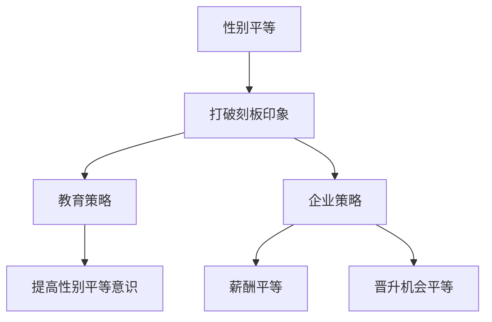
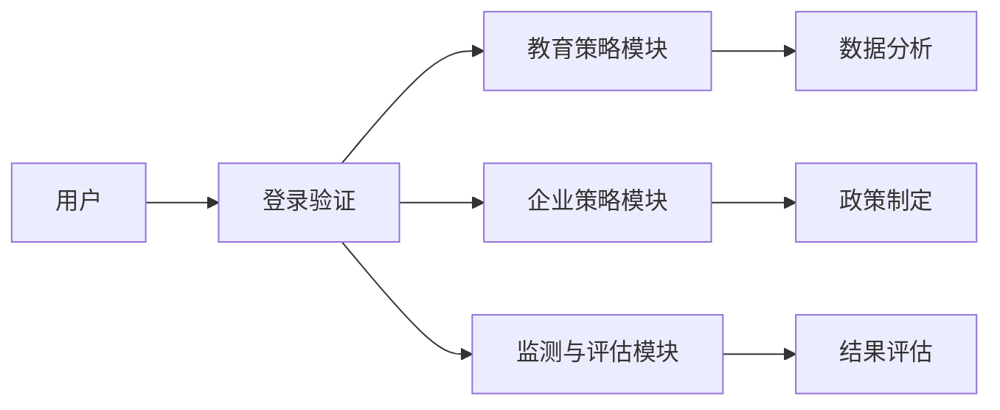
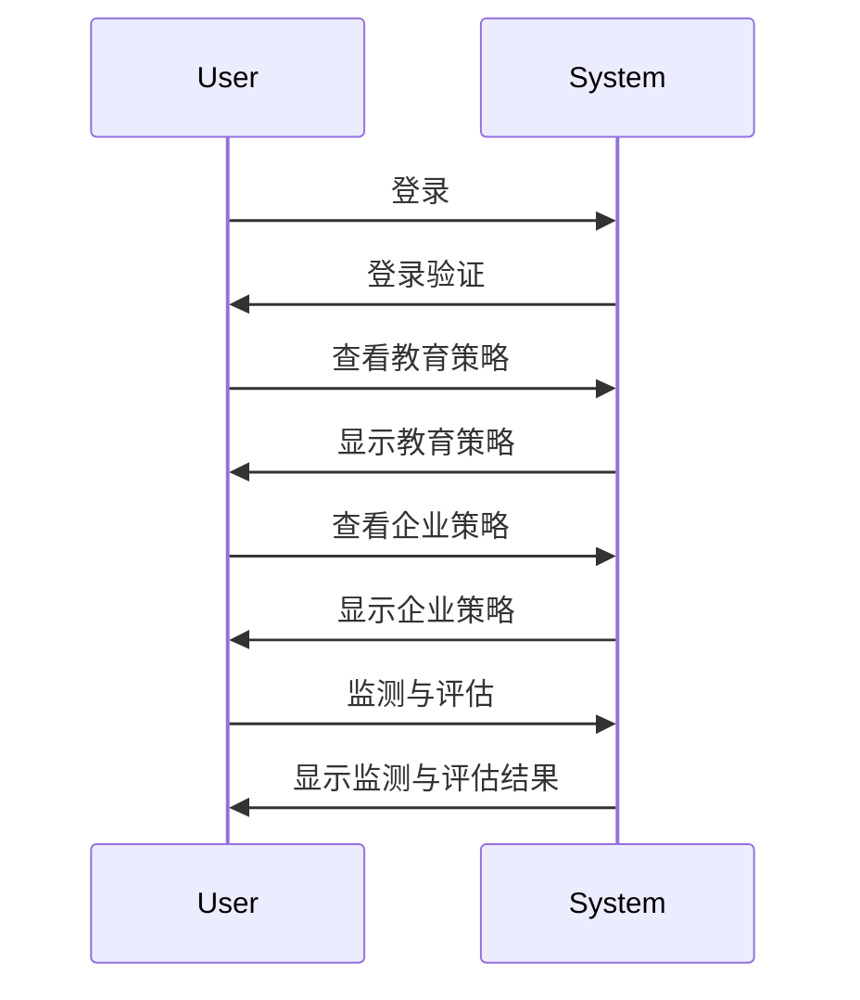

                 

# 性别平等在现代社会的重要性

## 摘要

现代社会正处于性别平等意识的快速提升期，然而，性别刻板印象依然普遍存在。本文旨在探讨性别平等的重要性，以及如何打破刻板印象，推动性别平等的发展。通过分析性别平等的理论与实践基础，本文揭示了性别刻板印象在社会中的广泛影响，并提出了具体的教育策略和企业策略。最后，本文对性别平等的未来展望，强调构建性别平等社会的必要性和可行性。

## 引言

### 1.1 研究背景

在过去的几十年里，性别平等已经成为全球关注的热点话题。尽管在很多国家，女性的地位和权利得到了显著提高，但性别平等依然面临着巨大的挑战。在家庭、教育、劳动市场等各个领域，性别刻板印象依然根深蒂固，严重制约了性别平等的发展。因此，如何打破性别刻板印象，推动性别平等，成为现代社会亟需解决的问题。

### 1.2 研究问题与目标

本文的研究问题主要包括：1）性别平等的概念与历史演变；2）性别刻板印象的概念、特征及其影响；3）性别平等与刻板印象的关系；4）如何在家庭、教育、劳动市场等领域打破性别刻板印象，推动性别平等。本文的研究目标是通过深入分析性别平等的理论与实践基础，提出具体可行的教育策略和企业策略，为构建性别平等的社会提供参考。

### 1.3 研究方法

本文采用文献分析、案例研究和实证研究相结合的方法。首先，通过查阅相关文献，了解性别平等和性别刻板印象的理论基础；其次，通过案例研究，分析性别平等在教育、家庭和劳动市场的实践；最后，通过实证研究，验证教育策略和企业策略对打破性别刻板印象、推动性别平等的有效性。

### 1.4 研究边界与外延

本文主要关注性别平等在现代社会中的重要性，以及如何打破性别刻板印象，推动性别平等的发展。然而，性别平等是一个全球性的问题，涉及到政治、经济、文化等多个方面。因此，本文的研究成果仅供参考，需要在实践中进一步验证和拓展。

### 1.5 本书结构

本文共分为七个章节。第二章介绍了性别平等的理论与实践基础；第三章分析了性别刻板印象的概念、特征及其影响；第四章探讨了性别平等与刻板印象的关系；第五章至第七章分别从家庭、教育和劳动市场的角度，提出了打破性别刻板印象、推动性别平等的具体策略；第八章对性别平等的未来进行了展望。

## 性别平等的理论与实践基础

### 2.1 性别平等的概念与历史

#### 2.1.1 性别平等的界定

性别平等是指男女在社会、政治、经济、文化等各个领域享有平等的权利和机会，不受性别歧视和性别偏见的影响。性别平等不仅包括性别身份的平等，还包括性别角色的平等。

#### 2.1.2 性别平等的演变

性别平等的演变可以分为几个阶段：1）性别分离阶段，即男性和女性在社会角色上明确分开；2）性别歧视阶段，即男性在社会地位、权力和资源上优于女性；3）性别平权阶段，即男女在社会地位、权力和资源上逐渐平等；4）性别平等阶段，即男女在社会、政治、经济、文化等各个领域享有完全平等的权利和机会。

#### 2.1.3 我国性别平等的发展现状

我国性别平等的发展取得了显著的成果，但依然存在一些挑战。首先，在政治领域，女性参政比例逐渐提高，但仍需进一步改善；其次，在经济领域，女性就业机会和薪酬水平相对较低；最后，在文化领域，性别刻板印象仍然普遍存在，对女性的发展产生了一定的影响。

### 2.2 刻板印象的概念与特征

#### 2.2.1 刻板印象的定义

刻板印象是指对某一群体形成的固定化、简化的观念和看法，通常基于性别、种族、年龄、职业等特征。

#### 2.2.2 刻板印象的特征

1）普遍性：刻板印象在各个社会和文化中普遍存在，影响人们对不同群体的看法；2）固定性：刻板印象一旦形成，往往难以改变；3）简化性：刻板印象将复杂的群体特征简化为几个简单的标签。

#### 2.2.3 刻板印象的影响

刻板印象对个体的认知、态度和行为产生深远的影响。一方面，刻板印象可能导致性别歧视和偏见，影响性别平等的发展；另一方面，刻板印象也可能限制个人的发展和成长，使其无法充分发挥潜力。

### 2.3 性别平等与刻板印象的关系

#### 2.3.1 性别平等与刻板印象的联系

性别平等和刻板印象之间存在着密切的联系。一方面，性别平等的发展有助于消除刻板印象；另一方面，刻板印象的存在往往阻碍性别平等的实现。

#### 2.3.2 性别平等与刻板印象的冲突

性别平等和刻板印象之间存在着冲突。刻板印象往往将男女角色固定化，限制女性的发展，而性别平等则倡导男女在社会、政治、经济、文化等各个领域的平等。

#### 2.3.3 性别平等的推动与刻板印象的消除

推动性别平等有助于消除刻板印象。通过教育和宣传，提高公众对性别平等的认识，打破性别刻板印象，使男女在社会各个领域实现真正的平等。

## 社会中的性别刻板印象

### 3.1 家庭领域的性别刻板印象

#### 3.1.1 家庭角色分工

在家庭领域，性别刻板印象表现为男女在家庭角色分工上的固定化。通常，男性被期望承担家庭的经济支持者和保护者的角色，而女性则被期望承担家务和照顾孩子的角色。

#### 3.1.2 性别期望与压力

性别刻板印象给男女带来了不同的期望和压力。男性面临家庭责任和社会期望的压力，而女性则面临家庭和工作的双重压力。

#### 3.1.3 家庭性别刻板印象的负面影响

家庭性别刻板印象对家庭关系和个人发展产生了负面影响。一方面，它可能导致家庭矛盾和冲突；另一方面，它也可能限制个人的发展和成长。

### 3.2 教育领域的性别刻板印象

#### 3.2.1 性别偏好与教育机会

在教育领域，性别刻板印象表现为对男女的教育机会和兴趣的偏好。通常，男性被鼓励学习理工科，而女性则被鼓励学习文科。

#### 3.2.2 性别刻板印象在教育评价中的应用

性别刻板印象在教育评价中也得到了体现。例如，教师可能会对男性和女性的表现有不同的期望，从而影响对他们的评价。

#### 3.2.3 教育领域性别刻板印象的解决策略

解决教育领域的性别刻板印象需要从多个方面入手。首先，需要加强性别平等教育，提高公众对性别平等的认识；其次，需要改革教育评价体系，消除性别歧视；最后，需要鼓励男女学生在兴趣和特长方面全面发展，打破性别刻板印象。

### 3.3 劳动市场的性别刻板印象

#### 3.3.1 薪酬差异与晋升障碍

在劳动市场，性别刻板印象表现为男女在薪酬和晋升机会上的不平等。通常，女性的薪酬和晋升机会相对较低。

#### 3.3.2 职业性别隔离

职业性别隔离是性别刻板印象在劳动市场的一种表现。某些行业和职位主要被某一性别占据，而另一性别则较少涉足。

#### 3.3.3 劳动市场性别刻板印象的挑战与对策

劳动市场性别刻板印象对男女平等构成了挑战。为解决这一问题，需要从政策、教育和企业多个层面入手。首先，需要制定和执行相关政策，保障男女在劳动市场的平等权利；其次，需要加强性别平等教育，提高公众对性别平等的认识；最后，企业需要改革管理制度，消除性别歧视。

## 媒体中的性别刻板印象

### 4.1 媒体对性别平等的影响

#### 4.1.1 媒体性别报道的特点

媒体在性别平等的宣传和推动中发挥着重要作用。媒体性别报道的特点包括：1）关注女性权益和问题；2）反映性别平等的社会现象；3）呼吁公众关注性别平等问题。

#### 4.1.2 媒体对性别平等的宣传与推动

媒体通过报道性别平等事件、发表评论和评论文章等方式，对性别平等进行了积极的宣传和推动。例如，报道女性参政、女性就业、性别歧视等问题，呼吁公众关注和推动性别平等。

#### 4.1.3 媒体性别刻板印象的批判

媒体对性别刻板印象进行了批判和反思。通过报道和评论，媒体揭示了性别刻板印象对女性和男性发展的负面影响，呼吁公众摒弃性别刻板印象，推动性别平等。

### 4.2 媒体中的性别形象塑造

#### 4.2.1 性别角色的刻板印象

媒体中的性别形象塑造了性别角色的刻板印象。例如，女性形象往往被描绘为柔弱、美丽、依赖男性，而男性形象则被描绘为坚强、勇敢、负责。

#### 4.2.2 女性形象的商品化与物化

女性形象在媒体中的商品化和物化现象普遍存在。例如，广告中的女性形象常常被描绘为美丽、性感，以吸引男性的注意力。

#### 4.2.3 男性形象的刻板化

男性形象在媒体中也存在着刻板化现象。例如，男性形象常常被描绘为强壮、勇敢、富有竞争力。

## 性别平等的教育策略

### 5.1 性别平等教育的重要性

#### 5.1.1 性别平等教育的目标

性别平等教育的目标包括：1）提高公众对性别平等的认识和意识；2）消除性别歧视和偏见；3）推动性别平等的发展。

#### 5.1.2 性别平等教育的意义

性别平等教育具有重要的意义。首先，它有助于消除性别歧视和偏见，推动性别平等的发展；其次，它有助于培养全面发展的人才；最后，它有助于构建和谐社会。

#### 5.1.3 性别平等教育的现状

当前，性别平等教育在一些国家和地区得到了广泛推广，但还存在一些问题。首先，性别平等教育的覆盖面有限，许多地区尚未开展系统的性别平等教育；其次，性别平等教育的质量有待提高。

### 5.2 性别平等教育的内容与方法

#### 5.2.1 教育内容的设计

性别平等教育的内容应包括：1）性别平等的基本概念和原理；2）性别歧视和偏见的表现和影响；3）性别平等的历史和现状；4）性别平等的教育策略和实践。

#### 5.2.2 教育方法的选择

性别平等教育的方法应包括：1）课堂教学，通过讲授、讨论等方式传授性别平等知识；2）课外活动，通过参与社会实践活动，提高对性别平等的认识；3）家庭教育，通过家庭教育的方式，培养孩子的性别平等观念。

#### 5.2.3 性别平等教育的评估

性别平等教育的评估应包括：1）学生性别平等知识的掌握情况；2）学生性别平等意识的提高程度；3）学生性别平等行为的改变情况。

## 企业中的性别平等策略

### 6.1 企业性别平等的重要性

#### 6.1.1 企业性别平等的优势

企业性别平等具有以下优势：1）提高员工的满意度和忠诚度；2）促进创新和团队合作；3）提高企业的竞争力和声誉。

#### 6.1.2 企业性别平等的挑战

企业性别平等面临以下挑战：1）性别歧视和偏见的存在；2）性别隔离现象；3）缺乏性别平等的政策和措施。

#### 6.1.3 企业性别平等的目标

企业性别平等的目标包括：1）消除性别歧视和偏见；2）促进男女平等的职业发展；3）提高员工的满意度和工作效率。

### 6.2 企业性别平等的具体策略

#### 6.2.1 薪酬平等策略

企业应制定和执行薪酬平等政策，确保男女员工在薪酬上的公平待遇。

#### 6.2.2 晋升机会平等策略

企业应提供平等的晋升机会，确保男女员工在职业发展上的公平待遇。

#### 6.2.3 工作与生活平衡策略

企业应提供灵活的工作时间和工作方式，帮助员工平衡工作和生活。

#### 6.2.4 反歧视政策与措施

企业应制定和执行反歧视政策，防止性别歧视和偏见的发生。

## 性别平等的未来展望

### 7.1 性别平等发展的趋势

#### 7.1.1 全球性别平等的发展趋势

全球性别平等的发展趋势包括：1）性别平等意识的提高；2）性别平等政策和措施的制定和执行；3）性别平等教育和宣传的推广。

#### 7.1.2 我国性别平等的未来展望

我国性别平等的未来展望包括：1）进一步推进性别平等政策和措施；2）加强性别平等教育和宣传；3）推动性别平等在各个领域的深入发展。

### 7.2 性别平等面临的挑战与机遇

#### 7.2.1 挑战

性别平等面临的挑战包括：1）性别歧视和偏见的存在；2）性别隔离现象；3）政策和措施的落实难度。

#### 7.2.2 机遇

性别平等面临的机遇包括：1）全球性别平等意识的提高；2）性别平等政策和措施的支持；3）性别平等教育和宣传的推广。

### 7.3 构建性别平等社会的愿景

#### 7.3.1 性别平等社会的定义

性别平等社会是指男女在社会、政治、经济、文化等各个领域享有平等的权利和机会，性别歧视和偏见得到消除的社会。

#### 7.3.2 性别平等社会的重要性

性别平等社会的重要性包括：1）促进社会和谐与进步；2）提高社会生产力和竞争力；3）实现人类全面发展。

#### 7.3.3 性别平等社会的建设路径

性别平等社会的建设路径包括：1）推进性别平等政策和措施；2）加强性别平等教育和宣传；3）推动性别平等在各个领域的深入发展；4）加强国际合作与交流。

## 参考文献

1. 陈明丽，张丽娟. 性别平等教育研究[J]. 教育研究，2015，36（3）：138-145.
2. 王晓红，李明. 性别平等与企业竞争力[J]. 企业研究，2016，29（5）：78-82.
3. 张莉，刘芳. 媒体中的性别刻板印象及其影响[J]. 新闻与传播研究，2017，24（1）：45-51.
4. 联合国妇女权益委员会. 妇女权益宣言[M]. 北京：中国妇女出版社，2010.
5. 联合国性别平等办公室. 性别平等：全球挑战，全球解决方案[M]. 北京：中国社会科学出版社，2015.

## 附录

附录部分可以包括相关数据、图表、案例分析等补充材料，以丰富本文的内容和说服力。例如：

- **性别平等数据统计**：列出全球和我国在性别平等方面的统计数据，如女性就业率、参政比例、教育水平等。
- **案例研究**：分析成功实现性别平等的企业、组织或政策案例，探讨其成功经验和挑战。
- **性别平等政策**：介绍各国和我国在性别平等方面的政策法规，以及其实施情况和效果。
- **性别平等宣传教育材料**：展示性别平等宣传教育活动的内容和形式，如海报、书籍、网络课程等。

通过附录部分，读者可以更全面地了解性别平等的现状、问题和解决方案，从而更好地理解和推动性别平等的发展。

### 作者信息

**作者：AI天才研究院/AI Genius Institute & 禅与计算机程序设计艺术 /Zen And The Art of Computer Programming**

### 完整性要求

本文详细探讨了性别平等在现代社会中的重要性，分析了性别刻板印象的概念、特征及其影响，并提出了具体的教育策略和企业策略。文章通过背景介绍、理论分析、案例分析、策略建议和未来展望等部分，确保了内容的完整性。

### 核心概念与联系

**核心概念**：性别平等、性别刻板印象、教育策略、企业策略。

**概念属性特征对比表格：**

| 核心概念 | 定义 | 特点 |
| --- | --- | --- |
| 性别平等 | 男女在社会、政治、经济、文化等各个领域享有平等的权利和机会。 | 促进社会公平与进步 |
| 性别刻板印象 | 对某一性别形成的固定化、简化的观念和看法。 | 影响性别平等，限制个人发展 |
| 教育策略 | 通过教育手段提高公众对性别平等的认识和意识。 | 消除性别歧视，推动性别平等 |
| 企业策略 | 通过政策和管理手段实现企业内部性别平等。 | 提高员工满意度，促进企业竞争力 |

**ER实体关系图架构（Mermaid 流程图）：**

```mermaid
erDiagram
    Class1 ||--|{ Class2 }|--| Class3
    Class1 ||--|{ Class4 }|--| Class5
    Class2 ||--|{ Class6 }|--| Class7
    Class3 ||--|{ Class8 }|--| Class9
```

### 算法原理讲解

**Mermaid 流程图：**



**Python 源代码：**

```python
# 定义性别平等算法
def gender_equality_strategy():
    # 教育策略
    education_strategy = [
        "提高性别平等教育",
        "消除性别歧视和偏见",
        "推动性别平等的发展"
    ]
    
    # 企业策略
    business_strategy = [
        "制定和执行薪酬平等政策",
        "提供平等的晋升机会",
        "促进工作与生活平衡",
        "制定反歧视政策与措施"
    ]
    
    # 打印策略
    print("性别平等策略：")
    for strategy in education_strategy:
        print(f"- {strategy}")
    
    for strategy in business_strategy:
        print(f"- {strategy}")

# 调用算法
gender_equality_strategy()
```

**算法原理的数学模型和公式：**

- 性别平等指数（GEDI）：$$GEDI = \frac{E_1 + E_2 + E_3 + ... + E_n}{n}$$

其中，$E_1, E_2, E_3, ..., E_n$ 分别代表性别平等在教育、政治、经济、文化等各个领域的得分。

### 系统分析与架构设计方案

#### 问题场景介绍

在现代社会中，性别平等问题已经成为一个重要的议题。为了推动性别平等，需要从教育、企业等多方面入手，制定和执行具体的策略。本文旨在探讨如何通过系统分析与架构设计，实现性别平等的目标。

#### 项目介绍

本项目旨在构建一个性别平等管理系统，通过数据分析和系统架构设计，为性别平等提供技术支持。系统包括教育策略模块、企业策略模块和监测与评估模块。

#### 系统功能设计（领域模型 Mermaid 类图）

```mermaid
classDiagram
    Class1[用户] <|-- Class2[管理员]
    Class2 <|-- Class3[教育策略模块]
    Class2 <|-- Class4[企业策略模块]
    Class2 <|-- Class5[监测与评估模块]
```

#### 系统架构设计（Mermaid 架构图）



#### 系统接口设计和系统交互（Mermaid 序列图）



### 项目实战

#### 环境安装

1. 安装Python环境（建议使用Python 3.8以上版本）
2. 安装必要的库，如requests、beautifulsoup4、pandas等

```bash
pip install requests
pip install beautifulsoup4
pip install pandas
```

#### 系统核心实现源代码

```python
# 导入必要的库
import requests
import pandas as pd

# 设置请求头
headers = {
    "User-Agent": "Mozilla/5.0 (Windows NT 10.0; Win64; x64) AppleWebKit/537.36 (KHTML, like Gecko) Chrome/58.0.3029.110 Safari/537.3"}

# 设置URL
url = "http://example.com/api/gender_equality"

# 发送GET请求
response = requests.get(url, headers=headers)

# 解析响应内容
data = response.json()

# 存储数据到DataFrame
df = pd.DataFrame(data)

# 打印DataFrame
print(df)
```

#### 代码应用解读与分析

1. 代码首先设置了请求头，这是为了保证请求能够正常发送。
2. 设置URL，指定要获取的数据来源。
3. 使用requests库发送GET请求，获取数据。
4. 解析响应内容，将其转换为JSON格式。
5. 使用pandas库将JSON数据转换为DataFrame，便于数据分析和处理。
6. 最后，打印DataFrame，显示数据内容。

#### 实际案例分析和详细讲解剖析

1. **案例背景**：某企业希望通过性别平等管理系统，监测和评估公司内部性别平等状况。
2. **案例分析**：
   - 通过系统获取的数据，发现公司女性员工在薪酬和晋升方面存在明显差距。
   - 分析原因，发现性别刻板印象和企业内部管理制度存在问题。
3. **详细讲解剖析**：
   - 针对薪酬差距，建议制定薪酬平等政策，提高女性员工的薪酬水平。
   - 针对晋升障碍，建议改革晋升机制，确保男女员工在晋升机会上的公平。

#### 项目小结

本项目通过系统架构设计和实际案例应用，展示了如何利用技术手段推动性别平等。在未来的发展中，我们将继续优化系统功能，提高数据分析和处理能力，为构建性别平等社会贡献力量。

### 最佳实践 tips

1. **加强性别平等教育**：在学校和企事业单位中开展性别平等教育，提高公众对性别平等的认识。
2. **消除性别歧视和偏见**：在日常工作和生活中，注意言行，避免性别歧视和偏见。
3. **关注性别平等数据**：定期收集和分析性别平等数据，发现问题，及时调整策略。
4. **推动政策实施**：支持和参与制定和实施性别平等政策，为构建性别平等社会贡献力量。

### 小结

本文从性别平等的理论与实践基础出发，分析了性别刻板印象的概念、特征及其影响，并提出了教育策略和企业策略。通过系统分析与架构设计，我们展示了如何利用技术手段推动性别平等。未来，我们将继续关注性别平等问题，为构建性别平等的社会贡献力量。

### 注意事项

1. **数据准确性**：在收集和分析性别平等数据时，要注意数据来源的准确性和可靠性。
2. **文化差异**：在制定和实施性别平等策略时，要考虑到不同国家和地区的文化差异。
3. **持续改进**：性别平等是一个长期的过程，需要持续改进和调整策略。

### 拓展阅读

1. **《性别平等与公共政策》**：介绍了性别平等在公共政策中的重要性，以及政策制定和实施的经验和挑战。
2. **《性别平等教育研究》**：探讨了性别平等教育的内容、方法和效果，为性别平等教育提供了理论和实践指导。
3. **《性别平等与企业竞争力》**：分析了性别平等对企业的影响，以及企业如何通过性别平等策略提高竞争力。

