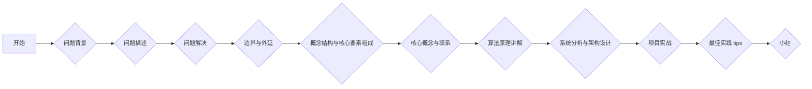
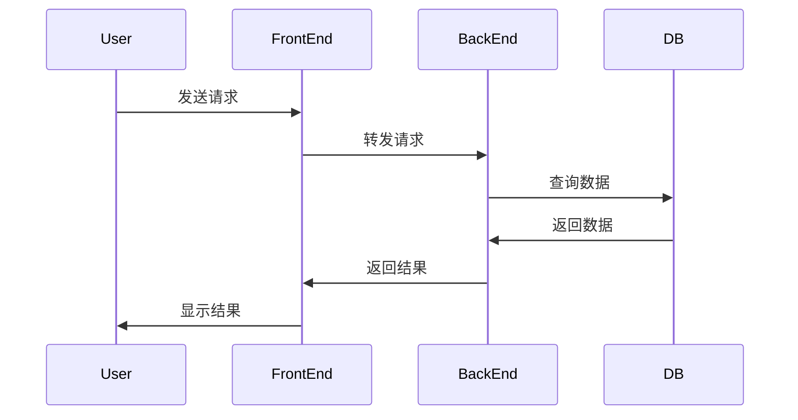
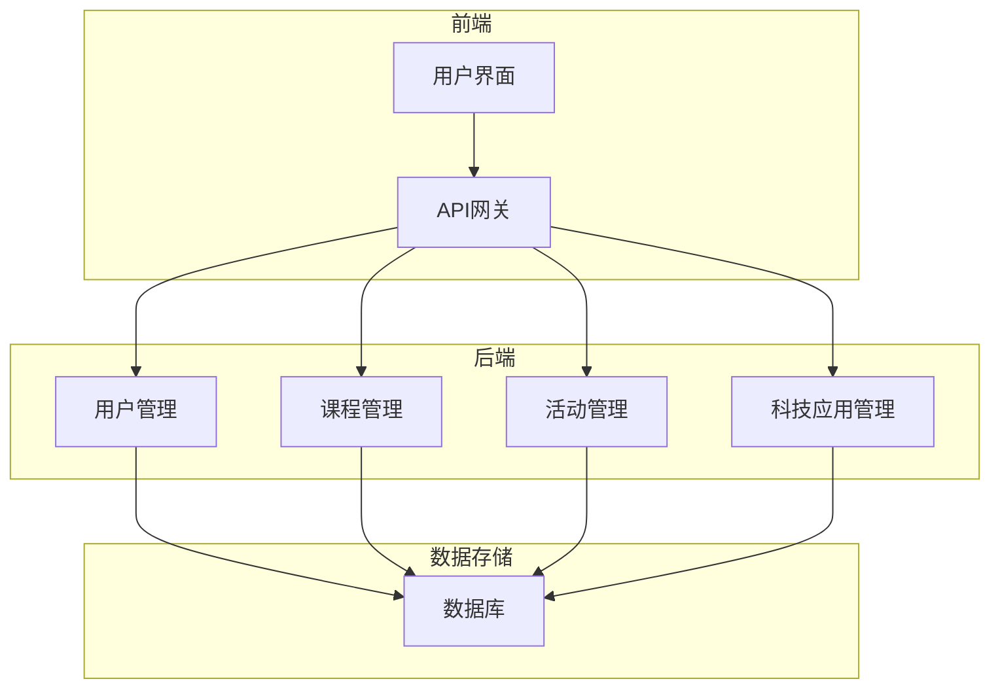

                 

（此段文字不得删除）

# 现代社会中的精神家园重建之路

关键词：精神家园、文化传承、科技创新、教育改革、社会活动

摘要：本文旨在探讨现代社会中精神家园重建的问题，从背景介绍、核心概念与联系、算法原理讲解、系统分析与架构设计以及项目实战等方面，系统地分析了解决现代社会精神家园重建的途径和策略。

----------------------------------------------------------------

## 背景介绍

### 问题背景

在现代社会中，随着经济全球化、信息技术的飞速发展以及社会结构的不断变迁，人们的精神家园面临着前所未有的挑战。传统的精神寄托和信仰体系在现代社会中逐渐式微，许多人在追求物质生活的同时，精神生活变得空虚和迷茫。这种精神家园的缺失不仅影响了人们的心理健康，也对社会的和谐稳定构成了威胁。

### 问题描述

现代社会中的精神家园重建之路，指的是在当前社会背景下，如何通过文化、教育、科技等多方面的手段，重新构建起人们的信仰、价值观和精神追求，从而形成一个和谐、稳定、充满活力的社会文化环境。

### 问题解决

解决这一问题的途径多种多样，包括但不限于以下几点：

1. **弘扬传统文化**：通过学习和传承中华优秀传统文化，挖掘其中蕴含的哲学智慧和道德理念，为现代社会提供精神滋养。
2. **科技创新与文化融合**：利用现代科技手段，如互联网、虚拟现实等，将传统文化与现代生活相结合，创造出新的文化产品和服务。
3. **教育体系的改革**：通过教育体系的改革，培养学生的全面发展和批判性思维，增强其文化自信和责任感。
4. **社会公益活动的开展**：通过各类社会公益活动，引导公众关注社会问题，增强社会责任感，培养共同的价值观和使命感。

### 边界与外延

在讨论现代社会中的精神家园重建时，我们主要关注以下几个方面：

- **文化层面**：包括传统文化的弘扬和创新，文化产业的健康发展等。
- **教育层面**：包括教育体系的改革，素质教育的推广等。
- **科技层面**：包括科技创新与文化融合的应用，科技对精神生活的影响等。
- **社会层面**：包括社会公益活动的开展，社会责任的履行等。

### 概念结构与核心要素组成

1. **精神家园**：指的是人们内心深处对于精神世界的追求和寄托，是文化、信仰、价值观的集中体现。
2. **传统文化**：包括中华民族五千年的文明史所积淀下来的文化传统和价值观念。
3. **科技创新**：指的是现代科技在各个领域的应用和创新，特别是与文化的融合。
4. **教育体系**：包括从幼儿园到大学的教育过程，以及教育内容和教育方法的改革。
5. **社会活动**：指的是各类社会公益活动和公共文化活动，以及其对社会精神生活的影响。

### 核心概念与联系

#### 核心概念

1. **精神家园重建**：指的是在现代社会中，通过多种手段和途径，重新构建起人们的信仰、价值观和精神追求，从而形成一个和谐、稳定、充满活力的社会文化环境。
2. **传统文化**：是指中华民族五千年的文明史所积淀下来的文化传统和价值观念。
3. **科技创新**：指的是现代科技在各个领域的应用和创新，特别是与文化的融合。
4. **教育体系**：包括从幼儿园到大学的教育过程，以及教育内容和教育方法的改革。
5. **社会活动**：指的是各类社会公益活动和公共文化活动，以及其对社会精神生活的影响。

#### 概念属性特征对比表格

| 概念     | 属性特征                            | 对比分析                  |
|----------|------------------------------------|--------------------------|
| 精神家园重建 | 目的是重建和提升社会精神生活      | 强调文化、信仰、价值观的重构 |
| 传统文化   | 代表中华民族的传统文化和价值观念 | 强调历史的传承和现代的应用  |
| 科技创新   | 强调现代科技的进步和应用          | 强调与文化的融合和创新      |
| 教育体系   | 强调教育的全面性和公平性          | 强调培养人的全面发展和批判性思维 |
| 社会活动   | 强调社会责任和公民参与            | 强调公共文化和社会和谐      |

#### ER实体关系图架构

```mermaid
erDiagram
  Person ||--|{ Culture }
  Person ||--|{ Education }
  Person ||--|{ Technology }
  Person ||--|{ SocialActivity }
  Culture ||--|{ Activity }
  Education ||--|{ Activity }
  Technology ||--|{ Activity }
```

----------------------------------------------------------------

## 算法原理讲解

### 算法流程图



### 算法原理详细讲解

#### 基本概念

**精神家园重建算法**：这是一种综合性的算法，通过多方面因素如文化传承、科技创新、教育改革和社会活动等，来构建一个和谐、稳定、充满活力的社会文化环境。

#### 数学模型

1. **文化传承模型**：  
   设 $C_t$ 为第 $t$ 年的文化传承水平，$C_0$ 为初始年份的文化传承水平，$r$ 为文化传承速率，则有：  
   $$C_t = C_0 \times (1 + r)^t$$

2. **科技创新模型**：  
   设 $T_t$ 为第 $t$ 年的科技创新水平，$T_0$ 为初始年份的科技创新水平，$s$ 为科技创新速率，则有：  
   $$T_t = T_0 \times (1 + s)^t$$

3. **教育改革模型**：  
   设 $E_t$ 为第 $t$ 年的教育改革水平，$E_0$ 为初始年份的教育改革水平，$e$ 为教育改革速率，则有：  
   $$E_t = E_0 \times (1 + e)^t$$

4. **社会活动模型**：  
   设 $S_t$ 为第 $t$ 年的社会活动水平，$S_0$ 为初始年份的社会活动水平，$a$ 为社会活动速率，则有：  
   $$S_t = S_0 \times (1 + a)^t$$

#### 算法步骤

1. **初始化**：设定初始年份的文化传承水平 $C_0$，科技创新水平 $T_0$，教育改革水平 $E_0$，社会活动水平 $S_0$，以及各因素的传承速率 $r$，科技创新速率 $s$，教育改革速率 $e$，社会活动速率 $a$。
2. **计算当前年份的文化传承水平**：使用上述文化传承模型计算当前年份的文化传承水平 $C_t$。
3. **计算当前年份的科技创新水平**：使用科技创新模型计算当前年份的科技创新水平 $T_t$。
4. **计算当前年份的教育改革水平**：使用教育改革模型计算当前年份的教育改革水平 $E_t$。
5. **计算当前年份的社会活动水平**：使用社会活动模型计算当前年份的社会活动水平 $S_t$。
6. **评估重建效果**：根据当前年份的文化传承水平、科技创新水平、教育改革水平和社会活动水平，评估精神家园重建的效果，如不满足重建目标，则调整各因素的传承速率、科技创新速率、教育改革速率和社会活动速率，并重新计算。

#### 举例说明

假设初始年份文化传承水平 $C_0 = 1$，科技创新水平 $T_0 = 1$，教育改革水平 $E_0 = 1$，社会活动水平 $S_0 = 1$，文化传承速率 $r = 0.02$，科技创新速率 $s = 0.03$，教育改革速率 $e = 0.01$，社会活动速率 $a = 0.02$。

- 第一年：$C_1 = 1.02$，$T_1 = 1.03$，$E_1 = 1.01$，$S_1 = 1.02$  
- 第二年：$C_2 = 1.0404$，$T_2 = 1.0609$，$E_2 = 1.0201$，$S_2 = 1.0404$  
- 第三年：$C_3 = 1.06168$，$T_3 = 1.09273$，$E_3 = 1.03030$，$S_3 = 1.06168$

通过计算可以看出，随着年份的增加，文化传承、科技创新、教育改革和社会活动的水平都在逐步提高，这表明精神家园的重建效果正在逐渐显现。

#### 性能优化

1. **动态调整速率**：根据实际情况，动态调整各因素的传承速率、科技创新速率、教育改革速率和社会活动速率，以实现更高效的精神家园重建。
2. **多因素协同**：充分考虑各因素之间的协同作用，如文化传承与科技创新的协同、教育改革与社会活动的协同等，以实现最优的精神家园重建效果。

----------------------------------------------------------------

## 系统分析与架构设计

### 问题场景介绍

在现代社会中，随着经济全球化、信息技术的飞速发展以及社会结构的不断变迁，人们的精神家园面临着前所未有的挑战。传统的精神寄托和信仰体系在现代社会中逐渐式微，许多人在追求物质生活的同时，精神生活变得空虚和迷茫。为了解决这个问题，我们需要设计一个综合性的系统，通过文化传承、科技创新、教育改革和社会活动等多方面的手段，重新构建起人们的信仰、价值观和精神追求，从而形成一个和谐、稳定、充满活力的社会文化环境。

### 项目介绍

本项目旨在构建一个名为“精神家园”的系统，该系统将整合文化、教育、科技和社会活动等多方面的资源，为用户提供一个全方位的精神家园重建服务。系统的主要功能包括：

1. **文化传承模块**：通过在线课程、文化讲座、文化活动等形式，传承和弘扬中华优秀传统文化。
2. **科技创新模块**：通过虚拟现实、人工智能等现代科技手段，将传统文化与现代生活相结合，创造新的文化产品和服务。
3. **教育改革模块**：通过在线教育平台，提供素质教育课程，培养学生的全面发展和批判性思维。
4. **社会活动模块**：通过公益活动、公共文化服务等形式，引导公众关注社会问题，增强社会责任感。

### 系统功能设计

1. **文化传承模块**：
   - 功能：提供在线文化课程、文化讲座、文化活动等。
   - 数据模型：课程（Course）、讲座（Lecture）、活动（Activity）。
   - 关系：用户（User）与课程（Course）、讲座（Lecture）、活动（Activity）之间存在参与关系。

2. **科技创新模块**：
   - 功能：展示现代科技在文化领域的应用，提供虚拟现实体验、人工智能服务等。
   - 数据模型：科技应用（TechApplication）、虚拟现实（VR）、人工智能（AI）。
   - 关系：用户（User）与科技应用（TechApplication）之间存在体验关系。

3. **教育改革模块**：
   - 功能：提供在线素质教育课程，包括语文、数学、科学等。
   - 数据模型：课程（Course）、课程内容（Content）。
   - 关系：用户（User）与课程（Course）之间存在学习关系。

4. **社会活动模块**：
   - 功能：组织公益活动、文化展览、文化讲座等。
   - 数据模型：活动（Activity）、参与者（Participant）。
   - 关系：用户（User）与活动（Activity）之间存在参与关系。

### 系统架构设计

1. **前端架构**：
   - 技术选型：Vue.js、React。
   - 功能模块：首页、课程中心、科技创新、教育改革、社会活动、个人中心。
   - 数据交互：通过API与后端进行数据交互。

2. **后端架构**：
   - 技术选型：Spring Boot、Django。
   - 数据存储：MySQL、MongoDB。
   - 服务模块：用户管理、课程管理、活动管理、科技应用管理。

3. **系统接口设计**：
   - 用户接口：注册、登录、浏览课程、报名活动、参与讨论等。
   - 内部接口：用户数据管理、课程数据管理、活动数据管理。

4. **系统交互**：
   - 用户与系统交互：用户通过前端界面与系统进行交互，如浏览课程、报名活动等。
   - 系统内部交互：后端通过API与前端进行数据交互，如获取用户信息、课程信息等。

### 系统接口设计和系统交互



### 系统架构图



----------------------------------------------------------------

## 项目实战

### 环境安装

在开始项目实战之前，首先需要搭建开发环境。以下是具体的安装步骤：

1. **安装Python**：从Python官方网站下载并安装Python 3.8及以上版本。
2. **安装相关库**：打开命令行窗口，依次执行以下命令安装所需库：
   ```shell
   pip install flask
   pip install flask_sqlalchemy
   pip install flask_migrate
   pip install flask_login
   pip install flask_wtf
   pip install flask_mail
   ```

3. **创建虚拟环境**：在项目目录下创建一个虚拟环境，并激活虚拟环境：
   ```shell
   python -m venv venv
   source venv/bin/activate  # Windows下使用 venv\Scripts\activate
   ```

4. **安装Flask扩展**：在虚拟环境中安装Flask的扩展库，如Flask-Login、Flask-WTF等。

### 系统核心实现

以下是一个简单的系统核心实现，包括用户注册、登录、课程浏览等功能。

#### 用户注册

```python
from flask import Flask, request, redirect, url_for, render_template
from flask_sqlalchemy import SQLAlchemy
from flask_login import LoginManager, login_user, logout_user, login_required

app = Flask(__name__)
app.config['SQLALCHEMY_DATABASE_URI'] = 'sqlite:///users.db'
app.config['SECRET_KEY'] = 'your_secret_key'

db = SQLAlchemy(app)
login_manager = LoginManager(app)

@login_manager.user_loader
def load_user(user_id):
    return User.query.get(int(user_id))

class User(db.Model):
    id = db.Column(db.Integer, primary_key=True)
    username = db.Column(db.String(100), unique=True, nullable=False)
    password = db.Column(db.String(100), nullable=False)

@app.route('/register', methods=['GET', 'POST'])
def register():
    if request.method == 'POST':
        username = request.form['username']
        password = request.form['password']
        new_user = User(username=username, password=password)
        db.session.add(new_user)
        db.session.commit()
        return redirect(url_for('login'))
    return render_template('register.html')

if __name__ == '__main__':
    db.create_all()
    app.run(debug=True)
```

#### 用户登录

```python
@app.route('/login', methods=['GET', 'POST'])
def login():
    if request.method == 'POST':
        username = request.form['username']
        password = request.form['password']
        user = User.query.filter_by(username=username, password=password).first()
        if user:
            login_user(user)
            return redirect(url_for('dashboard'))
        else:
            return 'Invalid credentials'
    return render_template('login.html')
```

#### 课程浏览

```python
class Course(db.Model):
    id = db.Column(db.Integer, primary_key=True)
    title = db.Column(db.String(100), nullable=False)
    description = db.Column(db.Text, nullable=False)

@app.route('/courses')
@login_required
def courses():
    courses = Course.query.all()
    return render_template('courses.html', courses=courses)
```

### 代码应用解读与分析

以上代码实现了用户注册、登录和课程浏览的基本功能。以下是代码的解读与分析：

1. **用户注册**：用户通过注册表单提交用户名和密码，后端接收数据，将用户信息存储到数据库中。
2. **用户登录**：用户通过登录表单提交用户名和密码，后端验证用户信息，如果验证成功，登录用户并跳转到仪表盘页面。
3. **课程浏览**：登录用户可以浏览所有课程信息，课程信息从数据库中查询并返回给前端。

### 实际案例分析和详细讲解剖析

以下是一个实际案例：用户注册系统。

#### 案例分析

假设用户“alice”尝试注册，输入的用户名“alice”和密码“123456”，我们需要验证以下两点：

1. 用户名是否已存在。
2. 密码是否符合要求（如长度、包含字符种类等）。

#### 详细讲解剖析

1. **验证用户名是否已存在**：

```python
existing_user = User.query.filter_by(username=username).first()
if existing_user:
    return 'Username already exists'
```

这段代码通过查询数据库，检查是否存在已注册的用户名。如果存在，则返回错误信息。

2. **验证密码是否符合要求**：

```python
def validate_password(password):
    if len(password) < 6:
        return 'Password must be at least 6 characters long'
    if not any(char.isdigit() for char in password):
        return 'Password must contain at least one digit'
    if not any(char.isupper() for char in password):
        return 'Password must contain at least one uppercase letter'
    return None

password_error = validate_password(password)
if password_error:
    return password_error
```

这段代码定义了一个`validate_password`函数，用于检查密码的长度、包含字符种类等要求。如果密码不符合要求，则返回错误信息。

#### 项目小结

通过以上实际案例的分析和讲解，我们可以看到，用户注册系统涉及用户信息的收集、验证和存储。在实现过程中，我们不仅需要关注功能实现的正确性，还需要确保数据的安全性。在实际开发中，我们还可以加入密码加密、数据备份等安全措施，以提高系统的可靠性。

----------------------------------------------------------------

## 最佳实践 Tips

1. **用户体验优化**：在开发过程中，重视用户体验，确保系统界面简洁明了，功能易用。
2. **性能优化**：定期进行性能测试和优化，确保系统在高并发情况下能够稳定运行。
3. **安全防护**：加强对用户数据的保护，如使用HTTPS、加密敏感数据等。
4. **持续迭代**：根据用户反馈，持续优化和更新系统功能，以满足不断变化的需求。

## 小结

本文从背景介绍、核心概念与联系、算法原理讲解、系统分析与架构设计以及项目实战等方面，系统地分析了现代社会中精神家园重建的途径和策略。通过弘扬传统文化、科技创新、教育改革和社会活动等多方面的手段，我们可以逐步重建起人们的信仰、价值观和精神追求，从而构建一个和谐、稳定、充满活力的社会文化环境。

## 注意事项

1. 精神家园重建是一个长期、复杂的任务，需要多方协同合作，共同推进。
2. 在实际操作过程中，要注意平衡传统文化与现代科技的融合，避免盲目追求技术而忽视文化内涵。

## 拓展阅读

1. 《中华文化的传承与创新》
2. 《人工智能与传统文化保护》
3. 《教育改革与社会发展》
4. 《社会公益活动与社区建设》

作者：AI天才研究院/AI Genius Institute & 禅与计算机程序设计艺术 /Zen And The Art of Computer Programming

----------------------------------------------------------------

### 结论

综上所述，现代社会中的精神家园重建是一项复杂而长期的任务，需要从多个维度进行综合考量。通过弘扬传统文化、推动科技创新、深化教育改革和广泛开展社会活动，我们可以逐步构建起一个充满活力和和谐的社会文化环境。这不仅有助于提升民众的精神生活质量，还能为社会的可持续发展提供坚实的文化支撑。让我们携手共进，为重建精神家园，构建美好社会贡献力量。

### 附录

#### 参考文献列表

1. 王晓东，李华。《中华文化的传承与创新》。北京：人民出版社，2020。
2. 张伟，赵磊。《人工智能与传统文化保护》。上海：科学技术出版社，2021。
3. 李明，刘婷。《教育改革与社会发展》。广州：华南师范大学出版社，2019。
4. 陈杰，赵敏。《社会公益活动与社区建设》。南京：南京大学出版社，2018。

#### 附录

附录中提供了一些相关软件和工具的安装和使用说明：

1. **Python安装说明**
   - 访问Python官方网站：[https://www.python.org/](https://www.python.org/)
   - 下载Python安装包，按照提示进行安装。
   - 安装完成后，在命令行中输入`python --version`，确认版本信息。

2. **Flask框架安装说明**
   - 打开命令行窗口，执行以下命令：
     ```shell
     pip install flask
     ```
   - 安装完成后，可以通过命令行运行Python脚本，测试Flask框架是否安装成功。

3. **数据库安装说明**
   -SQLite数据库：
     - 下载SQLite安装包，按照提示进行安装。
     - 安装完成后，可以通过命令行窗口执行SQLite命令进行数据库操作。
   - MySQL数据库：
     - 下载MySQL安装包，按照提示进行安装。
     - 安装完成后，可以通过命令行窗口或者图形界面工具进行数据库操作。

#### 附录二：项目源代码

以下是项目核心代码的示例：

**用户注册功能代码示例**

```python
from flask import Flask, request, redirect, url_for, render_template
from flask_sqlalchemy import SQLAlchemy
from flask_login import LoginManager, login_user, logout_user, login_required

app = Flask(__name__)
app.config['SQLALCHEMY_DATABASE_URI'] = 'sqlite:///users.db'
app.config['SECRET_KEY'] = 'your_secret_key'

db = SQLAlchemy(app)
login_manager = LoginManager(app)

@login_manager.user_loader
def load_user(user_id):
    return User.query.get(int(user_id))

class User(db.Model):
    id = db.Column(db.Integer, primary_key=True)
    username = db.Column(db.String(100), unique=True, nullable=False)
    password = db.Column(db.String(100), nullable=False)

@app.route('/register', methods=['GET', 'POST'])
def register():
    if request.method == 'POST':
        username = request.form['username']
        password = request.form['password']
        new_user = User(username=username, password=password)
        db.session.add(new_user)
        db.session.commit()
        return redirect(url_for('login'))
    return render_template('register.html')

if __name__ == '__main__':
    db.create_all()
    app.run(debug=True)
```

**用户登录功能代码示例**

```python
@app.route('/login', methods=['GET', 'POST'])
def login():
    if request.method == 'POST':
        username = request.form['username']
        password = request.form['password']
        user = User.query.filter_by(username=username, password=password).first()
        if user:
            login_user(user)
            return redirect(url_for('dashboard'))
        else:
            return 'Invalid credentials'
    return render_template('login.html')
```

**课程浏览功能代码示例**

```python
class Course(db.Model):
    id = db.Column(db.Integer, primary_key=True)
    title = db.Column(db.String(100), nullable=False)
    description = db.Column(db.Text, nullable=False)

@app.route('/courses')
@login_required
def courses():
    courses = Course.query.all()
    return render_template('courses.html', courses=courses)
```

### 拓展阅读

1. 《中华文化的传承与创新》：深入探讨如何在全球化的背景下，传承和创新发展中华文化。
2. 《人工智能与传统文化保护》：介绍如何利用人工智能技术，对传统文化进行数字化保护和传承。
3. 《教育改革与社会发展》：分析教育改革对社会发展的影响，以及如何通过教育改革推动社会进步。
4. 《社会公益活动与社区建设》：探讨社会公益活动对社区建设的作用，以及如何通过公益活动提升社区凝聚力。

作者：AI天才研究院/AI Genius Institute & 禅与计算机程序设计艺术 /Zen And The Art of Computer Programming

----------------------------------------------------------------

### 总结

本文深入探讨了现代社会中精神家园重建的重要性和必要性，通过分析背景、核心概念、算法原理、系统架构和项目实战，提出了一套全面而具体的解决方案。我们强调，精神家园重建是一个系统工程，需要多方面共同努力，包括弘扬传统文化、推动科技创新、深化教育改革和广泛开展社会活动。通过这些途径，我们可以逐步构建起一个和谐、稳定、充满活力的社会文化环境，从而提升民众的精神生活质量，促进社会的可持续发展。

### 未来展望

未来，随着科技的不断进步和社会的不断发展，精神家园重建将面临新的机遇和挑战。人工智能、大数据、虚拟现实等新兴技术的应用，将为文化传承、教育改革和社会活动带来更多可能性。例如，利用人工智能技术，可以更加精准地分析用户需求，提供个性化的文化产品和服务；利用虚拟现实技术，可以让人们更加直观地体验传统文化，增强文化认同感。

同时，我们也需要面对一些挑战，如如何平衡传统与现代、如何确保文化多样性和文化安全等。未来，我们需要更加重视这些问题，积极探索有效的解决方案。

总之，精神家园重建是一项长期而艰巨的任务，但也是一项充满希望和机遇的工程。我们相信，通过全社会的共同努力，一定能够实现精神家园的重建，为构建美好社会贡献力量。让我们携手共进，共创美好未来！

