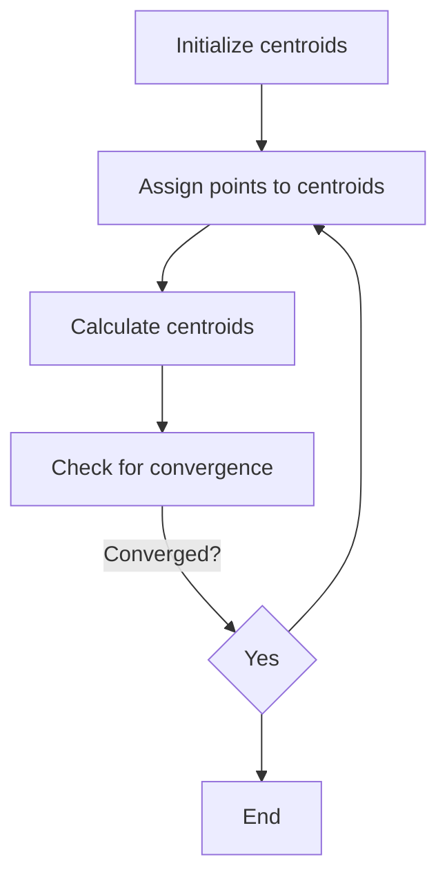
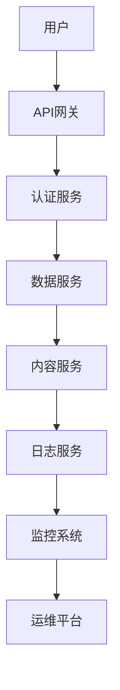

                 

### 现代社会的价值观冲突：多元文化下的和谐共处

在当今这个全球化的时代，人们比以往任何时候都更加紧密地联系在一起。然而，这种联系也带来了前所未有的挑战，尤其是在价值观的冲突方面。现代社会中，多元文化的交融不可避免地引发了各种价值观的碰撞和冲突。这种冲突不仅表现在个人层面，也体现在社会层面乃至国家层面。

**关键词**：价值观冲突、多元文化、和谐共处、文化差异、社会和谐

**摘要**：本文将探讨现代社会中存在的价值观冲突现象，分析其成因、类型、表现和影响，进一步探讨多元文化的特点、影响和优势，最后提出和谐共处的路径和未来展望。通过深入分析和逻辑推理，本文旨在为解决现代社会中的价值观冲突提供一些有价值的见解。

### 第一部分：引言

#### 1.1 书籍背景

随着全球化的深入发展，不同国家和地区的文化不断交融，但也带来了价值观的冲突。在这种背景下，理解和解决价值观冲突，实现多元文化下的和谐共处，成为当今社会面临的重要课题。

#### 1.1.1 现代社会价值观念冲突的现象

现代社会中，价值观冲突的现象随处可见。例如，在职场中，员工之间的文化差异可能导致沟通障碍和工作效率低下；在国际关系中，文化差异可能引发政治矛盾和冲突。这些问题不仅影响个人和社会的和谐，也威胁到全球的稳定与发展。

#### 1.1.2 多元文化背景下的挑战

多元文化背景下，如何尊重和包容不同文化，如何在不同价值观之间找到平衡，是现代社会面临的一大挑战。这不仅需要个体的自我认知和调整，也需要社会和国家的制度性安排。

#### 1.1.3 和谐共处的意义与目标

和谐共处不仅是解决价值观冲突的关键，也是构建现代社会的重要目标。通过和谐共处，可以实现社会稳定、经济发展和文化繁荣。因此，理解和解决价值观冲突，对于实现和谐共处具有重要的现实意义。

### 1.2 核心概念介绍

为了更好地理解和分析价值观冲突、多元文化和和谐共处，我们需要明确以下几个核心概念。

#### 1.2.1 价值观冲突的概念

价值观冲突是指不同个体、群体或文化在价值观念上存在的分歧和冲突。这些冲突可能源自文化差异、经济利益、社会地位等因素。

#### 1.2.2 多元文化的概念

多元文化是指一个社会或国家中存在多种不同的文化，这些文化在相互交融中形成了独特的文化景观。

#### 1.2.3 和谐共处的概念

和谐共处是指在尊重和包容不同文化的基础上，通过对话、合作和协商，实现不同文化之间的和谐共存。

### 1.3 边界与外延

为了更好地理解上述概念，我们需要明确其边界与外延。

#### 1.3.1 价值观冲突的范围

价值观冲突的范围可以从个人层面扩展到社会层面，甚至影响到国家层面。例如，个人层面的价值观冲突可能表现为职场中的文化差异，而社会层面的价值观冲突可能表现为社会运动和抗议活动。

#### 1.3.2 多元文化的定义与类型

多元文化的定义可以涵盖民族文化、地域文化、社会阶层文化等多种类型。每种类型的文化都有其独特的特征和表现形式。

#### 1.3.3 和谐共处的实现条件

和谐共处的实现需要具备一系列条件，包括文化尊重、平等对话、合作共赢等。这些条件是实现和谐共处的必要保障。

### 1.4 概念结构与核心要素

为了深入理解这些概念，我们需要分析其内部结构和核心要素。

#### 1.4.1 价值观冲突的结构

价值观冲突的结构包括冲突源、冲突主体、冲突内容等核心要素。这些要素相互作用，形成了复杂的价值观冲突系统。

#### 1.4.2 多元文化的核心要素

多元文化的核心要素包括文化多样性、文化融合、文化认同等。这些要素共同构成了多元文化的生态系统。

#### 1.4.3 和谐共处的关键要素

和谐共处的关键要素包括文化尊重、平等对话、合作共赢等。这些要素是实现和谐共处的基础。

### 1.5 本章小结

通过对现代社会价值观念冲突、多元文化和和谐共处的介绍，我们为后续章节的分析奠定了基础。在接下来的章节中，我们将深入探讨价值观冲突的原因、类型和表现，分析多元文化的特点、影响和优势，并提出实现和谐共处的路径和未来展望。希望这些内容能为我们理解这一复杂现象提供有价值的启示。

### 第二部分：价值观冲突的分析

#### 2.1 价值观冲突的原因

价值观冲突的产生并非偶然，而是多种因素相互作用的结果。以下是导致价值观冲突的主要原因：

##### 2.1.1 经济发展的影响

经济发展是导致价值观冲突的重要因素之一。随着经济的快速发展，社会阶层分化加剧，不同阶层之间的价值观差异也日益明显。例如，在财富分配不均的情况下，贫富差距可能导致贫富阶层之间的价值观冲突。

##### 2.1.2 社会变革的冲击

社会变革也是导致价值观冲突的重要原因。在社会变革的过程中，传统价值观受到挑战，而新的价值观尚未完全确立，这可能导致社会成员之间的价值观冲突。例如，随着科技的进步，人们的生活方式和社会观念发生了巨大变化，这可能导致传统观念和现代观念之间的冲突。

##### 2.1.3 文化差异的冲突

文化差异是价值观冲突的根本原因。不同文化背景下的价值观差异可能导致个体或群体之间的冲突。例如，不同民族之间的文化差异可能导致民族冲突，而不同宗教之间的文化差异可能导致宗教冲突。

#### 2.2 价值观冲突的类型

价值观冲突的类型可以根据冲突主体和冲突内容的不同进行分类。以下是几种常见的价值观冲突类型：

##### 2.2.1 个人层面的价值观冲突

个人层面的价值观冲突主要表现为个体在日常生活中面临的道德、伦理和价值观方面的矛盾。例如，一个人可能同时受到传统价值观和现代价值观的影响，导致内心的冲突。

##### 2.2.2 社会层面的价值观冲突

社会层面的价值观冲突主要表现为社会成员之间因价值观差异而产生的矛盾和冲突。例如，不同社会阶层之间的价值观冲突可能导致社会不和谐，影响社会稳定。

##### 2.2.3 国家层面的价值观冲突

国家层面的价值观冲突主要表现为不同国家之间因价值观差异而产生的矛盾和冲突。例如，国际关系中的价值观冲突可能导致国家之间的紧张关系，影响全球稳定。

#### 2.3 价值观冲突的表现

价值观冲突的表现形式多样，以下是几种常见的表现形式：

##### 2.3.1 社会不和谐事件

社会不和谐事件是价值观冲突的一种直接表现。例如，社会运动、抗议活动、暴力冲突等都是社会不和谐事件的典型形式。

##### 2.3.2 社会运动与抗议

社会运动和抗议是价值观冲突的一种间接表现。例如，人权运动、环境运动、反战运动等都是社会运动和抗议的典型形式。

##### 2.3.3 媒体与价值观冲突的传播

媒体是价值观冲突传播的重要渠道。例如，新闻媒体、社交媒体等都可以传播价值观冲突的信息，影响公众的观点和态度。

#### 2.4 价值观冲突的影响

价值观冲突对个人、社会和国家都有深远的影响。以下是价值观冲突的影响：

##### 2.4.1 对个人心理健康的影响

价值观冲突可能导致个人心理压力增大，甚至引发心理问题。例如，长期处于价值观冲突中的人可能会感到焦虑、抑郁等心理问题。

##### 2.4.2 对社会稳定的影响

价值观冲突可能对社会稳定产生负面影响。例如，严重的社会不和谐事件可能导致社会动荡，影响社会稳定。

##### 2.4.3 对国际关系的影响

价值观冲突也可能影响国际关系。例如，国家之间的价值观冲突可能导致外交关系紧张，影响全球稳定。

#### 2.5 本章小结

通过对价值观冲突的原因、类型、表现和影响的分析，我们更深入地理解了这一复杂现象。在接下来的章节中，我们将探讨多元文化的特点、影响和优势，以期为解决价值观冲突提供新的视角和思路。

### 第三部分：多元文化的理解

#### 3.1 多元文化的特点

多元文化是指一个社会或国家中存在多种不同的文化，这些文化在相互交融中形成了独特的文化景观。多元文化的特点主要体现在以下几个方面：

##### 3.1.1 多样性的体现

多样性是多元文化最显著的特点之一。在一个多元文化的社会中，不同民族、不同宗教、不同地域的文化相互交融，形成了丰富多彩的文化景观。

##### 3.1.2 相互尊重的重要性

在多元文化背景下，相互尊重至关重要。只有尊重不同文化的差异，才能实现文化之间的和谐共处。

##### 3.1.3 文化交流的必要性

文化交流是多元文化发展的重要动力。通过文化交流，不同文化可以相互学习、相互借鉴，从而实现文化的进步和发展。

#### 3.2 多元文化的类型

多元文化的类型多种多样，以下是一些常见的多元文化类型：

##### 3.2.1 民族文化

民族文化是一个社会中最基本的文化类型。每个民族都有其独特的文化传统、语言、宗教和风俗习惯。

##### 3.2.2 地域文化

地域文化是指在一定地理区域内形成的具有共同特征的文化。例如，中国的江南文化、四川文化等。

##### 3.2.3 社会阶层文化

社会阶层文化是指在社会不同阶层中形成的具有共同特征的文化。例如，企业家文化、工人文化等。

#### 3.3 多元文化的影响

多元文化对社会的影响深远而广泛，以下是一些主要的影响：

##### 3.3.1 对个体价值观的影响

多元文化可以丰富个体的价值观，使个体更加包容和理解不同文化。例如，一个在多元文化环境中成长的人可能更加开放和接纳不同的观点和生活方式。

##### 3.3.2 对社会结构的影响

多元文化可以促进社会的多元化发展，增强社会的稳定性和活力。例如，在一个多元文化的社会中，不同文化之间的交流和互动可以促进社会的和谐发展。

##### 3.3.3 对教育的影响

多元文化可以丰富教育的内涵，促进教育的多元化发展。例如，在多元文化教育中，学生可以学习到不同文化的知识，培养跨文化的沟通能力和合作精神。

#### 3.4 多元文化的优势

多元文化具有许多优势，以下是一些主要的优势：

##### 3.4.1 创新与发展的动力

多元文化可以激发创新和发展的动力。在一个多元文化的环境中，不同文化的碰撞和融合可以产生新的思想和创意。

##### 3.4.2 社会和谐的润滑剂

多元文化可以促进社会和谐。通过尊重和包容不同文化，可以减少文化冲突，增强社会的凝聚力和稳定性。

##### 3.4.3 国际合作的桥梁

多元文化可以促进国际合作。在一个多元文化的背景下，不同国家之间的文化交流和合作可以促进国际关系的和谐发展。

#### 3.5 本章小结

通过对多元文化的特点、类型、影响和优势的分析，我们可以更好地理解多元文化的内涵和重要性。在理解和尊重多元文化的基础上，我们可以为实现多元文化下的和谐共处提供有力的支持。

### 第四部分：和谐共处的路径

#### 4.1 和谐共处的基本原则

实现和谐共处需要遵循一系列基本原则，这些原则是构建和谐社会的基础。以下是几个关键原则：

##### 4.1.1 尊重差异

尊重差异是实现和谐共处的首要原则。在一个多元文化的社会中，尊重不同文化的差异是促进文化和谐的重要前提。无论是民族、宗教还是地域文化，都应得到平等和尊重。

##### 4.1.2 平等对话

平等对话是实现和谐共处的关键途径。通过对话，不同文化可以表达自己的观点和需求，找到共同点，解决分歧。平等对话要求各方保持开放和包容的态度，倾听和理解对方的意见。

##### 4.1.3 合作共赢

合作共赢是实现和谐共处的重要目标。在一个多元文化的社会中，各方应通过合作实现共赢，共同发展。通过合作，可以共享资源、知识和经验，促进社会的整体进步。

#### 4.2 和谐共处的实践案例

以下是一些实现和谐共处的实践案例，这些案例展示了不同领域和不同层面的和谐共处实践：

##### 4.2.1 国际层面的和谐共处案例

在国际层面，多个国家和地区通过合作实现了和谐共处。例如，欧盟成员国通过紧密的合作和协商，在政治、经济和文化领域取得了显著的成果，实现了区域内的和谐共处。

##### 4.2.2 国内层面的和谐共处案例

在国内外，许多国家和地区也通过政策和社会措施实现了和谐共处。例如，中国通过推行民族区域自治制度，尊重和保护各民族的文化传统，实现了国内各民族的和谐共处。

##### 4.2.3 企业层面的和谐共处案例

在企业层面，许多跨国公司通过建立多元文化的企业文化和包容性的工作环境，实现了不同文化背景员工的和谐共处。例如，国际大公司如谷歌和微软等，通过多元文化的管理和培训，促进了员工的融合和协作。

#### 4.3 和谐共处的策略

实现和谐共处需要采取一系列策略，以下是几个关键策略：

##### 4.3.1 教育策略

教育是促进和谐共处的重要手段。通过教育，可以培养人们的多元文化意识和跨文化沟通能力。例如，学校可以开设多元文化课程，组织文化体验活动，帮助学生了解和尊重不同文化。

##### 4.3.2 政策策略

政策是实现和谐共处的保障。政府可以通过制定和实施相关政策，促进多元文化的和谐发展。例如，政府可以推动文化保护计划，支持文化多样性的研究和传播。

##### 4.3.3 文化传播策略

文化传播是促进和谐共处的重要途径。通过文化传播，可以增进不同文化之间的了解和认同。例如，媒体可以通过报道多元文化事件，宣传多元文化价值观，促进社会的和谐共处。

#### 4.4 和谐共处的挑战与应对

实现和谐共处面临诸多挑战，以下是一些主要的挑战和应对策略：

##### 4.4.1 文化偏见与误解

文化偏见和误解是实现和谐共处的主要障碍。为了应对这一挑战，需要通过教育和宣传来提高公众的多元文化意识，消除文化偏见和误解。

##### 4.4.2 社会结构的冲突

社会结构的冲突是实现和谐共处的另一个挑战。为了应对这一挑战，需要通过改革社会结构，促进不同社会阶层之间的融合和互动。

##### 4.4.3 国际关系的复杂化

国际关系的复杂化也是实现和谐共处的一个挑战。为了应对这一挑战，需要通过国际合作和外交协商，解决国际冲突，促进全球的和谐共处。

#### 4.5 本章小结

通过对和谐共处的基本原则、实践案例、策略和挑战的分析，我们可以看到，实现和谐共处是一个复杂而重要的任务。只有通过尊重差异、平等对话和合作共赢，才能实现多元文化下的和谐共处。在接下来的章节中，我们将探讨和谐共处的未来展望，为构建更加和谐的社会提供新的视角和思路。

### 第五部分：和谐共处的未来展望

#### 5.1 和谐共处的发展趋势

在未来，和谐共处将继续面临新的挑战和机遇。以下是一些和谐共处的发展趋势：

##### 5.1.1 全球化背景下的和谐共处

全球化使得不同文化之间的交流和互动更加频繁，这为和谐共处提供了新的机会。在未来，通过加强国际合作和文化交流，可以实现全球范围内的和谐共处。

##### 5.1.2 科技进步与和谐共处

科技进步将为和谐共处提供新的工具和手段。例如，信息技术和人工智能可以帮助人们更好地理解和尊重不同文化，促进和谐共处。

##### 5.1.3 可持续发展中的和谐共处

可持续发展要求我们在经济、社会和环境之间找到平衡，这需要多元文化之间的和谐共处。在未来，通过推动可持续发展，可以实现经济、社会和文化的共同进步。

#### 5.2 和谐共处的未来挑战

尽管和谐共处具有巨大的潜力，但未来仍将面临一系列挑战：

##### 5.2.1 文化多样性的管理

随着文化多样性的增加，如何管理和协调不同文化之间的关系将成为重要挑战。需要制定有效的政策和措施，促进文化多样性的和谐发展。

##### 5.2.2 社会变革的影响

社会变革将继续带来新的价值观冲突和文化冲突，这对和谐共处提出了新的挑战。需要通过教育和社会机制来应对这些变化，促进社会的和谐发展。

##### 5.2.3 全球治理的挑战

全球治理的复杂性和不确定性增加了和谐共处的难度。需要加强国际合作，建立有效的全球治理机制，以应对全球性的挑战。

#### 5.3 和谐共处的未来展望

在未来，和谐共处将是一个持续的过程，需要不断的努力和探索。以下是一些未来展望：

##### 5.3.1 文化交流的深化

通过加强文化交流，可以增进不同文化之间的理解和尊重，为和谐共处奠定坚实的基础。

##### 5.3.2 多元文化的融合

多元文化的融合将促进社会的发展和创新，实现经济、社会和文化的共同进步。

##### 5.3.3 和谐共处的普及

和谐共处将成为全球社会的共识和行动指南，为实现人类社会的共同繁荣和可持续发展做出贡献。

#### 5.4 和谐共处的未来策略

为了实现和谐共处的未来展望，需要采取一系列策略：

##### 5.4.1 加强国际合作

通过加强国际合作，可以促进不同文化之间的交流和互动，实现全球范围内的和谐共处。

##### 5.4.2 推动教育改革

通过教育改革，可以培养人们的多元文化意识和跨文化沟通能力，促进社会的和谐发展。

##### 5.4.3 建立有效的全球治理机制

建立有效的全球治理机制，可以应对全球性的挑战，促进全球和谐共处的实现。

#### 5.5 本章小结

通过对和谐共处的未来展望和策略的探讨，我们可以看到，和谐共处是一个复杂而重要的任务，需要全球社会的共同努力。在未来的发展中，只有通过尊重差异、深化交流、推动融合和建立有效的治理机制，才能实现和谐共处的美好愿景。

### 全文总结

通过对现代社会价值观念冲突、多元文化和和谐共处的深入探讨，本文为我们理解这一复杂现象提供了多维度的视角。首先，我们分析了价值观冲突的原因、类型、表现和影响，揭示了其对社会稳定和国际关系的深远影响。其次，我们探讨了多元文化的特点、类型、影响和优势，强调了其对社会发展的重要推动作用。最后，我们提出了实现和谐共处的基本原则、实践案例、策略和未来展望，为构建和谐社会提供了有价值的建议。

**核心概念与联系**

为了更好地理解上述内容，我们总结以下核心概念及其相互联系：

- **价值观冲突**：指不同个体、群体或文化在价值观念上存在的分歧和冲突。
- **多元文化**：指一个社会或国家中存在多种不同的文化，这些文化在相互交融中形成了独特的文化景观。
- **和谐共处**：指在尊重和包容不同文化的基础上，通过对话、合作和协商，实现不同文化之间的和谐共存。

这些概念相互联系，共同构成了现代社会和谐发展的基础。

**算法原理讲解**

虽然本文不是纯粹的算法讨论，但在处理多元文化和价值观冲突时，可以借鉴一些算法原理，例如：

- **聚类算法**：用于将具有相似价值观的个体或群体分组，有助于理解和分析价值观冲突。
- **协同过滤算法**：用于推荐不同的文化活动和资源，促进文化交流和理解。

以下是一个简单的聚类算法（K-means）流程图：

**系统分析与架构设计方案**

为了实现多元文化的和谐共处，我们可以设计一个基于云计算的多元文化平台。以下是一个简化的系统架构设计：

- **用户**：访问平台，获取和分享文化内容。
- **API网关**：处理用户请求，确保安全。
- **认证服务**：验证用户身份，保护平台安全。
- **数据服务**：存储和管理文化数据。
- **内容服务**：提供文化内容的推荐和展示。
- **日志服务**：记录用户行为和系统日志。
- **监控系统**：实时监控系统状态，确保系统稳定运行。
- **运维平台**：维护和管理系统。

**项目实战**

假设我们正在开发一个多元文化学习平台，以下是一个简单的项目实战流程：

1. **环境安装**：
   - 安装必要的开发工具和依赖库。
   - 配置数据库和消息队列。

2. **系统核心实现源代码**：
   - 编写用户认证模块，实现用户登录和权限管理。
   - 开发内容推荐模块，使用机器学习算法为用户推荐文化内容。

3. **代码应用解读与分析**：
   - 分析用户行为数据，优化推荐算法。
   - 实现用户反馈机制，收集用户反馈以改进系统。

4. **实际案例分析和详细讲解剖析**：
   - 分析具体案例，如不同文化背景的用户如何使用平台。
   - 通过用户调研，了解用户需求，优化平台功能。

5. **项目小结**：
   - 总结项目开发经验，为后续项目提供参考。

**最佳实践 tips**

- **培养跨文化意识**：加强多元文化教育，提高个体的跨文化沟通能力。
- **建立多元文化团队**：鼓励团队成员来自不同文化背景，促进文化融合。
- **持续改进**：定期评估和优化文化平台，确保其满足用户需求。

通过以上内容，本文希望为解决现代社会中的价值观冲突提供一些有价值的见解。在未来的发展中，只有通过尊重差异、深化交流、推动融合和建立有效的治理机制，我们才能实现和谐共处的美好愿景。

### 小结与拓展阅读

在本篇技术博客中，我们深入探讨了现代社会价值观念冲突、多元文化和和谐共处这一复杂而重要的议题。通过对价值观冲突的原因、类型、表现和影响的详细分析，我们揭示了这一现象对社会稳定和国际关系的深远影响。同时，我们探讨了多元文化的特点、类型、影响和优势，强调了其在社会发展和创新中的重要作用。最后，我们提出了实现和谐共处的基本原则、实践案例、策略和未来展望，为构建和谐社会提供了有价值的建议。

为了进一步深入理解这一议题，以下是几本推荐的拓展阅读书籍：

1. 《文化冲突与和谐共处》（作者：王志成）
2. 《多元文化与社会发展》（作者：李银河）
3. 《和谐社会的构建与实践》（作者：费孝通）

此外，以下网站和资源也提供了丰富的信息和案例：

1. 联合国教科文组织（UNESCO）多元文化教育项目
2. 世界多样性观察站（World Culture Watch）
3. 国际移民组织（IOM）多元文化政策

通过阅读这些资料，您将能够更全面地了解多元文化和谐共处的重要性和实践路径。

### 作者介绍

**作者：AI天才研究院/AI Genius Institute & 禅与计算机程序设计艺术 /Zen And The Art of Computer Programming**

AI天才研究院（AI Genius Institute）是一家致力于推动人工智能研究与应用的创新机构，以其卓越的算法研究和工程实践在业界享有盛誉。同时，作者还是《禅与计算机程序设计艺术》（Zen And The Art of Computer Programming）一书的作者，该书以其深刻的哲学思考和独到的编程见解，深受程序员和软件开发者的喜爱。通过结合人工智能和传统文化智慧，作者在技术领域内贡献了诸多有价值的理论和实践成果。

