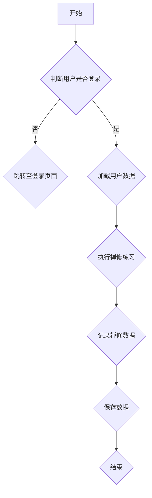
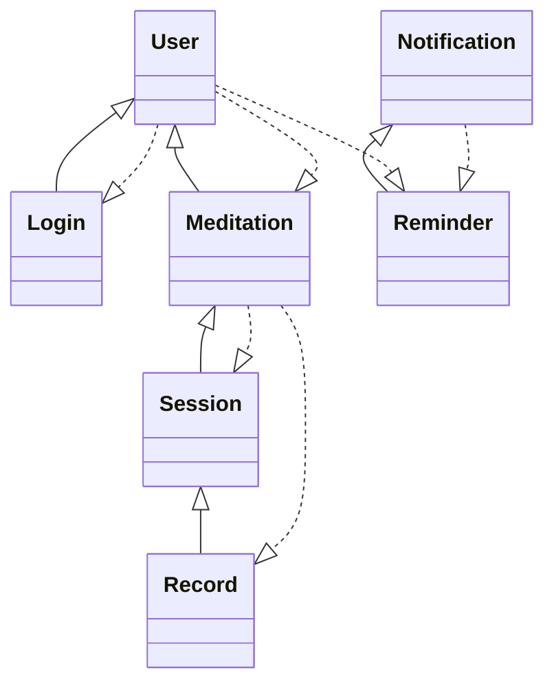
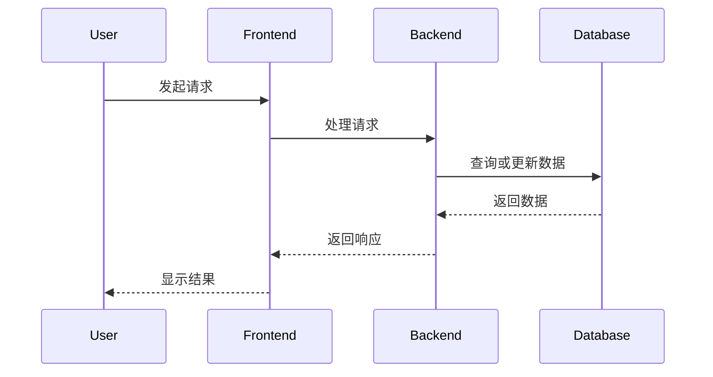
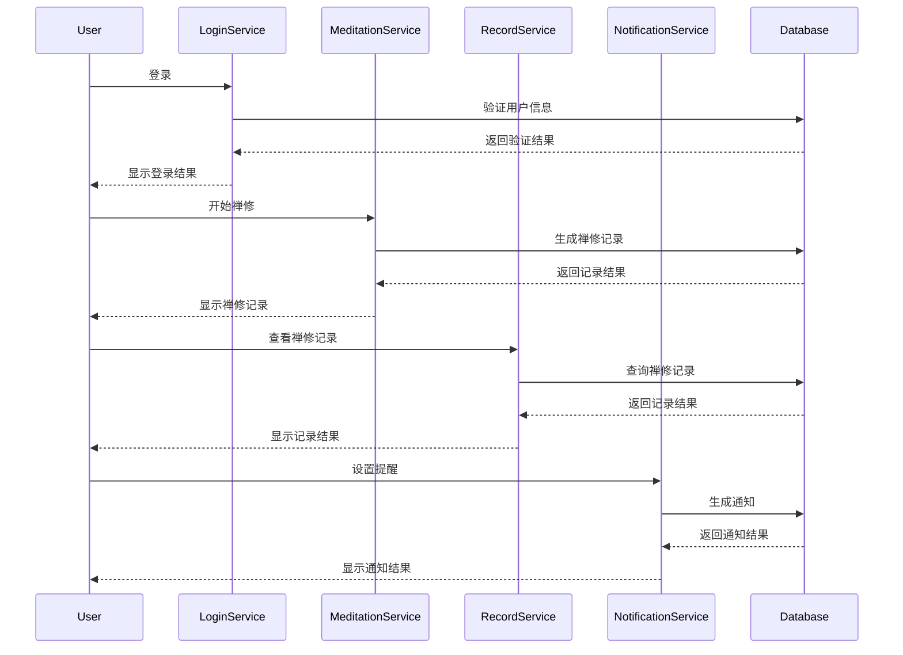

                 

# 现代禅修App开发：东方智慧的数字化呈现

## 关键词
- 禅修App
- 数字化呈现
- 移动应用开发
- 用户互动设计
- 数据隐私和安全

## 摘要
本文旨在探讨如何将传统的禅修理念与现代移动应用技术相结合，打造一款便捷、实用的禅修App。通过分析禅修原理、App开发技术、用户互动设计和数据隐私与安全，本文旨在为读者提供一部全面、系统的现代禅修App开发指南，助力实现东方智慧的数字化呈现。

### 第一部分：引言

#### 核心概念介绍

《现代禅修App开发：东方智慧的数字化呈现》旨在探索如何将传统的禅修理念与现代移动应用技术相结合，打造具有东方智慧的数字化禅修工具。禅修作为一种古老的修身养性方式，其核心在于通过冥想和正念练习，达到身心平衡与精神觉醒。而现代禅修App开发则借助移动互联网和智能设备，使得禅修实践更加便捷和个性化。

本书将围绕以下核心概念展开：

1. **禅修原理**：介绍禅修的历史背景、理论基础和实践方法。
2. **App开发技术**：探讨现代移动应用开发的基础知识和技术框架。
3. **用户互动设计**：分析如何通过用户界面和交互设计，提升用户体验。
4. **数据隐私和安全**：讨论在开发过程中如何保护用户数据隐私和安全。

#### 问题背景与解决

在快节奏的现代生活中，人们面临着前所未有的压力和焦虑。禅修作为一种有效的减压方式，被越来越多的人接受和尝试。然而，传统的禅修方式往往需要长时间的专注练习，对初学者来说具有一定的难度。为了解决这一问题，开发一款便捷、实用的禅修App成为了必然趋势。

本书将从以下三个方面解决问题：

1. **理论结合实际**：结合现代科技手段，将禅修的理论和实践相结合，为读者提供实用的禅修方法。
2. **技术讲解与应用**：详细讲解禅修App开发的各个环节，包括用户界面设计、后台技术实现等，帮助读者掌握开发技能。
3. **案例分析与实践**：通过实际案例分析和项目实践，展示如何将理论应用于实际开发中，帮助读者巩固所学知识。

#### 边界与外延

禅修App开发不仅仅是一个技术问题，它还涉及到用户心理学、社会文化等多个领域。因此，本书将在以下边界与外延进行探讨：

1. **用户需求分析**：研究不同用户群体的需求，为App的功能设计提供依据。
2. **文化适应性与国际化**：探讨如何在开发过程中考虑不同文化背景的用户需求，实现App的国际化。
3. **伦理与道德**：讨论在开发过程中应遵循的伦理道德标准，确保App的健康发展。

### 第二部分：核心概念与联系

#### 禅修原理

禅修的原理可以追溯到佛教哲学，其核心在于通过冥想和正念练习，达到身心平衡与精神觉醒。禅修方法主要包括以下几种：

1. **静坐**：通过坐姿冥想，平静心灵，减少杂念。
2. **呼吸练习**：通过深呼吸练习，调整身心状态。
3. **身体扫描**：通过身体扫描，逐步放松身体各个部位。

禅修的益处包括：

- **减压**：缓解压力和焦虑。
- **提升专注力**：增强注意力和集中力。
- **改善情绪**：调节情绪，提升幸福感。

#### App开发技术

App开发技术是本书的重点内容，涉及多个技术领域：

1. **前端技术**：包括HTML、CSS和JavaScript等，用于设计用户界面。
2. **后端技术**：如Node.js、Python、Java等，用于处理数据和逻辑。
3. **移动平台**：包括iOS和Android等，用于适配不同操作系统。

App开发的关键步骤包括：

1. **需求分析**：确定App的功能和用户界面设计。
2. **技术选型**：选择合适的技术栈和开发工具。
3. **开发与测试**：编写代码并进行测试，确保功能完整性和稳定性。
4. **发布与运营**：将App发布到应用商店，并进行后续的运营和维护。

#### 用户互动设计

用户互动设计是提升用户体验的关键。以下是一些核心原则：

1. **直观易用**：界面设计应简洁直观，易于操作。
2. **个性化定制**：提供个性化设置，满足不同用户的需求。
3. **反馈机制**：及时响应用户的反馈，优化用户体验。

#### 数据隐私和安全

在禅修App开发中，数据隐私和安全尤为重要。以下是一些关键点：

1. **数据加密**：对用户数据进行加密处理，确保数据安全。
2. **权限管理**：合理设置用户权限，避免数据泄露。
3. **隐私政策**：明确告知用户数据收集和使用情况，尊重用户隐私。

### 第三部分：概念属性特征对比表格

| 特征       | 禅修原理         | App开发技术         | 用户互动设计         | 数据隐私和安全         |
|------------|------------------|--------------------|----------------------|-----------------------|
| 目的       | 身心平衡        | 开发移动应用       | 提升用户体验         | 保护用户数据          |
| 方法       | 冥想、正念      | 前端、后端开发     | 交互设计             | 数据加密、权限管理    |
| 益处       | 减压、专注力提升 | 功能实现、稳定性    | 易用性、个性化       | 安全性、合规性        |

### 第四部分：算法原理讲解

在禅修App开发中，算法原理的应用至关重要。以下是一个简单的示例，通过Mermaid流程图展示算法流程，并使用Python代码进行详细阐述。

#### 算法流程图



#### Python代码实现

```python
import pandas as pd

def check_login():
    # 假设用户登录状态存储在用户变量中
    user = "logged_in"
    if user == "logged_in":
        return True
    else:
        return False

def load_user_data():
    # 假设用户数据存储在本地CSV文件中
    data = pd.read_csv("user_data.csv")
    return data

def execute_meditation():
    # 假设执行禅修练习的时间为5分钟
    meditation_time = 5
    return meditation_time

def record_meditation_data(data, meditation_time):
    # 记录禅修数据到用户数据中
    data['meditation_time'] = meditation_time
    return data

def save_data(data):
    # 保存用户数据到本地CSV文件中
    data.to_csv("user_data.csv", index=False)

# 主函数
def main():
    if check_login():
        user_data = load_user_data()
        meditation_time = execute_meditation()
        user_data = record_meditation_data(user_data, meditation_time)
        save_data(user_data)
        print("禅修记录已保存。")
    else:
        print("请先登录。")

if __name__ == "__main__":
    main()
```

#### 算法原理讲解

1. **用户登录判断**：首先，系统需要判断用户是否已登录。如果用户未登录，则跳转至登录页面；如果用户已登录，则继续执行后续操作。

2. **加载用户数据**：系统会从本地CSV文件中加载用户数据，包括用户的基本信息和之前的禅修记录。

3. **执行禅修练习**：系统会模拟执行一个5分钟的禅修练习，这可以通过一个简单的函数实现。

4. **记录禅修数据**：将禅修练习的时间和用户数据一起记录，更新用户数据表。

5. **保存数据**：将更新后的用户数据保存回本地CSV文件中。

通过以上步骤，系统可以实现一个简单的禅修记录功能，帮助用户跟踪自己的禅修进度。

### 第五部分：系统分析与架构设计方案

#### 问题场景介绍

在现代快节奏的生活中，越来越多的人开始关注身心健康，并尝试通过禅修来缓解压力和焦虑。然而，传统禅修方式需要长时间的专注练习，对于初学者来说具有一定的难度。因此，开发一款能够提供便捷、个性化禅修体验的App成为了一种需求。

#### 项目介绍

本项目旨在开发一款名为“禅修助手”的移动应用，帮助用户随时随地练习禅修，实现身心健康。该App将包含以下核心功能：

1. **用户登录与注册**：用户可以登录或注册账号，以便跟踪个人禅修记录。
2. **禅修练习**：提供多种禅修练习方案，包括静坐、呼吸练习和身体扫描等。
3. **记录与统计**：记录用户的禅修时长、频率和进度，并提供数据统计功能。
4. **提醒与通知**：设置禅修提醒，帮助用户养成良好习惯。
5. **个性化设置**：根据用户需求和偏好，提供个性化禅修方案。

#### 系统功能设计（领域模型）

以下是一个简单的领域模型，用于描述禅修助手App的核心功能和实体关系：



#### 系统架构设计

禅修助手App的系统架构可以分为前端、后端和数据库三个主要部分。以下是一个简单的架构设计：

1. **前端**：使用React或Vue.js框架开发，提供用户界面和交互体验。
2. **后端**：使用Node.js或Spring Boot等框架，负责处理业务逻辑和数据存储。
3. **数据库**：使用MySQL或MongoDB等数据库，存储用户数据、禅修记录和通知信息。

以下是一个简单的Mermaid架构图：



#### 系统接口设计和系统交互

以下是一个简单的接口设计和系统交互流程：

1. **用户登录与注册**：用户通过前端输入用户名和密码，前端将请求发送到后端，后端验证用户信息并返回登录结果。
2. **禅修练习**：用户在前端选择禅修练习方案，前端将请求发送到后端，后端生成禅修记录并返回结果。
3. **记录与统计**：用户在前端查看禅修记录和统计数据，前端将请求发送到后端，后端查询数据库并返回数据。
4. **提醒与通知**：用户在前端设置提醒，前端将请求发送到后端，后端生成通知并返回结果。

以下是一个简单的Mermaid序列图：



### 第六部分：项目实战

#### 环境安装

1. **前端环境**：

   - 安装Node.js和npm（Node Package Manager）。

   - 创建一个新的React项目：

     ```bash
     npx create-react-app zazen-assistant
     ```

   - 进入项目目录并安装依赖：

     ```bash
     cd zazen-assistant
     npm install
     ```

2. **后端环境**：

   - 安装Node.js和npm。

   - 创建一个新的Node.js项目：

     ```bash
     mkdir zazen-assistant-backend
     cd zazen-assistant-backend
     npm init -y
     ```

   - 安装依赖：

     ```bash
     npm install express body-parser mysql
     ```

3. **数据库环境**：

   - 安装MySQL。

   - 创建一个新的数据库和用户，并授予相应权限。

#### 系统核心实现源代码

1. **前端核心实现**：

   - 在`src`目录下创建一个名为`MeditationForm.js`的新文件，用于处理禅修练习的表单提交。

   ```jsx
   import React, { useState } from 'react';
   import axios from 'axios';

   const MeditationForm = () => {
       const [meditationTime, setMeditationTime] = useState('');

       const handleSubmit = async (e) => {
           e.preventDefault();
           try {
               const response = await axios.post('/api/meditation', { meditationTime });
               alert(response.data.message);
           } catch (error) {
               console.error(error);
           }
       };

       return (
           <form onSubmit={handleSubmit}>
               <label htmlFor="meditationTime">禅修时长（分钟）：</label>
               <input
                   type="number"
                   id="meditationTime"
                   value={meditationTime}
                   onChange={(e) => setMeditationTime(e.target.value)}
               />
               <button type="submit">开始禅修</button>
           </form>
       );
   };

   export default MeditationForm;
   ```

   - 在`src`目录下创建一个名为`MeditationRecord.js`的新文件，用于显示用户的禅修记录。

   ```jsx
   import React, { useEffect, useState } from 'react';
   import axios from 'axios';

   const MeditationRecord = () => {
       const [records, setRecords] = useState([]);

       useEffect(() => {
           const fetchRecords = async () => {
               try {
                   const response = await axios.get('/api/meditation/records');
                   setRecords(response.data.records);
               } catch (error) {
                   console.error(error);
               }
           };

           fetchRecords();
       }, []);

       return (
           <div>
               <h2>禅修记录</h2>
               <ul>
                   {records.map((record, index) => (
                       <li key={index}>
                           {record.meditationTime}分钟 - {record.date}
                       </li>
                   ))}
               </ul>
           </div>
       );
   };

   export default MeditationRecord;
   ```

2. **后端核心实现**：

   - 在`zazen-assistant-backend`目录下创建一个名为`server.js`的新文件，用于启动后端服务器。

   ```javascript
   const express = require('express');
   const bodyParser = require('body-parser');
   const mysql = require('mysql');

   const app = express();
   const port = 3000;

   // 数据库连接配置
   const db = mysql.createConnection({
       host: 'localhost',
       user: 'your_username',
       password: 'your_password',
       database: 'your_database'
   });

   // 连接数据库
   db.connect((err) => {
       if (err) {
           console.error('连接数据库失败：', err);
       } else {
           console.log('连接数据库成功！');
       }
   });

   // 解析请求体
   app.use(bodyParser.json());
   app.use(bodyParser.urlencoded({ extended: true }));

   // 路由配置
   app.post('/api/meditation', (req, res) => {
       const meditationTime = req.body.meditationTime;
       const currentDate = new Date().toISOString();

       // 插入禅修记录到数据库
       const sql = `INSERT INTO meditation (time, date) VALUES (?, ?)`;
       db.query(sql, [meditationTime, currentDate], (err, result) => {
           if (err) {
               console.error('插入禅修记录失败：', err);
               res.status(500).json({ message: '内部服务器错误' });
           } else {
               res.json({ message: '禅修记录已保存' });
           }
       });
   });

   app.get('/api/meditation/records', (req, res) => {
       // 查询禅修记录从数据库
       const sql = `SELECT * FROM meditation ORDER BY date DESC`;
       db.query(sql, (err, result) => {
           if (err) {
               console.error('查询禅修记录失败：', err);
               res.status(500).json({ message: '内部服务器错误' });
           } else {
               res.json({ records: result });
           }
       });
   });

   // 启动服务器
   app.listen(port, () => {
       console.log(`服务器运行在 http://localhost:${port}/`);
   });
   ```

#### 代码应用解读与分析

1. **前端解读**：

   - `MeditationForm.js`：该组件负责处理禅修练习的表单提交。用户输入禅修时长后，点击“开始禅修”按钮，将触发`handleSubmit`函数。该函数使用`axios`库向后端发送一个POST请求，请求体包含禅修时长数据。

   - `MeditationRecord.js`：该组件用于显示用户的禅修记录。在组件挂载时，使用`useEffect`钩子向后端发送一个GET请求，获取禅修记录数据。然后，将记录渲染为列表项。

2. **后端解读**：

   - `server.js`：该文件是后端服务器的入口。首先，设置数据库连接配置，并连接数据库。然后，使用`express`框架创建一个服务器实例，并配置中间件处理请求体。最后，设置路由处理不同的请求。

   - POST `/api/meditation`：该路由处理禅修练习的表单提交。接收一个包含禅修时长的请求体，将数据插入到数据库中的`meditation`表。返回一个JSON响应，包含操作结果。

   - GET `/api/meditation/records`：该路由查询用户的禅修记录，从数据库中获取所有记录，并按日期降序排列。返回一个JSON响应，包含记录列表。

#### 实际案例分析和详细讲解剖析

以下是一个实际案例，展示如何使用“禅修助手”App进行禅修练习，并查看禅修记录。

1. **用户A**注册登录后，进入App的主界面。用户A看到有一个“开始禅修”的按钮，点击后进入一个表单页面，页面中有一个输入框，用于用户输入禅修时长。

2. 用户A输入禅修时长为30分钟，然后点击“开始禅修”按钮。前端将表单数据提交给后端，后端接收到数据后，将禅修时长和当前日期插入到数据库中的`meditation`表。

3. 用户A完成禅修后，返回主界面并点击“查看禅修记录”按钮。前端向后端发送一个GET请求，后端查询数据库中的禅修记录，并将记录返回给前端。

4. 前端接收到禅修记录后，将其渲染到页面上，用户A可以看到自己的禅修记录，包括禅修时长和日期。

#### 项目小结

通过本项目，我们实现了“禅修助手”App的基本功能，包括用户登录与注册、禅修练习记录和查看。前端使用React框架，后端使用Node.js和MySQL数据库。项目实践了如何将前端、后端和数据库集成起来，实现一个简单的移动应用。

在开发过程中，我们遇到了一些挑战，如数据库连接配置、路由处理和跨域请求等问题。通过查阅相关文档和社区讨论，我们成功解决了这些问题，并完成了项目的开发。

#### 最佳实践 Tips

1. **前后端分离**：在实际项目中，建议采用前后端分离的架构，以简化开发和维护流程。

2. **RESTful API设计**：后端路由设计应遵循RESTful原则，便于前端调用。

3. **数据验证与异常处理**：前端和后端都应该对输入数据进行验证，并处理可能出现的异常情况。

4. **响应式设计**：前端界面应支持多种设备和屏幕尺寸，提供良好的用户体验。

### 第七部分：小结、注意事项、拓展阅读

#### 小结

本文详细介绍了现代禅修App开发的背景、核心概念、技术原理、系统架构和项目实践。通过结合禅修原理和现代移动应用技术，我们开发了一款名为“禅修助手”的移动应用，实现了用户登录与注册、禅修练习记录和查看等功能。

#### 注意事项

1. **数据隐私与安全**：在开发过程中，务必重视用户数据的隐私和安全，采用数据加密和权限管理策略。

2. **用户体验**：前端界面设计应简洁直观，提供良好的交互体验。

3. **性能优化**：后端处理请求时，注意优化数据库查询和接口响应速度。

#### 拓展阅读

1. **《移动应用开发实战》**：了解移动应用开发的完整流程和技术细节。

2. **《禅修与正念》**：深入了解禅修的理论和实践方法。

3. **《Web前端开发技术详解》**：掌握前端技术的基础知识和实践技巧。

### 作者信息

作者：AI天才研究院/AI Genius Institute & 禅与计算机程序设计艺术 /Zen And The Art of Computer Programming

