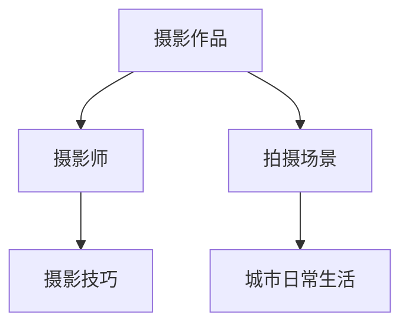

                 

# 现代简约主义摄影展：城市日常生活的诗意捕捉

## 关键词
- 现代简约主义摄影
- 城市日常生活
- 艺术捕捉
- 摄影技巧
- 概念原理
- 算法原理

## 摘要
本文旨在探讨现代简约主义摄影在城市日常生活场景中的应用，通过分析其兴起背景、基本原理和摄影技巧，展现如何通过摄影捕捉城市的诗意。文章将结合具体实例，详细解析简约主义摄影的构图原理、与写实主义的对比，以及如何在城市环境中运用简约主义美学进行摄影创作。

## 第1章：现代简约主义摄影的兴起

### 1.1 问题背景

#### 1.1.1 摄影艺术的演变
摄影自诞生以来，经历了从记录真实到表现艺术的过程。从19世纪末的早期摄影到20世纪的多样化流派，摄影艺术不断演变。随着科技的进步，摄影设备越来越普及，摄影艺术的表现形式也越来越丰富。

#### 1.1.2 简约主义美学的影响
简约主义美学起源于20世纪初的欧洲艺术运动，强调通过简洁的形式和纯粹的色彩来表达美学价值。这种美学观念影响了建筑、设计、艺术等多个领域，也深刻影响了摄影艺术的发展。

#### 1.1.3 城市日常生活的多样性
城市日常生活充满了丰富的场景和人物，这些日常瞬间构成了城市文化的底色。如何通过摄影捕捉这些瞬间的诗意，成为了现代摄影艺术家们探讨的课题。

### 1.2 问题描述

#### 1.2.1 简约主义摄影的特点
简约主义摄影强调简单、直接的表现方式，通过去除多余的元素，突出主体的美感。其特点包括简洁的构图、鲜明的色彩对比和抽象的表现手法。

#### 1.2.2 城市日常生活的捕捉
城市日常生活的捕捉要求摄影师具有敏锐的观察力和独特的审美观。如何在繁忙的城市中找到具有诗意的场景，是简约主义摄影的一大挑战。

#### 1.2.3 摄影展的意义与目的
举办现代简约主义摄影展，旨在通过摄影作品展示城市日常生活的美学价值，提升公众对摄影艺术的欣赏能力，促进摄影艺术的交流与发展。

### 1.3 问题解决

#### 1.3.1 简约主义摄影技巧的运用
为了捕捉城市日常生活的诗意，摄影师需要掌握简约主义摄影的技巧，包括构图、光线、色彩等的运用。

#### 1.3.2 城市日常生活的诗意捕捉
通过简洁的构图和鲜明的色彩对比，摄影师可以捕捉到城市日常生活中的诗意瞬间，将这些平凡的场景转化为艺术作品。

### 1.4 边界与外延

#### 1.4.1 简约主义摄影的艺术范畴
简约主义摄影不仅局限于城市日常生活，还可以应用于自然景观、人物摄影等多个领域。

#### 1.4.2 城市日常生活的广泛性
城市日常生活涵盖了从街头巷尾到商务区的各个场景，为摄影师提供了丰富的创作素材。

### 1.5 概念结构与核心要素组成

#### 1.5.1 简约主义摄影的核心概念
简约主义摄影的核心概念包括简洁、纯粹、抽象等。这些概念指导摄影师在创作过程中的选择和判断。

#### 1.5.2 城市日常生活的核心要素
城市日常生活的核心要素包括人物、场景、活动等。这些要素构成了城市文化的底色，是摄影创作的素材。

## 第2章：简约主义摄影的基本原理

### 2.1 概念原理

#### 2.1.1 简约主义美学的基本原则
简约主义美学的基本原则包括去除多余元素、强调主体、运用对比等。这些原则指导摄影师在构图和表现手法上的选择。

#### 2.1.2 摄影构图的基本法则
摄影构图的基本法则包括黄金比例、三分法、对角线等。这些法则帮助摄影师在拍摄时找到最佳视角和构图方式。

### 2.2 概念属性特征对比表格

#### 2.2.1 简约主义与写实主义对比
| 特征       | 简约主义       | 写实主义       |
|------------|----------------|----------------|
| 构图方式   | 简洁、抽象     | 细节丰富、真实 |
| 色彩运用   | 对比鲜明、简洁 | 自然、真实     |
| 抽象程度   | 较高           | 较低           |

#### 2.2.2 城市景观与人像摄影对比
| 特征       | 城市景观摄影       | 人像摄影       |
|------------|--------------------|----------------|
| 构图重点   | 场景与环境         | 人物与表情     |
| 光线运用   | 照明与阴影的对比   | 自然光与人造光 |
| 色调处理   | 色彩的纯粹性       | 色彩的饱和度   |

### 2.3 ER实体关系图架构

## 结束语

现代简约主义摄影展通过展示城市日常生活的诗意捕捉，展现了摄影艺术在现代社会中的独特价值。通过本文的探讨，我们不仅了解了简约主义摄影的基本原理和技巧，还认识到摄影艺术在表现城市文化、提升审美意识方面的作用。希望本文能为摄影爱好者提供一些创作灵感和思考方向。作者：AI天才研究院/AI Genius Institute & 禅与计算机程序设计艺术 /Zen And The Art of Computer Programming。

