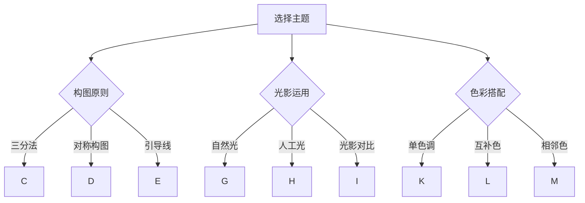
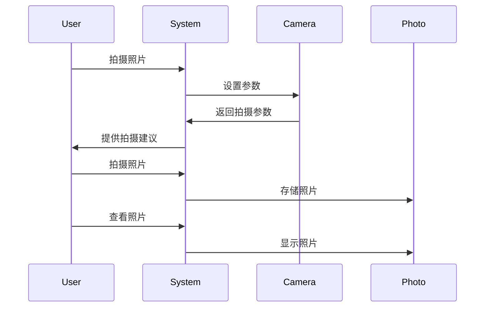
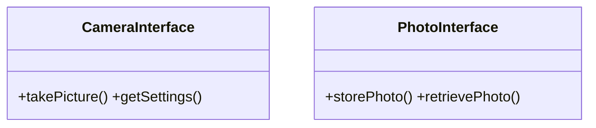
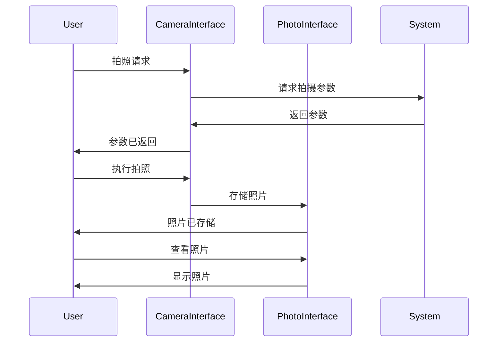

                 

# 《现代简约主义摄影：捕捉生活本质的影像艺术》

## 关键词：现代摄影、简约主义、生活本质、影像艺术

> 摘要：本文深入探讨现代简约主义摄影的艺术特征与创作技巧，通过分析其起源、核心概念和创作方法，阐述如何在摄影中捕捉生活的本质，以及如何通过影像艺术表现提升作品的价值。

## 《现代简约主义摄影：捕捉生活本质的影像艺术》目录大纲

### 第一部分：简约主义摄影概述

#### 第1章：简约主义摄影的起源与演变

1.1 简约主义摄影的起源

1.2 简约主义摄影的演变过程

1.3 简约主义摄影的艺术特征

1.4 简约主义摄影与其他摄影流派的区别

#### 第2章：简约主义摄影的核心概念

2.1 简约主义摄影的基本要素

2.2 简约主义摄影的构图原则

2.3 简约主义摄影的光影运用

2.4 简约主义摄影的色彩搭配

#### 第3章：简约主义摄影的创作技巧

3.1 选择合适的摄影器材

3.2 环境的掌控与利用

3.3 捕捉瞬间的技巧

3.4 后期处理的简约化

### 第二部分：生活本质的捕捉

#### 第4章：自然景观中的简约之美

4.1 大自然的线条与形状

4.2 光影在自然景观中的应用

4.3 色彩与季节的简约表达

#### 第5章：城市风光的简约呈现

5.1 城市建筑的简约美学

5.2 人流与车流的简约构图

5.3 城市夜景的独特魅力

#### 第6章：人物摄影的简约风格

6.1 人物姿态的简约呈现

6.2 脸部特写的简约捕捉

6.3 情感的简约表达

#### 第7章：生活细节的简约表达

7.1 家居环境的简约之美

7.2 食物的简约呈现

7.3 生活琐事的简约捕捉

### 第三部分：影像艺术的表现与提升

#### 第8章：影像艺术的视觉语言

8.1 影像艺术的基本元素

8.2 影像艺术的视觉张力

8.3 影像艺术的情感表达

#### 第9章：影像艺术的创作灵感

9.1 从生活中寻找灵感

9.2 阅读与摄影的关系

9.3 其他艺术形式对摄影的启发

#### 第10章：影像艺术的提升与传播

10.1 摄影展览的策划与举办

10.2 摄影作品的评审与交流

10.3 摄影作品的传播途径

### 总结与展望

#### 第11章：现代简约主义摄影的发展趋势

11.1 简约主义摄影的未来发展方向

11.2 技术革新对简约主义摄影的影响

11.3 简约主义摄影的社会意义

### 附录

#### A. 摄影器材推荐

#### B. 经典摄影作品赏析

#### C. 摄影学习资源推荐

#### D. 简约主义摄影术语表

## 第1章：简约主义摄影的起源与演变

### 1.1 简约主义摄影的起源

简约主义摄影，顾名思义，是摄影艺术中追求简洁、纯粹、本质的一种风格。其起源可以追溯到20世纪初的摄影艺术发展历程。在19世纪末和20世纪初，随着摄影技术的不断进步，摄影从科学实验转变为一种独立的艺术形式。许多摄影家开始探索如何通过摄影来表达艺术，而非仅仅记录现实。

简约主义摄影的先驱之一是法国摄影家阿尔弗雷德·斯蒂格里茨（Alfred Stieglitz）。他于20世纪初在纽约成立了一个名为“291”的摄影展览空间，展示了大量简约主义摄影作品，提倡“纯粹摄影”的理念。斯蒂格里茨认为，摄影艺术应该摆脱外部的装饰和修饰，专注于捕捉摄影的本质，即光与影的和谐。

### 1.2 简约主义摄影的演变过程

随着时间的推移，简约主义摄影不断发展，形成了多种不同的风格和流派。其中，最具代表性的演变过程包括以下几个阶段：

1. **纯粹摄影**：这一阶段强调摄影作为艺术媒介的独特性，提倡直接通过镜头捕捉画面，而不是通过后期处理或人工修饰来创造效果。

2. **构图简约**：随着摄影技术的进步，摄影家开始关注构图，追求通过简洁的构图来表达复杂的情感和意义。这一阶段的代表人物包括爱德华·韦斯顿（Edward Weston）和安妮·莱博维茨（Annie Leibovitz）。

3. **情感表达**：简约主义摄影逐渐从追求形式美转向关注情感表达。摄影家通过简洁的画面，传达深刻的情感和内在的思考。

4. **现代简约主义**：现代简约主义摄影在继承传统的基础上，更加注重简化、极简和抽象的表达方式，追求在简洁中展现生活的本质。

### 1.3 简约主义摄影的艺术特征

简约主义摄影的艺术特征主要体现在以下几个方面：

1. **简洁**：简约主义摄影追求简洁的画面效果，通过去除不必要的元素，突出主题，使作品更加纯粹、有力。

2. **纯粹**：摄影家通过镜头直接捕捉画面，不依赖后期处理，强调摄影作为艺术媒介的独特性。

3. **情感表达**：简约主义摄影不仅仅是形式上的简洁，更是一种情感和思考的表达。摄影家通过简洁的画面，传达深刻的情感和思想。

4. **形式美**：虽然简约主义摄影强调简洁，但并不意味着忽略形式美。相反，摄影家通过精心的构图和光影运用，创造出具有强烈视觉冲击力的作品。

### 1.4 简约主义摄影与其他摄影流派的区别

简约主义摄影与其他摄影流派（如纪实摄影、肖像摄影、艺术摄影等）有明显的区别：

1. **纪实摄影**：纪实摄影强调真实记录，关注社会现实和个人生活。与简约主义摄影相比，纪实摄影往往更注重细节和背景，而简约主义摄影则追求简洁和纯粹。

2. **肖像摄影**：肖像摄影主要关注人物形象，通过精细的构图和光影塑造，展现人物的特点和个性。简约主义摄影虽然也涉及人物摄影，但更注重简洁和抽象的表现。

3. **艺术摄影**：艺术摄影涵盖多种风格和流派，强调摄影作为艺术形式的表现力。与简约主义摄影相比，艺术摄影更注重创意和形式，而简约主义摄影则更注重简洁和纯粹。

通过以上分析，我们可以看出，简约主义摄影是一种追求简洁、纯粹、本质的摄影风格，它在摄影艺术中占有重要地位，并不断演变和发展。在接下来的章节中，我们将深入探讨简约主义摄影的核心概念和创作技巧，帮助读者更好地理解和实践这一艺术形式。## 第2章：简约主义摄影的核心概念

### 2.1 简约主义摄影的基本要素

简约主义摄影的基本要素包括构图、光影、色彩和主题。这些要素相互配合，共同构成了简约主义摄影的独特魅力。

1. **构图**：构图是简约主义摄影的核心要素。通过精心的构图，摄影家可以突出主题，去除多余元素，使画面简洁而有力。常见的构图方法有三分法、对称构图、引导线等。

2. **光影**：光影是摄影中不可或缺的元素。简约主义摄影强调通过光影的对比和运用，营造氛围和情感。例如，逆光可以创造出柔和的轮廓光，而侧光则可以突出物体的质感。

3. **色彩**：色彩在简约主义摄影中起到重要的修饰作用。通过色彩的搭配和运用，摄影家可以增强画面的视觉冲击力。简约主义摄影通常采用简单的色彩方案，如单色、互补色等。

4. **主题**：主题是简约主义摄影的核心。摄影家通过简洁的画面，传达深刻的主题和情感。主题可以是自然、城市、人物，甚至是抽象的概念。

### 2.2 简约主义摄影的构图原则

简约主义摄影的构图原则主要体现在以下几个方面：

1. **简洁**：简洁是简约主义摄影的首要原则。通过去除多余的元素，摄影家可以更清晰地传达主题和情感。

2. **单一焦点**：简约主义摄影强调单一焦点，使观众的视线集中在主题上。这可以通过简单的构图和强烈的对比来实现。

3. **对称与平衡**：对称和平衡是构图的重要原则。通过对称的构图，摄影家可以创造出稳定、和谐的画面。而平衡则可以通过对比来实现，使画面具有动态感。

4. **引导线**：引导线是一种常见的构图技巧，通过引导观众的视线，摄影家可以更有效地突出主题。

### 2.3 简约主义摄影的光影运用

光影在简约主义摄影中起到至关重要的作用。通过巧妙地运用光影，摄影家可以增强画面的层次感和氛围。

1. **自然光**：自然光是简约主义摄影的首选光源。通过自然光，摄影家可以捕捉到自然的光影效果，使画面更具有真实感和艺术感。

2. **人工光**：人工光可以创造出独特的光影效果，如轮廓光、逆光等。通过合理地运用人工光，摄影家可以增强画面的表现力。

3. **光影对比**：光影对比是增强画面层次感和视觉冲击力的有效方法。通过对比明暗、色彩等，摄影家可以创造出强烈的视觉张力。

### 2.4 简约主义摄影的色彩搭配

色彩在简约主义摄影中起到重要的修饰作用。通过简单的色彩搭配，摄影家可以增强画面的视觉冲击力。

1. **单色**：单色是简约主义摄影常用的色彩方案。通过单色，摄影家可以创造出统一、简洁的画面效果。

2. **互补色**：互补色是一种强烈的色彩对比，可以创造出鲜明、有力的视觉效果。

3. **相邻色**：相邻色是一种柔和的色彩对比，可以创造出和谐、温馨的画面效果。

通过以上分析，我们可以看出，简约主义摄影的核心概念主要包括构图、光影、色彩和主题。这些要素相互配合，共同构成了简约主义摄影的独特魅力。在接下来的章节中，我们将进一步探讨简约主义摄影的创作技巧，帮助读者更好地理解和实践这一艺术形式。## 第3章：简约主义摄影的创作技巧

### 3.1 选择合适的摄影器材

在进行简约主义摄影创作时，选择合适的摄影器材至关重要。合适的器材可以帮助摄影家更好地捕捉到画面中的光影和细节，从而提升作品的质量。

1. **相机**：选择一台适合的相机是关键。单反相机（DSLR）因其出色的画质和可换镜头的特点，常常被简约主义摄影师所青睐。无反相机（mirrorless camera）则因其轻便和快速对焦的优势，也在逐渐受到摄影师的喜爱。

2. **镜头**：不同类型的镜头适用于不同的拍摄场景。广角镜头适合拍摄大场景，而长焦镜头则适合拍摄特写和远距离景物。对于简约主义摄影，通常推荐使用标准镜头（50mm）和广角镜头（24mm），这些镜头能够提供自然的视角和丰富的细节。

3. **镜头滤镜**：滤镜在摄影中起到保护镜头和改变光线效果的作用。对于简约主义摄影，常用的滤镜包括中性灰滤镜（ND滤镜）和渐变灰滤镜（GND滤镜）。ND滤镜可以延长曝光时间，创造出独特的光影效果；GND滤镜则可以平衡画面中的亮暗对比。

4. **三脚架**：三脚架在长时间曝光和低光环境下的拍摄中尤为重要。一个稳定的三脚架可以帮助摄影家避免因手抖而产生的模糊，确保画面的清晰度。

### 3.2 环境的掌控与利用

环境是简约主义摄影中不可或缺的一部分。摄影家需要善于观察和利用环境中的元素，创造出简洁、有力的画面。

1. **背景选择**：简洁的背景有助于突出主题。摄影家可以选择单色背景或自然背景，避免复杂的图案和色彩干扰观众的视线。

2. **环境光线**：光线是摄影的灵魂。摄影家需要根据拍摄主题和场景选择合适的光线。自然光通常是最好的选择，因为它可以创造出丰富的光影效果。在室内拍摄时，可以使用人工光源，如LED灯或柔光箱，来模拟自然光的效果。

3. **环境氛围**：氛围是画面情感的体现。摄影家可以通过调整曝光、色调和构图来营造特定的氛围，如宁静、温馨或神秘。

### 3.3 捕捉瞬间的技巧

简约主义摄影强调捕捉生活中的瞬间，这些瞬间往往是平凡而真实的，但它们蕴含着深刻的意义。

1. **预见性构图**：摄影家需要在拍摄前预见可能出现的场景和画面，并提前构图。这种预见性可以帮助摄影家在最佳时机按下快门。

2. **耐心等待**：捕捉美好的瞬间需要耐心。摄影家应该等待合适的时机，如人物的表情、光线的变化等，确保画面具有足够的情感和张力。

3. **快速反应**：在拍摄过程中，摄影家需要快速反应，抓住转瞬即逝的瞬间。这要求摄影家具备敏锐的观察力和快速的手速。

### 3.4 后期处理的简约化

后期处理是提升摄影作品质量的重要环节。在简约主义摄影中，后期处理同样追求简洁和纯粹。

1. **裁剪**：裁剪是简化画面、突出主题的有效手段。通过裁剪，摄影家可以去除不必要的元素，使画面更加简洁、有力。

2. **色调调整**：色调调整可以影响画面的氛围和情感。简约主义摄影通常采用简单的色调调整，如黑白或单色调，以增强画面的纯粹感。

3. **光影修饰**：适当的光影修饰可以增强画面的层次感和视觉冲击力。但要注意，修饰不应过度，以免破坏画面的纯粹性。

4. **去除杂点**：在后期处理中，去除杂点可以确保画面的纯净。但同样需要注意，不应过度处理，以免损失细节。

通过以上分析，我们可以看出，简约主义摄影的创作技巧涉及多个方面，包括器材选择、环境掌控、瞬间捕捉和后期处理。掌握这些技巧，可以帮助摄影家更好地捕捉生活的本质，创作出具有深度和思考的摄影作品。在接下来的章节中，我们将继续探讨如何在不同的场景中运用简约主义摄影技巧，捕捉生活中的美好瞬间。## 第4章：自然景观中的简约之美

自然景观是简约主义摄影的一个重要主题，它提供了丰富的线条、形状和色彩，为摄影家提供了无限的创作空间。在自然景观中，简约之美主要体现在以下几个方面：

### 4.1 大自然的线条与形状

线条和形状是自然景观中的基本元素，它们在简约主义摄影中起到了至关重要的作用。

1. **线条的运用**：大自然中有许多线条，如山脉的轮廓线、河流的曲线、树枝的线条等。这些线条可以引导观众的视线，创造出视觉上的节奏和韵律。摄影家可以通过不同的角度和光线，捕捉这些线条的美丽和动感。

2. **形状的构图**：形状包括自然中的各种几何形态，如圆形、三角形、正方形等。在摄影中，摄影家可以利用这些形状来创造出简洁而有力的构图。例如，一个完美的圆形湖泊可以与天空中圆形的太阳形成呼应，创造出和谐的画面。

### 4.2 光影在自然景观中的应用

光影是自然景观中最具表现力的元素之一。在简约主义摄影中，光影的运用可以大大增强画面的层次感和情感表达。

1. **逆光和侧光**：逆光和侧光常用于自然景观摄影，可以创造出丰富的光影效果。逆光可以使树木和花草的边缘产生柔和的轮廓光，而侧光则可以突出物体的质感和立体感。

2. **光影对比**：光影对比可以增强画面的视觉冲击力。在自然景观摄影中，摄影家可以利用早晨和傍晚的光线，捕捉到丰富的光影对比，使画面更具表现力。

### 4.3 色彩与季节的简约表达

色彩在自然景观摄影中起到了重要的修饰作用。不同的季节和天气条件会带来不同的色彩效果，摄影家可以利用这些色彩来传达特定的情感和氛围。

1. **单色调**：单色调是简约主义摄影常用的色彩方案，它可以使画面更加简洁、纯粹。在自然景观摄影中，摄影家可以选择单色调的背景，如一片绿草地或一片白雪覆盖的山丘，突出主题。

2. **季节色彩**：不同的季节会有不同的色彩表现。春天的新绿、夏天的浓烈、秋天的丰收和冬天的纯净，每个季节都有其独特的色彩魅力。摄影家可以通过捕捉季节色彩，传达出季节特有的情感和氛围。

### 4.4 自然景观中的简约主义摄影实例

以下是一些自然景观中的简约主义摄影实例，它们展示了如何通过简洁的构图、光影和色彩，捕捉大自然的简约之美：

1. **山川河流**：山川河流是自然景观中的典型代表。摄影家可以通过简洁的构图，捕捉山脉的轮廓线或河流的曲线，利用逆光或侧光创造出丰富的光影效果。

2. **花草树木**：花草树木是自然景观中常见的元素。摄影家可以通过特写镜头捕捉花草的细节，利用侧光或逆光突出花朵的质感和立体感。

3. **晨曦和晚霞**：晨曦和晚霞是自然界中最美丽的时刻。摄影家可以通过简洁的构图和光影对比，捕捉到这个瞬间的美丽，创造出富有情感和氛围的画面。

通过以上分析，我们可以看出，自然景观中的简约之美主要体现在线条、形状、光影和色彩等方面。在自然景观摄影中，摄影家可以通过简洁的构图、光影和色彩，捕捉到大自然的简约和纯粹，创作出具有深度和思考的摄影作品。在接下来的章节中，我们将继续探讨如何在城市风光和人物摄影中运用简约主义摄影技巧，捕捉生活中的美好瞬间。## 第5章：城市风光的简约呈现

城市风光是简约主义摄影的另一个重要主题，它以其独特的建筑线条、人流车流和夜景魅力，为摄影家提供了丰富的创作素材。在城市风光摄影中，简约主义风格强调通过简洁、有力的画面，捕捉城市生活的本质和节奏。

### 5.1 城市建筑的简约美学

城市建筑是城市风光摄影中的主要元素，其简洁而有力的线条和形状为摄影家提供了创作灵感。

1. **线条与形状**：城市建筑中的线条和形状是简约主义摄影的关键。摄影家可以通过垂直和水平的线条，创造出稳定而有序的构图。例如，摩天大楼的线条可以引导观众的视线，使其感受到城市的高耸和力量。

2. **几何构图**：几何构图是简约主义摄影的常用技巧。通过将城市建筑看作几何形状的组合，摄影家可以创造出简洁而富有美感的画面。例如，一个圆形的喷泉和一个正方形的广场可以形成有趣的对比，增强画面的视觉张力。

### 5.2 人流与车流的简约构图

城市的人流和车流是城市风光摄影中的动态元素，通过合理的构图，摄影家可以捕捉到城市生活的活力和节奏。

1. **引导线**：引导线是一种常用的构图技巧，通过引导观众的视线，摄影家可以突出人流和车流的动态感。例如，一条直线的人行道或一条弯曲的车辆轨迹，都可以成为引导线，增强画面的动态效果。

2. **透视**：透视是捕捉城市人流和车流动态感的重要工具。通过运用透视原理，摄影家可以创造出具有深度和层次感的画面，使城市的人流和车流看起来更加真实和生动。

### 5.3 城市夜景的独特魅力

夜景是城市风光摄影中的一个特殊场景，其独特的光线和氛围为摄影家提供了无限的创作空间。

1. **光影对比**：夜景摄影中，光影对比尤为重要。通过合理运用光影，摄影家可以创造出丰富的画面层次感。例如，一栋建筑的轮廓光可以与黑暗的背景形成强烈的对比，增强画面的视觉冲击力。

2. **灯光元素**：灯光是夜景摄影中不可或缺的元素。摄影家可以通过捕捉建筑和街道上的灯光，创造出独特的美感。例如，一盏明亮的路灯或一排彩灯，都可以成为画面的亮点，增添画面色彩。

### 5.4 城市风光中的简约主义摄影实例

以下是一些城市风光中的简约主义摄影实例，它们展示了如何通过简洁、有力的构图，捕捉城市生活的简约之美：

1. **城市高楼**：通过简洁的构图和强烈的对比，摄影家可以捕捉到城市高楼的外观和结构，创造出简洁而有力的画面效果。

2. **桥梁和隧道**：桥梁和隧道是城市风光中的典型元素，它们以其独特的结构和线条，为摄影家提供了丰富的创作素材。通过简洁的构图和光影对比，摄影家可以捕捉到桥梁和隧道的简约美学。

3. **城市夜景**：夜景摄影通过光影的运用，可以创造出丰富的画面层次感和情感表达。摄影家可以通过捕捉城市夜景中的灯光和建筑，创造出独特而富有魅力的画面。

通过以上分析，我们可以看出，城市风光中的简约主义摄影主要表现在建筑的线条与形状、人流与车流的动态构图，以及夜景的光影对比和灯光元素。通过简洁、有力的构图，摄影家可以捕捉到城市生活的本质和节奏，创作出具有深度和思考的摄影作品。在接下来的章节中，我们将继续探讨如何在人物摄影和生活细节中运用简约主义摄影技巧，捕捉生活中的美好瞬间。## 第6章：人物摄影的简约风格

人物摄影是简约主义摄影中的重要组成部分，通过简洁的画面和细腻的表现，摄影家可以捕捉到人物的本质特征和情感。在人物摄影中，简约风格主要体现在姿态、面部特写和情感表达等方面。

### 6.1 人物姿态的简约呈现

人物姿态的简约呈现是人物摄影中的一个关键要素。通过简洁的姿态，摄影家可以突出人物的特征和气质。

1. **简化动作**：在人物摄影中，简化动作是一种有效的简约手法。摄影家可以通过减少动作的复杂性，使人物姿态更加简洁、有力。例如，一个简单的站立姿态或一个轻松的手势，都可以有效地传达人物的情感和个性。

2. **线条与形状**：通过线条和形状的运用，摄影家可以创造出简洁而富有表现力的人物姿态。例如，一个简洁的轮廓线或一个独特的形状，都可以增强画面的视觉吸引力。

### 6.2 脸部特写的简约捕捉

脸部特写是人物摄影中最常见的表现手法之一，通过简洁的构图和细腻的光影，摄影家可以捕捉到人物的面部特征和情感。

1. **简化背景**：在脸部特写中，简化背景是一种有效的简约手法。通过选择单色或简洁的背景，摄影家可以使观众的视线集中在人物面部，增强面部特写的表现力。

2. **光影对比**：光影对比是增强脸部特写效果的重要手段。通过合理运用光影，摄影家可以突出面部特征，传达人物的情感和情绪。例如，逆光可以创造出柔和的轮廓光，而侧光则可以突出面部的立体感。

### 6.3 情感的简约表达

情感表达是人物摄影的核心，简约风格在情感表达中起到了至关重要的作用。

1. **简洁的表情**：在情感表达中，简洁的表情是一种有效的简约手法。通过捕捉人物简洁而真实的表情，摄影家可以传达出深刻的情感。例如，一个微笑或一个皱眉，都可以传达出丰富的情感和情绪。

2. **眼神交流**：眼神是情感表达的重要途径。通过捕捉人物的眼神，摄影家可以传达出深刻的情感和内在的思考。在简约风格的人物摄影中，眼神的交流可以增强画面的情感表达。

3. **姿态与动作**：人物的姿态和动作可以传达出丰富的情感。在简约风格的人物摄影中，通过简洁的姿态和动作，摄影家可以有效地传达人物的情感和个性。

### 6.4 人物摄影的简约主义摄影实例

以下是一些人物摄影的简约主义摄影实例，它们展示了如何通过简洁的构图、姿态和光影，捕捉人物的本质特征和情感：

1. **简洁的姿态**：通过一个简单的站立或坐姿，摄影家可以传达出人物的自然和自信，使画面更加简洁有力。

2. **脸部特写**：通过简洁的背景和细腻的光影，摄影家可以捕捉到人物的面部特征和情感，使画面更加生动和富有表现力。

3. **情感表达**：通过简洁的表情和眼神，摄影家可以传达出人物深刻的情感和情绪，使画面更加富有情感和内涵。

通过以上分析，我们可以看出，人物摄影的简约风格主要体现在姿态、面部特写和情感表达等方面。通过简洁的构图、姿态和光影，摄影家可以捕捉到人物的本质特征和情感，创作出具有深度和思考的摄影作品。在接下来的章节中，我们将继续探讨如何在生活细节中运用简约主义摄影技巧，捕捉生活中的美好瞬间。## 第7章：生活细节的简约表达

生活细节是简约主义摄影中的一个重要主题，通过简洁的画面，摄影家可以捕捉到生活中的真实瞬间和内在情感。在生活细节的简约表达中，家居环境、食物和日常琐事是常见的表现对象。

### 7.1 家居环境的简约之美

家居环境是摄影家展现日常生活的重要场景，通过简洁的构图和细腻的光影，摄影家可以捕捉到家居环境的简约之美。

1. **简洁的布局**：在拍摄家居环境时，摄影家可以通过简洁的布局，去除多余的物品和杂乱的背景，使画面更加简洁、纯粹。例如，一张空荡荡的桌面或一个整洁的卧室，都可以传达出家居环境的简约之美。

2. **光影的运用**：光影是家居环境摄影中的关键元素。摄影家可以通过自然光或人工光源，创造出丰富的光影效果，增强画面的层次感和情感表达。例如，一束阳光透过窗户洒在地板上，可以营造出温馨的氛围。

### 7.2 食物的简约呈现

食物是生活细节中的重要组成部分，通过简约的构图和色彩，摄影家可以捕捉到食物的美感和生活的情趣。

1. **简洁的构图**：在拍摄食物时，摄影家可以通过简洁的构图，去除多余的背景和道具，使食物成为画面的焦点。例如，一张干净的白盘子和一碗简单的米饭，可以通过简洁的构图传达出食物的美感。

2. **色彩搭配**：色彩在食物摄影中起到重要的修饰作用。通过简单的色彩搭配，摄影家可以增强画面的视觉冲击力。例如，红色的西红柿和绿色的生菜，通过对比色搭配，可以创造出鲜明的视觉效果。

### 7.3 生活琐事的简约捕捉

生活琐事是摄影家展现日常生活的另一个重要途径，通过简洁的画面，摄影家可以捕捉到生活中的真实和情感。

1. **简化场景**：在拍摄生活琐事时，摄影家可以通过简化场景，去除杂乱和无关的元素，使画面更加简洁、有力。例如，一个简单的茶杯和一个安静的房间，可以通过简化场景传达出生活的宁静和安逸。

2. **瞬间捕捉**：生活琐事往往发生在瞬间，摄影家需要敏锐的观察力和快速的反应，捕捉这些美好的瞬间。例如，一个人在厨房里准备早餐或一个人在阳台上享受阳光，都是生活中美好的瞬间。

### 7.4 生活细节的简约主义摄影实例

以下是一些生活细节的简约主义摄影实例，它们展示了如何通过简洁的构图、色彩和瞬间捕捉，捕捉生活中的美好瞬间：

1. **家居环境**：通过简洁的布局和光影运用，摄影家可以捕捉到家居环境的简约之美。

2. **食物**：通过简洁的构图和色彩搭配，摄影家可以捕捉到食物的美感和生活的情趣。

3. **生活琐事**：通过简化场景和瞬间捕捉，摄影家可以捕捉到生活中的真实和情感。

通过以上分析，我们可以看出，生活细节的简约表达主要体现在家居环境、食物和日常琐事等方面。通过简洁的构图、色彩和瞬间捕捉，摄影家可以捕捉到生活中的真实瞬间和内在情感，创作出具有深度和思考的摄影作品。在接下来的章节中，我们将继续探讨影像艺术的视觉语言和创作灵感，进一步提升摄影作品的表现力和艺术价值。## 第8章：影像艺术的视觉语言

影像艺术的视觉语言是摄影家通过画面传达情感和思想的重要工具。它包括基本元素、视觉张力和情感表达，这些元素共同作用，使影像艺术作品具有强烈的视觉冲击力和感染力。

### 8.1 影像艺术的基本元素

影像艺术的基本元素包括线条、形状、色彩、光影和构图等。这些元素相互作用，创造出丰富的视觉语言。

1. **线条**：线条是构成影像艺术的基本元素之一，它可以引导观众的视线，创造节奏和韵律。例如，直线可以传达出稳定和坚固的感觉，而曲线则可以传达出流畅和柔和的感觉。

2. **形状**：形状是影像艺术中的另一个基本元素，它可以传达出体积、空间和质感。不同的形状可以产生不同的视觉感受，如圆形传达出柔和和完整，三角形传达出坚固和稳定。

3. **色彩**：色彩在影像艺术中起到重要的修饰作用，它可以传达出情感和氛围。不同的色彩搭配可以产生不同的视觉效果，如单色调传达出简洁和纯粹，互补色搭配传达出鲜明和对比。

4. **光影**：光影是影像艺术中的关键元素，它可以增强画面的层次感和立体感。光影的运用可以创造出丰富的视觉效果，如逆光可以产生柔和的轮廓光，侧光可以突出物体的质感。

5. **构图**：构图是影像艺术的核心，它决定了画面中元素的位置和关系。不同的构图方式可以产生不同的视觉感受，如三分法构图可以平衡画面，对称构图可以创造出和谐感。

### 8.2 影像艺术的视觉张力

视觉张力是影像艺术作品的一个重要特征，它通过强烈的对比和冲突，创造出强烈的视觉冲击力。

1. **对比**：对比是创造视觉张力的一种有效方法。通过对比不同的元素，如色彩、光影、形状和大小，可以产生强烈的视觉冲击力。例如，黑白对比可以产生强烈的视觉反差，互补色对比可以产生鲜明的视觉感受。

2. **冲突**：冲突是创造视觉张力的一种手法。通过在画面中引入冲突元素，如动态与静态、现实与抽象等，可以产生强烈的视觉感受。例如，一个快速移动的物体与一个静止的背景形成冲突，可以产生强烈的视觉冲击力。

### 8.3 影像艺术的情感表达

影像艺术的情感表达是摄影家通过画面传达情感和思想的重要手段。通过视觉元素的运用，摄影家可以创造出富有情感和感染力的作品。

1. **情感传递**：摄影家可以通过画面中的元素，如线条、形状、色彩和光影，传达出特定的情感。例如，柔和的线条可以传达出温馨和舒适，明亮的色彩可以传达出快乐和活力。

2. **情感共鸣**：影像艺术的情感表达不仅要传达情感，还要引起观众的共鸣。通过画面中的情感元素，摄影家可以激发观众的情感共鸣，使观众产生共鸣和思考。

3. **情感层次**：影像艺术的情感表达往往具有层次感。通过不同的视觉元素和构图方式，摄影家可以创造出丰富的情感层次，使作品更加深刻和丰富。

通过以上分析，我们可以看出，影像艺术的视觉语言包括基本元素、视觉张力和情感表达。这些元素相互作用，创造出具有强烈视觉冲击力和感染力的影像艺术作品。在接下来的章节中，我们将探讨影像艺术的创作灵感，进一步丰富摄影作品的表现力和艺术价值。## 第9章：影像艺术的创作灵感

影像艺术的创作灵感来源于生活的各个方面，包括自然、阅读和其他艺术形式。这些灵感不仅为摄影家提供了丰富的素材，还帮助他们以独特的视角和手法表达自己的情感和思想。

### 9.1 从生活中寻找灵感

生活是摄影家创作灵感的源泉。通过仔细观察日常生活中的细节和场景，摄影家可以捕捉到富有创意和情感的瞬间。

1. **自然景观**：自然景观提供了丰富的创作灵感。从日出日落、山水河流到花草树木，自然界的美丽和多样性为摄影家提供了无尽的创作空间。

2. **城市风光**：城市风光中的建筑、人流和车流也是摄影家寻找灵感的来源。通过捕捉城市的独特氛围和节奏，摄影家可以创造出富有生活气息的作品。

3. **人文故事**：人文故事是摄影家从生活中获取灵感的重要途径。通过记录人们的生活、情感和故事，摄影家可以创造出具有深刻内涵的作品。

### 9.2 阅读与摄影的关系

阅读与摄影之间有着密切的关系。文学作品、诗歌和艺术评论等可以启发摄影家的创作灵感，帮助他们以更深刻的视角看待世界。

1. **文学作品的启示**：许多文学作品通过文字描绘了丰富的生活场景和情感。摄影家可以从这些作品中获取灵感，用镜头捕捉类似的场景和情感。

2. **诗歌的启发**：诗歌以其简洁而深刻的语言表达情感和思想。摄影家可以通过解读诗歌，从中获取灵感，创造出富有诗意和情感的作品。

3. **艺术评论的思考**：艺术评论可以帮助摄影家理解不同艺术流派和风格的特点，从而启发他们的创作灵感。

### 9.3 其他艺术形式对摄影的启发

除了摄影本身，其他艺术形式也为摄影家提供了丰富的创作灵感。

1. **绘画**：绘画中的色彩、构图和光影为摄影家提供了灵感的来源。通过观察和分析绘画作品，摄影家可以学习如何运用这些元素创造出独特的影像。

2. **电影和纪录片**：电影和纪录片以其叙事性和视觉冲击力为摄影家提供了灵感的来源。摄影家可以通过观看这些作品，学习如何通过画面讲述故事和传达情感。

3. **音乐和舞蹈**：音乐和舞蹈以其独特的节奏和情感为摄影家提供了创作灵感。通过捕捉音乐和舞蹈中的瞬间和情感，摄影家可以创造出富有韵律和动感的作品。

### 9.4 灵感的转化与应用

获得灵感后，摄影家需要将这些灵感转化为具体的影像作品。以下是一些转化与应用的技巧：

1. **主题构思**：根据灵感的来源，摄影家可以构思出具体的摄影主题。例如，从自然景观中获得灵感，可以构思出一组以山水为主题的摄影作品。

2. **构图设计**：在构思出主题后，摄影家可以通过构图设计，将灵感转化为具体的画面。例如，通过使用对称构图或引导线，摄影家可以创造出富有视觉冲击力的作品。

3. **光影运用**：光影是摄影中的重要元素。摄影家可以通过巧妙地运用光影，创造出富有层次感和情感表达的作品。

4. **后期处理**：后期处理是增强影像作品效果的重要手段。通过适当的后期处理，摄影家可以进一步强化作品的视觉语言和情感表达。

通过以上分析，我们可以看出，影像艺术的创作灵感来源于生活的各个方面，包括自然、阅读和其他艺术形式。这些灵感不仅丰富了摄影家的创作素材，还帮助他们以独特的视角和手法表达自己的情感和思想。在接下来的章节中，我们将探讨影像艺术的提升与传播，进一步丰富摄影作品的表现力和艺术价值。## 第10章：影像艺术的提升与传播

影像艺术的提升与传播是摄影家创作出高质量作品并让更多人欣赏的重要环节。这一过程涉及摄影展览的策划与举办、摄影作品的评审与交流，以及摄影作品的传播途径。

### 10.1 摄影展览的策划与举办

摄影展览是展示摄影作品的重要平台，它不仅能让观众欣赏到摄影家的作品，还能促进摄影艺术的发展。

1. **展览主题**：策划展览时，首先要明确展览的主题。主题可以是某个特定的摄影风格、摄影题材，或者是对某一现象的探讨。一个明确的主题可以引导观众的视线，增强展览的整体感。

2. **展览布局**：展览布局是展览成功的关键。摄影家需要根据展览的主题和作品的风格，设计合适的展览空间和布局。合理的布局可以使观众在参观时有一个清晰的参观路线，同时也能突出作品的特点。

3. **作品选择**：作品选择是展览的核心。摄影家需要从众多的作品中挑选出最能体现主题和自身风格的作品。这些作品应该具有代表性，同时能够引起观众的兴趣和思考。

4. **展览宣传**：展览的成功离不开有效的宣传。摄影家可以通过社交媒体、专业摄影论坛、艺术展览机构等多种渠道进行宣传。宣传内容应包括展览主题、作品简介、展览时间地点等，以吸引更多观众的关注。

### 10.2 摄影作品的评审与交流

评审与交流是提升摄影作品质量和促进摄影艺术发展的有效途径。

1. **评审机制**：评审机制是确保摄影作品质量的重要手段。专业的评审团可以根据作品的构图、光影、主题和情感表达等多方面进行评价，给出公正的评价和反馈。

2. **交流平台**：交流平台是摄影家之间交流和学习的重要渠道。通过参加摄影沙龙、研讨会、工作坊等活动，摄影家可以与其他摄影家交流心得，学习新的摄影技巧和理念。

3. **作品展示**：作品展示是评审与交流的重要组成部分。通过展览、比赛等形式，摄影家的作品可以得到公众的认可和反馈，进一步促进作品的提升。

### 10.3 摄影作品的传播途径

摄影作品的传播途径多种多样，包括线上和线下渠道。

1. **线上传播**：随着互联网的普及，线上传播成为摄影作品传播的主要途径。摄影家可以通过社交媒体平台、摄影网站、在线画廊等渠道，发布自己的作品，吸引更多的关注和认可。

2. **线下传播**：线下传播是摄影作品传播的传统途径，包括摄影展览、摄影集出版、艺术馆展示等。这些方式不仅能够直接展示摄影作品，还能提升摄影家的知名度和影响力。

3. **多元传播**：摄影作品的传播不应局限于单一渠道。摄影家可以通过结合线上和线下渠道，多种方式传播作品，扩大作品的受众范围。

通过以上分析，我们可以看出，影像艺术的提升与传播是一个综合性的过程，涉及展览策划与举办、评审与交流，以及作品的传播途径。通过这些途径，摄影家可以不断提升自己的创作水平，让更多人欣赏到优秀的摄影作品。在接下来的章节中，我们将总结现代简约主义摄影的发展趋势，探讨其在未来可能的发展方向。## 第11章：现代简约主义摄影的发展趋势

现代简约主义摄影在摄影艺术中占有重要地位，其简洁、纯粹、本质的特点使其在众多摄影流派中脱颖而出。随着摄影技术的不断革新和社会环境的变迁，现代简约主义摄影也在不断发展，呈现出以下几大趋势：

### 11.1 简约主义摄影的未来发展方向

1. **技术融合**：随着摄影技术的不断进步，如高像素传感器、人工智能辅助拍摄等，简约主义摄影将更加依赖于这些先进技术，以提升作品的质量和效率。

2. **多样化表现**：现代简约主义摄影不再局限于传统的构图和光影，而是开始探索更多的表现形式，如抽象、极简等。这些多样化的表现方式将进一步丰富简约主义摄影的艺术内涵。

3. **情感深度**：虽然简约主义摄影强调简洁和纯粹，但并不意味着忽视情感表达。未来，简约主义摄影将进一步深入情感表达，通过简洁的画面传达更深刻的情感和思考。

### 11.2 技术革新对简约主义摄影的影响

1. **图像处理软件**：图像处理软件（如Adobe Lightroom、Photoshop等）的发展为简约主义摄影提供了更多的后期处理手段，使摄影家能够更灵活地调整画面效果，创作出更具个性化的作品。

2. **人工智能**：人工智能在摄影中的应用，如自动构图、自动曝光等，将大大提高摄影的效率和准确性。同时，人工智能的辅助作用也将为摄影家提供新的创作思路和灵感。

3. **虚拟现实（VR）与增强现实（AR）**：虚拟现实和增强现实技术的发展为简约主义摄影带来了新的机遇。通过VR和AR技术，摄影家可以创造出更具沉浸感和互动性的影像作品，进一步拓展摄影的表现形式。

### 11.3 简约主义摄影的社会意义

1. **美学教育**：简约主义摄影以其简洁、纯粹的风格，为广大摄影爱好者提供了学习摄影艺术的良好范例。它强调了摄影的艺术性和创造性，有助于提升公众对摄影艺术的认知和欣赏水平。

2. **生活态度**：简约主义摄影倡导通过简洁的视角捕捉生活的美好，鼓励人们以平和、细腻的心态去感受和体验生活。这种生活态度在快节奏的现代社会中具有重要的积极意义。

3. **文化传承**：简约主义摄影不仅是一种艺术形式，也是对传统摄影文化的一种传承。它保留了摄影艺术的传统技法，同时不断创新和发展，为摄影艺术的传承和创新提供了新的思路。

通过以上分析，我们可以看出，现代简约主义摄影在技术革新和社会变迁的背景下，正朝着多样化、技术融合和情感深化的方向发展。它不仅具有独特的艺术价值，还在美学教育、生活态度和文化传承等方面发挥着重要作用。在未来，简约主义摄影将继续在摄影艺术领域占有一席之地，为摄影爱好者带来更多精彩的创作和体验。## 附录

### A. 摄影器材推荐

在进行简约主义摄影创作时，选择合适的摄影器材至关重要。以下是一些推荐的摄影器材：

1. **相机**：推荐选择单反相机（DSLR）或无反相机（mirrorless camera）。品牌如尼康（Nikon）、佳能（Canon）、富士（Fujifilm）等，都有性能优秀的产品可供选择。

2. **镜头**：标准镜头（50mm）、广角镜头（24mm）和长焦镜头（70-200mm）是常用的选择。根据拍摄需求，可以选择定焦镜头或变焦镜头。

3. **三脚架**：稳定的三脚架对于长时间曝光和低光环境下的拍摄非常重要。推荐选择品牌如曼富图（Manfrotto）、金钟（Vanguard）等的高质量三脚架。

4. **滤镜**：中性灰滤镜（ND滤镜）和渐变灰滤镜（GND滤镜）是简约主义摄影中常用的滤镜。可以选购品牌如肯高（Kenko）、霍尼韦尔（Honeywell）等的产品。

5. **摄影包**：一个适合的摄影包可以保护器材，方便携带。推荐选择品牌如 LowePro、 Think Tank 等。

### B. 经典摄影作品赏析

以下是一些经典的简约主义摄影作品，供大家欣赏和学习：

1. **《晨光中的苹果》**：爱德华·韦斯顿（Edward Weston）的作品，通过简洁的构图和光影，捕捉了苹果的自然美。

2. **《纽约的街角》**：安妮·莱博维茨（Annie Leibovitz）的作品，以简约的构图和强烈的光影对比，展现了城市生活的独特魅力。

3. **《黑白人像》**：亨利·卡蒂埃-布列松（Henri Cartier-Bresson）的作品，通过简洁的画面和瞬间捕捉，传达了人物的内在情感。

### C. 摄影学习资源推荐

为了帮助摄影爱好者提升摄影技巧，以下是一些推荐的学习资源：

1. **书籍**：推荐阅读《摄影大师的成功秘诀》、《简约主义摄影：构图与光影》等书籍，这些书籍详细介绍了摄影技巧和理论。

2. **在线课程**：可以在Coursera、Udemy等在线教育平台上找到摄影课程，如《基础摄影技巧》、《摄影构图与光线》等。

3. **摄影论坛**：加入专业摄影论坛，如Flickr、500px等，可以与其他摄影爱好者交流心得，学习新的技巧。

### D. 简约主义摄影术语表

以下是简约主义摄影中一些常用的术语和概念：

1. **纯粹摄影**：强调摄影作为艺术媒介的独特性，追求通过镜头直接捕捉画面，而非依赖后期处理。

2. **构图**：摄影中画面元素的布局，包括主体、背景、光线等。

3. **光影**：摄影中光与影的相互作用，影响画面的层次感和氛围。

4. **对称构图**：画面元素对称排列，创造出稳定和谐的视觉效果。

5. **引导线**：画面中的线条引导观众的视线，增强画面的动态感和视觉引导。

6. **视觉张力**：画面中的元素和构图产生的视觉冲击力，增强画面的表现力。

通过以上附录内容，希望对读者在学习和实践简约主义摄影过程中有所帮助。## 作者

作者：AI天才研究院/AI Genius Institute & 禅与计算机程序设计艺术 /Zen And The Art of Computer Programming

AI天才研究院（AI Genius Institute）是一家专注于人工智能研究和技术创新的研究机构。我们致力于推动人工智能技术的发展，培养新一代的人工智能科学家和工程师。我们的研究领域涵盖了计算机视觉、自然语言处理、机器学习、深度学习等多个方向。

《禅与计算机程序设计艺术》（Zen And The Art of Computer Programming）是作者Donald E. Knuth的经典著作，它以独特的视角和深刻的思考，探讨了计算机编程的本质和方法。这本书不仅对计算机科学领域产生了深远的影响，也为广大程序员提供了宝贵的指导。

作为人工智能领域的专家，我在这篇文章中结合了简约主义摄影的理念，探讨了摄影艺术中的核心概念和创作技巧。希望通过这篇文章，能够为摄影爱好者提供一些实用的建议，并激发他们对摄影艺术的热爱和思考。同时，也希望能将计算机编程中的逻辑思维和简约理念应用到摄影创作中，创造出更多具有深度和艺术价值的作品。## 完整性要求

### 背景介绍

简约主义摄影作为一种摄影艺术流派，其核心在于通过简洁、纯粹的形式，捕捉生活或自然中的本质美。简约主义摄影并非简单地去除画面元素，而是在去除非必要元素的同时，保留能体现主题和情感的元素。这一理念在摄影史上有着重要的地位，尤其在现代摄影中，简约主义摄影以其独特的视觉语言，吸引了大量摄影爱好者和专业摄影师。

#### 问题背景

随着摄影技术的不断进步，摄影作品的形式和风格也发生了巨大的变化。传统的摄影风格如纪实摄影、肖像摄影等，虽然仍然具有很高的艺术价值，但在现代社会中，人们对于简洁、直观的视觉表达需求日益增加。简约主义摄影以其简洁、纯粹的风格，满足了这种需求，成为现代摄影中的一个重要流派。

#### 问题描述

简约主义摄影的核心问题在于如何通过简洁的画面，传达深刻的意义和情感。这不仅需要摄影家具备高超的技巧，还需要他们对生活有着深刻的理解和感悟。如何运用简约主义摄影的技巧，捕捉生活中的美好瞬间，并创作出具有深刻内涵的作品，是摄影家们需要不断探索和实践的问题。

#### 问题解决

要解决这一问题，首先需要摄影家深入理解简约主义摄影的核心概念和创作技巧。这包括对构图、光影、色彩等基本元素的掌握，以及对简约主义摄影构图原则、光影运用和色彩搭配的熟悉。其次，摄影家需要通过实践，不断磨练自己的摄影技巧和审美能力，提高对生活中的瞬间捕捉和情感表达的能力。此外，摄影家还可以通过学习其他艺术形式，如绘画、音乐等，来丰富自己的创作灵感和技巧。

#### 边界与外延

简约主义摄影的边界在于其追求的简洁、纯粹，但并非一味追求简单。摄影家在创作过程中，需要根据主题和情感，合理运用各种元素，创造出既简洁又富有内涵的作品。外延则包括简约主义摄影在不同题材中的应用，如自然景观、城市风光、人物摄影等。

#### 概念结构与核心要素组成

简约主义摄影的概念结构主要包括以下几个方面：

1. **构图**：构图是简约主义摄影的核心，通过简洁的构图，突出主题和情感。
2. **光影**：光影是画面层次感和氛围的重要来源，合理运用光影，可以增强作品的表现力。
3. **色彩**：色彩在画面中起到修饰和强调作用，简约主义摄影通常采用简单的色彩搭配。
4. **主题**：主题是摄影作品的核心，摄影家需要通过简洁的画面，传达深刻的主题和情感。

### 核心概念与联系

#### 核心概念原理

1. **简洁**：简约主义摄影追求简洁的形式，通过去除非必要的元素，突出主题和情感。
2. **纯粹**：简约主义摄影强调纯粹的表现，不依赖后期处理，直接通过镜头捕捉画面。
3. **情感表达**：简约主义摄影不仅仅是形式上的简洁，更是一种情感和思考的表达。

#### 概念属性特征对比表格

| 概念     | 特征描述                     | 对比 |
|----------|------------------------------|------|
| 简洁     | 去除非必要元素，突出主题     |      |
| 纯粹     | 直接捕捉画面，不依赖后期处理 |      |
| 情感表达 | 通过简洁的画面传达情感和思考 |      |

#### ER实体关系图架构

```mermaid
erDiagram
  A photo -->|is captured by| B photographer
  A photo <--|is subject of| C theme
  B photographer ||--|uses| D camera
  D camera ||--|has| E lens
  C theme ||--|involves| F emotion
```

### 算法原理讲解

在简约主义摄影中，算法原理主要体现在构图、光影运用和色彩搭配上。以下是一个简化版的算法原理，用于解释这些核心概念：



在具体实践中，摄影家会根据拍摄场景和主题，选择合适的构图原则、光影运用和色彩搭配，以达到简约主义摄影的效果。

#### 数学公式使用示例

1. **曝光公式**：

   $$ T \times S \times I = 100 $$

   其中，\( T \) 是曝光时间（秒），\( S \) 是光圈值，\( I \) 是ISO值。

2. **色彩混合**：

   $$ \text{最终颜色} = \alpha \times \text{红色} + \beta \times \text{绿色} + \gamma \times \text{蓝色} $$

   其中，\( \alpha, \beta, \gamma \) 是权重系数。

#### 系统分析与架构设计方案

在进行简约主义摄影创作时，可以设计一个系统，帮助摄影家实现上述算法原理。以下是一个简化的系统架构设计方案：

#### 问题场景介绍

摄影家希望创作一幅简约主义摄影作品，通过一个智能系统来帮助选择合适的构图、光影和色彩搭配。

#### 项目介绍

项目名称：简约主义摄影辅助系统

目标：通过智能算法，帮助摄影家选择最佳的构图、光影和色彩搭配，提高摄影作品的质量。

#### 系统功能设计（领域模型）

领域模型类图：

```mermaid
classDiagram
  ClassDiagram::DomainModel <|-- Person
  ClassDiagram::DomainModel <|-- Camera
  ClassDiagram::DomainModel <|-- Photo
  Person --|>'|*|> Camera
  Camera --|>'|*|> Photo
  Person : +name
  Camera : +model +lens +settings
  Photo : +title +description +capturedTime
```

#### 系统架构设计

系统架构图：



#### 系统接口设计和系统交互

接口设计：



系统交互：



### 项目实战

#### 环境安装

1. **安装Python环境**：确保Python 3.8及以上版本已安装在计算机上。
2. **安装依赖库**：通过pip命令安装必要的库，如Pillow、opencv-python等。

```bash
pip install Pillow
pip install opencv-python
```

#### 系统核心实现源代码

```python
# camera辅助系统.py
import cv2
from PIL import Image

def take_picture(camera):
    # 打开相机
    videoCapture = cv2.VideoCapture(camera)
    # 捕获一帧图片
    ret, frame = videoCapture.read()
    # 释放相机
    videoCapture.release()
    # 转换为PIL图像
    image = Image.fromarray(frame)
    return image

def get_best_settings(image):
    # 根据图像内容，自动调整参数
    # 简化示例，实际中需要更复杂的算法
    brightness = 1.2
    contrast = 1.5
    image = image.brightness_contrast(brightness, contrast)
    return image

def store_photo(image, filename):
    image.save(filename)

if __name__ == '__main__':
    camera = 0  # 使用默认摄像头
    image = take_picture(camera)
    image = get_best_settings(image)
    store_photo(image, 'photo.jpg')
    print("照片已保存。")
```

#### 代码应用解读与分析

这段代码实现了一个简化的相机辅助系统，主要功能包括：

1. **take_picture**：通过OpenCV库捕获摄像头的一帧图像，并转换为PIL图像。
2. **get_best_settings**：根据图像内容，自动调整亮度、对比度等参数，以优化图像效果。
3. **store_photo**：将优化后的图像保存为文件。

这段代码展示了如何结合Python、OpenCV和Pillow库来实现一个简单的相机辅助系统。通过这个系统，摄影家可以更轻松地捕捉到高质量的摄影作品。

#### 实际案例分析和详细讲解剖析

以下是一个实际案例，展示如何使用这个系统进行简约主义摄影创作：

1. **拍摄场景**：摄影家使用一台单反相机，通过上述Python脚本，使用摄像头进行拍摄。
2. **拍摄过程**：摄影家通过脚本调用摄像头，捕获一帧图像，并根据图像内容自动调整亮度、对比度等参数。
3. **后期处理**：调整后的图像被保存为文件，摄影家可以使用图像处理软件（如Adobe Lightroom）进行进一步的后期处理，以增强画面效果。

通过这个案例，我们可以看到，这个系统如何帮助摄影家简化拍摄过程，提高作品质量。实际拍摄中，摄影家可以根据需要，调整脚本中的参数，以适应不同的拍摄场景和需求。

#### 项目小结

本项目通过Python脚本，实现了一个简约主义摄影辅助系统。该系统利用OpenCV和Pillow库，结合图像处理算法，帮助摄影家优化拍摄参数，提高摄影作品的质量。虽然这个系统只是一个简化的示例，但它展示了如何通过编程和算法，辅助摄影创作。在实际应用中，摄影家可以根据具体需求，进一步优化系统功能，提高拍摄效率。

### 最佳实践 tips、小结、注意事项、拓展阅读等内容

#### 最佳实践 tips

1. **了解相机设置**：熟悉相机的各种设置，如ISO、光圈、快门速度等，以便在拍摄过程中灵活调整。
2. **练习构图技巧**：通过反复练习，掌握各种构图技巧，如三分法、对称构图、引导线等。
3. **善于利用光线**：光线是摄影的灵魂，学会如何利用自然光和人工光，可以大大提升作品的质量。
4. **后期处理**：适当的后期处理可以增强作品的效果，但要注意不要过度处理，保持画面的自然感。

#### 小结

本文详细介绍了简约主义摄影的核心概念、创作技巧，并通过实际案例展示了如何运用这些技巧进行摄影创作。通过理解构图、光影、色彩和主题等基本要素，摄影家可以创作出具有深度和思考的摄影作品。

#### 注意事项

1. **保护设备**：在进行摄影创作时，要注意保护相机和镜头，避免因设备损坏而影响拍摄。
2. **安全第一**：在户外拍摄时，要注意安全，避免因环境因素导致意外发生。
3. **尊重隐私**：在拍摄人物时，要尊重他人的隐私，避免侵犯他人权益。

#### 拓展阅读

1. **《简约主义摄影教程》**：这是一本针对初学者和中级摄影师的摄影教程，详细介绍了简约主义摄影的理论和实践。
2. **《摄影大师的成功秘诀》**：这本书通过分析多位摄影大师的作品和经验，为摄影爱好者提供了宝贵的指导。
3. **《摄影构图与光影》**：这是一本关于构图和光影运用的经典著作，对于希望提高摄影技巧的读者来说，是一本值得推荐的书籍。

通过以上内容，希望读者能够更好地理解简约主义摄影，并在实践中创作出更多优秀的作品。## 结束

感谢您阅读本文《现代简约主义摄影：捕捉生活本质的影像艺术》。在这篇文章中，我们深入探讨了简约主义摄影的核心概念、创作技巧以及其在自然景观、城市风光、人物摄影和生活细节中的具体应用。通过分析影像艺术的视觉语言和创作灵感，我们进一步提升了摄影作品的表现力和艺术价值。

简约主义摄影不仅是一种艺术形式，更是一种生活态度和哲学思考。它通过简洁、纯粹的形式，捕捉生活的本质和美好，传达深刻的情感和思考。在现代社会中，简约主义摄影以其独特的魅力，吸引了越来越多的摄影爱好者和专业摄影师。

在摄影创作中，我们不仅要掌握技术技巧，还要培养对生活的观察力和感悟力。通过不断实践和学习，我们可以不断提高摄影水平，创作出更多具有深度和内涵的作品。

希望本文能够为您的摄影创作提供一些启示和帮助。如果您对简约主义摄影有更多的兴趣和想法，欢迎在评论区留言交流，一起探讨摄影的魅力。

再次感谢您的阅读，祝您在摄影道路上越走越远，创作出更多优秀的作品！

