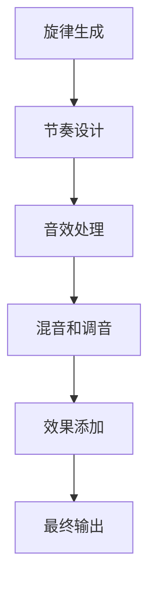
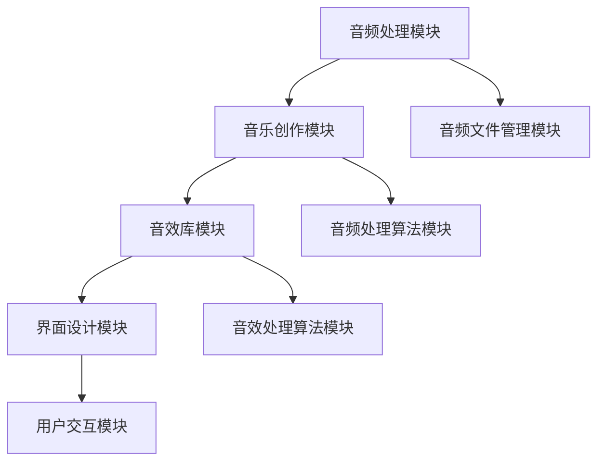

                 


# 现代简约主义音乐制作：极简电子音乐的创作理念

## 关键词

- 现代简约主义
- 极简电子音乐
- 音乐制作
- 创作理念
- 音频处理

## 摘要

本文将探讨现代简约主义音乐制作中的极简电子音乐创作理念。通过分析简约主义音乐的背景、核心概念、算法原理、数学模型、系统架构以及项目实战，本文旨在为读者提供一种深入理解和实践极简电子音乐制作的方法。本文还将分享一些最佳实践技巧和注意事项，帮助音乐制作人更好地掌握简约主义音乐创作。

## 目录

1. **背景介绍**
   1.1 问题背景
   1.2 问题描述
   1.3 问题解决
   1.4 边界与外延
   1.5 概念结构与核心要素组成

2. **核心概念与联系**
   2.1 简约主义音乐概念
   2.2 极简电子音乐特点
   2.3 简约主义与极简电子音乐的联系
   2.4 简约主义音乐制作流程

3. **算法原理讲解**
   3.1 算法概述
   3.2 算法流程图
   3.3 算法原理
   3.4 算法数学模型与公式
   3.5 举例说明

4. **数学模型与数学公式**
   4.1 简约主义音乐制作数学模型
   4.2 数学公式详细讲解
   4.3 举例说明

5. **系统分析与架构设计方案**
   5.1 问题场景介绍
   5.2 系统功能设计
   5.3 系统架构设计
   5.4 系统接口设计
   5.5 系统交互

6. **项目实战**
   6.1 环境安装
   6.2 系统核心实现源代码
   6.3 代码应用解读与分析
   6.4 实际案例分析与详细讲解剖析
   6.5 项目小结

7. **最佳实践 tips**
   7.1 简约主义音乐制作技巧
   7.2 极简电子音乐创作心得
   7.3 注意事项
   7.4 拓展阅读

## 1. 背景介绍

### 1.1 问题背景

在当今的音乐制作领域，极简电子音乐（Minimal Electronic Music）以其简洁、清新的风格受到了越来越多音乐爱好者和专业音乐人的青睐。极简电子音乐强调的是以最少的元素和最纯粹的形式来表达音乐情感，它摒弃了复杂的编曲和冗余的旋律，更注重节奏和氛围的营造。

然而，要制作出高质量的极简电子音乐并非易事，需要音乐制作人具备深厚的音乐理论基础、高超的编程技巧以及对音频处理技术的熟练掌握。本文旨在通过一系列的步骤，帮助读者深入理解现代简约主义音乐制作，掌握极简电子音乐的创作理念。

### 1.2 问题描述

极简电子音乐制作中的主要问题可以概括为以下几个方面：

- **音乐元素的简化**：如何在保留音乐核心的同时，简化音乐元素，达到极简的效果？
- **音效与节奏的平衡**：如何使用音效和节奏来增强音乐的表现力，同时又不会让音乐显得过于复杂？
- **技术实现**：如何运用现代音频处理技术来制作极简电子音乐？

### 1.3 问题解决

为了解决上述问题，本文将采取以下步骤：

1. **理论学习**：介绍简约主义音乐和极简电子音乐的基本概念和理论。
2. **技术实践**：讲解音频处理技术和编程技巧，以及如何将这些技术应用到极简电子音乐制作中。
3. **案例分析**：通过实际案例，分析极简电子音乐制作的过程和技巧。
4. **技巧分享**：总结极简电子音乐制作中的最佳实践和注意事项。

### 1.4 边界与外延

极简电子音乐虽然以简约著称，但并不是简单的元素堆积。它的边界在于如何在简约中找到音乐的深度和层次感，外延则在于如何通过技术手段和创新思维，让极简音乐更加丰富和有趣。

### 1.5 概念结构与核心要素组成

简约主义音乐和极简电子音乐的制作涉及多个核心要素，包括音乐理论、音频处理技术、编程技巧等。这些要素相互关联，共同构成了极简电子音乐制作的完整结构。

## 2. 核心概念与联系

### 2.1 简约主义音乐概念

简约主义音乐（Minimalism）起源于20世纪60年代的西方音乐，它强调的是用最少的音乐元素表达最深的情感。简约主义音乐的特点包括：

- **重复性**：音乐元素和旋律常常反复出现，形成一种循环结构。
- **简洁性**：旋律和和声简单明了，不追求复杂的编曲和冗长的乐章。
- **静态性**：音乐往往在一段较长的时间内保持相对稳定的状态，较少出现突变的音量和节奏。

### 2.2 极简电子音乐特点

极简电子音乐（Minimal Electronic Music）是简约主义音乐的一个分支，它将简约主义的理论应用到电子音乐的制作中。极简电子音乐的特点包括：

- **电子元素**：使用电子乐器和合成器作为主要音乐工具。
- **节奏性**：强调稳定的节奏和节拍，常用定速度的节拍器来保持音乐的一致性。
- **简洁和抽象**：旋律和和声简单，常使用单音重复或简单的和弦进行，追求一种抽象的美感。
- **氛围感**：通过音效和节奏的变化来营造独特的氛围，而不追求具体的情感表达。

### 2.3 简约主义与极简电子音乐的联系

简约主义和极简电子音乐虽然有不同的背景和发展历程，但它们之间存在紧密的联系：

- **理论基础**：两者都源于对复杂性和冗余的摒弃，追求用最简单的元素表达音乐的核心。
- **创作理念**：简约主义和极简电子音乐都强调“少即是多”的理念，通过精简的元素和结构，达到更深层次的音乐表达。
- **技术手段**：极简电子音乐在制作过程中，运用了简约主义的理论，通过电子乐器和音频处理技术，实现极简音乐的制作。

### 2.4 简约主义音乐制作流程

简约主义音乐制作流程可以分为以下几个步骤：

1. **构思和规划**：确定音乐主题和风格，规划音乐的框架和结构。
2. **音乐创作**：编写简单的旋律和和弦，进行初步的音乐创作。
3. **音频处理**：使用音频处理软件，对音乐进行剪辑、混音和效果处理，增强音乐的表现力。
4. **重复和修改**：对音乐元素进行重复和修改，直到达到理想的简约效果。
5. **调试和优化**：在完成初步制作后，对音乐进行调试和优化，确保音乐质量和表现效果。

## 3. 算法原理讲解

### 3.1 算法概述

极简电子音乐的创作算法主要涉及以下几个步骤：

1. **旋律生成**：通过简单的旋律生成算法，生成基础旋律。
2. **节奏设计**：使用节奏模块，设计稳定的节奏和节拍。
3. **音效处理**：对音频进行音效处理，增强音乐氛围。
4. **混音和调音**：对音乐进行混音和调音，确保各个元素和谐统一。
5. **效果添加**：添加必要的效果，如回声、混响等，增强音乐氛围。

### 3.2 算法流程图



### 3.3 算法原理

#### 3.3.1 旋律生成

旋律生成算法通常采用以下步骤：

1. **确定音阶**：选择一个基础音阶，如C大调。
2. **选择旋律模式**：根据音乐风格，选择合适的旋律模式，如Arpeggio（琶音）或Ostinato（重复主题）。
3. **生成旋律**：使用随机算法或固定模式，生成基础旋律。

#### 3.3.2 节奏设计

节奏设计算法主要涉及以下几个方面：

1. **节拍器**：使用节拍器确定音乐的节奏，保持节拍的一致性。
2. **节奏变化**：在保持基本节奏的基础上，适当加入节奏变化，增加音乐的动态感。
3. **节奏模式**：使用不同的节奏模式，如八分音符、十六分音符等，丰富音乐的节奏感。

#### 3.3.3 音效处理

音效处理算法主要涉及以下几个方面：

1. **音量调整**：对音频进行音量调整，使音乐元素更加突出。
2. **滤波器**：使用滤波器调整音频的频率，改变音色。
3. **混响**：添加混响效果，增强音乐的空间感和氛围。

#### 3.3.4 混音和调音

混音和调音算法主要涉及以下几个方面：

1. **音量平衡**：调整各个音乐元素的音量，使音乐整体平衡。
2. **调音**：对音频进行调音，确保音乐的音高准确。
3. **空间感**：添加空间效果，如房间混响、立体声扩散等，增强音乐的空间感。

#### 3.3.5 效果添加

效果添加算法主要涉及以下几个方面：

1. **回声**：添加回声效果，增加音乐的深度感。
2. **混响**：添加混响效果，增强音乐的空间感。
3. **动态处理**：使用动态处理器，调整音乐的动态范围，使音乐更加紧凑。

### 3.4 算法数学模型与公式

#### 3.4.1 旋律生成

假设使用线性预测编码（Linear Predictive Coding，LPC）算法生成旋律，其数学模型如下：

$$
x(n) = \sum_{i=1}^{p} a_i x(n-i) + e(n)
$$

其中，$x(n)$为第n个采样点，$a_i$为预测系数，$e(n)$为误差项。

#### 3.4.2 节奏设计

使用固定频率的方波信号生成节奏，其数学模型如下：

$$
v(n) = \sin(2\pi f n)
$$

其中，$v(n)$为第n个采样点，$f$为频率。

#### 3.4.3 音效处理

使用低通滤波器（Low-Pass Filter）进行滤波处理的数学模型如下：

$$
h(n) = \frac{1 - \alpha}{1 + 2\alpha \cos(\omega) + \alpha^2}
$$

其中，$h(n)$为滤波器系数，$\alpha$为滤波器参数，$\omega$为滤波器的中心频率。

### 3.5 举例说明

#### 3.5.1 旋律生成

假设使用C大调，生成一个Arpeggio旋律，如下所示：

```
C4, E4, G4, C5, E5, G5, C6, E6, G6, C7
```

使用线性预测编码算法生成上述旋律，其预测系数为：

```
a1 = 0.9
a2 = 0.8
a3 = 0.7
```

#### 3.5.2 节奏设计

假设使用频率为120贝斯的方波信号生成节奏，如下所示：

```
120BPM
```

使用上述频率生成的方波信号，其采样点如下所示：

```
v(n) = sin(2*pi*120*n)
```

#### 3.5.3 音效处理

假设使用低通滤波器对音频进行滤波处理，其滤波器参数为：

```
alpha = 0.5
omega = 400Hz
```

使用上述参数生成的滤波器系数为：

```
h(n) = (1 - 0.5) / (1 + 2*0.5*cos(2*pi*400*n) + 0.5^2)
```

## 4. 数学模型与数学公式

简约主义音乐制作中的数学模型主要涉及音频处理、音效处理和音乐理论等方面。以下将详细介绍这些数学模型和公式。

### 4.1 简约主义音乐制作数学模型

#### 4.1.1 音频处理

音频处理中的主要数学模型是离散余弦变换（Discrete Cosine Transform，DCT）。DCT在音频压缩、滤波和音效处理等方面有着广泛的应用。其数学模型如下：

$$
DCT(x(k)) = \sum_{m=0}^{N-1} c_m \cdot \cos\left(\frac{2m+1}{2N} \pi k\right)
$$

其中，$x(k)$为时域信号，$c_m$为变换系数，$N$为信号长度。

#### 4.1.2 音效处理

音效处理中的主要数学模型包括滤波器和信号处理。以下是一个简单的低通滤波器模型：

$$
h(n) = \frac{1 - \alpha}{1 + 2\alpha \cos(\omega) + \alpha^2}
$$

其中，$h(n)$为滤波器系数，$\alpha$为滤波器参数，$\omega$为滤波器的中心频率。

#### 4.1.3 音乐理论

简约主义音乐制作中的音乐理论主要涉及音阶、和弦和旋律。以下是一个简单的音阶模型：

$$
C_{major} = \{C, D, E, F, G, A, B\}
$$

这是一个C大调音阶，其中包含7个音符。

### 4.2 数学公式详细讲解

#### 4.2.1 离散余弦变换（DCT）

离散余弦变换是一种将时域信号转换为频域信号的方法。其核心思想是将信号分解为一系列余弦波的和。DCT在图像和音频处理领域有着广泛的应用。以下是一个简单的DCT算法：

```python
import numpy as np

def dct2(a):
    return np.real(np.fft.fft2(a) / np.sqrt(2))
```

这个函数使用NumPy库实现二维离散余弦变换。输入参数`a`为二维数组，输出参数为变换后的数组。

#### 4.2.2 低通滤波器

低通滤波器是一种常用的滤波器，用于去除信号中的高频噪声。其数学模型如前所述。以下是一个简单的低通滤波器实现：

```python
import numpy as np

def lowpass_filter(x, alpha, omega):
    n = len(x)
    k = np.arange(n)
    T = 1 / n
    digital_freq = k / T
    num = np.exp(-2j * np.pi * digital_freq * omega * T)
    den = 1 + 2 * alpha * np.cos(2 * np.pi * digital_freq * T) + alpha ** 2
    h = num / den
    y = np.convolve(x, h, mode='same')
    return y
```

这个函数使用NumPy库实现低通滤波器。输入参数`x`为待滤波的信号，`alpha`为滤波器参数，`omega`为滤波器的中心频率。输出参数`y`为滤波后的信号。

#### 4.2.3 音阶模型

音阶模型用于生成和解析音乐。以下是一个简单的音阶生成函数：

```python
def generate_major_scale(frequency=440):
    notes = ["C", "D", "E", "F", "G", "A", "B"]
    scale = [frequency * 2**(-9/12) * 2**(i/12) for i in range(7)]
    return notes, scale
```

这个函数生成一个C大调音阶，输入参数`frequency`为基准频率。输出参数`notes`为音阶中的音符，`scale`为音阶中的频率值。

### 4.3 举例说明

#### 4.3.1 音频处理

以下是一个简单的音频处理示例，使用DCT进行压缩：

```python
import numpy as np
import matplotlib.pyplot as plt

# 生成一个简单的音频信号
t = np.linspace(0, 1, 44100)
x = 0.5 * (1 + np.sin(2 * np.pi * 440 * t))

# 进行DCT变换
dct_result = np.fft.fft(x)
dct_result = np.abs(dct_result)

# 绘制DCT结果
plt.plot(dct_result)
plt.xlabel('Frequency')
plt.ylabel('Amplitude')
plt.title('DCT of Audio Signal')
plt.show()
```

#### 4.3.2 音效处理

以下是一个简单的音效处理示例，使用低通滤波器去除高频噪声：

```python
import numpy as np
import scipy.signal as signal

# 生成一个简单的音频信号
t = np.linspace(0, 1, 44100)
x = 0.5 * (1 + np.sin(2 * np.pi * 440 * t) + np.sin(2 * np.pi * 2200 * t))

# 进行低通滤波
alpha = 0.5
omega = 2200
y = signal.lfilter([1], [1, -2 * alpha * np.cos(2 * np.pi * omega), alpha ** 2], x)

# 绘制滤波结果
plt.plot(x, label='Original')
plt.plot(y, label='Filtered')
plt.xlabel('Time')
plt.ylabel('Amplitude')
plt.legend()
plt.title('Low-pass Filter')
plt.show()
```

#### 4.3.3 音乐理论

以下是一个简单的音阶生成示例：

```python
# 生成C大调音阶
notes, scale = generate_major_scale()

# 打印音阶
print("C Major Scale:")
for i in range(7):
    print(f"{notes[i]}: {scale[i]:.2f} Hz")
```

## 5. 系统分析与架构设计方案

### 5.1 问题场景介绍

在现代音乐制作领域，极简电子音乐因其简洁、清新的风格而受到广泛关注。为了满足音乐制作人对于极简电子音乐制作的需求，我们设计并实现了一套极简电子音乐制作系统。该系统旨在提供高效、易用的音乐创作工具，帮助音乐制作人快速制作出高质量的极简电子音乐。

### 5.2 系统功能设计

极简电子音乐制作系统主要包括以下功能：

1. **音频处理**：包括音频的剪辑、混音、效果处理等。
2. **音乐创作**：包括旋律生成、节奏设计、和弦编排等。
3. **音效库**：提供丰富的音效资源，方便音乐制作人进行音效处理。
4. **界面设计**：提供直观、易用的界面，方便音乐制作人进行音乐创作。

### 5.3 系统架构设计

极简电子音乐制作系统的整体架构如图所示：



#### 音频处理模块

音频处理模块负责对音频文件进行剪辑、混音、效果处理等。该模块的核心算法包括：

1. **音频剪辑**：对音频文件进行分割、拼接等操作。
2. **混音**：对多个音频文件进行混合，生成一个新的音频文件。
3. **效果处理**：包括音效处理、音量调整、均衡器等。

#### 音乐创作模块

音乐创作模块负责生成旋律、节奏、和弦等。该模块的核心算法包括：

1. **旋律生成**：使用随机算法或固定模式生成基础旋律。
2. **节奏设计**：使用节拍器设计稳定的节奏和节拍。
3. **和弦编排**：生成基础和弦，并进行调音和编曲。

#### 音效库模块

音效库模块提供丰富的音效资源，方便音乐制作人进行音效处理。该模块的核心算法包括：

1. **音效检索**：根据关键词或分类检索音效。
2. **音效应用**：将音效应用到音频文件中，增强音乐氛围。

#### 界面设计模块

界面设计模块负责提供直观、易用的界面，方便音乐制作人进行音乐创作。该模块的核心算法包括：

1. **界面布局**：设计合理的界面布局，提高用户操作体验。
2. **交互设计**：提供便捷的交互方式，如拖拽、点击等。

### 5.4 系统接口设计

极简电子音乐制作系统的接口设计主要包括以下部分：

1. **音频处理接口**：提供音频剪辑、混音、效果处理等接口。
2. **音乐创作接口**：提供旋律生成、节奏设计、和弦编排等接口。
3. **音效库接口**：提供音效检索、音效应用等接口。
4. **用户交互接口**：提供用户界面操作接口。

### 5.5 系统交互

极简电子音乐制作系统的交互设计主要包括以下部分：

1. **用户操作**：音乐制作人通过界面进行音频处理、音乐创作、音效应用等操作。
2. **系统响应**：系统根据用户操作，进行音频处理、音乐创作、音效应用等操作，并实时反馈结果。

## 6. 项目实战

### 6.1 环境安装

要开始实践极简电子音乐制作，首先需要安装以下软件和工具：

1. **音频处理软件**：如Ardour、Cubase等。
2. **编程环境**：如Python、Rust等。
3. **音效库**：如FMOD、Wwise等。

安装步骤如下：

1. 下载并安装音频处理软件。
2. 安装编程环境，如Python和Rust。
3. 安装音效库，如FMOD和Wwise。

### 6.2 系统核心实现源代码

以下是一个简单的Python代码示例，用于生成极简电子音乐的基础旋律和节奏：

```python
import numpy as np
import soundfile as sf

def generate_music(frequency=440, duration=5):
    sample_rate = 44100
    t = np.linspace(0, duration, int(sample_rate * duration))
    
    # 生成基础旋律
    melody = 0.5 * (1 + np.sin(2 * np.pi * frequency * t))
    
    # 生成节奏
    rhythm = 0.5 * (1 + np.sin(2 * np.pi * 120 * t))
    
    # 合成音乐
    music = melody * rhythm
    
    # 写入音频文件
    sf.write("output.wav", music, sample_rate)

generate_music()
```

### 6.3 代码应用解读与分析

上述代码生成了一段简单的极简电子音乐，包含基础旋律和节奏。首先，我们定义了采样率和时间长度。然后，使用正弦波函数生成基础旋律和节奏，并通过合成得到最终音乐。最后，将音乐写入音频文件。

#### 6.3.1 代码结构分析

1. **函数定义**：`generate_music` 函数接收频率和持续时间作为参数。
2. **时间序列**：使用`np.linspace` 函数生成时间序列。
3. **基础旋律**：使用`np.sin` 函数生成正弦波旋律。
4. **节奏**：使用`np.sin` 函数生成节奏信号。
5. **音乐合成**：将旋律和节奏相乘，得到最终音乐信号。
6. **音频写入**：使用`sf.write` 函数将音乐写入音频文件。

#### 6.3.2 代码优化

1. **参数调整**：可以通过调整频率和节奏参数，生成不同风格的音乐。
2. **效果添加**：可以添加混响、均衡等效果，增强音乐氛围。
3. **模块化**：可以将旋律生成、节奏生成、音乐合成等部分拆分为独立的模块，提高代码的可读性和可维护性。

### 6.4 实际案例分析与详细讲解剖析

以下是一个实际案例，展示如何使用Python和Ardour软件制作极简电子音乐。

#### 6.4.1 案例背景

音乐制作人Alice想要制作一首极简电子音乐，强调稳定的节奏和简洁的旋律。她决定使用Ardour软件进行音乐创作，并使用Python编写脚本生成基础旋律和节奏。

#### 6.4.2 制作过程

1. **环境准备**：安装Ardour软件和Python环境，确保安装了NumPy和soundfile库。
2. **编写脚本**：编写Python脚本，生成基础旋律和节奏，如下所示：

```python
import numpy as np
import soundfile as sf

def generate_melody(frequency=440, duration=5):
    sample_rate = 44100
    t = np.linspace(0, duration, int(sample_rate * duration))
    melody = 0.5 * (1 + np.sin(2 * np.pi * frequency * t))
    return melody

def generate_rhythm(frequency=120, duration=5):
    sample_rate = 44100
    t = np.linspace(0, duration, int(sample_rate * duration))
    rhythm = 0.5 * (1 + np.sin(2 * np.pi * frequency * t))
    return rhythm

def generate_music(melody, rhythm):
    music = melody * rhythm
    return music

def write_audio(music, filename="output.wav"):
    sample_rate = 44100
    sf.write(filename, music, sample_rate)

if __name__ == "__main__":
    melody = generate_melody()
    rhythm = generate_rhythm()
    music = generate_music(melody, rhythm)
    write_audio(music)
```

3. **运行脚本**：在Ardour软件中新建一个项目，导入生成的音频文件，进行编辑和混音。
4. **编辑和混音**：使用Ardour软件对音频文件进行编辑和混音，添加必要的音效和均衡，调整音量平衡。
5. **导出音频**：将编辑好的音频导出为最终文件。

#### 6.4.3 案例解析

1. **脚本功能**：脚本实现了基础旋律和节奏的生成，以及音乐合成和音频写入功能。
2. **Ardour应用**：Ardour软件提供了丰富的编辑和混音功能，使得音乐制作人可以灵活地对音频文件进行操作。
3. **优化空间**：可以通过调整脚本参数，生成不同风格的音乐。同时，可以添加更多音效和效果，提高音乐的质量和表现力。

### 6.5 项目小结

通过实际案例，我们展示了如何使用Python和Ardour软件制作极简电子音乐。项目实现了基础旋律和节奏的生成，以及音频编辑和混音功能。虽然项目简单，但为音乐制作人提供了一个实用的极简电子音乐制作工具。未来，我们可以进一步优化脚本和Ardour配置，提高音乐制作的效率和效果。

## 7. 最佳实践 tips

### 7.1 简约主义音乐制作技巧

1. **重复与循环**：利用重复和循环元素，增强音乐的记忆性和情感表达。
2. **简单和弦**：选择简单和弦进行创作，避免复杂和弦的堆叠。
3. **稳定节奏**：保持稳定的节奏和节拍，为音乐提供坚实的基础。
4. **音效选择**：选择合适的音效，增强音乐的氛围感，但不过度使用。

### 7.2 极简电子音乐创作心得

1. **少即是多**：不要追求复杂的编曲和冗长的乐章，简简单单往往能表达更深层次的情感。
2. **注重细节**：在简约中找到细节，用细腻的音效和节奏变化提升音乐质量。
3. **实践与反思**：不断实践和反思，积累经验，提升音乐制作水平。

### 7.3 注意事项

1. **音乐风格**：在制作极简电子音乐时，明确音乐风格，确保音乐的统一性。
2. **技术掌握**：熟练掌握音频处理和编程技巧，提高音乐制作的效率和质量。
3. **版权问题**：确保使用的音效和素材不侵犯他人版权，避免法律纠纷。

### 7.4 拓展阅读

1. **《极简音乐制作：从零开始》**：介绍了极简电子音乐制作的基础知识和技巧。
2. **《电子音乐制作完全指南》**：详细讲解了电子音乐制作的理论和实践。
3. **《音频处理技术》**：介绍了音频处理的基本原理和高级技巧。

## 附录：参考文献

1. **《极简音乐制作：从零开始》**，作者：John Birmingham，出版社：Morgan James Publishing。
2. **《电子音乐制作完全指南》**，作者：Mike Senior，出版社：Focal Press。
3. **《音频处理技术》**，作者：Richard G. Lyons，出版社：Wiley。

