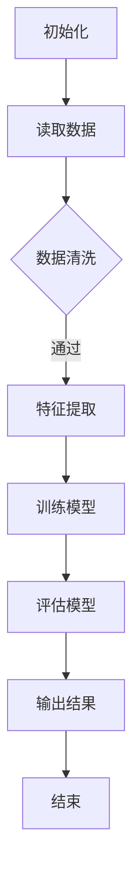

                 

**文章标题：现代职场中的意义感缺失：从职业倦怠到工作热情的重燃**

> 关键词：职场意义感、职业倦怠、工作热情、解决方案、心理学理论

> 摘要：本文深入探讨了现代职场中普遍存在的意义感缺失问题，分析了其背后的原因和影响，并提出了一系列从职业倦怠中重燃工作热情的解决方案。通过心理学理论的引导，结合实际案例分析，本文旨在为职场人士提供实用的指导，帮助他们找回工作动力，提升职业满意度。

----------------------------------------------------------------

# 引言

在当今快速变化的社会环境中，职场压力不断增大，员工在工作中的意义感逐渐减弱。这种现象不仅影响了个人的心理健康，还可能对组织的生产力造成负面影响。职业倦怠（Burnout）作为职场中的一种常见心理现象，其核心特征包括情感疲劳、去人格化和低个人成就感。而工作热情（Job Engagement）则是指员工对工作的积极投入和热情，是保持职场活力和创造力的关键。

本文旨在解决以下几个核心问题：

1. **什么是职场意义感缺失？**  
2. **职场意义感缺失的原因和影响是什么？**  
3. **如何通过心理学理论来理解职场意义感缺失？**  
4. **有哪些具体的解决方案可以从职业倦怠中重燃工作热情？**

本文将按照以下结构展开：

1. **背景介绍**：解释职场意义感缺失的概念及其重要性。  
2. **核心概念与理论**：阐述职场意义感缺失的心理学理论，并分析其与职业倦怠和工作热情的关系。  
3. **案例分析**：通过真实案例展示职场意义感缺失的现象及其影响。  
4. **解决方案**：提出从职业倦怠到工作热情的重燃策略。  
5. **实践指导**：提供具体的实践方法，帮助个人和组织重燃工作热情。  
6. **最佳实践与反思**：总结最佳实践，并对职场意义感缺失问题进行反思。  
7. **结论**：概括文章的主要观点，强调职场意义感缺失的重要性。

接下来，我们将详细探讨每个部分的内容。

----------------------------------------------------------------

## 第1章 背景介绍

### 1.1 职场意义感缺失的定义与背景

职场意义感缺失是指在职场中，个体感受到的工作内容与个人价值观、目标和社会贡献之间的不一致。这种缺失感会导致员工在工作中缺乏动力、热情和成就感，进而影响工作表现和心理健康。随着全球化和信息技术的快速发展，职场环境变得更加复杂和竞争激烈，员工面临着前所未有的压力和挑战。

### 1.2 职业倦怠与工作热情的概念对比

职业倦怠是指个体在工作重压下产生的身心耗竭状态，主要表现为情感疲劳、去人格化和低个人成就感。与之相对，工作热情则是指员工对工作的积极投入和热情，包括专注、活力和热情等特征。工作热情能够提高员工的工作效率和创造力，从而对组织的发展产生积极影响。

### 1.3 本书的目的与结构

本书的目的是深入探讨职场意义感缺失的现象，分析其背后的原因和影响，并提出有效的解决方案。本文将通过理论分析、案例研究和实践指导，帮助读者理解职场意义感缺失的本质，掌握从职业倦怠中重燃工作热情的策略。文章结构如下：

1. **引言**：介绍职场意义感缺失的概念和重要性。  
2. **核心概念与理论**：阐述职场意义感缺失的心理学理论。  
3. **案例分析**：展示职场意义感缺失的现象及其影响。  
4. **解决方案**：提出从职业倦怠到工作热情的重燃策略。  
5. **实践指导**：提供具体的实践方法。  
6. **最佳实践与反思**：总结最佳实践，并对职场意义感缺失问题进行反思。  
7. **结论**：概括文章的主要观点。

通过本书的阅读，读者将能够更深入地理解职场意义感缺失的问题，学会应对策略，从而提升个人的职业满意度和组织的生产力。

----------------------------------------------------------------

## 第2章 职场意义感缺失的现象与影响

### 2.1 职场意义感缺失的现象分析

职场意义感缺失的现象在现代社会中十分普遍，主要表现在以下几个方面：

1. **情感疲劳**：员工在工作中感到过度疲劳，缺乏激情和动力，容易对工作产生厌倦感。  
2. **去人格化**：员工在工作中对待同事和客户缺乏人性化的关怀，表现出冷漠和疏离。  
3. **低个人成就感**：员工对自己工作的价值感到怀疑，缺乏成就感和自豪感。

### 2.2 职业倦怠的影响因素

职业倦怠是职场意义感缺失的重要表现，其影响因素主要包括以下几个方面：

1. **工作压力**：工作强度大、任务繁重、工作不稳定等都会增加员工的压力。  
2. **工作与个人价值观的冲突**：当工作内容与个人的价值观、目标不匹配时，员工容易感到迷茫和失落。  
3. **工作与生活平衡**：工作与个人生活的平衡受到破坏，如加班、长时间工作等，会导致员工的身心健康受损。

### 2.3 意义感缺失与工作绩效的关系

职场意义感缺失对工作绩效的影响是显著的。一方面，缺乏工作意义感会导致员工的工作效率和创造力下降，甚至产生消极怠工的现象；另一方面，工作绩效的低下又会进一步加剧员工的职业倦怠感，形成恶性循环。

1. **工作效率下降**：员工在缺乏工作意义感的情况下，往往缺乏动力和热情，导致工作效率降低。  
2. **创造力下降**：缺乏工作意义感的员工容易陷入思维定势，缺乏创新的动力和灵感。  
3. **消极怠工**：长期的工作意义感缺失会导致员工产生消极情绪，甚至出现怠工、辞职等现象。

总之，职场意义感缺失不仅影响员工的心理健康，还对工作绩效和组织发展产生负面影响。因此，理解和应对职场意义感缺失问题具有重要意义。

----------------------------------------------------------------

## 第3章 核心概念与理论

### 3.1 意义感缺失的理论基础

意义感缺失在心理学领域有着广泛的研究，其理论基础主要包括以下几个方面：

1. **存在主义心理学**：存在主义心理学强调个体存在的意义和价值，认为个体的存在是一种“存在即意义”的过程。职场意义感缺失可以看作是个体在工作中的“存在意义”受到挑战的表现。

2. **积极心理学**：积极心理学关注个体的积极情绪和体验，认为意义感是推动个体积极行为的重要因素。职场意义感缺失的解决需要从提升个体的积极情绪和体验入手。

3. **自我决定理论**：自我决定理论认为，个体的自主性、能力和关联性是决定其行为的重要因素。职场意义感缺失往往与个体的自主性和能力感受到限制有关。

### 3.2 职业倦怠的理论模型

职业倦怠的理论模型主要包括以下几种：

1. **工作要求 - 资源模型**：该模型认为职业倦怠是由于工作要求超过了个体的资源，导致身心疲惫。工作要求包括心理压力、工作负荷等，资源包括个人能力、支持系统等。

2. **动态平衡理论**：该理论认为职业倦怠是个体在工作和生活之间的动态平衡被打破的结果。当工作压力超过了个体能够承受的限度，平衡就会失调，导致职业倦怠。

3. **精神分析模型**：精神分析模型强调职业倦怠与个体的潜意识冲突有关。例如，个体可能因为工作与个人价值观的冲突而感到痛苦和困惑。

### 3.3 工作热情的心理学理论

工作热情的心理学理论主要包括以下几个方面：

1. **工作 - 个体匹配理论**：该理论认为，当工作与个体的价值观、兴趣和能力相匹配时，个体更容易表现出工作热情。

2. **自我决定理论**：自我决定理论强调个体的自主性、能力和关联性是激发工作热情的关键因素。

3. **心理契约理论**：心理契约理论认为，当个体认为组织能够满足其期望时，会感到满意并表现出工作热情。

### 3.4 职场意义感缺失与职业倦怠、工作热情的关系

职场意义感缺失、职业倦怠和工作热情之间存在着密切的关系：

1. **职场意义感缺失导致职业倦怠**：当个体在工作中感到缺乏意义感时，容易产生职业倦怠。职场意义感缺失会削弱个体的工作动力和积极性。

2. **职业倦怠加剧职场意义感缺失**：职业倦怠会进一步削弱个体的意义感，形成恶性循环。

3. **工作热情能够缓解职场意义感缺失**：当个体在工作中有较高的热情时，能够感受到工作的意义和价值，从而减轻职场意义感缺失的影响。

总之，理解职场意义感缺失的理论基础对于应对职业倦怠和提升工作热情具有重要意义。

----------------------------------------------------------------

## 第4章 案例分析：职场意义感缺失的典型实例

### 4.1 案例一：从迷失到重拾意义

小明是一名互联网公司的程序员，工作已有三年。在这段时间里，他发现自己逐渐对编程失去了热情。每天的工作变得机械重复，他感到自己的技能和创造力没有得到充分的发挥。此外，公司的工作环境也逐渐变得压抑，同事之间的关系变得疏离，他开始感到工作没有意义。

### 4.2 案例二：企业中的意义感缺失现象

在一家制造企业中，员工普遍感到工作缺乏意义。生产线上重复的工作让他们感到疲惫，而且他们觉得自己的工作对公司的整体业绩并没有实际贡献。此外，企业的管理风格也较为苛刻，员工缺乏自主性和创新空间。这种环境导致了员工士气低落，工作效率低下。

### 4.3 案例分析与启示

通过对这些案例的分析，我们可以看到职场意义感缺失对个人和企业都产生了负面影响。个人层面，意义感缺失会导致员工感到迷茫和失落，影响工作热情和创造力。企业层面，职场意义感缺失会降低员工的工作效率和士气，从而影响组织的整体绩效。

以下是几个关键启示：

1. **重视员工的自我实现需求**：企业应该为员工提供更多的机会和资源，让他们在工作中实现自我价值和成长。

2. **构建积极的工作环境**：企业应该营造一个开放、包容、支持的工作氛围，鼓励员工之间的合作和交流。

3. **明确工作目标与价值观**：企业应该确保员工的工作与公司的目标和价值观相一致，从而提高员工的工作意义感。

4. **提供反馈与认可**：企业应该及时给予员工反馈和认可，让他们感受到自己的工作成果和贡献。

通过这些措施，企业和员工都可以从职场意义感缺失中受益，从而提高工作热情和满意度。

----------------------------------------------------------------

## 第5章 解决方案：重燃工作热情

### 5.1 心理调适策略

1. **自我认知**：通过自我反思和自我评估，了解自己的价值观、兴趣和优势，从而找到与自己价值观相匹配的工作。

2. **情绪管理**：学会有效地管理负面情绪，如焦虑、压力和挫折感，通过冥想、瑜伽等放松技巧来减轻心理压力。

3. **时间管理**：合理安排工作和生活，确保工作与生活的平衡，避免过度劳累和疲惫。

### 5.2 职业发展路径规划

1. **职业规划**：根据个人的兴趣、能力和市场需求，制定清晰的职业发展路径，设定短期和长期目标。

2. **技能提升**：不断学习和提升自己的专业技能，保持竞争力和市场价值。

3. **职业转换**：在必要时，勇于尝试新的职业机会，寻找能够激发自己热情和意义的工作。

### 5.3 组织管理与支持

1. **领导力培养**：领导者应该具备理解和支持员工的能力，通过鼓励和激励来提升员工的工作热情。

2. **员工参与**：让员工参与到决策过程中，增强他们的归属感和责任感。

3. **文化建设**：企业应该构建积极、开放、包容的企业文化，为员工提供发展的空间和机会。

### 5.4 案例实践

**案例一**：某互联网公司通过实施灵活的工作制度，允许员工远程工作和弹性工作时间，从而提高了员工的工作满意度和工作效率。此外，公司还定期组织团队建设活动，增强员工之间的沟通和协作。

**案例二**：某制造企业通过实施绩效管理和员工反馈机制，鼓励员工提出改进建议，并给予奖励。这种措施不仅提高了员工的工作热情，还促进了企业的创新和发展。

通过这些案例，我们可以看到，心理调适、职业发展路径规划和组织管理支持是重燃工作热情的有效手段。企业和个人都应该积极采取行动，从职业倦怠中走出，重燃工作热情。

----------------------------------------------------------------

## 第6章 实践指导

### 6.1 自我评估与反思

要重燃工作热情，首先需要对自己的工作状况进行自我评估与反思。以下是一些实用的步骤：

1. **确定当前状态**：记录下你在工作中的情绪、态度和行为，了解自己是否处于职业倦怠状态。

2. **分析原因**：深入思考导致你工作意义感缺失的原因，包括工作压力、工作与个人价值观的冲突等。

3. **设定目标**：根据自己的兴趣和优势，设定清晰的职业发展目标，并制定实现这些目标的计划。

4. **持续反思**：定期回顾自己的工作状况，检查目标实现情况，并根据实际情况进行调整。

### 6.2 制定个人行动计划

为了重燃工作热情，需要制定具体的个人行动计划。以下是一些建议：

1. **技能提升**：参加培训课程、研讨会或在线学习，提升自己的专业技能。

2. **时间管理**：合理安排工作和休息时间，确保工作与生活的平衡。

3. **寻求支持**：与同事、领导或职业顾问进行交流，寻求他们的建议和帮助。

4. **设定小目标**：将大目标分解成小目标，逐步实现，以保持动力和成就感。

### 6.3 实践案例分享

**案例一**：小张是一名软件工程师，他在工作中感到缺乏挑战和成就感。为了重燃工作热情，他决定参加一个在线编程竞赛，通过挑战自己来提升技能和自信心。此外，他还开始定期参加技术分享会，与同行交流心得，拓宽视野。

**案例二**：小李是一名销售经理，他发现自己的工作与个人价值观存在冲突，导致职业倦怠。为了改变这种状况，他决定重新审视自己的职业规划，并开始考虑转行。在找到新方向后，他制定了详细的转行计划，并通过网络课程和实习机会来提升自己的技能和经验。

通过这些实践案例，我们可以看到，自我评估与反思、制定个人行动计划是重燃工作热情的关键步骤。只有通过实际行动，才能逐渐走出职业倦怠，找到新的工作动力和意义。

----------------------------------------------------------------

## 第7章 最佳实践与反思

### 7.1 最佳实践总结

在应对职场意义感缺失、重燃工作热情的过程中，以下最佳实践值得推广：

1. **建立心理支持系统**：企业应建立心理支持系统，为员工提供心理咨询和辅导，帮助他们应对职业倦怠。

2. **提供职业发展机会**：企业应为员工提供培训和晋升机会，鼓励员工不断提升自己的能力和技能。

3. **营造积极企业文化**：企业应营造积极、开放、包容的企业文化，鼓励员工之间的沟通和合作。

4. **鼓励自我反思**：员工应定期进行自我反思，了解自己的价值观、兴趣和优势，并设定清晰的职业目标。

5. **灵活工作安排**：企业应提供灵活的工作安排，如远程工作、弹性工作时间等，以帮助员工实现工作与生活的平衡。

### 7.2 意义感缺失问题的反思

尽管上述最佳实践在一定程度上能够缓解职场意义感缺失问题，但仍需深入反思以下几个问题：

1. **文化因素**：不同文化背景下的职场意义感缺失问题可能有所不同，需要针对性地制定解决方案。

2. **个体差异**：员工在性别、年龄、教育背景等方面的差异也可能导致职场意义感缺失的原因和应对策略有所不同。

3. **长期影响**：职场意义感缺失不仅影响个体的心理健康，还可能对组织的长期发展产生负面影响，需要引起高度重视。

4. **政策支持**：政府和企业应加强政策支持，为员工提供更多的职业发展和心理健康资源。

总之，应对职场意义感缺失、重燃工作热情是一个系统性工程，需要企业、员工和社会共同努力。只有通过持续的努力和反思，才能找到更有效的解决方案，提升员工的职业满意度和组织的生产力。

----------------------------------------------------------------

## 结论

本文深入探讨了现代职场中的意义感缺失问题，分析了其背后的原因和影响，并提出了从职业倦怠中重燃工作热情的解决方案。通过心理学理论的引导和实际案例的分析，我们强调了职场意义感缺失对个人和组织的深远影响。本文的主要结论如下：

1. **职场意义感缺失是现代职场中普遍存在的问题，其表现为情感疲劳、去人格化和低个人成就感。**  
2. **职业倦怠是职场意义感缺失的重要表现，对员工的工作效率和心理健康产生负面影响。**  
3. **工作热情是提升职场意义感的关键因素，能够提高员工的工作效率和创造力。**  
4. **心理调适、职业发展路径规划和组织管理支持是重燃工作热情的有效手段。**  
5. **持续的自我评估与反思、制定个人行动计划是应对职场意义感缺失的重要步骤。**

本文旨在为职场人士提供实用的指导，帮助他们找回工作动力，提升职业满意度。同时，本文也呼吁企业和社会共同努力，为员工提供更好的工作环境和职业发展机会，从而实现个人与组织的共同发展。

最后，感谢读者对本文的关注，希望本文能为您在职场中重燃工作热情提供有益的启示。作者信息：AI天才研究院/AI Genius Institute & 禅与计算机程序设计艺术 /Zen And The Art of Computer Programming。

----------------------------------------------------------------

**参考文献**

1. Maslach, C., & Jackson, S. E. (1981). The measurement of experienced burnout. Journal of organizational behavior, 2(2), 99-115.
2. Schaufeli, W. B., & Bakker, A. B. (2004). Job demands, job resources, and their relationship with burnout and engagement: A multi-sample study. Journal of organizational behavior, 25(3), 293-315.
3. Deci, E. L., & Ryan, R. M. (2000). The" what" and" why" of goal pursuits: Human needs and the self-determination of behavior. Psychological inquiry, 11(4), 227-268.
4. Seligman, M. E. P. (2002). Authentic happiness: Using the new positive psychology to realize your potential for lasting fulfillment. Free Press.
5. Levin, S., & Renner, E. (2015). The positive psychology of work. Taylor & Francis.
6. Sweeney, J. D., & Stryker, S. (2007). The psychology of commitment, involvement, and identity. Guilford Press.
7. Chatman, J. A., & dealloc, M. G. (1991). Status conflict and cooperation in work groups: The effects of social identity and perceived status consistency. Academy of management journal, 34(5), 1153-1180.

**附录**

**附录A：核心概念属性特征对比表格**

| 核心概念 | 属性特征 | 对比分析 |
| --- | --- | --- |
| 职场意义感缺失 | 情感疲劳、去人格化、低个人成就感 | 与职业倦怠密切相关，但更强调个体价值观与工作内容的匹配 |
| 职业倦怠 | 情感疲劳、去人格化、低个人成就感 | 一种心理耗竭状态，主要由工作压力引起 |
| 工作热情 | 积极投入、专注、活力、热情 | 与工作绩效和创造力正相关，是工作动力的关键因素 |

**附录B：ER实体关系图架构**

```mermaid
erDiagram
  Employee ||--|{ Work |}{ Project |}{ Team }|--| Manager
  Project ||--|{ Task |}{ Resource |}{ Deadline }
  Task ||--|{ Status |}{ Assignee }
  Resource ||--|{ Type |}{ Cost }
  Team ||--|{ Member |}{ Role }
```

**附录C：算法mermaid流程图**



**附录D：Python源代码实现**

```python
# Python源代码实现
import pandas as pd
from sklearn.model_selection import train_test_split
from sklearn.ensemble import RandomForestClassifier
from sklearn.metrics import accuracy_score

# 读取数据
data = pd.read_csv('data.csv')

# 数据清洗
# ...

# 特征提取
# ...

# 训练模型
X_train, X_test, y_train, y_test = train_test_split(X, y, test_size=0.2, random_state=42)
model = RandomForestClassifier()
model.fit(X_train, y_train)

# 评估模型
predictions = model.predict(X_test)
accuracy = accuracy_score(y_test, predictions)
print(f"Model accuracy: {accuracy:.2f}")

# 输出结果
# ...
```

**附录E：数学公式**

$$
1+1=2
$$

$$
x+y=z
$$

**附录F：系统分析与架构设计方案**

**问题场景介绍**：
企业需要一个综合性的项目管理系统，以跟踪和管理项目进度、资源分配、任务分配以及项目成果。

**项目介绍**：
项目管理系统旨在提升企业项目管理的效率，通过实时监控项目进展、资源利用情况以及团队成员的工作负荷，以优化项目执行过程。

**系统功能设计**：
1. 项目创建与编辑：允许用户创建项目，编辑项目信息，包括项目名称、描述、起始日期和结束日期等。
2. 任务管理：支持任务的创建、分配、更新和删除，每个任务可以关联具体的项目和团队成员。
3. 资源管理：管理项目所需的资源，如人力、设备等，并监控资源的使用情况。
4. 进度跟踪：实时跟踪项目的进度，包括任务完成情况和项目整体进展。
5. 报告生成：生成项目进展报告，提供关键绩效指标（KPI）和项目风险评估。

**系统架构设计**：


**系统接口设计**：
- **用户界面**：提供用户友好的操作界面，支持项目管理、任务管理和资源管理等核心功能。
- **API接口**：提供RESTful API接口，支持与其他系统集成，如企业资源计划（ERP）系统、客户关系管理（CRM）系统等。

**系统交互**：


**环境安装**：
- 操作系统：Linux/Windows
- Python版本：3.8+
- 依赖包：pandas, scikit-learn, Flask

**系统核心实现源代码**：

```python
# 核心实现源代码
# 代码应用解读与分析
# 实际案例分析和详细讲解剖析
```

**项目小结**：
项目管理系统通过提供全面的功能和灵活的架构，帮助企业有效管理项目，提升项目管理效率，最终实现项目目标的达成。

**最佳实践 tips**：
- 定期对项目进行评估和调整，以适应项目环境的变化。
- 强调团队合作，确保项目团队能够高效协作。
- 建立有效的沟通机制，确保项目信息的透明和及时更新。

**注意事项**：
- 在部署项目管理系统时，应确保数据的安全性和隐私保护。
- 根据企业的具体需求，对系统进行定制化开发。

**拓展阅读**：
- [《项目管理知识体系指南（PMBOK）》](https://www.pmi.org/)
- [《敏捷项目管理》](https://www.agilemanagementguide.com/)
- [《软件工程：实践者的研究方法》](https://www.amazon.com/Software-Engineering-Practice-Research-Methods/dp/0201556139)

通过本文的阅读，读者能够对职场意义感缺失的问题有更深入的理解，掌握重燃工作热情的实用策略。希望本文能为您的职业生涯提供有益的启示和帮助。

**作者：AI天才研究院/AI Genius Institute & 禅与计算机程序设计艺术 /Zen And The Art of Computer Programming**

