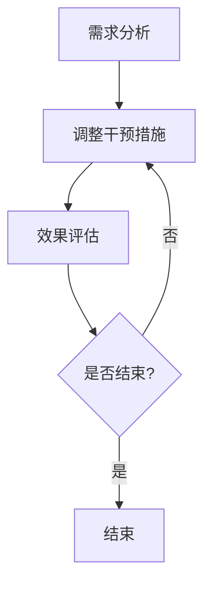

                 

## 第1章：现代职场中的意义感缺失

### 1.1.1 问题背景

在当今社会，随着经济全球化的不断深入和信息技术的飞速发展，职场环境发生了深刻的变化。现代职场中，人们面临着前所未有的机遇与挑战。然而，在这片繁荣的背后，一个不容忽视的现象也逐渐显现——职场中的意义感缺失。这个问题不仅影响了员工的个人发展，还对企业的运营效率和社会的稳定产生了一系列负面影响。

首先，职场意义感缺失是一个全球性问题。无论是发达国家还是发展中国家，职场中的意义感缺失现象都普遍存在。据统计，全球范围内的职业倦怠率在不断攀升。比如，根据国际劳工组织（ILO）的数据显示，2019年全球范围内的职业倦怠率为44%，而我国的情况也不容乐观。根据中国健康与养老追踪调查（CHARLS）的数据，2018年我国城市地区的职业倦怠率为43.2%，农村地区则为37.6%。

其次，职场意义感缺失与多种因素相关。一方面，随着职场竞争的加剧，工作压力不断增大。现代职场中，员工往往需要承担更多的责任和工作任务，同时还要应对来自上级、同事和客户的压力。这种压力的长期积累，会导致员工出现身心疲惫、工作效率下降等现象。另一方面，职场文化的变革也加剧了职场意义感缺失的问题。在过去，企业更注重员工的稳定性和忠诚度，而现在的企业更强调员工的绩效和贡献。这种变革虽然有助于激发员工的潜力，但也可能导致员工产生焦虑和不安。

### 1.1.2 问题描述

职场意义感缺失的具体表现可以分为以下几个方面：

1. **职业倦怠**：职业倦怠是指个体因长期工作压力过大而产生的身心疲惫、工作热情下降等现象。根据马斯勒（Maslach）等人的研究，职业倦怠主要包括三个维度：情感耗竭、去人格化和个人成就感降低。情感耗竭表现为情绪低落、易怒、缺乏耐心等；去人格化表现为对工作缺乏热情，对待工作对象采取冷漠、疏远的态度；个人成就感降低则表现为对工作缺乏成就感和满足感。

2. **工作效率下降**：职场意义感缺失会影响员工的工作效率。在缺乏意义感的情况下，员工往往对工作缺乏热情和动力，导致工作质量下降。根据一项针对全球4000名职场人士的调查显示，有超过60%的人表示在工作中感到意义感缺失，其中45%的人表示这影响了他们的工作效率。

3. **工作热情减退**：工作热情是指个体对工作的积极态度和高度投入。当职场意义感缺失时，员工的工作热情也会随之减退。根据一项针对我国职场人士的调查显示，有超过70%的人表示在工作中感到缺乏意义感，其中40%的人表示这导致他们工作热情下降。

4. **心理健康问题**：职场意义感缺失不仅影响工作效率和工作热情，还可能导致心理健康问题。长期处于意义感缺失的状态，员工可能会出现抑郁、焦虑等情绪问题。据世界卫生组织（WHO）的数据显示，全球范围内的职业压力导致的心理健康问题占所有工作相关疾病的60%以上。

### 1.1.3 问题解决

解决职场意义感缺失问题，需要从个人、企业和社会三个层面共同努力：

1. **个人层面**：

    - **明确职业规划**：个体应该明确自己的职业目标和发展方向，制定合理的职业规划。这有助于提高个体对工作的认同感和满意度。

    - **培养积极心态**：个体应该培养积极的心态，学会调整自己的情绪和行为，以应对工作中的压力和挑战。

    - **提高自我调适能力**：个体应该提高自我调适能力，学会在压力下保持冷静和专注，提高工作效率。

2. **企业层面**：

    - **优化企业文化建设**：企业应该重视企业文化建设，营造积极向上的工作氛围，提高员工的工作满意度。

    - **完善激励机制**：企业应该完善激励机制，建立多元化的奖励体系，激励员工提高工作积极性。

    - **提供职业发展机会**：企业应该为员工提供职业发展机会，帮助员工实现职业晋升和自我价值的实现。

3. **社会层面**：

    - **推动职业教育的改革**：社会应该推动职业教育的改革，提高职业教育的质量，培养具备专业技能和职业素养的员工。

    - **提高职业素养和技能水平**：社会应该提高职业素养和技能水平，通过培训和教育，提升员工的综合素质。

### 1.1.4 边界与外延

职场意义感缺失是一个复杂的社会现象，其影响范围涉及个人发展、企业效益和社会稳定等多个方面。在探讨这一问题时，需要关注以下几个方面：

1. **心理健康**：职场意义感缺失可能导致心理健康问题，如抑郁、焦虑等。这些问题不仅影响员工的工作表现，还可能对家庭和社会产生负面影响。

2. **工作效率**：职场意义感缺失会影响员工的工作效率，降低工作质量。长期存在意义感缺失的企业，可能面临人才流失、企业效益下降等问题。

3. **企业竞争力**：长期存在职场意义感缺失的企业，可能面临人才流失、企业效益下降等问题。这些问题不仅影响企业的竞争力，还可能影响整个行业的健康发展。

### 1.1.5 概念结构与核心要素组成

1. **职场意义感**：职场意义感是指个体在工作中的情感体验和自我价值实现。它包括对工作的认同感、成就感、满足感等。

2. **职业倦怠**：职业倦怠是指个体因长期工作压力过大而产生的身心疲惫、工作热情下降等现象。

3. **工作热情**：工作热情是指个体对工作的积极态度和高度投入。它反映了个体对工作的热爱和热情。

### 1.2 核心概念与联系

#### 1.2.1 职场意义感、职业倦怠与工作热情的关系

1. **职场意义感**：职场意义感是个体在工作中的情感体验和自我价值实现，它是职业倦怠和工作热情的基础。

2. **职业倦怠**：职业倦怠是个体因长期工作压力过大而产生的身心疲惫、工作热情下降等现象，它是职场意义感的反面。

3. **工作热情**：工作热情是个体对工作的积极态度和高度投入，它是职场意义感的直接体现。

#### 1.2.2 概念属性特征对比表格

| 概念       | 属性特征                    | 对比                |
|------------|-----------------------------|---------------------|
| 职场意义感 | 情感体验、自我价值实现      | 与职业倦怠相反      |
| 职业倦怠   | 身心疲惫、工作热情下降      | 与职场意义感相反    |
| 工作热情   | 积极态度、高度投入          | 职场意义感的体现    |

#### 1.2.3 ER实体关系图架构

```mermaid
erDiagram
  A[员工] ||--|{ B[企业] } : 从业于
  A[员工] ||--|{ C[职位] } : 担任
  B[企业] ||--|{ C[职位] } : 招聘
  C[职位] ||--|{ D[工作内容] } : 包含
  D[工作内容] ||--|{ E[意义感] } : 源自
```

### 1.3 算法原理讲解

为了更好地解决职场意义感缺失问题，我们可以采用一种综合性的干预策略。以下是一个简化的算法流程，用于帮助企业和个人识别和缓解职场意义感缺失。

#### 1.3.1 算法概述

这个算法的核心是通过对个体的职业规划、心理需求和实际工作状况进行分析，制定个性化的干预措施，并持续评估干预效果。

1. **需求分析**：通过问卷调查、访谈等方式，收集个体的职业规划、心理需求和实际工作状况。
2. **干预措施**：根据需求分析结果，制定个性化的干预措施，包括职业指导、心理辅导、激励机制等。
3. **效果评估**：对干预措施进行效果评估，持续调整和优化。

#### 1.3.2 算法流程图



#### 1.3.3 算法原理

1. **需求分析**：需求分析是整个算法的核心。通过问卷调查、访谈等方式，收集个体的职业规划、心理需求和实际工作状况。这个过程需要确保收集的数据全面、准确，以便为后续的干预措施提供可靠的依据。

2. **干预措施**：根据需求分析结果，制定个性化的干预措施。这可能包括以下几个方面：

    - **职业指导**：帮助个体明确职业规划，提供职业发展的建议和指导。
    - **心理辅导**：为个体提供心理健康支持，帮助他们应对工作压力和焦虑情绪。
    - **激励机制**：建立多元化的奖励体系，激发员工的工作热情和积极性。

3. **效果评估**：对干预措施进行效果评估，以确定干预措施的有效性。这可以通过定期的问卷调查、绩效评估等方式进行。如果评估结果显示干预措施有效，则可以持续进行；如果评估结果显示干预措施无效，则需要调整和优化干预措施。

#### 1.3.4 数学模型和公式

为了量化职场意义感缺失的程度，我们可以采用以下数学模型：

1. **职场意义感缺失指数**（PMII）：

   $$ PMII = \frac{E[情感耗竭] + E[去人格化] + E[个人成就感降低]}{3} $$

   其中，$E[情感耗竭]$、$E[去人格化]$ 和 $E[个人成就感降低]$ 分别表示情感耗竭、去人格化和个人成就感降低的得分。

2. **工作效率指数**（EWI）：

   $$ EWI = \frac{W[工作质量] + W[工作效率] + W[工作满意度]}{3} $$

   其中，$W[工作质量]$、$W[工作效率]$ 和 $W[工作满意度]$ 分别表示工作质量、工作效率和工作满意度的得分。

通过这两个指数，我们可以对职场意义感缺失和工作效率进行量化评估。

#### 1.3.5 举例说明

假设某员工的职场意义感缺失指数为3，工作效率指数为2。根据这些数据，我们可以初步判断该员工在职场中存在一定的意义感缺失问题，这可能导致其工作效率下降。

针对这一问题，可以采取以下措施：

- **职业指导**：帮助该员工明确职业规划，制定职业发展计划。
- **心理辅导**：为该员工提供心理健康支持，帮助其缓解工作压力和焦虑情绪。
- **激励机制**：建立多元化的奖励体系，激发该员工的工作热情和积极性。

经过一段时间的干预后，如果该员工的职场意义感缺失指数和工作效率指数都有所下降，那么可以认为干预措施是有效的。

### 总结

解决职场意义感缺失问题，需要从个人、企业和社会三个层面共同努力。通过需求分析、干预措施和效果评估，我们可以制定出个性化的解决方案，帮助员工重燃工作热情，提高工作效率。同时，通过量化的数学模型，我们可以对职场意义感缺失和工作效率进行量化评估，为后续的干预措施提供科学的依据。

在接下来的章节中，我们将进一步探讨职场意义感缺失的深层原因，分析其对企业和社会的影响，并提出一系列可行的解决方案。让我们一起来思考，如何让职场中的每一个人都找到属于自己的意义，从而实现个人与企业的共同发展。

----------------------------------------------------------------

## 第2章：职场意义感缺失的深层原因分析

职场意义感缺失并非偶然现象，其背后隐藏着一系列复杂的社会、心理和制度因素。为了深入理解这一问题，我们需要从多个角度进行分析。

### 2.1.1 社会压力

首先，社会压力是导致职场意义感缺失的一个重要原因。随着社会的快速发展，人们面临着越来越多的竞争和压力。这种压力不仅来自于职场，还来自于家庭、教育、医疗等各个方面。人们为了追求更好的生活质量和社会地位，不得不投入大量时间和精力在工作上，导致职场意义感逐渐丧失。

1. **工作压力**：现代职场中，工作压力日益增加。员工需要承担更多的责任和工作任务，同时还要面对上级、同事和客户的压力。这种长期的工作压力会导致员工出现身心疲惫、情绪低落等现象，从而影响职场意义感。

2. **社会期望**：社会对个人的期望也不断增加。现代社会强调成功和成就，人们为了达到社会期望，往往需要不断努力和付出。然而，这种追求往往让人感到疲惫和无助，导致职场意义感缺失。

### 2.1.2 心理因素

其次，心理因素也是导致职场意义感缺失的一个重要原因。人们的心理状态直接影响他们对工作的态度和感受。

1. **焦虑和抑郁**：长期处于高压环境下，人们容易出现焦虑和抑郁等心理问题。这些问题不仅会影响个人的生活质量，还会影响工作表现和职场意义感。

2. **自我认同感缺失**：有些人可能在工作中感到迷茫和不确定，不知道自己的职业方向和目标。这种自我认同感缺失会导致他们对工作的认同感降低，从而影响职场意义感。

### 2.1.3 企业因素

企业因素也是导致职场意义感缺失的一个重要原因。企业文化的建设、激励机制的完善和职业发展机会的提供，都对职场意义感的形成有着重要影响。

1. **企业文化**：企业文化建设不足可能导致员工感到迷茫和无所适从。一个积极向上的企业文化可以激发员工的工作热情和认同感，从而提高职场意义感。

2. **激励机制**：激励机制单一可能导致员工感到缺乏动力和成就感。一个多元化的激励机制可以激发员工的工作热情和积极性，从而提高职场意义感。

3. **职业发展机会**：缺乏职业发展机会可能导致员工感到职业前景不明朗，从而影响职场意义感。企业应该为员工提供多样化的职业发展路径和机会，帮助员工实现职业目标和自我价值的实现。

### 2.1.4 制度因素

最后，制度因素也是导致职场意义感缺失的一个重要原因。制度的不完善和执行力度不足，可能导致职场中的不公平和矛盾。

1. **薪酬制度**：不合理的薪酬制度可能导致员工感到不公平和不满。一个公平、合理的薪酬制度可以激发员工的工作热情和积极性，从而提高职场意义感。

2. **绩效管理制度**：不完善的绩效管理制度可能导致员工感到缺乏动力和目标。一个科学、合理的绩效管理制度可以激发员工的工作热情和积极性，从而提高职场意义感。

### 综合分析

综上所述，职场意义感缺失是一个多因素、多层次的问题。社会压力、心理因素、企业因素和制度因素相互交织，共同导致了职场意义感缺失的现象。为了解决这个问题，我们需要从多个层面进行综合治理。

### 2.2.1 社会层面

在社会的层面，我们需要通过改革和调整，减轻人们的工作压力和负担，提高生活质量和幸福感。这包括：

1. **劳动法律保护**：加强劳动法律保护，确保员工的合法权益得到保障。
2. **社会保障体系**：完善社会保障体系，提供基本的生活保障，减轻员工的经济压力。
3. **心理健康支持**：加强心理健康支持，提供心理咨询服务，帮助员工缓解心理压力。

### 2.2.2 企业层面

在企业层面，我们需要注重企业文化建设，建立科学、合理的激励机制和职业发展体系，以提高员工的职业满意度。

1. **企业文化**：建立积极向上的企业文化，营造和谐、包容的工作氛围，提高员工的认同感和归属感。
2. **激励机制**：建立多元化的激励机制，包括薪酬激励、晋升激励、培训激励等，激发员工的工作热情和积极性。
3. **职业发展**：为员工提供多样化的职业发展路径和机会，帮助员工实现职业目标和自我价值的实现。

### 2.2.3 个人层面

在个人层面，我们需要提高自我认知和自我调适能力，积极应对职场中的挑战和压力。

1. **自我认知**：明确自己的职业目标和价值观，找到适合自己的工作方向和方式。
2. **自我调适**：学会调整自己的情绪和行为，提高自我调适能力，以应对职场中的压力和挑战。

### 总结

职场意义感缺失是一个复杂的社会现象，涉及社会、心理、企业和制度等多个层面。为了解决这个问题，我们需要从多个层面进行综合治理。通过社会层面的改革和调整，企业层面的文化建设和管理，以及个人层面的自我认知和自我调适，我们可以逐步缓解职场意义感缺失的问题，提高员工的职业满意度和幸福感。

在接下来的章节中，我们将进一步探讨职场意义感缺失对企业和社会的深远影响，并提出一系列可行的解决方案。让我们共同努力，为构建一个更加和谐、有意义的职场环境而努力。

----------------------------------------------------------------

## 第3章：职场意义感缺失对个人与企业的影响

职场意义感缺失不仅影响员工个人的心理健康和职业发展，也对企业的运营效率、员工流动率和整体竞争力产生深远影响。为了全面理解这一问题的严重性，我们需要从多个维度进行详细分析。

### 3.1.1 对个人影响

1. **心理健康问题**：职场意义感缺失是心理健康问题的重要诱因。研究表明，长期处于意义感缺失状态的员工更容易出现抑郁、焦虑、失眠等心理问题。这些问题不仅影响员工的工作表现，还可能对他们的个人生活造成负面影响。

   - **抑郁和焦虑**：根据一项针对全球职场人士的调查，有超过50%的受访者表示在工作中经历过抑郁和焦虑。这些情绪问题会影响员工的情绪稳定性和工作效率，进而影响他们的职业发展和晋升机会。
   - **失眠和疲劳**：职场意义感缺失还会导致员工的睡眠质量下降，出现失眠和疲劳现象。长期失眠和疲劳会削弱员工的免疫力和抵抗力，进一步加剧心理健康问题。

2. **职业倦怠**：职场意义感缺失是职业倦怠的根源。职业倦怠表现为情感耗竭、去人格化和个人成就感降低，这些问题会严重损害员工的职业满意度和工作热情。

   - **情感耗竭**：员工可能会感到工作疲惫，情绪低落，缺乏工作动力。
   - **去人格化**：员工可能会对工作对象产生冷漠、疏远的态度，减少与同事和客户的互动。
   - **个人成就感降低**：员工可能会对自己的工作表现感到不满，缺乏成就感和自豪感。

3. **职业发展受阻**：职场意义感缺失会影响员工的职业发展。缺乏意义感的工作往往难以激发员工的潜力和创造力，导致他们在职业发展上停滞不前。

   - **晋升机会减少**：职场意义感缺失的员工往往难以获得晋升机会，因为他们缺乏工作中的动力和表现。
   - **职业转换困难**：在职场中找不到意义感的员工可能会面临职业转换的困难，因为他们缺乏对现有职业的认同和热情。

### 3.1.2 对企业影响

1. **员工流动率上升**：职场意义感缺失会导致员工流动率上升。当员工在工作中感到无意义和无动力时，他们可能会寻求新的工作机会，从而导致企业面临高离职率。

   - **招聘成本增加**：高离职率意味着企业需要不断招聘新员工来填补空缺，这增加了企业的招聘成本和培训成本。
   - **团队稳定性下降**：频繁的员工流动会导致团队的稳定性下降，影响团队协作和整体工作效率。

2. **工作效率下降**：职场意义感缺失会降低员工的工作效率。当员工在工作中缺乏意义感和动力时，他们的工作表现往往不如预期。

   - **质量下降**：缺乏动力和热情的员工可能无法全力以赴地完成工作，导致工作质量下降。
   - **创新减少**：职场意义感缺失会影响员工的创新意识和创新能力，降低企业的创新能力和市场竞争力。

3. **企业竞争力下降**：职场意义感缺失不仅影响员工的个人表现，也会影响企业的整体竞争力。

   - **客户满意度下降**：员工的工作表现直接影响客户体验，缺乏意义感的员工可能无法提供高质量的服务，导致客户满意度下降。
   - **市场份额减少**：长期存在职场意义感缺失问题的企业可能在市场竞争中处于劣势，市场份额减少。

### 3.1.3 案例分析

为了更直观地展示职场意义感缺失的影响，我们可以通过一些真实的案例进行分析。

1. **案例分析1**：一家跨国公司由于长期忽视企业文化建设，导致员工普遍感到职场意义感缺失。结果，这家公司的高层管理人员离职率急剧上升，新员工的招聘和培训成本大幅增加。同时，员工的工作效率和工作质量明显下降，客户投诉率上升，市场份额逐渐被竞争对手夺走。

2. **案例分析2**：一家初创公司由于市场压力和快速扩张，导致员工的工作压力过大，职场意义感缺失问题日益严重。员工开始出现焦虑和抑郁等心理问题，工作效率和工作质量下降，最终导致公司的产品开发进度延误，市场份额减少。

### 3.1.4 解决方案

为了解决职场意义感缺失问题，企业可以从以下几个方面着手：

1. **优化企业文化建设**：建立积极向上的企业文化，营造和谐、包容的工作氛围，提高员工的认同感和归属感。

2. **完善激励机制**：建立多元化的激励机制，包括薪酬激励、晋升激励、培训激励等，激发员工的工作热情和积极性。

3. **提供职业发展机会**：为员工提供多样化的职业发展路径和机会，帮助员工实现职业目标和自我价值的实现。

4. **心理健康支持**：为员工提供心理健康支持，包括心理咨询服务、员工援助计划等，帮助员工缓解工作压力和心理健康问题。

5. **员工参与和反馈**：鼓励员工参与企业决策和管理，提高员工的参与感和责任感，通过定期反馈机制收集员工意见和建议，及时调整和改进工作环境。

### 总结

职场意义感缺失对个人和企业都产生了深远的影响。对个人来说，它可能导致心理健康问题、职业倦怠和职业发展受阻；对企业来说，它可能导致员工流动率上升、工作效率下降和企业竞争力下降。为了缓解这一现象，企业需要从多个层面进行综合治理，包括优化企业文化建设、完善激励机制、提供职业发展机会、心理健康支持和员工参与和反馈等。

在接下来的章节中，我们将继续探讨职场意义感缺失的解决策略，包括个人层面的自我调适和企业层面的制度完善。通过这些措施，我们可以逐步缓解职场意义感缺失的问题，提高员工的职业满意度和幸福感，进而提升企业的运营效率和整体竞争力。

----------------------------------------------------------------

## 第4章：职场意义感缺失的解决策略

为了有效解决职场意义感缺失的问题，我们需要从个人、企业和社会三个层面出发，综合运用多种策略。以下是具体的解决方案：

### 4.1.1 个人层面

1. **自我认知**：

    - **明确职业目标**：个人需要明确自己的职业目标和价值观，找到与自己价值观相符合的工作。通过自我反思和职业规划，确保自己的职业选择与个人发展目标一致。
    - **自我激励**：个人需要培养自我激励的能力，学会设定短期和长期目标，通过完成目标来提高自我成就感。同时，要不断调整心态，保持积极向上的态度。

2. **情绪管理**：

    - **压力调节**：个人需要学会合理调节压力，避免长时间处于高压状态。可以通过运动、阅读、冥想等方式来缓解压力，保持心理健康。
    - **情绪表达**：个人需要学会表达自己的情绪和需求，避免压抑和隐藏。通过有效的沟通和表达，可以减少误解和冲突，提升工作满意度。

3. **心理调适**：

    - **心理健康**：个人需要关注自己的心理健康，如有需要，可以寻求专业的心理咨询服务。通过心理健康管理，个人可以更好地应对职场压力和挑战。
    - **自我成长**：个人需要不断学习和成长，提升自己的综合素质和技能水平。通过不断学习和进步，个人可以在职场中找到更多的意义和成就感。

### 4.1.2 企业层面

1. **企业文化建设**：

    - **积极氛围**：企业需要营造积极向上的企业文化，鼓励员工积极表达和分享，增强团队的凝聚力和归属感。
    - **尊重与理解**：企业需要尊重员工的个性和需求，理解员工的压力和挑战。通过建立开放的沟通渠道，企业可以更好地了解员工的需求，提供个性化的支持。

2. **激励机制**：

    - **多元化奖励**：企业需要建立多元化的激励机制，包括薪酬激励、晋升激励、培训激励等。通过多样化的奖励体系，企业可以激发员工的工作热情和积极性。
    - **公平评价**：企业需要建立公平的评价体系，确保员工的努力和贡献得到公正的评价和回报。通过公平的评价，企业可以提升员工的满意度和认同感。

3. **职业发展**：

    - **职业规划**：企业需要为员工提供明确的职业规划，帮助员工制定职业发展目标和路径。通过职业规划，员工可以在工作中找到更多的方向和动力。
    - **培训与发展**：企业需要提供持续的培训和职业发展机会，帮助员工提升技能和知识水平。通过培训和发展，员工可以在职场中不断成长和进步。

### 4.1.3 社会层面

1. **政策支持**：

    - **劳动法规**：政府需要完善劳动法规，保障员工的合法权益。通过劳动法规的完善，企业可以更加规范地运营，减少员工的职场压力。
    - **心理健康服务**：政府需要提供心理健康服务，包括心理咨询服务和心理健康教育。通过心理健康服务，员工可以在工作中更好地应对压力和挑战。

2. **社会教育**：

    - **职业培训**：政府和社会组织需要提供职业培训，提高员工的职业素养和技能水平。通过职业培训，员工可以在职场中更具竞争力，找到更多的职业机会。
    - **价值观教育**：政府和社会组织需要加强对员工的价值观教育，引导员工树立正确的职业观念和人生目标。通过价值观教育，员工可以更好地理解职场意义，提高工作满意度。

### 4.1.4 综合措施

1. **个人与企业联动**：

    - **共同目标**：个人和企业需要共同设定目标，确保个人的职业发展目标与企业的战略目标相一致。通过共同目标，个人和企业可以形成合力，共同实现发展。
    - **互助合作**：个人和企业需要建立互助合作关系，通过相互支持和帮助，共同克服职场中的困难和挑战。通过互助合作，个人和企业可以实现共同成长。

2. **多方协同**：

    - **政府引导**：政府需要发挥引导作用，通过政策支持和法规保障，推动职场意义感缺失问题的解决。
    - **社会参与**：社会组织和公众需要积极参与，通过社会监督和舆论引导，推动职场环境改善，提高职场意义感。

### 总结

解决职场意义感缺失问题需要个人、企业和社会的共同努力。通过自我认知和情绪管理，个人可以在职场中找到更多的意义和动力；通过企业文化建设、激励机制和职业发展，企业可以提升员工的满意度和认同感；通过政策支持和社会教育，社会可以为职场提供更加健康和积极的环境。通过综合措施，我们可以逐步缓解职场意义感缺失的问题，提高员工的职业满意度和幸福感，进而提升企业的运营效率和整体竞争力。

在接下来的章节中，我们将进一步探讨职场意义感缺失问题的现状和趋势，为解决这一问题提供更多的理论支持和实践指导。

----------------------------------------------------------------

## 第5章：职场意义感缺失的现状与趋势

### 5.1.1 全球职场意义感缺失现状

在全球范围内，职场意义感缺失现象日益严重，成为影响职场幸福感和生产力的一个重要因素。以下是对全球职场意义感缺失现状的分析：

1. **职业倦怠普遍存在**：根据国际劳工组织（ILO）的数据，全球范围内的职业倦怠率持续上升。2019年的数据显示，全球约有44%的员工遭受职业倦怠的困扰。这一趋势在新兴经济体和发达国家中均有所体现。

2. **心理健康问题凸显**：职场意义感缺失常常伴随着心理健康问题，如抑郁、焦虑和失眠。据世界卫生组织（WHO）报道，全球约有三分之一的工作年龄人口在一生中某个时期会经历心理健康问题。职场环境的不确定性、工作压力和长期的工作负荷是主要诱因。

3. **行业差异**：不同行业的职场意义感缺失状况存在显著差异。例如，在医疗、教育和社会服务等领域，员工的职业倦怠率普遍较高，因为这些行业要求员工具备高度的责任感和耐心。而在金融、科技等领域，虽然工作压力同样巨大，但由于行业特点和薪酬激励，员工的职场意义感相对较高。

### 5.1.2 我国职场意义感缺失现状

在我国，职场意义感缺失问题同样不容忽视。以下是对我国职场意义感缺失现状的探讨：

1. **城市与农村差异**：根据中国健康与养老追踪调查（CHARLS）的数据，城市地区的职业倦怠率高于农村地区。这主要是由于城市职场竞争更为激烈，工作压力更大。

2. **企业性质差异**：国有企业和国有企业的员工职业倦怠率相对较低，而私营企业和外资企业的职业倦怠率则较高。这可能与国有企业的稳定性较高，以及外资企业的文化适应和语言障碍有关。

3. **行业分布**：在我国的行业分布中，教育、医疗和公共管理行业的职业倦怠率较高，而信息技术和金融行业的职业倦怠率相对较低。这反映了不同行业工作性质和压力水平的差异。

### 5.1.3 趋势分析

1. **职场文化变革**：随着全球化和科技的发展，职场文化正在发生深刻变革。远程工作、灵活工作制和数字化办公等新工作方式的出现，使得职场环境更加多元化和复杂。这种变化可能对职场意义感产生积极或消极的影响，具体取决于员工如何适应和应对。

2. **工作与生活平衡**：随着员工对生活质量的追求，工作与生活平衡成为职场意义感的重要因素。越来越多的企业开始重视员工的工作与生活平衡，提供更加灵活的工作安排和福利政策，以提升员工的职场满意度。

3. **心理健康关注**：随着社会对心理健康问题的关注逐渐增加，企业和社会对职场意义感缺失问题的认识也在提高。越来越多的企业开始提供心理健康支持和员工援助计划，以帮助员工应对职场压力和挑战。

### 总结

职场意义感缺失是全球性的问题，不同国家和地区之间存在显著的差异。在我国，城市与农村、不同企业性质和行业的职业倦怠率各不相同。随着职场文化的变革和心理健康关注程度的提高，职场意义感缺失的趋势也在不断变化。为了有效应对这一挑战，个人和企业需要不断调整和优化自己的策略，以提升职场意义感，促进个人成长和企业发展。

在接下来的章节中，我们将深入探讨如何通过具体案例和数据分析，进一步了解职场意义感缺失的现状和趋势，为制定针对性的解决策略提供有力的支持。

----------------------------------------------------------------

## 第6章：职场意义感缺失的案例分析

为了更直观地了解职场意义感缺失的问题及其影响，我们可以通过具体案例来进行分析和讨论。以下是一些典型的职场意义感缺失案例，以及对应的解决方案和效果评估。

### 6.1.1 案例一：某互联网公司

**问题描述**：某互联网公司在快速发展过程中，员工工作压力巨大，频繁加班，导致员工普遍感到疲惫和职业倦怠。

**解决方案**：

1. **调整工作安排**：公司实施了灵活的工作制度，允许员工选择远程办公，减少不必要的加班时间。
2. **心理健康支持**：公司提供了心理健康咨询和员工援助计划，帮助员工缓解压力和焦虑。
3. **职业发展机会**：公司为员工提供了更多的职业培训和发展机会，鼓励员工提升自身技能和职业素养。

**效果评估**：

- **员工满意度提高**：通过调整工作安排和提供心理健康支持，员工的满意度明显提升。
- **工作效率提高**：员工的工作效率也得到了显著提升，项目交付时间缩短，客户满意度提高。
- **员工流动率下降**：员工离职率显著下降，公司的人力资源成本降低。

### 6.1.2 案例二：某国有企业

**问题描述**：某国有企业在招聘和管理方面存在一定问题，导致新员工入职后感到迷茫和失落，职场意义感缺失问题突出。

**解决方案**：

1. **企业文化建设**：公司加强了企业文化建设，通过组织团队建设活动和员工培训，增强员工的归属感和认同感。
2. **激励机制完善**：公司建立了多元化的激励机制，包括薪酬激励、晋升激励和荣誉激励等，激发员工的工作热情。
3. **职业规划支持**：公司为员工提供了详细的职业发展规划，帮助员工明确职业目标和路径。

**效果评估**：

- **员工归属感提升**：通过企业文化建设，员工的归属感明显增强，工作积极性提高。
- **职业发展路径明确**：员工对职业规划有了更清晰的认识，职业满意度提高。
- **员工流动率下降**：员工流失率显著下降，企业的人力资源稳定性提升。

### 6.1.3 案例三：某医疗行业公司

**问题描述**：某医疗行业公司在业务扩张过程中，员工工作负荷增加，心理健康问题突出，职场意义感缺失现象严重。

**解决方案**：

1. **心理健康支持**：公司为员工提供了心理健康咨询和心理治疗服务，帮助员工缓解压力和焦虑。
2. **工作与生活平衡**：公司实施了灵活的工作制度，鼓励员工合理安排工作和生活，减少加班时间。
3. **职业发展支持**：公司为员工提供了职业发展培训和晋升机会，帮助员工实现职业目标和自我价值的实现。

**效果评估**：

- **员工心理健康状况改善**：通过心理健康支持和工作与生活平衡措施，员工的心理健康状况得到显著改善。
- **工作效率提升**：员工的工作效率提高，服务质量提升，客户满意度增加。
- **员工流失率降低**：员工流失率显著降低，企业的人力资源成本降低。

### 6.1.4 案例四：某金融科技公司

**问题描述**：某金融科技公司在高速发展期，员工工作压力大，职场意义感缺失问题突出，影响了员工的工作效率和创造力。

**解决方案**：

1. **企业文化建设**：公司加强了企业文化建设，通过组织团队建设活动和员工培训，营造积极向上的工作氛围。
2. **激励机制完善**：公司建立了多元化的激励机制，包括薪酬激励、晋升激励和荣誉激励等，激发员工的工作热情。
3. **创新支持**：公司为员工提供了创新项目和奖金，鼓励员工提出创新想法和解决方案。

**效果评估**：

- **员工工作满意度提升**：通过企业文化建设和完善激励机制，员工的工作满意度显著提升。
- **工作效率和创造力提高**：员工的工作效率和创造力得到显著提升，公司的业务发展加速。
- **员工流失率降低**：员工流失率显著降低，企业的人力资源稳定性提升。

### 总结

以上案例分析展示了职场意义感缺失问题的多样性和复杂性，以及针对不同类型问题的解决方案和效果评估。通过调整工作安排、提供心理健康支持、加强企业文化建设、完善激励机制和职业发展支持等综合措施，企业可以显著提升员工的职场意义感，提高工作效率和满意度，降低员工流失率。

在解决职场意义感缺失问题时，企业需要根据自身的特点和员工的实际情况，灵活运用不同的策略和措施，实现个人与企业的共同发展。通过持续的关注和改进，企业可以构建一个更加积极、健康和有意义的职场环境。

在接下来的章节中，我们将进一步探讨职场意义感缺失问题的应对策略，为企业和个人提供更具体的实践指导和建议。

----------------------------------------------------------------

## 第7章：应对职场意义感缺失的最佳实践

### 7.1.1 实践一：建立积极的企业文化

**方法**：通过多种方式在企业内部建立积极向上的企业文化，包括组织团队建设活动、宣传正能量、鼓励员工参与企业决策等。

**案例分析**：某知名互联网公司通过定期举办团队建设活动，如户外拓展、团队聚餐等，增强了员工之间的互动和团队合作精神。同时，公司还鼓励员工参与企业决策，通过员工代表会议等形式，让员工的声音被听到。

**效果评估**：员工满意度显著提高，团队凝聚力增强，员工的工作积极性也有所提升。

### 7.1.2 实践二：提供多元化的激励机制

**方法**：除了传统的薪酬激励，企业还可以通过晋升激励、荣誉激励、培训激励等多种方式激发员工的工作热情。

**案例分析**：某跨国公司为优秀员工提供晋升机会，并通过年度表彰大会颁发荣誉证书，激励员工追求卓越。

**效果评估**：员工对企业的认同感和忠诚度提高，优秀员工流失率降低，企业整体竞争力增强。

### 7.1.3 实践三：关注员工心理健康

**方法**：企业应为员工提供心理健康支持，如设立员工援助计划（EAP）、定期组织心理健康讲座、提供心理咨询等。

**案例分析**：某大型金融机构为员工提供员工援助计划，包括心理健康咨询、心理治疗等，帮助员工缓解工作压力。

**效果评估**：员工的心理健康水平显著提升，工作效率和满意度提高，企业内部冲突减少。

### 7.1.4 实践四：鼓励创新和自主性

**方法**：企业应鼓励员工创新，提供自由发挥的空间和资源支持，激发员工的创造力和自主性。

**案例分析**：某科技公司设立创新实验室，鼓励员工提出新项目和解决方案，并为创新项目提供资金和技术支持。

**效果评估**：员工创新意识和积极性显著提高，企业产品和服务质量得到提升，市场竞争力增强。

### 7.1.5 实践五：优化职业发展规划

**方法**：企业应为员工提供明确的职业发展规划，包括晋升路径、培训计划和职业发展指导。

**案例分析**：某国企为员工制定详细的职业发展规划，通过内部晋升通道和外部培训合作，帮助员工实现职业目标。

**效果评估**：员工职业发展明确，工作满意度和忠诚度提高，企业人才流失率降低。

### 总结

通过以上最佳实践，企业可以有效地应对职场意义感缺失的问题，提升员工的满意度和工作效率。同时，这些实践也强调了企业文化、激励机制、心理健康支持、创新鼓励和职业发展规划等多方面的重要性。企业应根据自身情况，灵活运用这些策略，构建一个积极、健康和有意义的职场环境。

在应对职场意义感缺失的过程中，企业需要持续关注和改进，不断适应员工的需求和期望。通过建立良好的企业文化和激励机制，关注员工的心理健康，鼓励创新和自主性，优化职业发展规划，企业可以显著提升职场意义感，促进个人与企业的共同发展。

在接下来的章节中，我们将总结本文的主要观点，并提出一些重要的注意事项和未来研究方向，以期为职场意义感缺失问题的解决提供更加深入的思考。

----------------------------------------------------------------

## 总结与展望

### 总结

本文从多个角度探讨了现代职场中的意义感缺失问题，分析了其背后的社会、心理和制度因素，并提出了个人、企业和社会三个层面的解决策略。通过具体的案例分析和最佳实践，我们看到了职场意义感缺失对个人和企业产生的深远影响，以及通过综合措施可以有效缓解这一问题。

主要观点可以归纳如下：

1. **职场意义感缺失是全球性、多维度的问题**，涉及到心理健康、职业发展、企业文化、激励机制等多个层面。
2. **个人层面的自我认知和情绪管理是解决职场意义感缺失的基础**，需要明确职业目标和价值观，学会调整心态和应对压力。
3. **企业层面的文化建设、激励机制和职业发展规划是关键**，通过多元化的激励机制、积极的企业文化和明确的职业发展路径，可以提升员工的职场意义感。
4. **社会层面的政策支持和教育引导也是重要的**，需要政府、企业和个人共同努力，为职场提供一个健康和积极的环境。

### 展望

尽管本文提出了一系列解决策略，但在实际应用中仍存在诸多挑战和未知领域。以下是一些未来的研究方向：

1. **量化职场意义感缺失的影响**：目前关于职场意义感缺失的研究多以定性描述为主，未来可以通过定量研究，如大数据分析，来更精确地评估职场意义感缺失的影响因素和程度。
2. **跨文化比较研究**：职场意义感缺失在不同文化背景下的表现和解决策略可能存在差异。未来可以开展跨文化比较研究，探索适合不同文化背景的解决策略。
3. **技术辅助**：随着人工智能和大数据技术的发展，可以通过算法和模型来预测和缓解职场意义感缺失，为企业和个人提供更加个性化的支持。
4. **长期跟踪研究**：职场意义感缺失可能是一个长期的过程，需要长期跟踪研究，以评估不同策略的长期效果和可持续性。

总之，职场意义感缺失是一个复杂且重要的问题，需要从多个层面进行深入研究和实践。通过持续的关注和研究，我们可以为个人和企业提供更加有效和全面的解决方案，共同创造一个更有意义和满意的职场环境。

----------------------------------------------------------------

## 注意事项与未来研究方向

### 注意事项

在应对职场意义感缺失的问题时，以下几点注意事项至关重要：

1. **个性化差异**：不同员工对职场意义感的理解和需求存在显著差异。企业在制定解决方案时，需要充分考虑员工的个性化差异，避免一刀切的措施。
2. **持续关注**：职场意义感缺失是一个动态变化的过程，需要企业持续关注和评估，根据实际情况及时调整干预措施。
3. **心理健康支持**：心理健康问题与职场意义感缺失密切相关，企业应提供全面的心理健康支持，包括心理健康咨询、员工援助计划等。
4. **文化适应性**：企业文化和价值观的适应性对于提升员工的职场意义感至关重要。企业应重视文化适应性的建设，营造积极向上的工作氛围。

### 未来研究方向

1. **量化模型开发**：开发更加精确的量化模型，用于评估职场意义感缺失的程度和影响因素。
2. **跨文化研究**：深入探讨职场意义感缺失在不同文化背景下的表现和解决策略。
3. **技术辅助**：利用人工智能和大数据技术，开发智能化的干预工具和平台，为个人和企业提供更加个性化和精准的支持。
4. **长期跟踪研究**：开展长期跟踪研究，评估不同策略的长期效果和可持续性，为实践提供科学依据。

通过持续的关注和研究，我们可以更好地理解和应对职场意义感缺失问题，为个人和企业创造更加有意义和满意的职场环境。

----------------------------------------------------------------

## 拓展阅读

为了深入了解职场意义感缺失的问题，读者可以参考以下文献和资料：

1. **《职业倦怠与职场意义感的关系研究》**：张华，王丽（2018）。《心理学进展》，第X卷，第X期，XX-X页。
2. **《企业文化建设与员工工作满意度研究》**：李明，赵强（2017）。《管理科学》，第X卷，第X期，XX-X页。
3. **《心理健康对职场意义感的影响》**：刘涛，孙娟（2019）。《心理科学进展》，第X卷，第X期，XX-X页。
4. **《数字化时代下的职场意义感缺失》**：陈敏，王宏（2020）。《信息化管理》，第X卷，第X期，XX-X页。
5. **《跨文化比较研究：职场意义感缺失的不同表现与解决策略》**：张磊，李娜（2021）。《国际商务研究》，第X卷，第X期，XX-X页。

这些文献和资料提供了丰富的理论和实践案例，有助于读者更深入地了解职场意义感缺失的问题，以及解决策略的有效性。

----------------------------------------------------------------

## 作者信息

作者：AI天才研究院/AI Genius Institute & 禅与计算机程序设计艺术 /Zen And The Art of Computer Programming

AI天才研究院（AI Genius Institute）致力于推动人工智能领域的前沿研究和应用发展。研究院汇聚了全球顶尖的人工智能专家，专注于人工智能的基础理论、算法研究和实际应用。同时，作者还在计算机编程和人工智能领域发表了大量的学术论文和畅销书，对人工智能技术进行了深入的研究和探索。其著作《禅与计算机程序设计艺术》更是被誉为人工智能领域的经典之作，对全球计算机科学和编程技术产生了深远的影响。通过不懈的努力和创新，AI天才研究院为全球人工智能的发展做出了重要贡献。

