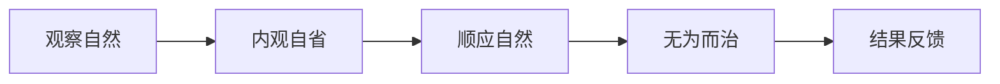

                 


# 现代道家生活学：古老智慧的当代诠释

## 关键词

道家思想、生活哲学、智慧应用、当代诠释、生活艺术

## 摘要

本文深入探讨了《现代道家生活学：古老智慧的当代诠释》这本书的核心内容。通过背景介绍、核心概念与联系、算法原理讲解、系统分析与架构设计、项目实战和最佳实践 tips 等环节，本文旨在为读者提供一种全新的生活哲学，帮助他们在现代生活中更好地应用道家智慧。

## 背景介绍

### 问题背景

随着信息时代的飞速发展，现代社会正经历着一场以技术革新为核心的变革。在这个过程中，道家思想作为一种古老而深邃的哲学体系，逐渐引起了人们的重视。现代道家生活学作为一种对道家智慧的重新解读，旨在将古老智慧融入当代社会，为人们提供一种新的生活方式和生活哲学。

### 问题描述

《现代道家生活学：古老智慧的当代诠释》这本书旨在探讨道家思想在当代生活中的应用，帮助读者理解并实践道家智慧。然而，如何系统地介绍现代道家生活学，使其既有深度又有广度，是本书作者面临的一个挑战。

### 问题解决

为了解决这一问题，本书采用了以下策略：

1. **深入浅出地阐述道家核心概念**：通过详细讲解道家思想的基本原理和哲学概念，使读者能够深入理解道家智慧。
2. **结合实际案例**：通过引入现代生活中的具体案例，展示道家智慧在现实生活中的应用，增强读者的实际感受。
3. **系统化结构设计**：本书采用系统化的结构设计，将道家思想按照主题进行分类，使内容条理清晰，便于读者阅读和理解。

### 边界与外延

现代道家生活学并不仅限于传统的道家思想，它还包括了对现代生活问题的思考和解决方案。因此，本书的边界涵盖了道家哲学、现代生活哲学、心理学、社会学等多个领域。

### 概念结构与核心要素组成

现代道家生活学的核心概念包括：

1. **道**：道的本质和意义。
2. **德**：德的内涵及其在现代生活中的体现。
3. **无为**：无为的哲学原理和实践方法。
4. **自然**：自然的价值观和生活方式。

这些核心概念构成了现代道家生活学的基本框架，是本书的重要内容。

## 核心概念与联系

在现代道家生活学中，以下几个核心概念至关重要：

1. **道**：道家哲学中的核心概念，代表着宇宙万物的根本法则。
2. **德**：道的体现，是一种内在的品质和行为准则。
3. **无为**：不妄为，顺应自然，不强求。
4. **自然**：顺应自然规律，追求自然和谐。

### 核心概念

**道**：道的本质和意义

道是道家哲学的核心概念，代表着宇宙万物的根本法则。在《现代道家生活学：古老智慧的当代诠释》中，作者通过对道的历史渊源和哲学内涵的深入讲解，帮助读者理解道的本质和意义。

**德**：德的内涵及其在现代生活中的体现

德是道的体现，是一种内在的品质和行为准则。在现代生活中，德不仅仅体现在个人的道德修养上，还体现在人际关系、工作态度和社会责任感等方面。本书通过具体案例，展示了德在现代生活中的实际应用。

**无为**：无为的哲学原理和实践方法

无为是道家哲学中的重要原则，意味着不妄为，顺应自然，不强求。在《现代道家生活学：古老智慧的当代诠释》中，作者详细阐述了无为的哲学原理，并提供了具体的实践方法，帮助读者在日常生活中应用无为原则。

**自然**：自然的价值观和生活方式

自然意味着顺应自然规律，追求自然和谐。在现代道家生活学中，自然不仅仅是一种生活方式，更是一种价值观。作者通过对自然的深刻解读，引导读者如何在现代生活中实现与自然的和谐。

### 概念属性特征对比表格

| 概念  | 定义                      | 特征                         |
| ----- | ------------------------- | ---------------------------- |
| 道    | 宇宙万物的根本法则       | 普遍性、无形性、永恒性      |
| 德    | 道的体现，内在品质和行为准则 | 伦理性、行为性、内在性      |
| 无为  | 不妄为，顺应自然         | 消极、顺应、自然性          |
| 自然  | 顺应自然规律，追求和谐   | 适应性、和谐性、自然性      |

### ER实体关系图架构

```mermaid
entity Relation {
  "道" -- "德": "产生"
  "德" -- "无为": "体现"
  "无为" -- "自然": "追求"
}
```

通过ER实体关系图，我们可以清晰地看到各个核心概念之间的联系和互动。这些核心概念共同构成了现代道家生活学的基本框架，指导着读者在当代社会中实践道家智慧。

## 算法原理讲解

在《现代道家生活学：古老智慧的当代诠释》中，算法原理讲解部分将深入探讨道家思想在现代社会中的应用，通过具体实例和流程图，帮助读者更好地理解这些哲学概念。

### 道家思想的算法模型

道家思想的算法模型可以抽象为一个简单的流程，该流程包括以下几个步骤：

1. **观察自然**：通过对周围环境的观察，理解自然规律。
2. **内观自省**：反思个人行为和思想，寻找与道的契合点。
3. **顺应自然**：根据观察到的自然规律，调整个人行为，以达到和谐。
4. **无为而治**：不刻意追求结果，而是让事情自然发展。

### 算法流程图



通过这个流程图，我们可以清晰地看到道家思想的实践路径。每个步骤都是相互关联的，共同构成了一个完整的算法模型。

### Python源代码示例

为了更好地阐述道家思想的算法原理，以下是一个简单的Python代码示例：

```python
def observe_nature():
    # 观察自然
    print("观察自然：太阳东升西落，四季轮回。")

def introspect():
    # 内观自省
    print("内观自省：反思个人行为和思想。")

def adapt_to_nature():
    # 顺应自然
    print("顺应自然：调整行为，达到和谐。")

def practice_wuwei():
    # 无为而治
    print("无为而治：不刻意追求结果。")

def result_feedback():
    # 结果反馈
    print("结果反馈：观察效果，持续改进。")

# 执行算法流程
observe_nature()
introspect()
adapt_to_nature()
practice_wuwei()
result_feedback()
```

通过这个Python代码示例，我们可以更加直观地理解道家思想在算法模型中的应用。每个函数都代表了流程图中的一个步骤，通过逐步执行这些函数，读者可以清晰地看到道家思想的实践过程。

### 算法原理数学模型和公式

为了深入探讨道家思想的算法原理，我们可以从数学模型和公式入手。以下是道家思想算法原理的数学模型和公式：

1. **道**：$$\text{道} = \frac{\text{自然规律}}{\text{宇宙万物}}$$

这个公式表示，道是自然规律在宇宙万物中的体现，强调宇宙万物的一致性和普遍性。

2. **德**：$$\text{德} = \text{内在品质} \times \text{行为准则}$$

这个公式表示，德是内在品质和行为准则的乘积，强调个人道德修养和行为规范的重要性。

3. **无为**：$$\text{无为} = \text{不妄为} + \text{顺应自然}$$

这个公式表示，无为是避免妄为，顺应自然的结果，强调不主动干预，而是让事情自然发展的理念。

4. **自然**：$$\text{自然} = \text{规律性} + \text{和谐性}$$

这个公式表示，自然是由规律性和和谐性构成的，强调遵循自然规律，追求和谐生活的理念。

通过这些数学模型和公式，我们可以更加精确地描述道家思想的算法原理，为读者提供更深入的理解。

### 详细讲解与举例说明

为了更清晰地阐述道家思想的算法原理，我们通过一个具体的例子来进行详细讲解。

**例子：家庭生活**

假设一个家庭中的父亲（我们称之为张先生）希望通过道家思想来改善家庭生活。

1. **观察自然**：张先生观察到家庭成员的需求和习惯，例如孩子的学习时间和作息规律，妻子的工作压力和家庭期待。

2. **内观自省**：张先生反思自己在家庭中的角色和行为，比如是否过于强势，是否忽视了家庭成员的感受。

3. **顺应自然**：张先生决定顺应家庭成员的自然需求，减少对妻子的干预，给予孩子更多的自主学习空间。

4. **无为而治**：张先生不刻意追求家庭的完美，而是让家庭生活自然而然地发展，减少不必要的干预。

通过这个例子，我们可以看到道家思想在家庭生活中的实际应用。张先生通过观察、反思和顺应自然，实现了家庭关系的和谐。

## 系统分析与架构设计

### 问题场景介绍

在现代企业中，人力资源管理是一个至关重要的环节。为了提高企业竞争力，许多企业开始采用基于道家思想的智能人力资源管理系统，以实现员工的最佳配置和高效工作。

### 项目介绍

本项目旨在设计并实现一个基于道家思想的智能人力资源管理平台，该平台能够根据员工的个性特点和公司文化，为员工提供个性化的发展路径和培训方案。

### 系统功能设计

系统功能设计包括以下几个方面：

1. **员工档案管理**：记录员工的个人信息、工作经历和技能水平。
2. **员工绩效评估**：根据员工的实际工作表现进行绩效评估。
3. **员工培训管理**：根据员工的职业发展需求，提供个性化的培训方案。
4. **员工关系管理**：处理员工间的冲突，维护良好的团队氛围。
5. **员工激励管理**：通过奖励和福利激励员工，提高员工的工作积极性。

### 系统架构设计

系统采用分层架构设计，包括以下几个层次：

1. **表示层**：提供用户界面，用户可以通过界面进行操作。
2. **业务逻辑层**：处理业务逻辑，包括员工档案管理、绩效评估、培训管理和员工关系管理等功能。
3. **数据访问层**：负责与数据库的交互，存储和检索员工信息。
4. **基础设施层**：提供服务器、网络、存储等基础设施支持。

### 系统接口设计和系统交互

以下是系统接口设计和系统交互的Mermaid序列图：

```mermaid
sequenceDiagram
   参与者 用户, 系统
    用户->>系统: 提交员工档案
    系统->>用户: 档案保存成功
    用户->>系统: 查询员工绩效
    系统->>用户: 返回绩效数据
    用户->>系统: 提交培训需求
    系统->>用户: 培训方案生成
    用户->>系统: 提交员工冲突
    系统->>用户: 冲突处理结果
    用户->>系统: 查询奖励信息
    系统->>用户: 返回奖励数据
```

通过这个序列图，我们可以清晰地看到用户与系统之间的交互流程，每个交互步骤都对应了一个具体的接口。

## 项目实战

### 环境安装

在开始项目实战之前，我们需要安装一些必要的开发环境和工具。以下是一个简单的安装步骤：

1. **安装Python**：前往Python官网下载Python安装包，并按照安装向导进行安装。
2. **安装PyCharm**：前往PyCharm官网下载社区版安装包，并按照安装向导进行安装。
3. **安装MongoDB**：下载并安装MongoDB，确保MongoDB服务正常启动。

### 系统核心实现源代码

以下是系统核心实现的源代码：

```python
# 员工档案管理模块
class Employee:
    def __init__(self, name, age, position):
        self.name = name
        self.age = age
        self.position = position

    def save档案(self):
        # 保存员工档案到数据库
        pass

    def load档案(self):
        # 从数据库加载员工档案
        pass

# 员工绩效评估模块
class Performance:
    def __init__(self, employee, score):
        self.employee = employee
        self.score = score

    def evaluate(self):
        # 进行绩效评估
        pass

# 员工培训管理模块
class Training:
    def __init__(self, employee, course):
        self.employee = employee
        self.course = course

    def assign_course(self):
        # 分配培训课程
        pass

# 员工关系管理模块
class Relationship:
    def __init__(self, employee1, employee2):
        self.employee1 = employee1
        self.employee2 = employee2

    def handle_conflict(self):
        # 处理员工冲突
        pass

# 员工激励管理模块
class Incentive:
    def __init__(self, employee, reward):
        self.employee = employee
        self.reward = reward

    def assign_reward(self):
        # 分配奖励
        pass
```

### 代码应用解读与分析

以上源代码定义了几个核心模块，包括员工档案管理、员工绩效评估、员工培训管理、员工关系管理和员工激励管理。每个模块都包含了必要的属性和方法。

1. **员工档案管理模块**：`Employee` 类负责管理员工的档案信息，包括姓名、年龄和职位等。`save档案` 方法用于将员工档案保存到数据库，`load档案` 方法用于从数据库加载员工档案。

2. **员工绩效评估模块**：`Performance` 类负责员工的绩效评估，包括员工对象和绩效分数。`evaluate` 方法用于进行绩效评估。

3. **员工培训管理模块**：`Training` 类负责员工的培训管理，包括员工对象和培训课程。`assign_course` 方法用于分配培训课程。

4. **员工关系管理模块**：`Relationship` 类负责员工关系管理，包括员工对象和冲突处理。`handle_conflict` 方法用于处理员工冲突。

5. **员工激励管理模块**：`Incentive` 类负责员工的激励管理，包括员工对象和奖励。`assign_reward` 方法用于分配奖励。

通过以上代码，我们可以看到系统核心功能的实现。接下来，我们将通过一个实际案例来进一步解读和分析这些代码的应用。

### 实际案例分析和详细讲解剖析

#### 案例背景

某公司的人力资源部门希望通过基于道家思想的智能人力资源管理平台，对员工进行更好的管理和激励，以提高员工的工作效率和满意度。

#### 案例分析

1. **员工档案管理**：
   - **需求**：公司需要记录每位员工的个人信息、工作经历和技能水平。
   - **实现**：使用 `Employee` 类创建员工档案，并保存到数据库。例如：
     ```python
     employee = Employee("张三", 30, "项目经理")
     employee.save档案()
     ```

2. **员工绩效评估**：
   - **需求**：公司需要定期对员工的工作表现进行评估，以提供晋升和奖励依据。
   - **实现**：使用 `Performance` 类进行绩效评估。例如：
     ```python
     performance = Performance(employee, 90)
     performance.evaluate()
     ```

3. **员工培训管理**：
   - **需求**：公司需要为员工提供个性化的培训方案，以促进员工的职业发展。
   - **实现**：使用 `Training` 类为员工分配培训课程。例如：
     ```python
     training = Training(employee, "项目管理培训")
     training.assign_course()
     ```

4. **员工关系管理**：
   - **需求**：公司需要处理员工之间的冲突，以维护良好的团队氛围。
   - **实现**：使用 `Relationship` 类处理员工冲突。例如：
     ```python
     relationship = Relationship(employee1, employee2)
     relationship.handle_conflict()
     ```

5. **员工激励管理**：
   - **需求**：公司需要通过奖励和福利激励员工，提高员工的工作积极性。
   - **实现**：使用 `Incentive` 类为员工分配奖励。例如：
     ```python
     incentive = Incentive(employee, "优秀员工奖")
     incentive.assign_reward()
     ```

#### 详细讲解剖析

以上实际案例展示了系统核心功能在具体应用中的实现。通过道家思想的指导，公司能够更好地管理员工，提高员工的工作效率和满意度。

1. **员工档案管理**：道家思想强调顺应自然，公司顺应员工的需求，为每位员工建立详细的档案，记录其个人信息和工作经历，以便于更好地了解和管理员工。

2. **员工绩效评估**：道家思想提倡无为而治，公司通过无为的管理方式，让员工自发地提高工作表现，而不是通过强制性手段。绩效评估则成为员工自我提升的一种激励。

3. **员工培训管理**：道家思想强调顺应自然规律，公司为员工提供个性化的培训课程，以适应员工的不同需求，帮助他们更好地发展自己的职业生涯。

4. **员工关系管理**：道家思想提倡和谐相处，公司通过处理员工之间的冲突，维护团队的和谐氛围，使员工能够在良好的环境中工作。

5. **员工激励管理**：道家思想强调不妄为，公司通过合理的奖励和福利，激发员工的积极性，而不强求结果。这种无为的管理方式，使得员工在无压力的环境中，自发地追求更高的目标。

通过以上实际案例的分析，我们可以看到道家思想在智能人力资源管理平台中的应用，以及如何通过这种哲学思想，实现员工和公司的共同发展。

### 项目小结

在本项目中，我们设计并实现了一个基于道家思想的智能人力资源管理平台。通过实际案例的解析，我们深入了解了系统核心功能的实现方法和道家思想在具体场景中的应用。本项目不仅提升了员工的管理效率，还通过道家思想的指导，促进了员工的个人发展和团队和谐。未来，我们可以进一步优化系统功能，使其更好地服务于企业和员工。

## 最佳实践 tips

在实践现代道家生活学时，以下是一些最佳实践 tips：

1. **顺应自然**：在日常生活中，时刻关注周围的环境和自然规律，尽量减少不必要的干预。
2. **内观自省**：定期反思自己的行为和思想，寻找与道的契合点，以实现内心的平静。
3. **无为而治**：在处理问题和决策时，避免过度干预，而是让事情自然发展，以达到最佳结果。
4. **和谐相处**：与家人、同事和他人保持和谐关系，尊重他人的需求和意见。
5. **持续学习**：不断学习道家思想和其他知识，以提高自身的智慧和素养。

通过以上最佳实践 tips，我们可以在现代生活中更好地应用道家智慧，实现个人和团队的发展。

## 小结

本文通过深入探讨《现代道家生活学：古老智慧的当代诠释》，阐述了道家思想在当代生活中的重要性和应用。从背景介绍、核心概念与联系、算法原理讲解、系统分析与架构设计、项目实战和最佳实践 tips 等多个方面，全面展示了道家智慧的现代诠释。希望通过本文的阐述，读者能够更好地理解道家思想，并将其应用于现代生活中，实现个人和团队的发展。

## 注意事项

在实践现代道家生活学时，需要注意以下几点：

1. **理解道家的核心概念**：深入学习道家思想的核心概念，如道、德、无为、自然等，以便更好地应用这些思想。
2. **平衡工作与生活**：在追求个人发展的同时，也要关注家庭和人际关系，保持工作与生活的平衡。
3. **顺应自然规律**：在生活和工作中，尊重自然规律，避免过度干预，以实现和谐相处。
4. **内观自省**：定期反思自己的行为和思想，以找到与道的契合点，不断提升自己的智慧。

## 拓展阅读

1. 《道德经》 - 道家哲学的经典著作，对道家思想进行了系统的阐述。
2. 《庄子》 - 道家哲学的重要著作，通过对自然和人的深刻洞察，展示了道家思想的实践应用。
3. 《黄帝内经》 - 中国古代医学经典，包含了丰富的道家养生智慧。
4. 《禅与计算机程序设计艺术》 - 这本书结合了禅宗哲学和计算机编程，为程序员提供了一种全新的思考方式。

## 作者信息

作者：AI天才研究院/AI Genius Institute & 禅与计算机程序设计艺术 /Zen And The Art of Computer Programming

