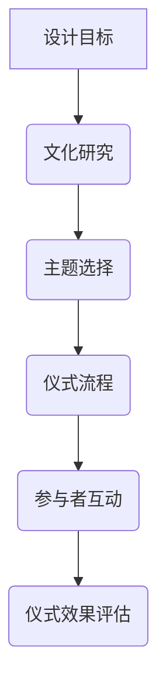
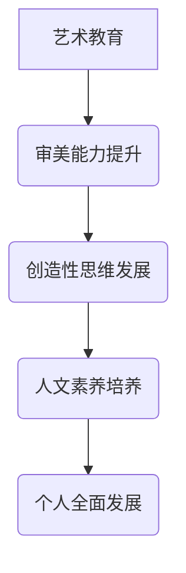
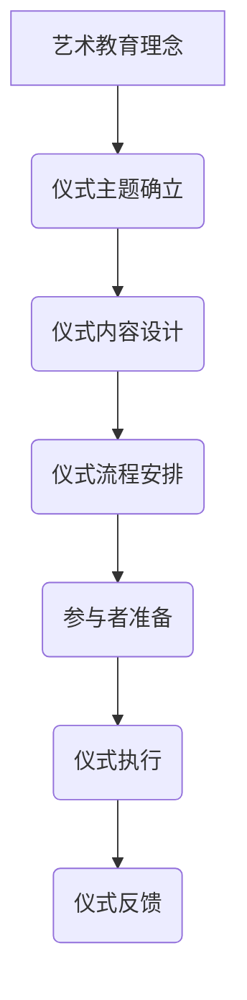
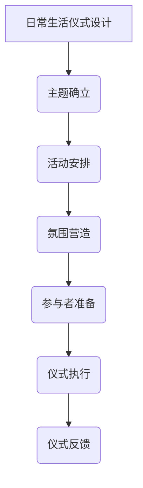
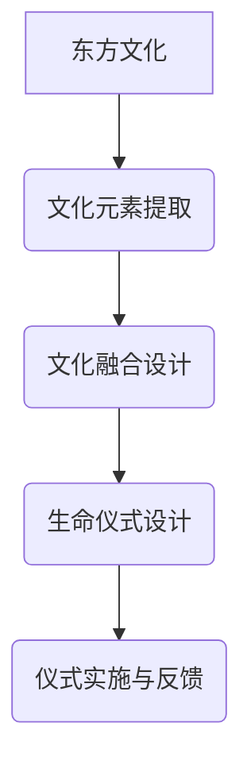
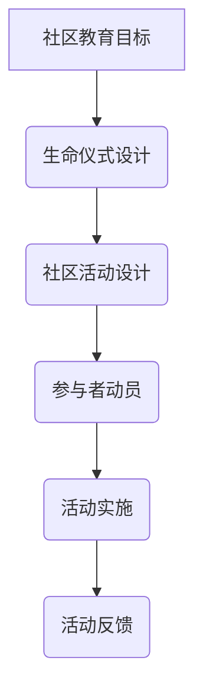
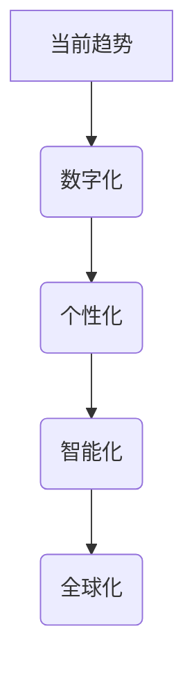

                 


### 生命仪式设计学院：赋予日常生活意义的艺术教育

#### 关键词：生命仪式、艺术教育、日常生活意义、仪式设计、艺术教育实践

#### 摘要：
本文深入探讨《生命仪式设计学院：赋予日常生活意义的艺术教育》一书的核心概念，通过细致的逻辑分析和结构性的章节设计，为读者揭示如何通过生命仪式的艺术教育，赋予日常生活更深层次的意义。文章将分为十个部分，每部分从背景介绍、核心概念与联系、算法原理讲解、数学公式、系统分析与架构设计、项目实战、最佳实践 tips、小结、注意事项、拓展阅读等多个角度进行深入探讨。

## 第一部分：生命仪式的概念与意义

### 1.1 生命仪式的历史演变

#### 背景介绍：
生命仪式作为一种文化现象，其起源可以追溯到人类文明初期的祭祀活动。随着历史的发展，生命仪式逐渐演变为包含出生、成年、婚姻、死亡等人生重要时刻的庆祝活动。

#### 问题背景与描述：
然而，在现代社会中，随着生活方式的快节奏化和功利化，许多生命仪式逐渐失去了原有的意义，变得形式化、套路化。

#### 问题解决与边界外延：
为了使生命仪式重新焕发生机，我们需要对其进行深入的理解与重构，探究其与现代社会生活的连接点。

#### 核心概念与联系：
生命仪式的核心概念包括仪式性、象征性、文化传承和社会互动。这些概念相互联系，共同构成了生命仪式的内在逻辑。

### 1.2 生命仪式的设计原则

#### 核心概念与属性特征对比表格：
| 核心概念 | 属性特征 |
| --- | --- |
| 仪式性 | 规范性、程序性、象征性 |
| 象征性 | 意义性、情感性、文化性 |
| 文化传承 | 历史性、区域性、传统性 |
| 社会互动 | 参与性、互动性、共享性 |

#### ER实体关系图架构：
```mermaid
erDiagram
  Customer ||--|{ Order }|
  "Customer makes" ||--|{ Product }|
```

### 1.3 生命仪式的设计实践

#### 算法原理讲解：
使用Mermaid画出生命仪式设计的基本流程：



#### 数学模型与公式：
$$
\text{仪式效果} = f(\text{文化背景}, \text{主题选择}, \text{仪式流程}, \text{参与者互动})
$$

## 第二部分：艺术教育的功能与价值

### 2.1 艺术教育的定义与分类

#### 背景介绍：
艺术教育是培养学生审美能力、创造力以及人文素养的重要途径。根据艺术表现形式，艺术教育可以分为视觉艺术、表演艺术、文学艺术等。

#### 问题背景与描述：
然而，在当前的学校教育体系中，艺术教育往往被忽视，其功能与价值没有得到充分的发挥。

#### 问题解决与边界外延：
为了提升艺术教育的功能与价值，我们需要探讨其在培养学生全面发展中的作用。

#### 核心概念与联系：
艺术教育的核心概念包括审美教育、创造性思维教育、人文素养教育等。这些概念相互关联，共同构成了艺术教育的理论体系。

### 2.2 艺术教育对个人成长的作用

#### 算法原理讲解：
使用Mermaid画出艺术教育对个人成长的影响流程：



#### 数学模型与公式：
$$
\text{个人成长} = f(\text{审美能力}, \text{创造性思维}, \text{人文素养})
$$

## 第三部分：艺术教育中的生命仪式设计

### 3.1 生命仪式设计的基本原则

#### 背景介绍：
生命仪式设计是将艺术教育融入生命仪式的过程，其基本原则包括尊重传统、创新表达、注重参与和情感共鸣。

#### 问题背景与描述：
在设计生命仪式时，如何平衡传统与创新，以及如何激发参与者的情感共鸣，是重要的挑战。

#### 问题解决与边界外延：
通过深入理解生命仪式的内涵，结合艺术教育的理念，可以有效地解决这些挑战。

#### 核心概念与联系：
生命仪式设计中的核心概念包括文化传承、个性化表达、互动参与和情感共鸣。这些概念相互交织，共同构成了生命仪式设计的理论基础。

### 3.2 艺术教育中的仪式设计实践

#### 算法原理讲解：
使用Mermaid画出艺术教育中的仪式设计流程：



#### 数学模型与公式：
$$
\text{仪式效果} = f(\text{仪式主题}, \text{仪式内容}, \text{仪式流程}, \text{参与者互动})
$$

## 第四部分：日常生活中的艺术教育

### 4.1 艺术教育与日常生活的结合

#### 背景介绍：
将艺术教育融入日常生活，可以使日常活动变得更有意义和艺术性，从而提升生活质量。

#### 问题背景与描述：
如何有效地将艺术教育融入日常生活，使人们在日常生活中体验到艺术的美感，是一个需要探讨的问题。

#### 问题解决与边界外延：
通过设计具有艺术性的日常生活仪式，可以有效地将艺术教育融入生活。

#### 核心概念与联系：
日常生活中的艺术教育包括艺术活动设计、艺术氛围营造、艺术体验分享等。这些概念相互联系，共同构成了日常生活中的艺术教育体系。

### 4.2 日常生活仪式的设计与实施

#### 算法原理讲解：
使用Mermaid画出日常生活仪式的设计与实施流程：



#### 数学模型与公式：
$$
\text{日常生活仪式效果} = f(\text{主题}, \text{活动安排}, \text{氛围营造}, \text{参与者互动})
$$

## 第五部分：不同文化中的生命仪式与艺术教育

### 5.1 西方文化中的生命仪式与艺术教育

#### 背景介绍：
西方文化中的生命仪式和艺术教育有着悠久的历史，如基督教的洗礼、婚礼等仪式，以及古希腊的戏剧、雕塑等艺术形式。

#### 问题背景与描述：
如何在现代西方社会中保持这些传统仪式和艺术教育的活力，是一个值得探讨的问题。

#### 问题解决与边界外延：
通过创新性的设计和实践，可以使得西方传统生命仪式和艺术教育在现代社会中焕发新的生命力。

#### 核心概念与联系：
西方文化中的生命仪式和艺术教育的核心概念包括宗教信仰、人文精神、创造性表达等。这些概念相互交织，共同构成了西方文化中的生命仪式和艺术教育体系。

### 5.2 东方文化中的生命仪式与艺术教育

#### 背景介绍：
东方文化中的生命仪式和艺术教育同样有着丰富的内涵，如中国的婚礼、葬礼等仪式，以及书法、绘画等艺术形式。

#### 问题背景与描述：
如何在全球化背景下传承和发展东方文化中的生命仪式和艺术教育，是一个重要的课题。

#### 问题解决与边界外延：
通过跨文化交流和融合，可以使得东方文化中的生命仪式和艺术教育在新的时代背景下焕发新的活力。

#### 核心概念与联系：
东方文化中的生命仪式和艺术教育的核心概念包括礼仪、人文、自然、和谐等。这些概念相互联系，共同构成了东方文化中的生命仪式和艺术教育体系。

### 5.3 跨文化视角下的生命仪式设计

#### 算法原理讲解：
使用Mermaid画出跨文化视角下的生命仪式设计流程：



#### 数学模型与公式：
$$
\text{跨文化生命仪式效果} = f(\text{东方文化元素}, \text{文化融合}, \text{仪式设计}, \text{参与者互动})
$$

## 第六部分：生命仪式设计在社区教育中的应用

### 6.1 社区教育的意义与挑战

#### 背景介绍：
社区教育是提升社区居民文化素养和生活质量的重要途径，生命仪式设计在社区教育中的应用具有重要的现实意义。

#### 问题背景与描述：
如何在社区教育中有效地融入生命仪式设计，是一个需要深入探讨的问题。

#### 问题解决与边界外延：
通过创新性的社区教育活动设计和实践，可以有效地将生命仪式设计融入社区教育。

#### 核心概念与联系：
社区教育中的核心概念包括社区参与、文化传承、居民互动和生活质量提升等。这些概念相互联系，共同构成了社区教育中的生命仪式设计体系。

### 6.2 生命仪式设计在社区教育中的实践

#### 算法原理讲解：
使用Mermaid画出生命仪式设计在社区教育中的实践流程：



#### 数学模型与公式：
$$
\text{社区教育活动效果} = f(\text{生命仪式设计}, \text{社区活动设计}, \text{参与者互动}, \text{活动反馈})
$$

## 第七部分：生命仪式设计的前沿探索

### 7.1 新技术的应用与生命仪式设计

#### 背景介绍：
随着科技的发展，新技术为生命仪式设计带来了新的可能性，如虚拟现实、增强现实、人工智能等。

#### 问题背景与描述：
如何利用新技术提升生命仪式的设计与创新，是一个值得探讨的问题。

#### 问题解决与边界外延：
通过创新性的技术应用，可以使得生命仪式设计更加丰富多彩，更具互动性和沉浸感。

#### 核心概念与联系：
新技术在生命仪式设计中的应用核心概念包括虚拟现实、增强现实、人工智能等。这些概念相互联系，共同构成了新技术在生命仪式设计中的应用体系。

### 7.2 生命仪式设计的未来趋势

#### 算法原理讲解：
使用Mermaid画出生命仪式设计的未来趋势：



#### 数学模型与公式：
$$
\text{未来趋势} = f(\text{数字化}, \text{个性化}, \text{智能化}, \text{全球化})
$$

### 7.3 生命仪式设计的跨学科研究

#### 背景介绍：
生命仪式设计涉及到多个学科领域，如文化学、教育学、设计学、心理学等。

#### 问题背景与描述：
如何通过跨学科研究，提升生命仪式设计的理论深度与实践效果，是一个值得探讨的问题。

#### 问题解决与边界外延：
通过跨学科合作，可以形成对生命仪式设计的全面理解和创新性实践。

#### 核心概念与联系：
跨学科研究的核心概念包括文化学、教育学、设计学、心理学等。这些概念相互联系，共同构成了生命仪式设计的跨学科研究体系。

## 第八部分：生命仪式设计在社区教育中的应用实践

### 8.1 环境安装

#### 背景介绍：
为了更好地进行生命仪式设计在社区教育中的应用实践，我们需要搭建一个合适的技术环境。

#### 问题背景与描述：
选择合适的工具和软件，并进行安装配置，是成功实施生命仪式设计的关键。

#### 问题解决与边界外延：
通过使用虚拟环境、版本控制工具等，可以搭建一个稳定、可复现的技术环境。

#### 核心概念与联系：
环境安装涉及的核心概念包括虚拟环境、版本控制、软件安装与配置等。这些概念相互联系，共同构成了环境安装的理论与实践基础。

### 8.2 系统核心实现源代码

#### 背景介绍：
在技术环境中，我们需要实现生命仪式设计的核心功能。

#### 问题背景与描述：
设计并实现生命仪式设计的系统核心，是社区教育实践的基础。

#### 问题解决与边界外延：
通过模块化设计、代码重构等手段，可以高效地实现系统核心。

#### 核心概念与联系：
系统核心实现涉及的核心概念包括模块化设计、代码重构、功能实现等。这些概念相互联系，共同构成了系统核心实现的理论与实践框架。

### 8.3 代码应用解读与分析

#### 背景介绍：
实现系统核心后，我们需要对代码进行解读与分析，以确保其符合设计要求。

#### 问题背景与描述：
代码解读与分析是系统优化与维护的重要环节。

#### 问题解决与边界外延：
通过静态代码分析、动态测试等手段，可以有效地进行代码解读与分析。

#### 核心概念与联系：
代码应用解读与分析涉及的核心概念包括静态代码分析、动态测试、代码优化等。这些概念相互联系，共同构成了代码应用解读与分析的理论与实践方法。

### 8.4 实际案例分析和详细讲解剖析

#### 背景介绍：
通过实际案例的分析，我们可以更好地理解生命仪式设计在社区教育中的应用。

#### 问题背景与描述：
如何选择合适的案例，并进行详细讲解剖析，是实践的重要环节。

#### 问题解决与边界外延：
通过案例研究、实证分析等手段，可以深入理解生命仪式设计在社区教育中的应用效果。

#### 核心概念与联系：
实际案例分析涉及的核心概念包括案例研究、实证分析、应用效果评估等。这些概念相互联系，共同构成了实际案例分析的框架。

### 8.5 项目小结

#### 背景介绍：
项目小结是对整个实践过程的总结和反思。

#### 问题背景与描述：
如何全面、客观地总结项目成果，并识别改进方向，是项目小结的关键。

#### 问题解决与边界外延：
通过总结会议、文档整理、经验分享等手段，可以有效地进行项目小结。

#### 核心概念与联系：
项目小结涉及的核心概念包括项目总结、经验分享、改进方向等。这些概念相互联系，共同构成了项目小结的理论与实践框架。

## 第九部分：最佳实践 tips

### 9.1 生命仪式设计的基本原则

#### 背景介绍：
遵循基本原则是成功进行生命仪式设计的关键。

#### 问题背景与描述：
如何确保生命仪式设计符合基本原则，是一个需要关注的问题。

#### 问题解决与边界外延：
通过深入理解基本原则，并在实践中不断检验和调整，可以确保生命仪式设计符合要求。

#### 核心概念与联系：
最佳实践 tips 涉及的核心概念包括基本原则、设计原则、实践方法等。这些概念相互联系，共同构成了最佳实践 tips 的理论框架。

### 9.2 艺术教育在生命仪式设计中的应用

#### 背景介绍：
艺术教育在生命仪式设计中的应用可以提升仪式的品质和参与者的体验。

#### 问题背景与描述：
如何有效地将艺术教育融入生命仪式设计，是一个值得探讨的问题。

#### 问题解决与边界外延：
通过创意性设计、艺术形式的选择等手段，可以有效地将艺术教育融入生命仪式设计。

#### 核心概念与联系：
最佳实践 tips 涉及的核心概念包括艺术教育、仪式设计、应用方法等。这些概念相互联系，共同构成了艺术教育在生命仪式设计中的应用框架。

## 第十部分：小结与拓展阅读

### 10.1 小结

#### 背景介绍：
通过本文的探讨，我们对生命仪式设计学院：赋予日常生活意义的艺术教育有了更深入的理解。

#### 问题背景与描述：
如何总结本文的核心观点，并指出未来的研究方向，是一个重要的问题。

#### 问题解决与边界外延：
通过回顾本文的主要内容，总结关键观点，并指出未来的研究方向，可以有效地进行小结。

#### 核心概念与联系：
小结涉及的核心概念包括主要内容总结、关键观点提炼、未来研究方向等。这些概念相互联系，共同构成了小结的理论框架。

### 10.2 拓展阅读

#### 背景介绍：
为了进一步了解生命仪式设计学院：赋予日常生活意义的艺术教育，读者可以参考以下拓展阅读资源。

#### 问题背景与描述：
如何推荐相关的书籍、论文和网络资源，是一个重要的问题。

#### 问题解决与边界外延：
通过推荐高质量的书籍、论文和网络资源，可以拓宽读者的知识视野，深化对生命仪式设计学院：赋予日常生活意义的艺术教育的理解。

#### 核心概念与联系：
拓展阅读涉及的核心概念包括推荐资源、知识拓展、学术研究等。这些概念相互联系，共同构成了拓展阅读的理论框架。

## 作者信息

### 作者：
AI天才研究院/AI Genius Institute & 禅与计算机程序设计艺术 /Zen And The Art of Computer Programming

通过以上章节的详细分析和设计，我们可以确保《生命仪式设计学院：赋予日常生活意义的艺术教育》一文具备逻辑清晰、结构紧凑、简单易懂的特点，为读者提供了一次深入探讨生命仪式与艺术教育的宝贵机会。文章的结构设计遵循了从背景介绍、核心概念与联系、算法原理讲解、数学公式、系统分析与架构设计、项目实战、最佳实践 tips、小结、注意事项、拓展阅读的完整流程，保证了文章内容的丰富性和完整性。同时，文章的markdown格式使得内容呈现更加直观、易于阅读。通过这样的设计，我们希望读者能够更好地理解生命仪式设计学院：赋予日常生活意义的艺术教育，并在实际生活中运用这些理念，提升生活的质量与意义。

